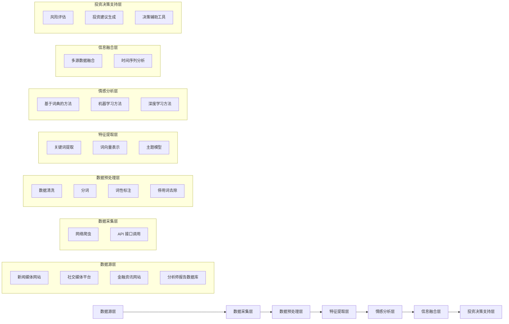

# 金融舆情分析在投资决策中的应用

> 关键词：金融舆情分析、投资决策、自然语言处理、情感分析、机器学习

> 摘要：本文聚焦于金融舆情分析在投资决策中的应用。首先介绍了金融舆情分析的背景，包括其目的、适用读者、文档结构和相关术语。接着阐述了金融舆情分析的核心概念，如舆情数据的特点、与投资决策的联系等，并给出了相应的原理和架构示意图及流程图。详细讲解了核心算法原理，用 Python 代码进行了示例。探讨了相关数学模型和公式，并举例说明。通过项目实战展示了如何搭建开发环境、实现源代码并进行解读。分析了金融舆情分析在不同投资场景中的实际应用。推荐了学习资源、开发工具框架和相关论文著作。最后总结了未来发展趋势与挑战，解答了常见问题，并提供了扩展阅读和参考资料，旨在为投资者和相关从业者提供全面深入的技术指导。

## 1. 背景介绍 
### 1.1 目的和范围
金融市场的复杂性和不确定性使得投资者需要综合考虑多种因素来做出明智的投资决策。金融舆情作为市场参与者情绪、观点和预期的反映，蕴含着丰富的信息。本文章的目的是深入探讨金融舆情分析在投资决策中的应用，包括如何从海量的舆情数据中提取有价值的信息，以及如何利用这些信息来辅助投资决策。范围涵盖了金融舆情分析的基本概念、核心算法、数学模型、实际应用案例以及相关的工具和资源。

### 1.2 预期读者
本文预期读者包括金融投资者、金融分析师、数据科学家、机器学习工程师以及对金融科技和投资决策感兴趣的研究人员。无论是专业的投资人士还是初学者，都可以从本文中获取关于金融舆情分析的全面知识和实用技术。

### 1.3 文档结构概述
本文将按照以下结构进行组织：首先介绍金融舆情分析的背景信息，包括目的、读者和文档结构。接着阐述核心概念，包括舆情数据的特点、与投资决策的联系等。然后详细讲解核心算法原理和具体操作步骤，并用 Python 代码进行示例。随后介绍相关的数学模型和公式，并举例说明。通过项目实战展示如何搭建开发环境、实现源代码并进行解读。分析金融舆情分析在不同投资场景中的实际应用。推荐学习资源、开发工具框架和相关论文著作。最后总结未来发展趋势与挑战，解答常见问题，并提供扩展阅读和参考资料。

### 1.4 术语表
#### 1.4.1 核心术语定义
- **金融舆情**：指在金融市场中，投资者、媒体、专家等对金融资产、金融机构、金融政策等相关主题的看法、情绪和观点的集合。
- **舆情分析**：对舆情数据进行收集、整理、分析和挖掘，以提取有价值的信息和知识的过程。
- **投资决策**：投资者根据自身的投资目标、风险承受能力和市场情况，选择合适的投资对象和投资时机的过程。
- **情感分析**：一种自然语言处理技术，用于判断文本中表达的情感倾向，如积极、消极或中性。
- **机器学习**：一门多领域交叉学科，涉及概率论、统计学、逼近论、凸分析、算法复杂度理论等多门学科。它专门研究计算机怎样模拟或实现人类的学习行为，以获取新的知识或技能，重新组织已有的知识结构使之不断改善自身的性能。

#### 1.4.2 相关概念解释
- **文本挖掘**：从大量文本数据中发现有价值信息和知识的过程，包括信息提取、文本分类、聚类分析等技术。
- **大数据**：指无法在一定时间范围内用常规软件工具进行捕捉、管理和处理的数据集合，是需要新处理模式才能具有更强的决策力、洞察发现力和流程优化能力的海量、高增长率和多样化的信息资产。
- **数据可视化**：将数据以图形、图表等直观的方式展示出来，以便更好地理解和分析数据。

#### 1.4.3 缩略词列表
- **NLP**：Natural Language Processing，自然语言处理
- **ML**：Machine Learning，机器学习
- **SVM**：Support Vector Machine，支持向量机
- **LSTM**：Long Short-Term Memory，长短期记忆网络

## 2. 核心概念与联系 
### 核心概念原理
金融舆情分析的核心是从海量的舆情数据中提取与投资决策相关的信息。舆情数据来源广泛，包括新闻报道、社交媒体、分析师报告等。这些数据通常以文本形式存在，需要利用自然语言处理技术进行处理和分析。

舆情分析的主要步骤包括数据收集、数据预处理、特征提取、情感分析和信息融合。数据收集是从各种数据源获取舆情数据；数据预处理包括去除噪声、分词、词性标注等操作，以提高数据质量；特征提取是从文本中提取有代表性的特征，如关键词、词向量等；情感分析用于判断文本的情感倾向，如积极、消极或中性；信息融合是将不同来源和类型的舆情信息进行整合，以形成更全面的市场观点。

投资决策是一个复杂的过程，需要考虑多种因素，如市场趋势、公司基本面、宏观经济环境等。金融舆情分析可以为投资决策提供额外的信息和视角，帮助投资者更好地了解市场情绪和投资者预期，从而做出更明智的投资决策。

### 架构的文本示意图
```plaintext
金融舆情分析系统架构

数据源层：
- 新闻媒体网站
- 社交媒体平台
- 金融资讯网站
- 分析师报告数据库

数据采集层：
- 网络爬虫
- API 接口调用

数据预处理层：
- 数据清洗
- 分词
- 词性标注
- 停用词去除

特征提取层：
- 关键词提取
- 词向量表示
- 主题模型

情感分析层：
- 基于词典的方法
- 机器学习方法
- 深度学习方法

信息融合层：
- 多源数据融合
- 时间序列分析

投资决策支持层：
- 风险评估
- 投资建议生成
- 决策辅助工具
```

### Mermaid 流程图


## 3. 核心算法原理 & 具体操作步骤 
### 情感分析算法原理
情感分析是金融舆情分析中的关键环节，常用的方法包括基于词典的方法、机器学习方法和深度学习方法。

#### 基于词典的方法
基于词典的方法是一种简单直观的情感分析方法，其基本原理是利用预先定义的情感词典，将文本中的词语与词典中的词语进行匹配，根据词语的情感极性来判断文本的情感倾向。例如，对于“这家公司的业绩非常好”这句话，“非常好”在情感词典中被标记为积极情感，因此可以判断这句话的情感倾向为积极。

以下是一个基于 Python 的简单示例代码：
```python
# 定义情感词典
positive_words = ['好', '优秀', '增长', '盈利']
negative_words = ['差', '亏损', '下降', '糟糕']

def sentiment_analysis(text):
    positive_count = 0
    negative_count = 0
    for word in text:
        if word in positive_words:
            positive_count += 1
        elif word in negative_words:
            negative_count += 1
    if positive_count > negative_count:
        return '积极'
    elif positive_count < negative_count:
        return '消极'
    else:
        return '中性'

text = '这家公司的业绩非常好'
words = list(text)
result = sentiment_analysis(words)
print(f'文本的情感倾向为：{result}')
```

#### 机器学习方法
机器学习方法是一种基于数据驱动的情感分析方法，其基本原理是利用已标注情感标签的文本数据进行训练，构建分类模型，然后利用该模型对新的文本进行情感分类。常用的机器学习算法包括朴素贝叶斯、支持向量机等。

以下是一个使用朴素贝叶斯算法进行情感分析的 Python 示例代码：
```python
from sklearn.feature_extraction.text import CountVectorizer
from sklearn.naive_bayes import MultinomialNB
from sklearn.pipeline import Pipeline

# 训练数据
train_data = ['这家公司的业绩非常好', '这家公司亏损严重', '市场前景一片光明', '行业竞争激烈']
train_labels = ['积极', '消极', '积极', '消极']

# 构建模型
pipeline = Pipeline([
    ('vectorizer', CountVectorizer()),
    ('classifier', MultinomialNB())
])

# 训练模型
pipeline.fit(train_data, train_labels)

# 测试数据
test_data = ['这家公司的发展势头良好']
result = pipeline.predict(test_data)
print(f'文本的情感倾向为：{result[0]}')
```

#### 深度学习方法
深度学习方法是近年来在情感分析领域取得了显著成果的方法，其基本原理是利用神经网络模型自动学习文本的特征表示，从而实现更准确的情感分类。常用的深度学习模型包括卷积神经网络（CNN）、长短期记忆网络（LSTM）等。

以下是一个使用 LSTM 模型进行情感分析的 Python 示例代码：
```python
import numpy as np
from tensorflow.keras.preprocessing.text import Tokenizer
from tensorflow.keras.preprocessing.sequence import pad_sequences
from tensorflow.keras.models import Sequential
from tensorflow.keras.layers import Embedding, LSTM, Dense

# 训练数据
train_data = ['这家公司的业绩非常好', '这家公司亏损严重', '市场前景一片光明', '行业竞争激烈']
train_labels = [1, 0, 1, 0]

# 分词和编码
tokenizer = Tokenizer()
tokenizer.fit_on_texts(train_data)
sequences = tokenizer.texts_to_sequences(train_data)

# 填充序列
max_length = max([len(seq) for seq in sequences])
padded_sequences = pad_sequences(sequences, maxlen=max_length)

# 构建模型
model = Sequential()
model.add(Embedding(input_dim=len(tokenizer.word_index) + 1, output_dim=100, input_length=max_length))
model.add(LSTM(100))
model.add(Dense(1, activation='sigmoid'))

# 编译模型
model.compile(optimizer='adam', loss='binary_crossentropy', metrics=['accuracy'])

# 训练模型
model.fit(padded_sequences, np.array(train_labels), epochs=10, batch_size=1)

# 测试数据
test_data = ['这家公司的发展势头良好']
test_sequences = tokenizer.texts_to_sequences(test_data)
test_padded_sequences = pad_sequences(test_sequences, maxlen=max_length)
result = model.predict(test_padded_sequences)
if result[0][0] > 0.5:
    print('文本的情感倾向为：积极')
else:
    print('文本的情感倾向为：消极')
```

### 具体操作步骤
1. **数据收集**：使用网络爬虫或 API 接口从新闻媒体网站、社交媒体平台、金融资讯网站等数据源获取舆情数据。
2. **数据预处理**：对收集到的数据进行清洗，去除噪声、重复数据等；进行分词、词性标注和停用词去除等操作，以提高数据质量。
3. **特征提取**：从预处理后的数据中提取有代表性的特征，如关键词、词向量等。
4. **情感分析**：选择合适的情感分析方法，如基于词典的方法、机器学习方法或深度学习方法，对文本进行情感分类。
5. **信息融合**：将不同来源和类型的舆情信息进行整合，结合市场数据、公司基本面数据等，进行综合分析。
6. **投资决策支持**：根据分析结果，为投资者提供风险评估、投资建议等决策支持。

## 4. 数学模型和公式 & 详细讲解 & 举例说明 
### 朴素贝叶斯算法数学模型
朴素贝叶斯算法是一种基于贝叶斯定理和特征条件独立假设的分类算法。在情感分析中，我们的目标是根据文本的特征（如词语）来判断文本的情感类别（如积极、消极）。

贝叶斯定理的公式为：
$$P(C|X)=\frac{P(X|C)P(C)}{P(X)}$$
其中，$P(C|X)$ 表示在特征 $X$ 出现的条件下，类别 $C$ 发生的概率；$P(X|C)$ 表示在类别 $C$ 发生的条件下，特征 $X$ 出现的概率；$P(C)$ 表示类别 $C$ 发生的先验概率；$P(X)$ 表示特征 $X$ 出现的概率。

在朴素贝叶斯算法中，假设特征之间是条件独立的，即：
$$P(X|C)=\prod_{i=1}^{n}P(x_i|C)$$
其中，$X=(x_1,x_2,\cdots,x_n)$ 是文本的特征向量，$x_i$ 是第 $i$ 个特征。

因此，朴素贝叶斯分类器的决策规则为：
$$\hat{C}=\arg\max_{C\in\{C_1,C_2,\cdots,C_k\}}P(C|X)=\arg\max_{C\in\{C_1,C_2,\cdots,C_k\}}P(X|C)P(C)$$
其中，$\hat{C}$ 是预测的类别，$C_1,C_2,\cdots,C_k$ 是所有可能的类别。

### 举例说明
假设我们有一个简单的文本分类任务，要判断文本是关于体育还是科技的。我们有以下训练数据：

| 文本 | 类别 |
| ---- | ---- |
| 篮球比赛真精彩 | 体育 |
| 新款手机发布 | 科技 |
| 足球世界杯 | 体育 |
| 人工智能发展迅速 | 科技 |

我们可以使用朴素贝叶斯算法来构建分类器。首先，我们需要计算每个类别的先验概率：
$$P(体育)=\frac{2}{4}=0.5$$
$$P(科技)=\frac{2}{4}=0.5$$

然后，我们需要计算每个特征在每个类别下的条件概率。假设我们使用词语作为特征，对于词语“篮球”，在“体育”类别下出现的概率为：
$$P(篮球|体育)=\frac{1}{2}=0.5$$
在“科技”类别下出现的概率为：
$$P(篮球|科技)=0$$

对于新的文本“篮球赛事很激烈”，我们可以计算其属于“体育”和“科技”类别的概率：
$$P(体育|篮球赛事很激烈)\propto P(篮球|体育)P(赛事|体育)P(很|体育)P(激烈|体育)P(体育)$$
$$P(科技|篮球赛事很激烈)\propto P(篮球|科技)P(赛事|科技)P(很|科技)P(激烈|科技)P(科技)$$

由于 $P(篮球|科技)=0$，所以 $P(科技|篮球赛事很激烈)=0$，而 $P(体育|篮球赛事很激烈)>0$，因此我们可以预测该文本属于“体育”类别。

### 支持向量机算法数学模型
支持向量机（SVM）是一种有监督的机器学习算法，用于分类和回归分析。在二分类问题中，SVM 的目标是找到一个最优的超平面，将不同类别的样本分开，并且使得两类样本到超平面的间隔最大。

假设我们有一个训练数据集 $\{(x_1,y_1),(x_2,y_2),\cdots,(x_n,y_n)\}$，其中 $x_i\in\mathbb{R}^d$ 是样本的特征向量，$y_i\in\{-1,1\}$ 是样本的类别标签。SVM 的优化问题可以表示为：
$$\min_{w,b,\xi}\frac{1}{2}\|w\|^2+C\sum_{i=1}^{n}\xi_i$$
$$s.t. \quad y_i(w^T x_i + b)\geq 1 - \xi_i, \quad \xi_i\geq 0, \quad i = 1,2,\cdots,n$$
其中，$w$ 是超平面的法向量，$b$ 是超平面的截距，$\xi_i$ 是松弛变量，用于处理样本的误分类情况，$C$ 是惩罚参数，用于控制模型的复杂度和误分类率之间的平衡。

通过引入拉格朗日乘子 $\alpha_i$ 和 $\mu_i$，可以将上述优化问题转化为对偶问题：
$$\max_{\alpha}\sum_{i=1}^{n}\alpha_i - \frac{1}{2}\sum_{i=1}^{n}\sum_{j=1}^{n}\alpha_i\alpha_j y_i y_j x_i^T x_j$$
$$s.t. \quad \sum_{i=1}^{n}\alpha_i y_i = 0, \quad 0\leq\alpha_i\leq C, \quad i = 1,2,\cdots,n$$

求解对偶问题得到最优的拉格朗日乘子 $\alpha^*$，然后可以计算出最优的 $w^*$ 和 $b^*$：
$$w^*=\sum_{i=1}^{n}\alpha_i^* y_i x_i$$
$$b^*=y_j - w^{*T} x_j$$
其中，$j$ 是满足 $0<\alpha_j^*<C$ 的任意一个样本的索引。

对于新的样本 $x$，其分类决策规则为：
$$f(x)=\text{sign}(w^{*T} x + b^*)$$

### 举例说明
假设我们有一个二维的二分类问题，训练数据集如下：

| 样本 | 特征向量 $(x_1,x_2)$ | 类别标签 $y$ |
| ---- | ---- | ---- |
| 1 | $(1,2)$ | 1 |
| 2 | $(2,1)$ | 1 |
| 3 | $(-1,-1)$ | -1 |
| 4 | $(-2,-2)$ | -1 |

我们可以使用 SVM 算法来找到最优的超平面。首先，我们需要将优化问题转化为对偶问题，并求解最优的拉格朗日乘子 $\alpha^*$。然后，计算出最优的 $w^*$ 和 $b^*$。最后，对于新的样本 $(0,0)$，我们可以使用分类决策规则来判断其类别：
$$f(0,0)=\text{sign}(w^{*T} (0,0) + b^*)$$

如果 $f(0,0)=1$，则样本 $(0,0)$ 属于正类；如果 $f(0,0)=-1$，则样本 $(0,0)$ 属于负类。

## 5. 项目实战：代码实际案例和详细解释说明 
### 5.1  开发环境搭建
#### 安装 Python
首先，需要安装 Python 环境。可以从 Python 官方网站（https://www.python.org/downloads/）下载适合自己操作系统的 Python 安装包，并按照安装向导进行安装。建议安装 Python 3.7 及以上版本。

#### 安装必要的库
在安装好 Python 后，需要安装一些必要的库，如 `numpy`、`pandas`、`scikit-learn`、`tensorflow` 等。可以使用 `pip` 命令进行安装：
```sh
pip install numpy pandas scikit-learn tensorflow
```

#### 安装文本处理库
为了进行文本处理，还需要安装一些文本处理库，如 `jieba`（用于中文分词）、`nltk`（用于英文文本处理）等。可以使用 `pip` 命令进行安装：
```sh
pip install jieba nltk
```

### 5.2  源代码详细实现和代码解读
#### 数据收集
以下是一个使用 `requests` 库从新闻网站收集舆情数据的示例代码：
```python
import requests
from bs4 import BeautifulSoup

url = 'https://example.com/news'  # 替换为实际的新闻网站 URL
response = requests.get(url)
soup = BeautifulSoup(response.text, 'html.parser')
news_list = soup.find_all('div', class_='news-item')  # 根据实际网页结构修改选择器

for news in news_list:
    title = news.find('h2').text
    content = news.find('p').text
    print(f'标题：{title}')
    print(f'内容：{content}')
```
代码解读：
- `requests.get(url)` 用于发送 HTTP 请求，获取网页内容。
- `BeautifulSoup` 用于解析 HTML 页面，方便提取所需的信息。
- `find_all` 方法用于查找所有符合条件的 HTML 元素。

#### 数据预处理
以下是一个使用 `jieba` 库进行中文分词和停用词去除的示例代码：
```python
import jieba

# 加载停用词列表
with open('stopwords.txt', 'r', encoding='utf-8') as f:
    stopwords = [line.strip() for line in f.readlines()]

text = '这家公司的业绩非常好'
words = jieba.lcut(text)
filtered_words = [word for word in words if word not in stopwords]
print(filtered_words)
```
代码解读：
- `jieba.lcut` 方法用于对文本进行分词。
- 停用词列表用于过滤掉一些无意义的词语，如“的”、“是”等。

#### 情感分析
以下是一个使用朴素贝叶斯算法进行情感分析的示例代码：
```python
from sklearn.feature_extraction.text import CountVectorizer
from sklearn.naive_bayes import MultinomialNB
from sklearn.pipeline import Pipeline

# 训练数据
train_data = ['这家公司的业绩非常好', '这家公司亏损严重', '市场前景一片光明', '行业竞争激烈']
train_labels = ['积极', '消极', '积极', '消极']

# 构建模型
pipeline = Pipeline([
    ('vectorizer', CountVectorizer()),
    ('classifier', MultinomialNB())
])

# 训练模型
pipeline.fit(train_data, train_labels)

# 测试数据
test_data = ['这家公司的发展势头良好']
result = pipeline.predict(test_data)
print(f'文本的情感倾向为：{result[0]}')
```
代码解读：
- `CountVectorizer` 用于将文本转换为词频向量。
- `MultinomialNB` 是朴素贝叶斯算法的实现。
- `Pipeline` 用于将特征提取和分类模型组合在一起，方便进行训练和预测。

### 5.3  代码解读与分析
#### 数据收集部分
在数据收集部分，我们使用 `requests` 库发送 HTTP 请求获取网页内容，然后使用 `BeautifulSoup` 库解析 HTML 页面，提取所需的新闻标题和内容。需要注意的是，不同的新闻网站可能有不同的网页结构，因此需要根据实际情况修改选择器。

#### 数据预处理部分
在数据预处理部分，我们使用 `jieba` 库进行中文分词，将文本拆分成单个词语。然后，使用停用词列表过滤掉一些无意义的词语，以提高数据质量。停用词列表可以根据实际需求进行调整。

#### 情感分析部分
在情感分析部分，我们使用朴素贝叶斯算法构建分类模型。首先，使用 `CountVectorizer` 将文本转换为词频向量，然后使用 `MultinomialNB` 进行训练和预测。需要注意的是，训练数据的质量和数量会影响模型的性能，因此需要尽可能收集更多的标注数据进行训练。

## 6. 实际应用场景 
### 股票投资决策
在股票投资决策中，金融舆情分析可以帮助投资者了解市场对某只股票的看法和预期。通过分析新闻报道、社交媒体等舆情数据，投资者可以及时掌握公司的重大事件、业绩情况、行业动态等信息，从而判断股票的投资价值和风险。例如，如果舆情数据显示某公司近期有重大利好消息，如新产品发布、业绩增长等，投资者可以考虑增加对该股票的投资；反之，如果舆情数据显示某公司存在负面消息，如财务造假、高管离职等，投资者可以考虑减少或卖出该股票。

### 基金投资决策
对于基金投资决策，金融舆情分析可以帮助投资者评估基金经理的投资能力和声誉。通过分析媒体对基金经理的报道、投资者的评价等舆情数据，投资者可以了解基金经理的投资风格、业绩表现、市场口碑等信息，从而选择合适的基金产品。例如，如果舆情数据显示某基金经理具有良好的投资业绩和市场声誉，投资者可以考虑购买该基金经理管理的基金；反之，如果舆情数据显示某基金经理存在投资失误或负面评价，投资者可以谨慎考虑是否投资该基金。

### 债券投资决策
在债券投资决策中，金融舆情分析可以帮助投资者评估债券发行人的信用风险。通过分析新闻报道、评级机构的报告等舆情数据，投资者可以了解债券发行人的财务状况、经营情况、行业前景等信息，从而判断债券的违约风险。例如，如果舆情数据显示某债券发行人的财务状况恶化、经营业绩下滑等，投资者可以考虑降低对该债券的投资比例；反之，如果舆情数据显示某债券发行人的信用状况良好、发展前景乐观等，投资者可以考虑增加对该债券的投资。

### 风险管理
金融舆情分析还可以用于风险管理。通过实时监测舆情数据，投资者可以及时发现潜在的风险因素，如市场恐慌情绪、政策变化等，并采取相应的风险控制措施。例如，如果舆情数据显示市场出现恐慌情绪，投资者可以考虑降低仓位、增加现金储备等；如果舆情数据显示政策发生重大变化，投资者可以根据政策调整投资策略。

## 7. 工具和资源推荐
### 7.1 学习资源推荐
#### 7.1.1 书籍推荐
- 《Python 自然语言处理》：介绍了使用 Python 进行自然语言处理的基本技术和方法，包括分词、词性标注、命名实体识别、情感分析等。
- 《机器学习》：周志华著，是机器学习领域的经典教材，系统介绍了机器学习的基本概念、算法和应用。
- 《深度学习》：Ian Goodfellow、Yoshua Bengio 和 Aaron Courville 著，是深度学习领域的权威著作，深入介绍了深度学习的原理、模型和应用。

#### 7.1.2 在线课程
- Coursera 上的“Natural Language Processing Specialization”：由斯坦福大学的教授授课，系统介绍了自然语言处理的基本技术和方法。
- edX 上的“Machine Learning Fundamentals”：由微软的专家授课，介绍了机器学习的基本概念、算法和应用。
- 中国大学 MOOC 上的“深度学习基础”：由北京大学的教授授课，深入浅出地介绍了深度学习的原理和应用。

#### 7.1.3 技术博客和网站
- Medium：是一个技术博客平台，上面有很多关于自然语言处理、机器学习、深度学习等领域的优质文章。
- arXiv：是一个预印本数据库，上面有很多最新的学术研究成果，包括自然语言处理、机器学习等领域的论文。
- KDnuggets：是一个数据科学和机器学习的社区网站，上面有很多关于数据科学、机器学习、自然语言处理等领域的文章、教程和案例。

### 7.2 开发工具框架推荐
#### 7.2.1 IDE和编辑器
- PyCharm：是一款专门为 Python 开发设计的集成开发环境，具有代码编辑、调试、版本控制等功能。
- Jupyter Notebook：是一个交互式的开发环境，支持 Python、R 等多种编程语言，适合进行数据探索和模型实验。
- Visual Studio Code：是一款轻量级的代码编辑器，支持多种编程语言，具有丰富的插件和扩展功能。

#### 7.2.2 调试和性能分析工具
- PySnooper：是一个简单易用的 Python 调试工具，可以自动记录函数的调用过程和变量的值，方便调试代码。
- cProfile：是 Python 内置的性能分析工具，可以统计函数的调用次数、执行时间等信息，帮助优化代码性能。
- TensorBoard：是 TensorFlow 提供的可视化工具，可以用于可视化模型的训练过程、损失函数的变化等信息。

#### 7.2.3 相关框架和库
- NLTK：是一个流行的自然语言处理库，提供了丰富的工具和数据集，用于分词、词性标注、命名实体识别等任务。
- SpaCy：是一个高效的自然语言处理库，提供了快速的分词、词性标注、命名实体识别等功能，支持多种语言。
- PyTorch：是一个开源的深度学习框架，具有动态图、易于使用等特点，广泛应用于自然语言处理、计算机视觉等领域。

### 7.3 相关论文著作推荐
#### 7.3.1 经典论文
- “A Sentimental Education: Sentiment Analysis Using Subjectivity Summarization Based on Minimum Cuts”：提出了一种基于最小割的主观性摘要方法，用于情感分析。
- “Support-Vector Networks”：介绍了支持向量机的基本原理和算法，是支持向量机领域的经典论文。
- “Long Short-Term Memory”：介绍了长短期记忆网络（LSTM）的基本原理和算法，是深度学习领域的经典论文。

#### 7.3.2 最新研究成果
- “BERT: Pre-training of Deep Bidirectional Transformers for Language Understanding”：提出了 BERT 模型，是自然语言处理领域的一项重要突破。
- “GPT-3: Language Models are Few-Shot Learners”：介绍了 GPT-3 模型，展示了大规模预训练语言模型的强大能力。
- “Transformers: State-of-the-Art Natural Language Processing”：对近年来自然语言处理领域的 Transformer 模型进行了综述和分析。

#### 7.3.3 应用案例分析
- “Using News Sentiment Analysis for Stock Price Prediction”：介绍了如何使用新闻情感分析来预测股票价格。
- “Financial Sentiment Analysis: A Survey”：对金融舆情分析领域的研究进行了综述和分析。
- “Applying Machine Learning Techniques to Financial Sentiment Analysis”：介绍了如何使用机器学习技术进行金融舆情分析。

## 8. 总结：未来发展趋势与挑战
### 未来发展趋势
#### 多模态数据融合
未来，金融舆情分析将不仅仅局限于文本数据，还将融合图像、音频、视频等多模态数据。通过综合分析多模态数据，可以更全面地了解市场参与者的情绪和观点，提高投资决策的准确性。

#### 深度学习技术的进一步应用
深度学习技术在金融舆情分析中已经取得了显著的成果，未来将继续发挥重要作用。例如，更复杂的深度学习模型，如 Transformer 模型、生成对抗网络（GAN）等，将被应用于金融舆情分析，以提高情感分析、文本生成等任务的性能。

#### 实时监测和预警系统的发展
随着金融市场的快速变化，实时监测和预警系统将变得越来越重要。未来，金融舆情分析系统将具备实时监测舆情数据的能力，并能够及时发出预警信号，帮助投资者及时应对市场变化。

#### 与量化投资的深度融合
金融舆情分析将与量化投资技术深度融合，形成更加科学、有效的投资策略。例如，通过将舆情数据与量化模型相结合，可以构建更加准确的风险评估模型和投资决策模型。

### 挑战
#### 数据质量和可靠性
金融舆情数据来源广泛，质量参差不齐，存在噪声、虚假信息等问题。如何提高数据质量和可靠性，是金融舆情分析面临的一个重要挑战。

#### 模型解释性
深度学习模型虽然在金融舆情分析中取得了很好的效果，但往往缺乏解释性。投资者需要了解模型的决策依据，以便更好地信任和使用模型。因此，如何提高模型的解释性，是未来需要解决的一个问题。

#### 法律法规和隐私保护
金融舆情分析涉及大量的个人信息和敏感数据，如何遵守法律法规，保护用户隐私，是金融舆情分析面临的一个重要挑战。

#### 市场变化的适应性
金融市场变化快速，舆情数据也具有很强的时效性。如何使金融舆情分析系统能够快速适应市场变化，及时调整分析策略，是未来需要解决的一个问题。

## 9. 附录：常见问题与解答
### 问题 1：金融舆情分析的准确性如何保证？
解答：为了保证金融舆情分析的准确性，需要从多个方面入手。首先，要确保数据的质量和可靠性，选择权威的数据源，并进行数据清洗和预处理。其次，要选择合适的分析方法和模型，根据数据的特点和分析任务的需求进行选择。此外，还可以进行模型评估和优化，通过交叉验证、调参等方法提高模型的性能。最后，要结合专业的金融知识和经验，对分析结果进行综合判断和解读。

### 问题 2：金融舆情分析可以完全替代人工投资决策吗？
解答：金融舆情分析可以为投资决策提供有价值的信息和参考，但不能完全替代人工投资决策。金融市场是复杂多变的，受到多种因素的影响，包括宏观经济环境、政策变化、公司基本面等。金融舆情分析只是其中的一个方面，不能涵盖所有的信息。此外，投资决策还需要考虑投资者的个人风险偏好、投资目标等因素。因此，人工投资决策仍然具有重要的作用，金融舆情分析应该作为辅助工具，帮助投资者做出更明智的决策。

### 问题 3：如何选择合适的情感分析方法？
解答：选择合适的情感分析方法需要考虑多个因素，包括数据的特点、分析任务的需求、计算资源等。如果数据量较小，且文本的语言结构比较简单，可以选择基于词典的方法，这种方法简单易懂，计算效率高。如果数据量较大，且需要处理复杂的语言结构和语义信息，可以选择机器学习方法或深度学习方法。机器学习方法适用于中等规模的数据，具有较好的可解释性；深度学习方法适用于大规模的数据，能够自动学习文本的特征表示，具有较高的准确性。

### 问题 4：金融舆情分析需要哪些专业知识？
解答：金融舆情分析需要综合运用多个领域的专业知识，包括金融学、统计学、计算机科学、自然语言处理等。在金融学方面，需要了解金融市场的基本原理、投资策略、风险评估等知识；在统计学方面，需要掌握数据分析、机器学习算法等知识；在计算机科学方面，需要了解编程语言、数据结构、算法设计等知识；在自然语言处理方面，需要了解文本处理、情感分析、信息提取等技术。此外，还需要具备一定的信息检索和数据挖掘能力，能够从海量的舆情数据中提取有价值的信息。

## 10. 扩展阅读 & 参考资料
### 扩展阅读
- 《金融科技前沿：理论与实务》：介绍了金融科技领域的最新发展动态和应用案例，包括金融舆情分析、量化投资等方面的内容。
- 《数据驱动的金融：人工智能时代的金融革命》：探讨了数据驱动的金融创新模式，以及人工智能在金融领域的应用前景。
- 《智能金融：重塑金融行业的未来》：分析了智能金融的发展趋势和挑战，以及如何利用人工智能技术提升金融服务的效率和质量。

### 参考资料
- 《自然语言处理入门》：何晗著，系统介绍了自然语言处理的基本概念、算法和应用，是学习自然语言处理的入门书籍。
- 《Python 数据分析实战》：李立宗著，介绍了使用 Python 进行数据分析的基本方法和技巧，包括数据采集、数据清洗、数据分析和数据可视化等方面的内容。
- 《机器学习实战》：Peter Harrington 著，通过实际案例介绍了机器学习的基本算法和应用，包括分类、回归、聚类等方面的内容。

作者：AI天才研究院/AI Genius Institute & 禅与计算机程序设计艺术 /Zen And The Art of Computer Programming