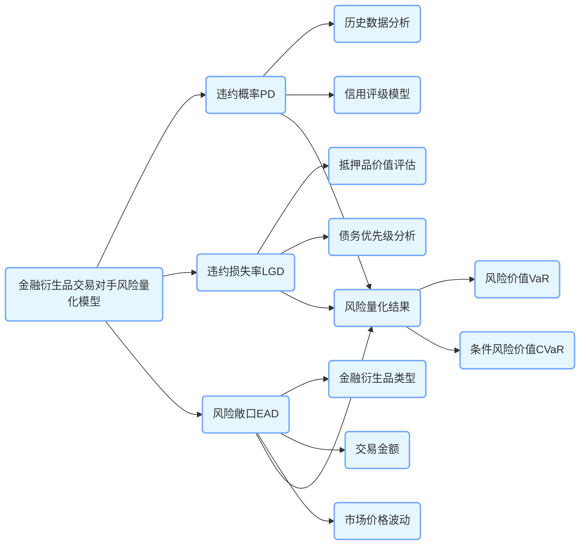

# 金融衍生品交易对手风险量化模型

> 关键词：金融衍生品、交易对手风险、量化模型、信用风险、风险管理

> 摘要：本文围绕金融衍生品交易对手风险量化模型展开深入探讨。首先介绍了研究该模型的背景、目的、预期读者以及文档结构等内容。接着阐述了核心概念及其联系，通过示意图和流程图直观呈现。详细讲解了核心算法原理，结合Python代码进行说明，并给出了相关数学模型和公式，辅以具体例子加深理解。在项目实战部分，从开发环境搭建到源代码实现及解读进行了全面分析。探讨了该模型在实际中的应用场景，推荐了学习所需的工具和资源，包括书籍、在线课程、开发工具等。最后对未来发展趋势与挑战进行总结，还提供了常见问题解答和扩展阅读参考资料，旨在为金融领域的从业者和研究者提供全面而深入的关于金融衍生品交易对手风险量化模型的知识体系。

## 1. 背景介绍 
### 1.1 目的和范围
金融衍生品市场在全球金融体系中占据着至关重要的地位，其交易规模不断扩大，产品种类日益丰富。然而，随之而来的交易对手风险也成为了金融机构和监管部门关注的焦点。本研究的目的在于构建一套科学、有效的金融衍生品交易对手风险量化模型，帮助金融机构准确评估和管理交易对手风险，降低潜在损失，提高风险管理水平。

本研究的范围涵盖了常见的金融衍生品，如期货、期权、互换等，同时考虑了不同市场环境和交易策略下的交易对手风险。通过对历史数据的分析和建模，旨在开发出具有普适性和实用性的风险量化模型。

### 1.2 预期读者
本文的预期读者主要包括金融机构的风险管理专业人员、交易员、分析师，以及从事金融衍生品研究的学者和学生。对于风险管理专业人员，本文提供的模型和方法可以直接应用于实际工作中，帮助他们更好地管理交易对手风险；对于交易员和分析师，了解交易对手风险量化模型有助于他们在交易决策中充分考虑风险因素；对于学者和学生，本文可以作为研究金融衍生品风险的参考资料，为进一步的学术研究提供思路和方法。

### 1.3 文档结构概述
本文共分为十个部分。第一部分为背景介绍，阐述了研究的目的、范围、预期读者和文档结构。第二部分介绍了核心概念与联系，通过文本示意图和Mermaid流程图直观展示相关概念的关系。第三部分详细讲解了核心算法原理，并使用Python源代码进行说明。第四部分给出了数学模型和公式，并进行详细讲解和举例说明。第五部分是项目实战，包括开发环境搭建、源代码实现和代码解读。第六部分探讨了实际应用场景。第七部分推荐了学习所需的工具和资源。第八部分对未来发展趋势与挑战进行总结。第九部分为附录，提供常见问题与解答。第十部分给出扩展阅读和参考资料。

### 1.4 术语表
#### 1.4.1 核心术语定义
- **金融衍生品**：一种金融合约，其价值取决于一种或多种基础资产，如股票、债券、商品、汇率等。常见的金融衍生品包括期货、期权、互换等。
- **交易对手风险**：指在金融交易中，交易对手无法履行合约义务而给另一方带来损失的风险。
- **风险量化模型**：通过数学和统计方法，对风险进行定量评估和分析的模型。
- **信用风险**：指借款人或交易对手未能按时偿还债务或履行合约义务的风险。
- **风险管理**：指识别、评估、控制和监测风险的过程，旨在降低风险对金融机构的影响。

#### 1.4.2 相关概念解释
- **违约概率（PD）**：指交易对手在一定时间内违约的可能性。
- **违约损失率（LGD）**：指在交易对手违约的情况下，债权人可能遭受的损失比例。
- **风险敞口（EAD）**：指在某一时刻，金融机构面临的交易对手风险的暴露程度。
- **信用评级**：指评级机构对借款人或交易对手的信用状况进行评估和打分的过程。

#### 1.4.3 缩略词列表
- **PD**：Probability of Default（违约概率）
- **LGD**：Loss Given Default（违约损失率）
- **EAD**：Exposure at Default（风险敞口）
- **VaR**：Value at Risk（风险价值）
- **CVaR**：Conditional Value at Risk（条件风险价值）

## 2. 核心概念与联系 
### 核心概念原理
金融衍生品交易对手风险量化模型的核心在于对交易对手的违约风险进行评估和量化。该模型主要涉及三个关键概念：违约概率（PD）、违约损失率（LGD）和风险敞口（EAD）。

违约概率（PD）是指交易对手在一定时间内违约的可能性。它是衡量交易对手信用风险的重要指标，可以通过历史数据、信用评级等方法进行估计。

违约损失率（LGD）是指在交易对手违约的情况下，债权人可能遭受的损失比例。它受到多种因素的影响，如抵押品的价值、债务的优先级等。

风险敞口（EAD）是指在某一时刻，金融机构面临的交易对手风险的暴露程度。它取决于金融衍生品的类型、交易金额、市场价格等因素。

### 架构的文本示意图
```plaintext
金融衍生品交易对手风险量化模型
|-- 违约概率（PD）
|   |-- 历史数据分析
|   |-- 信用评级模型
|-- 违约损失率（LGD）
|   |-- 抵押品价值评估
|   |-- 债务优先级分析
|-- 风险敞口（EAD）
|   |-- 金融衍生品类型
|   |-- 交易金额
|   |-- 市场价格波动
|-- 风险量化结果
|   |-- 风险价值（VaR）
|   |-- 条件风险价值（CVaR）
```

### Mermaid 流程图


## 3. 核心算法原理 & 具体操作步骤 
### 核心算法原理
金融衍生品交易对手风险量化模型的核心算法主要基于风险价值（VaR）和条件风险价值（CVaR）的计算。

风险价值（VaR）是指在一定的置信水平下，金融机构在未来一段时间内可能遭受的最大损失。其计算公式为：

$$VaR_{\alpha}(X) = - \inf \{ x \in \mathbb{R} : F_X(x) \geq \alpha \}$$

其中，$X$ 表示金融资产的收益率，$F_X(x)$ 表示 $X$ 的累积分布函数，$\alpha$ 表示置信水平。

条件风险价值（CVaR）是指在一定的置信水平下，金融机构在未来一段时间内可能遭受的平均损失，当损失超过风险价值时。其计算公式为：

$$CVaR_{\alpha}(X) = \frac{1}{1 - \alpha} \int_{\alpha}^{1} VaR_{\beta}(X) d\beta$$

### 具体操作步骤
1. **数据收集**：收集金融衍生品的交易数据、交易对手的信用评级数据、市场价格数据等。
2. **数据预处理**：对收集到的数据进行清洗、转换和标准化处理，以提高数据质量。
3. **违约概率估计**：使用历史数据和信用评级模型估计交易对手的违约概率。
4. **违约损失率估计**：根据抵押品价值和债务优先级分析，估计交易对手的违约损失率。
5. **风险敞口计算**：根据金融衍生品的类型、交易金额和市场价格波动，计算金融机构的风险敞口。
6. **风险量化计算**：使用VaR和CVaR公式计算金融机构面临的交易对手风险。

### Python源代码实现
```python
import numpy as np
from scipy.stats import norm

# 生成模拟收益率数据
np.random.seed(0)
returns = np.random.normal(0, 0.01, 1000)

# 计算风险价值（VaR）
def calculate_var(returns, alpha=0.95):
    """
    计算风险价值（VaR）
    :param returns: 收益率数据
    :param alpha: 置信水平
    :return: VaR值
    """
    return np.percentile(returns, 100 * (1 - alpha))

# 计算条件风险价值（CVaR）
def calculate_cvar(returns, alpha=0.95):
    """
    计算条件风险价值（CVaR）
    :param returns: 收益率数据
    :param alpha: 置信水平
    :return: CVaR值
    """
    var = calculate_var(returns, alpha)
    return np.mean(returns[returns <= var])

# 计算VaR和CVaR
var_95 = calculate_var(returns)
cvar_95 = calculate_cvar(returns)

print(f"VaR (95%): {var_95:.4f}")
print(f"CVaR (95%): {cvar_95:.4f}")
```

## 4. 数学模型和公式 & 详细讲解 & 举例说明 
### 数学模型和公式
#### 违约概率（PD）
违约概率可以使用逻辑回归模型进行估计。逻辑回归模型的基本形式为：

$$P(Y = 1 | X) = \frac{1}{1 + e^{-(\beta_0 + \beta_1 X_1 + \cdots + \beta_n X_n)}}$$

其中，$Y$ 表示违约事件（$Y = 1$ 表示违约，$Y = 0$ 表示未违约），$X = (X_1, X_2, \cdots, X_n)$ 表示影响违约的因素，$\beta_0, \beta_1, \cdots, \beta_n$ 表示模型的参数。

#### 违约损失率（LGD）
违约损失率可以使用线性回归模型进行估计。线性回归模型的基本形式为：

$$LGD = \beta_0 + \beta_1 X_1 + \cdots + \beta_n X_n + \epsilon$$

其中，$LGD$ 表示违约损失率，$X = (X_1, X_2, \cdots, X_n)$ 表示影响违约损失率的因素，$\beta_0, \beta_1, \cdots, \beta_n$ 表示模型的参数，$\epsilon$ 表示误差项。

#### 风险敞口（EAD）
对于不同类型的金融衍生品，风险敞口的计算方法也不同。以期货合约为例，风险敞口的计算公式为：

$$EAD = N \times (S - F)$$

其中，$N$ 表示合约数量，$S$ 表示标的资产的市场价格，$F$ 表示期货合约的价格。

#### 风险价值（VaR）和条件风险价值（CVaR）
风险价值（VaR）和条件风险价值（CVaR）的计算公式如前文所述。

### 详细讲解
#### 违约概率（PD）
逻辑回归模型通过对历史违约数据进行分析，估计出影响违约的因素的系数 $\beta_0, \beta_1, \cdots, \beta_n$。然后，根据新的交易对手的特征 $X$，可以计算出该交易对手的违约概率 $P(Y = 1 | X)$。

#### 违约损失率（LGD）
线性回归模型通过对历史违约损失数据进行分析，估计出影响违约损失率的因素的系数 $\beta_0, \beta_1, \cdots, \beta_n$。然后，根据新的交易对手的特征 $X$，可以预测该交易对手的违约损失率 $LGD$。

#### 风险敞口（EAD）
风险敞口的计算需要考虑金融衍生品的类型、交易金额和市场价格波动等因素。对于不同类型的金融衍生品，需要使用不同的计算公式进行计算。

#### 风险价值（VaR）和条件风险价值（CVaR）
风险价值（VaR）和条件风险价值（CVaR）是衡量金融机构面临的交易对手风险的重要指标。VaR表示在一定的置信水平下，金融机构在未来一段时间内可能遭受的最大损失；CVaR表示在一定的置信水平下，金融机构在未来一段时间内可能遭受的平均损失，当损失超过风险价值时。

### 举例说明
假设某金融机构与交易对手签订了一份期货合约，合约数量为 $N = 100$，期货合约的价格为 $F = 100$，标的资产的市场价格为 $S = 105$。则该金融机构的风险敞口为：

$$EAD = N \times (S - F) = 100 \times (105 - 100) = 500$$

假设该金融机构通过逻辑回归模型估计出交易对手的违约概率为 $PD = 0.05$，通过线性回归模型估计出违约损失率为 $LGD = 0.8$。则该金融机构面临的预期损失为：

$$EL = PD \times LGD \times EAD = 0.05 \times 0.8 \times 500 = 20$$

假设该金融机构的收益率数据服从正态分布，均值为 $\mu = 0.01$，标准差为 $\sigma = 0.02$。则在 95% 的置信水平下，该金融机构的风险价值为：

$$VaR_{0.95} = - \mu - \sigma \times z_{0.95} = - 0.01 - 0.02 \times 1.645 = - 0.0429$$

其中，$z_{0.95}$ 表示标准正态分布的 95% 分位数。

条件风险价值为：

$$CVaR_{0.95} = - \mu - \frac{\sigma}{\sqrt{2\pi}(1 - 0.95)} \times e^{-\frac{z_{0.95}^2}{2}} = - 0.01 - \frac{0.02}{\sqrt{2\pi}(1 - 0.95)} \times e^{-\frac{1.645^2}{2}} = - 0.0564$$

## 5. 项目实战：代码实际案例和详细解释说明 
### 5.1  开发环境搭建
#### 操作系统
本项目可以在 Windows、Linux 或 macOS 操作系统上进行开发。建议使用 Ubuntu 18.04 或更高版本的 Linux 操作系统，因为它具有良好的稳定性和兼容性。

#### Python 环境
本项目使用 Python 3.7 或更高版本进行开发。可以使用 Anaconda 或 Miniconda 来管理 Python 环境。以下是安装 Anaconda 的步骤：

1. 下载 Anaconda 安装包：从 Anaconda 官方网站（https://www.anaconda.com/products/individual）下载适合你操作系统的 Anaconda 安装包。
2. 安装 Anaconda：运行下载的安装包，按照提示进行安装。
3. 创建虚拟环境：打开终端或命令提示符，运行以下命令创建一个新的虚拟环境：

```bash
conda create -n risk_quantification python=3.8
```

4. 激活虚拟环境：运行以下命令激活新创建的虚拟环境：

```bash
conda activate risk_quantification
```

#### 安装依赖库
在激活的虚拟环境中，运行以下命令安装项目所需的依赖库：

```bash
pip install numpy pandas scikit-learn matplotlib
```

### 5.2  源代码详细实现和代码解读
以下是一个完整的金融衍生品交易对手风险量化模型的 Python 代码示例：

```python
import numpy as np
import pandas as pd
from sklearn.linear_model import LogisticRegression, LinearRegression
from sklearn.model_selection import train_test_split
from scipy.stats import norm

# 生成模拟数据
np.random.seed(0)
n_samples = 1000
X = np.random.randn(n_samples, 3)  # 特征数据
y_default = np.random.binomial(1, 0.1, n_samples)  # 违约标签
lgd = np.random.uniform(0.2, 0.8, n_samples)  # 违约损失率
ead = np.random.uniform(100, 1000, n_samples)  # 风险敞口

# 划分训练集和测试集
X_train, X_test, y_train_default, y_test_default, lgd_train, lgd_test, ead_train, ead_test = train_test_split(
    X, y_default, lgd, ead, test_size=0.2, random_state=42
)

# 训练违约概率模型
default_model = LogisticRegression()
default_model.fit(X_train, y_train_default)

# 训练违约损失率模型
lgd_model = LinearRegression()
lgd_model.fit(X_train, lgd_train)

# 预测违约概率和违约损失率
pd_test = default_model.predict_proba(X_test)[:, 1]
lgd_pred = lgd_model.predict(X_test)

# 计算预期损失
expected_loss = pd_test * lgd_pred * ead_test

# 计算风险价值（VaR）和条件风险价值（CVaR）
def calculate_var(returns, alpha=0.95):
    return np.percentile(returns, 100 * (1 - alpha))

def calculate_cvar(returns, alpha=0.95):
    var = calculate_var(returns, alpha)
    return np.mean(returns[returns <= var])

var_95 = calculate_var(expected_loss)
cvar_95 = calculate_cvar(expected_loss)

print(f"Expected Loss: {np.mean(expected_loss):.4f}")
print(f"VaR (95%): {var_95:.4f}")
print(f"CVaR (95%): {cvar_95:.4f}")
```

### 5.3  代码解读与分析
#### 数据生成
```python
np.random.seed(0)
n_samples = 1000
X = np.random.randn(n_samples, 3)  # 特征数据
y_default = np.random.binomial(1, 0.1, n_samples)  # 违约标签
lgd = np.random.uniform(0.2, 0.8, n_samples)  # 违约损失率
ead = np.random.uniform(100, 1000, n_samples)  # 风险敞口
```
这段代码生成了模拟数据，包括特征数据 $X$、违约标签 $y\_default$、违约损失率 $lgd$ 和风险敞口 $ead$。

#### 数据划分
```python
X_train, X_test, y_train_default, y_test_default, lgd_train, lgd_test, ead_train, ead_test = train_test_split(
    X, y_default, lgd, ead, test_size=0.2, random_state=42
)
```
这段代码将数据划分为训练集和测试集，其中测试集占总数据的 20%。

#### 模型训练
```python
default_model = LogisticRegression()
default_model.fit(X_train, y_train_default)

lgd_model = LinearRegression()
lgd_model.fit(X_train, lgd_train)
```
这段代码分别训练了违约概率模型和违约损失率模型。违约概率模型使用逻辑回归，违约损失率模型使用线性回归。

#### 预测和计算
```python
pd_test = default_model.predict_proba(X_test)[:, 1]
lgd_pred = lgd_model.predict(X_test)

expected_loss = pd_test * lgd_pred * ead_test

var_95 = calculate_var(expected_loss)
cvar_95 = calculate_cvar(expected_loss)
```
这段代码使用训练好的模型对测试集进行预测，计算预期损失，并计算风险价值（VaR）和条件风险价值（CVaR）。

## 6. 实际应用场景 
### 金融机构风险管理
金融机构在进行金融衍生品交易时，面临着交易对手违约的风险。通过使用金融衍生品交易对手风险量化模型，金融机构可以准确评估和管理交易对手风险，制定合理的风险控制策略，降低潜在损失。例如，金融机构可以根据交易对手的违约概率和违约损失率，调整交易保证金、限制交易规模或选择更优质的交易对手。

### 监管部门监管
监管部门可以使用金融衍生品交易对手风险量化模型来监测金融机构的风险状况，评估金融市场的稳定性。通过要求金融机构定期报告交易对手风险量化结果，监管部门可以及时发现潜在的风险隐患，采取相应的监管措施，防范系统性金融风险。

### 投资者决策
投资者在进行金融衍生品投资时，也需要考虑交易对手风险。通过了解交易对手的风险状况，投资者可以做出更明智的投资决策。例如，投资者可以选择与信用评级较高的交易对手进行交易，或者通过分散投资来降低交易对手风险。

## 7. 工具和资源推荐
### 7.1 学习资源推荐
#### 7.1.1 书籍推荐
- 《金融风险管理师（FRM）考试手册》：全面介绍了金融风险管理的理论和实践，包括金融衍生品交易对手风险量化模型的相关内容。
- 《信用风险度量：风险估值的新方法与其他范式》：深入探讨了信用风险的度量方法，对金融衍生品交易对手风险量化模型有详细的介绍。
- 《金融时间序列分析》：介绍了金融时间序列的分析方法，对于理解金融衍生品市场价格波动和风险量化有很大帮助。

#### 7.1.2 在线课程
- Coursera 上的“Financial Risk Management”课程：由知名教授授课，系统介绍了金融风险管理的各个方面，包括交易对手风险量化。
- edX 上的“Introduction to Financial Engineering and Risk Management”课程：提供了金融工程和风险管理的基础知识，对金融衍生品交易对手风险量化模型有一定的讲解。

#### 7.1.3 技术博客和网站
- 量化投资与机器学习（https://www.joinquant.com/）：提供了丰富的量化投资和风险管理的技术文章和案例，对金融衍生品交易对手风险量化模型有一定的讨论。
- 金融界（https://www.jrj.com.cn/）：提供了金融市场的最新资讯和分析，有助于了解金融衍生品市场的动态和风险状况。

### 7.2 开发工具框架推荐
#### 7.2.1 IDE和编辑器
- PyCharm：一款专业的 Python 集成开发环境，提供了丰富的代码编辑、调试和项目管理功能，适合开发金融衍生品交易对手风险量化模型。
- Jupyter Notebook：一个交互式的开发环境，支持 Python 代码的编写、运行和可视化，方便进行数据分析和模型验证。

#### 7.2.2 调试和性能分析工具
- PDB：Python 自带的调试工具，可以帮助开发者定位和解决代码中的问题。
- cProfile：Python 自带的性能分析工具，可以分析代码的运行时间和函数调用情况，帮助开发者优化代码性能。

#### 7.2.3 相关框架和库
- NumPy：一个用于科学计算的 Python 库，提供了高效的数组操作和数学函数，是金融衍生品交易对手风险量化模型开发的基础库。
- Pandas：一个用于数据处理和分析的 Python 库，提供了灵活的数据结构和数据操作方法，方便进行数据清洗和预处理。
- Scikit-learn：一个用于机器学习的 Python 库，提供了丰富的机器学习算法和工具，可用于构建违约概率和违约损失率模型。

### 7.3 相关论文著作推荐
#### 7.3.1 经典论文
- Jarrow, R. A., & Turnbull, S. M. (1995). Pricing derivatives on financial securities subject to credit risk. The Journal of Finance, 50(1), 53-85. 该论文提出了一种基于信用风险的金融衍生品定价模型，对金融衍生品交易对手风险量化有重要的理论贡献。
- Duffie, D., & Singleton, K. J. (1999). Modeling term structures of defaultable bonds. Review of Financial Studies, 12(4), 687-720. 该论文提出了一种基于强度模型的违约风险定价方法，为金融衍生品交易对手风险量化提供了重要的理论基础。

#### 7.3.2 最新研究成果
- 近年来，随着人工智能和机器学习技术的发展，越来越多的研究将这些技术应用于金融衍生品交易对手风险量化。例如，一些研究使用深度学习模型来预测交易对手的违约概率和违约损失率，取得了较好的效果。

#### 7.3.3 应用案例分析
- 一些金融机构和研究机构发布了关于金融衍生品交易对手风险量化模型的应用案例分析报告，这些报告可以帮助读者了解模型在实际应用中的效果和问题。例如，国际清算银行（BIS）发布的相关报告对金融机构的风险管理实践有一定的指导作用。

## 8. 总结：未来发展趋势与挑战
### 未来发展趋势
#### 技术融合
随着人工智能、机器学习、大数据等技术的不断发展，金融衍生品交易对手风险量化模型将与这些技术深度融合。例如，使用深度学习模型来处理复杂的金融数据，提高违约概率和违约损失率的预测精度；使用大数据技术来收集和分析更多的市场信息，增强模型的适应性和准确性。

#### 跨市场和跨行业风险管理
金融市场的全球化和金融创新的不断发展，使得金融衍生品交易对手风险不再局限于单一市场和行业。未来的风险量化模型将更加注重跨市场和跨行业的风险管理，考虑不同市场和行业之间的相关性和联动性，以更全面地评估交易对手风险。

#### 实时风险监测
随着金融市场的快速变化，实时风险监测将成为未来金融衍生品交易对手风险量化的重要发展方向。通过实时收集和分析市场数据，及时更新交易对手的风险状况，金融机构可以更加及时地采取风险控制措施，降低潜在损失。

### 挑战
#### 数据质量和可得性
金融衍生品交易对手风险量化模型需要大量的高质量数据来进行训练和验证。然而，实际中数据质量和可得性往往存在问题。例如，一些交易对手的信用数据可能不完整或不准确，市场价格数据可能存在噪声和异常值。如何解决数据质量和可得性问题，是模型开发和应用面临的重要挑战。

#### 模型复杂性和可解释性
随着技术的发展，金融衍生品交易对手风险量化模型变得越来越复杂。虽然复杂的模型可以提高预测精度，但也增加了模型的可解释性难度。金融机构和监管部门需要在模型的预测精度和可解释性之间找到平衡，以便更好地理解和应用模型。

#### 市场不确定性和系统性风险
金融市场具有高度的不确定性和系统性风险，这些因素会对金融衍生品交易对手风险量化模型的准确性产生影响。例如，市场突发事件、宏观经济政策变化等都可能导致交易对手的信用状况发生变化，从而影响模型的预测结果。如何应对市场不确定性和系统性风险，是模型开发和应用需要解决的另一个重要挑战。

## 9. 附录：常见问题与解答
### 问题 1：金融衍生品交易对手风险量化模型的准确性如何保证？
解答：为了保证金融衍生品交易对手风险量化模型的准确性，需要从以下几个方面入手：
1. **数据质量**：收集和使用高质量的数据进行模型训练和验证，对数据进行清洗和预处理，去除噪声和异常值。
2. **模型选择**：根据数据特点和问题需求，选择合适的模型进行建模。可以使用多种模型进行比较和验证，选择性能最优的模型。
3. **模型评估**：使用适当的评估指标对模型进行评估，如准确率、召回率、均方误差等。同时，进行交叉验证和回测，确保模型的稳定性和泛化能力。
4. **实时更新**：随着市场环境和交易对手信用状况的变化，及时更新模型的参数和数据，保证模型的时效性和准确性。

### 问题 2：金融衍生品交易对手风险量化模型可以应用于所有类型的金融衍生品吗？
解答：金融衍生品交易对手风险量化模型可以应用于大多数常见的金融衍生品，如期货、期权、互换等。然而，不同类型的金融衍生品具有不同的特点和风险特征，需要对模型进行适当的调整和改进。例如，期货合约的风险敞口计算相对简单，而期权合约的风险敞口计算则需要考虑更多的因素，如期权的行权价格、到期时间等。因此，在应用模型时，需要根据具体的金融衍生品类型进行分析和处理。

### 问题 3：金融衍生品交易对手风险量化模型与信用评级有什么关系？
解答：金融衍生品交易对手风险量化模型和信用评级都是评估交易对手信用风险的方法，但它们之间存在一些区别。信用评级是由专业的评级机构根据交易对手的财务状况、经营业绩、信用历史等因素进行评估和打分，给出一个综合的信用评级结果。而金融衍生品交易对手风险量化模型则是通过数学和统计方法，对交易对手的违约概率、违约损失率和风险敞口进行定量评估和分析。

信用评级可以为金融衍生品交易对手风险量化模型提供一定的参考，但模型可以更全面地考虑市场因素和交易细节，对交易对手的风险状况进行更准确的评估。同时，金融衍生品交易对手风险量化模型可以根据不同的市场环境和交易策略进行调整和优化，具有更强的灵活性和适应性。

## 10. 扩展阅读 & 参考资料
### 扩展阅读
- 《风险管理与金融机构》：进一步深入探讨了金融机构的风险管理理论和实践，对金融衍生品交易对手风险量化有更全面的介绍。
- 《期权、期货及其他衍生产品》：详细介绍了金融衍生品的定价和风险管理方法，是学习金融衍生品的经典教材。

### 参考资料
- Jarrow, R. A., & Turnbull, S. M. (1995). Pricing derivatives on financial securities subject to credit risk. The Journal of Finance, 50(1), 53-85.
- Duffie, D., & Singleton, K. J. (1999). Modeling term structures of defaultable bonds. Review of Financial Studies, 12(4), 687-720.
- International Swaps and Derivatives Association (ISDA). (2019). ISDA Margin Survey.
- Basel Committee on Banking Supervision. (2017). Minimum capital requirements for market risk.

作者：AI天才研究院/AI Genius Institute & 禅与计算机程序设计艺术 /Zen And The Art of Computer Programming