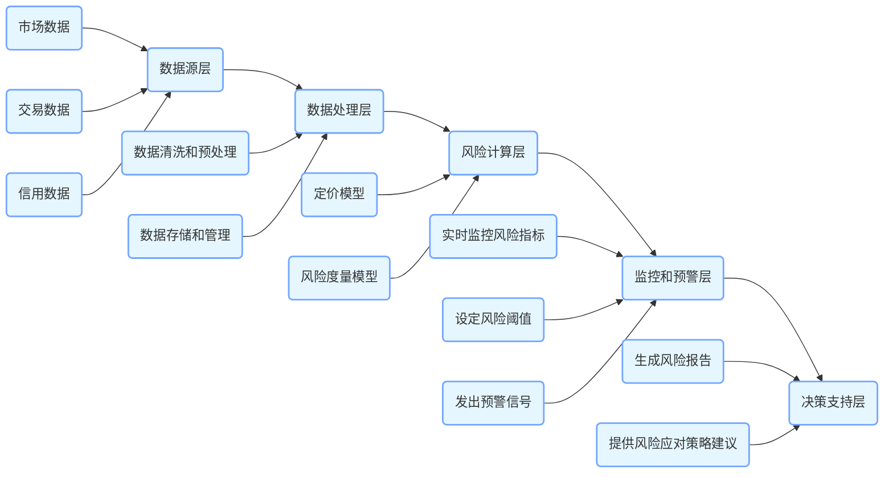

# 金融衍生品风险管理平台

> 关键词：金融衍生品、风险管理平台、量化分析、风险度量、实时监控

> 摘要：本文围绕金融衍生品风险管理平台展开，全面深入地探讨了其核心概念、算法原理、数学模型、实际应用等方面。首先介绍了平台开发的背景、目的、预期读者和文档结构等基础信息。接着详细阐述了金融衍生品及风险管理平台的核心概念与联系，并给出相应的示意图和流程图。通过Python代码详细讲解了核心算法原理及具体操作步骤，同时介绍了相关的数学模型和公式，并举例说明。在项目实战部分，给出了开发环境搭建的步骤、源代码实现及详细解读。分析了该平台在金融市场中的实际应用场景，推荐了学习、开发相关的工具和资源，包括书籍、在线课程、开发工具等。最后总结了金融衍生品风险管理平台的未来发展趋势与挑战，提供了常见问题解答和扩展阅读参考资料。

## 1. 背景介绍 
### 1.1 目的和范围
金融衍生品市场近年来发展迅速，其种类繁多、交易复杂，蕴含着巨大的风险。金融衍生品风险管理平台的目的在于帮助金融机构、投资者等有效管理和控制金融衍生品交易过程中的各种风险，如市场风险、信用风险、流动性风险等。

本平台的范围涵盖了常见的金融衍生品，如期货、期权、互换等。通过对这些金融衍生品的风险进行量化分析、实时监控和预警，为用户提供决策支持，降低潜在的损失。

### 1.2 预期读者
本文的预期读者包括金融机构的风险管理部门人员、投资经理、量化分析师、金融科技开发者以及对金融衍生品风险管理感兴趣的研究人员。这些读者具备一定的金融知识和编程基础，希望通过了解金融衍生品风险管理平台的原理和实现，提升自身在风险管理领域的能力。

### 1.3 文档结构概述
本文将按照以下结构进行阐述：首先介绍金融衍生品风险管理平台的背景信息，包括目的、预期读者和文档结构。接着讲解核心概念与联系，通过示意图和流程图帮助读者理解。然后详细介绍核心算法原理和具体操作步骤，使用Python代码进行说明。之后介绍相关的数学模型和公式，并举例说明其应用。在项目实战部分，将展示开发环境搭建、源代码实现和代码解读。分析该平台在实际金融市场中的应用场景。推荐学习和开发相关的工具和资源。最后总结未来发展趋势与挑战，提供常见问题解答和扩展阅读参考资料。

### 1.4 术语表
#### 1.4.1 核心术语定义
- **金融衍生品**：是一种金融合约，其价值取决于一种或多种基础资产或指数，常见的基础资产包括股票、债券、商品、货币等。金融衍生品包括期货、期权、互换等。
- **风险管理**：识别、评估、监测和控制金融风险的过程，旨在降低风险对金融机构或投资者的不利影响。
- **风险度量**：对金融风险进行量化的过程，常用的风险度量指标包括方差、标准差、VaR（Value at Risk，在险价值）、CVaR（Conditional Value at Risk，条件在险价值）等。
- **实时监控**：对金融衍生品交易过程中的风险进行持续、即时的监测，以便及时发现潜在的风险并采取相应的措施。

#### 1.4.2 相关概念解释
- **市场风险**：由于市场因素（如利率、汇率、股票价格等）的波动而导致金融衍生品价值变化的风险。
- **信用风险**：交易对手未能履行合约义务而导致损失的风险。
- **流动性风险**：金融衍生品无法以合理价格及时买卖的风险。

#### 1.4.3 缩略词列表
- **VaR**：Value at Risk，在险价值
- **CVaR**：Conditional Value at Risk，条件在险价值
- **MTM**：Mark-to-Market，盯市，即按市场价值对金融衍生品进行估值

## 2. 核心概念与联系 
### 核心概念原理
金融衍生品风险管理平台的核心在于对金融衍生品的风险进行量化分析和管理。其原理基于金融数学和统计学方法，通过对市场数据的收集、处理和分析，计算出各种风险度量指标，如VaR、CVaR等。

金融衍生品的价值取决于基础资产的价格变动，因此风险管理平台需要实时跟踪基础资产的价格数据，并根据相应的定价模型计算金融衍生品的价值。同时，通过对历史数据的分析和模拟，评估金融衍生品在不同市场情景下的风险暴露。

### 架构的文本示意图
```plaintext
金融衍生品风险管理平台架构

数据源层
|-- 市场数据（股票价格、利率、汇率等）
|-- 交易数据（交易记录、持仓信息等）
|-- 信用数据（交易对手信用评级等）

数据处理层
|-- 数据清洗和预处理
|-- 数据存储和管理

风险计算层
|-- 定价模型（Black-Scholes模型、二叉树模型等）
|-- 风险度量模型（VaR模型、CVaR模型等）

监控和预警层
|-- 实时监控风险指标
|-- 设定风险阈值
|-- 发出预警信号

决策支持层
|-- 生成风险报告
|-- 提供风险应对策略建议
```

### Mermaid 流程图


## 3. 核心算法原理 & 具体操作步骤 
### 核心算法原理
#### 定价模型 - Black-Scholes 模型
Black-Scholes 模型是一种用于计算欧式期权价格的经典模型。其基本假设包括：市场无摩擦、资产价格遵循几何布朗运动、无风险利率恒定等。

该模型的公式为：
$$C = S_0 N(d_1) - K e^{-rT} N(d_2)$$
$$P = K e^{-rT} N(-d_2) - S_0 N(-d_1)$$
其中：
$$d_1 = \frac{\ln(\frac{S_0}{K}) + (r + \frac{\sigma^2}{2})T}{\sigma \sqrt{T}}$$
$$d_2 = d_1 - \sigma \sqrt{T}$$
- $C$ 为欧式看涨期权价格
- $P$ 为欧式看跌期权价格
- $S_0$ 为标的资产当前价格
- $K$ 为期权执行价格
- $r$ 为无风险利率
- $T$ 为期权到期时间
- $\sigma$ 为标的资产的波动率
- $N(x)$ 为标准正态分布的累积分布函数

#### 风险度量模型 - VaR 模型
VaR 是指在一定的置信水平和持有期内，某一金融资产或投资组合可能遭受的最大损失。常见的计算 VaR 的方法有历史模拟法、方差 - 协方差法和蒙特卡罗模拟法。

这里介绍方差 - 协方差法，假设投资组合的收益率服从正态分布，其计算公式为：
$$VaR = z_{\alpha} \sigma_p V_0$$
其中：
- $z_{\alpha}$ 为对应置信水平 $\alpha$ 的标准正态分布分位数
- $\sigma_p$ 为投资组合的收益率标准差
- $V_0$ 为投资组合的初始价值

### 具体操作步骤及 Python 代码实现
#### 定价模型 - Black-Scholes 模型的 Python 实现
```python
import numpy as np
from scipy.stats import norm

def black_scholes(S0, K, r, T, sigma, option_type='call'):
    """
    计算欧式期权的价格
    :param S0: 标的资产当前价格
    :param K: 期权执行价格
    :param r: 无风险利率
    :param T: 期权到期时间
    :param sigma: 标的资产的波动率
    :param option_type: 期权类型，'call' 或 'put'
    :return: 期权价格
    """
    d1 = (np.log(S0 / K) + (r + 0.5 * sigma**2) * T) / (sigma * np.sqrt(T))
    d2 = d1 - sigma * np.sqrt(T)
    
    if option_type == 'call':
        price = S0 * norm.cdf(d1) - K * np.exp(-r * T) * norm.cdf(d2)
    elif option_type == 'put':
        price = K * np.exp(-r * T) * norm.cdf(-d2) - S0 * norm.cdf(-d1)
    else:
        raise ValueError("Invalid option type. Must be 'call' or 'put'.")
    
    return price

# 示例参数
S0 = 100
K = 105
r = 0.05
T = 1
sigma = 0.2

# 计算欧式看涨期权价格
call_price = black_scholes(S0, K, r, T, sigma, option_type='call')
print(f"欧式看涨期权价格: {call_price}")

# 计算欧式看跌期权价格
put_price = black_scholes(S0, K, r, T, sigma, option_type='put')
print(f"欧式看跌期权价格: {put_price}")
```

#### 风险度量模型 - VaR 模型的 Python 实现（方差 - 协方差法）
```python
import numpy as np
from scipy.stats import norm

def var_variance_covariance(weights, returns, confidence_level=0.95):
    """
    使用方差 - 协方差法计算投资组合的 VaR
    :param weights: 投资组合中各资产的权重
    :param returns: 各资产的历史收益率
    :param confidence_level: 置信水平
    :return: 投资组合的 VaR
    """
    # 计算投资组合的收益率均值和协方差矩阵
    portfolio_mean = np.dot(weights, np.mean(returns, axis=1))
    portfolio_cov = np.cov(returns)
    portfolio_std = np.sqrt(np.dot(weights.T, np.dot(portfolio_cov, weights)))
    
    # 计算对应置信水平的分位数
    z = norm.ppf(1 - confidence_level)
    
    # 假设初始投资价值为 1
    V0 = 1
    
    # 计算 VaR
    var = -z * portfolio_std * V0
    
    return var

# 示例数据
weights = np.array([0.5, 0.5])
returns = np.array([[0.01, 0.02, 0.03], [0.02, 0.03, 0.04]])

# 计算 VaR
var = var_variance_covariance(weights, returns)
print(f"投资组合的 VaR: {var}")
```

## 4. 数学模型和公式 & 详细讲解 & 举例说明 
### Black-Scholes 模型详细讲解
Black-Scholes 模型的推导基于随机微积分和无套利原理。其核心思想是通过构建一个包含标的资产和无风险债券的投资组合，使得该投资组合的价值变化与期权的价值变化相匹配，从而消除风险。

公式中的 $N(d_1)$ 和 $N(d_2)$ 分别表示在风险中性世界中，期权到期时处于实值状态的概率。$S_0 N(d_1)$ 表示标的资产在风险中性世界中的期望现值，$K e^{-rT} N(d_2)$ 表示期权执行价格在风险中性世界中的期望现值。

举例说明：假设某股票当前价格 $S_0 = 100$ 元，执行价格 $K = 105$ 元，无风险利率 $r = 0.05$，期权到期时间 $T = 1$ 年，股票波动率 $\sigma = 0.2$。计算欧式看涨期权价格：
首先计算 $d_1$ 和 $d_2$：
$$d_1 = \frac{\ln(\frac{100}{105}) + (0.05 + \frac{0.2^2}{2}) \times 1}{0.2 \times \sqrt{1}} \approx -0.02$$
$$d_2 = d_1 - 0.2 \times \sqrt{1} \approx -0.22$$
查标准正态分布表可得 $N(d_1) \approx 0.4920$，$N(d_2) \approx 0.4129$。
则欧式看涨期权价格为：
$$C = 100 \times 0.4920 - 105 \times e^{-0.05 \times 1} \times 0.4129 \approx 7.93$$（元）

### VaR 模型详细讲解
VaR 模型的核心是通过对投资组合的收益率进行建模，计算在一定置信水平下的最大可能损失。方差 - 协方差法假设投资组合的收益率服从正态分布，通过计算投资组合的收益率均值和标准差，结合标准正态分布的分位数来计算 VaR。

举例说明：假设一个投资组合包含两种资产，权重分别为 $w_1 = 0.5$ 和 $w_2 = 0.5$。两种资产的历史收益率如下：
资产 1：$r_1 = [0.01, 0.02, 0.03]$
资产 2：$r_2 = [0.02, 0.03, 0.04]$
首先计算投资组合的收益率均值和协方差矩阵：
$$\mu_1 = \frac{0.01 + 0.02 + 0.03}{3} = 0.02$$
$$\mu_2 = \frac{0.02 + 0.03 + 0.04}{3} = 0.03$$
$$\text{协方差矩阵} = \begin{bmatrix}
\mathrm{Var}(r_1) & \mathrm{Cov}(r_1, r_2) \\
\mathrm{Cov}(r_2, r_1) & \mathrm{Var}(r_2)
\end{bmatrix}$$
其中：
$$\mathrm{Var}(r_1) = \frac{(0.01 - 0.02)^2 + (0.02 - 0.02)^2 + (0.03 - 0.02)^2}{3 - 1} = 0.0001$$
$$\mathrm{Var}(r_2) = \frac{(0.02 - 0.03)^2 + (0.03 - 0.03)^2 + (0.04 - 0.03)^2}{3 - 1} = 0.0001$$
$$\mathrm{Cov}(r_1, r_2) = \frac{(0.01 - 0.02)(0.02 - 0.03) + (0.02 - 0.02)(0.03 - 0.03) + (0.03 - 0.02)(0.04 - 0.03)}{3 - 1} = 0.0001$$
则投资组合的收益率标准差为：
$$\sigma_p = \sqrt{0.5^2 \times 0.0001 + 0.5^2 \times 0.0001 + 2 \times 0.5 \times 0.5 \times 0.0001} \approx 0.01$$
假设置信水平为 $95\%$，则对应的标准正态分布分位数 $z_{\alpha} = 1.645$。假设初始投资价值 $V_0 = 1$，则投资组合的 VaR 为：
$$VaR = 1.645 \times 0.01 \times 1 = 0.01645$$

## 5. 项目实战：代码实际案例和详细解释说明 
### 5.1  开发环境搭建
#### 操作系统
可以选择 Windows、Linux 或 macOS 操作系统，建议使用 Linux 系统，如 Ubuntu，因为其在开发和部署方面具有较好的稳定性和兼容性。

#### Python 环境
安装 Python 3.7 及以上版本，可以从 Python 官方网站（https://www.python.org/downloads/）下载安装包进行安装。

#### 依赖库安装
使用 `pip` 安装所需的依赖库，主要包括：
- `numpy`：用于数值计算
- `pandas`：用于数据处理和分析
- `scipy`：用于科学计算，如统计分析
- `matplotlib`：用于数据可视化

可以使用以下命令进行安装：
```sh
pip install numpy pandas scipy matplotlib
```

### 5.2  源代码详细实现和代码解读
#### 数据获取和处理
```python
import pandas as pd
import numpy as np

# 模拟获取市场数据
def get_market_data():
    """
    模拟获取市场数据
    :return: 包含标的资产价格和无风险利率的 DataFrame
    """
    # 生成随机的标的资产价格
    prices = np.random.normal(100, 10, 100)
    # 生成固定的无风险利率
    rates = np.full(100, 0.05)
    
    data = pd.DataFrame({
        'price': prices,
        'rate': rates
    })
    
    return data

# 数据清洗和预处理
def preprocess_data(data):
    """
    数据清洗和预处理
    :param data: 原始市场数据
    :return: 处理后的数据
    """
    # 去除缺失值
    data = data.dropna()
    
    return data

# 获取市场数据
market_data = get_market_data()
# 数据预处理
processed_data = preprocess_data(market_data)

print("处理后的数据:")
print(processed_data.head())
```
代码解读：
- `get_market_data` 函数模拟获取市场数据，生成随机的标的资产价格和固定的无风险利率，并将其存储在 `pandas` 的 `DataFrame` 中。
- `preprocess_data` 函数对原始市场数据进行清洗和预处理，去除缺失值。

#### 风险计算
```python
from scipy.stats import norm

# 计算 VaR
def calculate_var(prices, confidence_level=0.95):
    """
    计算 VaR
    :param prices: 标的资产价格序列
    :param confidence_level: 置信水平
    :return: VaR 值
    """
    # 计算收益率
    returns = np.diff(prices) / prices[:-1]
    
    # 计算收益率的均值和标准差
    mean_return = np.mean(returns)
    std_return = np.std(returns)
    
    # 计算对应置信水平的分位数
    z = norm.ppf(1 - confidence_level)
    
    # 计算 VaR
    var = -z * std_return
    
    return var

# 提取标的资产价格
prices = processed_data['price'].values

# 计算 VaR
var = calculate_var(prices)

print(f"VaR 值: {var}")
```
代码解读：
- `calculate_var` 函数计算标的资产的 VaR 值。首先计算收益率，然后计算收益率的均值和标准差。根据置信水平查找标准正态分布的分位数，最后计算 VaR 值。

### 5.3  代码解读与分析
#### 数据获取和处理部分
在数据获取部分，我们使用随机数模拟了市场数据，实际应用中可以从金融数据提供商（如 Bloomberg、Wind 等）获取真实的市场数据。数据预处理部分去除了缺失值，确保数据的质量。

#### 风险计算部分
通过计算标的资产的收益率，我们可以得到收益率的分布特征。使用方差 - 协方差法计算 VaR 时，假设收益率服从正态分布。这种方法简单易懂，但在实际应用中可能存在一定的局限性，因为金融市场数据往往具有肥尾特征，不严格服从正态分布。

## 6. 实际应用场景 
### 金融机构风险管理
金融机构（如银行、证券公司、基金公司等）在进行金融衍生品交易时，需要对交易过程中的风险进行有效管理。金融衍生品风险管理平台可以帮助金融机构实时监控市场风险、信用风险和流动性风险，及时发现潜在的风险点，并采取相应的措施进行风险控制。例如，银行在进行外汇期权交易时，可以使用风险管理平台计算期权的风险暴露，根据风险情况调整交易策略。

### 投资组合管理
投资者在构建投资组合时，需要考虑不同金融衍生品之间的相关性和风险特征。金融衍生品风险管理平台可以帮助投资者评估投资组合的风险水平，通过优化投资组合的权重，降低风险并提高收益。例如，投资者可以使用平台计算投资组合的 VaR 和 CVaR，根据风险偏好调整投资组合的构成。

### 监管合规
金融监管机构需要对金融机构的衍生品交易活动进行监管，确保金融市场的稳定运行。金融衍生品风险管理平台可以为监管机构提供准确的风险数据和报告，帮助监管机构监测金融机构的风险状况，制定相应的监管政策。例如，监管机构可以要求金融机构定期提交风险管理平台生成的风险报告，评估金融机构的风险合规情况。

## 7. 工具和资源推荐
### 7.1 学习资源推荐
#### 7.1.1 书籍推荐
- 《期权、期货及其他衍生品》（Options, Futures, and Other Derivatives），作者：John C. Hull。这本书是金融衍生品领域的经典教材，详细介绍了各种金融衍生品的定价模型、风险管理方法等内容。
- 《金融风险管理师（FRM）一级教材》。该教材涵盖了金融风险管理的基础知识，包括市场风险、信用风险、操作风险等方面的内容，是学习金融风险管理的重要参考资料。
- 《Python 金融大数据分析》（Python for Finance: Analyze Big Financial Data），作者：Yves Hilpisch。这本书介绍了如何使用 Python 进行金融数据处理、分析和建模，对于开发金融衍生品风险管理平台具有很大的帮助。

#### 7.1.2 在线课程
- Coursera 上的“Financial Markets”课程，由耶鲁大学的 Robert Shiller 教授授课，介绍了金融市场的基本原理和金融衍生品的相关知识。
- edX 上的“Introduction to Computational Finance and Financial Econometrics”课程，讲解了计算金融和金融计量经济学的基础知识，包括金融数据处理、风险度量等内容。
- Udemy 上的“Python for Finance: Investment Fundamentals & Data Analytics”课程，通过实际案例介绍了如何使用 Python 进行金融投资分析和风险管理。

#### 7.1.3 技术博客和网站
- QuantNet：是一个专注于量化金融领域的社区，提供了丰富的金融衍生品和风险管理相关的技术文章、论坛讨论等资源。
- Towards Data Science：是一个数据科学和机器学习领域的博客平台，上面有很多关于金融数据分析和风险管理的文章。
- Bloomberg Terminal：是金融行业常用的数据分析和交易平台，提供了大量的金融市场数据和分析工具。

### 7.2 开发工具框架推荐
#### 7.2.1 IDE和编辑器
- PyCharm：是一款专业的 Python 集成开发环境，具有代码编辑、调试、版本控制等功能，适合开发金融衍生品风险管理平台。
- Jupyter Notebook：是一个交互式的编程环境，支持 Python、R 等多种编程语言，方便进行数据探索和分析。
- Visual Studio Code：是一款轻量级的代码编辑器，支持多种编程语言和插件扩展，可用于开发和调试金融衍生品风险管理平台的代码。

#### 7.2.2 调试和性能分析工具
- pdb：是 Python 自带的调试器，可以帮助开发者在代码中设置断点、查看变量值等，进行代码调试。
- cProfile：是 Python 自带的性能分析工具，可以分析代码的运行时间和函数调用次数，帮助开发者优化代码性能。
- Py-Spy：是一个基于 Rust 编写的 Python 性能分析工具，可以实时监控 Python 程序的性能，找出性能瓶颈。

#### 7.2.3 相关框架和库
- NumPy：是 Python 中用于数值计算的基础库，提供了高效的多维数组对象和各种数学函数，在金融衍生品风险管理平台中用于数据处理和计算。
- Pandas：是 Python 中用于数据处理和分析的库，提供了 DataFrame 和 Series 等数据结构，方便进行数据清洗、整理和分析。
- Scikit-learn：是 Python 中用于机器学习的库，提供了各种机器学习算法和工具，可用于金融衍生品的风险预测和建模。
- Pyfolio：是一个用于投资组合分析和风险管理的 Python 库，提供了各种风险度量指标和可视化工具。

### 7.3 相关论文著作推荐
#### 7.3.1 经典论文
- “The Pricing of Options and Corporate Liabilities”，作者：Fischer Black 和 Myron Scholes。这篇论文提出了著名的 Black-Scholes 期权定价模型，是金融衍生品定价领域的经典之作。
- “Value at Risk: The New Benchmark for Managing Financial Risk”，作者：Philippe Jorion。这篇论文系统地介绍了 VaR 方法在金融风险管理中的应用，对推动 VaR 方法的普及起到了重要作用。

#### 7.3.2 最新研究成果
- 在 SSRN（Social Science Research Network）和 arXiv 等学术平台上，可以搜索到关于金融衍生品风险管理的最新研究成果，如新型风险度量方法、机器学习在风险管理中的应用等。

#### 7.3.3 应用案例分析
- 一些金融机构和研究机构会发布金融衍生品风险管理的应用案例分析报告，如国际清算银行（BIS）发布的关于全球金融市场风险管理的报告，以及各大银行和证券公司发布的内部风险管理案例分析。

## 8. 总结：未来发展趋势与挑战
### 未来发展趋势
#### 人工智能和机器学习的应用
随着人工智能和机器学习技术的不断发展，金融衍生品风险管理平台将越来越多地应用这些技术。例如，使用深度学习算法对金融市场数据进行建模和预测，提高风险度量的准确性；使用强化学习算法优化投资组合的管理策略。

#### 实时风险监控和预警
未来的金融衍生品风险管理平台将更加注重实时性，能够实时监控市场数据的变化，及时发现潜在的风险点并发出预警信号。通过与交易系统的集成，实现自动化的风险控制和交易决策。

#### 跨市场和跨资产的风险管理
金融市场的全球化和金融衍生品的多样化使得跨市场和跨资产的风险管理变得越来越重要。未来的风险管理平台将能够整合不同市场和不同类型资产的风险信息，提供全面的风险管理解决方案。

### 挑战
#### 数据质量和安全
金融衍生品风险管理平台需要大量的市场数据和交易数据进行分析和建模，数据的质量和安全直接影响到平台的性能和可靠性。如何确保数据的准确性、完整性和安全性是一个重要的挑战。

#### 模型复杂度和解释性
随着风险管理模型的不断发展，模型的复杂度也在不断增加。复杂的模型虽然能够提高风险度量的准确性，但也会导致模型的解释性变差，难以被用户理解和接受。如何在提高模型准确性的同时，保持模型的解释性是一个需要解决的问题。

#### 监管合规要求
金融行业受到严格的监管，金融衍生品风险管理平台需要满足各种监管合规要求。随着监管政策的不断变化，平台需要及时调整和更新，以确保合规运营。

## 9. 附录：常见问题与解答
### 问题 1：金融衍生品风险管理平台可以管理哪些类型的风险？
解答：金融衍生品风险管理平台可以管理市场风险、信用风险、流动性风险等多种类型的风险。通过对市场数据、交易数据和信用数据的分析，平台可以计算各种风险度量指标，实时监控风险状况，并提供相应的风险控制策略。

### 问题 2：如何选择合适的风险度量模型？
解答：选择合适的风险度量模型需要考虑多个因素，如数据的特点、风险的类型、模型的复杂度和解释性等。常见的风险度量模型包括 VaR、CVaR、压力测试等。对于正态分布的数据，可以使用方差 - 协方差法计算 VaR；对于非正态分布的数据，可以使用历史模拟法或蒙特卡罗模拟法。

### 问题 3：金融衍生品风险管理平台的开发难度大吗？
解答：金融衍生品风险管理平台的开发具有一定的难度，需要具备金融知识、编程技能和数学建模能力。开发过程中需要处理大量的市场数据和交易数据，使用复杂的数学模型和算法进行风险计算和分析。同时，还需要考虑平台的性能、稳定性和安全性等方面的问题。

### 问题 4：如何验证金融衍生品风险管理平台的准确性？
解答：可以通过以下方法验证金融衍生品风险管理平台的准确性：
- 历史数据回测：使用历史市场数据对平台的风险度量模型进行回测，比较模型计算的风险值与实际发生的损失情况。
- 压力测试：模拟极端市场情景，测试平台在不同压力条件下的风险度量能力。
- 与其他风险管理工具进行比较：将平台的计算结果与其他成熟的风险管理工具进行比较，评估其准确性和可靠性。

## 10. 扩展阅读 & 参考资料
### 扩展阅读
- 《金融工程学》，作者：宋逢明。这本书介绍了金融工程的基本原理和方法，包括金融衍生品的设计、定价和风险管理等内容。
- 《高频交易》，作者：艾琳·奥哈拉、萨尔瓦托雷·斯托尔。这本书介绍了高频交易的原理、策略和风险管理，对于理解金融市场的微观结构和交易机制具有重要意义。

### 参考资料
- John C. Hull. Options, Futures, and Other Derivatives. Pearson, 2018.
- Philippe Jorion. Value at Risk: The New Benchmark for Managing Financial Risk. McGraw-Hill, 2007.
- Yves Hilpisch. Python for Finance: Analyze Big Financial Data. O'Reilly Media, 2015.

作者：AI天才研究院/AI Genius Institute & 禅与计算机程序设计艺术 /Zen And The Art of Computer Programming