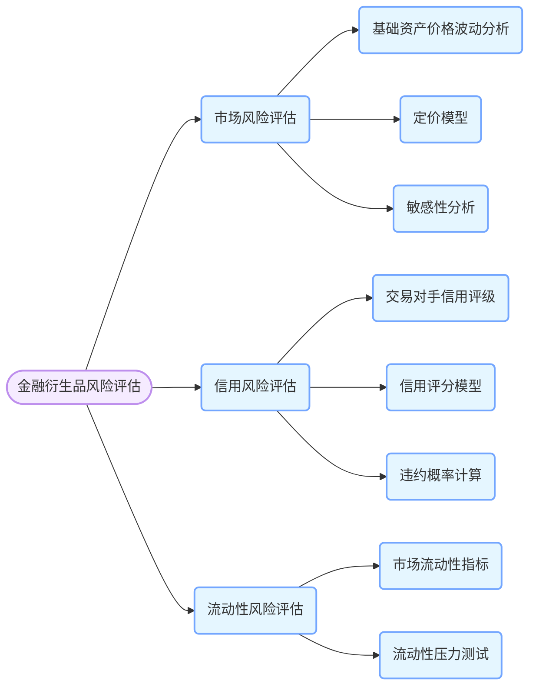

# 金融衍生品风险评估模型

> 关键词：金融衍生品、风险评估模型、数学模型、算法原理、实际应用

> 摘要：本文围绕金融衍生品风险评估模型展开深入探讨。首先介绍了该主题的背景，包括目的范围、预期读者、文档结构和相关术语。接着阐述了核心概念及其联系，通过文本示意图和Mermaid流程图进行直观展示。详细讲解了核心算法原理，并用Python代码进行阐述，同时给出了相关数学模型和公式，并举例说明。通过项目实战，展示了开发环境搭建、源代码实现与解读。分析了实际应用场景，推荐了学习资源、开发工具框架和相关论文著作。最后总结了未来发展趋势与挑战，还包含常见问题解答和扩展阅读参考资料，旨在为读者全面深入地理解金融衍生品风险评估模型提供帮助。

## 1. 背景介绍 
### 1.1 目的和范围
金融衍生品作为金融市场中重要的组成部分，其种类繁多，包括期货、期权、互换等。这些衍生品在提供风险管理、价格发现等功能的同时，也蕴含着巨大的风险。金融衍生品风险评估模型的目的在于对这些风险进行量化和评估，帮助投资者、金融机构和监管部门更好地理解和管理风险。本文章的范围涵盖了常见金融衍生品风险评估的主要方法和模型，包括市场风险、信用风险和流动性风险等方面的评估。

### 1.2 预期读者
本文预期读者包括金融从业者，如投资经理、风险管理人员、交易员等，他们需要深入了解金融衍生品风险评估的方法和技术，以便更好地进行投资决策和风险管理。同时，也适合金融专业的学生和研究人员，作为学习和研究金融衍生品风险评估的参考资料。此外，监管部门的工作人员也可以通过本文了解相关的风险评估模型，为制定监管政策提供依据。

### 1.3 文档结构概述
本文首先介绍金融衍生品风险评估模型的背景知识，包括目的、预期读者和文档结构等。接着阐述核心概念，包括金融衍生品的定义、风险的分类以及风险评估模型的架构。然后详细讲解核心算法原理和具体操作步骤，通过Python代码进行实现。随后介绍数学模型和公式，并举例说明其应用。通过项目实战，展示风险评估模型在实际中的应用。分析金融衍生品风险评估模型的实际应用场景。推荐相关的学习资源、开发工具框架和论文著作。最后总结未来发展趋势与挑战，并提供常见问题解答和扩展阅读参考资料。

### 1.4 术语表
#### 1.4.1 核心术语定义
- **金融衍生品**：一种金融合约，其价值取决于一种或多种基础资产，如股票、债券、商品、汇率等。常见的金融衍生品包括期货、期权、互换等。
- **风险评估模型**：用于量化和评估金融衍生品风险的数学模型和方法。通过对市场数据、信用数据等进行分析，预测金融衍生品在未来可能面临的风险。
- **市场风险**：由于市场因素（如利率、汇率、股票价格等）的波动而导致金融衍生品价值变动的风险。
- **信用风险**：交易对手无法履行合约义务而导致的风险。例如，交易对手违约可能导致投资者遭受损失。
- **流动性风险**：由于市场流动性不足而导致无法及时买卖金融衍生品的风险。当市场流动性较差时，投资者可能需要以较低的价格卖出或较高的价格买入金融衍生品。

#### 1.4.2 相关概念解释
- **VaR（Value at Risk）**：风险价值，是一种常用的风险度量方法。它表示在一定的置信水平下，在未来特定的一段时间内，投资组合可能遭受的最大损失。例如，在95%的置信水平下，1天的VaR为100万元，表示在未来1天内，投资组合有95%的可能性损失不超过100万元。
- **压力测试**：一种风险评估方法，通过模拟极端市场情况，评估金融衍生品在极端情况下的风险承受能力。例如，模拟股市暴跌、利率大幅上升等情况，观察金融衍生品的价值变化。
- **敏感性分析**：分析金融衍生品价值对各种市场因素变化的敏感程度。例如，分析期权价格对标的资产价格、波动率等因素的敏感性。

#### 1.4.3 缩略词列表
- **VaR**：Value at Risk（风险价值）
- **CVaR**：Conditional Value at Risk（条件风险价值）
- **MBS**：Mortgage - Backed Security（抵押贷款支持证券）
- **CDS**：Credit Default Swap（信用违约互换）

## 2. 核心概念与联系 

### 核心概念原理
金融衍生品的价值与基础资产的价格、波动率、利率等因素密切相关。风险评估模型的核心原理是通过对这些因素进行分析和建模，来评估金融衍生品可能面临的风险。

市场风险评估主要关注基础资产价格的波动对金融衍生品价值的影响。例如，对于股票期权，其价值取决于标的股票的价格、行权价格、到期时间、波动率等因素。可以通过Black - Scholes模型等对期权价格进行定价，并分析其对市场因素的敏感性。

信用风险评估则主要考虑交易对手的信用状况。可以通过信用评级、信用评分等方法对交易对手的信用风险进行评估。例如，对于信用违约互换（CDS），其价值与参考实体的信用状况密切相关。

流动性风险评估关注市场的流动性状况，以及金融衍生品在市场上的买卖难易程度。可以通过买卖价差、成交量等指标来衡量市场的流动性。

### 架构的文本示意图
```plaintext
金融衍生品风险评估模型
|-- 市场风险评估
|   |-- 基础资产价格波动分析
|   |-- 定价模型（如Black - Scholes模型）
|   |-- 敏感性分析
|-- 信用风险评估
|   |-- 交易对手信用评级
|   |-- 信用评分模型
|   |-- 违约概率计算
|-- 流动性风险评估
|   |-- 市场流动性指标（买卖价差、成交量）
|   |-- 流动性压力测试
```

### Mermaid流程图


## 3. 核心算法原理 & 具体操作步骤 

### 核心算法原理 - VaR计算
VaR是一种常用的风险度量方法，其计算方法有多种，这里介绍历史模拟法。历史模拟法的基本思想是利用历史数据来模拟未来的市场情况，从而计算出投资组合的VaR。

具体步骤如下：
1. 收集历史市场数据，包括基础资产的价格、收益率等。
2. 计算投资组合在历史数据下的收益率。
3. 将历史收益率从小到大排序。
4. 根据置信水平确定对应的分位数，该分位数对应的收益率即为VaR。

### Python源代码实现
```python
import numpy as np

def historical_var(returns, confidence_level=0.95):
    """
    计算历史模拟法下的VaR
    :param returns: 投资组合的历史收益率
    :param confidence_level: 置信水平
    :return: VaR值
    """
    sorted_returns = np.sort(returns)
    index = int((1 - confidence_level) * len(sorted_returns))
    var = -sorted_returns[index]
    return var

# 示例数据
np.random.seed(0)
returns = np.random.normal(0, 0.01, 1000)

# 计算VaR
var = historical_var(returns)
print(f"95%置信水平下的VaR: {var:.4f}")
```

### 代码解释
1. `historical_var`函数接受投资组合的历史收益率和置信水平作为输入。
2. 使用`np.sort`函数对历史收益率进行排序。
3. 根据置信水平计算对应的分位数索引。
4. 取该索引对应的收益率的相反数作为VaR值。

### 具体操作步骤
1. 数据收集：从金融数据提供商或数据库中获取基础资产的历史价格数据。
2. 收益率计算：根据历史价格数据计算投资组合的历史收益率。
3. 调用`historical_var`函数计算VaR。
4. 结果分析：根据计算得到的VaR值，评估投资组合的风险水平。

## 4. 数学模型和公式 & 详细讲解 & 举例说明 

### Black - Scholes模型
Black - Scholes模型是用于期权定价的经典模型，其公式如下：

$$C = S_tN(d_1)-Ke^{-r(T - t)}N(d_2)$$
$$P = Ke^{-r(T - t)}N(-d_2)-S_tN(-d_1)$$

其中：
$$d_1=\frac{\ln(\frac{S_t}{K})+(r+\frac{\sigma^2}{2})(T - t)}{\sigma\sqrt{T - t}}$$
$$d_2=d_1-\sigma\sqrt{T - t}$$

- $C$ 是欧式看涨期权的价格
- $P$ 是欧式看跌期权的价格
- $S_t$ 是标的资产在时间 $t$ 的价格
- $K$ 是期权的行权价格
- $r$ 是无风险利率
- $T$ 是期权的到期时间
- $t$ 是当前时间
- $\sigma$ 是标的资产的波动率
- $N(x)$ 是标准正态分布的累积分布函数

### 详细讲解
Black - Scholes模型基于以下假设：
1. 标的资产价格遵循几何布朗运动。
2. 市场无摩擦，即没有交易成本和税收。
3. 无风险利率是常数。
4. 标的资产可以无限分割。

该模型通过对期权的到期价值进行贴现，得到期权的当前价格。其中，$N(d_1)$ 和 $N(d_2)$ 分别表示期权被执行的概率和标的资产在到期时的期望价值。

### 举例说明
假设标的股票价格 $S_t = 100$ 元，行权价格 $K = 105$ 元，无风险利率 $r = 0.05$，期权到期时间 $T - t=1$ 年，标的股票的波动率 $\sigma = 0.2$。

首先计算 $d_1$ 和 $d_2$：
$$d_1=\frac{\ln(\frac{100}{105})+(0.05+\frac{0.2^2}{2})\times1}{0.2\times\sqrt{1}}\approx - 0.044$$
$$d_2=-0.044 - 0.2\times\sqrt{1}\approx - 0.244$$

然后查标准正态分布表可得 $N(d_1)\approx0.482$，$N(d_2)\approx0.404$。

最后计算欧式看涨期权价格：
$$C = 100\times0.482-105\times e^{-0.05\times1}\times0.404\approx 7.53$$（元）

## 5. 项目实战：代码实际案例和详细解释说明 

### 5.1  开发环境搭建
- **操作系统**：可以选择Windows、Linux或Mac OS。
- **Python环境**：建议使用Python 3.7及以上版本。可以通过Anaconda或官方网站下载安装Python。
- **依赖库**：需要安装`numpy`、`pandas`、`scipy`等库。可以使用`pip`进行安装，例如：
```sh
pip install numpy pandas scipy
```

### 5.2  源代码详细实现和代码解读
#### 实现一个简单的期权定价程序
```python
import numpy as np
from scipy.stats import norm

def black_scholes(S, K, r, T, sigma, option_type='call'):
    """
    计算欧式期权价格
    :param S: 标的资产价格
    :param K: 行权价格
    :param r: 无风险利率
    :param T: 到期时间
    :param sigma: 标的资产波动率
    :param option_type: 期权类型，'call'或'put'
    :return: 期权价格
    """
    d1 = (np.log(S / K)+(r + 0.5 * sigma**2) * T) / (sigma * np.sqrt(T))
    d2 = d1 - sigma * np.sqrt(T)

    if option_type == 'call':
        price = S * norm.cdf(d1)-K * np.exp(-r * T) * norm.cdf(d2)
    elif option_type == 'put':
        price = K * np.exp(-r * T) * norm.cdf(-d2)-S * norm.cdf(-d1)
    else:
        raise ValueError("Option type must be 'call' or 'put'")

    return price

# 示例参数
S = 100
K = 105
r = 0.05
T = 1
sigma = 0.2

# 计算欧式看涨期权价格
call_price = black_scholes(S, K, r, T, sigma, option_type='call')
print(f"欧式看涨期权价格: {call_price:.4f}")

# 计算欧式看跌期权价格
put_price = black_scholes(S, K, r, T, sigma, option_type='put')
print(f"欧式看跌期权价格: {put_price:.4f}")
```

#### 代码解读
1. **函数定义**：`black_scholes`函数接受标的资产价格、行权价格、无风险利率、到期时间、波动率和期权类型作为输入。
2. **计算 $d_1$ 和 $d_2$**：根据Black - Scholes模型的公式计算 $d_1$ 和 $d_2$。
3. **期权价格计算**：根据期权类型（看涨或看跌），使用相应的公式计算期权价格。
4. **示例参数设置**：设置标的资产价格、行权价格等参数，并调用`black_scholes`函数计算欧式看涨和看跌期权价格。

### 5.3  代码解读与分析
- **优点**：代码结构清晰，实现了Black - Scholes模型的基本功能。使用`scipy.stats.norm.cdf`函数计算标准正态分布的累积分布函数，提高了代码的可读性和效率。
- **局限性**：该代码假设市场符合Black - Scholes模型的假设条件，实际市场情况可能更为复杂。例如，市场存在交易成本、标的资产价格不遵循几何布朗运动等。

## 6. 实际应用场景 
### 投资者决策
投资者可以使用金融衍生品风险评估模型来评估投资组合的风险水平，从而做出合理的投资决策。例如，通过计算VaR，投资者可以了解投资组合在一定置信水平下可能遭受的最大损失，进而调整投资组合的配置，降低风险。

### 金融机构风险管理
金融机构，如银行、证券公司等，需要对其持有的金融衍生品进行风险管理。通过风险评估模型，金融机构可以评估市场风险、信用风险和流动性风险，制定相应的风险控制策略。例如，银行可以根据信用风险评估模型对交易对手的信用状况进行评估，决定是否与其进行交易。

### 监管部门监管
监管部门需要对金融市场进行监管，确保金融市场的稳定运行。金融衍生品风险评估模型可以帮助监管部门了解金融机构的风险状况，制定相应的监管政策。例如，监管部门可以要求金融机构定期报送VaR等风险指标，以便及时发现潜在的风险。

### 产品设计与定价
金融机构在设计和定价金融衍生品时，需要考虑其风险特征。风险评估模型可以帮助金融机构准确评估金融衍生品的风险，从而制定合理的价格。例如，在设计期权产品时，使用Black - Scholes模型等定价模型可以确定期权的合理价格。

## 7. 工具和资源推荐
### 7.1 学习资源推荐
#### 7.1.1 书籍推荐
- 《期权、期货及其他衍生品》（Options, Futures, and Other Derivatives），作者：John C. Hull。这本书是金融衍生品领域的经典教材，详细介绍了各种金融衍生品的定价和风险管理方法。
- 《金融风险管理师手册》（FRM Handbook），作者：Philippe Jorion。该书涵盖了金融风险管理的各个方面，包括市场风险、信用风险和操作风险等，是金融风险管理师考试的重要参考书籍。
- 《风险管理与金融机构》（Risk Management and Financial Institutions），作者：John C. Hull。本书主要介绍了金融机构如何进行风险管理，包括风险评估、风险控制和风险监管等内容。

#### 7.1.2 在线课程
- Coursera上的“Financial Markets”课程，由耶鲁大学的Robert Shiller教授授课。该课程介绍了金融市场的基本原理和金融衍生品的相关知识。
- edX上的“Introduction to Financial Engineering and Risk Management”课程，由哥伦比亚大学的Martin Haugh教授授课。课程内容包括金融工程的基本概念、期权定价和风险管理等。

#### 7.1.3 技术博客和网站
- 量化投资与金融科技平台（https://www.joinquant.com/）：提供了丰富的金融数据和量化交易工具，同时也有很多关于金融衍生品和风险管理的技术文章。
- 金融界（https://www.jrj.com.cn/）：提供金融市场的实时行情和相关资讯，也有一些关于金融衍生品的分析和研究文章。

### 7.2 开发工具框架推荐
#### 7.2.1 IDE和编辑器
- PyCharm：一款专业的Python集成开发环境，具有代码编辑、调试、版本控制等功能，适合开发金融衍生品风险评估模型的Python代码。
- Jupyter Notebook：一种交互式的开发环境，可以方便地进行数据分析和可视化。在进行金融数据处理和模型验证时非常有用。

#### 7.2.2 调试和性能分析工具
- pdb：Python自带的调试工具，可以帮助开发者逐行调试代码，找出代码中的错误。
- cProfile：Python的性能分析工具，可以分析代码的运行时间和函数调用情况，帮助开发者优化代码性能。

#### 7.2.3 相关框架和库
- NumPy：用于科学计算的Python库，提供了高效的数组操作和数学函数，在金融衍生品风险评估模型中经常用于数据处理和计算。
- Pandas：用于数据处理和分析的Python库，提供了数据结构和数据操作方法，方便处理金融数据。
- SciPy：包含了许多科学计算和统计分析的函数，如优化算法、概率分布函数等，可用于金融衍生品定价和风险评估。

### 7.3 相关论文著作推荐
#### 7.3.1 经典论文
- Black, F., & Scholes, M. (1973). The pricing of options and corporate liabilities. Journal of Political Economy, 81(3), 637 - 654. 该论文提出了Black - Scholes期权定价模型，是金融衍生品定价领域的经典之作。
- Merton, R. C. (1973). Theory of rational option pricing. Bell Journal of Economics and Management Science, 4(1), 141 - 183. 这篇论文对Black - Scholes模型进行了扩展，提出了更一般的期权定价理论。

#### 7.3.2 最新研究成果
- Brigo, D., & Mercurio, F. (2007). Interest Rate Models - Theory and Practice: With Smile, Inflation and Credit. Springer. 该书介绍了最新的利率模型和风险管理方法，包括考虑波动率微笑和信用风险的模型。
- Gatheral, J. (2006). The Volatility Surface: A Practitioner's Guide. Wiley. 这本书主要研究了波动率曲面的建模和应用，对于期权定价和风险管理具有重要意义。

#### 7.3.3 应用案例分析
- Duffie, D., & Singleton, K. J. (2003). Credit Risk: Pricing, Measurement, and Management. Princeton University Press. 该书通过大量的实际案例分析，介绍了信用风险的定价和管理方法。
- Hull, J. C., & White, A. (2012). Risk Management and Financial Institutions. Wiley. 书中包含了许多金融机构风险管理的实际案例，对理解金融衍生品风险评估模型的应用具有参考价值。

## 8. 总结：未来发展趋势与挑战
### 未来发展趋势
- **大数据与人工智能的应用**：随着大数据技术的发展，金融市场的数据量不断增加。可以利用大数据和人工智能技术，如机器学习、深度学习等，对海量的金融数据进行分析，提高风险评估模型的准确性和效率。例如，使用深度学习模型对市场风险进行预测。
- **多风险因素综合评估**：未来的风险评估模型将更加注重多风险因素的综合评估。除了市场风险、信用风险和流动性风险外，还将考虑操作风险、法律风险等因素，以更全面地评估金融衍生品的风险。
- **宏观经济因素的纳入**：宏观经济因素对金融衍生品的风险具有重要影响。未来的风险评估模型将更多地纳入宏观经济因素，如GDP增长率、通货膨胀率等，以更好地反映市场的整体风险状况。

### 挑战
- **模型的准确性和可靠性**：金融市场具有高度的不确定性和复杂性，风险评估模型很难完全准确地反映市场的实际情况。模型的假设条件可能与实际市场情况不符，导致模型的预测结果存在偏差。因此，提高模型的准确性和可靠性是一个重要的挑战。
- **数据质量和可用性**：风险评估模型需要大量的高质量数据作为输入。然而，金融数据可能存在缺失、错误等问题，影响模型的性能。此外，一些数据可能受到保密和隐私等限制，难以获取。
- **监管要求的变化**：监管部门对金融机构的风险管理要求不断提高。金融机构需要不断更新和完善风险评估模型，以满足监管要求。同时，监管政策的变化也可能对金融衍生品市场产生影响，增加风险评估的难度。

## 9. 附录：常见问题与解答
### 问题1：Black - Scholes模型的假设条件在实际市场中是否成立？
解答：Black - Scholes模型的假设条件在实际市场中并不完全成立。例如，市场存在交易成本和税收，不满足无摩擦市场的假设；标的资产价格也不一定遵循几何布朗运动，可能存在跳跃等情况。然而，该模型仍然是期权定价的重要基础，在一定程度上可以为期权定价提供参考。

### 问题2：如何选择合适的风险评估模型？
解答：选择合适的风险评估模型需要考虑多个因素，包括金融衍生品的类型、数据的可用性、风险评估的目的等。例如，对于简单的期权定价，可以使用Black - Scholes模型；对于复杂的投资组合风险评估，可以使用历史模拟法或蒙特卡罗模拟法等。同时，还需要根据实际情况对模型进行验证和调整。

### 问题3：风险评估模型的结果是否可以完全依赖？
解答：风险评估模型的结果不能完全依赖。模型是基于一定的假设和数据建立的，实际市场情况可能与模型假设不符。因此，在使用风险评估模型的结果时，需要结合专业的判断和经验，综合考虑各种因素。

## 10. 扩展阅读 & 参考资料
### 扩展阅读
- 《金融数学》（Mathematical Finance），作者：Mark S. Joshi。该书深入介绍了金融数学的理论和方法，对于理解金融衍生品风险评估模型的数学基础有很大帮助。
- 《高频交易》（High - Frequency Trading），作者：Irene Aldridge。这本书介绍了高频交易的原理和技术，以及高频交易对金融市场和风险评估的影响。

### 参考资料
- Hull, J. C. (2018). Options, Futures, and Other Derivatives (10th Edition). Pearson.
- Jorion, P. (2007). Financial Risk Manager Handbook Plus Test Bank (5th Edition). Wiley.
- Brigo, D., & Mercurio, F. (2007). Interest Rate Models - Theory and Practice: With Smile, Inflation and Credit. Springer.

作者：AI天才研究院/AI Genius Institute & 禅与计算机程序设计艺术 /Zen And The Art of Computer Programming