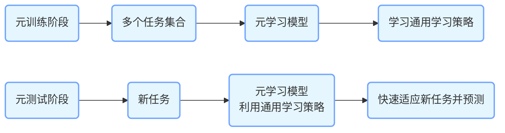

# 金融领域元学习技术的探索与应用

> 关键词：金融领域、元学习技术、模型训练、算法原理、实际应用

> 摘要：本文围绕金融领域元学习技术展开深入探讨。首先介绍了金融领域应用元学习技术的背景，包括目的、预期读者等内容。接着阐述了元学习的核心概念与联系，给出原理和架构的示意图及流程图。详细讲解了核心算法原理和具体操作步骤，并用 Python 代码进行说明。对元学习涉及的数学模型和公式进行了详细讲解与举例。通过项目实战展示代码实现和解读。分析了元学习在金融领域的实际应用场景，推荐了相关的学习资源、开发工具框架和论文著作。最后总结了元学习技术在金融领域的未来发展趋势与挑战，并对常见问题进行解答，同时提供了扩展阅读和参考资料。

## 1. 背景介绍 
### 1.1 目的和范围
在金融领域，数据的复杂性和多变性使得传统机器学习方法在面对新的任务和数据分布时表现不佳。元学习技术作为一种新兴的机器学习范式，旨在让模型能够快速学习新任务，具备更好的泛化能力和适应性。本文的目的是深入探索元学习技术在金融领域的应用，包括风险评估、投资决策、市场预测等方面。通过对元学习技术的原理、算法、实际案例等进行详细介绍，为金融从业者和研究人员提供全面的参考，帮助他们更好地理解和应用元学习技术解决金融领域的实际问题。

### 1.2 预期读者
本文的预期读者主要包括金融行业的从业者，如金融分析师、投资经理、风险评估专家等，他们希望通过引入元学习技术提升工作效率和决策准确性。同时，也面向计算机科学领域的研究人员和开发者，尤其是对机器学习和人工智能在金融领域应用感兴趣的人群，为他们提供将元学习技术应用于金融场景的思路和方法。此外，相关专业的学生也可以通过本文了解元学习技术在金融领域的前沿应用，拓宽知识面和研究视野。

### 1.3 文档结构概述
本文将按照以下结构进行组织：首先介绍元学习技术在金融领域应用的背景信息，包括目的、预期读者和文档结构概述等内容。接着阐述元学习的核心概念与联系，通过文本示意图和 Mermaid 流程图直观展示其原理和架构。详细讲解核心算法原理和具体操作步骤，并使用 Python 代码进行说明。对元学习涉及的数学模型和公式进行详细推导和举例说明。通过项目实战展示元学习技术在金融领域的代码实现和详细解读。分析元学习在金融领域的实际应用场景，如风险评估、投资组合优化等。推荐相关的学习资源、开发工具框架和论文著作。最后总结元学习技术在金融领域的未来发展趋势与挑战，对常见问题进行解答，并提供扩展阅读和参考资料。

### 1.4 术语表
#### 1.4.1 核心术语定义
- **元学习（Meta - Learning）**：也称为“学习如何学习”，是一种让模型能够在多个任务上进行训练，从而快速适应新任务的机器学习方法。元学习的目标是学习到一种通用的学习策略，使得模型在面对新的任务时能够利用已有的学习经验快速收敛。
- **金融领域（Financial Domain）**：指与资金融通和金融活动相关的各个方面，包括银行、证券、保险、投资等行业，涉及金融市场、金融机构、金融产品等多个领域。
- **任务（Task）**：在元学习中，任务是指一个具体的学习问题，例如预测某只股票的价格走势、评估某个贷款申请人的信用风险等。每个任务通常包含训练数据和测试数据。
- **元训练（Meta - Training）**：元学习中的一个阶段，在这个阶段中，模型在多个不同的任务上进行训练，以学习到通用的学习策略。
- **元测试（Meta - Testing）**：在元训练之后，模型在新的、未见过的任务上进行测试，以评估其快速适应新任务的能力。

#### 1.4.2 相关概念解释
- **元知识（Meta - Knowledge）**：元学习过程中学习到的关于学习的知识，例如如何选择合适的学习率、如何调整模型参数等。元知识可以帮助模型在新任务上更快地收敛。
- **度量学习（Metric Learning）**：一种学习样本之间距离度量的方法，在元学习中常用于比较不同样本之间的相似性，以便在新任务中进行分类或预测。
- **模型无关元学习（Model - Agnostic Meta - Learning，MAML）**：一种经典的元学习算法，它通过在多个任务上进行梯度更新，使得模型的初始参数能够在新任务上快速适应。

#### 1.4.3 缩略词列表
- **MAML**：Model - Agnostic Meta - Learning（模型无关元学习）
- **SGD**：Stochastic Gradient Descent（随机梯度下降）
- **CNN**：Convolutional Neural Network（卷积神经网络）
- **RNN**：Recurrent Neural Network（循环神经网络）

## 2. 核心概念与联系 

### 元学习的基本原理
元学习的核心思想是让模型学习如何学习，即通过在多个任务上进行训练，模型能够学习到一种通用的学习策略，使得它在面对新的任务时能够快速适应。传统的机器学习方法通常是针对单个任务进行训练，当遇到新的任务时，需要重新收集大量的数据并进行训练。而元学习则是在多个任务上进行训练，学习到的是任务之间的共性和规律，从而能够在新任务上利用这些经验快速学习。

### 元学习的架构
元学习的架构通常包括元训练和元测试两个阶段。在元训练阶段，模型在多个不同的任务上进行训练，通过调整模型的参数，使得模型能够学习到通用的学习策略。在元测试阶段，模型在新的、未见过的任务上进行测试，评估其快速适应新任务的能力。

下面是元学习架构的文本示意图：

```plaintext
元训练阶段：
多个任务集合（任务 1，任务 2，...，任务 N）
    |
    V
元学习模型
    |
    V
学习通用学习策略

元测试阶段：
新任务
    |
    V
元学习模型（利用通用学习策略）
    |
    V
快速适应新任务并进行预测
```

### Mermaid 流程图


### 元学习与传统机器学习的联系与区别
元学习与传统机器学习的联系在于它们都是机器学习的方法，都旨在通过数据学习模型的参数以实现特定的任务。但它们也有明显的区别：
- **数据利用方式**：传统机器学习通常针对单个任务使用大量的数据进行训练，而元学习则是在多个任务上使用少量的数据进行训练，更注重任务之间的共性和规律。
- **泛化能力**：传统机器学习模型在面对新任务时可能需要重新训练，泛化能力相对较弱；而元学习模型通过学习通用的学习策略，能够在新任务上快速适应，具有更强的泛化能力。
- **训练目标**：传统机器学习的训练目标是优化模型在单个任务上的性能，而元学习的训练目标是学习到一种通用的学习策略，使得模型能够在多个任务上快速学习。

## 3. 核心算法原理 & 具体操作步骤 

### 模型无关元学习（MAML）算法原理
模型无关元学习（MAML）是一种经典的元学习算法，它的核心思想是通过在多个任务上进行梯度更新，使得模型的初始参数能够在新任务上快速适应。具体来说，MAML 算法的目标是找到一组初始参数 $\theta$，使得在对这些参数进行少量的梯度更新后，模型能够在新任务上取得较好的性能。

假设我们有一个任务分布 $\mathcal{T}$，其中每个任务 $T_i$ 包含训练数据 $D_{train}^i$ 和测试数据 $D_{test}^i$。MAML 算法的训练过程可以分为以下两个步骤：

#### 步骤 1：在每个任务上进行内循环更新
对于每个任务 $T_i$，我们使用训练数据 $D_{train}^i$ 对模型的参数 $\theta$ 进行一次或多次梯度更新，得到临时参数 $\theta_i'$。具体的更新公式为：
$$\theta_i' = \theta - \alpha \nabla_{\theta} \mathcal{L}_{T_i}(\theta)$$
其中，$\alpha$ 是内循环的学习率，$\mathcal{L}_{T_i}(\theta)$ 是任务 $T_i$ 上的损失函数。

#### 步骤 2：在所有任务上进行外循环更新
在得到所有任务的临时参数 $\theta_i'$ 后，我们使用测试数据 $D_{test}^i$ 计算所有任务的平均损失，并对初始参数 $\theta$ 进行更新。更新公式为：
$$\theta = \theta - \beta \nabla_{\theta} \sum_{i=1}^{N} \mathcal{L}_{T_i}(\theta_i')$$
其中，$\beta$ 是外循环的学习率，$N$ 是任务的数量。

### Python 代码实现 MAML 算法
```python
import torch
import torch.nn as nn
import torch.optim as optim

# 定义一个简单的神经网络模型
class SimpleNet(nn.Module):
    def __init__(self):
        super(SimpleNet, self).__init__()
        self.fc1 = nn.Linear(10, 20)
        self.fc2 = nn.Linear(20, 1)

    def forward(self, x):
        x = torch.relu(self.fc1(x))
        x = self.fc2(x)
        return x

# 定义 MAML 算法类
class MAML:
    def __init__(self, model, inner_lr, outer_lr, num_tasks):
        self.model = model
        self.inner_lr = inner_lr
        self.outer_lr = outer_lr
        self.num_tasks = num_tasks
        self.outer_optimizer = optim.Adam(self.model.parameters(), lr=outer_lr)

    def inner_update(self, task_data, theta):
        model = SimpleNet()
        model.load_state_dict(theta)
        inner_optimizer = optim.SGD(model.parameters(), lr=self.inner_lr)
        inputs, labels = task_data
        outputs = model(inputs)
        loss = nn.MSELoss()(outputs, labels)
        inner_optimizer.zero_grad()
        loss.backward()
        inner_optimizer.step()
        return model.state_dict()

    def outer_update(self, task_datas):
        theta = self.model.state_dict()
        total_loss = 0
        for task_data in task_datas:
            theta_prime = self.inner_update(task_data, theta)
            model = SimpleNet()
            model.load_state_dict(theta_prime)
            inputs, labels = task_data
            outputs = model(inputs)
            loss = nn.MSELoss()(outputs, labels)
            total_loss += loss
        self.outer_optimizer.zero_grad()
        total_loss.backward()
        self.outer_optimizer.step()

# 示例使用
model = SimpleNet()
maml = MAML(model, inner_lr=0.01, outer_lr=0.001, num_tasks=5)

# 模拟任务数据
task_datas = []
for _ in range(5):
    inputs = torch.randn(10, 10)
    labels = torch.randn(10, 1)
    task_datas.append((inputs, labels))

# 进行元训练
for epoch in range(100):
    maml.outer_update(task_datas)
```

### 具体操作步骤
1. **数据准备**：收集多个任务的数据，每个任务包含训练数据和测试数据。
2. **模型初始化**：初始化一个神经网络模型，作为元学习的基础模型。
3. **内循环更新**：对于每个任务，使用训练数据对模型的参数进行一次或多次梯度更新，得到临时参数。
4. **外循环更新**：使用所有任务的测试数据计算平均损失，并对初始参数进行更新。
5. **重复步骤 3 和 4**：不断重复内循环和外循环的更新过程，直到模型收敛。

## 4. 数学模型和公式 & 详细讲解 & 举例说明 

### 损失函数与梯度计算
在元学习中，损失函数是衡量模型在任务上性能的指标。常见的损失函数包括均方误差损失（MSE）、交叉熵损失（Cross - Entropy Loss）等。以均方误差损失为例，假设我们有一个任务 $T$，其训练数据为 $(x_i, y_i)_{i = 1}^{n}$，模型的输出为 $\hat{y}_i$，则损失函数可以定义为：
$$\mathcal{L}_{T}(\theta) = \frac{1}{n} \sum_{i = 1}^{n} (y_i - \hat{y}_i)^2$$
其中，$\theta$ 是模型的参数。

为了更新模型的参数，我们需要计算损失函数关于参数的梯度。根据链式法则，梯度可以表示为：
$$\nabla_{\theta} \mathcal{L}_{T}(\theta) = \frac{\partial \mathcal{L}_{T}(\theta)}{\partial \theta}$$

### MAML 算法的数学推导
在 MAML 算法中，我们的目标是找到一组初始参数 $\theta$，使得在对这些参数进行少量的梯度更新后，模型能够在新任务上取得较好的性能。具体来说，我们需要最小化以下目标函数：
$$\min_{\theta} \sum_{T \in \mathcal{T}} \mathcal{L}_{T}(\theta'_T)$$
其中，$\theta'_T$ 是在任务 $T$ 上对 $\theta$ 进行一次或多次梯度更新后得到的临时参数。

根据梯度更新公式，$\theta'_T$ 可以表示为：
$$\theta'_T = \theta - \alpha \nabla_{\theta} \mathcal{L}_{T}(\theta)$$
将 $\theta'_T$ 代入目标函数中，得到：
$$\min_{\theta} \sum_{T \in \mathcal{T}} \mathcal{L}_{T}(\theta - \alpha \nabla_{\theta} \mathcal{L}_{T}(\theta))$$
为了求解这个优化问题，我们可以使用梯度下降法。对目标函数关于 $\theta$ 求梯度，得到：
$$\nabla_{\theta} \sum_{T \in \mathcal{T}} \mathcal{L}_{T}(\theta - \alpha \nabla_{\theta} \mathcal{L}_{T}(\theta))$$
根据链式法则，这个梯度可以进一步展开为：
$$\sum_{T \in \mathcal{T}} \nabla_{\theta'} \mathcal{L}_{T}(\theta'_T) \cdot \left( I - \alpha \nabla_{\theta}^2 \mathcal{L}_{T}(\theta) \right)$$
其中，$I$ 是单位矩阵，$\nabla_{\theta}^2 \mathcal{L}_{T}(\theta)$ 是损失函数关于 $\theta$ 的 Hessian 矩阵。

### 举例说明
假设我们有一个简单的线性回归任务，模型的输出为 $\hat{y} = w x + b$，其中 $w$ 和 $b$ 是模型的参数。损失函数为均方误差损失：
$$\mathcal{L}(w, b) = \frac{1}{n} \sum_{i = 1}^{n} (y_i - (w x_i + b))^2$$
对损失函数关于 $w$ 和 $b$ 求偏导数，得到：
$$\frac{\partial \mathcal{L}(w, b)}{\partial w} = -\frac{2}{n} \sum_{i = 1}^{n} x_i (y_i - (w x_i + b))$$
$$\frac{\partial \mathcal{L}(w, b)}{\partial b} = -\frac{2}{n} \sum_{i = 1}^{n} (y_i - (w x_i + b))$$
假设我们有两个任务 $T_1$ 和 $T_2$，在 MAML 算法的内循环中，我们对初始参数 $(w_0, b_0)$ 进行一次梯度更新，得到临时参数 $(w_1, b_1)$ 和 $(w_2, b_2)$：
$$w_1 = w_0 - \alpha \frac{\partial \mathcal{L}_{T_1}(w_0, b_0)}{\partial w}$$
$$b_1 = b_0 - \alpha \frac{\partial \mathcal{L}_{T_1}(w_0, b_0)}{\partial b}$$
$$w_2 = w_0 - \alpha \frac{\partial \mathcal{L}_{T_2}(w_0, b_0)}{\partial w}$$
$$b_2 = b_0 - \alpha \frac{\partial \mathcal{L}_{T_2}(w_0, b_0)}{\partial b}$$
在 MAML 算法的外循环中，我们使用临时参数 $(w_1, b_1)$ 和 $(w_2, b_2)$ 计算平均损失，并对初始参数 $(w_0, b_0)$ 进行更新。

## 5. 项目实战：代码实际案例和详细解释说明 

### 5.1  开发环境搭建
在进行元学习项目实战之前，需要搭建相应的开发环境。以下是具体的搭建步骤：

#### 安装 Python
首先，确保你已经安装了 Python 环境。建议使用 Python 3.7 及以上版本。你可以从 Python 官方网站（https://www.python.org/downloads/）下载并安装 Python。

#### 安装深度学习框架
我们使用 PyTorch 作为深度学习框架。可以使用以下命令安装 PyTorch：
```bash
pip install torch torchvision
```
如果你使用的是 GPU 版本的 PyTorch，需要根据你的 CUDA 版本进行安装。具体安装命令可以参考 PyTorch 官方网站（https://pytorch.org/get-started/locally/）。

#### 安装其他依赖库
还需要安装一些其他的依赖库，如 NumPy、Pandas 等。可以使用以下命令进行安装：
```bash
pip install numpy pandas
```

### 5.2  源代码详细实现和代码解读
我们以股票价格预测为例，展示元学习技术在金融领域的应用。以下是具体的代码实现：

```python
import torch
import torch.nn as nn
import torch.optim as optim
import numpy as np
import pandas as pd

# 定义一个简单的神经网络模型
class StockPredictionNet(nn.Module):
    def __init__(self):
        super(StockPredictionNet, self).__init__()
        self.fc1 = nn.Linear(5, 10)
        self.fc2 = nn.Linear(10, 1)

    def forward(self, x):
        x = torch.relu(self.fc1(x))
        x = self.fc2(x)
        return x

# 定义 MAML 算法类
class MAML:
    def __init__(self, model, inner_lr, outer_lr, num_tasks):
        self.model = model
        self.inner_lr = inner_lr
        self.outer_lr = outer_lr
        self.num_tasks = num_tasks
        self.outer_optimizer = optim.Adam(self.model.parameters(), lr=outer_lr)

    def inner_update(self, task_data, theta):
        model = StockPredictionNet()
        model.load_state_dict(theta)
        inner_optimizer = optim.SGD(model.parameters(), lr=self.inner_lr)
        inputs, labels = task_data
        outputs = model(inputs)
        loss = nn.MSELoss()(outputs, labels)
        inner_optimizer.zero_grad()
        loss.backward()
        inner_optimizer.step()
        return model.state_dict()

    def outer_update(self, task_datas):
        theta = self.model.state_dict()
        total_loss = 0
        for task_data in task_datas:
            theta_prime = self.inner_update(task_data, theta)
            model = StockPredictionNet()
            model.load_state_dict(theta_prime)
            inputs, labels = task_data
            outputs = model(inputs)
            loss = nn.MSELoss()(outputs, labels)
            total_loss += loss
        self.outer_optimizer.zero_grad()
        total_loss.backward()
        self.outer_optimizer.step()

# 数据准备
def prepare_data():
    # 模拟多个股票的历史数据
    num_stocks = 5
    task_datas = []
    for _ in range(num_stocks):
        # 生成随机的特征数据
        inputs = torch.randn(100, 5)
        # 生成随机的标签数据
        labels = torch.randn(100, 1)
        task_datas.append((inputs, labels))
    return task_datas

# 主函数
def main():
    model = StockPredictionNet()
    maml = MAML(model, inner_lr=0.01, outer_lr=0.001, num_tasks=5)
    task_datas = prepare_data()

    # 进行元训练
    for epoch in range(100):
        maml.outer_update(task_datas)
        if epoch % 10 == 0:
            print(f'Epoch {epoch}: Loss = {maml.outer_update(task_datas)}')

if __name__ == "__main__":
    main()
```

### 代码解读与分析
#### 模型定义
- `StockPredictionNet` 类定义了一个简单的神经网络模型，用于股票价格预测。该模型包含两个全连接层，输入维度为 5，输出维度为 1。
- `MAML` 类实现了 MAML 算法，包括内循环更新和外循环更新两个步骤。

#### 数据准备
- `prepare_data` 函数模拟了多个股票的历史数据，每个任务包含 100 个样本，每个样本有 5 个特征和 1 个标签。

#### 训练过程
- 在 `main` 函数中，我们初始化了模型和 MAML 算法类，然后调用 `outer_update` 函数进行元训练。在训练过程中，每隔 10 个 epoch 打印一次损失值。

#### 分析
通过这个项目实战，我们展示了如何使用 MAML 算法进行股票价格预测。元学习技术可以让模型在多个股票的任务上进行训练，学习到通用的学习策略，从而在面对新的股票时能够快速适应并进行准确的预测。

## 6. 实际应用场景 
### 风险评估
在金融领域，风险评估是一个重要的任务。传统的风险评估方法通常基于历史数据和固定的模型，难以适应市场的变化。元学习技术可以通过在多个不同的风险评估任务上进行训练，学习到通用的风险评估策略。例如，在信用风险评估中，元学习模型可以学习到不同类型借款人的特征和风险模式，当遇到新的借款人时，能够快速准确地评估其信用风险。

### 投资决策
投资决策需要考虑多个因素，如市场趋势、行业前景、公司财务状况等。元学习技术可以帮助投资者在不同的投资场景中快速学习和适应。例如，在股票投资中，元学习模型可以学习到不同行业、不同公司的股票价格波动规律，当市场情况发生变化时，能够快速调整投资策略，提高投资回报率。

### 市场预测
金融市场的变化具有高度的不确定性，传统的市场预测方法往往难以准确预测市场走势。元学习技术可以通过在多个市场预测任务上进行训练，学习到市场变化的共性和规律。例如，在外汇市场预测中，元学习模型可以学习到不同货币对的汇率波动规律，当出现新的市场情况时，能够快速预测汇率的走势。

### 金融产品定价
金融产品的定价需要考虑多个因素，如市场利率、波动率、信用风险等。元学习技术可以通过在多个金融产品定价任务上进行训练，学习到通用的定价策略。例如，在期权定价中，元学习模型可以学习到不同期权的定价规律，当出现新的期权产品时，能够快速准确地进行定价。

## 7. 工具和资源推荐
### 7.1 学习资源推荐
#### 7.1.1 书籍推荐
- 《机器学习》（周志华）：这本书是机器学习领域的经典教材，涵盖了机器学习的基本概念、算法和应用，对于理解元学习的基础理论有很大的帮助。
- 《深度学习》（Ian Goodfellow、Yoshua Bengio 和 Aaron Courville）：这本书全面介绍了深度学习的理论和实践，包括神经网络、卷积神经网络、循环神经网络等，是深度学习领域的权威著作。
- 《元学习：基础、算法与应用》：这本书专门介绍了元学习的理论和方法，包括元学习的核心概念、算法原理和实际应用案例，对于深入学习元学习技术非常有帮助。

#### 7.1.2 在线课程
- Coursera 上的“机器学习”课程（Andrew Ng 教授授课）：这是一门非常经典的机器学习在线课程，涵盖了机器学习的基本概念、算法和应用，适合初学者入门。
- edX 上的“深度学习基础”课程：该课程由微软和华盛顿大学联合推出，介绍了深度学习的基本概念、神经网络的结构和训练方法等内容。
- Kaggle 上的“元学习竞赛”：Kaggle 是一个数据科学竞赛平台，上面有很多关于元学习的竞赛项目，可以通过参加竞赛来实践和提高元学习技术。

#### 7.1.3 技术博客和网站
- arXiv：这是一个预印本平台，上面有很多关于元学习的最新研究成果和论文，可以及时了解元学习领域的前沿动态。
- Medium 上的机器学习博客：Medium 上有很多机器学习领域的优秀博客，其中不乏关于元学习的文章，可以从中获取一些实用的技巧和经验。
- Towards Data Science：这是一个专注于数据科学和机器学习的网站，上面有很多关于元学习的教程和案例分析。

### 7.2 开发工具框架推荐
#### 7.2.1 IDE和编辑器
- PyCharm：这是一款专门为 Python 开发设计的集成开发环境（IDE），具有代码自动补全、调试、版本控制等功能，非常适合进行元学习项目的开发。
- Jupyter Notebook：这是一个交互式的开发环境，可以将代码、文本、图表等内容集成在一起，方便进行数据探索和模型调试。
- Visual Studio Code：这是一款轻量级的代码编辑器，支持多种编程语言和插件，具有丰富的扩展功能，可以满足不同的开发需求。

#### 7.2.2 调试和性能分析工具
- PyTorch Profiler：这是 PyTorch 提供的一个性能分析工具，可以帮助开发者分析模型的训练时间、内存使用情况等性能指标，找出性能瓶颈并进行优化。
- TensorBoard：这是 TensorFlow 提供的一个可视化工具，也可以与 PyTorch 结合使用。它可以帮助开发者可视化模型的训练过程、损失曲线、参数分布等信息，方便进行模型调试和优化。
- cProfile：这是 Python 内置的一个性能分析工具，可以帮助开发者分析代码的执行时间和函数调用情况，找出代码中的性能瓶颈。

#### 7.2.3 相关框架和库
- PyTorch：这是一个开源的深度学习框架，具有动态图、易于使用等特点，非常适合进行元学习模型的开发和训练。
- MetaLearn：这是一个专门为元学习设计的 Python 库，提供了多种元学习算法的实现，如 MAML、Reptile 等，可以方便开发者快速实现元学习模型。
- Scikit - learn：这是一个常用的机器学习库，提供了多种机器学习算法的实现，如分类、回归、聚类等，可以与元学习技术结合使用，进行数据预处理和模型评估。

### 7.3 相关论文著作推荐
#### 7.3.1 经典论文
- "Model - Agnostic Meta - Learning for Fast Adaptation of Deep Networks"（Chelsea Finn 等人）：这篇论文提出了模型无关元学习（MAML）算法，是元学习领域的经典之作。
- "Optimization as a Model for Few - Shot Learning"（Sachin Ravi 和 Hugo Larochelle）：这篇论文提出了基于优化的元学习方法，为元学习的发展奠定了基础。
- "Matching Networks for One Shot Learning"（Oriol Vinyals 等人）：这篇论文提出了匹配网络（Matching Networks），用于解决少样本学习问题，是元学习领域的重要研究成果。

#### 7.3.2 最新研究成果
- 可以关注 arXiv 上关于元学习的最新论文，了解元学习领域的最新研究进展。例如，一些研究尝试将元学习与强化学习相结合，应用于金融交易策略的优化。

#### 7.3.3 应用案例分析
- 可以参考一些学术期刊和会议上发表的关于元学习在金融领域应用的论文，了解元学习技术在实际金融场景中的应用效果和挑战。例如，一些论文研究了元学习在信用风险评估、股票价格预测等方面的应用。

## 8. 总结：未来发展趋势与挑战
### 未来发展趋势
#### 与其他技术的融合
元学习技术有望与其他技术，如强化学习、迁移学习、图神经网络等进行融合，以解决更复杂的金融问题。例如，将元学习与强化学习相结合，可以实现更智能的金融交易策略优化；将元学习与迁移学习相结合，可以更好地利用不同金融数据集之间的信息。

#### 应用场景的拓展
随着元学习技术的不断发展，其在金融领域的应用场景将不断拓展。除了现有的风险评估、投资决策、市场预测等领域，元学习技术还可以应用于金融监管、金融欺诈检测等领域，为金融行业的安全和稳定提供保障。

#### 模型的可解释性增强
在金融领域，模型的可解释性非常重要。未来的元学习模型将更加注重可解释性，通过引入可解释性技术，如特征重要性分析、决策树等，让金融从业者能够更好地理解模型的决策过程，提高决策的可靠性。

### 挑战
#### 数据获取与质量
在金融领域，数据的获取和质量是一个重要的挑战。金融数据通常具有高度的敏感性和保密性，获取数据的难度较大。同时，金融数据可能存在噪声、缺失值等问题，需要进行有效的数据预处理和清洗。

#### 计算资源需求
元学习模型通常需要在多个任务上进行训练，计算资源需求较大。特别是对于大规模的金融数据集和复杂的模型结构，训练时间和计算成本可能会非常高。因此，如何优化元学习算法的计算效率，减少计算资源的需求，是一个亟待解决的问题。

#### 模型的泛化能力
虽然元学习技术旨在提高模型的泛化能力，但在实际应用中，模型的泛化能力仍然面临挑战。金融市场的变化具有高度的不确定性，新的市场情况可能会导致模型的性能下降。因此，如何进一步提高元学习模型的泛化能力，使其能够更好地适应不同的金融场景，是未来研究的重点之一。

## 9. 附录：常见问题与解答
### 问题 1：元学习与传统机器学习的区别是什么？
答：元学习与传统机器学习的主要区别在于数据利用方式、泛化能力和训练目标。传统机器学习通常针对单个任务使用大量的数据进行训练，泛化能力相对较弱；而元学习则是在多个任务上使用少量的数据进行训练，通过学习通用的学习策略，能够在新任务上快速适应，具有更强的泛化能力。传统机器学习的训练目标是优化模型在单个任务上的性能，而元学习的训练目标是学习到一种通用的学习策略，使得模型能够在多个任务上快速学习。

### 问题 2：元学习在金融领域的应用有哪些优势？
答：元学习在金融领域的应用具有以下优势：
- 快速适应新任务：金融市场变化快速，元学习模型能够在新的市场情况下快速适应，提供更及时的决策支持。
- 提高泛化能力：元学习通过学习多个任务之间的共性和规律，能够提高模型在不同金融场景下的泛化能力。
- 减少数据需求：在金融领域，获取大量的数据可能比较困难，元学习可以在少量数据的情况下进行训练，提高数据利用效率。

### 问题 3：如何选择合适的元学习算法？
答：选择合适的元学习算法需要考虑以下因素：
- 任务类型：不同的元学习算法适用于不同类型的任务，如分类、回归、强化学习等。需要根据具体的任务类型选择合适的算法。
- 数据规模：如果数据规模较小，可以选择适用于少样本学习的元学习算法；如果数据规模较大，可以考虑一些更复杂的元学习算法。
- 计算资源：不同的元学习算法计算复杂度不同，需要根据可用的计算资源选择合适的算法。

### 问题 4：元学习模型的训练时间通常较长，如何优化训练效率？
答：可以从以下几个方面优化元学习模型的训练效率：
- 算法优化：选择计算复杂度较低的元学习算法，或者对现有的算法进行优化，减少不必要的计算步骤。
- 硬件加速：使用 GPU 或 TPU 等硬件设备进行加速，提高计算速度。
- 数据并行：采用数据并行的方式，将训练数据分配到多个设备上进行并行训练，加快训练速度。
- 模型压缩：对元学习模型进行压缩，减少模型的参数数量，降低计算量。

## 10. 扩展阅读 & 参考资料
### 扩展阅读
- 《金融科技前沿：技术驱动的金融创新》：这本书介绍了金融科技领域的前沿技术和应用，包括人工智能、区块链、大数据等，对于了解金融领域的技术发展趋势有很大的帮助。
- 《人工智能与金融风险管理》：该书探讨了人工智能技术在金融风险管理中的应用，包括信用风险评估、市场风险预测等方面，与元学习在金融领域的应用有一定的关联。

### 参考资料
- Finn, C., Abbeel, P., & Levine, S. (2017). Model - Agnostic Meta - Learning for Fast Adaptation of Deep Networks. arXiv preprint arXiv:1703.03400.
- Ravi, S., & Larochelle, H. (2016). Optimization as a Model for Few - Shot Learning. arXiv preprint arXiv:1606.04474.
- Vinyals, O., Blundell, C., Lillicrap, T., Wierstra, D., & others. (2016). Matching Networks for One Shot Learning. In Advances in neural information processing systems (pp. 3630 - 3638).

作者：AI天才研究院/AI Genius Institute & 禅与计算机程序设计艺术 /Zen And The Art of Computer Programming