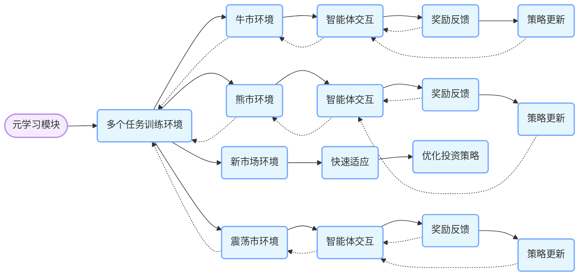

# 金融领域元强化学习在投资策略中的应用

> 关键词：金融领域、元强化学习、投资策略、智能决策、算法优化

> 摘要：本文聚焦于金融领域元强化学习在投资策略中的应用。首先介绍了研究的背景、目的、预期读者、文档结构和相关术语。接着阐述了元强化学习的核心概念与联系，给出了原理和架构的文本示意图与Mermaid流程图。详细讲解了核心算法原理，并通过Python源代码进行说明，同时介绍了相关的数学模型和公式。在项目实战部分，给出了开发环境搭建、源代码实现及解读。还探讨了实际应用场景，推荐了学习资源、开发工具框架和相关论文著作。最后总结了未来发展趋势与挑战，并给出常见问题解答和扩展阅读参考资料，旨在为金融投资领域运用元强化学习提供全面的技术指导和深入的理论分析。

## 1. 背景介绍 
### 1.1 目的和范围
在金融投资领域，传统的投资策略往往依赖于历史数据和固定的模型假设，难以适应市场的动态变化和不确定性。元强化学习作为一种新兴的技术，能够在不同的任务和环境中快速学习和适应，为投资策略的优化提供了新的思路和方法。本文的目的在于深入探讨元强化学习在金融投资策略中的应用，包括其核心概念、算法原理、数学模型、实际应用场景等方面，为投资者和研究人员提供全面的技术参考和实践指导。

### 1.2 预期读者
本文的预期读者包括金融领域的投资者、金融分析师、量化投资研究员、人工智能和机器学习领域的研究人员以及对金融科技感兴趣的技术爱好者。对于金融从业者，本文可以帮助他们了解如何利用元强化学习改进投资策略，提高投资收益；对于技术人员，本文提供了在金融场景下应用元强化学习的具体实现方法和实践案例。

### 1.3 文档结构概述
本文共分为十个部分。第一部分为背景介绍，阐述了研究的目的、范围、预期读者和文档结构。第二部分介绍元强化学习的核心概念与联系，包括原理和架构的文本示意图与Mermaid流程图。第三部分详细讲解核心算法原理，并通过Python源代码进行说明。第四部分介绍相关的数学模型和公式，并举例说明。第五部分为项目实战，包括开发环境搭建、源代码实现及解读。第六部分探讨实际应用场景。第七部分推荐学习资源、开发工具框架和相关论文著作。第八部分总结未来发展趋势与挑战。第九部分为附录，给出常见问题解答。第十部分提供扩展阅读参考资料。

### 1.4 术语表
#### 1.4.1 核心术语定义
- **元强化学习（Meta-Reinforcement Learning）**：一种强化学习的扩展，它不仅学习如何在特定环境中采取行动以最大化奖励，还学习如何快速适应新的环境和任务。元强化学习通过在多个相关任务上进行训练，提取通用的学习策略，从而能够在新任务中更快地收敛到最优策略。
- **投资策略（Investment Strategy）**：投资者为了实现投资目标，根据市场情况、自身风险偏好等因素制定的一系列投资决策规则和方法。投资策略可以包括资产配置、选股、交易时机选择等方面。
- **强化学习（Reinforcement Learning）**：一种机器学习方法，智能体通过与环境进行交互，根据环境反馈的奖励信号来学习最优的行动策略，以最大化长期累积奖励。
- **智能体（Agent）**：在强化学习中，智能体是能够感知环境状态、采取行动并从环境中获取奖励的实体。在金融投资场景中，智能体可以是一个自动化的交易系统。
- **环境（Environment）**：智能体所处的外部世界，它提供智能体可以感知的状态信息，并根据智能体的行动给予相应的奖励。在金融投资中，环境可以是金融市场，包括股票价格、利率、宏观经济数据等。

#### 1.4.2 相关概念解释
- **策略网络（Policy Network）**：在强化学习中，策略网络是一个神经网络，它根据当前环境状态输出智能体应该采取的行动概率分布。策略网络的参数通过优化算法不断调整，以最大化累积奖励。
- **价值网络（Value Network）**：价值网络用于估计在某个状态下采取某个行动所能获得的长期累积奖励的期望。价值网络可以帮助智能体评估不同行动的优劣，从而做出更明智的决策。
- **经验回放（Experience Replay）**：一种强化学习中的训练技巧，将智能体与环境交互的经验（状态、行动、奖励、下一状态）存储在一个经验池中，训练时从经验池中随机采样进行学习。经验回放可以提高数据的利用率，减少数据之间的相关性，从而提高学习的稳定性。

#### 1.4.3 缩略词列表
- **MDP（Markov Decision Process）**：马尔可夫决策过程，是一种用于描述强化学习问题的数学模型，具有马尔可夫性，即当前状态的转移只依赖于当前状态和采取的行动，与历史状态无关。
- **Q - learning**：一种无模型的强化学习算法，通过学习状态 - 行动对的价值函数 $Q(s,a)$ 来找到最优策略。
- **PPO（Proximal Policy Optimization）**：一种近端策略优化算法，用于优化策略网络的参数，通过限制策略更新的步长，避免策略更新过快导致性能下降。

## 2. 核心概念与联系 

### 核心概念原理
元强化学习结合了元学习和强化学习的思想。元学习的目标是学习如何学习，即通过在多个相关任务上进行训练，找到一种通用的学习策略，使得智能体能够在新的任务上快速学习和适应。强化学习则是通过智能体与环境的交互，根据环境反馈的奖励信号来学习最优的行动策略。

在金融投资领域，元强化学习可以用于学习不同市场环境下的投资策略。智能体在多个不同的市场场景（如牛市、熊市、震荡市）中进行训练，通过元学习机制提取通用的学习策略。当遇到新的市场环境时，智能体可以利用之前学习到的通用策略快速调整投资策略，以适应新环境并最大化投资收益。

### 架构的文本示意图
```plaintext
             元学习模块
                |
                | 学习通用学习策略
                v
        多个任务训练环境
        /      |      \
       /       |       \
  牛市环境  熊市环境  震荡市环境
    |         |         |
    | 智能体交互 | 智能体交互 | 智能体交互
    v         v         v
  奖励反馈    奖励反馈    奖励反馈
    |         |         |
    | 策略更新 | 策略更新 | 策略更新
    v         v         v
  新市场环境
    |
    | 快速适应
    v
  优化投资策略
```

### Mermaid流程图


## 3. 核心算法原理 & 具体操作步骤 

### 核心算法原理
元强化学习的核心算法之一是基于模型无关的元学习（Model - Agnostic Meta - Learning，MAML）的扩展应用于强化学习场景。MAML的基本思想是找到一组初始化参数，使得在新任务上进行少量的梯度更新后，能够快速收敛到该任务的最优策略。

在金融投资中，我们可以使用基于策略梯度的方法，如PPO算法来优化投资策略。PPO算法通过限制策略更新的步长，避免策略更新过快导致性能下降。具体来说，PPO算法通过最大化一个带约束的目标函数来更新策略网络的参数。

### 具体操作步骤
1. **数据收集**：收集金融市场的历史数据，包括股票价格、成交量、宏观经济数据等，构建训练数据集。将数据划分为多个不同的任务，每个任务代表一个不同的市场环境。
2. **模型初始化**：初始化策略网络和价值网络的参数。策略网络用于输出投资行动的概率分布，价值网络用于估计状态的价值。
3. **元训练阶段**：
    - 在每个任务上，智能体与环境进行交互，收集经验（状态、行动、奖励、下一状态）。
    - 根据收集到的经验，计算策略网络和价值网络的梯度。
    - 使用MAML的思想，更新网络的初始化参数，使得在新任务上进行少量的梯度更新后能够快速收敛到最优策略。
4. **测试阶段**：将训练好的模型应用到新的市场环境中，智能体根据当前环境状态选择最优的投资行动，以最大化投资收益。

### Python源代码阐述
```python
import torch
import torch.nn as nn
import torch.optim as optim
import numpy as np

# 定义策略网络
class PolicyNetwork(nn.Module):
    def __init__(self, input_dim, output_dim):
        super(PolicyNetwork, self).__init__()
        self.fc1 = nn.Linear(input_dim, 64)
        self.fc2 = nn.Linear(64, output_dim)
        self.softmax = nn.Softmax(dim=-1)

    def forward(self, x):
        x = torch.relu(self.fc1(x))
        x = self.fc2(x)
        return self.softmax(x)

# 定义价值网络
class ValueNetwork(nn.Module):
    def __init__(self, input_dim):
        super(ValueNetwork, self).__init__()
        self.fc1 = nn.Linear(input_dim, 64)
        self.fc2 = nn.Linear(64, 1)

    def forward(self, x):
        x = torch.relu(self.fc1(x))
        return self.fc2(x)

# 定义PPO算法
class PPO:
    def __init__(self, input_dim, output_dim, lr_policy=0.001, lr_value=0.001, gamma=0.99, clip_eps=0.2):
        self.policy = PolicyNetwork(input_dim, output_dim)
        self.value = ValueNetwork(input_dim)
        self.optimizer_policy = optim.Adam(self.policy.parameters(), lr=lr_policy)
        self.optimizer_value = optim.Adam(self.value.parameters(), lr=lr_value)
        self.gamma = gamma
        self.clip_eps = clip_eps

    def update(self, states, actions, rewards, log_probs_old):
        states = torch.tensor(states, dtype=torch.float32)
        actions = torch.tensor(actions, dtype=torch.long)
        rewards = torch.tensor(rewards, dtype=torch.float32)
        log_probs_old = torch.tensor(log_probs_old, dtype=torch.float32)

        # 计算优势函数
        values = self.value(states).squeeze()
        returns = []
        R = 0
        for r in reversed(rewards):
            R = r + self.gamma * R
            returns.insert(0, R)
        returns = torch.tensor(returns, dtype=torch.float32)
        advantages = returns - values

        # 计算新的对数概率
        probs = self.policy(states)
        log_probs = torch.log(probs.gather(1, actions.unsqueeze(1)).squeeze())

        # 计算策略损失
        ratio = torch.exp(log_probs - log_probs_old)
        surr1 = ratio * advantages
        surr2 = torch.clamp(ratio, 1 - self.clip_eps, 1 + self.clip_eps) * advantages
        policy_loss = -torch.min(surr1, surr2).mean()

        # 计算价值损失
        value_loss = nn.MSELoss()(values, returns)

        # 更新策略网络
        self.optimizer_policy.zero_grad()
        policy_loss.backward()
        self.optimizer_policy.step()

        # 更新价值网络
        self.optimizer_value.zero_grad()
        value_loss.backward()
        self.optimizer_value.step()

# 示例使用
input_dim = 10
output_dim = 3
ppo = PPO(input_dim, output_dim)

# 模拟数据
states = np.random.randn(100, input_dim)
actions = np.random.randint(0, output_dim, 100)
rewards = np.random.randn(100)
log_probs_old = np.random.randn(100)

# 更新模型
ppo.update(states, actions, rewards, log_probs_old)
```

## 4. 数学模型和公式 & 详细讲解 & 举例说明 

### 马尔可夫决策过程（MDP）
马尔可夫决策过程是强化学习中常用的数学模型，它可以用一个五元组 $(S, A, P, R, \gamma)$ 来表示：
- $S$ 是状态空间，代表环境中所有可能的状态。在金融投资中，状态可以包括股票价格、成交量、投资者的资产组合等。
- $A$ 是行动空间，代表智能体可以采取的所有行动。在投资中，行动可以包括买入、卖出、持有等。
- $P(s'|s, a)$ 是状态转移概率，即智能体在状态 $s$ 采取行动 $a$ 后转移到状态 $s'$ 的概率。
- $R(s, a)$ 是奖励函数，即智能体在状态 $s$ 采取行动 $a$ 后获得的即时奖励。在投资中，奖励可以是投资收益。
- $\gamma \in [0, 1]$ 是折扣因子，用于衡量未来奖励的重要性。

### 策略梯度
策略梯度方法通过直接优化策略网络的参数来最大化累积奖励的期望。策略网络 $\pi_{\theta}(a|s)$ 表示在状态 $s$ 下采取行动 $a$ 的概率，其中 $\theta$ 是策略网络的参数。策略梯度定理表明，策略网络参数的梯度可以表示为：
$$\nabla_{\theta} J(\theta) = \mathbb{E}_{\tau \sim \pi_{\theta}} \left[ \sum_{t = 0}^{T} \nabla_{\theta} \log \pi_{\theta}(a_t|s_t) Q^{\pi_{\theta}}(s_t, a_t) \right]$$
其中，$\tau = (s_0, a_0, r_0, s_1, a_1, r_1, \cdots)$ 是一个轨迹，$Q^{\pi_{\theta}}(s_t, a_t)$ 是状态 - 行动对 $(s_t, a_t)$ 的动作价值函数。

### PPO算法的目标函数
PPO算法通过最大化一个带约束的目标函数来更新策略网络的参数：
$$L^{CLIP}(\theta) = \hat{\mathbb{E}}_t \left[ \min \left( r_t(\theta) \hat{A}_t, \text{clip}(r_t(\theta), 1 - \epsilon, 1 + \epsilon) \hat{A}_t \right) \right]$$
其中，$r_t(\theta) = \frac{\pi_{\theta}(a_t|s_t)}{\pi_{\theta_{old}}(a_t|s_t)}$ 是策略比率，$\hat{A}_t$ 是优势函数的估计值，$\epsilon$ 是一个超参数，用于限制策略更新的步长。

### 举例说明
假设我们有一个简单的投资场景，状态空间 $S = \{s_1, s_2\}$，行动空间 $A = \{a_1, a_2\}$。初始状态为 $s_1$，智能体采取行动 $a_1$ 后转移到状态 $s_2$，获得奖励 $r = 1$。策略网络 $\pi_{\theta}(a|s)$ 输出在状态 $s$ 下采取行动 $a$ 的概率。

在训练过程中，我们通过收集多个轨迹的经验，计算策略梯度和优势函数，然后使用PPO算法的目标函数来更新策略网络的参数，使得智能体能够学习到在不同状态下采取最优行动的策略，以最大化累积奖励。

## 5. 项目实战：代码实际案例和详细解释说明 

### 5.1  开发环境搭建
#### 操作系统
可以选择Windows、Linux或macOS操作系统。建议使用Linux系统，如Ubuntu 18.04及以上版本，因为Linux系统在开发和部署机器学习项目方面具有更好的稳定性和兼容性。

#### Python环境
安装Python 3.7及以上版本。可以使用Anaconda来管理Python环境，Anaconda提供了丰富的科学计算和机器学习库，方便我们进行项目开发。

#### 库和框架
- **PyTorch**：用于构建和训练深度学习模型。可以使用以下命令安装：
```bash
pip install torch torchvision
```
- **NumPy**：用于数值计算和数组操作。安装命令：
```bash
pip install numpy
```
- **Pandas**：用于数据处理和分析。安装命令：
```bash
pip install pandas
```

### 5.2  源代码详细实现和代码解读
```python
import torch
import torch.nn as nn
import torch.optim as optim
import numpy as np
import pandas as pd

# 定义策略网络
class PolicyNetwork(nn.Module):
    def __init__(self, input_dim, output_dim):
        super(PolicyNetwork, self).__init__()
        self.fc1 = nn.Linear(input_dim, 64)
        self.fc2 = nn.Linear(64, output_dim)
        self.softmax = nn.Softmax(dim=-1)

    def forward(self, x):
        x = torch.relu(self.fc1(x))
        x = self.fc2(x)
        return self.softmax(x)

# 定义价值网络
class ValueNetwork(nn.Module):
    def __init__(self, input_dim):
        super(ValueNetwork, self).__init__()
        self.fc1 = nn.Linear(input_dim, 64)
        self.fc2 = nn.Linear(64, 1)

    def forward(self, x):
        x = torch.relu(self.fc1(x))
        return self.fc2(x)

# 定义PPO算法
class PPO:
    def __init__(self, input_dim, output_dim, lr_policy=0.001, lr_value=0.001, gamma=0.99, clip_eps=0.2):
        self.policy = PolicyNetwork(input_dim, output_dim)
        self.value = ValueNetwork(input_dim)
        self.optimizer_policy = optim.Adam(self.policy.parameters(), lr=lr_policy)
        self.optimizer_value = optim.Adam(self.value.parameters(), lr=lr_value)
        self.gamma = gamma
        self.clip_eps = clip_eps

    def update(self, states, actions, rewards, log_probs_old):
        states = torch.tensor(states, dtype=torch.float32)
        actions = torch.tensor(actions, dtype=torch.long)
        rewards = torch.tensor(rewards, dtype=torch.float32)
        log_probs_old = torch.tensor(log_probs_old, dtype=torch.float32)

        # 计算优势函数
        values = self.value(states).squeeze()
        returns = []
        R = 0
        for r in reversed(rewards):
            R = r + self.gamma * R
            returns.insert(0, R)
        returns = torch.tensor(returns, dtype=torch.float32)
        advantages = returns - values

        # 计算新的对数概率
        probs = self.policy(states)
        log_probs = torch.log(probs.gather(1, actions.unsqueeze(1)).squeeze())

        # 计算策略损失
        ratio = torch.exp(log_probs - log_probs_old)
        surr1 = ratio * advantages
        surr2 = torch.clamp(ratio, 1 - self.clip_eps, 1 + self.clip_eps) * advantages
        policy_loss = -torch.min(surr1, surr2).mean()

        # 计算价值损失
        value_loss = nn.MSELoss()(values, returns)

        # 更新策略网络
        self.optimizer_policy.zero_grad()
        policy_loss.backward()
        self.optimizer_policy.step()

        # 更新价值网络
        self.optimizer_value.zero_grad()
        value_loss.backward()
        self.optimizer_value.step()

# 模拟金融数据生成
def generate_financial_data(num_samples, input_dim):
    states = np.random.randn(num_samples, input_dim)
    actions = np.random.randint(0, 3, num_samples)
    rewards = np.random.randn(num_samples)
    log_probs_old = np.random.randn(num_samples)
    return states, actions, rewards, log_probs_old

# 主函数
if __name__ == "__main__":
    input_dim = 10
    output_dim = 3
    ppo = PPO(input_dim, output_dim)

    num_samples = 1000
    states, actions, rewards, log_probs_old = generate_financial_data(num_samples, input_dim)

    # 训练模型
    num_epochs = 10
    for epoch in range(num_epochs):
        ppo.update(states, actions, rewards, log_probs_old)
        print(f"Epoch {epoch + 1}/{num_epochs} completed.")
```

### 5.3  代码解读与分析
- **策略网络（PolicyNetwork）**：继承自 `nn.Module`，包含两个全连接层和一个Softmax激活函数。输入是环境状态，输出是每个行动的概率分布。
- **价值网络（ValueNetwork）**：同样继承自 `nn.Module`，包含两个全连接层，用于估计状态的价值。
- **PPO类**：实现了PPO算法的核心逻辑，包括策略网络和价值网络的初始化、参数更新等。`update` 方法用于根据收集到的经验更新网络参数。
- **generate_financial_data函数**：模拟生成金融数据，包括状态、行动、奖励和旧的对数概率。
- **主函数**：初始化PPO模型，生成模拟数据，然后进行多个epoch的训练。

在训练过程中，PPO算法通过最大化带约束的目标函数来更新策略网络的参数，同时更新价值网络以估计状态的价值。通过不断迭代训练，智能体可以学习到在不同市场环境下的最优投资策略。

## 6. 实际应用场景 
### 股票投资
在股票投资中，元强化学习可以用于选股和交易时机选择。智能体可以根据股票的历史价格、成交量、财务指标等信息，结合市场的宏观经济环境，学习不同市场环境下的选股策略和交易时机。例如，在牛市中，智能体可以学习到选择具有高增长潜力的股票并适时买入；在熊市中，智能体可以学习到及时卖出股票或持有现金以避免损失。

### 资产配置
元强化学习可以帮助投资者进行资产配置，根据不同资产的风险 - 收益特征和市场环境的变化，动态调整资产组合。例如，当市场风险较高时，智能体可以增加债券等低风险资产的配置比例；当市场行情较好时，智能体可以增加股票等风险资产的配置比例。

### 量化交易
在量化交易中，元强化学习可以用于开发自动化的交易策略。智能体可以实时监测市场数据，根据预设的规则和学习到的策略进行交易决策，从而实现快速、准确的交易操作。例如，智能体可以根据股票价格的波动情况和技术指标，自动判断买入或卖出的时机。

### 风险管理
元强化学习可以用于金融机构的风险管理。智能体可以学习到不同市场环境下的风险特征和变化规律，通过调整投资组合的风险暴露程度来降低风险。例如，在市场波动较大时，智能体可以采取对冲策略来减少损失。

## 7. 工具和资源推荐
### 7.1 学习资源推荐
#### 7.1.1 书籍推荐
- 《Reinforcement Learning: An Introduction》（《强化学习：原理与Python实现》）：这是强化学习领域的经典教材，详细介绍了强化学习的基本概念、算法和应用。
- 《Deep Reinforcement Learning Hands-On》（《深度强化学习实战》）：通过实际案例和代码，介绍了深度强化学习的各种算法和应用场景。
- 《Artificial Intelligence: A Modern Approach》（《人工智能：一种现代的方法》）：全面介绍了人工智能的各个领域，包括强化学习、元学习等。

#### 7.1.2 在线课程
- Coursera上的“Reinforcement Learning Specialization”：由知名教授授课，系统介绍了强化学习的理论和实践。
- edX上的“Deep Reinforcement Learning”：深入讲解了深度强化学习的算法和应用。
- 网易云课堂上的“Python深度学习与应用”：包含了强化学习和元学习的相关内容，适合初学者入门。

#### 7.1.3 技术博客和网站
- OpenAI Blog：OpenAI官方博客，发布了很多关于强化学习和人工智能的最新研究成果和应用案例。
- Medium上的“Towards Data Science”：汇集了众多数据科学和人工智能领域的优秀文章，包括强化学习和元学习的相关内容。
- arXiv.org：提供了大量的学术论文，涵盖了强化学习、元学习等领域的最新研究成果。

### 7.2 开发工具框架推荐
#### 7.2.1 IDE和编辑器
- PyCharm：一款功能强大的Python集成开发环境，提供了代码编辑、调试、版本控制等功能，适合开发Python机器学习项目。
- Jupyter Notebook：交互式的开发环境，支持Python代码的实时运行和可视化展示，方便进行数据探索和模型实验。
- Visual Studio Code：轻量级的代码编辑器，支持多种编程语言和插件扩展，可用于开发和调试强化学习项目。

#### 7.2.2 调试和性能分析工具
- TensorBoard：TensorFlow提供的可视化工具，可以用于监控模型的训练过程、可视化损失函数和指标的变化等。
- PyTorch Profiler：PyTorch提供的性能分析工具，可以帮助开发者分析模型的性能瓶颈，优化代码的运行效率。
- cProfile：Python标准库中的性能分析工具，可以用于分析Python代码的执行时间和函数调用情况。

#### 7.2.3 相关框架和库
- PyTorch：开源的深度学习框架，提供了丰富的神经网络层和优化算法，方便开发者构建和训练强化学习模型。
- TensorFlow：另一个流行的深度学习框架，具有广泛的社区支持和丰富的工具生态系统。
- Stable Baselines：基于OpenAI Gym的强化学习库，提供了多种预实现的强化学习算法，方便开发者快速进行实验和应用。

### 7.3 相关论文著作推荐
#### 7.3.1 经典论文
- "Model - Agnostic Meta - Learning for Fast Adaptation of Deep Networks"：介绍了MAML算法的原理和实现，为元学习领域的发展奠定了基础。
- "Proximal Policy Optimization Algorithms"：提出了PPO算法，是目前强化学习中常用的策略优化算法之一。
- "Human - Level Control through Deep Reinforcement Learning"：介绍了DeepMind团队使用深度强化学习在Atari游戏上取得人类水平表现的研究成果。

#### 7.3.2 最新研究成果
- 在arXiv.org上搜索“Meta - Reinforcement Learning in Finance”等关键词，可以找到关于金融领域元强化学习的最新研究论文。
- 关注顶级学术会议如NeurIPS、ICML、AAAI等，这些会议上会发表很多关于强化学习和元学习的最新研究成果。

#### 7.3.3 应用案例分析
- 一些金融科技公司和研究机构会发布关于元强化学习在金融投资中的应用案例，可以通过他们的官方网站或相关技术博客进行了解。
- 阅读相关的行业报告和白皮书，了解元强化学习在金融领域的实际应用效果和发展趋势。

## 8. 总结：未来发展趋势与挑战
### 未来发展趋势
- **多模态数据融合**：未来，元强化学习在金融投资中的应用将不仅仅局限于传统的金融数据，还会融合更多的多模态数据，如新闻文本、社交媒体数据、图像数据等。通过融合多模态数据，智能体可以更全面地了解市场情况，做出更准确的投资决策。
- **与其他技术的结合**：元强化学习将与区块链、物联网等技术相结合，创造出更加智能、安全、高效的金融投资生态系统。例如，区块链技术可以提供数据的不可篡改和透明性，物联网技术可以实时获取市场的物理数据，为元强化学习提供更丰富的信息来源。
- **个性化投资策略**：随着人工智能技术的发展，元强化学习可以为每个投资者提供个性化的投资策略。智能体可以根据投资者的风险偏好、投资目标、财务状况等因素，定制适合每个投资者的投资方案，提高投资的针对性和收益。

### 挑战
- **数据质量和隐私问题**：金融数据的质量和隐私是元强化学习应用的重要挑战。金融数据往往存在噪声、缺失值等问题，需要进行数据清洗和预处理。同时，金融数据涉及用户的隐私和敏感信息，需要采取有效的数据保护措施，确保数据的安全性和合规性。
- **模型可解释性**：元强化学习模型通常是复杂的深度学习模型，其决策过程难以解释。在金融投资领域，投资者和监管机构需要了解模型的决策依据，以便评估风险和做出合理的决策。因此，提高元强化学习模型的可解释性是一个亟待解决的问题。
- **市场不确定性**：金融市场具有高度的不确定性和复杂性，元强化学习模型难以完全捕捉市场的所有变化。在市场出现极端情况时，模型的性能可能会受到影响。因此，需要不断改进模型的鲁棒性和适应性，以应对市场的不确定性。

## 9. 附录：常见问题与解答
### 1. 元强化学习和传统强化学习有什么区别？
传统强化学习通常在单一任务或环境中进行训练，智能体需要从头开始学习每个任务的最优策略。而元强化学习通过在多个相关任务上进行训练，学习到通用的学习策略，使得智能体能够在新任务中快速适应和学习，减少了学习时间和样本需求。

### 2. 元强化学习在金融投资中的应用需要多少数据？
数据量的需求取决于具体的应用场景和模型复杂度。一般来说，更多的数据可以帮助模型学习到更复杂的模式和规律，但同时也需要考虑数据的质量和多样性。在实际应用中，可以通过数据增强、迁移学习等方法来减少对大量数据的依赖。

### 3. 如何评估元强化学习模型在金融投资中的性能？
可以使用多种指标来评估模型的性能，如投资收益率、夏普比率、最大回撤等。投资收益率反映了投资的盈利能力，夏普比率衡量了投资的风险调整后收益，最大回撤表示投资过程中可能遭受的最大损失。同时，还可以进行回测实验，将模型应用于历史数据，评估其在不同市场环境下的表现。

### 4. 元强化学习模型在实际应用中会受到哪些因素的影响？
元强化学习模型在实际应用中会受到市场环境、数据质量、模型复杂度、超参数设置等因素的影响。市场环境的变化可能导致模型的性能下降，数据质量不佳会影响模型的学习效果，模型复杂度和超参数设置不当可能导致过拟合或欠拟合问题。

## 10. 扩展阅读 & 参考资料
### 扩展阅读
- 《Quantitative Trading: How to Build Your Own Algorithmic Trading Business》：介绍了量化交易的基本原理和实践方法，对于理解元强化学习在金融投资中的应用有一定的帮助。
- 《Machine Learning for Algorithmic Trading》：详细介绍了机器学习在算法交易中的应用，包括强化学习、深度学习等方法。

### 参考资料
- Sutton, R. S., & Barto, A. G. (2018). Reinforcement Learning: An Introduction. MIT press.
- Schulman, J., Wolski, F., Dhariwal, P., Radford, A., & Klimov, O. (2017). Proximal Policy Optimization Algorithms. arXiv preprint arXiv:1707.06347.
- Finn, C., Abbeel, P., & Levine, S. (2017). Model - Agnostic Meta - Learning for Fast Adaptation of Deep Networks. Proceedings of the 34th International Conference on Machine Learning - Volume 70.

作者：AI天才研究院/AI Genius Institute & 禅与计算机程序设计艺术 /Zen And The Art of Computer Programming