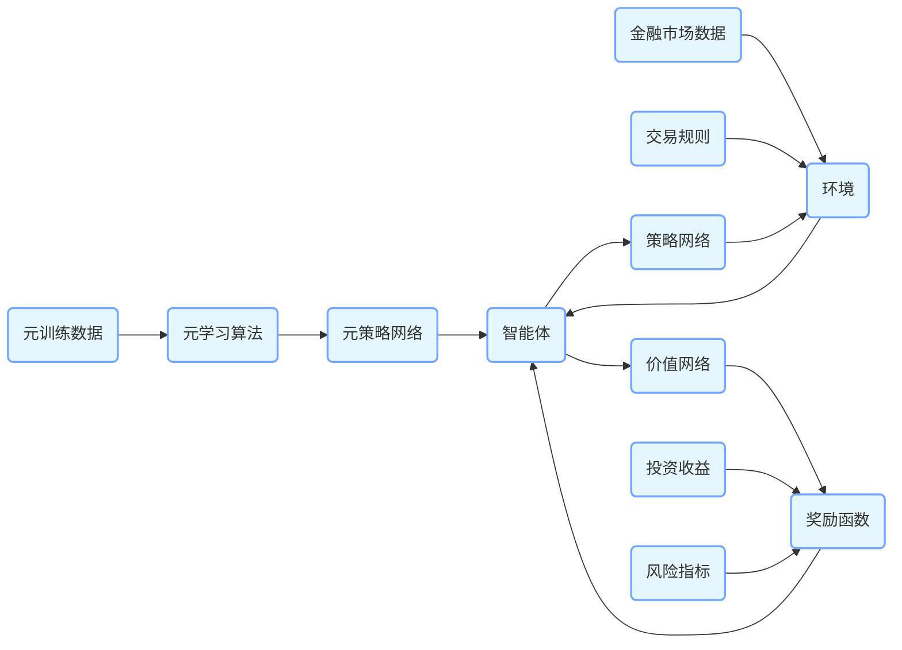

# 金融领域元强化学习在投资策略中的应用

> 关键词：金融领域、元强化学习、投资策略、智能决策、算法优化

> 摘要：本文聚焦于金融领域元强化学习在投资策略中的应用。首先介绍了相关背景知识，包括研究目的、预期读者和文档结构等。详细阐述了元强化学习和投资策略的核心概念及其联系，并给出了相应的示意图和流程图。深入讲解了核心算法原理，通过Python代码进行具体操作步骤的展示。运用数学模型和公式对元强化学习在投资策略中的应用进行分析，并举例说明。通过项目实战，从开发环境搭建到源代码实现及解读，完整呈现了元强化学习在投资策略中的应用过程。探讨了其实际应用场景，推荐了学习资源、开发工具框架以及相关论文著作。最后总结了未来发展趋势与挑战，还提供了常见问题解答和扩展阅读参考资料，旨在为金融投资领域引入元强化学习提供全面而深入的指导。

## 1. 背景介绍 
### 1.1 目的和范围
在金融投资领域，传统的投资策略往往依赖于固定的规则和历史数据，难以适应市场的动态变化。元强化学习作为一种新兴的技术，具有学习如何学习的能力，能够在不同的环境和任务中快速适应和优化策略。本文的目的在于深入探讨元强化学习在金融投资策略中的应用，研究如何利用元强化学习的优势来提高投资决策的准确性和适应性。范围涵盖了元强化学习的基本概念、核心算法、数学模型，以及在实际投资场景中的应用案例，同时提供相关的学习资源和工具推荐。

### 1.2 预期读者
本文预期读者包括金融领域的投资分析师、量化交易员、金融科技从业者，以及对人工智能在金融领域应用感兴趣的研究人员和学生。对于有一定编程基础和机器学习知识的读者，将更容易理解本文中的算法原理和代码实现；而对于金融专业人士，可重点关注投资策略的设计和应用场景部分。

### 1.3 文档结构概述
本文将按照以下结构进行组织：首先介绍核心概念与联系，明确元强化学习和投资策略的基本定义和相互关系；接着详细讲解核心算法原理和具体操作步骤，并通过Python代码实现；然后阐述相关的数学模型和公式，并举例说明其应用；通过项目实战展示元强化学习在投资策略中的具体实现过程；探讨实际应用场景；推荐相关的学习资源、开发工具框架和论文著作；最后总结未来发展趋势与挑战，并提供常见问题解答和扩展阅读参考资料。

### 1.4 术语表
#### 1.4.1 核心术语定义
- **元强化学习（Meta-Reinforcement Learning）**：一种强化学习的扩展，它不仅学习在特定环境中执行任务的策略，还学习如何在不同环境和任务中快速学习和适应，通过学习学习过程本身来提高学习效率和泛化能力。
- **投资策略（Investment Strategy）**：投资者为了实现投资目标，在投资过程中所采用的一系列决策规则和方法，包括资产配置、交易时机选择等。
- **强化学习（Reinforcement Learning）**：一种机器学习范式，智能体通过与环境进行交互，根据环境反馈的奖励信号来学习最优策略，以最大化长期累积奖励。
- **智能体（Agent）**：在强化学习中，能够感知环境状态并采取行动的实体，其目标是通过与环境的交互学习到最优策略。
- **环境（Environment）**：智能体所处的外部世界，它接收智能体的行动并返回新的状态和奖励信号。

#### 1.4.2 相关概念解释
- **探索与利用（Exploration vs. Exploitation）**：在强化学习中，探索是指智能体尝试不同的行动以发现更好的策略，而利用则是指智能体选择已知的最优行动。平衡探索和利用是强化学习中的一个重要问题。
- **策略梯度（Policy Gradient）**：一种用于优化策略的方法，通过计算策略参数的梯度来更新策略，使得策略在长期内获得更大的累积奖励。
- **价值函数（Value Function）**：用于评估智能体在某个状态下的长期价值，包括状态价值函数和动作价值函数。状态价值函数表示从某个状态开始，按照当前策略执行所能获得的长期累积奖励的期望；动作价值函数表示在某个状态下采取某个动作后，按照当前策略执行所能获得的长期累积奖励的期望。

#### 1.4.3 缩略词列表
- **MDP（Markov Decision Process）**：马尔可夫决策过程，是一种用于描述强化学习问题的数学模型，具有马尔可夫性质，即当前状态的转移只与当前状态和当前动作有关，而与历史状态和动作无关。
- **PG（Policy Gradient）**：策略梯度。
- **A2C（Advantage Actor-Critic）**：优势演员 - 评论家算法，是一种结合了策略梯度和价值函数估计的强化学习算法。
- **PPO（Proximal Policy Optimization）**：近端策略优化算法，是一种改进的策略梯度算法，通过限制策略更新的步长来提高算法的稳定性和效率。

## 2. 核心概念与联系 
### 2.1 元强化学习的原理
元强化学习的核心思想是让智能体学习如何在不同的任务和环境中快速学习。传统的强化学习需要在每个新的任务上进行大量的试错学习，而元强化学习通过在多个相关任务上进行训练，学习到一种通用的学习能力，使得智能体在面对新任务时能够更快地收敛到最优策略。

元强化学习通常基于元学习的框架，元学习可以分为基于模型的元学习、基于优化的元学习和基于度量的元学习等不同类型。在元强化学习中，常用的方法包括基于模型的元强化学习和基于策略梯度的元强化学习。

基于模型的元强化学习通过学习环境的动态模型，预测环境的状态转移和奖励信号，从而在新任务上更快地进行规划和决策。基于策略梯度的元强化学习则直接优化策略网络，使得策略能够在不同任务上快速适应。

### 2.2 投资策略的基本概念
投资策略是投资者根据自身的投资目标、风险偏好和市场情况等因素制定的一系列投资决策规则。常见的投资策略包括基本面分析策略、技术分析策略、量化投资策略等。

基本面分析策略通过研究公司的财务报表、行业前景等基本面因素来评估股票的价值，从而做出投资决策。技术分析策略则通过分析股票的价格走势、成交量等技术指标来预测股票的未来走势，制定投资策略。量化投资策略则利用数学模型和计算机算法来进行投资决策，通过对大量历史数据的分析和挖掘，寻找投资机会。

### 2.3 元强化学习与投资策略的联系
元强化学习在投资策略中的应用主要体现在以下几个方面：
- **快速适应市场变化**：金融市场是动态变化的，不同的市场环境需要不同的投资策略。元强化学习能够让智能体快速适应新的市场环境，通过在不同市场环境下的训练，学习到如何快速调整投资策略。
- **优化投资组合**：元强化学习可以用于优化投资组合，通过学习不同资产之间的相关性和风险收益特征，智能体可以动态调整资产配置，以实现投资组合的最优风险收益平衡。
- **提高交易效率**：元强化学习可以用于优化交易时机的选择，通过学习市场的交易模式和价格波动规律，智能体可以在合适的时机进行买入和卖出操作，提高交易效率。

### 2.4 核心概念原理和架构的文本示意图
```plaintext
元强化学习系统
|-- 元学习模块
|   |-- 元训练数据
|   |-- 元学习算法
|   |   |-- 基于模型的元学习
|   |   |-- 基于策略梯度的元学习
|   |-- 元策略网络
|-- 强化学习模块
|   |-- 环境
|   |   |-- 金融市场数据
|   |   |-- 交易规则
|   |-- 智能体
|   |   |-- 策略网络
|   |   |-- 价值网络
|   |-- 奖励函数
|   |   |-- 投资收益
|   |   |-- 风险指标
```

### 2.5 Mermaid 流程图


## 3. 核心算法原理 & 具体操作步骤 
### 3.1 基于策略梯度的元强化学习算法原理
基于策略梯度的元强化学习算法通过优化策略网络的参数，使得策略在不同任务上能够快速适应。常见的基于策略梯度的元强化学习算法包括MAML（Model-Agnostic Meta-Learning）和Reptile等。

以MAML为例，其基本思想是在元训练阶段，通过在多个任务上进行快速适应，学习到一个初始的策略参数，使得该参数在新任务上进行少量的梯度更新后能够快速收敛到最优策略。

具体来说，MAML的算法步骤如下：
1. **初始化策略网络的参数 $\theta$**。
2. **在元训练集上进行迭代**：
    - 从元训练集中采样一个任务 $T$。
    - 在任务 $T$ 上进行 $K$ 步的梯度更新，得到临时参数 $\theta'$：
      - 对于 $k = 1, \cdots, K$：
        - 从任务 $T$ 中采样一个轨迹 $\tau = (s_0, a_0, r_0, s_1, a_1, r_1, \cdots)$。
        - 计算策略梯度 $\nabla_{\theta} J(\theta)$，其中 $J(\theta)$ 是策略的目标函数，通常是长期累积奖励的期望。
        - 更新参数 $\theta \leftarrow \theta - \alpha \nabla_{\theta} J(\theta)$，其中 $\alpha$ 是学习率。
    - 计算元梯度 $\nabla_{\theta} J_{meta}(\theta)$，其中 $J_{meta}(\theta)$ 是元目标函数，通常是在临时参数 $\theta'$ 下在任务 $T$ 上的验证损失。
    - 更新元参数 $\theta \leftarrow \theta - \beta \nabla_{\theta} J_{meta}(\theta)$，其中 $\beta$ 是元学习率。

### 3.2 Python 代码实现
以下是一个简化的基于MAML的元强化学习算法在投资策略中的Python代码示例：

```python
import torch
import torch.nn as nn
import torch.optim as optim
import numpy as np

# 定义策略网络
class PolicyNetwork(nn.Module):
    def __init__(self, input_dim, output_dim):
        super(PolicyNetwork, self).__init__()
        self.fc1 = nn.Linear(input_dim, 64)
        self.fc2 = nn.Linear(64, output_dim)

    def forward(self, x):
        x = torch.relu(self.fc1(x))
        x = torch.softmax(self.fc2(x), dim=-1)
        return x

# 定义环境（简化的金融市场环境）
class FinancialEnvironment:
    def __init__(self):
        self.state_dim = 10
        self.action_dim = 3
        self.reset()

    def reset(self):
        self.state = np.random.randn(self.state_dim)
        return self.state

    def step(self, action):
        # 简单模拟奖励
        reward = np.random.randn()
        next_state = np.random.randn(self.state_dim)
        done = False
        return next_state, reward, done

# 定义MAML算法
class MAML:
    def __init__(self, input_dim, output_dim, meta_lr=0.001, inner_lr=0.01, num_inner_steps=5):
        self.policy = PolicyNetwork(input_dim, output_dim)
        self.meta_optimizer = optim.Adam(self.policy.parameters(), lr=meta_lr)
        self.inner_lr = inner_lr
        self.num_inner_steps = num_inner_steps

    def meta_train(self, num_tasks, num_epochs):
        for epoch in range(num_epochs):
            meta_loss = 0
            for task in range(num_tasks):
                env = FinancialEnvironment()
                state = env.reset()
                # 复制策略网络参数
                fast_weights = [p.clone() for p in self.policy.parameters()]
                for _ in range(self.num_inner_steps):
                    state_tensor = torch.FloatTensor(state).unsqueeze(0)
                    action_probs = self.policy(state_tensor)
                    action = torch.multinomial(action_probs, 1).item()
                    next_state, reward, done = env.step(action)
                    # 计算损失（简化）
                    loss = -torch.log(action_probs[0][action]) * reward
                    # 计算梯度
                    grads = torch.autograd.grad(loss, self.policy.parameters())
                    # 更新快速权重
                    fast_weights = [w - self.inner_lr * g for w, g in zip(fast_weights, grads)]
                # 计算元损失
                state = env.reset()
                state_tensor = torch.FloatTensor(state).unsqueeze(0)
                with torch.no_grad():
                    action_probs = self.policy(state_tensor)
                action = torch.multinomial(action_probs, 1).item()
                next_state, reward, done = env.step(action)
                meta_loss += -torch.log(action_probs[0][action]) * reward
            # 更新元参数
            self.meta_optimizer.zero_grad()
            meta_loss.backward()
            self.meta_optimizer.step()
            print(f'Epoch {epoch}: Meta Loss = {meta_loss.item()}')

# 训练MAML模型
input_dim = 10
output_dim = 3
maml = MAML(input_dim, output_dim)
maml.meta_train(num_tasks=10, num_epochs=100)
```

### 3.3 具体操作步骤解释
1. **定义策略网络**：使用PyTorch定义一个简单的全连接神经网络作为策略网络，输入为环境状态，输出为动作概率分布。
2. **定义环境**：定义一个简化的金融市场环境，包括状态维度、动作维度、重置函数和步进函数。
3. **定义MAML算法**：实现MAML算法的核心逻辑，包括元训练过程和快速权重更新过程。
4. **进行元训练**：在多个任务上进行元训练，每个任务上进行多次快速权重更新，然后计算元损失并更新元参数。

## 4. 数学模型和公式 & 详细讲解 & 举例说明 
### 4.1 马尔可夫决策过程（MDP）
在强化学习中，通常使用马尔可夫决策过程（MDP）来描述智能体与环境的交互过程。一个MDP可以用一个五元组 $(S, A, P, R, \gamma)$ 表示，其中：
- $S$ 是状态空间，表示环境的所有可能状态。
- $A$ 是动作空间，表示智能体可以采取的所有可能动作。
- $P: S \times A \times S \rightarrow [0, 1]$ 是状态转移概率函数，表示在状态 $s \in S$ 下采取动作 $a \in A$ 后转移到状态 $s' \in S$ 的概率。
- $R: S \times A \rightarrow \mathbb{R}$ 是奖励函数，表示在状态 $s \in S$ 下采取动作 $a \in A$ 后获得的即时奖励。
- $\gamma \in [0, 1]$ 是折扣因子，表示未来奖励的折现率。

智能体的目标是找到一个最优策略 $\pi: S \rightarrow A$，使得长期累积奖励的期望最大化，即：
$$
J(\pi) = \mathbb{E}_{\tau \sim \pi} \left[ \sum_{t=0}^{\infty} \gamma^t R(s_t, a_t) \right]
$$
其中 $\tau = (s_0, a_0, s_1, a_1, \cdots)$ 是一个轨迹，$s_t$ 是第 $t$ 时刻的状态，$a_t$ 是第 $t$ 时刻的动作。

### 4.2 策略梯度定理
策略梯度定理是基于策略梯度的强化学习算法的理论基础。策略梯度定理表明，策略的目标函数 $J(\theta)$ 关于策略参数 $\theta$ 的梯度可以表示为：
$$
\nabla_{\theta} J(\theta) = \mathbb{E}_{\tau \sim \pi_{\theta}} \left[ \sum_{t=0}^{T} \nabla_{\theta} \log \pi_{\theta}(a_t | s_t) Q^{\pi_{\theta}}(s_t, a_t) \right]
$$
其中 $\pi_{\theta}$ 是参数为 $\theta$ 的策略，$Q^{\pi_{\theta}}(s_t, a_t)$ 是动作价值函数，表示在状态 $s_t$ 下采取动作 $a_t$ 后按照策略 $\pi_{\theta}$ 执行所能获得的长期累积奖励的期望。

### 4.3 MAML 的数学模型
在MAML中，元目标函数 $J_{meta}(\theta)$ 可以表示为：
$$
J_{meta}(\theta) = \sum_{T \in \mathcal{T}} \mathbb{E}_{\tau \sim \pi_{\theta'_T}} \left[ \sum_{t=0}^{T} R(s_t, a_t) \right]
$$
其中 $\mathcal{T}$ 是元训练集，$\theta'_T$ 是在任务 $T$ 上进行 $K$ 步梯度更新后的临时参数。

### 4.4 举例说明
假设我们有一个简化的金融投资环境，状态空间 $S$ 包括股票的价格、成交量等特征，动作空间 $A$ 包括买入、卖出和持有三种动作。奖励函数 $R$ 可以定义为投资收益减去交易成本。

在MAML的元训练过程中，我们从元训练集中采样不同的金融市场场景作为任务。对于每个任务，智能体在该任务上进行多次梯度更新，学习到一个临时策略。然后，我们在该任务上评估临时策略的性能，计算元损失。通过不断更新元参数，使得智能体能够在不同的金融市场场景中快速适应，找到最优的投资策略。

## 5. 项目实战：代码实际案例和详细解释说明 
### 5.1 开发环境搭建
#### 5.1.1 安装Python
首先需要安装Python，建议使用Python 3.7及以上版本。可以从Python官方网站（https://www.python.org/downloads/）下载并安装。

#### 5.1.2 安装依赖库
使用以下命令安装所需的依赖库：
```sh
pip install torch numpy
```
其中 `torch` 是PyTorch深度学习框架，`numpy` 是用于数值计算的库。

### 5.2 源代码详细实现和代码解读
#### 5.2.1 策略网络定义
```python
class PolicyNetwork(nn.Module):
    def __init__(self, input_dim, output_dim):
        super(PolicyNetwork, self).__init__()
        self.fc1 = nn.Linear(input_dim, 64)
        self.fc2 = nn.Linear(64, output_dim)

    def forward(self, x):
        x = torch.relu(self.fc1(x))
        x = torch.softmax(self.fc2(x), dim=-1)
        return x
```
这段代码定义了一个简单的全连接神经网络作为策略网络。输入层有 `input_dim` 个神经元，中间层有64个神经元，输出层有 `output_dim` 个神经元。使用ReLU激活函数和Softmax函数将输出转换为动作概率分布。

#### 5.2.2 环境定义
```python
class FinancialEnvironment:
    def __init__(self):
        self.state_dim = 10
        self.action_dim = 3
        self.reset()

    def reset(self):
        self.state = np.random.randn(self.state_dim)
        return self.state

    def step(self, action):
        # 简单模拟奖励
        reward = np.random.randn()
        next_state = np.random.randn(self.state_dim)
        done = False
        return next_state, reward, done
```
这段代码定义了一个简化的金融市场环境。`reset` 函数用于重置环境状态，`step` 函数用于执行动作并返回下一个状态、奖励和是否结束的标志。

#### 5.2.3 MAML算法实现
```python
class MAML:
    def __init__(self, input_dim, output_dim, meta_lr=0.001, inner_lr=0.01, num_inner_steps=5):
        self.policy = PolicyNetwork(input_dim, output_dim)
        self.meta_optimizer = optim.Adam(self.policy.parameters(), lr=meta_lr)
        self.inner_lr = inner_lr
        self.num_inner_steps = num_inner_steps

    def meta_train(self, num_tasks, num_epochs):
        for epoch in range(num_epochs):
            meta_loss = 0
            for task in range(num_tasks):
                env = FinancialEnvironment()
                state = env.reset()
                # 复制策略网络参数
                fast_weights = [p.clone() for p in self.policy.parameters()]
                for _ in range(self.num_inner_steps):
                    state_tensor = torch.FloatTensor(state).unsqueeze(0)
                    action_probs = self.policy(state_tensor)
                    action = torch.multinomial(action_probs, 1).item()
                    next_state, reward, done = env.step(action)
                    # 计算损失（简化）
                    loss = -torch.log(action_probs[0][action]) * reward
                    # 计算梯度
                    grads = torch.autograd.grad(loss, self.policy.parameters())
                    # 更新快速权重
                    fast_weights = [w - self.inner_lr * g for w, g in zip(fast_weights, grads)]
                # 计算元损失
                state = env.reset()
                state_tensor = torch.FloatTensor(state).unsqueeze(0)
                with torch.no_grad():
                    action_probs = self.policy(state_tensor)
                action = torch.multinomial(action_probs, 1).item()
                next_state, reward, done = env.step(action)
                meta_loss += -torch.log(action_probs[0][action]) * reward
            # 更新元参数
            self.meta_optimizer.zero_grad()
            meta_loss.backward()
            self.meta_optimizer.step()
            print(f'Epoch {epoch}: Meta Loss = {meta_loss.item()}')
```
这段代码实现了MAML算法的核心逻辑。`__init__` 函数初始化策略网络、元优化器和超参数。`meta_train` 函数进行元训练，包括在多个任务上进行快速权重更新和元损失计算，最后更新元参数。

### 5.3 代码解读与分析
#### 5.3.1 策略网络
策略网络的作用是根据环境状态输出动作概率分布。通过全连接层和激活函数的组合，将输入的状态特征映射到动作空间。

#### 5.3.2 环境
环境模拟了金融市场的动态变化，智能体通过与环境交互获得奖励和下一个状态。在实际应用中，环境可以使用真实的金融市场数据进行构建。

#### 5.3.3 MAML算法
MAML算法的核心是在多个任务上进行快速适应和元学习。通过复制策略网络参数并在每个任务上进行多次梯度更新，得到临时参数。然后在临时参数下评估策略性能，计算元损失并更新元参数。

## 6. 实际应用场景 
### 6.1 股票投资策略优化
在股票投资中，元强化学习可以用于优化投资组合和交易时机。通过学习不同股票的历史数据和市场环境，智能体可以动态调整投资组合，选择最优的买入和卖出时机。例如，在市场行情变化时，智能体可以快速适应新的市场环境，调整投资策略，以获得更高的投资收益。

### 6.2 期货交易策略设计
期货市场具有高杠杆、高风险的特点，元强化学习可以用于设计期货交易策略。智能体可以学习期货价格的波动规律和市场情绪，根据不同的市场情况选择合适的交易策略，如套期保值、套利等。通过元强化学习，智能体可以在不同的期货品种和市场环境中快速适应，提高交易效率和盈利能力。

### 6.3 资产配置优化
资产配置是投资组合管理的重要环节，元强化学习可以用于优化资产配置。智能体可以学习不同资产之间的相关性和风险收益特征，根据投资者的风险偏好和投资目标，动态调整资产配置比例。例如，在市场风险较高时，智能体可以增加债券等低风险资产的配置比例；在市场行情较好时，智能体可以增加股票等风险资产的配置比例。

### 6.4 量化投资策略开发
量化投资策略通过数学模型和计算机算法来进行投资决策，元强化学习可以用于开发量化投资策略。智能体可以学习大量的历史数据和市场特征，挖掘投资机会，构建量化投资模型。通过元强化学习，智能体可以不断优化量化投资策略，提高策略的适应性和盈利能力。

## 7. 工具和资源推荐
### 7.1 学习资源推荐
#### 7.1.1 书籍推荐
- 《Reinforcement Learning: An Introduction》（Richard S. Sutton和Andrew G. Barto著）：这是一本强化学习领域的经典教材，全面介绍了强化学习的基本概念、算法和应用。
- 《Deep Reinforcement Learning Hands-On》（Max Lapan著）：本书通过实际案例介绍了深度强化学习的实现方法和应用场景，适合有一定编程基础的读者。
- 《Meta-Learning: A Survey》（Antreas Antoniou、Harry Edward和Amos Storkey著）：这篇综述文章对元学习的理论和方法进行了系统的介绍，是学习元学习的重要参考资料。

#### 7.1.2 在线课程
- Coursera上的“Reinforcement Learning Specialization”：由Richard S. Sutton和其他知名学者授课，全面介绍了强化学习的理论和实践。
- edX上的“Deep Reinforcement Learning”：由UC Berkeley的Pieter Abbeel教授授课，深入讲解了深度强化学习的算法和应用。
- OpenAI Gym的官方文档和教程：OpenAI Gym是一个用于开发和比较强化学习算法的工具包，其官方文档和教程提供了丰富的学习资源。

#### 7.1.3 技术博客和网站
- OpenAI博客（https://openai.com/blog/）：OpenAI是人工智能领域的领先研究机构，其博客发布了许多关于强化学习和元学习的最新研究成果和技术文章。
- DeepMind博客（https://deepmind.com/blog/）：DeepMind是另一家知名的人工智能研究机构，其博客分享了许多关于强化学习在游戏、机器人等领域的应用案例和研究进展。
- Towards Data Science（https://towardsdatascience.com/）：这是一个数据科学和机器学习领域的技术博客平台，上面有许多关于强化学习和元学习的优质文章。

### 7.2 开发工具框架推荐
#### 7.2.1 IDE和编辑器
- PyCharm：是一款专业的Python集成开发环境，提供了丰富的代码编辑、调试和项目管理功能，适合开发Python代码。
- Jupyter Notebook：是一个交互式的开发环境，支持Python、R等多种编程语言，适合进行数据探索、模型训练和可视化等工作。
- Visual Studio Code：是一款轻量级的代码编辑器，支持多种编程语言和插件，具有丰富的扩展功能，适合快速开发和调试代码。

#### 7.2.2 调试和性能分析工具
- TensorBoard：是TensorFlow提供的一个可视化工具，用于监控和分析深度学习模型的训练过程和性能指标。
- PyTorch Profiler：是PyTorch提供的一个性能分析工具，用于分析模型的运行时间、内存使用等性能指标，帮助优化模型性能。
- cProfile：是Python标准库中的一个性能分析工具，用于分析Python代码的运行时间和函数调用次数，帮助找出代码中的性能瓶颈。

#### 7.2.3 相关框架和库
- PyTorch：是一个开源的深度学习框架，提供了丰富的神经网络层和优化算法，支持GPU加速，适合开发强化学习和元学习算法。
- TensorFlow：是另一个知名的深度学习框架，具有广泛的应用和丰富的工具生态系统，也可以用于开发强化学习和元学习算法。
- OpenAI Gym：是一个用于开发和比较强化学习算法的工具包，提供了各种模拟环境和评估指标，方便开发者进行算法实验和测试。

### 7.3 相关论文著作推荐
#### 7.3.1 经典论文
- “Model-Agnostic Meta-Learning for Fast Adaptation of Deep Networks”（Chelsea Finn、Pieter Abbeel和Sergey Levine著）：这篇论文提出了MAML算法，是元学习领域的经典之作。
- “Proximal Policy Optimization Algorithms”（John Schulman、Filip Wolski、Prafulla Dhariwal等著）：这篇论文提出了PPO算法，是一种高效的策略梯度算法，在强化学习领域得到了广泛应用。
- “Asynchronous Methods for Deep Reinforcement Learning”（Volodymyr Mnih、Adrià Puigdomènech Badia、Mehdi Mirza等著）：这篇论文提出了A3C算法，是一种异步的深度强化学习算法，提高了算法的训练效率。

#### 7.3.2 最新研究成果
- 关注NeurIPS、ICML、AAAI等顶级人工智能会议的论文，这些会议每年都会发表许多关于强化学习和元学习的最新研究成果。
- 关注ArXiv预印本平台（https://arxiv.org/），上面有许多研究人员上传的最新研究论文。

#### 7.3.3 应用案例分析
- 《Quantitative Trading: How to Build Your Own Algorithmic Trading Business》（Ernest P. Chan著）：这本书介绍了量化交易的基本概念和方法，包括如何使用机器学习和强化学习算法进行量化投资策略开发。
- 《Advances in Financial Machine Learning》（Marcos López de Prado著）：这本书介绍了机器学习在金融领域的应用，包括如何使用深度学习和强化学习算法进行金融市场预测和投资策略优化。

## 8. 总结：未来发展趋势与挑战
### 8.1 未来发展趋势
#### 8.1.1 与其他技术的融合
元强化学习将与其他人工智能技术如深度学习、自然语言处理等进行更深入的融合。例如，结合深度学习的强大特征提取能力和元强化学习的快速适应能力，可以开发出更智能的投资决策系统。同时，将自然语言处理技术应用于金融新闻和公告的分析，为元强化学习提供更多的信息输入，提高投资策略的准确性。

#### 8.1.2 跨领域应用拓展
元强化学习在金融领域的应用将不仅仅局限于投资策略，还将拓展到风险管理、保险定价、金融监管等其他领域。例如，在风险管理中，元强化学习可以用于实时监测和评估金融风险，动态调整风险控制策略。在保险定价中，元强化学习可以根据客户的风险特征和市场环境，制定个性化的保险费率。

#### 8.1.3 多智能体系统的应用
随着金融市场的复杂性增加，多智能体系统在金融领域的应用将越来越广泛。元强化学习可以用于训练多个智能体之间的协作和竞争策略，提高金融市场的效率和稳定性。例如，在股票交易中，多个智能体可以通过协作进行套利交易，或者通过竞争来优化各自的投资策略。

### 8.2 挑战
#### 8.2.1 数据质量和隐私问题
金融数据通常具有高维度、噪声大、隐私性强等特点，数据质量和隐私问题是元强化学习在金融领域应用的一大挑战。一方面，需要对金融数据进行有效的清洗和预处理，提高数据质量；另一方面，需要采用合适的隐私保护技术，确保数据的安全性和合规性。

#### 8.2.2 算法的可解释性
元强化学习算法通常是基于深度学习模型的，其决策过程往往是黑盒的，缺乏可解释性。在金融领域，投资决策需要有明确的解释和依据，因此提高元强化学习算法的可解释性是一个重要的挑战。可以采用一些方法，如特征重要性分析、决策树等，来解释元强化学习算法的决策过程。

#### 8.2.3 市场的不确定性和复杂性
金融市场具有高度的不确定性和复杂性，市场环境的变化往往是不可预测的。元强化学习虽然具有快速适应的能力，但在面对极端市场情况时，可能仍然无法及时做出准确的决策。因此，需要进一步研究如何提高元强化学习算法在不确定性和复杂市场环境下的鲁棒性和适应性。

## 9. 附录：常见问题与解答
### 9.1 元强化学习与传统强化学习有什么区别？
传统强化学习需要在每个新的任务上进行大量的试错学习，而元强化学习通过在多个相关任务上进行训练，学习到一种通用的学习能力，使得智能体在面对新任务时能够更快地收敛到最优策略。元强化学习更加注重学习如何学习，而传统强化学习更加注重在特定任务上学习最优策略。

### 9.2 元强化学习在金融领域的应用有哪些局限性？
元强化学习在金融领域的应用存在一些局限性，主要包括数据质量和隐私问题、算法的可解释性问题以及市场的不确定性和复杂性问题。金融数据的质量和隐私性对元强化学习的性能有重要影响，算法的可解释性不足可能导致投资决策缺乏明确的依据，市场的不确定性和复杂性可能使得元强化学习在极端市场情况下无法及时做出准确的决策。

### 9.3 如何评估元强化学习在投资策略中的性能？
可以使用一些常见的评估指标来评估元强化学习在投资策略中的性能，如收益率、夏普比率、最大回撤等。收益率反映了投资策略的盈利能力，夏普比率反映了投资策略的风险调整后收益，最大回撤反映了投资策略在一段时间内的最大损失。此外，还可以通过回测和实盘交易来评估投资策略的性能。

### 9.4 元强化学习需要大量的计算资源吗？
元强化学习通常需要大量的计算资源，特别是在训练阶段。由于元强化学习需要在多个任务上进行训练，并且需要进行多次梯度更新，因此计算量较大。可以使用GPU加速和分布式计算等技术来提高计算效率，减少训练时间。

## 10. 扩展阅读 & 参考资料
### 10.1 扩展阅读
- 《Artificial Intelligence: A Modern Approach》（Stuart Russell和Peter Norvig著）：这是一本人工智能领域的经典教材，全面介绍了人工智能的基本概念、算法和应用，包括强化学习和元学习等内容。
- 《Machine Learning》（Tom M. Mitchell著）：这本书是机器学习领域的经典教材，系统介绍了机器学习的基本理论和方法，对于理解元强化学习的理论基础有很大帮助。
- 《Financial Machine Learning: From Theory to Practice》（Yves Hilpisch著）：这本书介绍了机器学习在金融领域的应用，包括如何使用机器学习算法进行金融市场预测和投资策略开发，适合对金融和机器学习感兴趣的读者。

### 10.2 参考资料
- Finn, C., Abbeel, P., & Levine, S. (2017). Model-Agnostic Meta-Learning for Fast Adaptation of Deep Networks. arXiv preprint arXiv:1703.03400.
- Schulman, J., Wolski, F., Dhariwal, P., Radford, A., & Klimov, O. (2017). Proximal Policy Optimization Algorithms. arXiv preprint arXiv:1707.06347.
- Mnih, V., Badia, A. P., Mirza, M., Graves, A., Lillicrap, T., Harley, T.,... & Kavukcuoglu, K. (2016). Asynchronous Methods for Deep Reinforcement Learning. In International Conference on Machine Learning (pp. 1928-1937).

作者：AI天才研究院/AI Genius Institute & 禅与计算机程序设计艺术 /Zen And The Art of Computer Programming