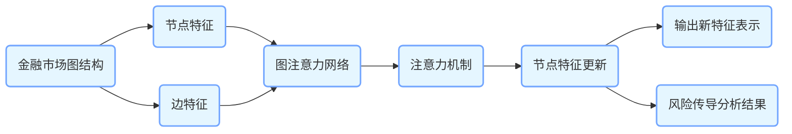

# 金融领域图注意力网络在系统性风险传导分析中的应用

> 关键词：金融领域、图注意力网络、系统性风险传导、风险分析、深度学习

> 摘要：本文聚焦于金融领域中图注意力网络在系统性风险传导分析方面的应用。首先介绍了相关背景知识，包括目的、预期读者等内容。接着阐述了图注意力网络及系统性风险传导的核心概念与联系，给出了原理和架构的文本示意图与Mermaid流程图。详细讲解了核心算法原理，并用Python代码进行说明，同时给出了相关数学模型和公式以及具体例子。通过项目实战展示了代码的实际应用和详细解读。探讨了该技术在金融领域的实际应用场景，推荐了学习、开发相关的工具和资源，最后对未来发展趋势与挑战进行总结，还包含常见问题解答和扩展阅读参考资料。旨在为金融从业者和研究者提供全面深入的技术参考，助力金融系统性风险的有效分析与管理。

## 1. 背景介绍 
### 1.1 目的和范围
在金融市场中，系统性风险是指由整体市场环境、宏观经济因素等引发的，对整个金融体系造成广泛影响的风险。这种风险一旦爆发，可能导致金融机构倒闭、市场崩溃等严重后果。因此，准确分析和预测系统性风险的传导路径和影响程度具有至关重要的意义。

本文章的目的在于深入探讨图注意力网络（Graph Attention Network，GAT）在金融领域系统性风险传导分析中的应用。通过引入图注意力网络这一先进的深度学习模型，挖掘金融市场中各主体之间复杂的关系和相互作用，从而更准确地识别系统性风险的传导机制。

文章的范围主要涵盖图注意力网络的基本原理、在系统性风险传导分析中的具体应用方法、相关的数学模型和公式，以及通过实际案例展示其在金融领域的应用效果。同时，还会介绍相关的学习资源、开发工具和未来发展趋势。

### 1.2 预期读者
本文的预期读者包括金融领域的从业者，如银行风险管理人员、金融分析师、投资经理等，他们可以通过本文了解图注意力网络在系统性风险分析中的应用，为实际工作中的风险评估和决策提供新的思路和方法。

同时，也适合计算机科学领域对金融应用感兴趣的研究者和开发者，他们可以从中学习如何将图注意力网络应用到具体的金融场景中，拓展自己的研究和应用领域。此外，高校金融、计算机相关专业的师生也可以将本文作为学习和研究的参考资料。

### 1.3 文档结构概述
本文将按照以下结构进行组织：
- 核心概念与联系：介绍图注意力网络和系统性风险传导的基本概念，以及它们之间的联系，并给出原理和架构的文本示意图与Mermaid流程图。
- 核心算法原理 & 具体操作步骤：详细讲解图注意力网络的核心算法原理，并用Python代码进行说明。
- 数学模型和公式 & 详细讲解 & 举例说明：给出图注意力网络在系统性风险传导分析中的数学模型和公式，并进行详细讲解和举例说明。
- 项目实战：代码实际案例和详细解释说明：通过一个实际的项目案例，展示图注意力网络在系统性风险传导分析中的具体应用，包括开发环境搭建、源代码实现和代码解读。
- 实际应用场景：探讨图注意力网络在金融领域系统性风险传导分析中的实际应用场景。
- 工具和资源推荐：推荐相关的学习资源、开发工具和框架，以及经典论文和最新研究成果。
- 总结：未来发展趋势与挑战：对图注意力网络在金融领域系统性风险传导分析中的应用进行总结，分析未来的发展趋势和面临的挑战。
- 附录：常见问题与解答：解答读者在阅读过程中可能遇到的常见问题。
- 扩展阅读 & 参考资料：提供相关的扩展阅读材料和参考资料。

### 1.4 术语表
#### 1.4.1 核心术语定义
- **图注意力网络（Graph Attention Network，GAT）**：一种基于图结构数据的深度学习模型，通过注意力机制来学习图中节点之间的关系和特征表示。
- **系统性风险**：指由整体市场环境、宏观经济因素等引发的，对整个金融体系造成广泛影响的风险。
- **风险传导**：指金融市场中一个主体的风险通过各种渠道传播到其他主体，从而影响整个金融体系的稳定。
- **图结构数据**：由节点和边组成的数据结构，用于表示实体之间的关系。在金融领域中，节点可以表示金融机构、企业等，边可以表示它们之间的业务往来、股权关系等。
- **注意力机制**：一种在深度学习中广泛应用的技术，用于自动分配不同输入的重要性权重，从而提高模型的性能。

#### 1.4.2 相关概念解释
- **金融网络**：金融市场中各主体之间通过各种业务往来和关系形成的复杂网络。金融网络可以用图结构数据来表示，其中节点表示金融机构、企业等，边表示它们之间的业务关系。
- **风险溢出**：指一个金融机构或市场的风险通过各种渠道传播到其他金融机构或市场，从而导致风险的扩散和放大。
- **特征表示**：将原始数据转换为适合机器学习模型处理的向量表示。在图注意力网络中，通过学习节点和边的特征表示，可以更好地捕捉图中节点之间的关系和信息。

#### 1.4.3 缩略词列表
- **GAT**：Graph Attention Network（图注意力网络）
- **DNN**：Deep Neural Network（深度神经网络）
- **MLP**：Multi - Layer Perceptron（多层感知机）

## 2. 核心概念与联系 

### 图注意力网络的原理
图注意力网络是一种专门处理图结构数据的深度学习模型。传统的神经网络模型（如卷积神经网络、循环神经网络）主要处理欧几里得空间的数据（如图像、序列），而图结构数据具有不规则性，节点的邻居数量和连接方式各不相同。图注意力网络通过注意力机制来解决这个问题。

注意力机制允许模型在处理每个节点时，自动为其邻居节点分配不同的权重。具体来说，对于图中的每个节点 $i$，它会计算与邻居节点 $j$ 之间的注意力系数 $\alpha_{ij}$，该系数表示节点 $j$ 对节点 $i$ 的重要性。然后，节点 $i$ 的特征表示 $h_i$ 可以通过对其邻居节点的特征进行加权求和得到。

### 系统性风险传导的概念
系统性风险传导是指金融市场中一个主体的风险通过各种渠道传播到其他主体，从而影响整个金融体系的稳定。这些渠道包括金融机构之间的业务往来、资产价格波动、信息传播等。例如，一家银行的违约可能导致与其有业务往来的其他银行面临信用风险，进而引发整个银行体系的不稳定。

### 两者的联系
图注意力网络可以很好地应用于系统性风险传导分析。金融市场中的各主体可以看作图中的节点，它们之间的业务关系可以看作图中的边。通过图注意力网络，可以学习到节点之间的复杂关系和相互作用，从而更好地捕捉系统性风险的传导路径和影响程度。例如，通过分析金融网络中各节点的特征表示和注意力系数，可以发现哪些节点在风险传导中起着关键作用，以及风险是如何从一个节点传播到其他节点的。

### 原理和架构的文本示意图
```plaintext
金融市场图结构
|
|-- 节点（金融机构、企业等）
|   |-- 节点特征（财务指标、信用评级等）
|
|-- 边（业务往来、股权关系等）
|   |-- 边特征（交易金额、交易频率等）
|
|-- 图注意力网络
|   |-- 注意力机制计算注意力系数
|   |-- 节点特征更新
|
|-- 输出
|   |-- 节点的新特征表示
|   |-- 风险传导分析结果
```

### Mermaid 流程图


## 3. 核心算法原理 & 具体操作步骤 

### 图注意力网络的核心算法原理
图注意力网络的核心是注意力机制，下面详细介绍其算法原理。

假设我们有一个图 $G=(V, E)$，其中 $V$ 是节点集合，$E$ 是边集合。每个节点 $i \in V$ 有一个特征向量 $h_i \in \mathbb{R}^F$，其中 $F$ 是特征维度。

#### 1. 线性变换
首先，对每个节点的特征向量进行线性变换：
$$
\mathbf{W} \mathbf{h}_i, \quad \mathbf{W} \in \mathbb{R}^{F' \times F}
$$
其中 $\mathbf{W}$ 是可学习的权重矩阵，$F'$ 是变换后的特征维度。

#### 2. 计算注意力系数
对于节点 $i$ 和其邻居节点 $j$，计算注意力系数 $\alpha_{ij}$：
$$
e_{ij} = \text{LeakyReLU}(\mathbf{a}^T [\mathbf{W} \mathbf{h}_i \| \mathbf{W} \mathbf{h}_j])
$$
其中 $\mathbf{a} \in \mathbb{R}^{2F'}$ 是可学习的注意力向量，$[\mathbf{W} \mathbf{h}_i \| \mathbf{W} \mathbf{h}_j]$ 表示将 $\mathbf{W} \mathbf{h}_i$ 和 $\mathbf{W} \mathbf{h}_j$ 拼接起来。

为了使注意力系数具有可比性，对其进行 softmax 归一化：
$$
\alpha_{ij} = \frac{\exp(e_{ij})}{\sum_{k \in \mathcal{N}_i} \exp(e_{ik})}
$$
其中 $\mathcal{N}_i$ 是节点 $i$ 的邻居节点集合。

#### 3. 节点特征更新
根据计算得到的注意力系数，对节点 $i$ 的特征进行更新：
$$
\mathbf{h}_i' = \sigma \left( \sum_{j \in \mathcal{N}_i} \alpha_{ij} \mathbf{W} \mathbf{h}_j \right)
$$
其中 $\sigma$ 是激活函数，通常使用 ReLU 或 LeakyReLU。

### Python 代码实现
以下是一个简单的图注意力网络层的 Python 代码实现：
```python
import torch
import torch.nn as nn
import torch.nn.functional as F

class GraphAttentionLayer(nn.Module):
    def __init__(self, in_features, out_features, dropout, alpha, concat=True):
        super(GraphAttentionLayer, self).__init__()
        self.dropout = dropout
        self.in_features = in_features
        self.out_features = out_features
        self.alpha = alpha
        self.concat = concat

        self.W = nn.Parameter(torch.zeros(size=(in_features, out_features)))
        nn.init.xavier_uniform_(self.W.data, gain=1.414)
        self.a = nn.Parameter(torch.zeros(size=(2*out_features, 1)))
        nn.init.xavier_uniform_(self.a.data, gain=1.414)

        self.leakyrelu = nn.LeakyReLU(self.alpha)

    def forward(self, input, adj):
        h = torch.mm(input, self.W)
        N = h.size()[0]

        a_input = torch.cat([h.repeat(1, N).view(N * N, -1), h.repeat(N, 1)], dim=1).view(N, -1, 2 * self.out_features)
        e = self.leakyrelu(torch.matmul(a_input, self.a).squeeze(2))

        zero_vec = -9e15*torch.ones_like(e)
        attention = torch.where(adj > 0, e, zero_vec)
        attention = F.softmax(attention, dim=1)
        attention = F.dropout(attention, self.dropout, training=self.training)
        h_prime = torch.matmul(attention, h)

        if self.concat:
            return F.elu(h_prime)
        else:
            return h_prime

    def __repr__(self):
        return self.__class__.__name__ + ' (' + str(self.in_features) + ' -> ' + str(self.out_features) + ')'


```
### 具体操作步骤
1. **数据准备**：将金融市场数据转换为图结构数据，包括节点特征和边特征。
2. **模型定义**：使用上述定义的图注意力网络层构建完整的图注意力网络模型。
3. **模型训练**：使用训练数据对模型进行训练，优化模型的参数。
4. **风险传导分析**：使用训练好的模型对测试数据进行分析，得到风险传导的结果。

## 4. 数学模型和公式 & 详细讲解 & 举例说明 

### 数学模型和公式
#### 图注意力网络的整体数学模型
假设我们有一个图 $G=(V, E)$，其中 $V$ 是节点集合，$E$ 是边集合。每个节点 $i \in V$ 有一个特征向量 $\mathbf{h}_i \in \mathbb{R}^F$。

图注意力网络的目标是学习节点的新特征表示 $\mathbf{h}_i' \in \mathbb{R}^{F'}$，通过以下步骤实现：

1. **线性变换**：
$$
\mathbf{W} \mathbf{h}_i, \quad \mathbf{W} \in \mathbb{R}^{F' \times F}
$$
其中 $\mathbf{W}$ 是可学习的权重矩阵，将输入特征维度 $F$ 变换为输出特征维度 $F'$。

2. **注意力系数计算**：
$$
e_{ij} = \text{LeakyReLU}(\mathbf{a}^T [\mathbf{W} \mathbf{h}_i \| \mathbf{W} \mathbf{h}_j])
$$
$$
\alpha_{ij} = \frac{\exp(e_{ij})}{\sum_{k \in \mathcal{N}_i} \exp(e_{ik})}
$$
其中 $\mathbf{a} \in \mathbb{R}^{2F'}$ 是可学习的注意力向量，$[\mathbf{W} \mathbf{h}_i \| \mathbf{W} \mathbf{h}_j]$ 表示将 $\mathbf{W} \mathbf{h}_i$ 和 $\mathbf{W} \mathbf{h}_j$ 拼接起来，$\mathcal{N}_i$ 是节点 $i$ 的邻居节点集合。

3. **节点特征更新**：
$$
\mathbf{h}_i' = \sigma \left( \sum_{j \in \mathcal{N}_i} \alpha_{ij} \mathbf{W} \mathbf{h}_j \right)
$$
其中 $\sigma$ 是激活函数，通常使用 ReLU 或 LeakyReLU。

#### 系统性风险传导分析的数学模型
在系统性风险传导分析中，我们可以将图注意力网络的输出作为节点的风险特征表示。假设我们有一个风险传导矩阵 $\mathbf{R} \in \mathbb{R}^{N \times N}$，其中 $N$ 是节点数量，$\mathbf{R}_{ij}$ 表示节点 $i$ 对节点 $j$ 的风险传导程度。

我们可以通过以下方式计算风险传导矩阵：
$$
\mathbf{R}_{ij} = f(\mathbf{h}_i', \mathbf{h}_j')
$$
其中 $f$ 是一个函数，例如可以是欧几里得距离、余弦相似度等。

### 详细讲解
#### 线性变换
线性变换的目的是将输入特征进行投影，以便更好地捕捉特征之间的关系。通过可学习的权重矩阵 $\mathbf{W}$，可以自适应地调整特征的表示。

#### 注意力系数计算
注意力系数 $\alpha_{ij}$ 表示节点 $j$ 对节点 $i$ 的重要性。通过 LeakyReLU 激活函数和 softmax 归一化，使得注意力系数具有可比性和归一化的性质。这样，模型可以自动为不同的邻居节点分配不同的权重。

#### 节点特征更新
节点特征更新是通过对邻居节点的特征进行加权求和得到的。注意力系数 $\alpha_{ij}$ 决定了每个邻居节点对当前节点的贡献程度。通过激活函数 $\sigma$，可以引入非线性因素，提高模型的表达能力。

#### 风险传导矩阵计算
风险传导矩阵 $\mathbf{R}$ 反映了节点之间的风险传导关系。通过函数 $f$，可以根据节点的特征表示计算出它们之间的风险传导程度。

### 举例说明
假设我们有一个简单的金融网络，包含 3 个节点（金融机构）$A$、$B$、$C$，每个节点的特征向量为 $\mathbf{h}_A = [1, 2]$，$\mathbf{h}_B = [3, 4]$，$\mathbf{h}_C = [5, 6]$，特征维度 $F = 2$。

我们希望将特征维度变换为 $F' = 1$，则可学习的权重矩阵 $\mathbf{W} = \begin{bmatrix} 0.1 \\ 0.2 \end{bmatrix}$。

#### 线性变换
$$
\mathbf{W} \mathbf{h}_A = \begin{bmatrix} 0.1 \\ 0.2 \end{bmatrix} \begin{bmatrix} 1 \\ 2 \end{bmatrix} = 0.1 \times 1 + 0.2 \times 2 = 0.5
$$
$$
\mathbf{W} \mathbf{h}_B = \begin{bmatrix} 0.1 \\ 0.2 \end{bmatrix} \begin{bmatrix} 3 \\ 4 \end{bmatrix} = 0.1 \times 3 + 0.2 \times 4 = 1.1
$$
$$
\mathbf{W} \mathbf{h}_C = \begin{bmatrix} 0.1 \\ 0.2 \end{bmatrix} \begin{bmatrix} 5 \\ 6 \end{bmatrix} = 0.1 \times 5 + 0.2 \times 6 = 1.7
$$

#### 注意力系数计算
假设可学习的注意力向量 $\mathbf{a} = \begin{bmatrix} 0.3 \\ 0.4 \end{bmatrix}$，节点 $A$ 的邻居节点为 $B$ 和 $C$。

对于节点 $A$ 和 $B$：
$$
[\mathbf{W} \mathbf{h}_A \| \mathbf{W} \mathbf{h}_B] = \begin{bmatrix} 0.5 \\ 1.1 \end{bmatrix}
$$
$$
e_{AB} = \text{LeakyReLU}(\mathbf{a}^T [\mathbf{W} \mathbf{h}_A \| \mathbf{W} \mathbf{h}_B]) = \text{LeakyReLU}(0.3 \times 0.5 + 0.4 \times 1.1) = \text{LeakyReLU}(0.59) = 0.59
$$

对于节点 $A$ 和 $C$：
$$
[\mathbf{W} \mathbf{h}_A \| \mathbf{W} \mathbf{h}_C] = \begin{bmatrix} 0.5 \\ 1.7 \end{bmatrix}
$$
$$
e_{AC} = \text{LeakyReLU}(\mathbf{a}^T [\mathbf{W} \mathbf{h}_A \| \mathbf{W} \mathbf{h}_C]) = \text{LeakyReLU}(0.3 \times 0.5 + 0.4 \times 1.7) = \text{LeakyReLU}(0.83) = 0.83
$$

$$
\alpha_{AB} = \frac{\exp(e_{AB})}{\exp(e_{AB}) + \exp(e_{AC})} = \frac{\exp(0.59)}{\exp(0.59) + \exp(0.83)} \approx 0.37
$$
$$
\alpha_{AC} = \frac{\exp(e_{AC})}{\exp(e_{AB}) + \exp(e_{AC})} = \frac{\exp(0.83)}{\exp(0.59) + \exp(0.83)} \approx 0.63
$$

#### 节点特征更新
假设激活函数 $\sigma$ 为 ReLU，节点 $A$ 的新特征表示为：
$$
\mathbf{h}_A' = \sigma(\alpha_{AB} \mathbf{W} \mathbf{h}_B + \alpha_{AC} \mathbf{W} \mathbf{h}_C) = \text{ReLU}(0.37 \times 1.1 + 0.63 \times 1.7) = \text{ReLU}(1.448) = 1.448
$$

#### 风险传导矩阵计算
假设我们使用欧几里得距离作为函数 $f$，则节点 $A$ 对节点 $B$ 的风险传导程度为：
$$
\mathbf{R}_{AB} = \sqrt{(\mathbf{h}_A' - \mathbf{h}_B')^2}
$$
由于我们还没有计算节点 $B$ 和 $C$ 的新特征表示，这里暂不计算具体值。

## 5. 项目实战：代码实际案例和详细解释说明 

### 5.1  开发环境搭建
#### 安装 Python
首先，确保你已经安装了 Python 环境，建议使用 Python 3.7 及以上版本。可以从 Python 官方网站（https://www.python.org/downloads/）下载并安装。

#### 安装依赖库
我们需要安装一些必要的 Python 库，包括 PyTorch、NumPy、Pandas 等。可以使用以下命令进行安装：
```bash
pip install torch numpy pandas
```

### 5.2  源代码详细实现和代码解读
以下是一个完整的图注意力网络在系统性风险传导分析中的代码示例：
```python
import torch
import torch.nn as nn
import torch.nn.functional as F
import numpy as np
import pandas as pd

# 定义图注意力网络层
class GraphAttentionLayer(nn.Module):
    def __init__(self, in_features, out_features, dropout, alpha, concat=True):
        super(GraphAttentionLayer, self).__init__()
        self.dropout = dropout
        self.in_features = in_features
        self.out_features = out_features
        self.alpha = alpha
        self.concat = concat

        self.W = nn.Parameter(torch.zeros(size=(in_features, out_features)))
        nn.init.xavier_uniform_(self.W.data, gain=1.414)
        self.a = nn.Parameter(torch.zeros(size=(2*out_features, 1)))
        nn.init.xavier_uniform_(self.a.data, gain=1.414)

        self.leakyrelu = nn.LeakyReLU(self.alpha)

    def forward(self, input, adj):
        h = torch.mm(input, self.W)
        N = h.size()[0]

        a_input = torch.cat([h.repeat(1, N).view(N * N, -1), h.repeat(N, 1)], dim=1).view(N, -1, 2 * self.out_features)
        e = self.leakyrelu(torch.matmul(a_input, self.a).squeeze(2))

        zero_vec = -9e15*torch.ones_like(e)
        attention = torch.where(adj > 0, e, zero_vec)
        attention = F.softmax(attention, dim=1)
        attention = F.dropout(attention, self.dropout, training=self.training)
        h_prime = torch.matmul(attention, h)

        if self.concat:
            return F.elu(h_prime)
        else:
            return h_prime

    def __repr__(self):
        return self.__class__.__name__ + ' (' + str(self.in_features) + ' -> ' + str(self.out_features) + ')'

# 定义图注意力网络模型
class GAT(nn.Module):
    def __init__(self, nfeat, nhid, nclass, dropout, alpha, nheads):
        super(GAT, self).__init__()
        self.dropout = dropout

        self.attentions = [GraphAttentionLayer(nfeat, nhid, dropout=dropout, alpha=alpha, concat=True) for _ in range(nheads)]
        for i, attention in enumerate(self.attentions):
            self.add_module('attention_{}'.format(i), attention)

        self.out_att = GraphAttentionLayer(nhid * nheads, nclass, dropout=dropout, alpha=alpha, concat=False)

    def forward(self, x, adj):
        x = F.dropout(x, self.dropout, training=self.training)
        x = torch.cat([att(x, adj) for att in self.attentions], dim=1)
        x = F.dropout(x, self.dropout, training=self.training)
        x = F.elu(self.out_att(x, adj))
        return F.log_softmax(x, dim=1)

# 数据准备
# 假设我们有 4 个节点，每个节点有 5 个特征
node_features = np.random.rand(4, 5)
node_features = torch.FloatTensor(node_features)

# 邻接矩阵，表示节点之间的连接关系
adj_matrix = np.array([
    [0, 1, 1, 0],
    [1, 0, 1, 1],
    [1, 1, 0, 1],
    [0, 1, 1, 0]
])
adj_matrix = torch.FloatTensor(adj_matrix)

# 定义模型参数
nfeat = 5
nhid = 8
nclass = 2
dropout = 0.6
alpha = 0.2
nheads = 8

# 初始化模型
model = GAT(nfeat, nhid, nclass, dropout, alpha, nheads)

# 定义损失函数和优化器
criterion = nn.NLLLoss()
optimizer = torch.optim.Adam(model.parameters(), lr=0.005, weight_decay=5e-4)

# 训练模型
epochs = 100
for epoch in range(epochs):
    model.train()
    optimizer.zero_grad()
    output = model(node_features, adj_matrix)
    # 假设标签
    labels = torch.LongTensor([0, 1, 0, 1])
    loss = criterion(output, labels)
    loss.backward()
    optimizer.step()
    if epoch % 10 == 0:
        print(f'Epoch {epoch}: Loss = {loss.item()}')

# 风险传导分析
# 计算节点的新特征表示
new_features = model(node_features, adj_matrix)

# 计算风险传导矩阵（使用欧几里得距离）
risk_matrix = torch.zeros((4, 4))
for i in range(4):
    for j in range(4):
        risk_matrix[i][j] = torch.dist(new_features[i], new_features[j])

print('Risk Conduction Matrix:')
print(risk_matrix)
```
### 5.3  代码解读与分析
#### 图注意力网络层（GraphAttentionLayer）
- **初始化**：在 `__init__` 方法中，定义了可学习的权重矩阵 $\mathbf{W}$ 和注意力向量 $\mathbf{a}$，并使用 Xavier 初始化方法进行初始化。
- **前向传播**：在 `forward` 方法中，首先对输入特征进行线性变换，然后计算注意力系数，最后根据注意力系数对节点特征进行更新。

#### 图注意力网络模型（GAT）
- **初始化**：在 `__init__` 方法中，定义了多个图注意力网络层，并将它们组合起来。
- **前向传播**：在 `forward` 方法中，将输入特征通过多个图注意力网络层进行处理，最后输出节点的新特征表示。

#### 数据准备
- **节点特征**：使用 `np.random.rand` 生成随机的节点特征，并转换为 PyTorch 的张量。
- **邻接矩阵**：定义一个邻接矩阵，表示节点之间的连接关系，并转换为 PyTorch 的张量。

#### 模型训练
- **定义损失函数和优化器**：使用负对数似然损失函数（`nn.NLLLoss`）和 Adam 优化器。
- **训练循环**：在训练循环中，前向传播计算输出，计算损失，反向传播更新参数。

#### 风险传导分析
- **计算新特征表示**：使用训练好的模型计算节点的新特征表示。
- **计算风险传导矩阵**：使用欧几里得距离计算节点之间的风险传导程度。

## 6. 实际应用场景 
### 银行间市场风险传导分析
在银行间市场中，各银行之间通过同业拆借、债券交易等业务形成了复杂的网络关系。图注意力网络可以用于分析银行间的风险传导路径和影响程度。例如，通过分析银行的资产负债表、信用评级等特征，以及银行之间的业务往来数据，可以构建银行间的图结构数据。然后，使用图注意力网络学习节点（银行）之间的关系和特征表示，从而发现哪些银行在风险传导中起着关键作用，以及风险是如何从一家银行传播到其他银行的。这有助于银行监管机构及时发现潜在的系统性风险，采取相应的监管措施。

### 金融机构投资组合风险分析
金融机构的投资组合通常包含多种资产，这些资产之间存在着复杂的相关性。图注意力网络可以用于分析投资组合中资产之间的风险传导关系。通过将资产看作图中的节点，资产之间的相关性看作边，可以构建投资组合的图结构数据。然后，使用图注意力网络学习资产之间的关系和特征表示，从而评估投资组合的整体风险和风险传导情况。这有助于金融机构优化投资组合，降低风险。

### 企业信用风险传导分析
在企业之间，存在着供应链、股权关系等复杂的联系。图注意力网络可以用于分析企业信用风险的传导路径和影响程度。通过分析企业的财务指标、信用评级等特征，以及企业之间的业务往来数据，可以构建企业之间的图结构数据。然后，使用图注意力网络学习节点（企业）之间的关系和特征表示，从而发现哪些企业在信用风险传导中起着关键作用，以及信用风险是如何从一家企业传播到其他企业的。这有助于金融机构和投资者评估企业的信用风险，做出合理的投资决策。

## 7. 工具和资源推荐
### 7.1 学习资源推荐
#### 7.1.1 书籍推荐
- 《深度学习》（Deep Learning）：由 Ian Goodfellow、Yoshua Bengio 和 Aaron Courville 所著，是深度学习领域的经典教材，涵盖了深度学习的基本原理、算法和应用。
- 《图神经网络》（Graph Neural Networks）：由 Jure Leskovec、William Hamilton 等人所著，详细介绍了图神经网络的基本概念、算法和应用，包括图注意力网络。
- 《金融风险管理》（Financial Risk Management）：由 Philippe Jorion 所著，是金融风险管理领域的经典教材，介绍了金融风险的种类、度量方法和管理策略。

#### 7.1.2 在线课程
- Coursera 上的 “Deep Learning Specialization”：由 Andrew Ng 教授授课，涵盖了深度学习的各个方面，包括神经网络、卷积神经网络、循环神经网络等。
- edX 上的 “Graph Neural Networks for Machine Learning”：介绍了图神经网络的基本原理和应用，包括图注意力网络。
- Udemy 上的 “Financial Risk Management Course”：提供了金融风险管理的全面介绍，包括市场风险、信用风险、操作风险等。

#### 7.1.3 技术博客和网站
- Medium 上的 “Towards Data Science”：有很多关于深度学习、图神经网络等领域的技术文章和教程。
- arXiv 上的论文：可以找到最新的图注意力网络和金融风险分析方面的研究成果。
- GitHub 上的开源项目：可以找到很多图注意力网络的开源实现和应用案例。

### 7.2 开发工具框架推荐
#### 7.2.1 IDE和编辑器
- PyCharm：是一款专门用于 Python 开发的集成开发环境，提供了丰富的代码编辑、调试和分析功能。
- Jupyter Notebook：是一个交互式的开发环境，适合进行数据探索、模型训练和可视化。
- Visual Studio Code：是一款轻量级的代码编辑器，支持多种编程语言，并且有丰富的插件扩展。

#### 7.2.2 调试和性能分析工具
- PyTorch Profiler：是 PyTorch 提供的性能分析工具，可以帮助开发者分析模型的运行时间、内存使用等情况。
- TensorBoard：是 TensorFlow 提供的可视化工具，也可以用于 PyTorch 模型的可视化和调试。
- cProfile：是 Python 内置的性能分析工具，可以帮助开发者分析代码的运行时间和函数调用情况。

#### 7.2.3 相关框架和库
- PyTorch Geometric：是一个基于 PyTorch 的图神经网络框架，提供了丰富的图神经网络层和数据集。
- DGL（Deep Graph Library）：是一个开源的图神经网络框架，支持多种深度学习框架，如 PyTorch、TensorFlow 等。
- NetworkX：是一个用于创建、操作和研究复杂网络的 Python 库，可以用于图数据的处理和分析。

### 7.3 相关论文著作推荐
#### 7.3.1 经典论文
- “Graph Attention Networks”：由 Petar Veličković 等人发表，首次提出了图注意力网络的概念和算法。
- “DeepWalk: Online Learning of Social Representations”：由 Bryan Perozzi 等人发表，是图嵌入领域的经典论文，为图神经网络的发展奠定了基础。
- “Risk Measurement with Copulas”：由 Paul Embrechts 等人发表，介绍了使用 Copula 函数进行金融风险度量的方法。

#### 7.3.2 最新研究成果
- 在 arXiv 上搜索 “Graph Attention Networks in Financial Risk Analysis” 可以找到最新的图注意力网络在金融风险分析方面的研究成果。
- 在顶级学术会议（如 NeurIPS、ICML、KDD 等）上搜索相关论文，可以了解到最新的研究动态。

#### 7.3.3 应用案例分析
- 一些金融机构和研究机构会发布图注意力网络在金融风险分析中的应用案例，可以在它们的官方网站上查找相关资料。

## 8. 总结：未来发展趋势与挑战
### 未来发展趋势
#### 与其他技术的融合
图注意力网络可能会与其他技术（如强化学习、迁移学习等）进行融合，以提高系统性风险传导分析的准确性和效率。例如，将强化学习与图注意力网络相结合，可以实现动态的风险传导分析和决策。

#### 多模态数据的应用
未来的研究可能会更多地考虑多模态数据（如文本、图像、时间序列等）在系统性风险传导分析中的应用。图注意力网络可以通过融合不同模态的数据，更好地捕捉金融市场的复杂信息。

#### 可解释性研究
随着深度学习模型在金融领域的广泛应用，模型的可解释性变得越来越重要。未来的研究可能会更加关注图注意力网络的可解释性，以便金融从业者更好地理解模型的决策过程。

### 挑战
#### 数据质量和可用性
金融数据通常具有高维度、噪声大、缺失值多等特点，这给图注意力网络的训练和应用带来了挑战。如何提高数据质量和可用性，是一个需要解决的问题。

#### 计算资源需求
图注意力网络的训练和推理通常需要大量的计算资源，特别是在处理大规模金融网络时。如何优化模型的计算效率，降低计算资源需求，是一个重要的挑战。

#### 模型的稳定性和可靠性
金融市场具有高度的不确定性和复杂性，图注意力网络在不同的市场环境下可能表现出不同的性能。如何提高模型的稳定性和可靠性，是一个需要深入研究的问题。

## 9. 附录：常见问题与解答
### 图注意力网络与传统神经网络有什么区别？
传统神经网络（如卷积神经网络、循环神经网络）主要处理欧几里得空间的数据（如图像、序列），而图注意力网络专门处理图结构数据。图结构数据具有不规则性，节点的邻居数量和连接方式各不相同，图注意力网络通过注意力机制来解决这个问题，能够自动为不同的邻居节点分配不同的权重。

### 如何选择图注意力网络的超参数？
图注意力网络的超参数包括隐藏层维度、注意力头数量、学习率、dropout 率等。可以使用网格搜索、随机搜索等方法进行超参数调优。此外，也可以参考相关的论文和开源项目，借鉴它们的超参数设置。

### 图注意力网络在金融领域的应用有哪些局限性？
图注意力网络在金融领域的应用存在一些局限性，例如数据质量和可用性问题、计算资源需求大、模型的可解释性差等。此外，金融市场具有高度的不确定性和复杂性，图注意力网络在不同的市场环境下可能表现出不同的性能。

### 如何评估图注意力网络在系统性风险传导分析中的性能？
可以使用一些常用的评估指标（如准确率、召回率、F1 值等）来评估图注意力网络在系统性风险传导分析中的性能。此外，还可以使用可视化方法（如风险传导路径图、节点重要性排序等）来直观地展示模型的分析结果。

## 10. 扩展阅读 & 参考资料
### 扩展阅读
- 《金融科技前沿：人工智能与机器学习》：介绍了人工智能和机器学习在金融领域的应用，包括图神经网络。
- 《复杂网络理论及其应用》：详细介绍了复杂网络的基本概念、模型和应用，有助于深入理解金融网络的结构和特性。

### 参考资料
- Veličković, P., Cucurull, G., Casanova, A., Romero, A., Lio, P., & Bengio, Y. (2017). Graph Attention Networks. arXiv preprint arXiv:1710.10903.
- Perozzi, B., Al-Rfou, R., & Skiena, S. (2014). DeepWalk: Online Learning of Social Representations. In Proceedings of the 20th ACM SIGKDD international conference on Knowledge discovery and data mining (pp. 701-710).
- Embrechts, P., McNeil, A. J., & Straumann, D. (2002). Correlation and dependence in risk management: properties and pitfalls. Handbook of risk management, 1, 176-223.

作者：AI天才研究院/AI Genius Institute & 禅与计算机程序设计艺术 /Zen And The Art of Computer Programming