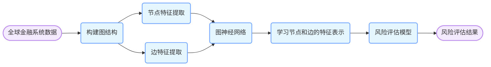

# 金融领域图神经网络在全球金融系统风险评估中的应用

> 关键词：金融领域、图神经网络、全球金融系统、风险评估、复杂网络

> 摘要：本文聚焦于金融领域中图神经网络在全球金融系统风险评估的应用。在全球金融系统日益复杂的背景下，传统风险评估方法面临诸多挑战，图神经网络凭借其强大的建模能力和对复杂关系的处理优势，为金融风险评估提供了新的视角和方法。文章首先介绍了相关背景知识，包括目的范围、预期读者等；接着阐述了核心概念与联系，展示了图神经网络的原理和架构；详细讲解了核心算法原理和具体操作步骤，并给出Python代码示例；分析了相关数学模型和公式；通过项目实战展示代码的实际应用和解读；探讨了实际应用场景；推荐了学习资源、开发工具框架以及相关论文著作；最后总结了未来发展趋势与挑战，解答了常见问题，并提供扩展阅读和参考资料。

## 1. 背景介绍 
### 1.1 目的和范围
全球金融系统是一个高度复杂且相互关联的网络，其中包含众多金融机构、市场参与者以及各种金融工具和交易。金融风险在这个网络中相互传递和影响，传统的风险评估方法往往难以全面、准确地捕捉这些复杂的关系和动态变化。本文章的目的在于探讨图神经网络在全球金融系统风险评估中的应用，详细分析其原理、算法、实际应用案例等，为金融从业者、研究人员提供全面的技术参考和应用思路。范围涵盖了图神经网络的基本概念、核心算法、数学模型，以及在全球金融系统风险评估中的具体应用场景和实现步骤。

### 1.2 预期读者
本文预期读者主要包括金融领域的从业者，如银行风险管理人员、金融分析师、投资经理等，他们可以通过本文了解图神经网络在金融风险评估中的应用，为实际工作提供新的方法和工具。同时，也适合计算机科学领域的研究人员和开发者，特别是对人工智能、机器学习在金融领域应用感兴趣的人群，帮助他们深入了解金融行业的需求和应用场景。此外，高校相关专业的师生也可以将本文作为学习和研究的参考资料。

### 1.3 文档结构概述
本文共分为十个部分。第一部分为背景介绍，包括目的范围、预期读者、文档结构概述和术语表；第二部分阐述核心概念与联系，介绍图神经网络的原理和架构；第三部分详细讲解核心算法原理和具体操作步骤，并给出Python代码示例；第四部分分析相关数学模型和公式；第五部分通过项目实战展示代码的实际应用和解读；第六部分探讨实际应用场景；第七部分推荐学习资源、开发工具框架以及相关论文著作；第八部分总结未来发展趋势与挑战；第九部分解答常见问题；第十部分提供扩展阅读和参考资料。

### 1.4 术语表
#### 1.4.1 核心术语定义
- **图神经网络（Graph Neural Network，GNN）**：是一类专门用于处理图结构数据的神经网络，它能够学习图中节点和边的特征表示，捕捉节点之间的复杂关系。
- **全球金融系统（Global Financial System）**：是指全球范围内的金融机构、金融市场、金融工具以及与之相关的监管和政策体系的总和，是一个高度复杂和相互关联的网络。
- **金融风险评估（Financial Risk Assessment）**：是指对金融机构或金融市场面临的各种风险进行识别、度量和评价的过程，目的是为了制定合理的风险管理策略。
- **复杂网络（Complex Network）**：是由大量节点和连接这些节点的边组成的网络，具有复杂的拓扑结构和动态行为，全球金融系统可以看作是一个复杂网络。

#### 1.4.2 相关概念解释
- **节点（Node）**：在图结构中，节点代表实体，在金融领域可以是金融机构、企业、投资者等。
- **边（Edge）**：表示节点之间的关系，在金融领域可以是交易关系、借贷关系、股权关系等。
- **特征（Feature）**：节点和边都可以具有特征，例如金融机构的资产规模、信用评级等，交易的金额、期限等。
- **邻接矩阵（Adjacency Matrix）**：是一个二维矩阵，用于表示图中节点之间的连接关系，矩阵的元素表示节点之间是否存在边以及边的权重。

#### 1.4.3 缩略词列表
- **GNN**：Graph Neural Network，图神经网络
- **GCN**：Graph Convolutional Network，图卷积网络
- **LSTM**：Long Short-Term Memory，长短期记忆网络
- **GRU**：Gated Recurrent Unit，门控循环单元

## 2. 核心概念与联系 

### 图神经网络的基本原理
图神经网络是一种专门处理图结构数据的神经网络。与传统的神经网络（如卷积神经网络处理图像数据、循环神经网络处理序列数据）不同，图神经网络能够处理不规则的图结构，其中节点和边可以具有不同的特征和连接方式。

图神经网络的核心思想是通过节点之间的信息传递来更新节点的特征表示。具体来说，每个节点会聚合其邻居节点的信息，并结合自身的特征进行更新。这个过程可以迭代多次，使得节点能够捕捉到图中更远距离的信息。

### 图神经网络的架构
图神经网络有多种架构，常见的包括图卷积网络（GCN）、图注意力网络（GAT）等。

#### 图卷积网络（GCN）
图卷积网络是一种基于卷积操作的图神经网络。它的基本思想是将传统的卷积操作扩展到图结构上。在GCN中，每个节点的特征更新公式如下：

$$H^{(l+1)} = \sigma(\tilde{D}^{-\frac{1}{2}}\tilde{A}\tilde{D}^{-\frac{1}{2}}H^{(l)}W^{(l)})$$

其中，$H^{(l)}$ 是第 $l$ 层的节点特征矩阵，$\tilde{A} = A + I$ 是邻接矩阵加上自环矩阵，$\tilde{D}$ 是 $\tilde{A}$ 的度矩阵，$W^{(l)}$ 是第 $l$ 层的可学习权重矩阵，$\sigma$ 是激活函数。

#### 图注意力网络（GAT）
图注意力网络引入了注意力机制，使得节点在聚合邻居节点信息时能够根据邻居节点的重要性分配不同的权重。在GAT中，每个节点的特征更新公式如下：

$$h_i^{(l+1)} = \sigma\left(\sum_{j\in\mathcal{N}(i)}\alpha_{ij}W^{(l)}h_j^{(l)}\right)$$

其中，$\mathcal{N}(i)$ 是节点 $i$ 的邻居节点集合，$\alpha_{ij}$ 是节点 $i$ 对邻居节点 $j$ 的注意力系数，$W^{(l)}$ 是第 $l$ 层的可学习权重矩阵，$\sigma$ 是激活函数。

### 图神经网络与全球金融系统的联系
全球金融系统可以看作是一个复杂的图结构，其中金融机构、企业、投资者等可以看作是图中的节点，它们之间的交易关系、借贷关系、股权关系等可以看作是图中的边。通过图神经网络，我们可以学习到这些节点和边的特征表示，从而更好地理解全球金融系统的结构和动态。

例如，我们可以使用图神经网络来预测金融机构的违约风险。通过将金融机构作为节点，它们之间的借贷关系作为边，我们可以构建一个图结构。然后，使用图神经网络对这个图进行建模，学习到每个金融机构的特征表示。最后，根据这些特征表示来预测金融机构的违约风险。

### 文本示意图
图神经网络在全球金融系统风险评估中的应用可以用以下示意图表示：

```plaintext
全球金融系统（图结构）
|
|-- 节点（金融机构、企业、投资者等）
|   |-- 节点特征（资产规模、信用评级等）
|
|-- 边（交易关系、借贷关系、股权关系等）
|   |-- 边特征（交易金额、期限等）
|
|-- 图神经网络
|   |-- 信息传递与特征更新
|   |-- 学习节点和边的特征表示
|
|-- 风险评估
|   |-- 预测金融机构违约风险
|   |-- 评估系统性金融风险
```

### Mermaid流程图


## 3. 核心算法原理 & 具体操作步骤 

### 图卷积网络（GCN）算法原理
图卷积网络（GCN）是一种基于卷积操作的图神经网络，其核心思想是通过聚合节点的邻居信息来更新节点的特征表示。下面详细介绍GCN的算法原理。

#### 邻接矩阵和度矩阵
在图结构中，邻接矩阵 $A$ 用于表示节点之间的连接关系。如果节点 $i$ 和节点 $j$ 之间存在边，则 $A_{ij} = 1$；否则，$A_{ij} = 0$。为了让节点能够聚合自身的信息，通常会在邻接矩阵中加上自环矩阵 $I$，得到 $\tilde{A} = A + I$。

度矩阵 $D$ 是一个对角矩阵，其对角元素 $D_{ii}$ 表示节点 $i$ 的度，即与节点 $i$ 相连的边的数量。对于 $\tilde{A}$，其对应的度矩阵为 $\tilde{D}$。

#### 特征传播
在GCN中，第 $l$ 层到第 $l+1$ 层的特征传播公式为：

$$H^{(l+1)} = \sigma(\tilde{D}^{-\frac{1}{2}}\tilde{A}\tilde{D}^{-\frac{1}{2}}H^{(l)}W^{(l)})$$

其中，$H^{(l)}$ 是第 $l$ 层的节点特征矩阵，$W^{(l)}$ 是第 $l$ 层的可学习权重矩阵，$\sigma$ 是激活函数（如ReLU函数）。

$\tilde{D}^{-\frac{1}{2}}\tilde{A}\tilde{D}^{-\frac{1}{2}}$ 是归一化的邻接矩阵，其作用是对邻居节点的信息进行归一化，避免度大的节点对信息传播的影响过大。

#### 多层GCN
通常会使用多层GCN来学习更复杂的节点特征表示。每一层GCN都会对节点的特征进行更新，使得节点能够捕捉到图中更远距离的信息。

### 具体操作步骤
#### 步骤1：数据准备
首先需要收集全球金融系统的数据，包括金融机构的基本信息（如资产规模、信用评级等）、金融机构之间的交易关系（如交易金额、期限等）。然后将这些数据转换为图结构，构建邻接矩阵 $A$ 和节点特征矩阵 $X$。

#### 步骤2：初始化参数
初始化GCN的可学习权重矩阵 $W^{(l)}$，可以使用随机初始化的方法。

#### 步骤3：特征传播
根据GCN的特征传播公式，逐层更新节点的特征表示。在每一层中，先计算归一化的邻接矩阵 $\tilde{D}^{-\frac{1}{2}}\tilde{A}\tilde{D}^{-\frac{1}{2}}$，然后将其与当前层的节点特征矩阵 $H^{(l)}$ 和权重矩阵 $W^{(l)}$ 相乘，最后通过激活函数 $\sigma$ 得到下一层的节点特征矩阵 $H^{(l+1)}$。

#### 步骤4：风险评估
使用最后一层的节点特征矩阵 $H^{(L)}$ 构建风险评估模型，例如使用逻辑回归、支持向量机等分类模型来预测金融机构的违约风险。

### Python代码示例
```python
import torch
import torch.nn as nn
import torch.nn.functional as F

# 定义图卷积层
class GraphConvolution(nn.Module):
    def __init__(self, in_features, out_features):
        super(GraphConvolution, self).__init__()
        self.weight = nn.Parameter(torch.FloatTensor(in_features, out_features))
        self.reset_parameters()

    def reset_parameters(self):
        nn.init.xavier_uniform_(self.weight)

    def forward(self, input, adj):
        support = torch.mm(input, self.weight)
        output = torch.spmm(adj, support)
        return output

# 定义GCN模型
class GCN(nn.Module):
    def __init__(self, nfeat, nhid, nclass):
        super(GCN, self).__init__()
        self.gc1 = GraphConvolution(nfeat, nhid)
        self.gc2 = GraphConvolution(nhid, nclass)

    def forward(self, x, adj):
        x = F.relu(self.gc1(x, adj))
        x = self.gc2(x, adj)
        return F.log_softmax(x, dim=1)

# 示例数据
n_nodes = 10
n_features = 5
n_classes = 2
x = torch.randn(n_nodes, n_features)  # 节点特征矩阵
adj = torch.randint(0, 2, (n_nodes, n_nodes)).float()  # 邻接矩阵
adj = adj + torch.eye(n_nodes)  # 加上自环
deg = torch.diag(torch.pow(adj.sum(dim=1), -0.5))  # 度矩阵的逆平方根
adj = torch.mm(torch.mm(deg, adj), deg)  # 归一化的邻接矩阵

# 初始化模型
model = GCN(nfeat=n_features, nhid=16, nclass=n_classes)
optimizer = torch.optim.Adam(model.parameters(), lr=0.01)

# 训练模型
for epoch in range(100):
    optimizer.zero_grad()
    output = model(x, adj)
    loss = F.nll_loss(output, torch.randint(0, n_classes, (n_nodes,)))
    loss.backward()
    optimizer.step()
    print(f'Epoch {epoch+1}: Loss = {loss.item()}')
```

在上述代码中，我们首先定义了一个图卷积层 `GraphConvolution`，然后使用两个图卷积层构建了一个简单的GCN模型 `GCN`。接着，我们生成了示例数据，包括节点特征矩阵和邻接矩阵，并对邻接矩阵进行了归一化处理。最后，我们使用Adam优化器对模型进行训练，并打印每一轮的损失值。

## 4. 数学模型和公式 & 详细讲解 & 举例说明 

### 图卷积网络（GCN）的数学模型和公式
#### 邻接矩阵和度矩阵
在图结构中，邻接矩阵 $A \in \mathbb{R}^{N \times N}$ 表示节点之间的连接关系，其中 $N$ 是节点的数量。如果节点 $i$ 和节点 $j$ 之间存在边，则 $A_{ij} = 1$；否则，$A_{ij} = 0$。为了让节点能够聚合自身的信息，通常会在邻接矩阵中加上自环矩阵 $I$，得到 $\tilde{A} = A + I$。

度矩阵 $D \in \mathbb{R}^{N \times N}$ 是一个对角矩阵，其对角元素 $D_{ii}$ 表示节点 $i$ 的度，即与节点 $i$ 相连的边的数量。对于 $\tilde{A}$，其对应的度矩阵为 $\tilde{D}$。

#### 特征传播公式
在GCN中，第 $l$ 层到第 $l+1$ 层的特征传播公式为：

$$H^{(l+1)} = \sigma(\tilde{D}^{-\frac{1}{2}}\tilde{A}\tilde{D}^{-\frac{1}{2}}H^{(l)}W^{(l)})$$

其中：
- $H^{(l)} \in \mathbb{R}^{N \times F^{(l)}}$ 是第 $l$ 层的节点特征矩阵，$F^{(l)}$ 是第 $l$ 层的特征维度。
- $W^{(l)} \in \mathbb{R}^{F^{(l)} \times F^{(l+1)}}$ 是第 $l$ 层的可学习权重矩阵，$F^{(l+1)}$ 是第 $l+1$ 层的特征维度。
- $\sigma$ 是激活函数，如ReLU函数 $\sigma(x) = \max(0, x)$。
- $\tilde{D}^{-\frac{1}{2}}\tilde{A}\tilde{D}^{-\frac{1}{2}}$ 是归一化的邻接矩阵，其作用是对邻居节点的信息进行归一化，避免度大的节点对信息传播的影响过大。

#### 详细讲解
- **邻接矩阵的作用**：邻接矩阵 $A$ 定义了图中节点之间的连接关系，通过 $\tilde{A} = A + I$ 加上自环，使得节点在信息传播过程中能够考虑自身的特征。
- **度矩阵的作用**：度矩阵 $D$ 记录了每个节点的度，$\tilde{D}^{-\frac{1}{2}}$ 对邻接矩阵进行归一化，使得信息在传播过程中能够根据节点的度进行合理分配。
- **特征传播过程**：在每一层中，节点的特征首先与权重矩阵 $W^{(l)}$ 相乘，进行线性变换。然后，通过归一化的邻接矩阵 $\tilde{D}^{-\frac{1}{2}}\tilde{A}\tilde{D}^{-\frac{1}{2}}$ 聚合邻居节点的信息。最后，通过激活函数 $\sigma$ 引入非线性，增加模型的表达能力。

#### 举例说明
假设我们有一个简单的图，包含3个节点，其邻接矩阵 $A$ 为：

$$A = \begin{bmatrix}
0 & 1 & 1 \\
1 & 0 & 1 \\
1 & 1 & 0
\end{bmatrix}$$

加上自环后得到 $\tilde{A}$：

$$\tilde{A} = \begin{bmatrix}
1 & 1 & 1 \\
1 & 1 & 1 \\
1 & 1 & 1
\end{bmatrix}$$

$\tilde{A}$ 的度矩阵 $\tilde{D}$ 为：

$$\tilde{D} = \begin{bmatrix}
3 & 0 & 0 \\
0 & 3 & 0 \\
0 & 0 & 3
\end{bmatrix}$$

$\tilde{D}^{-\frac{1}{2}}$ 为：

$$\tilde{D}^{-\frac{1}{2}} = \begin{bmatrix}
\frac{1}{\sqrt{3}} & 0 & 0 \\
0 & \frac{1}{\sqrt{3}} & 0 \\
0 & 0 & \frac{1}{\sqrt{3}}
\end{bmatrix}$$

归一化的邻接矩阵 $\tilde{D}^{-\frac{1}{2}}\tilde{A}\tilde{D}^{-\frac{1}{2}}$ 为：

$$\tilde{D}^{-\frac{1}{2}}\tilde{A}\tilde{D}^{-\frac{1}{2}} = \begin{bmatrix}
\frac{1}{3} & \frac{1}{3} & \frac{1}{3} \\
\frac{1}{3} & \frac{1}{3} & \frac{1}{3} \\
\frac{1}{3} & \frac{1}{3} & \frac{1}{3}
\end{bmatrix}$$

假设第 $l$ 层的节点特征矩阵 $H^{(l)}$ 为：

$$H^{(l)} = \begin{bmatrix}
1 & 2 \\
3 & 4 \\
5 & 6
\end{bmatrix}$$

第 $l$ 层的权重矩阵 $W^{(l)}$ 为：

$$W^{(l)} = \begin{bmatrix}
1 & 0 \\
0 & 1
\end{bmatrix}$$

则 $\tilde{D}^{-\frac{1}{2}}\tilde{A}\tilde{D}^{-\frac{1}{2}}H^{(l)}W^{(l)}$ 为：

$$\begin{bmatrix}
\frac{1}{3} & \frac{1}{3} & \frac{1}{3} \\
\frac{1}{3} & \frac{1}{3} & \frac{1}{3} \\
\frac{1}{3} & \frac{1}{3} & \frac{1}{3}
\end{bmatrix}
\begin{bmatrix}
1 & 2 \\
3 & 4 \\
5 & 6
\end{bmatrix}
\begin{bmatrix}
1 & 0 \\
0 & 1
\end{bmatrix}
= \begin{bmatrix}
3 & 4 \\
3 & 4 \\
3 & 4
\end{bmatrix}$$

假设激活函数 $\sigma$ 为ReLU函数，则第 $l+1$ 层的节点特征矩阵 $H^{(l+1)}$ 为：

$$H^{(l+1)} = \begin{bmatrix}
3 & 4 \\
3 & 4 \\
3 & 4
\end{bmatrix}$$

### 图注意力网络（GAT）的数学模型和公式
#### 注意力系数计算
在图注意力网络（GAT）中，节点 $i$ 对邻居节点 $j$ 的注意力系数 $\alpha_{ij}$ 计算如下：

$$\alpha_{ij} = \frac{\exp\left(\text{LeakyReLU}\left(\mathbf{a}^T\left[\mathbf{W}h_i || \mathbf{W}h_j\right]\right)\right)}{\sum_{k\in\mathcal{N}(i)}\exp\left(\text{LeakyReLU}\left(\mathbf{a}^T\left[\mathbf{W}h_i || \mathbf{W}h_k\right]\right)\right)}$$

其中：
- $\mathbf{W} \in \mathbb{R}^{F \times F'}$ 是可学习的权重矩阵，用于将节点的特征从 $F$ 维映射到 $F'$ 维。
- $\mathbf{a} \in \mathbb{R}^{2F'}$ 是可学习的注意力向量。
- $\text{LeakyReLU}$ 是激活函数，$\text{LeakyReLU}(x) = \max(0.2x, x)$。
- $\mathcal{N}(i)$ 是节点 $i$ 的邻居节点集合。
- $||$ 表示拼接操作。

#### 特征更新公式
节点 $i$ 的特征更新公式为：

$$h_i^{(l+1)} = \sigma\left(\sum_{j\in\mathcal{N}(i)}\alpha_{ij}\mathbf{W}h_j^{(l)}\right)$$

其中，$\sigma$ 是激活函数，如ReLU函数。

#### 详细讲解
- **注意力机制的作用**：注意力机制允许节点在聚合邻居节点信息时，根据邻居节点的重要性分配不同的权重。通过计算注意力系数 $\alpha_{ij}$，节点可以更加关注与自身相关性较高的邻居节点。
- **特征更新过程**：首先，使用权重矩阵 $\mathbf{W}$ 对节点的特征进行线性变换。然后，计算注意力系数 $\alpha_{ij}$，并根据注意力系数对邻居节点的特征进行加权求和。最后，通过激活函数 $\sigma$ 引入非线性，得到更新后的节点特征。

#### 举例说明
假设我们有一个简单的图，包含3个节点，节点的特征矩阵 $H$ 为：

$$H = \begin{bmatrix}
1 & 2 \\
3 & 4 \\
5 & 6
\end{bmatrix}$$

可学习的权重矩阵 $\mathbf{W}$ 为：

$$\mathbf{W} = \begin{bmatrix}
1 & 0 \\
0 & 1
\end{bmatrix}$$

可学习的注意力向量 $\mathbf{a}$ 为：

$$\mathbf{a} = \begin{bmatrix}
1 \\
1 \\
1 \\
1
\end{bmatrix}$$

假设节点1的邻居节点为节点2和节点3，则节点1对邻居节点2的注意力系数 $\alpha_{12}$ 计算如下：

$$\mathbf{W}h_1 = \begin{bmatrix}
1 \\
2
\end{bmatrix}, \mathbf{W}h_2 = \begin{bmatrix}
3 \\
4
\end{bmatrix}$$

$$\left[\mathbf{W}h_1 || \mathbf{W}h_2\right] = \begin{bmatrix}
1 \\
2 \\
3 \\
4
\end{bmatrix}$$

$$\mathbf{a}^T\left[\mathbf{W}h_1 || \mathbf{W}h_2\right] = 1\times1 + 1\times2 + 1\times3 + 1\times4 = 10$$

同理，节点1对邻居节点3的注意力系数 $\alpha_{13}$ 计算如下：

$$\mathbf{W}h_3 = \begin{bmatrix}
5 \\
6
\end{bmatrix}$$

$$\left[\mathbf{W}h_1 || \mathbf{W}h_3\right] = \begin{bmatrix}
1 \\
2 \\
5 \\
6
\end{bmatrix}$$

$$\mathbf{a}^T\left[\mathbf{W}h_1 || \mathbf{W}h_3\right] = 1\times1 + 1\times2 + 1\times5 + 1\times6 = 14$$

则 $\alpha_{12}$ 和 $\alpha_{13}$ 分别为：

$$\alpha_{12} = \frac{\exp(10)}{\exp(10) + \exp(14)} \approx 0.018$$

$$\alpha_{13} = \frac{\exp(14)}{\exp(10) + \exp(14)} \approx 0.982$$

假设激活函数 $\sigma$ 为ReLU函数，则节点1更新后的特征 $h_1^{(l+1)}$ 为：

$$h_1^{(l+1)} = \text{ReLU}\left(0.018\times\begin{bmatrix}
3 \\
4
\end{bmatrix} + 0.982\times\begin{bmatrix}
5 \\
6
\end{bmatrix}\right) = \begin{bmatrix}
4.966 \\
5.968
\end{bmatrix}$$

## 5. 项目实战：代码实际案例和详细解释说明 

### 5.1  开发环境搭建
#### 安装Python和相关库
首先，确保你已经安装了Python 3.x版本。可以从Python官方网站（https://www.python.org/downloads/） 下载并安装。

然后，安装以下必要的Python库：
- **PyTorch**：用于构建和训练图神经网络模型。可以根据自己的CUDA版本选择合适的安装方式，具体安装步骤可以参考PyTorch官方网站（https://pytorch.org/get-started/locally/）。
- **NetworkX**：用于处理图结构数据。可以使用以下命令进行安装：
```sh
pip install networkx
```
- **NumPy**：用于数值计算。可以使用以下命令进行安装：
```sh
pip install numpy
```
- **Pandas**：用于数据处理和分析。可以使用以下命令进行安装：
```sh
pip install pandas
```

#### 配置开发环境
可以使用Jupyter Notebook或PyCharm等开发环境进行代码编写和调试。以下以Jupyter Notebook为例进行介绍：

- 安装Jupyter Notebook：
```sh
pip install jupyter
```
- 启动Jupyter Notebook：
```sh
jupyter notebook
```

### 5.2  源代码详细实现和代码解读
#### 数据准备
我们使用一个简单的金融网络数据集，包含金融机构之间的借贷关系。首先，我们需要将数据转换为图结构，并提取节点和边的特征。

```python
import networkx as nx
import numpy as np
import pandas as pd

# 生成示例数据
data = {
    'source': [0, 0, 1, 1, 2],
    'target': [1, 2, 2, 3, 3],
    'amount': [100, 200, 150, 250, 300]
}
df = pd.DataFrame(data)

# 构建图
G = nx.from_pandas_edgelist(df, 'source', 'target', edge_attr='amount')

# 提取节点特征
node_features = np.random.randn(len(G.nodes()), 5)  # 随机生成节点特征

# 提取邻接矩阵
adj_matrix = nx.adjacency_matrix(G).todense()

# 加上自环
adj_matrix = adj_matrix + np.eye(len(G.nodes()))

# 度矩阵的逆平方根
deg_matrix = np.diag(np.power(np.array(adj_matrix.sum(axis=1)).flatten(), -0.5))

# 归一化的邻接矩阵
norm_adj_matrix = deg_matrix @ adj_matrix @ deg_matrix

# 将数据转换为PyTorch张量
import torch

node_features = torch.FloatTensor(node_features)
norm_adj_matrix = torch.FloatTensor(norm_adj_matrix)
```

#### 代码解读
- **数据生成**：使用 `pandas` 生成一个包含金融机构之间借贷关系的数据集，包括源节点、目标节点和借贷金额。
- **图构建**：使用 `networkx` 从数据集中构建图结构。
- **节点特征提取**：随机生成节点的特征矩阵。
- **邻接矩阵提取**：使用 `networkx` 的 `adjacency_matrix` 函数提取图的邻接矩阵，并加上自环。
- **度矩阵和归一化邻接矩阵计算**：计算度矩阵的逆平方根，并对邻接矩阵进行归一化处理。
- **数据转换**：将节点特征矩阵和归一化邻接矩阵转换为PyTorch张量，以便后续使用。

#### 定义图神经网络模型
我们使用之前定义的GCN模型进行风险评估。

```python
import torch.nn as nn
import torch.nn.functional as F

# 定义图卷积层
class GraphConvolution(nn.Module):
    def __init__(self, in_features, out_features):
        super(GraphConvolution, self).__init__()
        self.weight = nn.Parameter(torch.FloatTensor(in_features, out_features))
        self.reset_parameters()

    def reset_parameters(self):
        nn.init.xavier_uniform_(self.weight)

    def forward(self, input, adj):
        support = torch.mm(input, self.weight)
        output = torch.spmm(adj, support)
        return output

# 定义GCN模型
class GCN(nn.Module):
    def __init__(self, nfeat, nhid, nclass):
        super(GCN, self).__init__()
        self.gc1 = GraphConvolution(nfeat, nhid)
        self.gc2 = GraphConvolution(nhid, nclass)

    def forward(self, x, adj):
        x = F.relu(self.gc1(x, adj))
        x = self.gc2(x, adj)
        return F.log_softmax(x, dim=1)

# 初始化模型
n_features = node_features.shape[1]
n_classes = 2
model = GCN(nfeat=n_features, nhid=16, nclass=n_classes)
optimizer = torch.optim.Adam(model.parameters(), lr=0.01)
```

#### 代码解读
- **图卷积层定义**：定义了一个图卷积层 `GraphConvolution`，包括权重矩阵的初始化和前向传播函数。
- **GCN模型定义**：使用两个图卷积层构建了一个简单的GCN模型 `GCN`，并在中间添加了ReLU激活函数，最后使用 `log_softmax` 函数进行分类。
- **模型初始化**：根据节点特征的维度和分类的类别数初始化模型，并使用Adam优化器进行参数更新。

#### 模型训练
```python
# 生成随机标签
labels = torch.randint(0, n_classes, (len(G.nodes()),))

# 训练模型
for epoch in range(100):
    optimizer.zero_grad()
    output = model(node_features, norm_adj_matrix)
    loss = F.nll_loss(output, labels)
    loss.backward()
    optimizer.step()
    print(f'Epoch {epoch+1}: Loss = {loss.item()}')
```

#### 代码解读
- **标签生成**：随机生成节点的标签，用于模型训练。
- **模型训练**：在每一轮训练中，首先将梯度清零，然后计算模型的输出和损失，接着进行反向传播和参数更新，并打印每一轮的损失值。

### 5.3  代码解读与分析
#### 数据处理部分
数据处理部分的主要目的是将金融数据转换为图结构，并提取节点和边的特征。通过使用 `networkx` 和 `pandas` 库，我们可以方便地构建图结构和处理数据。归一化邻接矩阵的计算是为了确保信息在传播过程中能够根据节点的度进行合理分配，避免度大的节点对信息传播的影响过大。

#### 模型构建部分
图卷积层和GCN模型的定义是基于PyTorch的 `nn.Module` 类，通过定义权重矩阵和前向传播函数，我们可以构建一个简单的图神经网络模型。ReLU激活函数的使用增加了模型的非线性表达能力，`log_softmax` 函数用于分类任务。

#### 模型训练部分
模型训练部分使用了Adam优化器进行参数更新，通过计算损失函数并进行反向传播，不断调整模型的参数，使得模型的输出尽可能接近真实标签。损失函数的选择取决于具体的任务，这里使用了负对数似然损失函数 `nll_loss` 用于分类任务。

通过以上代码实现和解读，我们可以看到如何使用图神经网络对金融网络数据进行风险评估。在实际应用中，我们可以根据具体的需求对数据处理、模型构建和训练过程进行调整和优化。

## 6. 实际应用场景 
### 金融机构违约风险预测
在全球金融系统中，金融机构之间存在着复杂的借贷关系和交易往来。通过将金融机构作为节点，它们之间的借贷关系作为边，构建图结构数据。使用图神经网络对这个图进行建模，学习到每个金融机构的特征表示。然后，根据这些特征表示来预测金融机构的违约风险。例如，银行可以使用图神经网络来评估其贷款客户的违约可能性，从而采取相应的风险管理措施，如调整贷款利率、增加担保要求等。

### 系统性金融风险评估
系统性金融风险是指由于金融机构之间的相互关联和传染效应，导致整个金融系统面临崩溃的风险。图神经网络可以用于评估系统性金融风险。通过分析金融机构之间的连接强度和信息传播路径，图神经网络可以识别出系统中的关键节点和脆弱环节。例如，在金融危机期间，一些大型金融机构的倒闭可能会引发连锁反应，导致整个金融系统的动荡。图神经网络可以提前预警这种系统性风险，帮助监管机构采取措施来稳定金融系统，如实施宏观审慎监管政策、提供流动性支持等。

### 金融市场波动预测
金融市场的波动受到多种因素的影响，包括宏观经济数据、政策变化、投资者情绪等。图神经网络可以用于分析金融市场中不同资产之间的相关性和相互影响。通过将不同的金融资产作为节点，它们之间的相关性作为边，构建图结构数据。然后，使用图神经网络对这个图进行建模，学习到资产之间的动态关系。根据这些关系，预测金融市场的波动情况。例如，投资者可以使用图神经网络来预测股票市场的涨跌，从而调整投资组合，降低投资风险。

### 信用评级调整
信用评级是评估企业或金融机构信用风险的重要指标。传统的信用评级方法主要基于企业的财务数据和历史信用记录，忽略了企业之间的关联关系。图神经网络可以将企业之间的交易关系、股权关系等作为图结构数据进行分析，从而更全面地评估企业的信用风险。例如，一家企业的信用评级可能受到其关联企业的影响。如果其关联企业出现违约风险，那么该企业的信用评级也可能会受到影响。图神经网络可以捕捉到这种关联关系，及时调整企业的信用评级，为投资者和金融机构提供更准确的信用信息。

### 金融欺诈检测
金融欺诈是金融领域的一个严重问题，包括信用卡欺诈、贷款欺诈等。图神经网络可以用于金融欺诈检测。通过将客户、交易、账户等作为节点，它们之间的关系作为边，构建图结构数据。然后，使用图神经网络对这个图进行建模，学习到正常交易和欺诈交易的特征模式。根据这些特征模式，识别出潜在的欺诈交易。例如，信用卡公司可以使用图神经网络来检测异常的信用卡交易，及时采取措施防止欺诈行为的发生，如冻结账户、通知客户等。

## 7. 工具和资源推荐
### 7.1 学习资源推荐
#### 7.1.1 书籍推荐
- 《图神经网络：基础、前沿与应用》：本书全面介绍了图神经网络的基本概念、算法原理和应用场景，适合初学者和有一定基础的读者深入学习。
- 《深度学习》：由Ian Goodfellow、Yoshua Bengio和Aaron Courville所著，是深度学习领域的经典教材，其中也包含了图神经网络的相关内容，对于理解图神经网络的理论基础有很大帮助。
- 《Python数据分析实战》：介绍了使用Python进行数据分析的方法和技巧，对于处理金融数据和构建图结构数据有很大的帮助。

#### 7.1.2 在线课程
- Coursera上的“Graph Neural Networks for Machine Learning”：由知名教授授课，系统地介绍了图神经网络的原理和应用，课程内容丰富，包含了大量的代码实践。
- edX上的“Deep Learning for Graphs”：该课程深入探讨了图神经网络在不同领域的应用，适合有一定深度学习基础的读者学习。
- 哔哩哔哩（Bilibili）上有许多关于图神经网络的教学视频，这些视频由不同的博主制作，内容生动易懂，适合初学者快速入门。

#### 7.1.3 技术博客和网站
- Medium：是一个技术博客平台，上面有许多关于图神经网络和金融科技的文章，作者来自不同的领域，分享了他们的研究成果和实践经验。
- arXiv：是一个预印本服务器，上面有大量的学术论文，包括图神经网络在金融领域的最新研究成果。通过关注相关的研究论文，可以了解到该领域的最新发展动态。
- Towards Data Science：是一个专注于数据科学和机器学习的网站，上面有许多关于图神经网络的教程和案例分析，对于学习和实践图神经网络有很大的帮助。

### 7.2 开发工具框架推荐
#### 7.2.1 IDE和编辑器
- PyCharm：是一款专门为Python开发设计的集成开发环境（IDE），具有强大的代码编辑、调试和自动补全功能，适合开发大型的图神经网络项目。
- Jupyter Notebook：是一个交互式的开发环境，支持Python代码的编写、运行和可视化展示，适合进行数据探索和模型实验。
- Visual Studio Code：是一款轻量级的代码编辑器，支持多种编程语言和插件扩展，对于快速编写和调试图神经网络代码非常方便。

#### 7.2.2 调试和性能分析工具
- PyTorch Profiler：是PyTorch官方提供的性能分析工具，可以帮助开发者分析模型的运行时间、内存使用情况等，找出性能瓶颈并进行优化。
- TensorBoard：是TensorFlow提供的可视化工具，也可以与PyTorch结合使用。通过TensorBoard，可以可视化模型的训练过程、损失曲线、准确率等指标，帮助开发者更好地理解模型的性能。
- cProfile：是Python标准库中的性能分析工具，可以分析Python代码的运行时间和函数调用情况，帮助开发者找出代码中的性能瓶颈。

#### 7.2.3 相关框架和库
- PyTorch Geometric：是一个基于PyTorch的图神经网络框架，提供了丰富的图神经网络层和数据集，方便开发者快速构建和训练图神经网络模型。
- DGL（Deep Graph Library）：是一个开源的图神经网络框架，支持多种深度学习框架（如PyTorch、TensorFlow等），具有高效的图数据处理和模型训练能力。
- NetworkX：是一个用于创建、操作和研究复杂网络的Python库，提供了丰富的图算法和数据结构，对于处理图结构数据非常方便。

### 7.3 相关论文著作推荐
#### 7.3.1 经典论文
- “Semi-Supervised Classification with Graph Convolutional Networks”：这篇论文提出了图卷积网络（GCN）的概念，是图神经网络领域的经典之作，为后续的研究奠定了基础。
- “Graph Attention Networks”：提出了图注意力网络（GAT），引入了注意力机制，提高了图神经网络的性能。
- “DeepWalk: Online Learning of Social Representations”：提出了DeepWalk算法，用于学习图中节点的嵌入表示，是图嵌入领域的经典论文。

#### 7.3.2 最新研究成果
- “Financial Network Analysis Using Graph Neural Networks”：该论文探讨了图神经网络在金融网络分析中的应用，提出了一种新的金融风险评估方法。
- “Graph Neural Networks for Credit Risk Assessment”：研究了图神经网络在信用风险评估中的应用，通过结合企业之间的关联关系，提高了信用风险评估的准确性。
- “Detecting Financial Fraud with Graph Neural Networks”：提出了一种基于图神经网络的金融欺诈检测方法，通过分析交易网络中的异常模式，有效地识别出潜在的欺诈行为。

#### 7.3.3 应用案例分析
- “Case Studies on Applying Graph Neural Networks in Global Financial System Risk Assessment”：该案例分析了图神经网络在全球金融系统风险评估中的实际应用，通过具体的案例展示了图神经网络的优势和效果。
- “Real-World Applications of Graph Neural Networks in Financial Institutions”：介绍了金融机构如何使用图神经网络来解决实际问题，如违约风险预测、信用评级调整等。
- “Graph Neural Networks in Financial Market Analysis: A Case Study”：通过一个具体的金融市场分析案例，展示了图神经网络在预测金融市场波动方面的应用。

## 8. 总结：未来发展趋势与挑战
### 未来发展趋势
#### 模型融合与创新
未来，图神经网络可能会与其他深度学习模型（如卷积神经网络、循环神经网络等）进行融合，以充分发挥不同模型的优势。例如，将图神经网络与卷积神经网络结合，用于处理具有空间结构和图结构的复杂数据。同时，也会有更多创新的图神经网络架构被提出，以提高模型的性能和表达能力。

#### 多模态数据融合
全球金融系统的数据具有多模态的特点，包括文本、图像、时间序列等。未来的研究将更加注重多模态数据的融合，将不同类型的数据整合到图神经网络中，以更全面地描述金融系统的特征和动态。例如，结合新闻文本、财务报表图像和交易时间序列数据，进行更准确的金融风险评估。

#### 可解释性增强
随着图神经网络在金融领域的广泛应用，模型的可解释性变得越来越重要。未来的研究将致力于提高图神经网络的可解释性，让金融从业者能够理解模型的决策过程和依据。例如，通过可视化技术展示节点和边的重要性，解释模型是如何根据图结构和特征进行风险评估的。

#### 实时监测与动态建模
全球金融系统是一个动态变化的系统，金融风险也会随着时间的推移而发生变化。未来的图神经网络模型将更加注重实时监测和动态建模，能够及时捕捉金融系统的变化，并进行实时的风险评估和预警。例如，使用流式图神经网络对金融交易数据进行实时处理，及时发现潜在的风险事件。

### 挑战
#### 数据质量与隐私保护
金融数据通常具有高维度、复杂结构和噪声的特点，数据质量的好坏直接影响图神经网络的性能。同时，金融数据涉及到大量的个人隐私和商业机密，如何在保护数据隐私的前提下，有效地利用数据进行模型训练是一个亟待解决的问题。例如，需要采用差分隐私、同态加密等技术来保护数据隐私。

#### 计算资源与效率
图神经网络的训练通常需要大量的计算资源和时间，特别是对于大规模的金融网络数据。如何提高图神经网络的计算效率，减少训练时间和计算成本是一个挑战。例如，需要研究高效的图神经网络算法和并行计算技术，以提高模型的训练和推理速度。

#### 模型评估与验证
由于金融系统的复杂性和不确定性，图神经网络在金融领域的应用面临着模型评估和验证的困难。传统的评估指标（如准确率、召回率等）可能无法全面评估模型的性能。需要开发适合金融领域的评估指标和验证方法，以确保模型的可靠性和有效性。例如，考虑金融风险的实际影响和后果，设计更合理的评估指标。

#### 监管与合规
图神经网络在金融领域