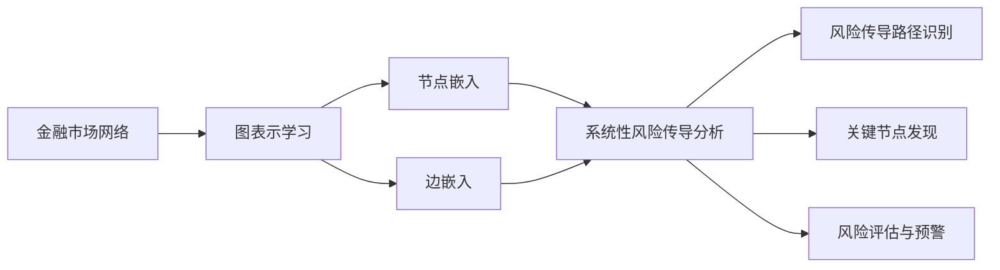

# 金融领域图表示学习在系统性风险传导中的应用

> 关键词：金融领域、图表示学习、系统性风险传导、风险评估、图神经网络

> 摘要：本文聚焦于金融领域中图表示学习在系统性风险传导方面的应用。系统性风险传导是金融领域研究的关键问题，准确识别和评估风险传导路径对维护金融稳定至关重要。图表示学习为解决这一问题提供了新的思路和方法。文章详细介绍了图表示学习的核心概念、算法原理、数学模型，通过实际案例展示了其在系统性风险传导分析中的具体应用，同时推荐了相关的学习资源、开发工具和研究论文，最后对该领域的未来发展趋势与挑战进行了总结。

## 1. 背景介绍 
### 1.1 目的和范围
金融市场是一个复杂的网络系统，金融机构之间通过各种业务往来相互关联，系统性风险在这个网络中不断传导和扩散。本研究的目的在于探讨如何利用图表示学习技术来更好地理解和分析金融领域中的系统性风险传导机制。具体范围包括研究金融机构之间的关联网络构建、图表示学习算法在风险传导路径识别和风险评估中的应用，以及通过实际案例验证方法的有效性。

### 1.2 预期读者
本文预期读者包括金融领域的研究人员、风险管理专家、数据科学家以及对金融科技和人工智能应用感兴趣的专业人士。对于希望深入了解金融系统性风险分析和图表示学习技术结合的读者，本文将提供全面的理论和实践指导。

### 1.3 文档结构概述
本文将按照以下结构展开：首先介绍核心概念与联系，包括图表示学习和系统性风险传导的基本原理和它们之间的关联；接着详细阐述核心算法原理和具体操作步骤，并给出Python代码示例；然后介绍相关的数学模型和公式，并举例说明；通过项目实战展示代码的实际应用和详细解释；探讨该技术在金融领域的实际应用场景；推荐相关的工具和资源；最后总结未来发展趋势与挑战，并提供常见问题解答和扩展阅读参考资料。

### 1.4 术语表
#### 1.4.1 核心术语定义
- **图表示学习**：将图结构数据中的节点和边映射到低维向量空间的技术，以便于后续的机器学习任务，如节点分类、链接预测等。
- **系统性风险传导**：指金融系统中某个机构或市场的风险通过各种渠道传播到其他机构或市场，从而引发整个金融系统不稳定的过程。
- **金融网络**：由金融机构（如银行、保险公司、证券公司等）作为节点，它们之间的业务往来（如贷款、投资、交易等）作为边构成的图结构。
- **图神经网络（GNN）**：一类专门处理图结构数据的神经网络模型，能够自动学习图中节点和边的特征表示。

#### 1.4.2 相关概念解释
- **节点嵌入**：将图中的节点表示为低维向量的过程，使得具有相似结构或属性的节点在向量空间中距离较近。
- **风险传染**：系统性风险在金融网络中从一个节点向其他节点传播的现象，类似于传染病的传播。
- **特征工程**：对原始数据进行预处理和转换，提取有用的特征，以便于机器学习模型的训练和应用。

#### 1.4.3 缩略词列表
- **GNN**：Graph Neural Network（图神经网络）
- **PCA**：Principal Component Analysis（主成分分析）
- **SVD**：Singular Value Decomposition（奇异值分解）

## 2. 核心概念与联系 
### 2.1 图表示学习原理
图表示学习的核心目标是将图结构数据中的节点和边表示为低维向量，以便于机器学习算法的处理。传统的机器学习算法通常处理的是结构化数据，如表格数据，而图数据具有复杂的拓扑结构，节点之间的关系难以直接用传统方法表示。图表示学习通过学习图的结构和节点的属性信息，将节点映射到一个低维向量空间中，使得在这个向量空间中可以方便地进行节点分类、链接预测、聚类等任务。

图表示学习的方法主要分为基于矩阵分解的方法、基于随机游走的方法和基于深度学习的方法。基于矩阵分解的方法通过对图的邻接矩阵或拉普拉斯矩阵进行分解，得到节点的嵌入表示。例如，奇异值分解（SVD）可以将邻接矩阵分解为三个矩阵的乘积，其中两个矩阵的列向量可以作为节点的嵌入。基于随机游走的方法通过在图上进行随机游走，生成节点序列，然后使用词嵌入的方法学习节点的表示。例如，DeepWalk算法通过随机游走生成节点序列，然后使用Skip-gram模型学习节点的嵌入。基于深度学习的方法主要是图神经网络（GNN），它通过多层神经网络自动学习图中节点和边的特征表示。

### 2.2 系统性风险传导原理
系统性风险传导是金融系统中一个复杂的过程，涉及到多个因素和渠道。金融机构之间通过各种业务往来相互关联，如贷款、投资、交易等，当某个机构面临风险时，可能会通过这些关联渠道将风险传播到其他机构。例如，一家银行如果出现大量不良贷款，可能会导致其资金链紧张，进而影响其对其他金融机构的贷款和投资，从而引发其他机构的风险。

系统性风险传导的渠道主要包括信用风险传染、市场风险传染和流动性风险传染。信用风险传染是指由于一个机构的违约导致其他机构的信用风险增加。市场风险传染是指由于市场波动导致金融资产价格下跌，从而影响持有这些资产的机构的价值。流动性风险传染是指由于某个机构的流动性问题导致整个市场的流动性紧张，从而影响其他机构的融资能力。

### 2.3 图表示学习与系统性风险传导的联系
金融市场可以看作是一个复杂的网络，金融机构是网络中的节点，它们之间的业务往来是网络中的边。图表示学习可以用于构建金融网络的节点和边的表示，从而更好地理解金融机构之间的关联关系。通过图表示学习得到的节点嵌入可以反映节点在金融网络中的结构和属性信息，这些信息可以用于识别系统性风险传导的路径和关键节点。

例如，通过分析节点嵌入的相似度，可以发现哪些金融机构之间的关联比较紧密，从而预测风险可能的传导路径。此外，图神经网络可以用于对金融网络进行建模，学习风险在网络中的传播规律，从而实现对系统性风险的预警和评估。

### 2.4 文本示意图
图表示学习与系统性风险传导的关系可以用以下示意图表示：

```plaintext
金融市场网络
|
|-- 节点（金融机构）
|-- 边（业务往来）
|
|-- 图表示学习
|   |-- 节点嵌入
|   |-- 边嵌入
|
|-- 系统性风险传导分析
|   |-- 风险传导路径识别
|   |-- 关键节点发现
|   |-- 风险评估与预警
```

### 2.5 Mermaid流程图


## 3. 核心算法原理 & 具体操作步骤 
### 3.1 基于随机游走的图表示学习算法（DeepWalk）
#### 3.1.1 算法原理
DeepWalk算法是一种基于随机游走的图表示学习算法，其核心思想是通过在图上进行随机游走生成节点序列，然后将这些节点序列看作是自然语言中的句子，使用Skip-gram模型学习节点的嵌入表示。具体步骤如下：
1. **随机游走**：从图中的每个节点开始，进行一定长度的随机游走，生成节点序列。
2. **构建训练数据**：将生成的节点序列作为训练数据，使用Skip-gram模型进行训练。Skip-gram模型的目标是根据中心节点预测其上下文节点。
3. **学习节点嵌入**：通过训练Skip-gram模型，得到节点的嵌入表示。

#### 3.1.2 Python代码实现
```python
import networkx as nx
import numpy as np
from gensim.models import Word2Vec

def random_walk(G, node, walk_length):
    walk = [node]
    for _ in range(walk_length - 1):
        neighbors = list(G.neighbors(walk[-1]))
        if neighbors:
            walk.append(np.random.choice(neighbors))
        else:
            break
    return walk

def generate_walks(G, num_walks, walk_length):
    walks = []
    nodes = list(G.nodes())
    for _ in range(num_walks):
        np.random.shuffle(nodes)
        for node in nodes:
            walk = random_walk(G, node, walk_length)
            walks.append(walk)
    return walks

def deepwalk(G, num_walks, walk_length, embedding_size, window_size, workers):
    walks = generate_walks(G, num_walks, walk_length)
    model = Word2Vec(walks, size=embedding_size, window=window_size, min_count=0, sg=1, workers=workers)
    return model

# 示例用法
G = nx.karate_club_graph()
model = deepwalk(G, num_walks=10, walk_length=80, embedding_size=128, window_size=10, workers=4)
node_embeddings = {node: model.wv[node] for node in G.nodes()}
```

### 3.2 图神经网络（GNN）算法（GraphSAGE）
#### 3.2.1 算法原理
GraphSAGE（Graph Sample and Aggregate）是一种基于采样和聚合的图神经网络算法，其核心思想是通过对节点的邻居进行采样和聚合，学习节点的特征表示。具体步骤如下：
1. **采样**：对于每个节点，从其邻居中采样一定数量的节点。
2. **聚合**：将采样得到的邻居节点的特征和自身的特征进行聚合，得到节点的新特征。
3. **更新**：通过多层神经网络对节点的特征进行更新，得到最终的节点表示。

#### 3.2.2 Python代码实现
```python
import torch
import torch.nn as nn
import torch.nn.functional as F
from torch_geometric.nn import SAGEConv

class GraphSAGE(nn.Module):
    def __init__(self, in_channels, hidden_channels, out_channels):
        super(GraphSAGE, self).__init__()
        self.conv1 = SAGEConv(in_channels, hidden_channels)
        self.conv2 = SAGEConv(hidden_channels, out_channels)

    def forward(self, x, edge_index):
        x = self.conv1(x, edge_index)
        x = F.relu(x)
        x = F.dropout(x, training=self.training)
        x = self.conv2(x, edge_index)
        return F.log_softmax(x, dim=1)

# 示例用法
# 假设x是节点特征矩阵，edge_index是边索引矩阵
x = torch.randn(100, 16)
edge_index = torch.tensor([[0, 1, 1, 2], [1, 0, 2, 1]], dtype=torch.long)
model = GraphSAGE(16, 32, 2)
output = model(x, edge_index)
```

### 3.3 具体操作步骤
#### 3.3.1 数据准备
首先需要构建金融网络，将金融机构作为节点，它们之间的业务往来作为边。可以使用金融数据，如银行间的贷款数据、证券交易数据等，来构建网络的邻接矩阵。同时，需要为每个节点提取特征，如资产规模、杠杆率、盈利能力等。

#### 3.3.2 图表示学习
选择合适的图表示学习算法，如DeepWalk或GraphSAGE，对金融网络进行处理，得到节点的嵌入表示。在训练过程中，需要调整算法的参数，如随机游走的长度、嵌入的维度、神经网络的层数等，以获得最优的嵌入效果。

#### 3.3.3 系统性风险传导分析
使用得到的节点嵌入进行系统性风险传导分析。可以通过计算节点嵌入的相似度，识别风险传导的路径；通过聚类分析，发现关键节点；使用机器学习模型，如逻辑回归、决策树等，对风险进行评估和预警。

## 4. 数学模型和公式 & 详细讲解 & 举例说明 
### 4.1 矩阵分解方法的数学模型
#### 4.1.1 奇异值分解（SVD）
设 $A$ 是图的邻接矩阵，其维度为 $n \times n$，其中 $n$ 是节点的数量。奇异值分解将 $A$ 分解为三个矩阵的乘积：
$$A = U \Sigma V^T$$
其中 $U$ 是 $n \times n$ 的正交矩阵，其列向量是 $A A^T$ 的特征向量；$V$ 是 $n \times n$ 的正交矩阵，其列向量是 $A^T A$ 的特征向量；$\Sigma$ 是 $n \times n$ 的对角矩阵，其对角元素是 $A$ 的奇异值。

可以选择 $U$ 的前 $k$ 列作为节点的嵌入表示，其中 $k$ 是嵌入的维度。节点 $i$ 的嵌入向量为 $u_i$，其第 $j$ 个元素表示节点 $i$ 在第 $j$ 个特征维度上的取值。

#### 4.1.2 举例说明
假设有一个简单的图，其邻接矩阵为：
$$A = \begin{bmatrix}
0 & 1 & 1 \\
1 & 0 & 1 \\
1 & 1 & 0
\end{bmatrix}$$
对 $A$ 进行奇异值分解：
```python
import numpy as np

A = np.array([[0, 1, 1], [1, 0, 1], [1, 1, 0]])
U, Sigma, Vt = np.linalg.svd(A)
k = 2
node_embeddings = U[:, :k]
print(node_embeddings)
```
运行上述代码，得到节点的二维嵌入表示。

### 4.2 随机游走方法的数学模型
#### 4.2.1 Skip-gram模型
Skip-gram模型的目标是最大化给定中心节点预测上下文节点的概率。设 $w_c$ 是中心节点，$w_o$ 是上下文节点，Skip-gram模型的目标函数为：
$$\max_{\theta} \prod_{(w_c, w_o) \in D} P(w_o | w_c; \theta)$$
其中 $D$ 是训练数据，$\theta$ 是模型的参数。通常使用对数似然函数来简化计算：
$$\max_{\theta} \sum_{(w_c, w_o) \in D} \log P(w_o | w_c; \theta)$$
$P(w_o | w_c; \theta)$ 可以通过softmax函数计算：
$$P(w_o | w_c; \theta) = \frac{\exp(u_{w_o}^T v_{w_c})}{\sum_{w' \in V} \exp(u_{w'}^T v_{w_c})}$$
其中 $v_{w_c}$ 是中心节点 $w_c$ 的嵌入向量，$u_{w_o}$ 是上下文节点 $w_o$ 的嵌入向量，$V$ 是所有节点的集合。

#### 4.2.2 举例说明
在DeepWalk算法中，使用Skip-gram模型学习节点的嵌入。通过随机游走生成节点序列，将节点序列作为训练数据，训练Skip-gram模型。在训练过程中，不断调整节点的嵌入向量，使得在给定中心节点的情况下，预测上下文节点的概率最大。

### 4.3 图神经网络方法的数学模型
#### 4.3.1 GraphSAGE的聚合函数
GraphSAGE中的聚合函数用于将节点的邻居特征和自身特征进行聚合。一种常见的聚合函数是均值聚合：
$$h_v^{(k)} = \sigma \left( W^{(k)} \cdot \text{MEAN} \left( \left\{ h_v^{(k - 1)} \right\} \cup \left\{ h_u^{(k - 1)}, \forall u \in \mathcal{N}(v) \right\} \right) \right)$$
其中 $h_v^{(k)}$ 是节点 $v$ 在第 $k$ 层的特征向量，$W^{(k)}$ 是第 $k$ 层的权重矩阵，$\sigma$ 是激活函数，$\mathcal{N}(v)$ 是节点 $v$ 的邻居集合。

#### 4.3.2 举例说明
在GraphSAGE的Python代码实现中，使用 `SAGEConv` 层进行聚合操作。`SAGEConv` 层内部实现了聚合函数，通过不断迭代更新节点的特征向量，最终得到节点的表示。

## 5. 项目实战：代码实际案例和详细解释说明 
### 5.1  开发环境搭建
#### 5.1.1 安装Python和相关库
首先需要安装Python，建议使用Python 3.7及以上版本。然后安装以下相关库：
- `networkx`：用于构建和操作图结构。
- `gensim`：用于实现基于随机游走的图表示学习算法。
- `torch` 和 `torch_geometric`：用于实现图神经网络算法。
可以使用以下命令进行安装：
```sh
pip install networkx gensim torch torch_geometric
```

#### 5.1.2 配置开发环境
可以使用Jupyter Notebook或PyCharm等开发环境进行代码编写和调试。Jupyter Notebook适合进行交互式开发和实验，PyCharm适合进行大规模项目的开发和管理。

### 5.2  源代码详细实现和代码解读
#### 5.2.1 构建金融网络
```python
import networkx as nx

# 假设有一个金融机构列表
financial_institutions = ['BankA', 'BankB', 'InsuranceC', 'BrokerD']

# 构建一个空的有向图
G = nx.DiGraph()

# 添加节点
G.add_nodes_from(financial_institutions)

# 添加边，表示金融机构之间的业务往来
edges = [('BankA', 'BankB', {'weight': 100}), ('BankB', 'InsuranceC', {'weight': 50}), ('InsuranceC', 'BrokerD', {'weight': 30})]
G.add_edges_from(edges)

# 可视化图
import matplotlib.pyplot as plt
nx.draw(G, with_labels=True)
plt.show()
```
代码解读：首先导入 `networkx` 库，创建一个有向图 `G`，添加金融机构作为节点，添加业务往来作为边，并为边设置权重。最后使用 `matplotlib` 库可视化图。

#### 5.2.2 图表示学习
```python
from gensim.models import Word2Vec

def random_walk(G, node, walk_length):
    walk = [node]
    for _ in range(walk_length - 1):
        neighbors = list(G.neighbors(walk[-1]))
        if neighbors:
            walk.append(np.random.choice(neighbors))
        else:
            break
    return walk

def generate_walks(G, num_walks, walk_length):
    walks = []
    nodes = list(G.nodes())
    for _ in range(num_walks):
        np.random.shuffle(nodes)
        for node in nodes:
            walk = random_walk(G, node, walk_length)
            walks.append(walk)
    return walks

walks = generate_walks(G, num_walks=10, walk_length=80)
model = Word2Vec(walks, size=128, window=10, min_count=0, sg=1, workers=4)
node_embeddings = {node: model.wv[node] for node in G.nodes()}
```
代码解读：定义了 `random_walk` 函数用于生成随机游走序列，`generate_walks` 函数用于生成多个随机游走序列。使用 `Word2Vec` 模型对随机游走序列进行训练，得到节点的嵌入表示。

#### 5.2.3 系统性风险传导分析
```python
import numpy as np
from sklearn.cluster import KMeans

# 将节点嵌入转换为矩阵
embedding_matrix = np.array([node_embeddings[node] for node in G.nodes()])

# 使用KMeans进行聚类分析
kmeans = KMeans(n_clusters=2)
kmeans.fit(embedding_matrix)
labels = kmeans.labels_

# 输出聚类结果
for i, node in enumerate(G.nodes()):
    print(f'{node}: Cluster {labels[i]}')
```
代码解读：将节点的嵌入表示转换为矩阵，使用 `KMeans` 算法进行聚类分析，将节点分为不同的簇。输出每个节点所属的簇，以便发现关键节点和风险传导的路径。

### 5.3  代码解读与分析
#### 5.3.1 构建金融网络
通过 `networkx` 库构建金融网络，将金融机构作为节点，业务往来作为边。图的结构可以直观地展示金融机构之间的关联关系，为后续的图表示学习和风险传导分析提供基础。

#### 5.3.2 图表示学习
使用DeepWalk算法进行图表示学习，通过随机游走生成节点序列，使用 `Word2Vec` 模型学习节点的嵌入表示。节点的嵌入表示可以将图的结构信息和节点的属性信息映射到低维向量空间中，方便后续的机器学习任务。

#### 5.3.3 系统性风险传导分析
使用 `KMeans` 算法对节点的嵌入表示进行聚类分析，将节点分为不同的簇。同一簇中的节点具有相似的嵌入表示，可能在金融网络中具有相似的角色和关联关系。通过分析聚类结果，可以发现关键节点和风险传导的路径。

## 6. 实际应用场景 
### 6.1 银行间市场风险传导分析
在银行间市场中，银行之间通过同业拆借、债券交易等业务往来相互关联。图表示学习可以用于构建银行间网络，分析银行之间的风险传导路径。通过识别关键节点和风险传导的脆弱环节，监管机构可以采取相应的措施来防范系统性风险的发生。

### 6.2 金融控股公司风险评估
金融控股公司通常包含多个金融子公司，如银行、证券、保险等。这些子公司之间存在复杂的关联关系，图表示学习可以用于分析金融控股公司内部的风险传导机制，评估整个控股公司的风险状况。通过对控股公司的风险进行实时监测和预警，可以及时采取措施来降低风险。

### 6.3 证券市场波动传导分析
证券市场中，不同股票之间存在着一定的相关性，市场波动可能会在不同股票之间传导。图表示学习可以用于构建股票网络，分析市场波动的传导路径。通过预测市场波动的传播方向和强度，投资者可以制定相应的投资策略，降低投资风险。

## 7. 工具和资源推荐
### 7.1 学习资源推荐
#### 7.1.1 书籍推荐
- 《图神经网络：基础、前沿与应用》：全面介绍了图神经网络的基本原理、算法和应用，是学习图神经网络的经典书籍。
- 《Python网络爬虫从入门到实践》：对于需要从金融数据中提取信息构建金融网络的读者，这本书提供了详细的网络爬虫教程。
- 《金融风险管理》：介绍了金融风险管理的基本理论和方法，对于理解系统性风险传导的背景和意义有很大帮助。

#### 7.1.2 在线课程
- Coursera上的“Graph Neural Networks for Machine Learning”：由知名学者授课，系统地介绍了图神经网络的原理和应用。
- edX上的“Financial Risk Management”：提供了金融风险管理的在线课程，包括系统性风险分析的相关内容。

#### 7.1.3 技术博客和网站
- Medium上的“Towards Data Science”：有很多关于图表示学习和金融科技的技术文章，提供了最新的研究成果和实践经验。
- ArXiv.org：可以搜索到关于图表示学习和金融领域的最新研究论文。

### 7.2 开发工具框架推荐
#### 7.2.1 IDE和编辑器
- PyCharm：功能强大的Python集成开发环境，适合进行大规模项目的开发和管理。
- Jupyter Notebook：交互式开发环境，适合进行代码实验和数据分析。

#### 7.2.2 调试和性能分析工具
- PyTorch Profiler：用于分析PyTorch模型的性能，找出性能瓶颈。
- TensorBoard：用于可视化深度学习模型的训练过程和结果。

#### 7.2.3 相关框架和库
- NetworkX：用于构建和操作图结构，提供了丰富的图算法和数据结构。
- Gensim：用于实现基于随机游走的图表示学习算法，如DeepWalk。
- PyTorch Geometric：专门用于处理图结构数据的深度学习框架，提供了多种图神经网络模型。

### 7.3 相关论文著作推荐
#### 7.3.1 经典论文
- “DeepWalk: Online Learning of Social Representations”：提出了DeepWalk算法，是基于随机游走的图表示学习的经典论文。
- “Inductive Representation Learning on Large Graphs”：提出了GraphSAGE算法，为图神经网络的发展做出了重要贡献。

#### 7.3.2 最新研究成果
- 搜索ArXiv.org和IEEE Xplore等学术数据库，可以找到关于图表示学习在金融领域应用的最新研究成果。

#### 7.3.3 应用案例分析
- 一些金融机构和研究机构会发布关于图表示学习在金融风险分析中的应用案例，可以通过搜索引擎和行业报告获取相关信息。

## 8. 总结：未来发展趋势与挑战
### 8.1 未来发展趋势
#### 8.1.1 多模态数据融合
未来的研究可能会将图表示学习与其他模态的数据，如文本数据、时间序列数据等进行融合，以更全面地描述金融系统的复杂性。例如，结合新闻文本和金融网络数据，分析市场情绪对系统性风险传导的影响。

#### 8.1.2 可解释性图神经网络
随着图神经网络在金融领域的广泛应用，对模型的可解释性要求越来越高。未来的研究可能会致力于开发可解释性的图神经网络模型，以便更好地理解风险传导的机制和模型的决策过程。

#### 8.1.3 实时监测和预警系统
构建实时的系统性风险监测和预警系统是未来的一个重要发展方向。通过实时更新金融网络数据和节点嵌入，及时发现风险传导的迹象，为监管机构和金融机构提供及时的决策支持。

### 8.2 挑战
#### 8.2.1 数据质量和隐私问题
金融数据通常具有高维、复杂和敏感的特点，数据质量和隐私保护是面临的主要挑战之一。如何在保证数据质量的前提下，保护数据的隐私和安全，是需要解决的问题。

#### 8.2.2 模型的可扩展性
金融网络通常规模较大，节点和边的数量众多。如何设计可扩展的图表示学习和图神经网络模型，以处理大规模的金融网络数据，是一个挑战。

#### 8.2.3 模型的稳定性和可靠性
在金融领域，模型的稳定性和可靠性至关重要。图表示学习和图神经网络模型在不同的数据集和场景下可能表现出不同的性能，如何提高模型的稳定性和可靠性，是需要进一步研究的问题。

## 9. 附录：常见问题与解答
### 9.1 图表示学习和传统机器学习方法有什么区别？
传统机器学习方法通常处理的是结构化数据，如表格数据，难以直接处理图结构数据。图表示学习通过将图结构数据中的节点和边映射到低维向量空间，使得传统机器学习算法可以应用于图数据。图表示学习可以更好地捕捉图的结构信息和节点之间的关系，从而提高模型的性能。

### 9.2 如何选择合适的图表示学习算法？
选择合适的图表示学习算法需要考虑多个因素，如数据规模、图的结构、任务需求等。如果数据规模较小，图的结构简单，可以选择基于矩阵分解的方法；如果数据规模较大，图的结构复杂，可以选择基于随机游走或图神经网络的方法。同时，还需要根据具体的任务需求，如节点分类、链接预测等，选择合适的算法。

### 9.3 图表示学习在金融领域的应用有哪些局限性？
图表示学习在金融领域的应用存在一些局限性。首先，金融数据通常具有高维、复杂和敏感的特点，数据质量和隐私保护是需要解决的问题。其次，图表示学习模型的可解释性较差，难以理解模型的决策过程。此外，模型的稳定性和可靠性也需要进一步提高，以适应金融领域的实际应用需求。

## 10. 扩展阅读 & 参考资料
- Perozzi, B., Al-Rfou, R., & Skiena, S. (2014). DeepWalk: Online Learning of Social Representations. Proceedings of the 20th ACM SIGKDD international conference on Knowledge discovery and data mining.
- Hamilton, W. L., Ying, Z., & Leskovec, J. (2017). Inductive Representation Learning on Large Graphs. Advances in neural information processing systems.
- Goodfellow, I. J., Bengio, Y., & Courville, A. (2016). Deep Learning. MIT press.
- Mishra, B., & Moro, R. (2019). Graph Neural Networks for Financial Fraud Detection. arXiv preprint arXiv:1908.02596.

作者：AI天才研究院/AI Genius Institute & 禅与计算机程序设计艺术 /Zen And The Art of Computer Programming