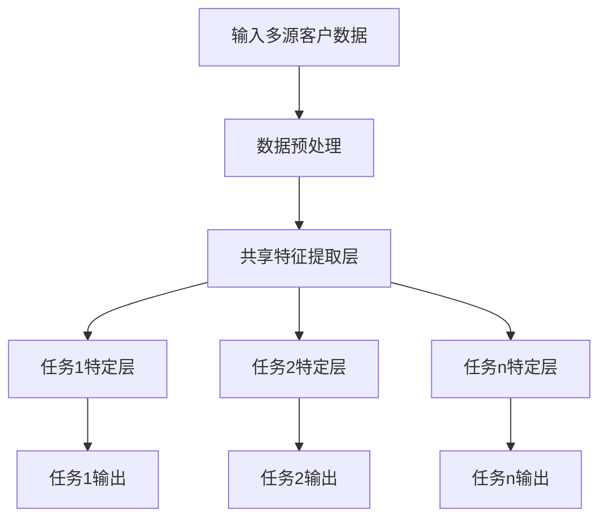

# 金融领域多任务学习在客户全景画像中的应用

> 关键词：金融领域、多任务学习、客户全景画像、数据挖掘、机器学习

> 摘要：本文深入探讨了金融领域多任务学习在客户全景画像中的应用。首先介绍了相关背景，包括目的、预期读者等。接着阐述了多任务学习和客户全景画像的核心概念及联系，详细讲解了核心算法原理与具体操作步骤，给出了相应的数学模型和公式并举例说明。通过项目实战展示了代码的实际案例和详细解释。分析了多任务学习在金融客户全景画像中的实际应用场景，推荐了学习、开发相关的工具和资源，最后总结了未来发展趋势与挑战，并对常见问题进行了解答，提供了扩展阅读和参考资料，旨在为金融行业利用多任务学习构建客户全景画像提供全面的技术指导。

## 1. 背景介绍 
### 1.1 目的和范围
在金融领域，客户是业务的核心。准确了解客户的需求、偏好、风险承受能力等信息，对于金融机构开展精准营销、风险评估、产品设计等业务至关重要。客户全景画像就是对客户信息进行全面、深入、细致的刻画，以形成对客户的多维度认知。

多任务学习作为机器学习的一个重要分支，能够同时处理多个相关任务，通过共享任务之间的信息，提高模型的泛化能力和学习效率。将多任务学习应用于金融领域的客户全景画像中，可以充分挖掘客户数据的潜在信息，更准确地构建客户画像。

本文的范围主要涵盖金融领域，包括银行、证券、保险等行业，重点研究多任务学习在构建客户全景画像过程中的应用，包括核心概念、算法原理、实际案例等方面。

### 1.2 预期读者
本文的预期读者主要包括金融行业的数据分析师、数据科学家、业务决策者，以及对金融科技、机器学习感兴趣的研究人员和开发者。对于金融从业者来说，本文可以帮助他们了解如何利用多任务学习技术提升客户画像的质量和业务效果；对于技术人员来说，本文提供了多任务学习在金融场景中的具体应用案例和技术实现细节。

### 1.3 文档结构概述
本文将按照以下结构进行阐述：首先介绍多任务学习和客户全景画像的核心概念及它们之间的联系；接着详细讲解多任务学习的核心算法原理和具体操作步骤，并给出相应的数学模型和公式；通过项目实战展示如何使用代码实现多任务学习在客户全景画像中的应用；分析多任务学习在金融领域的实际应用场景；推荐相关的学习、开发工具和资源；最后总结未来发展趋势与挑战，解答常见问题，并提供扩展阅读和参考资料。

### 1.4 术语表
#### 1.4.1 核心术语定义
- **多任务学习（Multi - task Learning）**：一种机器学习范式，通过同时学习多个相关任务，利用任务之间的共享信息来提高模型的性能和泛化能力。
- **客户全景画像（Customer Holistic Portrait）**：基于客户的多源数据，如交易记录、基本信息、行为数据等，构建的对客户全面、多维度的描述，用于了解客户的特征、需求和行为模式。
- **特征共享（Feature Sharing）**：多任务学习中，不同任务之间共享部分特征表示，以减少模型的参数数量，提高学习效率。
- **任务相关性（Task Relevance）**：衡量多个任务之间关联程度的指标，任务相关性越高，多任务学习的效果可能越好。

#### 1.4.2 相关概念解释
- **单任务学习（Single - task Learning）**：与多任务学习相对，每次只学习一个任务，不考虑其他任务的信息。
- **深度学习（Deep Learning）**：一种基于神经网络的机器学习方法，通过多层神经网络自动学习数据的特征表示，在图像识别、自然语言处理等领域取得了显著的成果。
- **数据挖掘（Data Mining）**：从大量数据中发现有价值信息和知识的过程，常用的方法包括分类、聚类、关联规则挖掘等。

#### 1.4.3 缩略词列表
- **ML（Machine Learning）**：机器学习
- **DL（Deep Learning）**：深度学习
- **DNN（Deep Neural Network）**：深度神经网络
- **CNN（Convolutional Neural Network）**：卷积神经网络
- **RNN（Recurrent Neural Network）**：循环神经网络

## 2. 核心概念与联系 
### 核心概念原理
#### 多任务学习原理
多任务学习的核心思想是利用多个相关任务之间的共享信息来提高模型的性能。在金融领域，不同的任务可能包括客户信用评估、客户流失预测、客户购买意愿预测等。这些任务之间往往存在一定的相关性，例如客户的基本信息、交易记录等特征对多个任务都有影响。

多任务学习通过构建一个共享的特征表示层，使得不同任务可以共享部分特征信息。同时，每个任务也有自己独立的输出层，用于处理该任务的特定信息。这样，模型可以在学习每个任务的同时，利用其他任务的信息来提高学习效果。

#### 客户全景画像原理
客户全景画像是基于客户的多源数据构建的。这些数据包括客户的基本信息（如年龄、性别、职业等）、交易记录（如存款、贷款、投资等）、行为数据（如网站浏览记录、APP使用记录等）。通过对这些数据进行清洗、预处理、特征提取和建模，可以得到客户在不同维度上的特征表示，从而构建出客户的全景画像。

客户全景画像可以帮助金融机构更好地了解客户的需求、偏好和风险承受能力，为精准营销、风险评估、产品设计等业务提供支持。

### 架构的文本示意图
```plaintext
多任务学习在客户全景画像中的架构

输入数据（多源客户数据）
|
|-- 数据预处理（清洗、归一化等）
|
|-- 共享特征提取层（如全连接层、卷积层等）
|       |
|       |-- 任务1特定层（如全连接层） -- 任务1输出（如信用评估结果）
|       |
|       |-- 任务2特定层（如全连接层） -- 任务2输出（如流失预测结果）
|       |
|       |--...
|       |
|       |-- 任务n特定层（如全连接层） -- 任务n输出（如购买意愿预测结果）
```

### Mermaid 流程图


## 3. 核心算法原理 & 具体操作步骤 
### 核心算法原理
多任务学习有多种实现方法，这里以基于神经网络的多任务学习为例进行讲解。假设我们有 $N$ 个任务，每个任务的输出分别为 $y_1, y_2,..., y_N$，输入数据为 $x$。

我们构建一个共享的特征提取网络 $f(x)$，将输入数据 $x$ 映射到一个共享的特征空间。然后，对于每个任务 $i$，我们构建一个特定的输出网络 $g_i(f(x))$，用于生成该任务的输出 $\hat{y}_i$。

多任务学习的目标是最小化所有任务的损失函数之和，即：

$$L = \sum_{i = 1}^{N} \lambda_i L_i(\hat{y}_i, y_i)$$

其中，$L_i$ 是任务 $i$ 的损失函数，$\lambda_i$ 是任务 $i$ 的权重，用于平衡不同任务的重要性。

### 具体操作步骤
#### 步骤1：数据收集与预处理
收集金融领域的多源客户数据，包括基本信息、交易记录、行为数据等。对数据进行清洗，去除缺失值、异常值；进行归一化处理，将数据转换到相同的尺度上。

#### 步骤2：构建共享特征提取网络
使用深度学习框架（如TensorFlow、PyTorch）构建一个共享的特征提取网络，例如一个多层全连接神经网络。该网络的输入是预处理后的数据，输出是共享的特征表示。

#### 步骤3：构建任务特定输出网络
对于每个任务，构建一个特定的输出网络。例如，如果是分类任务，可以使用一个全连接层和一个Softmax激活函数；如果是回归任务，可以使用一个全连接层和一个线性激活函数。

#### 步骤4：定义损失函数和优化器
定义每个任务的损失函数，例如交叉熵损失函数用于分类任务，均方误差损失函数用于回归任务。选择一个优化器，如随机梯度下降（SGD）、Adam等，用于最小化总损失函数。

#### 步骤5：训练模型
将数据划分为训练集和验证集，使用训练集对模型进行训练。在训练过程中，不断调整模型的参数，使得总损失函数最小化。同时，使用验证集监控模型的性能，防止过拟合。

#### 步骤6：模型评估与应用
使用测试集对训练好的模型进行评估，计算各个任务的评估指标，如准确率、召回率、均方误差等。如果模型性能满足要求，则可以将其应用于实际的客户全景画像构建中。

### Python源代码实现
```python
import tensorflow as tf
from tensorflow.keras import layers, models

# 步骤1：数据收集与预处理（这里假设数据已经预处理好）
# 假设输入数据的维度为 input_dim，有 N 个任务
input_dim = 100
N = 3

# 步骤2：构建共享特征提取网络
input_layer = layers.Input(shape=(input_dim,))
shared_layer = layers.Dense(64, activation='relu')(input_layer)
shared_layer = layers.Dense(32, activation='relu')(shared_layer)

# 步骤3：构建任务特定输出网络
outputs = []
for i in range(N):
    task_layer = layers.Dense(16, activation='relu')(shared_layer)
    if i == 0:  # 假设第一个任务是分类任务
        output = layers.Dense(2, activation='softmax', name=f'task_{i}_output')(task_layer)
    else:  # 其他任务是回归任务
        output = layers.Dense(1, name=f'task_{i}_output')(task_layer)
    outputs.append(output)

# 步骤4：定义模型
model = models.Model(inputs=input_layer, outputs=outputs)

# 定义损失函数和优化器
losses = {}
for i in range(N):
    if i == 0:
        losses[f'task_{i}_output'] = 'categorical_crossentropy'
    else:
        losses[f'task_{i}_output'] = 'mean_squared_error'

model.compile(optimizer='adam', loss=losses)

# 步骤5：训练模型
# 假设 x_train 是训练数据，y_train 是训练标签
# y_train 是一个列表，每个元素对应一个任务的标签
x_train = tf.random.normal((1000, input_dim))
y_train = [tf.random.uniform((1000, 2), dtype=tf.float32), 
           tf.random.normal((1000, 1)), 
           tf.random.normal((1000, 1))]

model.fit(x_train, y_train, epochs=10, batch_size=32)

# 步骤6：模型评估与应用
# 假设 x_test 是测试数据，y_test 是测试标签
x_test = tf.random.normal((200, input_dim))
y_test = [tf.random.uniform((200, 2), dtype=tf.float32), 
          tf.random.normal((200, 1)), 
          tf.random.normal((200, 1))]

loss = model.evaluate(x_test, y_test)
print(f'Total loss: {loss}')
```

## 4. 数学模型和公式 & 详细讲解 & 举例说明 
### 数学模型和公式
#### 共享特征提取
假设输入数据 $x \in \mathbb{R}^d$，共享特征提取网络 $f(x)$ 可以表示为一系列的线性变换和非线性激活函数的组合。例如，一个两层的全连接神经网络可以表示为：

$$h_1 = \sigma(W_1x + b_1)$$
$$h_2 = \sigma(W_2h_1 + b_2)$$

其中，$W_1 \in \mathbb{R}^{m_1 \times d}$，$W_2 \in \mathbb{R}^{m_2 \times m_1}$ 是权重矩阵，$b_1 \in \mathbb{R}^{m_1}$，$b_2 \in \mathbb{R}^{m_2}$ 是偏置向量，$\sigma$ 是非线性激活函数，如ReLU函数：

$$\sigma(z) = \max(0, z)$$

#### 任务特定输出
对于任务 $i$，任务特定输出网络 $g_i(f(x))$ 也可以表示为线性变换和非线性激活函数的组合。例如，一个简单的全连接层可以表示为：

$$\hat{y}_i = W_{i}h_2 + b_{i}$$

其中，$W_{i} \in \mathbb{R}^{k_i \times m_2}$ 是权重矩阵，$b_{i} \in \mathbb{R}^{k_i}$ 是偏置向量，$k_i$ 是任务 $i$ 的输出维度。

#### 损失函数
对于分类任务，常用的损失函数是交叉熵损失函数：

$$L_{i}^{cls}(\hat{y}_i, y_i) = - \sum_{j = 1}^{k_i} y_{i,j} \log(\hat{y}_{i,j})$$

其中，$y_{i,j}$ 是任务 $i$ 的真实标签的第 $j$ 个分量，$\hat{y}_{i,j}$ 是模型预测输出的第 $j$ 个分量。

对于回归任务，常用的损失函数是均方误差损失函数：

$$L_{i}^{reg}(\hat{y}_i, y_i) = \frac{1}{k_i} \sum_{j = 1}^{k_i} (\hat{y}_{i,j} - y_{i,j})^2$$

#### 总损失函数
多任务学习的总损失函数为：

$$L = \sum_{i = 1}^{N} \lambda_i L_i(\hat{y}_i, y_i)$$

其中，$\lambda_i$ 是任务 $i$ 的权重，用于平衡不同任务的重要性。

### 详细讲解
- **共享特征提取**：共享特征提取网络的作用是从输入数据中提取出对所有任务都有用的特征。通过共享这些特征，可以减少模型的参数数量，提高学习效率，同时也可以利用任务之间的相关性来提高模型的性能。
- **任务特定输出**：每个任务的特定输出网络根据共享特征来生成该任务的输出。由于不同任务的需求不同，因此需要有独立的输出网络来处理。
- **损失函数**：损失函数用于衡量模型预测输出与真实标签之间的差异。不同的任务需要使用不同的损失函数，例如分类任务使用交叉熵损失函数，回归任务使用均方误差损失函数。
- **总损失函数**：总损失函数是所有任务的损失函数的加权和。权重 $\lambda_i$ 可以根据任务的重要性进行调整。例如，如果某个任务对业务非常重要，可以将其权重设置得较大。

### 举例说明
假设我们有两个任务：客户信用评估（分类任务）和客户贷款额度预测（回归任务）。输入数据是客户的基本信息和交易记录，维度为 $d = 100$。

共享特征提取网络使用一个两层的全连接神经网络，第一层有 $m_1 = 64$ 个神经元，第二层有 $m_2 = 32$ 个神经元。

对于客户信用评估任务，任务特定输出网络是一个全连接层，输出维度 $k_1 = 2$（表示信用良好和信用不良），使用Softmax激活函数。损失函数使用交叉熵损失函数，权重 $\lambda_1 = 0.6$。

对于客户贷款额度预测任务，任务特定输出网络是一个全连接层，输出维度 $k_2 = 1$，使用线性激活函数。损失函数使用均方误差损失函数，权重 $\lambda_2 = 0.4$。

总损失函数为：

$$L = 0.6L_1^{cls}(\hat{y}_1, y_1) + 0.4L_2^{reg}(\hat{y}_2, y_2)$$

通过最小化总损失函数，模型可以同时学习客户信用评估和贷款额度预测两个任务。

## 5. 项目实战：代码实际案例和详细解释说明 
### 5.1  开发环境搭建
#### 操作系统
推荐使用Linux系统，如Ubuntu 18.04及以上版本，也可以使用Windows 10或macOS。

#### Python环境
安装Python 3.7及以上版本。可以使用Anaconda来管理Python环境，以下是安装步骤：
1. 下载Anaconda安装包：从Anaconda官方网站（https://www.anaconda.com/products/individual）下载适合你操作系统的安装包。
2. 安装Anaconda：运行安装包，按照提示完成安装。
3. 创建虚拟环境：打开终端或命令提示符，运行以下命令创建一个新的虚拟环境：
```bash
conda create -n finance_mtl python=3.8
conda activate finance_mtl
```

#### 安装依赖库
在激活的虚拟环境中，安装以下依赖库：
```bash
pip install tensorflow pandas numpy scikit-learn
```

### 5.2  源代码详细实现和代码解读
#### 数据准备
假设我们有一个包含客户基本信息和交易记录的CSV文件 `customer_data.csv`，其中包含多个特征和两个目标变量：客户信用评估标签（`credit_label`）和客户贷款额度（`loan_amount`）。

```python
import pandas as pd
from sklearn.preprocessing import StandardScaler
from sklearn.model_selection import train_test_split

# 读取数据
data = pd.read_csv('customer_data.csv')

# 分离特征和目标变量
X = data.drop(['credit_label', 'loan_amount'], axis=1)
y_credit = data['credit_label']
y_loan = data['loan_amount']

# 数据预处理
scaler = StandardScaler()
X = scaler.fit_transform(X)

# 划分训练集和测试集
X_train, X_test, y_credit_train, y_credit_test, y_loan_train, y_loan_test = train_test_split(
    X, y_credit, y_loan, test_size=0.2, random_state=42
)
```

#### 构建多任务学习模型
```python
import tensorflow as tf
from tensorflow.keras import layers, models

# 输入层
input_layer = layers.Input(shape=(X_train.shape[1],))

# 共享特征提取层
shared_layer = layers.Dense(64, activation='relu')(input_layer)
shared_layer = layers.Dense(32, activation='relu')(shared_layer)

# 信用评估任务特定层
credit_layer = layers.Dense(16, activation='relu')(shared_layer)
credit_output = layers.Dense(2, activation='softmax', name='credit_output')(credit_layer)

# 贷款额度预测任务特定层
loan_layer = layers.Dense(16, activation='relu')(shared_layer)
loan_output = layers.Dense(1, name='loan_output')(loan_layer)

# 定义模型
model = models.Model(inputs=input_layer, outputs=[credit_output, loan_output])

# 编译模型
model.compile(
    optimizer='adam',
    loss={
        'credit_output': 'sparse_categorical_crossentropy',
        'loan_output': 'mean_squared_error'
    },
    loss_weights={
        'credit_output': 0.6,
        'loan_output': 0.4
    }
)
```

#### 训练模型
```python
# 训练模型
model.fit(
    X_train,
    {'credit_output': y_credit_train, 'loan_output': y_loan_train},
    epochs=10,
    batch_size=32,
    validation_split=0.1
)
```

#### 模型评估
```python
# 评估模型
loss, credit_loss, loan_loss = model.evaluate(X_test, [y_credit_test, y_loan_test])
print(f'Total loss: {loss}, Credit loss: {credit_loss}, Loan loss: {loan_loss}')
```

### 5.3  代码解读与分析
#### 数据准备部分
- 使用 `pandas` 库读取CSV文件，并分离特征和目标变量。
- 使用 `StandardScaler` 对特征数据进行归一化处理，使得不同特征具有相同的尺度。
- 使用 `train_test_split` 函数将数据划分为训练集和测试集。

#### 模型构建部分
- 定义输入层，输入维度为特征数据的维度。
- 构建共享特征提取层，使用两层全连接神经网络，激活函数为ReLU。
- 分别构建信用评估任务和贷款额度预测任务的特定输出层，信用评估任务使用Softmax激活函数，贷款额度预测任务使用线性激活函数。
- 定义模型，输入为输入层，输出为两个任务的输出层。
- 编译模型，指定优化器为Adam，损失函数分别为交叉熵损失函数和均方误差损失函数，并设置任务的权重。

#### 模型训练部分
- 使用 `fit` 方法对模型进行训练，指定训练数据、训练轮数、批次大小和验证集比例。

#### 模型评估部分
- 使用 `evaluate` 方法对模型进行评估，计算总损失、信用评估任务损失和贷款额度预测任务损失。

## 6. 实际应用场景 
### 精准营销
通过构建客户全景画像，金融机构可以了解客户的需求、偏好和消费习惯。多任务学习可以同时处理多个与营销相关的任务，如客户购买意愿预测、客户价值评估等。根据这些任务的输出，金融机构可以为客户提供个性化的营销方案，推荐适合客户的金融产品和服务，提高营销效果和客户满意度。

### 风险评估
在金融领域，风险评估是非常重要的任务。多任务学习可以同时考虑多个与风险相关的因素，如客户的信用记录、收入水平、负债情况等。通过构建多任务学习模型，可以更准确地评估客户的风险水平，为贷款审批、投资决策等提供支持，降低金融机构的风险。

### 客户流失预测
客户流失是金融机构面临的一个重要问题。多任务学习可以结合客户的交易记录、行为数据、服务评价等信息，同时处理客户流失预测和客户挽回策略推荐等任务。通过提前预测客户流失的可能性，并采取相应的措施，可以有效地降低客户流失率，提高客户忠诚度。

### 产品设计
了解客户的需求和偏好对于金融产品设计至关重要。多任务学习可以分析客户的多维度数据，同时处理客户需求分析、产品功能评估等任务。根据这些任务的结果，金融机构可以设计出更符合客户需求的金融产品，提高产品的竞争力和市场占有率。

## 7. 工具和资源推荐
### 7.1 学习资源推荐
#### 7.1.1 书籍推荐
- 《深度学习》（Deep Learning）：由Ian Goodfellow、Yoshua Bengio和Aaron Courville撰写，是深度学习领域的经典教材，涵盖了深度学习的基本原理、算法和应用。
- 《Python机器学习》（Python Machine Learning）：由Sebastian Raschka和Vahid Mirjalili撰写，介绍了使用Python进行机器学习的方法和技巧，包括多任务学习等内容。
- 《金融科技：人工智能与机器学习应用》：介绍了人工智能和机器学习在金融领域的应用，包括客户画像、风险评估等方面的内容。

#### 7.1.2 在线课程
- Coursera上的“深度学习专项课程”（Deep Learning Specialization）：由Andrew Ng教授授课，涵盖了深度学习的各个方面，包括多任务学习的原理和实践。
- edX上的“金融科技基础”（Foundations of Fintech）：介绍了金融科技的基本概念和技术，包括人工智能和机器学习在金融领域的应用。
- 网易云课堂上的“Python数据分析与机器学习实战”：通过实际案例介绍了Python在数据分析和机器学习中的应用，包括多任务学习的实现。

#### 7.1.3 技术博客和网站
- Medium：上面有很多关于机器学习和金融科技的技术博客文章，涵盖了多任务学习在金融领域的最新研究成果和应用案例。
- arXiv：是一个预印本服务器，提供了大量关于机器学习和人工智能的研究论文，包括多任务学习的相关研究。
- Kaggle：是一个数据科学竞赛平台，上面有很多金融领域的数据集和竞赛项目，可以通过参与竞赛来学习多任务学习的应用。

### 7.2 开发工具框架推荐
#### 7.2.1 IDE和编辑器
- PyCharm：是一款专门为Python开发设计的集成开发环境（IDE），提供了丰富的功能，如代码编辑、调试、版本控制等。
- Jupyter Notebook：是一个交互式的开发环境，适合进行数据分析和模型开发。可以方便地编写代码、运行代码块、展示结果和可视化数据。
- Visual Studio Code：是一款轻量级的代码编辑器，支持多种编程语言，包括Python。通过安装相关的扩展插件，可以实现代码编辑、调试、版本控制等功能。

#### 7.2.2 调试和性能分析工具
- TensorBoard：是TensorFlow提供的一个可视化工具，可以用于监控模型的训练过程、查看模型的结构和性能指标等。
- PyTorch Profiler：是PyTorch提供的一个性能分析工具，可以用于分析模型的运行时间、内存使用情况等，帮助优化模型性能。
- Scikit-learn的GridSearchCV：可以用于模型的超参数调优，通过网格搜索的方法找到最优的超参数组合，提高模型的性能。

#### 7.2.3 相关框架和库
- TensorFlow：是一个开源的深度学习框架，提供了丰富的工具和接口，支持多任务学习模型的构建和训练。
- PyTorch：是另一个流行的深度学习框架，具有动态图的特点，易于使用和调试，也支持多任务学习的实现。
- Scikit-learn：是一个用于机器学习的Python库，提供了多种机器学习算法和工具，如数据预处理、模型评估等，可用于多任务学习的辅助开发。

### 7.3 相关论文著作推荐
#### 7.3.1 经典论文
- “An Overview of Multi-Task Learning in Deep Neural Networks”：对深度神经网络中的多任务学习进行了全面的综述，介绍了多任务学习的基本概念、方法和应用。
- “Learning Multiple Tasks with Multilinear Relationships”：提出了一种基于多线性关系的多任务学习方法，通过学习任务之间的多线性关系来提高模型的性能。
- “Multi-Task Learning Using Uncertainty to Weigh Losses for Scene Geometry and Semantics”：提出了一种基于不确定性的多任务学习方法，通过考虑任务的不确定性来自动调整任务的权重。

#### 7.3.2 最新研究成果
- 关注顶级机器学习会议（如NeurIPS、ICML、CVPR等）和金融科技会议（如ACM SIGKDD Workshop on Data Mining in Financial Services等）上的最新研究成果，了解多任务学习在金融领域的最新应用和发展趋势。

#### 7.3.3 应用案例分析
- 可以查阅金融机构的官方网站、研究报告和学术论文，了解多任务学习在实际金融业务中的应用案例，如银行的客户画像构建、证券的投资策略制定等。

## 8. 总结：未来发展趋势与挑战
### 未来发展趋势
#### 与其他技术的融合
多任务学习将与其他人工智能技术，如深度学习、强化学习、迁移学习等进一步融合。例如，结合强化学习可以实现动态调整任务权重，提高模型的适应性；结合迁移学习可以利用跨领域的数据来提高模型的性能。

#### 更复杂的任务建模
随着金融业务的不断发展，客户全景画像需要处理的任务将越来越复杂。未来的多任务学习模型将能够处理更多类型的任务，如多模态数据的融合、时序数据的处理等，以更全面地刻画客户的特征和行为。

#### 可解释性增强
在金融领域，模型的可解释性非常重要。未来的多任务学习模型将更加注重可解释性，能够解释模型的决策过程和结果，为金融机构的业务决策提供更可靠的支持。

### 挑战
#### 数据质量和隐私问题
金融领域的数据往往涉及到客户的隐私和敏感信息，数据的质量和安全性至关重要。同时，数据的缺失、噪声和不平衡等问题也会影响多任务学习模型的性能。如何保证数据的质量和隐私，同时有效地利用数据是一个挑战。

#### 任务相关性的度量和处理
多任务学习的效果很大程度上取决于任务之间的相关性。如何准确地度量任务之间的相关性，并根据相关性进行有效的任务分组和特征共享是一个难题。此外，当任务之间的相关性较弱时，如何避免负迁移也是需要解决的问题。

#### 模型复杂度和计算资源
随着任务数量和数据规模的增加，多任务学习模型的复杂度也会相应增加。如何在保证模型性能的前提下，降低模型的复杂度，减少计算资源的消耗是一个挑战。

## 9. 附录：常见问题与解答
### 问题1：多任务学习一定比单任务学习效果好吗？
不一定。多任务学习的效果取决于任务之间的相关性。如果任务之间的相关性较强，多任务学习可以通过共享任务之间的信息来提高模型的性能；但如果任务之间的相关性较弱，多任务学习可能会引入噪声，导致模型性能下降。因此，在使用多任务学习之前，需要评估任务之间的相关性。

### 问题2：如何选择任务的权重？
任务的权重可以根据任务的重要性、数据的分布和模型的性能等因素来选择。一种简单的方法是手动设置权重，根据业务需求来调整不同任务的重要性。另一种方法是使用自动调整权重的方法，如基于不确定性的方法，通过考虑任务的不确定性来自动调整任务的权重。

### 问题3：多任务学习模型容易过拟合吗？
多任务学习模型相对于单任务学习模型来说，由于共享了特征信息，在一定程度上可以减少过拟合的风险。但如果模型过于复杂，数据量不足，仍然可能会出现过拟合的问题。为了防止过拟合，可以采用正则化方法（如L1、L2正则化）、增加数据量、使用Dropout等技术。

### 问题4：如何处理任务之间的不平衡问题？
任务之间的不平衡问题可以通过以下方法来处理：
- 数据重采样：对数据量较少的任务进行过采样，对数据量较多的任务进行欠采样，以平衡不同任务的数据分布。
- 调整损失函数：在损失函数中为不同任务设置不同的权重，对数据量较少的任务给予更高的权重。
- 多阶段训练：先对每个任务单独进行训练，然后再进行多任务学习，以提高模型对不同任务的学习能力。

## 10. 扩展阅读 & 参考资料
### 扩展阅读
- 《人工智能：现代方法》（Artificial Intelligence: A Modern Approach）：全面介绍了人工智能的基本概念、算法和应用，对于深入理解多任务学习和机器学习的原理有很大帮助。
- 《金融大数据分析与应用》：介绍了金融大数据的特点、处理方法和应用场景，包括客户画像、风险评估等方面的内容。

### 参考资料
- 相关的学术论文和研究报告，如在IEEE、ACM等学术数据库中搜索多任务学习和金融领域客户画像的相关论文。
- 金融机构的官方网站和研究报告，了解多任务学习在实际金融业务中的应用案例和实践经验。

作者：AI天才研究院/AI Genius Institute & 禅与计算机程序设计艺术 /Zen And The Art of Computer Programming