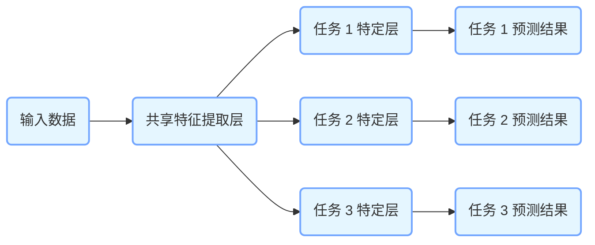

# 金融领域多任务学习的应用与挑战

> 关键词：金融领域、多任务学习、机器学习、数据挖掘、应用场景、挑战

> 摘要：本文围绕金融领域多任务学习的应用与挑战展开深入探讨。首先介绍了多任务学习的背景，包括其目的、适用读者群体等内容。详细阐述了多任务学习的核心概念与联系，通过文本示意图和 Mermaid 流程图清晰展示其原理和架构。接着深入讲解了核心算法原理，结合 Python 源代码进行详细说明，并给出相关数学模型和公式。在项目实战部分，通过具体案例展示开发环境搭建、源代码实现与解读。分析了多任务学习在金融领域的实际应用场景，推荐了学习资源、开发工具框架以及相关论文著作。最后总结了多任务学习在金融领域的未来发展趋势与挑战，同时给出常见问题解答和扩展阅读参考资料，旨在为金融领域多任务学习的研究和实践提供全面且深入的指导。

## 1. 背景介绍 
### 1.1 目的和范围
在金融领域，数据具有高度的复杂性和关联性。传统的单任务学习方法往往无法充分利用数据中的潜在信息，导致模型性能受限。多任务学习作为一种新兴的机器学习范式，旨在同时学习多个相关任务，通过共享信息来提高每个任务的学习效果。本文的目的在于深入探讨多任务学习在金融领域的应用，分析其原理、算法、实际案例以及面临的挑战，为金融从业者和研究人员提供全面的技术参考。

本文的范围涵盖多任务学习的基本概念、核心算法、数学模型，以及在金融领域的具体应用场景，如风险评估、信贷审批、投资组合优化等。同时，还将探讨多任务学习在实际应用中面临的挑战和未来发展趋势。

### 1.2 预期读者
本文预期读者包括金融领域的从业者，如银行信贷员、风险分析师、投资经理等，他们可以从本文中了解多任务学习如何应用于实际工作中，提升工作效率和决策准确性。同时，也适合机器学习和数据挖掘领域的研究人员和学生，帮助他们深入理解多任务学习在金融场景下的具体应用和技术细节。

### 1.3 文档结构概述
本文将按照以下结构进行阐述：首先介绍多任务学习的背景信息，包括目的、读者群体和文档结构等；接着详细讲解多任务学习的核心概念与联系，通过示意图和流程图展示其原理和架构；然后深入探讨核心算法原理，结合 Python 代码进行说明，并给出相关数学模型和公式；在项目实战部分，通过具体案例展示开发环境搭建、源代码实现与解读；分析多任务学习在金融领域的实际应用场景；推荐相关的学习资源、开发工具框架和论文著作；最后总结多任务学习在金融领域的未来发展趋势与挑战，提供常见问题解答和扩展阅读参考资料。

### 1.4 术语表
#### 1.4.1 核心术语定义
- **多任务学习（Multi - Task Learning, MTL）**：是一种机器学习技术，旨在同时学习多个相关任务，通过在不同任务之间共享信息来提高每个任务的学习效果。
- **任务（Task）**：在多任务学习中，任务是指需要学习的具体目标，例如预测股票价格、评估信用风险等。
- **特征（Feature）**：是描述数据的属性或变量，用于训练模型。
- **共享表示（Shared Representation）**：多任务学习中，不同任务之间共享的特征表示，通过共享表示可以提高模型的泛化能力。

#### 1.4.2 相关概念解释
- **单任务学习（Single - Task Learning）**：每次只学习一个任务，不考虑任务之间的相关性。与多任务学习相比，单任务学习可能无法充分利用数据中的潜在信息。
- **迁移学习（Transfer Learning）**：是一种将在一个任务或领域中学习到的知识迁移到另一个任务或领域的技术。多任务学习和迁移学习都涉及知识的共享和迁移，但多任务学习更侧重于同时学习多个相关任务。

#### 1.4.3 缩略词列表
- **MTL**：Multi - Task Learning（多任务学习）
- **ML**：Machine Learning（机器学习）
- **DL**：Deep Learning（深度学习）

## 2. 核心概念与联系 

多任务学习的核心思想是通过同时学习多个相关任务，让模型能够从不同任务中提取共享的信息，从而提高每个任务的学习效果。其基本原理是构建一个共享的特征表示，不同的任务在这个共享表示的基础上进行学习。

### 文本示意图
多任务学习的架构可以用以下文本示意图表示：

输入数据首先经过一个共享的特征提取层，该层将输入数据转换为共享的特征表示。然后，不同的任务分支从共享特征表示中获取信息，通过各自的任务特定层进行任务相关的学习，最后输出每个任务的预测结果。

### Mermaid 流程图


在这个流程图中，输入数据经过共享特征提取层得到共享特征表示，然后分别进入不同的任务特定层进行任务相关的学习，最终输出每个任务的预测结果。通过共享特征提取层，不同任务可以共享信息，从而提高学习效率和效果。

## 3. 核心算法原理 & 具体操作步骤 

### 核心算法原理
多任务学习的核心算法有多种，这里以基于神经网络的多任务学习为例进行讲解。在基于神经网络的多任务学习中，通常采用以下步骤：

1. **构建共享特征提取层**：使用神经网络（如全连接层、卷积层等）对输入数据进行特征提取，得到共享的特征表示。
2. **构建任务特定层**：针对每个任务，构建独立的任务特定层，这些层基于共享特征表示进行任务相关的学习。
3. **定义损失函数**：为每个任务定义损失函数，通常采用交叉熵损失、均方误差损失等。然后将所有任务的损失函数进行加权求和，得到总的损失函数。
4. **训练模型**：使用梯度下降等优化算法对模型进行训练，最小化总的损失函数。

### Python 源代码详细阐述
以下是一个简单的基于 PyTorch 的多任务学习示例代码：

```python
import torch
import torch.nn as nn
import torch.optim as optim

# 定义多任务学习模型
class MultiTaskModel(nn.Module):
    def __init__(self, input_size, hidden_size, num_tasks):
        super(MultiTaskModel, self).__init__()
        # 共享特征提取层
        self.shared_layer = nn.Linear(input_size, hidden_size)
        self.relu = nn.ReLU()
        # 任务特定层
        self.task_layers = nn.ModuleList([nn.Linear(hidden_size, 1) for _ in range(num_tasks)])

    def forward(self, x):
        # 共享特征提取
        shared_features = self.relu(self.shared_layer(x))
        # 任务特定预测
        task_outputs = [task_layer(shared_features) for task_layer in self.task_layers]
        return task_outputs

# 生成示例数据
input_size = 10
hidden_size = 20
num_tasks = 3
num_samples = 100

x = torch.randn(num_samples, input_size)
y1 = torch.randn(num_samples, 1)
y2 = torch.randn(num_samples, 1)
y3 = torch.randn(num_samples, 1)
y = [y1, y2, y3]

# 初始化模型
model = MultiTaskModel(input_size, hidden_size, num_tasks)

# 定义损失函数和优化器
criterion = nn.MSELoss()
optimizer = optim.Adam(model.parameters(), lr=0.001)

# 训练模型
num_epochs = 100
for epoch in range(num_epochs):
    optimizer.zero_grad()
    outputs = model(x)
    losses = [criterion(output, target) for output, target in zip(outputs, y)]
    total_loss = sum(losses)
    total_loss.backward()
    optimizer.step()

    if (epoch + 1) % 10 == 0:
        print(f'Epoch [{epoch + 1}/{num_epochs}], Loss: {total_loss.item():.4f}')
```

### 具体操作步骤解释
1. **定义模型**：`MultiTaskModel` 类定义了多任务学习模型，包括共享特征提取层和任务特定层。
2. **生成示例数据**：生成输入数据 `x` 和每个任务的目标数据 `y`。
3. **初始化模型、损失函数和优化器**：使用 `nn.MSELoss()` 作为损失函数，`optim.Adam()` 作为优化器。
4. **训练模型**：在每个训练周期中，计算每个任务的损失，将所有任务的损失相加得到总损失，然后使用反向传播更新模型参数。

## 4. 数学模型和公式 & 详细讲解 & 举例说明 

### 数学模型
多任务学习的数学模型可以表示为：

假设我们有 $T$ 个任务，每个任务的输入数据为 $X$，目标数据为 $Y_t$（$t = 1,2,\cdots,T$）。模型的参数为 $\theta$，包括共享特征提取层的参数 $\theta_s$ 和每个任务特定层的参数 $\theta_t$（$t = 1,2,\cdots,T$）。

模型的输出为 $\hat{Y}_t$（$t = 1,2,\cdots,T$），每个任务的损失函数为 $L_t(\hat{Y}_t, Y_t)$。总的损失函数可以表示为：

$$L(\theta) = \sum_{t = 1}^{T} w_t L_t(\hat{Y}_t, Y_t)$$

其中，$w_t$ 是每个任务的权重，用于控制每个任务在总损失中的重要性。

### 详细讲解
- **共享特征提取**：通过共享特征提取层，不同任务可以共享信息，提高模型的泛化能力。共享特征提取层的参数 $\theta_s$ 是所有任务共享的。
- **任务特定层**：每个任务有独立的任务特定层，其参数 $\theta_t$ 只与该任务相关。
- **损失函数**：每个任务的损失函数 $L_t(\hat{Y}_t, Y_t)$ 衡量了模型在该任务上的预测误差。通过加权求和得到总的损失函数 $L(\theta)$，模型的目标是最小化总的损失函数。

### 举例说明
假设我们有两个任务：预测股票价格和评估信用风险。输入数据 $X$ 包含股票的历史价格、公司财务指标等信息。

- **任务 1：预测股票价格**
    - 目标数据 $Y_1$ 是股票的未来价格。
    - 损失函数 $L_1(\hat{Y}_1, Y_1)$ 可以采用均方误差损失：$L_1(\hat{Y}_1, Y_1) = \frac{1}{N} \sum_{i = 1}^{N} (\hat{Y}_{1i} - Y_{1i})^2$，其中 $N$ 是样本数量。
- **任务 2：评估信用风险**
    - 目标数据 $Y_2$ 是信用风险等级（如高、中、低）。
    - 损失函数 $L_2(\hat{Y}_2, Y_2)$ 可以采用交叉熵损失：$L_2(\hat{Y}_2, Y_2) = - \frac{1}{N} \sum_{i = 1}^{N} \sum_{c = 1}^{C} Y_{2ic} \log(\hat{Y}_{2ic})$，其中 $C$ 是信用风险等级的类别数。

总的损失函数为：$L(\theta) = w_1 L_1(\hat{Y}_1, Y_1) + w_2 L_2(\hat{Y}_2, Y_2)$，其中 $w_1$ 和 $w_2$ 是两个任务的权重。

## 5. 项目实战：代码实际案例和详细解释说明 

### 5.1  开发环境搭建
为了实现多任务学习项目，我们需要搭建相应的开发环境。以下是具体步骤：

1. **安装 Python**：建议使用 Python 3.6 及以上版本，可以从 Python 官方网站（https://www.python.org/downloads/）下载安装。
2. **安装深度学习框架**：这里我们使用 PyTorch，根据自己的系统和 CUDA 版本选择合适的安装方式。可以通过以下命令安装：
```bash
pip install torch torchvision
```
3. **安装其他依赖库**：如 `numpy`、`pandas` 等，可以使用以下命令安装：
```bash
pip install numpy pandas
```

### 5.2  源代码详细实现和代码解读
以下是一个基于金融数据集的多任务学习项目示例代码：

```python
import torch
import torch.nn as nn
import torch.optim as optim
import numpy as np
import pandas as pd
from sklearn.model_selection import train_test_split

# 加载金融数据集
data = pd.read_csv('financial_data.csv')
X = data.drop(['target1', 'target2'], axis=1).values
y1 = data['target1'].values
y2 = data['target2'].values

# 划分训练集和测试集
X_train, X_test, y1_train, y1_test, y2_train, y2_test = train_test_split(X, y1, y2, test_size=0.2, random_state=42)

# 转换为 PyTorch 张量
X_train = torch.FloatTensor(X_train)
y1_train = torch.FloatTensor(y1_train).view(-1, 1)
y2_train = torch.FloatTensor(y2_train).view(-1, 1)
X_test = torch.FloatTensor(X_test)
y1_test = torch.FloatTensor(y1_test).view(-1, 1)
y2_test = torch.FloatTensor(y2_test).view(-1, 1)

# 定义多任务学习模型
class FinancialMultiTaskModel(nn.Module):
    def __init__(self, input_size, hidden_size):
        super(FinancialMultiTaskModel, self).__init__()
        # 共享特征提取层
        self.shared_layer = nn.Linear(input_size, hidden_size)
        self.relu = nn.ReLU()
        # 任务特定层
        self.task1_layer = nn.Linear(hidden_size, 1)
        self.task2_layer = nn.Linear(hidden_size, 1)

    def forward(self, x):
        # 共享特征提取
        shared_features = self.relu(self.shared_layer(x))
        # 任务特定预测
        task1_output = self.task1_layer(shared_features)
        task2_output = self.task2_layer(shared_features)
        return task1_output, task2_output

# 初始化模型
input_size = X_train.shape[1]
hidden_size = 64
model = FinancialMultiTaskModel(input_size, hidden_size)

# 定义损失函数和优化器
criterion = nn.MSELoss()
optimizer = optim.Adam(model.parameters(), lr=0.001)

# 训练模型
num_epochs = 200
for epoch in range(num_epochs):
    optimizer.zero_grad()
    task1_output, task2_output = model(X_train)
    loss1 = criterion(task1_output, y1_train)
    loss2 = criterion(task2_output, y2_train)
    total_loss = loss1 + loss2
    total_loss.backward()
    optimizer.step()

    if (epoch + 1) % 20 == 0:
        print(f'Epoch [{epoch + 1}/{num_epochs}], Loss: {total_loss.item():.4f}')

# 测试模型
with torch.no_grad():
    task1_pred, task2_pred = model(X_test)
    test_loss1 = criterion(task1_pred, y1_test)
    test_loss2 = criterion(task2_pred, y2_test)
    print(f'Test Loss Task 1: {test_loss1.item():.4f}')
    print(f'Test Loss Task 2: {test_loss2.item():.4f}')
```

### 5.3  代码解读与分析
1. **数据加载与预处理**：使用 `pandas` 加载金融数据集，将特征数据和目标数据分离，然后使用 `sklearn` 的 `train_test_split` 函数将数据划分为训练集和测试集。最后将数据转换为 PyTorch 张量。
2. **模型定义**：`FinancialMultiTaskModel` 类定义了多任务学习模型，包括共享特征提取层和两个任务特定层。
3. **损失函数和优化器**：使用均方误差损失函数 `nn.MSELoss()` 和 Adam 优化器 `optim.Adam()`。
4. **训练模型**：在每个训练周期中，计算每个任务的损失，将两个任务的损失相加得到总损失，然后使用反向传播更新模型参数。
5. **测试模型**：在测试集上评估模型的性能，计算每个任务的测试损失。

## 6. 实际应用场景 

### 风险评估
在金融领域，风险评估是一个重要的任务。多任务学习可以同时考虑多个风险因素，如信用风险、市场风险、操作风险等。通过共享不同风险任务之间的信息，模型可以更准确地评估风险水平。例如，在评估企业的信用风险时，可以同时学习企业的财务状况、行业竞争情况、宏观经济环境等多个相关任务，提高风险评估的准确性。

### 信贷审批
信贷审批需要综合考虑申请人的多个因素，如收入、信用记录、负债情况等。多任务学习可以将这些因素作为不同的任务进行学习，通过共享特征信息，提高信贷审批的效率和准确性。例如，同时学习申请人的还款能力预测和违约概率预测，利用两个任务之间的关联信息，更好地判断是否给予信贷批准。

### 投资组合优化
投资组合优化的目标是在风险和收益之间找到平衡。多任务学习可以同时考虑多个投资目标，如最大化收益、最小化风险、满足特定的投资约束等。通过共享不同投资任务之间的信息，模型可以更有效地进行投资组合优化。例如，同时学习不同资产的预期收益和风险评估，根据这些信息调整投资组合的权重。

### 金融市场预测
金融市场预测包括股票价格预测、汇率预测、利率预测等。多任务学习可以同时学习多个相关的市场预测任务，如同时预测不同股票的价格走势，或者同时预测股票价格和交易量。通过共享市场信息，模型可以更准确地捕捉市场动态，提高预测的准确性。

## 7. 工具和资源推荐
### 7.1 学习资源推荐
#### 7.1.1 书籍推荐
- 《深度学习》（Deep Learning）：由 Ian Goodfellow、Yoshua Bengio 和 Aaron Courville 所著，是深度学习领域的经典教材，涵盖了多任务学习等相关内容。
- 《Python 机器学习》（Python Machine Learning）：由 Sebastian Raschka 和 Vahid Mirjalili 所著，详细介绍了 Python 在机器学习中的应用，包括多任务学习的实现。

#### 7.1.2 在线课程
- Coursera 上的 “深度学习专项课程”（Deep Learning Specialization）：由 Andrew Ng 教授授课，深入讲解了深度学习的各个方面，包括多任务学习的原理和应用。
- edX 上的 “数据科学与机器学习微硕士学位”（MicroMasters Program in Data Science and Machine Learning）：提供了系统的机器学习和数据科学课程，其中包含多任务学习的相关内容。

#### 7.1.3 技术博客和网站
- Medium 上的 “Towards Data Science”：是一个专注于数据科学和机器学习的技术博客，有很多关于多任务学习的文章和案例分享。
- arXiv 网站：是一个预印本平台，提供了大量最新的机器学习研究论文，包括多任务学习的前沿研究成果。

### 7.2 开发工具框架推荐
#### 7.2.1 IDE和编辑器
- PyCharm：是一款专业的 Python 集成开发环境，提供了丰富的代码编辑、调试和项目管理功能，适合开发多任务学习项目。
- Jupyter Notebook：是一个交互式的开发环境，支持 Python 代码的实时运行和可视化，非常适合进行多任务学习的实验和探索。

#### 7.2.2 调试和性能分析工具
- TensorBoard：是 TensorFlow 提供的可视化工具，可以用于可视化多任务学习模型的训练过程、损失曲线、模型结构等，帮助调试和优化模型。
- PyTorch Profiler：是 PyTorch 提供的性能分析工具，可以分析模型的计算效率、内存使用情况等，帮助优化多任务学习模型的性能。

#### 7.2.3 相关框架和库
- PyTorch：是一个开源的深度学习框架，提供了丰富的神经网络模块和优化算法，方便实现多任务学习模型。
- Scikit - learn：是一个常用的机器学习库，提供了数据预处理、模型选择、评估等功能，可用于多任务学习项目的辅助开发。

### 7.3 相关论文著作推荐
#### 7.3.1 经典论文
- “Learning Multiple Related Tasks with Backpropagation”：是多任务学习领域的经典论文，首次提出了基于反向传播的多任务学习方法。
- “An Overview of Multi - Task Learning in Deep Neural Networks”：对深度学习中的多任务学习进行了全面的综述，介绍了多任务学习的基本概念、算法和应用。

#### 7.3.2 最新研究成果
- 在 arXiv 上搜索 “Multi - Task Learning in Finance” 可以找到很多关于金融领域多任务学习的最新研究论文，了解该领域的前沿动态。

#### 7.3.3 应用案例分析
- 一些金融机构的研究报告和学术论文中会有关于多任务学习在金融领域应用的案例分析，可以通过 Google Scholar 等学术搜索引擎进行查找。

## 8. 总结：未来发展趋势与挑战

### 未来发展趋势
- **更复杂的任务建模**：随着金融业务的不断发展，多任务学习将面临更复杂的任务建模需求。例如，同时考虑多个金融市场的联动效应、不同金融产品的风险特征等，需要更先进的多任务学习算法来处理。
- **与其他技术的融合**：多任务学习将与其他技术，如强化学习、迁移学习、联邦学习等深度融合。例如，结合强化学习可以实现动态的任务权重调整，结合迁移学习可以更好地利用跨领域的知识，结合联邦学习可以在保护数据隐私的前提下进行多任务学习。
- **自动化多任务学习**：未来将出现更多的自动化多任务学习工具和框架，能够自动选择合适的模型架构、优化算法和任务权重，降低多任务学习的技术门槛，提高应用效率。

### 挑战
- **任务相关性的度量**：如何准确度量不同任务之间的相关性是多任务学习面临的一个挑战。如果任务之间的相关性度量不准确，可能会导致共享信息的效果不佳，甚至降低模型的性能。
- **任务权重的确定**：在多任务学习中，任务权重的确定对模型的性能有重要影响。如何根据不同任务的重要性和难度合理确定任务权重是一个需要解决的问题。
- **数据隐私和安全**：在金融领域，数据隐私和安全至关重要。多任务学习需要处理大量的敏感金融数据，如何在保证数据隐私和安全的前提下进行有效的多任务学习是一个挑战。

## 9. 附录：常见问题与解答

### 问题 1：多任务学习一定比单任务学习效果好吗？
不一定。多任务学习的效果取决于任务之间的相关性和数据的质量。如果任务之间相关性较低，或者数据存在噪声和偏差，多任务学习可能无法充分利用共享信息，甚至可能比单任务学习效果更差。

### 问题 2：如何选择合适的任务进行多任务学习？
选择合适的任务进行多任务学习需要考虑任务之间的相关性和业务需求。一般来说，具有相似特征和目标的任务更适合进行多任务学习。同时，需要根据实际业务需求确定任务的重要性和优先级。

### 问题 3：如何解决多任务学习中的任务不平衡问题？
任务不平衡问题可以通过调整任务权重、使用数据增强技术、采用分层抽样等方法来解决。例如，对于重要性较高但样本数量较少的任务，可以适当增加其任务权重。

### 问题 4：多任务学习模型的可解释性如何？
多任务学习模型的可解释性相对较低，因为模型通过共享特征表示进行学习，不同任务之间的信息交互较为复杂。可以采用一些可解释性技术，如特征重要性分析、模型可视化等，来提高多任务学习模型的可解释性。

## 10. 扩展阅读 & 参考资料
- Goodfellow, I., Bengio, Y., & Courville, A. (2016). Deep Learning. MIT Press.
- Raschka, S., & Mirjalili, V. (2017). Python Machine Learning. Packt Publishing.
- Caruana, R. (1997). Multitask Learning. Machine Learning, 28(1), 41 - 75.
- Ruder, S. (2017). An Overview of Multi - Task Learning in Deep Neural Networks. arXiv preprint arXiv:1706.05098.

作者：AI天才研究院/AI Genius Institute & 禅与计算机程序设计艺术 /Zen And The Art of Computer Programming