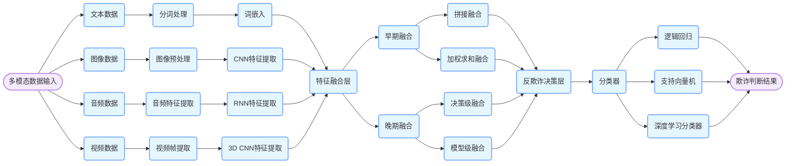

# 金融领域多模态学习在全方位反欺诈中的应用

> 关键词：金融领域、多模态学习、全方位反欺诈、特征融合、深度学习

> 摘要：本文聚焦于金融领域多模态学习在全方位反欺诈中的应用。首先介绍了研究背景、目的、预期读者和文档结构，阐述了相关术语。接着详细讲解了多模态学习的核心概念，包括原理和架构，并给出了相应的文本示意图和Mermaid流程图。通过Python源代码深入剖析了核心算法原理及具体操作步骤，同时给出了相关数学模型和公式并举例说明。结合项目实战，介绍了开发环境搭建、源代码实现及代码解读。探讨了该技术在金融反欺诈中的实际应用场景，推荐了学习资源、开发工具框架和相关论文著作。最后总结了未来发展趋势与挑战，解答了常见问题并提供了扩展阅读和参考资料，旨在为金融反欺诈领域的研究和实践提供全面而深入的指导。

## 1. 背景介绍 
### 1.1 目的和范围
在金融领域，欺诈行为严重威胁着金融机构和客户的利益。传统的反欺诈方法往往只依赖单一类型的数据，如交易记录、信用评分等，难以应对日益复杂多变的欺诈手段。多模态学习通过融合多种类型的数据，如文本、图像、音频、视频等，能够更全面、准确地刻画欺诈行为的特征，从而提高反欺诈的效果。本文的目的在于深入探讨多模态学习在金融全方位反欺诈中的应用，涵盖从核心概念、算法原理到实际应用和未来发展等多个方面，为金融行业的反欺诈实践提供理论支持和技术指导。

### 1.2 预期读者
本文的预期读者包括金融行业的从业者，如风险管理专家、数据分析师、反欺诈专员等，他们可以从中获取多模态学习在反欺诈中的实际应用方法和案例；计算机科学领域的研究人员和开发者，如人工智能、机器学习专家，能够了解多模态学习在金融场景下的具体问题和解决方案；以及对金融科技和反欺诈技术感兴趣的学生和爱好者，帮助他们建立相关领域的知识体系。

### 1.3 文档结构概述
本文将按照以下结构进行阐述：首先介绍相关背景知识，包括目的、读者对象和文档结构；接着深入讲解多模态学习的核心概念和联系，给出原理和架构的示意图和流程图；详细分析核心算法原理和具体操作步骤，并结合Python代码进行说明；介绍相关的数学模型和公式，并举例进行详细讲解；通过项目实战展示代码的实际应用和详细解释；探讨多模态学习在金融反欺诈中的实际应用场景；推荐相关的学习资源、开发工具框架和论文著作；最后总结未来发展趋势与挑战，解答常见问题并提供扩展阅读和参考资料。

### 1.4 术语表
#### 1.4.1 核心术语定义
- **多模态学习**：指综合处理和分析多种不同模态数据（如文本、图像、音频、视频等）的机器学习方法，旨在通过融合不同模态的数据信息，提高模型的性能和泛化能力。
- **全方位反欺诈**：在金融领域，利用多种数据源和技术手段，从多个角度对欺诈行为进行识别、预防和打击，实现对金融业务全流程的欺诈防范。
- **特征融合**：将来自不同模态数据的特征进行整合，以获取更全面、更具代表性的特征表示，用于后续的模型训练和决策。
- **深度学习**：一类基于人工神经网络的机器学习方法，通过构建多层神经网络模型，自动从大量数据中学习复杂的模式和特征。

#### 1.4.2 相关概念解释
- **模态**：表示数据的不同形式或类型，如文本模态的数据可以是交易描述、客户留言等；图像模态的数据可以是身份证照片、签名图像等；音频模态的数据可以是客服通话录音；视频模态的数据可以是客户的身份验证视频等。
- **数据对齐**：在多模态学习中，由于不同模态的数据可能具有不同的时间尺度、空间尺度或语义信息，需要对这些数据进行处理，使得它们在时间或空间上具有对应关系，以便进行有效的特征融合。
- **注意力机制**：一种在深度学习中广泛应用的机制，用于自动分配不同模态数据或特征的重要性权重，使得模型能够更加关注关键信息，提高模型的性能和解释性。

#### 1.4.3 缩略词列表
- **CNN**：Convolutional Neural Network，卷积神经网络，常用于处理图像和序列数据。
- **RNN**：Recurrent Neural Network，循环神经网络，适用于处理序列数据，如文本。
- **LSTM**：Long Short-Term Memory，长短期记忆网络，是一种特殊的RNN，能够有效处理长序列数据中的长期依赖关系。
- **GRU**：Gated Recurrent Unit，门控循环单元，也是一种改进的RNN，具有与LSTM相似的功能，但结构更简单。
- **Transformer**：一种基于注意力机制的深度学习模型架构，在自然语言处理和其他领域取得了显著的成果。

## 2. 核心概念与联系 

### 核心概念原理
多模态学习的核心原理在于利用不同模态数据之间的互补性，通过融合多种模态的信息，获得比单一模态更全面、更准确的特征表示。在金融反欺诈场景中，不同模态的数据可以从不同角度反映客户的行为和特征。例如，交易记录文本可以提供交易的基本信息和描述，客户的面部图像可以用于身份验证，音频通话记录可以反映客户的情绪和意图。通过将这些不同模态的数据进行融合，可以更准确地判断客户是否存在欺诈行为。

### 架构的文本示意图
```plaintext
多模态数据输入层
|-- 文本数据
|   |-- 分词处理
|   |-- 词嵌入
|-- 图像数据
|   |-- 图像预处理
|   |-- 卷积神经网络特征提取
|-- 音频数据
|   |-- 音频特征提取
|   |-- 循环神经网络特征提取
|-- 视频数据
|   |-- 视频帧提取
|   |-- 3D卷积神经网络特征提取

特征融合层
|-- 早期融合
|   |-- 拼接融合
|   |-- 加权求和融合
|-- 晚期融合
|   |-- 决策级融合
|   |-- 模型级融合

反欺诈决策层
|-- 分类器
|   |-- 逻辑回归
|   |-- 支持向量机
|   |-- 深度学习分类器
```

### Mermaid流程图


## 3. 核心算法原理 & 具体操作步骤 

### 特征提取算法
#### 文本特征提取
对于文本数据，常用的特征提取方法是词嵌入。我们可以使用Python的`torchtext`库来实现词嵌入。以下是一个简单的示例代码：
```python
import torch
import torchtext
from torchtext.data.utils import get_tokenizer
from torchtext.vocab import build_vocab_from_iterator

# 定义分词器
tokenizer = get_tokenizer('basic_english')

# 示例文本数据
texts = [
    "This is a normal transaction.",
    "Suspicious activity detected!"
]

# 分词
tokenized_texts = [tokenizer(text) for text in texts]

# 构建词汇表
vocab = build_vocab_from_iterator(tokenized_texts)

# 词嵌入
embedding = torch.nn.Embedding(len(vocab), 100)

# 将文本转换为索引序列
text_indices = [torch.tensor([vocab[token] for token in tokens]) for tokens in tokenized_texts]

# 获取词嵌入向量
embedded_texts = [embedding(indices) for indices in text_indices]

print(embedded_texts)
```
#### 图像特征提取
对于图像数据，我们可以使用预训练的卷积神经网络（如ResNet）来提取特征。以下是使用`torchvision`库的示例代码：
```python
import torch
import torchvision.models as models
import torchvision.transforms as transforms
from PIL import Image

# 加载预训练的ResNet模型
resnet = models.resnet18(pretrained=True)
# 去掉最后一层分类器
feature_extractor = torch.nn.Sequential(*list(resnet.children())[:-1])

# 图像预处理
transform = transforms.Compose([
    transforms.Resize(256),
    transforms.CenterCrop(224),
    transforms.ToTensor(),
    transforms.Normalize(mean=[0.485, 0.456, 0.406], std=[0.229, 0.224, 0.225])
])

# 加载图像
image = Image.open('example.jpg')
# 预处理图像
input_image = transform(image).unsqueeze(0)

# 提取特征
with torch.no_grad():
    features = feature_extractor(input_image)

print(features.shape)
```
#### 音频特征提取
对于音频数据，我们可以使用`librosa`库提取MFCC（Mel频率倒谱系数）特征，然后使用循环神经网络（如LSTM）进行特征处理。以下是示例代码：
```python
import librosa
import torch
import torch.nn as nn

# 加载音频文件
audio_file = 'example.wav'
audio, sr = librosa.load(audio_file)

# 提取MFCC特征
mfccs = librosa.feature.mfcc(y=audio, sr=sr, n_mfcc=13)

# 将MFCC特征转换为PyTorch张量
mfccs_tensor = torch.tensor(mfccs.T, dtype=torch.float32).unsqueeze(0)

# 定义LSTM模型
class LSTMModel(nn.Module):
    def __init__(self, input_size, hidden_size, num_layers):
        super(LSTMModel, self).__init__()
        self.lstm = nn.LSTM(input_size, hidden_size, num_layers, batch_first=True)

    def forward(self, x):
        out, _ = self.lstm(x)
        return out

# 初始化LSTM模型
input_size = 13
hidden_size = 64
num_layers = 2
lstm_model = LSTMModel(input_size, hidden_size, num_layers)

# 提取音频特征
audio_features = lstm_model(mfccs_tensor)

print(audio_features.shape)
```

### 特征融合算法
#### 拼接融合
拼接融合是最简单的特征融合方法，即将不同模态的特征向量按顺序拼接在一起。以下是示例代码：
```python
import torch

# 假设我们有文本特征、图像特征和音频特征
text_features = torch.randn(1, 100)
image_features = torch.randn(1, 512)
audio_features = torch.randn(1, 64)

# 拼接融合
concatenated_features = torch.cat((text_features, image_features, audio_features), dim=1)

print(concatenated_features.shape)
```
#### 加权求和融合
加权求和融合是根据不同模态特征的重要性，为其分配不同的权重，然后进行加权求和。以下是示例代码：
```python
import torch

# 假设我们有文本特征、图像特征和音频特征
text_features = torch.randn(1, 100)
image_features = torch.randn(1, 512)
audio_features = torch.randn(1, 64)

# 定义权重
text_weight = 0.3
image_weight = 0.5
audio_weight = 0.2

# 加权求和融合
weighted_sum_features = text_weight * text_features + image_weight * image_features + audio_weight * audio_features

print(weighted_sum_features.shape)
```

### 反欺诈分类算法
我们可以使用逻辑回归作为简单的反欺诈分类器。以下是示例代码：
```python
import torch
import torch.nn as nn
import torch.optim as optim

# 假设我们有融合后的特征和对应的标签
features = torch.randn(100, 676)
labels = torch.randint(0, 2, (100,))

# 定义逻辑回归模型
class LogisticRegression(nn.Module):
    def __init__(self, input_size):
        super(LogisticRegression, self).__init__()
        self.linear = nn.Linear(input_size, 1)
        self.sigmoid = nn.Sigmoid()

    def forward(self, x):
        out = self.linear(x)
        out = self.sigmoid(out)
        return out

# 初始化模型
input_size = 676
model = LogisticRegression(input_size)

# 定义损失函数和优化器
criterion = nn.BCELoss()
optimizer = optim.SGD(model.parameters(), lr=0.01)

# 训练模型
num_epochs = 100
for epoch in range(num_epochs):
    outputs = model(features)
    loss = criterion(outputs.squeeze(), labels.float())

    optimizer.zero_grad()
    loss.backward()
    optimizer.step()

    if (epoch + 1) % 10 == 0:
        print(f'Epoch [{epoch+1}/{num_epochs}], Loss: {loss.item():.4f}')
```

## 4. 数学模型和公式 & 详细讲解 & 举例说明 

### 词嵌入
词嵌入是将文本中的每个词映射到一个低维向量空间的过程。假设我们有一个词汇表 $V$，其中包含 $|V|$ 个词，词嵌入矩阵 $E \in \mathbb{R}^{|V| \times d}$，其中 $d$ 是嵌入向量的维度。对于一个词 $w_i \in V$，其对应的嵌入向量为 $e_i = E[i, :]$。

例如，假设词汇表 $V = \{ \text{"apple"}, \text{"banana"}, \text{"cherry"} \}$，嵌入维度 $d = 2$，词嵌入矩阵 $E$ 如下：
$$
E = 
\begin{bmatrix}
0.1 & 0.2 \\
0.3 & 0.4 \\
0.5 & 0.6
\end{bmatrix}
$$
那么词 "apple" 的嵌入向量为 $e_1 = [0.1, 0.2]$。

### 卷积神经网络（CNN）
CNN 主要由卷积层、池化层和全连接层组成。卷积层的核心操作是卷积运算，假设输入特征图 $X \in \mathbb{R}^{H \times W \times C}$，其中 $H$ 是高度，$W$ 是宽度，$C$ 是通道数，卷积核 $K \in \mathbb{R}^{h \times w \times C \times F}$，其中 $h$ 和 $w$ 是卷积核的高度和宽度，$F$ 是卷积核的数量。卷积运算的输出特征图 $Y \in \mathbb{R}^{H' \times W' \times F}$ 可以通过以下公式计算：
$$
Y_{i,j,k} = \sum_{m=0}^{h-1} \sum_{n=0}^{w-1} \sum_{c=0}^{C-1} K_{m,n,c,k} \cdot X_{i+m,j+n,c} + b_k
$$
其中 $b_k$ 是偏置项。

例如，假设输入特征图 $X$ 是一个 $3 \times 3 \times 1$ 的矩阵，卷积核 $K$ 是一个 $2 \times 2 \times 1 \times 1$ 的矩阵，如下所示：
$$
X = 
\begin{bmatrix}
1 & 2 & 3 \\
4 & 5 & 6 \\
7 & 8 & 9
\end{bmatrix}
$$
$$
K = 
\begin{bmatrix}
1 & 2 \\
3 & 4
\end{bmatrix}
$$
偏置项 $b = 0$。经过卷积运算后，输出特征图 $Y$ 是一个 $2 \times 2 \times 1$ 的矩阵：
$$
Y = 
\begin{bmatrix}
1 \times 1 + 2 \times 2 + 3 \times 4 + 4 \times 5 & 1 \times 2 + 2 \times 3 + 3 \times 5 + 4 \times 6 \\
1 \times 4 + 2 \times 5 + 3 \times 7 + 4 \times 8 & 1 \times 5 + 2 \times 6 + 3 \times 8 + 4 \times 9
\end{bmatrix}
= 
\begin{bmatrix}
37 & 47 \\
67 & 77
\end{bmatrix}
$$

### 循环神经网络（RNN）
RNN 的核心思想是通过循环结构处理序列数据。假设输入序列 $x_1, x_2, \cdots, x_T$，其中 $x_t \in \mathbb{R}^{d_x}$，隐藏状态 $h_t \in \mathbb{R}^{d_h}$，RNN 的更新公式如下：
$$
h_t = \tanh(W_{hh} h_{t-1} + W_{xh} x_t + b_h)
$$
其中 $W_{hh} \in \mathbb{R}^{d_h \times d_h}$ 是隐藏状态到隐藏状态的权重矩阵，$W_{xh} \in \mathbb{R}^{d_h \times d_x}$ 是输入到隐藏状态的权重矩阵，$b_h \in \mathbb{R}^{d_h}$ 是偏置项。

例如，假设输入维度 $d_x = 2$，隐藏维度 $d_h = 2$，输入序列 $x_1 = [1, 2]$，$x_2 = [3, 4]$，初始隐藏状态 $h_0 = [0, 0]$，权重矩阵和偏置项如下：
$$
W_{hh} = 
\begin{bmatrix}
0.1 & 0.2 \\
0.3 & 0.4
\end{bmatrix}
$$
$$
W_{xh} = 
\begin{bmatrix}
0.5 & 0.6 \\
0.7 & 0.8
\end{bmatrix}
$$
$$
b_h = [0.1, 0.2]
$$
首先计算 $h_1$：
$$
h_1 = \tanh(
\begin{bmatrix}
0.1 & 0.2 \\
0.3 & 0.4
\end{bmatrix}
\begin{bmatrix}
0 \\
0
\end{bmatrix}
+ 
\begin{bmatrix}
0.5 & 0.6 \\
0.7 & 0.8
\end{bmatrix}
\begin{bmatrix}
1 \\
2
\end{bmatrix}
+ 
\begin{bmatrix}
0.1 \\
0.2
\end{bmatrix}
)
= \tanh(
\begin{bmatrix}
1.8 \\
2.5
\end{bmatrix}
)
= 
\begin{bmatrix}
0.9468 \\
0.9913
\end{bmatrix}
$$
然后计算 $h_2$：
$$
h_2 = \tanh(
\begin{bmatrix}
0.1 & 0.2 \\
0.3 & 0.4
\end{bmatrix}
\begin{bmatrix}
0.9468 \\
0.9913
\end{bmatrix}
+ 
\begin{bmatrix}
0.5 & 0.6 \\
0.7 & 0.8
\end{bmatrix}
\begin{bmatrix}
3 \\
4
\end{bmatrix}
+ 
\begin{bmatrix}
0.1 \\
0.2
\end{bmatrix}
)
$$

### 逻辑回归
逻辑回归是一种二分类模型，其输出是一个概率值。假设输入特征向量 $x \in \mathbb{R}^{d}$，权重向量 $w \in \mathbb{R}^{d}$，偏置项 $b \in \mathbb{R}$，逻辑回归的输出概率 $p$ 可以通过以下公式计算：
$$
p = \frac{1}{1 + e^{-(w^T x + b)}}
$$
损失函数通常使用二元交叉熵损失：
$$
L(y, p) = -y \log(p) - (1 - y) \log(1 - p)
$$
其中 $y$ 是真实标签，$p$ 是预测概率。

例如，假设输入特征向量 $x = [1, 2]$，权重向量 $w = [0.1, 0.2]$，偏置项 $b = 0.3$，则预测概率为：
$$
p = \frac{1}{1 + e^{-(0.1 \times 1 + 0.2 \times 2 + 0.3)}}
= \frac{1}{1 + e^{-0.8}}
\approx 0.6899
$$
如果真实标签 $y = 1$，则损失为：
$$
L(1, 0.6899) = -1 \times \log(0.6899) - (1 - 1) \times \log(1 - 0.6899)
\approx 0.371
$$

## 5. 项目实战：代码实际案例和详细解释说明 

### 5.1  开发环境搭建
#### 安装Python
首先需要安装Python，建议使用Python 3.7及以上版本。可以从Python官方网站（https://www.python.org/downloads/）下载并安装。

#### 安装必要的库
使用`pip`命令安装所需的库，包括`torch`、`torchvision`、`torchtext`、`librosa`、`numpy`、`pandas`等。示例命令如下：
```sh
pip install torch torchvision torchtext librosa numpy pandas
```

### 5.2  源代码详细实现和代码解读
以下是一个完整的金融领域多模态学习在全方位反欺诈中的项目实战代码示例：
```python
import torch
import torch.nn as nn
import torch.optim as optim
import torchtext
from torchtext.data.utils import get_tokenizer
from torchtext.vocab import build_vocab_from_iterator
import torchvision.models as models
import torchvision.transforms as transforms
from PIL import Image
import librosa
import numpy as np

# 文本特征提取
def extract_text_features(texts):
    tokenizer = get_tokenizer('basic_english')
    tokenized_texts = [tokenizer(text) for text in texts]
    vocab = build_vocab_from_iterator(tokenized_texts)
    embedding = nn.Embedding(len(vocab), 100)
    text_indices = [torch.tensor([vocab[token] for token in tokens]) for tokens in tokenized_texts]
    embedded_texts = [embedding(indices) for indices in text_indices]
    # 对嵌入向量求均值作为文本特征
    text_features = [torch.mean(embedded_text, dim=0) for embedded_text in embedded_texts]
    text_features = torch.stack(text_features)
    return text_features

# 图像特征提取
def extract_image_features(image_paths):
    resnet = models.resnet18(pretrained=True)
    feature_extractor = nn.Sequential(*list(resnet.children())[:-1])
    transform = transforms.Compose([
        transforms.Resize(256),
        transforms.CenterCrop(224),
        transforms.ToTensor(),
        transforms.Normalize(mean=[0.485, 0.456, 0.406], std=[0.229, 0.224, 0.225])
    ])
    image_features = []
    for image_path in image_paths:
        image = Image.open(image_path)
        input_image = transform(image).unsqueeze(0)
        with torch.no_grad():
            features = feature_extractor(input_image)
        features = features.squeeze().flatten()
        image_features.append(features)
    image_features = torch.stack(image_features)
    return image_features

# 音频特征提取
def extract_audio_features(audio_paths):
    audio_features = []
    for audio_path in audio_paths:
        audio, sr = librosa.load(audio_path)
        mfccs = librosa.feature.mfcc(y=audio, sr=sr, n_mfcc=13)
        mfccs_tensor = torch.tensor(mfccs.T, dtype=torch.float32).unsqueeze(0)
        input_size = 13
        hidden_size = 64
        num_layers = 2
        lstm_model = nn.LSTM(input_size, hidden_size, num_layers, batch_first=True)
        with torch.no_grad():
            features = lstm_model(mfccs_tensor)
        features = features[0].squeeze().flatten()
        audio_features.append(features)
    audio_features = torch.stack(audio_features)
    return audio_features

# 特征融合
def fuse_features(text_features, image_features, audio_features):
    concatenated_features = torch.cat((text_features, image_features, audio_features), dim=1)
    return concatenated_features

# 反欺诈分类模型
class FraudClassifier(nn.Module):
    def __init__(self, input_size):
        super(FraudClassifier, self).__init__()
        self.linear = nn.Linear(input_size, 1)
        self.sigmoid = nn.Sigmoid()

    def forward(self, x):
        out = self.linear(x)
        out = self.sigmoid(out)
        return out

# 主函数
def main():
    # 示例数据
    texts = [
        "This is a normal transaction.",
        "Suspicious activity detected!"
    ]
    image_paths = ['example1.jpg', 'example2.jpg']
    audio_paths = ['example1.wav', 'example2.wav']
    labels = torch.tensor([0, 1], dtype=torch.float32)

    # 提取特征
    text_features = extract_text_features(texts)
    image_features = extract_image_features(image_paths)
    audio_features = extract_audio_features(audio_paths)

    # 特征融合
    fused_features = fuse_features(text_features, image_features, audio_features)

    # 初始化模型
    input_size = fused_features.shape[1]
    model = FraudClassifier(input_size)

    # 定义损失函数和优化器
    criterion = nn.BCELoss()
    optimizer = optim.SGD(model.parameters(), lr=0.01)

    # 训练模型
    num_epochs = 100
    for epoch in range(num_epochs):
        outputs = model(fused_features)
        loss = criterion(outputs.squeeze(), labels)

        optimizer.zero_grad()
        loss.backward()
        optimizer.step()

        if (epoch + 1) % 10 == 0:
            print(f'Epoch [{epoch+1}/{num_epochs}], Loss: {loss.item():.4f}')

if __name__ == "__main__":
    main()
```
### 5.3  代码解读与分析
- **文本特征提取**：`extract_text_features` 函数首先对文本进行分词处理，然后构建词汇表并进行词嵌入，最后对嵌入向量求均值作为文本特征。
- **图像特征提取**：`extract_image_features` 函数使用预训练的ResNet模型提取图像特征，通过图像预处理和卷积操作得到图像的特征向量。
- **音频特征提取**：`extract_audio_features` 函数使用`librosa`库提取音频的MFCC特征，然后使用LSTM模型进行特征处理。
- **特征融合**：`fuse_features` 函数将文本、图像和音频特征进行拼接融合。
- **反欺诈分类模型**：`FraudClassifier` 类定义了一个简单的逻辑回归模型，用于进行欺诈分类。
- **主函数**：`main` 函数整合了上述步骤，包括数据准备、特征提取、特征融合、模型初始化、训练和损失计算。

## 6. 实际应用场景 
### 身份验证
在金融交易中，身份验证是防止欺诈的重要环节。通过多模态学习，可以结合用户的面部图像、指纹图像、语音特征等多种模态的数据进行身份验证。例如，银行在进行线上开户时，要求用户上传身份证照片和进行人脸识别，同时录制一段语音进行声纹识别。通过多模态学习模型对这些数据进行综合分析，可以更准确地判断用户身份的真实性。

### 交易欺诈检测
在交易过程中，多模态学习可以结合交易记录文本、交易金额、交易时间、用户设备信息、用户地理位置等多种模态的数据进行欺诈检测。例如，当一笔交易的金额突然大幅增加，同时交易地点与用户平时的活动范围相差较大，且交易描述中存在可疑词汇时，多模态学习模型可以更准确地判断该交易是否存在欺诈风险。

### 客户风险评估
金融机构在对客户进行风险评估时，可以使用多模态学习方法。除了传统的信用评分数据外，还可以结合客户的社交媒体文本、消费行为数据、社交网络关系等多种模态的数据。例如，通过分析客户在社交媒体上的言论和行为，可以了解客户的情绪状态和消费偏好，从而更全面地评估客户的风险水平。

### 保险欺诈识别
在保险行业，欺诈行为也较为常见。多模态学习可以结合保险理赔申请文本、事故现场照片、医疗记录、证人证言音频等多种模态的数据进行欺诈识别。例如，通过对事故现场照片的分析，可以判断事故的真实性；通过对医疗记录和证人证言音频的分析，可以判断理赔申请是否存在夸大或虚假情况。

## 7. 工具和资源推荐
### 7.1 学习资源推荐
#### 7.1.1 书籍推荐
- 《深度学习》（Deep Learning）：由Ian Goodfellow、Yoshua Bengio和Aaron Courville所著，是深度学习领域的经典教材，涵盖了深度学习的基本概念、算法和应用。
- 《Python深度学习》（Deep Learning with Python）：由Francois Chollet所著，结合Python和Keras框架，介绍了深度学习的实践方法。
- 《多模态机器学习：基础与应用》（Multimodal Machine Learning: Foundations and Applications）：专门介绍多模态学习的理论和方法，适合深入学习多模态学习的读者。

#### 7.1.2 在线课程
- Coursera上的“深度学习专项课程”（Deep Learning Specialization）：由Andrew Ng教授授课，系统介绍了深度学习的各个方面。
- edX上的“人工智能基础”（Fundamentals of Artificial Intelligence）：涵盖了人工智能的基本概念和方法，包括多模态学习的相关内容。
- 哔哩哔哩（Bilibili）上有许多关于深度学习和多模态学习的教学视频，适合初学者快速入门。

#### 7.1.3 技术博客和网站
- Medium：有许多关于深度学习和多模态学习的技术文章和研究成果分享。
- arXiv：提供了大量的学术论文，包括多模态学习在各个领域的最新研究成果。
- 开源中国（OSChina）：有很多开发者分享的技术经验和项目实践，对于多模态学习的实际应用有一定的参考价值。

### 7.2 开发工具框架推荐
#### 7.2.1 IDE和编辑器
- PyCharm：是一款专门为Python开发设计的集成开发环境，具有强大的代码编辑、调试和项目管理功能。
- Jupyter Notebook：是一个交互式的开发环境，适合进行数据分析、模型训练和实验验证。
- Visual Studio Code：是一款轻量级的代码编辑器，支持多种编程语言和插件扩展，对于Python开发也非常方便。

#### 7.2.2 调试和性能分析工具
- PyTorch Profiler：是PyTorch自带的性能分析工具，可以帮助开发者分析模型的训练时间、内存使用情况等。
- TensorBoard：是TensorFlow提供的可视化工具，也可以与PyTorch结合使用，用于可视化模型的训练过程和性能指标。
- cProfile：是Python标准库中的性能分析工具，可以分析Python代码的执行时间和函数调用情况。

#### 7.2.3 相关框架和库
- PyTorch：是一个开源的深度学习框架，具有动态图机制和丰富的深度学习模型库，适合进行多模态学习的研究和开发。
- TensorFlow：是另一个广泛使用的深度学习框架，提供了丰富的工具和资源，支持分布式训练和模型部署。
- scikit-learn：是一个Python机器学习库，提供了许多常用的机器学习算法和工具，可用于多模态学习中的特征处理和模型评估。

### 7.3 相关论文著作推荐
#### 7.3.1 经典论文
- "Attention Is All You Need"：提出了Transformer模型，为自然语言处理和多模态学习带来了重大突破。
- "Multimodal Deep Learning"：介绍了多模态深度学习的基本概念和方法，是多模态学习领域的经典论文之一。
- "Fusing Text, Audio, and Visual Information for Sentiment Analysis Using Deep Neural Networks"：探讨了如何融合文本、音频和视觉信息进行情感分析，为多模态学习在情感分析领域的应用提供了思路。

#### 7.3.2 最新研究成果
- 可以通过arXiv和ACM Digital Library等学术平台搜索多模态学习在金融反欺诈领域的最新研究论文，了解该领域的前沿技术和发展趋势。

#### 7.3.3 应用案例分析
- 一些金融机构和研究机构会发布多模态学习在金融反欺诈中的应用案例，可以通过相关的行业报告和研究论文了解这些案例，学习实际应用中的经验和方法。

## 8. 总结：未来发展趋势与挑战
### 未来发展趋势
- **更复杂的模态融合方法**：未来的多模态学习将探索更复杂、更有效的模态融合方法，以充分发挥不同模态数据之间的互补性。例如，引入注意力机制、图神经网络等技术，实现更细粒度的特征融合和信息交互。
- **跨领域应用拓展**：多模态学习在金融反欺诈领域的成功应用将推动其向其他领域拓展，如医疗、交通、教育等。不同领域的数据具有不同的特点和模态，多模态学习将面临更多的挑战和机遇。
- **与其他技术的融合**：多模态学习将与区块链、物联网、大数据等技术深度融合，构建更加安全、智能的金融生态系统。例如，结合区块链技术可以实现数据的安全共享和可信存储，提高多模态学习模型的可靠性和可解释性。
- **实时性和可解释性提升**：随着金融业务的快速发展，对反欺诈系统的实时性要求越来越高。未来的多模态学习模型将注重提高实时处理能力，同时增强模型的可解释性，以便金融机构更好地理解模型的决策过程和结果。

### 挑战
- **数据质量和标注问题**：多模态数据的质量参差不齐，存在噪声、缺失值等问题，同时数据标注的成本较高且难度较大。如何提高数据质量和标注效率是多模态学习面临的重要挑战之一。
- **计算资源和时间成本**：多模态学习需要处理大量的不同模态数据，模型复杂度较高，对计算资源和时间成本的要求也较高。如何优化模型结构和算法，降低计算资源消耗和训练时间是亟待解决的问题。
- **隐私和安全问题**：金融领域的数据涉及用户的隐私和敏感信息，多模态学习在处理这些数据时需要保证数据的隐私和安全。如何在保护用户隐私的前提下，实现多模态数据的有效利用是一个重要的挑战。
- **模型可解释性和泛化能力**：多模态学习模型通常比较复杂，其决策过程难以解释，同时模型的泛化能力也需要进一步提高。如何提高模型的可解释性和泛化能力，使模型在不同的数据集和场景下都能取得良好的性能是需要研究的问题。

## 9. 附录：常见问题与解答
### 多模态学习中如何选择合适的特征融合方法？
选择合适的特征融合方法需要考虑数据的特点、模型的复杂度和任务的需求。早期融合方法（如拼接融合、加权求和融合）简单直接，适用于数据模态之间相关性较强的情况；晚期融合方法（如决策级融合、模型级融合）可以保留各模态数据的独立性，适用于数据模态之间相关性较弱的情况。此外，还可以根据实验结果选择性能最优的融合方法。

### 多模态学习模型的训练时间较长，如何优化？
可以从以下几个方面优化多模态学习模型的训练时间：
- 选择合适的硬件设备，如GPU或TPU，提高计算速度。
- 优化模型结构，减少模型的参数数量，降低计算复杂度。
- 使用数据增强技术，增加训练数据的多样性，提高模型的泛化能力，同时减少过拟合的风险。
- 采用分布式训练技术，将训练任务分配到多个计算节点上并行进行，提高训练效率。

### 多模态数据中存在缺失值，如何处理？
处理多模态数据中的缺失值可以采用以下方法：
- 删除缺失值：如果缺失值的比例较小，可以直接删除包含缺失值的数据样本。
- 填充缺失值：可以使用均值、中位数、众数等统计量填充缺失值，也可以使用机器学习模型（如线性回归、随机森林）进行预测填充。
- 采用多模态补全方法：专门针对多模态数据设计的补全方法，利用不同模态数据之间的相关性进行缺失值补全。

### 如何评估多模态学习模型在金融反欺诈中的性能？
可以使用以下指标评估多模态学习模型在金融反欺诈中的性能：
- 准确率（Accuracy）：预测正确的样本数占总样本数的比例。
- 精确率（Precision）：预测为欺诈的样本中实际为欺诈的样本数占比。
- 召回率（Recall）：实际为欺诈的样本中被预测为欺诈的样本数占比。
- F1值（F1-score）：精确率和召回率的调和平均值，综合考虑了精确率和召回率。
- ROC曲线和AUC值：ROC曲线（Receiver Operating Characteristic Curve）反映了模型在不同阈值下的真阳性率和假阳性率之间的关系，AUC值（Area Under the Curve）是ROC曲线下的面积，用于衡量模型的整体性能。

## 10. 扩展阅读 & 参考资料
### 扩展阅读
- 《人工智能：现代方法》（Artificial Intelligence: A Modern Approach）：全面介绍了人工智能的基本概念、算法和应用，对于理解多模态学习的背景和相关技术有很大帮助。
- 《数据挖掘：概念与技术》（Data Mining: Concepts and Techniques）：讲解了数据挖掘的基本方法和技术，包括数据预处理、特征提取、模型训练等，对于多模态学习中的数据处理和模型构建有指导作用。
- 《神经网络与深度学习》（Neural Networks and Deep Learning）：由Michael Nielsen所著，通过在线书籍的形式介绍了神经网络和深度学习的基本原理和实践方法，适合初学者深入学习。

### 参考资料
- Goodfellow, I., Bengio, Y., & Courville, A. (2016). Deep Learning. MIT Press.
- Chollet, F. (2017). Deep Learning with Python. Manning Publications.
- Baltrušaitis, T., Ahuja, C., & Morency, L.-P. (2018). Multimodal Machine Learning: A Survey and Taxonomy. IEEE Transactions on Pattern Analysis and Machine Intelligence, 41(2), 423-443.
- Vaswani, A., Shazeer, N., Parmar, N., Uszkoreit, J., Jones, L., Gomez, A. N.,... & Polosukhin, I. (2017). Attention Is All You Need. Advances in Neural Information Processing Systems, 5998-6008.

作者：AI天才研究院/AI Genius Institute & 禅与计算机程序设计艺术 /Zen And The Art of Computer Programming