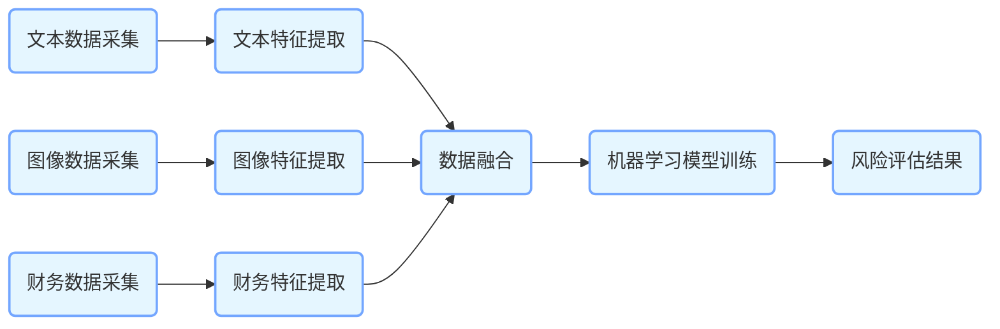

# 金融领域多模态学习在风险评估中的应用

> 关键词：金融领域、多模态学习、风险评估、数据融合、机器学习

> 摘要：本文聚焦于金融领域中多模态学习在风险评估里的应用。首先介绍了相关背景，明确目的、预期读者等内容。接着阐述多模态学习的核心概念及其联系，给出原理和架构示意图与流程图。详细讲解核心算法原理并通过Python代码展示，分析相关数学模型和公式。以实际项目为例，介绍开发环境搭建、源代码实现及解读。探讨了多模态学习在金融风险评估中的实际应用场景，推荐了学习资源、开发工具框架以及相关论文著作。最后总结未来发展趋势与挑战，提供常见问题解答和扩展阅读参考资料，旨在全面剖析多模态学习在金融风险评估中的应用，为相关领域研究和实践提供有价值的参考。

## 1. 背景介绍 
### 1.1 目的和范围
在金融领域，准确的风险评估至关重要，它关乎金融机构的稳定运营和投资者的利益。传统的风险评估方法往往仅依赖单一类型的数据，如财务报表数据或信用评分等，这种方式存在局限性，难以全面、准确地反映金融风险的复杂性。多模态学习作为一种新兴的技术手段，旨在融合多种不同类型的数据，如文本、图像、音频等，以获取更丰富、更全面的信息，从而提升风险评估的准确性和可靠性。

本文的范围涵盖了多模态学习在金融风险评估中的各个方面，包括核心概念、算法原理、数学模型、实际应用案例等。通过对这些内容的深入探讨，我们希望能够为金融从业者、研究人员以及对该领域感兴趣的人士提供一个全面的了解和实践指导。

### 1.2 预期读者
本文的预期读者包括金融领域的从业者，如银行信贷分析师、风险管理人员、投资经理等，他们可以从本文中了解到多模态学习在风险评估中的应用方法和优势，为实际工作提供新的思路和技术手段。同时，计算机科学领域的研究人员和开发者也可以从本文中获取关于多模态学习在金融场景下的具体应用案例和技术细节，为进一步的研究和开发提供参考。此外，对金融科技和人工智能感兴趣的学生和爱好者也可以通过阅读本文，了解该领域的前沿动态和发展趋势。

### 1.3 文档结构概述
本文将按照以下结构进行组织：
- 核心概念与联系：介绍多模态学习和金融风险评估的核心概念，以及它们之间的联系，同时给出原理和架构的文本示意图和Mermaid流程图。
- 核心算法原理 & 具体操作步骤：详细讲解多模态学习的核心算法原理，并通过Python源代码进行具体阐述。
- 数学模型和公式 & 详细讲解 & 举例说明：分析多模态学习在风险评估中的数学模型和公式，并通过具体例子进行说明。
- 项目实战：代码实际案例和详细解释说明：以一个实际的金融风险评估项目为例，介绍开发环境搭建、源代码实现和代码解读。
- 实际应用场景：探讨多模态学习在金融风险评估中的实际应用场景。
- 工具和资源推荐：推荐学习资源、开发工具框架以及相关论文著作。
- 总结：未来发展趋势与挑战：总结多模态学习在金融风险评估中的未来发展趋势和面临的挑战。
- 附录：常见问题与解答：提供常见问题的解答。
- 扩展阅读 & 参考资料：提供扩展阅读的建议和参考资料。

### 1.4 术语表
#### 1.4.1 核心术语定义
- **多模态学习**：指同时处理和分析多种不同类型数据（如文本、图像、音频等）的机器学习方法，旨在通过融合多种模态的数据来获取更全面、更准确的信息。
- **金融风险评估**：对金融活动中可能面临的风险进行识别、度量和评价的过程，目的是为金融决策提供依据。
- **数据融合**：将来自不同数据源、不同类型的数据进行整合和处理，以获得更有价值的信息。
- **特征提取**：从原始数据中提取出能够代表数据特征的信息，以便后续的分析和处理。
- **机器学习模型**：一种基于数据进行学习和预测的数学模型，常见的有神经网络、决策树、支持向量机等。

#### 1.4.2 相关概念解释
- **模态**：指数据的不同表现形式，如文本、图像、音频等。不同模态的数据具有不同的特点和信息。
- **异质性数据**：指来自不同数据源、具有不同结构和格式的数据。在多模态学习中，需要处理和融合这些异质性数据。
- **风险度量**：对金融风险的大小进行量化的过程，常用的风险度量指标有方差、标准差、风险价值（VaR）等。

#### 1.4.3 缩略词列表
- **ML**：机器学习（Machine Learning）
- **DL**：深度学习（Deep Learning）
- **NLP**：自然语言处理（Natural Language Processing）
- **CV**：计算机视觉（Computer Vision）
- **VaR**：风险价值（Value at Risk）

## 2. 核心概念与联系 
### 核心概念原理
多模态学习的核心原理是利用不同模态数据之间的互补性，通过融合多种模态的数据来提高模型的性能和泛化能力。在金融风险评估中，不同模态的数据可以提供不同方面的信息，例如财务报表数据可以反映企业的财务状况，新闻文本数据可以反映企业的市场声誉和舆情信息，图像数据（如企业的生产车间照片）可以反映企业的实际生产情况等。通过将这些不同模态的数据进行融合，可以更全面、准确地评估金融风险。

多模态学习的主要步骤包括数据采集、特征提取、数据融合和模型训练。在数据采集阶段，需要收集不同模态的金融数据，如财务报表、新闻文章、企业图像等。在特征提取阶段，需要从原始数据中提取出能够代表数据特征的信息，例如从文本数据中提取关键词、从图像数据中提取特征向量等。在数据融合阶段，需要将不同模态的特征进行融合，常见的融合方法有早期融合、晚期融合和混合融合等。在模型训练阶段，需要使用融合后的特征来训练机器学习模型，如神经网络、决策树等。

### 架构的文本示意图
以下是一个简单的多模态学习在金融风险评估中的架构示意图：

```plaintext
+----------------+       +----------------+       +----------------+
| 文本数据采集   |       | 图像数据采集   |       | 财务数据采集   |
+----------------+       +----------------+       +----------------+
       |                        |                        |
       v                        v                        v
+----------------+       +----------------+       +----------------+
| 文本特征提取   |       | 图像特征提取   |       | 财务特征提取   |
+----------------+       +----------------+       +----------------+
       |                        |                        |
       v                        v                        v
+-------------------------------------+
|             数据融合                |
+-------------------------------------+
       |
       v
+----------------+
| 机器学习模型训练 |
+----------------+
       |
       v
+----------------+
| 风险评估结果   |
+----------------+
```

### Mermaid 流程图


## 3. 核心算法原理 & 具体操作步骤 
### 核心算法原理
多模态学习中常用的算法包括神经网络、支持向量机、决策树等。这里我们以神经网络为例，介绍多模态学习的核心算法原理。

神经网络是一种模仿人类神经系统的机器学习模型，由多个神经元组成。在多模态学习中，我们可以使用不同的神经网络结构来处理不同模态的数据，然后将处理后的特征进行融合。例如，对于文本数据，我们可以使用循环神经网络（RNN）或长短期记忆网络（LSTM）来处理；对于图像数据，我们可以使用卷积神经网络（CNN）来处理。

假设我们有两种模态的数据：文本数据 $X_{text}$ 和图像数据 $X_{image}$。我们首先使用 RNN 对文本数据进行处理，得到文本特征 $F_{text}$：

```python
import torch
import torch.nn as nn

class TextRNN(nn.Module):
    def __init__(self, input_size, hidden_size, num_layers):
        super(TextRNN, self).__init__()
        self.rnn = nn.RNN(input_size, hidden_size, num_layers, batch_first=True)

    def forward(self, x):
        out, _ = self.rnn(x)
        return out[:, -1, :]

# 示例参数
input_size = 100
hidden_size = 200
num_layers = 2
text_rnn = TextRNN(input_size, hidden_size, num_layers)

# 模拟文本数据
batch_size = 32
seq_length = 20
x_text = torch.randn(batch_size, seq_length, input_size)
f_text = text_rnn(x_text)
```

然后使用 CNN 对图像数据进行处理，得到图像特征 $F_{image}$：

```python
class ImageCNN(nn.Module):
    def __init__(self, in_channels, out_channels):
        super(ImageCNN, self).__init__()
        self.conv1 = nn.Conv2d(in_channels, out_channels, kernel_size=3, padding=1)
        self.pool = nn.MaxPool2d(2, 2)
        self.fc = nn.Linear(out_channels * 16 * 16, 200)

    def forward(self, x):
        x = self.pool(torch.relu(self.conv1(x)))
        x = x.view(-1, self.fc.in_features)
        x = self.fc(x)
        return x

# 示例参数
in_channels = 3
out_channels = 16
image_cnn = ImageCNN(in_channels, out_channels)

# 模拟图像数据
batch_size = 32
x_image = torch.randn(batch_size, in_channels, 32, 32)
f_image = image_cnn(x_image)
```

最后，将文本特征和图像特征进行融合，得到融合后的特征 $F_{fusion}$：

```python
# 简单的拼接融合
f_fusion = torch.cat((f_text, f_image), dim=1)
```

### 具体操作步骤
1. **数据预处理**：对采集到的不同模态的数据进行预处理，如文本数据的分词、图像数据的归一化等。
2. **特征提取**：使用合适的特征提取方法从不同模态的数据中提取特征，如上述的 RNN 和 CNN 方法。
3. **数据融合**：将不同模态的特征进行融合，可以使用拼接、加权求和等方法。
4. **模型训练**：使用融合后的特征来训练机器学习模型，如神经网络、决策树等。
5. **模型评估**：使用测试数据对训练好的模型进行评估，计算模型的准确率、召回率等指标。
6. **风险评估**：使用训练好的模型对新的金融数据进行风险评估，输出风险评估结果。

## 4. 数学模型和公式 & 详细讲解 & 举例说明 
### 数学模型和公式
在多模态学习中，我们可以使用线性组合的方法来进行数据融合。假设我们有 $n$ 种模态的数据，第 $i$ 种模态的数据的特征向量为 $F_i$，对应的权重为 $w_i$，则融合后的特征向量 $F_{fusion}$ 可以表示为：

$$F_{fusion} = \sum_{i=1}^{n} w_i F_i$$

其中，$\sum_{i=1}^{n} w_i = 1$，$w_i \geq 0$。

在机器学习模型训练中，我们通常使用损失函数来衡量模型的预测结果与真实结果之间的差异。常见的损失函数有均方误差（MSE）、交叉熵损失等。以均方误差为例，假设模型的预测结果为 $\hat{y}$，真实结果为 $y$，则均方误差损失函数可以表示为：

$$L = \frac{1}{m} \sum_{j=1}^{m} (\hat{y}_j - y_j)^2$$

其中，$m$ 是样本数量。

### 详细讲解
- **数据融合公式**：线性组合的方法是一种简单而有效的数据融合方法，通过给不同模态的特征向量分配不同的权重，可以根据不同模态数据的重要性来进行融合。权重的选择可以通过经验、交叉验证等方法来确定。
- **损失函数**：均方误差损失函数是一种常用的回归损失函数，它衡量了模型预测结果与真实结果之间的平均平方误差。在训练过程中，我们的目标是最小化损失函数，即让模型的预测结果尽可能接近真实结果。

### 举例说明
假设我们有两种模态的数据：文本数据和图像数据，文本特征向量 $F_{text} = [1, 2, 3]$，图像特征向量 $F_{image} = [4, 5, 6]$，权重 $w_{text} = 0.4$，$w_{image} = 0.6$，则融合后的特征向量为：

$$F_{fusion} = 0.4 \times [1, 2, 3] + 0.6 \times [4, 5, 6] = [0.4 + 2.4, 0.8 + 3, 1.2 + 3.6] = [2.8, 3.8, 4.8]$$

假设我们有一个简单的线性回归模型 $\hat{y} = w_0 + w_1 x_1 + w_2 x_2 + w_3 x_3$，其中 $x_1, x_2, x_3$ 是融合后的特征向量的三个元素，真实结果 $y = [5, 6, 7]$，模型的预测结果 $\hat{y} = [4, 5.5, 6.5]$，则均方误差损失为：

$$L = \frac{1}{3} \times [(4 - 5)^2 + (5.5 - 6)^2 + (6.5 - 7)^2] = \frac{1}{3} \times [1 + 0.25 + 0.25] = \frac{1.5}{3} = 0.5$$

## 5. 项目实战：代码实际案例和详细解释说明 
### 5.1  开发环境搭建
- **操作系统**：建议使用 Linux 或 macOS 系统，因为这些系统对机器学习和深度学习的支持更好。
- **编程语言**：使用 Python 作为开发语言，Python 具有丰富的机器学习和深度学习库。
- **深度学习框架**：使用 PyTorch 作为深度学习框架，PyTorch 具有简洁易用、灵活性高的特点。
- **依赖库**：安装必要的依赖库，如 numpy、pandas、matplotlib 等。

可以使用以下命令来安装 PyTorch 和其他依赖库：

```bash
pip install torch torchvision numpy pandas matplotlib
```

### 5.2  源代码详细实现和代码解读
以下是一个简单的多模态学习在金融风险评估中的代码示例：

```python
import torch
import torch.nn as nn
import torch.optim as optim
import numpy as np

# 模拟数据
# 文本数据
text_data = np.random.randn(100, 20, 100)  # 100 个样本，每个样本长度为 20，特征维度为 100
text_data = torch.tensor(text_data, dtype=torch.float32)

# 图像数据
image_data = np.random.randn(100, 3, 32, 32)  # 100 个样本，3 个通道，图像大小为 32x32
image_data = torch.tensor(image_data, dtype=torch.float32)

# 标签数据
labels = np.random.randint(0, 2, 100)  # 100 个样本的标签，0 或 1
labels = torch.tensor(labels, dtype=torch.long)

# 文本特征提取模型
class TextRNN(nn.Module):
    def __init__(self, input_size, hidden_size, num_layers):
        super(TextRNN, self).__init__()
        self.rnn = nn.RNN(input_size, hidden_size, num_layers, batch_first=True)

    def forward(self, x):
        out, _ = self.rnn(x)
        return out[:, -1, :]

# 图像特征提取模型
class ImageCNN(nn.Module):
    def __init__(self, in_channels, out_channels):
        super(ImageCNN, self).__init__()
        self.conv1 = nn.Conv2d(in_channels, out_channels, kernel_size=3, padding=1)
        self.pool = nn.MaxPool2d(2, 2)
        self.fc = nn.Linear(out_channels * 16 * 16, 200)

    def forward(self, x):
        x = self.pool(torch.relu(self.conv1(x)))
        x = x.view(-1, self.fc.in_features)
        x = self.fc(x)
        return x

# 多模态融合模型
class MultiModalModel(nn.Module):
    def __init__(self, input_size, hidden_size, num_classes):
        super(MultiModalModel, self).__init__()
        self.fc1 = nn.Linear(input_size, hidden_size)
        self.relu = nn.ReLU()
        self.fc2 = nn.Linear(hidden_size, num_classes)

    def forward(self, x):
        x = self.relu(self.fc1(x))
        x = self.fc2(x)
        return x

# 初始化模型
text_rnn = TextRNN(input_size=100, hidden_size=200, num_layers=2)
image_cnn = ImageCNN(in_channels=3, out_channels=16)
multi_modal_model = MultiModalModel(input_size=400, hidden_size=300, num_classes=2)

# 定义损失函数和优化器
criterion = nn.CrossEntropyLoss()
optimizer = optim.Adam(list(text_rnn.parameters()) + list(image_cnn.parameters()) + list(multi_modal_model.parameters()), lr=0.001)

# 训练模型
num_epochs = 10
for epoch in range(num_epochs):
    # 提取文本特征
    text_features = text_rnn(text_data)

    # 提取图像特征
    image_features = image_cnn(image_data)

    # 数据融合
    fused_features = torch.cat((text_features, image_features), dim=1)

    # 前向传播
    outputs = multi_modal_model(fused_features)
    loss = criterion(outputs, labels)

    # 反向传播和优化
    optimizer.zero_grad()
    loss.backward()
    optimizer.step()

    print(f'Epoch [{epoch+1}/{num_epochs}], Loss: {loss.item():.4f}')
```

### 5.3  代码解读与分析
- **数据模拟**：使用 `numpy` 生成模拟的文本数据、图像数据和标签数据，并将其转换为 `torch.Tensor` 类型。
- **特征提取模型**：定义了 `TextRNN` 和 `ImageCNN` 两个模型，分别用于提取文本特征和图像特征。
- **多模态融合模型**：定义了 `MultiModalModel` 模型，用于将融合后的特征进行分类。
- **损失函数和优化器**：使用交叉熵损失函数和 Adam 优化器来训练模型。
- **训练过程**：在每个 epoch 中，先提取文本特征和图像特征，然后将它们进行融合，接着使用融合后的特征进行前向传播，计算损失，最后进行反向传播和优化。

通过这个代码示例，我们可以看到多模态学习在金融风险评估中的基本实现流程。

## 6. 实际应用场景 
### 信贷风险评估
在信贷业务中，金融机构需要评估借款人的信用风险。传统的信贷风险评估主要依赖于借款人的财务报表、信用记录等数据。引入多模态学习后，可以融合更多类型的数据，如借款人的社交媒体文本信息、企业的生产车间图像等。社交媒体文本信息可以反映借款人的社交行为、消费习惯等，企业的生产车间图像可以反映企业的实际生产状况和设备情况。通过融合这些多模态数据，可以更全面、准确地评估借款人的信用风险，降低信贷违约的概率。

### 市场风险评估
市场风险是指由于市场因素（如利率、汇率、股票价格等）的波动而导致金融资产价值损失的风险。在市场风险评估中，多模态学习可以融合新闻文本数据、宏观经济数据、股票价格图像等多种数据。新闻文本数据可以反映市场的舆情信息和政策变化，宏观经济数据可以反映宏观经济环境的变化，股票价格图像可以直观地展示股票价格的走势。通过融合这些多模态数据，可以更准确地预测市场风险的变化趋势，为投资者提供更有效的风险管理建议。

### 投资组合风险评估
投资组合风险评估是指对投资组合中各种资产的风险进行综合评估。在投资组合风险评估中，多模态学习可以融合资产的财务报表数据、行业研究报告文本数据、资产价格时间序列数据等多种数据。财务报表数据可以反映资产的财务状况，行业研究报告文本数据可以反映行业的发展趋势和竞争格局，资产价格时间序列数据可以反映资产价格的历史波动情况。通过融合这些多模态数据，可以更准确地评估投资组合的风险水平，优化投资组合的配置。

## 7. 工具和资源推荐
### 7.1 学习资源推荐
#### 7.1.1 书籍推荐
- 《深度学习》（Deep Learning）：由 Ian Goodfellow、Yoshua Bengio 和 Aaron Courville 所著，是深度学习领域的经典教材，涵盖了深度学习的基本原理、算法和应用。
- 《Python 机器学习》（Python Machine Learning）：由 Sebastian Raschka 所著，介绍了使用 Python 进行机器学习的基本方法和技术，包括数据预处理、模型选择、深度学习等内容。
- 《自然语言处理入门》（Natural Language Processing in Action）：由 Hobson Lane、Cole Howard 和 Hannes Hapke 所著，介绍了自然语言处理的基本概念、算法和应用，包括文本分类、情感分析、命名实体识别等内容。

#### 7.1.2 在线课程
- Coursera 上的“深度学习专项课程”（Deep Learning Specialization）：由 Andrew Ng 教授授课，涵盖了深度学习的基础知识、卷积神经网络、循环神经网络等内容。
- edX 上的“人工智能基础”（Introduction to Artificial Intelligence）：由 MIT 教授授课，介绍了人工智能的基本概念、算法和应用，包括搜索算法、机器学习、自然语言处理等内容。
- Kaggle 上的“微课程”（Kaggle Learn）：提供了一系列的机器学习和深度学习微课程，包括数据处理、模型训练、竞赛实践等内容。

#### 7.1.3 技术博客和网站
- Medium 上的“Towards Data Science”：是一个专注于数据科学和机器学习的技术博客，提供了大量的技术文章和案例分析。
- 机器之心：是一个专注于人工智能和机器学习的中文技术网站，提供了最新的技术动态、研究成果和应用案例。
- 深度学习论坛（Deep Learning Forum）：是一个专门讨论深度学习技术的论坛，用户可以在上面交流经验、分享代码和讨论问题。

### 7.2 开发工具框架推荐
#### 7.2.1 IDE和编辑器
- PyCharm：是一款专门为 Python 开发设计的集成开发环境（IDE），具有代码编辑、调试、版本控制等功能。
- Jupyter Notebook：是一个基于 Web 的交互式开发环境，支持 Python、R 等多种编程语言，适合进行数据探索、模型训练和结果展示。
- Visual Studio Code：是一款轻量级的代码编辑器，支持多种编程语言和插件扩展，具有丰富的功能和良好的用户体验。

#### 7.2.2 调试和性能分析工具
- PyTorch Profiler：是 PyTorch 提供的性能分析工具，可以帮助用户分析模型的运行时间、内存使用情况等。
- TensorBoard：是 TensorFlow 提供的可视化工具，也可以用于 PyTorch 模型的可视化，支持展示模型的训练过程、损失曲线、模型结构等信息。
- cProfile：是 Python 内置的性能分析工具，可以帮助用户分析 Python 代码的运行时间和函数调用情况。

#### 7.2.3 相关框架和库
- PyTorch：是一个开源的深度学习框架，具有简洁易用、灵活性高的特点，支持 CPU 和 GPU 计算。
- TensorFlow：是一个广泛使用的深度学习框架，具有强大的分布式计算能力和丰富的工具库。
- scikit-learn：是一个用于机器学习的 Python 库，提供了多种机器学习算法和工具，如分类、回归、聚类等。
- NLTK：是一个用于自然语言处理的 Python 库，提供了多种自然语言处理工具和数据集，如分词、词性标注、命名实体识别等。

### 7.3 相关论文著作推荐
#### 7.3.1 经典论文
- “Attention Is All You Need”：提出了 Transformer 模型，是自然语言处理领域的重要突破。
- “ImageNet Classification with Deep Convolutional Neural Networks”：介绍了 AlexNet 模型，开启了深度学习在计算机视觉领域的热潮。
- “Long Short-Term Memory”：提出了长短期记忆网络（LSTM），解决了循环神经网络中的梯度消失问题。

#### 7.3.2 最新研究成果
- 关注 arXiv 上的最新论文，特别是计算机科学、统计学、金融学等领域的论文，了解多模态学习在金融风险评估中的最新研究进展。
- 参加国际机器学习会议（ICML）、神经信息处理系统大会（NeurIPS）、国际计算机视觉与模式识别会议（CVPR）等学术会议，获取最新的研究成果和技术动态。

#### 7.3.3 应用案例分析
- 阅读金融机构的研究报告和案例分析，了解多模态学习在实际金融业务中的应用情况和效果。
- 关注 Kaggle 上的金融竞赛，学习其他参赛者的解决方案和技术思路。

## 8. 总结：未来发展趋势与挑战
### 未来发展趋势
- **多模态数据的丰富性和多样性**：随着信息技术的不断发展，金融领域的多模态数据将越来越丰富和多样，除了现有的文本、图像、音频数据外，还可能出现视频、传感器数据等。如何有效地处理和融合这些多模态数据将是未来的一个重要研究方向。
- **模型的可解释性和可解释性**：在金融领域，模型的可解释性非常重要。未来的多模态学习模型需要不仅具有高准确性，还需要具有良好的可解释性，以便金融从业者能够理解模型的决策过程和依据。
- **与其他技术的融合**：多模态学习可能会与区块链、物联网等技术进行融合，为金融风险评估带来更多的创新和应用场景。例如，区块链技术可以保证数据的安全性和不可篡改，物联网技术可以提供更多的实时数据。

### 挑战
- **数据质量和标注问题**：多模态数据的质量和标注是一个挑战。不同模态的数据可能存在噪声、缺失值等问题，而且标注多模态数据需要更多的人力和时间成本。如何提高数据质量和标注效率是一个需要解决的问题。
- **计算资源和时间成本**：多模态学习通常需要处理大量的数据和复杂的模型，这对计算资源和时间成本提出了很高的要求。如何优化模型结构和算法，提高计算效率，是一个需要解决的问题。
- **隐私和安全问题**：金融数据涉及到用户的隐私和安全，如何在多模态学习中保护用户的隐私和数据安全是一个重要的挑战。需要采用合适的加密技术和隐私保护机制来确保数据的安全性。

## 9. 附录：常见问题与解答
### 多模态学习在金融风险评估中的优势是什么？
多模态学习可以融合多种不同类型的数据，获取更丰富、更全面的信息，从而提高风险评估的准确性和可靠性。与传统的单一模态数据方法相比，多模态学习能够考虑到更多的因素和信息，减少信息的遗漏和偏差。

### 如何选择合适的多模态融合方法？
选择合适的多模态融合方法需要考虑数据的特点、模型的需求和应用场景等因素。常见的融合方法有早期融合、晚期融合和混合融合等。早期融合是在特征提取之前将不同模态的数据进行融合，晚期融合是在特征提取之后将不同模态的特征进行融合，混合融合则是结合了早期融合和晚期融合的优点。可以通过实验和比较不同的融合方法，选择最适合的方法。

### 多模态学习模型的训练时间通常比较长，如何提高训练效率？
可以采用以下方法来提高多模态学习模型的训练效率：
- **优化模型结构**：选择合适的模型结构，减少模型的参数数量和复杂度。
- **使用 GPU 加速**：利用 GPU 的并行计算能力，加速模型的训练过程。
- **数据并行和模型并行**：采用数据并行和模型并行的方法，将数据和模型分布到多个 GPU 或服务器上进行训练。
- **使用预训练模型**：利用预训练模型的知识，减少模型的训练时间。

### 多模态学习在金融风险评估中的应用是否受到数据隐私和安全的限制？
是的，多模态学习在金融风险评估中的应用受到数据隐私和安全的限制。金融数据涉及到用户的隐私和敏感信息，需要采取合适的加密技术和隐私保护机制来确保数据的安全性。例如，可以采用同态加密、差分隐私等技术来保护数据的隐私。同时，需要遵守相关的法律法规和监管要求，确保数据的合法使用。

## 10. 扩展阅读 & 参考资料
### 扩展阅读
- 《金融科技前沿：技术驱动的金融创新》：介绍了金融科技的前沿技术和应用，包括人工智能、区块链、大数据等在金融领域的应用。
- 《人工智能时代的金融风险管理》：探讨了人工智能技术在金融风险管理中的应用和挑战，以及如何构建智能化的金融风险管理体系。
- 《多模态机器学习：基础与应用》：系统介绍了多模态机器学习的基本概念、算法和应用，适合深入学习多模态学习的读者。

### 参考资料
- Goodfellow, I., Bengio, Y., & Courville, A. (2016). Deep Learning. MIT Press.
- Raschka, S. (2015). Python Machine Learning. Packt Publishing.
- Lane, H., Howard, C., & Hapke, H. (2019). Natural Language Processing in Action. Manning Publications.

作者：AI天才研究院/AI Genius Institute & 禅与计算机程序设计艺术 /Zen And The Art of Computer Programming