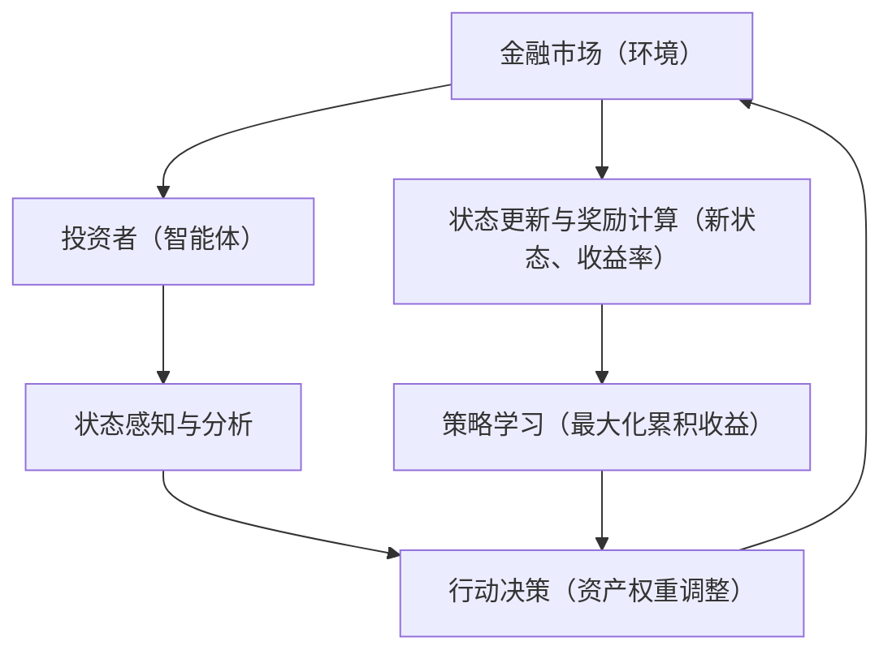

# 金融领域强化学习在多周期投资组合优化中的应用

> 关键词：金融领域、强化学习、多周期投资组合优化、马尔可夫决策过程、深度强化学习算法

> 摘要：本文聚焦于金融领域中强化学习在多周期投资组合优化的应用。首先介绍了相关背景，包括目的范围、预期读者等内容。详细阐述了核心概念，如强化学习、投资组合优化等及其联系，并给出相应的原理和架构示意图与流程图。深入讲解了核心算法原理，用Python代码进行说明，同时给出了相关数学模型和公式并举例。通过项目实战展示了开发环境搭建、代码实现与解读。探讨了实际应用场景，推荐了学习资源、开发工具框架和相关论文著作。最后总结了未来发展趋势与挑战，并提供常见问题解答和扩展阅读参考资料，旨在为金融从业者和研究人员在多周期投资组合优化方面提供全面的技术指导和研究思路。

## 1. 背景介绍 
### 1.1 目的和范围
在金融市场中，投资者面临着如何在多个投资周期内合理分配资金以实现收益最大化并控制风险的挑战。多周期投资组合优化旨在找到一系列的投资决策，使得在不同的市场环境下，投资组合在多个时间段内达到最优的风险 - 收益平衡。本文章的目的是深入探讨强化学习在多周期投资组合优化中的应用，包括核心概念、算法原理、实际操作步骤等方面，帮助投资者和研究人员更好地理解和运用这一技术。范围涵盖了强化学习的基本理论、常见的算法，以及如何将其应用于金融市场的多周期投资组合优化问题中。

### 1.2 预期读者
本文预期读者包括金融从业者，如投资经理、交易员等，他们希望通过新技术来提升投资组合的管理效率和收益。同时，也面向计算机科学和人工智能领域的研究人员和开发者，他们对金融领域的应用感兴趣，想要了解强化学习在金融市场中的具体应用场景。此外，高校金融、计算机等相关专业的学生也可以从本文中获取相关知识，作为学习和研究的参考。

### 1.3 文档结构概述
本文将按照以下结构进行阐述：首先介绍核心概念，包括强化学习和多周期投资组合优化的基本原理以及它们之间的联系；接着详细讲解核心算法原理，并给出具体的Python代码实现；然后介绍相关的数学模型和公式，并举例说明；通过项目实战展示如何将强化学习应用于多周期投资组合优化，包括开发环境搭建、源代码实现和代码解读；探讨实际应用场景；推荐相关的学习资源、开发工具框架和论文著作；最后总结未来发展趋势与挑战，提供常见问题解答和扩展阅读参考资料。

### 1.4 术语表
#### 1.4.1 核心术语定义
- **强化学习（Reinforcement Learning）**：一种机器学习范式，智能体通过与环境进行交互，根据环境反馈的奖励信号来学习最优的行为策略，以最大化长期累积奖励。
- **多周期投资组合优化（Multi - Period Portfolio Optimization）**：在多个投资周期内，通过合理分配资金到不同的资产上，以实现投资组合的风险 - 收益最优平衡的过程。
- **智能体（Agent）**：在强化学习中，能够感知环境状态并采取行动的实体。
- **环境（Environment）**：智能体所处的外部世界，智能体的行动会影响环境状态，并从环境中获得奖励反馈。
- **状态（State）**：环境在某一时刻的特征描述，智能体根据状态来决定采取的行动。
- **行动（Action）**：智能体在某一状态下采取的决策，行动会改变环境状态。
- **奖励（Reward）**：环境根据智能体的行动给予的反馈信号，用于指导智能体学习最优策略。
- **策略（Policy）**：智能体根据状态选择行动的规则，通常表示为一个函数。

#### 1.4.2 相关概念解释
- **马尔可夫决策过程（Markov Decision Process, MDP）**：是强化学习的数学基础，它描述了一个动态系统，其中系统的未来状态只依赖于当前状态和当前采取的行动，而与过去的状态和行动无关。MDP由状态集合、行动集合、状态转移概率、奖励函数和折扣因子组成。
- **深度强化学习（Deep Reinforcement Learning）**：将深度学习与强化学习相结合的方法，通过使用深度神经网络来近似价值函数或策略函数，从而能够处理高维的状态和行动空间。

#### 1.4.3 缩略词列表
- **MDP**：Markov Decision Process（马尔可夫决策过程）
- **DQN**：Deep Q - Network（深度Q网络）
- **A2C**：Advantage Actor - Critic（优势演员 - 评论家算法）
- **PPO**：Proximal Policy Optimization（近端策略优化算法）

## 2. 核心概念与联系 
### 2.1 强化学习基本原理
强化学习的核心思想是智能体通过与环境进行交互，不断尝试不同的行动，并根据环境给予的奖励信号来学习最优的行为策略。智能体在每个时间步 $t$ 感知环境的状态 $s_t$，并根据当前策略 $\pi$ 选择一个行动 $a_t$。环境根据智能体的行动更新状态为 $s_{t + 1}$，并给予智能体一个奖励 $r_t$。智能体的目标是最大化长期累积奖励，通常使用折扣累积奖励来衡量：

$$G_t=\sum_{k = 0}^{\infty}\gamma^{k}r_{t + k}$$

其中，$\gamma\in[0, 1]$ 是折扣因子，用于权衡近期奖励和远期奖励的重要性。

### 2.2 多周期投资组合优化原理
多周期投资组合优化的目标是在多个投资周期内，通过合理分配资金到不同的资产上，使得投资组合的收益最大化，同时控制风险。在每个投资周期 $t$，投资者需要根据当前的市场状态和投资组合的情况，决定如何调整资产的权重。投资组合的收益和风险通常用预期收益率和方差来衡量。

### 2.3 强化学习与多周期投资组合优化的联系
将强化学习应用于多周期投资组合优化问题时，我们可以将投资者看作智能体，金融市场看作环境。智能体在每个投资周期根据市场状态（如资产价格、收益率等）选择资产的权重（行动），环境根据智能体的行动更新市场状态，并给予智能体一个奖励（如投资组合的收益率）。智能体的目标是通过学习最优的策略，在多个投资周期内最大化投资组合的累积收益。

### 2.4 核心概念原理和架构的文本示意图
```plaintext
+----------------+          +----------------+
|    金融市场    |          |    投资者      |
| （环境）        |          | （智能体）      |
+----------------+          +----------------+
         ^                           |
         |                           |
         |  市场状态（价格、收益等） |
         |                           |
         |                           v
+----------------+          +----------------+
|  状态感知与分析 |          |  行动决策      |
|                |          | （资产权重调整）|
+----------------+          +----------------+
         ^                           |
         |                           |
         |  行动（资产权重）         |
         |                           |
         |                           v
+----------------+          +----------------+
|  状态更新与奖励  |          |  策略学习      |
|  计算（新状态、  |          | （最大化累积  |
|  收益率）        |          |  收益）        |
+----------------+          +----------------+
```

### 2.5 Mermaid 流程图


## 3. 核心算法原理 & 具体操作步骤 
### 3.1 深度Q网络（DQN）算法原理
深度Q网络（DQN）是一种基于价值的深度强化学习算法，它使用深度神经网络来近似Q值函数 $Q(s, a)$，表示在状态 $s$ 下采取行动 $a$ 的预期累积奖励。DQN的目标是学习一个最优的Q值函数 $Q^*(s, a)$，使得智能体能够根据 $Q^*(s, a)$ 选择最优的行动。

DQN的训练过程基于贝尔曼方程：

$$Q^*(s, a)=r+\gamma\max_{a'}Q^*(s', a')$$

其中，$r$ 是当前奖励，$s'$ 是下一个状态，$\gamma$ 是折扣因子。

### 3.2 DQN算法的具体操作步骤
1. **初始化**：初始化Q网络 $Q(s, a; \theta)$ 和目标Q网络 $Q(s, a; \theta^-)$，其中 $\theta$ 和 $\theta^-$ 是网络的参数。初始化经验回放缓冲区 $D$。
2. **循环训练**：
    - 在每个时间步 $t$：
        - 观察当前状态 $s_t$。
        - 根据 $\epsilon$ - 贪心策略选择行动 $a_t$：以概率 $\epsilon$ 随机选择行动，以概率 $1 - \epsilon$ 选择使得 $Q(s_t, a; \theta)$ 最大的行动。
        - 执行行动 $a_t$，观察下一个状态 $s_{t + 1}$ 和奖励 $r_t$。
        - 将 $(s_t, a_t, r_t, s_{t + 1})$ 存储到经验回放缓冲区 $D$ 中。
        - 从经验回放缓冲区 $D$ 中随机采样一个小批量的样本 $(s_i, a_i, r_i, s_{i + 1})$。
        - 计算目标Q值：
            - 如果 $s_{i + 1}$ 是终止状态，则 $y_i = r_i$。
            - 否则，$y_i = r_i+\gamma\max_{a'}Q(s_{i + 1}, a'; \theta^-)$。
        - 计算损失函数：
            - $L(\theta)=\frac{1}{N}\sum_{i = 1}^{N}(y_i - Q(s_i, a_i; \theta))^2$，其中 $N$ 是小批量的大小。
        - 使用梯度下降法更新Q网络的参数 $\theta$。
        - 每隔一定的时间步，将目标Q网络的参数 $\theta^-$ 更新为 $\theta$。

### 3.3 Python代码实现
```python
import numpy as np
import torch
import torch.nn as nn
import torch.optim as optim
import random

# 定义Q网络
class QNetwork(nn.Module):
    def __init__(self, state_size, action_size):
        super(QNetwork, self).__init__()
        self.fc1 = nn.Linear(state_size, 64)
        self.fc2 = nn.Linear(64, 64)
        self.fc3 = nn.Linear(64, action_size)

    def forward(self, x):
        x = torch.relu(self.fc1(x))
        x = torch.relu(self.fc2(x))
        return self.fc3(x)

# 定义DQN智能体
class DQNAgent:
    def __init__(self, state_size, action_size):
        self.state_size = state_size
        self.action_size = action_size
        self.memory = []
        self.gamma = 0.95  # 折扣因子
        self.epsilon = 1.0  # 探索率
        self.epsilon_min = 0.01
        self.epsilon_decay = 0.995
        self.learning_rate = 0.001
        self.model = QNetwork(state_size, action_size)
        self.target_model = QNetwork(state_size, action_size)
        self.optimizer = optim.Adam(self.model.parameters(), lr=self.learning_rate)
        self.criterion = nn.MSELoss()

    def remember(self, state, action, reward, next_state, done):
        self.memory.append((state, action, reward, next_state, done))

    def act(self, state):
        if np.random.rand() <= self.epsilon:
            return random.randrange(self.action_size)
        state = torch.FloatTensor(state).unsqueeze(0)
        act_values = self.model(state)
        action = np.argmax(act_values.detach().numpy())
        return action

    def replay(self, batch_size):
        minibatch = random.sample(self.memory, batch_size)
        for state, action, reward, next_state, done in minibatch:
            state = torch.FloatTensor(state).unsqueeze(0)
            next_state = torch.FloatTensor(next_state).unsqueeze(0)
            target = reward
            if not done:
                target = (reward + self.gamma * torch.max(self.target_model(next_state)).item())
            target_f = self.model(state)
            target_f[0][action] = target
            self.optimizer.zero_grad()
            loss = self.criterion(self.model(state), target_f)
            loss.backward()
            self.optimizer.step()
        if self.epsilon > self.epsilon_min:
            self.epsilon *= self.epsilon_decay

    def update_target_model(self):
        self.target_model.load_state_dict(self.model.state_dict())
```

## 4. 数学模型和公式 & 详细讲解 & 举例说明 
### 4.1 马尔可夫决策过程（MDP）模型
马尔可夫决策过程可以用一个五元组 $(S, A, P, R, \gamma)$ 来表示：
- $S$：状态集合，表示环境的所有可能状态。
- $A$：行动集合，表示智能体可以采取的所有行动。
- $P(s'|s, a)$：状态转移概率，表示在状态 $s$ 下采取行动 $a$ 后转移到状态 $s'$ 的概率。
- $R(s, a, s')$：奖励函数，表示在状态 $s$ 下采取行动 $a$ 并转移到状态 $s'$ 时获得的奖励。
- $\gamma$：折扣因子，用于权衡近期奖励和远期奖励的重要性。

### 4.2 价值函数和策略评估
- **状态价值函数 $V^{\pi}(s)$**：表示在策略 $\pi$ 下，从状态 $s$ 开始的预期累积奖励：

$$V^{\pi}(s)=\mathbb{E}_{\pi}\left[\sum_{k = 0}^{\infty}\gamma^{k}r_{t + k}|s_t = s\right]$$

- **动作价值函数 $Q^{\pi}(s, a)$**：表示在策略 $\pi$ 下，从状态 $s$ 开始采取行动 $a$ 后的预期累积奖励：

$$Q^{\pi}(s, a)=\mathbb{E}_{\pi}\left[\sum_{k = 0}^{\infty}\gamma^{k}r_{t + k}|s_t = s, a_t = a\right]$$

- **贝尔曼方程**：状态价值函数和动作价值函数满足贝尔曼方程：

$$V^{\pi}(s)=\sum_{a\in A}\pi(a|s)\sum_{s'\in S}P(s'|s, a)[R(s, a, s')+\gamma V^{\pi}(s')]$$

$$Q^{\pi}(s, a)=\sum_{s'\in S}P(s'|s, a)[R(s, a, s')+\gamma\sum_{a'\in A}\pi(a'|s')Q^{\pi}(s', a')]$$

### 4.3 最优价值函数和最优策略
- **最优状态价值函数 $V^*(s)$**：表示所有可能策略下的最大状态价值：

$$V^*(s)=\max_{\pi}V^{\pi}(s)$$

- **最优动作价值函数 $Q^*(s, a)$**：表示所有可能策略下的最大动作价值：

$$Q^*(s, a)=\max_{\pi}Q^{\pi}(s, a)$$

- **最优策略 $\pi^*$**：使得 $V^{\pi}(s)=V^*(s)$ 或 $Q^{\pi}(s, a)=Q^*(s, a)$ 的策略。

### 4.4 举例说明
假设一个简单的投资组合优化问题，有两种资产 $A$ 和 $B$，每个投资周期有三种可能的行动：全部投资 $A$、全部投资 $B$、平均投资 $A$ 和 $B$。市场状态由两种资产的收益率表示，假设收益率只有两种可能：高（$H$）和低（$L$）。因此，状态集合 $S=\{(H, H), (H, L), (L, H), (L, L)\}$，行动集合 $A=\{a_1, a_2, a_3\}$。

状态转移概率和奖励函数可以根据历史数据或市场模型来确定。例如，假设在状态 $(H, H)$ 下采取行动 $a_1$（全部投资 $A$），转移到状态 $(H, L)$ 的概率为 $0.3$，奖励为 $0.1$。

我们可以使用强化学习算法来学习最优策略，使得在多个投资周期内最大化累积收益。

## 5. 项目实战：代码实际案例和详细解释说明 
### 5.1  开发环境搭建
#### 5.1.1 安装Python
首先需要安装Python，建议使用Python 3.7及以上版本。可以从Python官方网站（https://www.python.org/downloads/） 下载并安装。

#### 5.1.2 安装必要的库
使用以下命令安装必要的Python库：
```sh
pip install numpy torch pandas matplotlib
```
- `numpy`：用于数值计算。
- `torch`：用于深度学习模型的构建和训练。
- `pandas`：用于数据处理和分析。
- `matplotlib`：用于数据可视化。

### 5.2  源代码详细实现和代码解读
```python
import numpy as np
import pandas as pd
import torch
import torch.nn as nn
import torch.optim as optim
import random
import matplotlib.pyplot as plt

# 定义Q网络
class QNetwork(nn.Module):
    def __init__(self, state_size, action_size):
        super(QNetwork, self).__init__()
        self.fc1 = nn.Linear(state_size, 64)
        self.fc2 = nn.Linear(64, 64)
        self.fc3 = nn.Linear(64, action_size)

    def forward(self, x):
        x = torch.relu(self.fc1(x))
        x = torch.relu(self.fc2(x))
        return self.fc3(x)

# 定义DQN智能体
class DQNAgent:
    def __init__(self, state_size, action_size):
        self.state_size = state_size
        self.action_size = action_size
        self.memory = []
        self.gamma = 0.95  # 折扣因子
        self.epsilon = 1.0  # 探索率
        self.epsilon_min = 0.01
        self.epsilon_decay = 0.995
        self.learning_rate = 0.001
        self.model = QNetwork(state_size, action_size)
        self.target_model = QNetwork(state_size, action_size)
        self.optimizer = optim.Adam(self.model.parameters(), lr=self.learning_rate)
        self.criterion = nn.MSELoss()

    def remember(self, state, action, reward, next_state, done):
        self.memory.append((state, action, reward, next_state, done))

    def act(self, state):
        if np.random.rand() <= self.epsilon:
            return random.randrange(self.action_size)
        state = torch.FloatTensor(state).unsqueeze(0)
        act_values = self.model(state)
        action = np.argmax(act_values.detach().numpy())
        return action

    def replay(self, batch_size):
        minibatch = random.sample(self.memory, batch_size)
        for state, action, reward, next_state, done in minibatch:
            state = torch.FloatTensor(state).unsqueeze(0)
            next_state = torch.FloatTensor(next_state).unsqueeze(0)
            target = reward
            if not done:
                target = (reward + self.gamma * torch.max(self.target_model(next_state)).item())
            target_f = self.model(state)
            target_f[0][action] = target
            self.optimizer.zero_grad()
            loss = self.criterion(self.model(state), target_f)
            loss.backward()
            self.optimizer.step()
        if self.epsilon > self.epsilon_min:
            self.epsilon *= self.epsilon_decay

    def update_target_model(self):
        self.target_model.load_state_dict(self.model.state_dict())

# 模拟金融市场环境
class FinancialMarketEnv:
    def __init__(self, num_assets, num_periods):
        self.num_assets = num_assets
        self.num_periods = num_periods
        self.current_period = 0
        self.asset_returns = np.random.normal(0.05, 0.1, (num_periods, num_assets))

    def reset(self):
        self.current_period = 0
        state = self.asset_returns[self.current_period]
        return state

    def step(self, action):
        weights = np.zeros(self.num_assets)
        if action < self.num_assets:
            weights[action] = 1
        else:
            weights = np.ones(self.num_assets) / self.num_assets
        reward = np.dot(weights, self.asset_returns[self.current_period])
        self.current_period += 1
        done = self.current_period == self.num_periods
        if not done:
            next_state = self.asset_returns[self.current_period]
        else:
            next_state = None
        return next_state, reward, done

# 训练智能体
def train_agent(agent, env, num_episodes, batch_size):
    total_rewards = []
    for episode in range(num_episodes):
        state = env.reset()
        total_reward = 0
        done = False
        while not done:
            action = agent.act(state)
            next_state, reward, done = env.step(action)
            agent.remember(state, action, reward, next_state, done)
            state = next_state
            total_reward += reward
            if len(agent.memory) > batch_size:
                agent.replay(batch_size)
        agent.update_target_model()
        total_rewards.append(total_reward)
        print(f"Episode {episode + 1}: Total Reward = {total_reward}")
    return total_rewards

# 主函数
if __name__ == "__main__":
    num_assets = 2
    num_periods = 100
    env = FinancialMarketEnv(num_assets, num_periods)
    state_size = num_assets
    action_size = num_assets + 1
    agent = DQNAgent(state_size, action_size)
    num_episodes = 100
    batch_size = 32
    total_rewards = train_agent(agent, env, num_episodes, batch_size)

    # 绘制总奖励曲线
    plt.plot(total_rewards)
    plt.xlabel('Episode')
    plt.ylabel('Total Reward')
    plt.title('Training Rewards')
    plt.show()
```

### 5.3  代码解读与分析
#### 5.3.1 Q网络定义
`QNetwork` 类定义了一个简单的三层全连接神经网络，用于近似Q值函数。输入层的大小为 `state_size`，输出层的大小为 `action_size`。

#### 5.3.2 DQN智能体定义
`DQNAgent` 类实现了DQN算法的核心逻辑，包括经验回放、$\epsilon$ - 贪心策略、目标网络更新等。
- `remember` 方法用于将经验 $(s, a, r, s', done)$ 存储到经验回放缓冲区中。
- `act` 方法根据 $\epsilon$ - 贪心策略选择行动。
- `replay` 方法从经验回放缓冲区中随机采样一个小批量的样本，计算目标Q值和损失函数，并更新Q网络的参数。
- `update_target_model` 方法用于更新目标Q网络的参数。

#### 5.3.3 金融市场环境模拟
`FinancialMarketEnv` 类模拟了一个简单的金融市场环境，包括资产收益率的生成、状态重置和状态转移等。
- `reset` 方法用于重置环境状态，返回初始状态。
- `step` 方法根据智能体的行动计算奖励，并更新环境状态。

#### 5.3.4 训练智能体
`train_agent` 函数用于训练智能体，在每个回合中，智能体与环境进行交互，收集经验并更新策略。

#### 5.3.5 主函数
主函数中创建了环境和智能体，调用 `train_agent` 函数进行训练，并绘制总奖励曲线。

## 6. 实际应用场景 
### 6.1 个人投资管理
对于个人投资者来说，强化学习在多周期投资组合优化中的应用可以帮助他们根据自己的风险偏好和投资目标，在多个投资周期内合理分配资金到不同的资产上，如股票、债券、基金等。通过学习市场的动态变化，智能体可以不断调整投资组合的权重，以实现收益最大化和风险控制。

### 6.2 基金管理
基金经理可以使用强化学习算法来优化基金的投资组合。在多个投资周期内，根据市场行情和基金的目标，动态调整资产的配置比例，提高基金的业绩表现。例如，通过分析宏观经济数据、行业动态和公司基本面等信息，智能体可以选择最优的投资策略。

### 6.3 风险管理
金融机构可以利用强化学习来进行风险管理。在多周期的投资过程中，通过实时监测市场风险和投资组合的风险暴露，智能体可以及时调整投资策略，降低风险损失。例如，在市场波动较大时，智能体可以增加债券等低风险资产的比重。

### 6.4 量化交易
量化交易员可以将强化学习应用于多周期投资组合优化，开发自动化的交易策略。通过对历史数据的学习和实时市场数据的分析，智能体可以在不同的市场环境下做出最优的交易决策，提高交易效率和盈利能力。

## 7. 工具和资源推荐
### 7.1 学习资源推荐
#### 7.1.1 书籍推荐
- 《强化学习：原理与Python实现》：这本书详细介绍了强化学习的基本原理和常见算法，并提供了Python代码实现，适合初学者入门。
- 《深度学习》：由Ian Goodfellow、Yoshua Bengio和Aaron Courville所著，是深度学习领域的经典教材，对于理解深度强化学习中的深度学习部分有很大帮助。
- 《金融机器学习》：介绍了机器学习在金融领域的应用，包括投资组合优化、风险评估等方面，对于将强化学习应用于金融领域有很好的指导作用。

#### 7.1.2 在线课程
- Coursera上的“强化学习专项课程”：由DeepMind的专家授课，系统地介绍了强化学习的理论和实践，包括马尔可夫决策过程、价值迭代、策略梯度等内容。
- edX上的“深度学习微硕士项目”：包含了深度学习的多个方面，其中也涉及到深度强化学习的内容，课程质量较高。
- Udemy上的“Python强化学习实战”：通过实际项目讲解强化学习的应用，适合想要快速上手的学习者。

#### 7.1.3 技术博客和网站
- OpenAI博客（https://openai.com/blog/）：OpenAI是人工智能领域的领先研究机构，其博客上经常发布关于强化学习的最新研究成果和应用案例。
- DeepMind博客（https://deepmind.com/blog/）：DeepMind在强化学习领域取得了很多重要的成果，其博客上的文章具有很高的学术价值。
- Towards Data Science（https://towardsdatascience.com/）：是一个数据科学和机器学习的社区，上面有很多关于强化学习的教程和文章。

### 7.2 开发工具框架推荐
#### 7.2.1 IDE和编辑器
- PyCharm：是一款专业的Python集成开发环境，具有代码自动补全、调试、版本控制等功能，适合开发Python项目。
- Jupyter Notebook：是一个交互式的开发环境，支持Python代码的编写、运行和可视化，非常适合进行数据探索和模型实验。
- Visual Studio Code：是一款轻量级的代码编辑器，支持多种编程语言，具有丰富的插件扩展功能，可用于强化学习项目的开发。

#### 7.2.2 调试和性能分析工具
- TensorBoard：是TensorFlow的可视化工具，可以用于可视化训练过程中的损失函数、准确率等指标，帮助开发者调试和优化模型。
- PyTorch Profiler：是PyTorch的性能分析工具，可以帮助开发者分析模型的性能瓶颈，优化代码的运行效率。
- cProfile：是Python标准库中的性能分析工具，可以用于分析Python代码的运行时间和函数调用情况。

#### 7.2.3 相关框架和库
- PyTorch：是一个开源的深度学习框架，提供了丰富的深度学习模型和工具，支持GPU加速，广泛应用于强化学习领域。
- TensorFlow：是另一个流行的深度学习框架，具有强大的分布式训练和部署能力，也有很多关于强化学习的工具和库。
- Stable Baselines3：是一个基于PyTorch的强化学习库，提供了多种常见的强化学习算法的实现，方便开发者快速上手。

### 7.3 相关论文著作推荐
#### 7.3.1 经典论文
- “Playing Atari with Deep Reinforcement Learning”：这篇论文提出了深度Q网络（DQN）算法，开启了深度强化学习的时代。
- “Asynchronous Methods for Deep Reinforcement Learning”：提出了异步优势演员 - 评论家（A3C）算法，提高了强化学习的训练效率。
- “Proximal Policy Optimization Algorithms”：介绍了近端策略优化（PPO）算法，是一种高效的策略梯度算法。

#### 7.3.2 最新研究成果
- 在NeurIPS、ICML、AAAI等顶级人工智能会议上，每年都会有很多关于强化学习在金融领域应用的最新研究成果发表。可以关注这些会议的论文集，了解最新的技术动态。
- 《Journal of Financial Economics》、《Review of Financial Studies》等金融领域的顶级期刊也会发表一些关于金融机器学习和强化学习在投资组合优化方面的研究论文。

#### 7.3.3 应用案例分析
- 一些金融机构和科技公司会发布关于强化学习在投资组合优化中的应用案例分析报告。例如，桥水基金等对冲基金可能会分享他们在投资决策中使用强化学习的经验和成果。

## 8. 总结：未来发展趋势与挑战
### 8.1 未来发展趋势
#### 8.1.1 融合更多数据源
未来，强化学习在多周期投资组合优化中将会融合更多的数据源，如社交媒体数据、新闻资讯、卫星图像等。通过分析这些非结构化数据，智能体可以更全面地了解市场动态和投资者情绪，从而做出更准确的投资决策。

#### 8.1.2 结合其他机器学习技术
强化学习可能会与其他机器学习技术，如深度学习、自然语言处理、计算机视觉等相结合。例如，使用深度学习模型对金融文本进行情感分析，将分析结果作为强化学习的输入，提高投资策略的准确性。

#### 8.1.3 强化学习在高频交易中的应用
随着金融市场的发展，高频交易越来越受到关注。强化学习在高频交易中的应用将成为一个重要的研究方向。通过实时分析市场数据，智能体可以在极短的时间内做出交易决策，提高交易效率和盈利能力。

#### 8.1.4 多智能体强化学习
在金融市场中，存在多个投资者和交易主体，它们之间相互影响。多智能体强化学习可以用于模拟多个投资者的行为，研究市场的动态变化和投资者之间的博弈关系，为投资组合优化提供更全面的视角。

### 8.2 挑战
#### 8.2.1 数据质量和隐私问题
金融数据的质量和隐私是强化学习应用中的重要挑战。数据中可能存在噪声、缺失值和异常值，需要进行预处理和清洗。同时，金融数据涉及到投资者的隐私和商业机密，如何在保护数据隐私的前提下进行有效的数据分析是一个亟待解决的问题。

#### 8.2.2 模型可解释性
强化学习模型通常是黑盒模型，难以解释其决策过程和结果。在金融领域，投资者和监管机构需要了解模型的决策依据，以便评估风险和做出合理的决策。因此，提高强化学习模型的可解释性是一个重要的研究方向。

#### 8.2.3 市场不确定性和非平稳性
金融市场具有高度的不确定性和非平稳性，市场环境会随着时间的推移而发生变化。强化学习模型需要能够适应这种变化，及时调整投资策略。如何设计具有鲁棒性和适应性的强化学习算法是一个挑战。

#### 8.2.4 计算资源和时间成本
深度强化学习算法通常需要大量的计算资源和时间来训练。在金融领域，实时决策的需求要求模型能够在短时间内做出决策。因此，如何优化算法的计算效率，减少训练时间和计算资源的消耗是一个关键问题。

## 9. 附录：常见问题与解答
### 9.1 强化学习在多周期投资组合优化中的优势是什么？
强化学习的优势在于它可以根据环境的反馈不断学习和调整策略，适应市场的动态变化。与传统的投资组合优化方法相比，强化学习不需要对市场的概率分布和投资者的偏好进行假设，能够自动发现最优的投资策略。

### 9.2 如何选择合适的强化学习算法？
选择合适的强化学习算法需要考虑问题的复杂度、状态和行动空间的大小、计算资源等因素。对于简单的问题，可以使用基于价值的算法，如DQN；对于复杂的问题，策略梯度算法，如A2C、PPO等可能更合适。

### 9.3 如何评估强化学习模型在多周期投资组合优化中的性能？
可以使用多种指标来评估强化学习模型的性能，如累积收益率、夏普比率、最大回撤等。累积收益率反映了投资组合的整体收益情况，夏普比率衡量了投资组合的风险调整后收益，最大回撤表示投资组合在一段时间内的最大损失。

### 9.4 强化学习模型在实际应用中可能会遇到哪些问题？
强化学习模型在实际应用中可能会遇到数据质量问题、过拟合问题、模型可解释性问题等。数据质量问题可能会导致模型学习到错误的信息，过拟合问题会使模型在训练数据上表现良好，但在测试数据上表现不佳，模型可解释性问题会影响投资者和监管机构对模型的信任。

## 10. 扩展阅读 & 参考资料
### 10.1 扩展阅读
- 《人工智能：现代方法》：这本书全面介绍了人工智能的各个领域，包括机器学习、强化学习等，对于深入理解强化学习的理论基础有很大帮助。
- 《金融科技：重塑金融未来》：探讨了金融科技的发展趋势和应用，包括人工智能在金融领域的应用案例，对于了解强化学习在金融领域的实际应用有很好的参考价值。

### 10.2 参考资料
- Sutton, R. S., & Barto, A. G. (2018). Reinforcement learning: An introduction. MIT press.
- Goodfellow, I., Bengio, Y., & Courville, A. (2016). Deep learning. MIT press.
- Deng, Y., Bao, F., Kong, Y., Ren, Z., & Dai, Q. (2017). Deep direct reinforcement learning for financial signal representation and trading. IEEE Transactions on Neural Networks and Learning Systems, 28(3), 653 - 664.

作者：AI天才研究院/AI Genius Institute & 禅与计算机程序设计艺术 /Zen And The Art of Computer Programming