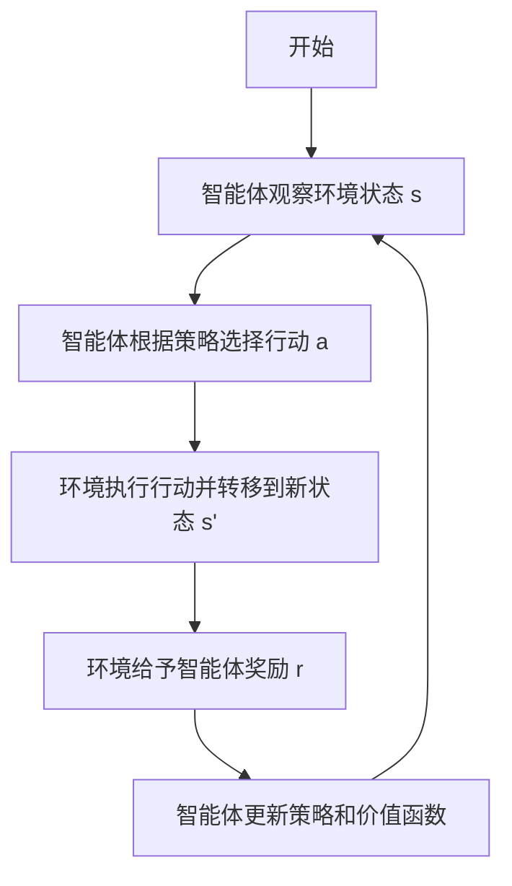

# 金融领域强化学习在市场做市商策略中的应用

> 关键词：金融领域、强化学习、市场做市商策略、交易算法、智能决策

> 摘要：本文聚焦于金融领域中强化学习在市场做市商策略里的应用。首先介绍了研究的背景、目的、预期读者和文档结构，对相关术语进行了详细解释。接着阐述了强化学习与做市商策略的核心概念及其联系，给出了原理和架构的文本示意图与 Mermaid 流程图。深入讲解了核心算法原理，并使用 Python 代码进行说明，同时给出了数学模型和公式。通过项目实战，展示了开发环境搭建、源代码实现与解读。探讨了该技术在实际金融市场中的应用场景，推荐了学习资源、开发工具框架以及相关论文著作。最后总结了未来发展趋势与挑战，还提供了常见问题解答和扩展阅读参考资料，旨在为金融从业者和研究者在利用强化学习优化做市商策略方面提供全面且深入的指导。

## 1. 背景介绍 
### 1.1 目的和范围
在金融市场中，做市商扮演着至关重要的角色。他们通过持续提供买卖报价，为市场提供流动性，促进交易的顺利进行。传统的做市商策略往往基于经验和简单的数学模型，难以适应复杂多变的市场环境。随着人工智能技术的发展，强化学习作为一种强大的智能决策方法，为做市商策略的优化提供了新的途径。

本文的目的在于深入探讨强化学习在市场做市商策略中的应用，详细介绍相关的理论、算法和实践方法。范围涵盖强化学习的基本概念、核心算法原理、数学模型，以及如何将其应用于实际的做市商策略开发中。同时，通过实际案例展示强化学习在提高做市商盈利能力、降低风险等方面的有效性。

### 1.2 预期读者
本文的预期读者主要包括金融领域的从业者，如做市商、交易员、投资经理等，他们希望通过引入强化学习技术来优化现有的做市商策略，提高交易绩效。此外，计算机科学和人工智能领域的研究者和开发者也可以从本文中了解强化学习在金融市场的具体应用场景和实践方法，为跨学科研究提供参考。

### 1.3 文档结构概述
本文共分为十个部分。第一部分为背景介绍，阐述了研究的目的、范围、预期读者和文档结构。第二部分介绍强化学习与做市商策略的核心概念及其联系，给出原理和架构的文本示意图与 Mermaid 流程图。第三部分详细讲解核心算法原理，并使用 Python 代码进行说明。第四部分给出数学模型和公式，并进行详细讲解和举例说明。第五部分通过项目实战，展示开发环境搭建、源代码实现与解读。第六部分探讨强化学习在金融市场中的实际应用场景。第七部分推荐学习资源、开发工具框架以及相关论文著作。第八部分总结未来发展趋势与挑战。第九部分提供常见问题解答。第十部分列出扩展阅读参考资料。

### 1.4 术语表
#### 1.4.1 核心术语定义
- **强化学习（Reinforcement Learning）**：一种机器学习范式，智能体通过与环境进行交互，根据环境反馈的奖励信号来学习最优的行为策略，以最大化长期累积奖励。
- **市场做市商（Market Maker）**：在金融市场中，为特定证券或金融产品提供买卖报价的金融机构或个人。做市商通过持续提供双向报价，保证市场的流动性，从中赚取买卖价差。
- **做市商策略（Market Making Strategy）**：做市商为了实现盈利和风险管理目标而制定的一系列交易决策规则，包括报价确定、订单执行、库存管理等方面。
- **状态（State）**：在强化学习中，状态是对环境当前情况的描述，智能体根据当前状态来选择行动。在做市商策略中，状态可以包括市场价格、交易量、库存水平等信息。
- **行动（Action）**：智能体在某个状态下采取的具体操作。在做市商策略中，行动可以是调整买卖报价、执行交易订单等。
- **奖励（Reward）**：环境在智能体采取行动后给予的反馈信号，用于评估行动的好坏。在做市商策略中，奖励可以是交易利润、库存风险等指标。

#### 1.4.2 相关概念解释
- **策略（Policy）**：智能体在不同状态下选择行动的规则，通常用函数 $\pi(s)$ 表示，其中 $s$ 为状态。一个好的策略能够使智能体在长期内获得最大的累积奖励。
- **价值函数（Value Function）**：用于评估某个状态或状态 - 行动对的好坏程度。常见的价值函数包括状态价值函数 $V(s)$ 和动作价值函数 $Q(s,a)$，分别表示从状态 $s$ 开始和在状态 $s$ 采取行动 $a$ 后所能获得的长期累积奖励的期望。
- **探索与利用（Exploration and Exploitation）**：强化学习中的一个重要问题。探索是指智能体尝试不同的行动，以发现更好的策略；利用是指智能体根据已有的经验选择当前认为最优的行动。在实际应用中，需要在探索和利用之间找到一个平衡。

#### 1.4.3 缩略词列表
- **RL**：Reinforcement Learning，强化学习
- **MM**：Market Maker，市场做市商
- **DQN**：Deep Q - Network，深度 Q 网络

## 2. 核心概念与联系 
### 核心概念原理
#### 强化学习原理
强化学习的基本原理是智能体（Agent）与环境（Environment）进行交互。智能体在每个时间步 $t$ 观察环境的状态 $s_t$，根据当前策略 $\pi$ 选择一个行动 $a_t$ 执行。环境在智能体执行行动后，会转移到新的状态 $s_{t + 1}$，并给予智能体一个奖励 $r_{t+1}$。智能体的目标是学习一个最优策略 $\pi^*$，使得长期累积奖励 $\sum_{t = 0}^{\infty}\gamma^t r_{t+1}$ 最大化，其中 $\gamma \in [0,1]$ 是折扣因子，用于权衡近期奖励和远期奖励。

#### 做市商策略原理
做市商的主要目标是通过提供买卖报价来赚取买卖价差，同时管理库存风险。做市商需要根据市场情况（如价格、交易量等）和自身库存水平来确定合理的买卖报价。当市场上有投资者接受做市商的报价时，做市商执行交易，并更新自己的库存和资金状况。做市商策略的核心是在盈利和风险之间找到一个平衡，以实现长期稳定的收益。

### 架构的文本示意图
```plaintext
+---------------------+       +---------------------+
|     强化学习智能体    |       |      金融市场环境     |
|  (策略、价值函数等)   | ----> | (价格、交易量等状态) |
|                     |       |                     |
|   选择行动 (报价等)   |       |  反馈奖励和新状态   |
|                     | <---- |                     |
+---------------------+       +---------------------+
```

### Mermaid 流程图


## 3. 核心算法原理 & 具体操作步骤 
### 核心算法原理 - Q - learning
Q - learning 是一种无模型的强化学习算法，用于学习最优的动作价值函数 $Q(s,a)$。其核心思想是通过不断更新 $Q$ 值来逼近最优的动作价值函数。

$Q$ 值的更新公式为：
\[
Q(s,a) \leftarrow Q(s,a)+\alpha\left[r + \gamma\max_{a'}Q(s',a')-Q(s,a)\right]
\]
其中，$\alpha$ 是学习率，控制每次更新的步长；$\gamma$ 是折扣因子，权衡近期奖励和远期奖励；$s$ 是当前状态，$a$ 是当前行动，$s'$ 是下一个状态，$r$ 是执行行动 $a$ 后获得的奖励。

### 具体操作步骤
1. **初始化**：初始化 $Q$ 表，将所有状态 - 行动对的 $Q$ 值初始化为 0。
2. **循环迭代**：
    - 观察当前状态 $s$。
    - 根据当前的 $Q$ 表和探索策略（如 $\epsilon$-贪心策略）选择一个行动 $a$。
    - 执行行动 $a$，观察环境反馈的奖励 $r$ 和新状态 $s'$。
    - 根据 $Q$ 值更新公式更新 $Q(s,a)$。
    - 更新当前状态 $s = s'$。
3. **终止条件**：达到预设的迭代次数或满足其他终止条件。

### Python 源代码实现
```python
import numpy as np

class QLearningAgent:
    def __init__(self, state_size, action_size, learning_rate=0.1, discount_factor=0.9, epsilon=0.1):
        self.state_size = state_size
        self.action_size = action_size
        self.learning_rate = learning_rate
        self.discount_factor = discount_factor
        self.epsilon = epsilon
        self.q_table = np.zeros((state_size, action_size))

    def choose_action(self, state):
        if np.random.uniform(0, 1) < self.epsilon:
            # 探索：随机选择一个行动
            action = np.random.choice(self.action_size)
        else:
            # 利用：选择 Q 值最大的行动
            action = np.argmax(self.q_table[state, :])
        return action

    def update_q_table(self, state, action, reward, next_state):
        # Q 值更新公式
        q_target = reward + self.discount_factor * np.max(self.q_table[next_state, :])
        q_error = q_target - self.q_table[state, action]
        self.q_table[state, action] += self.learning_rate * q_error

# 示例使用
state_size = 10
action_size = 5
agent = QLearningAgent(state_size, action_size)

# 模拟交互
state = 0
for _ in range(100):
    action = agent.choose_action(state)
    # 模拟环境反馈
    next_state = np.random.randint(0, state_size)
    reward = np.random.randn()
    agent.update_q_table(state, action, reward, next_state)
    state = next_state
```

## 4. 数学模型和公式 & 详细讲解 & 举例说明 
### 价值函数的数学模型
#### 状态价值函数
状态价值函数 $V(s)$ 表示从状态 $s$ 开始，遵循策略 $\pi$ 所能获得的长期累积奖励的期望，定义为：
\[
V^{\pi}(s)=\mathbb{E}_{\pi}\left[\sum_{t = 0}^{\infty}\gamma^t r_{t+1}\mid s_0 = s\right]
\]
其中，$\mathbb{E}_{\pi}$ 表示在策略 $\pi$ 下的期望。

#### 动作价值函数
动作价值函数 $Q(s,a)$ 表示在状态 $s$ 采取行动 $a$，然后遵循策略 $\pi$ 所能获得的长期累积奖励的期望，定义为：
\[
Q^{\pi}(s,a)=\mathbb{E}_{\pi}\left[\sum_{t = 0}^{\infty}\gamma^t r_{t+1}\mid s_0 = s, a_0 = a\right]
\]

### 贝尔曼方程
#### 状态价值函数的贝尔曼方程
状态价值函数 $V^{\pi}(s)$ 满足贝尔曼方程：
\[
V^{\pi}(s)=\sum_{a}\pi(a\mid s)\sum_{s',r}p(s',r\mid s,a)\left[r+\gamma V^{\pi}(s')\right]
\]
其中，$\pi(a\mid s)$ 是策略 $\pi$ 在状态 $s$ 选择行动 $a$ 的概率，$p(s',r\mid s,a)$ 是在状态 $s$ 采取行动 $a$ 后转移到状态 $s'$ 并获得奖励 $r$ 的概率。

#### 动作价值函数的贝尔曼方程
动作价值函数 $Q^{\pi}(s,a)$ 满足贝尔曼方程：
\[
Q^{\pi}(s,a)=\sum_{s',r}p(s',r\mid s,a)\left[r+\gamma\sum_{a'}\pi(a'\mid s')Q^{\pi}(s',a')\right]
\]

### 举例说明
假设一个简单的做市商环境，状态 $s$ 表示库存水平（有 3 种可能：-1, 0, 1），行动 $a$ 表示调整报价（有 2 种可能：提高报价、降低报价）。奖励 $r$ 根据交易利润和库存风险来计算。

初始时，$Q$ 表如下：
| 状态 \ 行动 | 提高报价 | 降低报价 |
| --- | --- | --- |
| -1 | 0 | 0 |
| 0 | 0 | 0 |
| 1 | 0 | 0 |

假设当前状态 $s = 0$，智能体选择行动 $a =$ 提高报价，执行行动后，环境转移到新状态 $s' = 1$，并给予奖励 $r = 1$。

使用 Q - learning 更新公式，假设学习率 $\alpha = 0.1$，折扣因子 $\gamma = 0.9$：
首先计算 $Q$ 目标值：
\[
q_{target}=r+\gamma\max_{a'}Q(s',a')=1 + 0.9\times\max\{0,0\}=1
\]
然后更新 $Q(0, \text{提高报价})$：
\[
Q(0,\text{提高报价})=Q(0,\text{提高报价})+\alpha\left[q_{target}-Q(0,\text{提高报价})\right]=0 + 0.1\times(1 - 0)=0.1
\]

更新后的 $Q$ 表如下：
| 状态 \ 行动 | 提高报价 | 降低报价 |
| --- | --- | --- |
| -1 | 0 | 0 |
| 0 | 0.1 | 0 |
| 1 | 0 | 0 |

## 5. 项目实战：代码实际案例和详细解释说明 
### 5.1  开发环境搭建
#### 安装 Python
首先，确保你已经安装了 Python 3.x 版本。可以从 Python 官方网站（https://www.python.org/downloads/）下载并安装适合你操作系统的版本。

#### 安装必要的库
在做市商策略开发中，需要使用一些常用的 Python 库，如 NumPy、Pandas、Matplotlib 等。可以使用以下命令进行安装：
```sh
pip install numpy pandas matplotlib
```

### 5.2  源代码详细实现和代码解读
以下是一个简单的基于 Q - learning 的做市商策略实现示例：

```python
import numpy as np
import pandas as pd
import matplotlib.pyplot as plt

# 定义环境类
class MarketMakingEnv:
    def __init__(self, num_states=5, num_actions=3, initial_inventory=0):
        self.num_states = num_states
        self.num_actions = num_actions
        self.initial_inventory = initial_inventory
        self.reset()

    def reset(self):
        self.inventory = self.initial_inventory
        self.state = self._get_state()
        return self.state

    def step(self, action):
        # 根据行动更新库存
        if action == 0:  # 买入
            self.inventory += 1
        elif action == 1:  # 卖出
            self.inventory -= 1
        else:  # 不操作
            pass

        # 模拟市场价格变化
        price_change = np.random.randn()
        reward = self._calculate_reward(price_change)
        self.state = self._get_state()
        done = False  # 简单示例，不设置终止条件
        return self.state, reward, done

    def _get_state(self):
        # 根据库存水平离散化状态
        state = int(np.clip(self.inventory + self.num_states // 2, 0, self.num_states - 1))
        return state

    def _calculate_reward(self, price_change):
        # 奖励计算：交易利润 - 库存风险
        profit = self.inventory * price_change
        risk = self.inventory ** 2  # 简单的库存风险模型
        reward = profit - 0.1 * risk
        return reward

# 定义 Q - learning 智能体类
class QLearningAgent:
    def __init__(self, state_size, action_size, learning_rate=0.1, discount_factor=0.9, epsilon=0.1):
        self.state_size = state_size
        self.action_size = action_size
        self.learning_rate = learning_rate
        self.discount_factor = discount_factor
        self.epsilon = epsilon
        self.q_table = np.zeros((state_size, action_size))

    def choose_action(self, state):
        if np.random.uniform(0, 1) < self.epsilon:
            action = np.random.choice(self.action_size)
        else:
            action = np.argmax(self.q_table[state, :])
        return action

    def update_q_table(self, state, action, reward, next_state):
        q_target = reward + self.discount_factor * np.max(self.q_table[next_state, :])
        q_error = q_target - self.q_table[state, action]
        self.q_table[state, action] += self.learning_rate * q_error

# 主训练循环
if __name__ == "__main__":
    env = MarketMakingEnv()
    agent = QLearningAgent(env.num_states, env.num_actions)

    num_episodes = 1000
    rewards = []

    for episode in range(num_episodes):
        state = env.reset()
        total_reward = 0

        for _ in range(100):
            action = agent.choose_action(state)
            next_state, reward, done = env.step(action)
            agent.update_q_table(state, action, reward, next_state)
            state = next_state
            total_reward += reward

        rewards.append(total_reward)

        if episode % 100 == 0:
            print(f"Episode {episode}: Total Reward = {total_reward}")

    # 绘制奖励曲线
    plt.plot(rewards)
    plt.xlabel('Episode')
    plt.ylabel('Total Reward')
    plt.title('Training Rewards')
    plt.show()
```

### 5.3  代码解读与分析
#### 环境类 `MarketMakingEnv`
- `__init__` 方法：初始化环境的状态数量、行动数量和初始库存。
- `reset` 方法：重置环境，将库存恢复到初始值，并返回当前状态。
- `step` 方法：根据智能体选择的行动更新库存，模拟市场价格变化，计算奖励，并返回新状态、奖励和是否终止的标志。
- `_get_state` 方法：根据库存水平离散化状态。
- `_calculate_reward` 方法：计算奖励，奖励由交易利润减去库存风险组成。

#### 智能体类 `QLearningAgent`
- `__init__` 方法：初始化智能体的状态数量、行动数量、学习率、折扣因子和探索率，同时初始化 $Q$ 表。
- `choose_action` 方法：根据 $\epsilon$-贪心策略选择行动。
- `update_q_table` 方法：根据 Q - learning 更新公式更新 $Q$ 表。

#### 主训练循环
- 初始化环境和智能体。
- 进行多个回合的训练，每个回合中智能体与环境进行交互，更新 $Q$ 表并记录总奖励。
- 绘制奖励曲线，观察训练过程中智能体的性能变化。

## 6. 实际应用场景 
### 股票市场做市
在股票市场中，做市商通过强化学习可以更精准地确定买卖报价。例如，做市商可以根据股票的历史价格、交易量、市场情绪等信息作为状态输入，选择合适的报价调整行动。通过不断学习和优化策略，做市商可以提高交易效率，降低库存风险，增加买卖价差收益。

### 期货市场做市
期货市场的价格波动较大，做市商需要快速响应市场变化。强化学习可以帮助做市商实时调整报价，根据期货合约的到期时间、基差等因素优化策略。同时，做市商可以利用强化学习对不同期货品种之间的套利机会进行捕捉，提高盈利能力。

### 加密货币市场做市
加密货币市场具有高度的不确定性和波动性。做市商可以使用强化学习来应对这种复杂的市场环境。通过对加密货币的价格走势、交易量、交易深度等信息进行分析，做市商可以制定更加灵活的报价策略，提高市场流动性，同时降低自身风险。

## 7. 工具和资源推荐
### 7.1 学习资源推荐
#### 7.1.1 书籍推荐
- 《Reinforcement Learning: An Introduction》（Richard S. Sutton 和 Andrew G. Barto 著）：强化学习领域的经典教材，全面介绍了强化学习的基本概念、算法和应用。
- 《Python for Finance: Analyze Big Financial Data》（Yves Hilpisch 著）：介绍了如何使用 Python 进行金融数据分析和算法交易，包含了许多实际案例。

#### 7.1.2 在线课程
- Coursera 上的“Reinforcement Learning Specialization”：由 University of Alberta 提供，深入讲解了强化学习的理论和实践。
- edX 上的“Artificial Intelligence for Trading”：介绍了人工智能在交易领域的应用，包括强化学习在做市商策略中的应用。

#### 7.1.3 技术博客和网站
- OpenAI Blog（https://openai.com/blog/）：OpenAI 发布的最新研究成果和技术文章，涵盖了强化学习的多个领域。
- Towards Data Science（https://towardsdatascience.com/）：一个数据科学和机器学习的社区，有许多关于强化学习和金融科技的优秀文章。

### 7.2 开发工具框架推荐
#### 7.2.1 IDE和编辑器
- PyCharm：一款专业的 Python 集成开发环境，提供了丰富的代码编辑、调试和分析功能。
- Jupyter Notebook：一个交互式的开发环境，适合进行数据分析和模型实验，方便展示代码和结果。

#### 7.2.2 调试和性能分析工具
- TensorBoard：TensorFlow 提供的可视化工具，可以用于监控模型训练过程中的各种指标，如损失函数、奖励曲线等。
- cProfile：Python 内置的性能分析工具，可以帮助找出代码中的性能瓶颈。

#### 7.2.3 相关框架和库
- TensorFlow：一个广泛使用的深度学习框架，提供了丰富的工具和函数，方便实现强化学习算法。
- PyTorch：另一个流行的深度学习框架，具有动态图的优势，适合快速开发和实验。
- Stable Baselines3：一个基于 PyTorch 的强化学习库，提供了多种预实现的强化学习算法，方便用户快速上手。

### 7.3 相关论文著作推荐
#### 7.3.1 经典论文
- “Playing Atari with Deep Reinforcement Learning”（Volodymyr Mnih 等著）：提出了深度 Q 网络（DQN）算法，开启了深度强化学习的时代。
- “Proximal Policy Optimization Algorithms”（John Schulman 等著）：介绍了近端策略优化（PPO）算法，是一种高效的策略梯度算法。

#### 7.3.2 最新研究成果
- 关注顶级学术会议如 NeurIPS、ICML、AISTATS 等，这些会议上会有关于强化学习在金融领域应用的最新研究成果。

#### 7.3.3 应用案例分析
- 一些金融科技公司和研究机构会发布关于强化学习在做市商策略中的应用案例，可以通过他们的官方网站或学术论文获取相关信息。

## 8. 总结：未来发展趋势与挑战
### 未来发展趋势
#### 与深度学习的深度融合
随着深度学习技术的不断发展，强化学习与深度学习的结合将更加紧密。例如，使用深度神经网络来近似价值函数和策略函数，可以处理更复杂的状态和行动空间，提高做市商策略的性能。

#### 多智能体强化学习的应用
在金融市场中，存在多个做市商和投资者，他们之间相互影响。多智能体强化学习可以用于模拟和优化多个做市商之间的竞争与合作关系，提高市场的整体效率。

#### 结合其他技术
强化学习可以与其他技术如自然语言处理、图神经网络等结合，从更多的数据源中获取信息，进一步优化做市商策略。例如，通过分析新闻文本和社交媒体数据来预测市场情绪，为做市商决策提供参考。

### 挑战
#### 数据质量和可用性
金融市场数据通常存在噪声、缺失值等问题，数据的质量和可用性会影响强化学习模型的性能。此外，一些金融数据可能受到隐私和安全的限制，获取和使用这些数据需要遵守相关法规。

#### 模型可解释性
强化学习模型往往是黑盒模型，难以解释其决策过程。在金融领域，监管机构和投资者通常要求模型具有一定的可解释性，以便评估风险和合规性。

#### 市场不确定性
金融市场具有高度的不确定性和波动性，强化学习模型在面对突发市场事件时可能表现不佳。如何提高模型的鲁棒性和适应性，是一个亟待解决的问题。

## 9. 附录：常见问题与解答
### Q1：强化学习在做市商策略中的应用与传统方法有什么区别？
A1：传统的做市商策略通常基于经验和简单的数学模型，难以适应复杂多变的市场环境。强化学习可以通过与环境进行交互，自动学习最优的策略，能够更好地处理市场的不确定性和动态变化。

### Q2：如何选择合适的奖励函数？
A2：奖励函数的设计需要综合考虑做市商的目标，如盈利和风险管理。常见的奖励包括交易利润、库存风险等。奖励函数的设计应该能够引导智能体学习到符合做市商利益的策略，同时避免过度追求短期利益而忽视长期风险。

### Q3：强化学习模型的训练时间通常有多长？
A3：训练时间取决于多个因素，如模型的复杂度、数据量、计算资源等。简单的模型可能只需要几分钟到几小时的训练时间，而复杂的深度强化学习模型可能需要数天甚至数周的时间。可以通过优化算法、增加计算资源等方式来缩短训练时间。

### Q4：如何评估强化学习做市商策略的性能？
A4：可以使用多种指标来评估策略的性能，如累计收益、夏普比率、最大回撤等。同时，还可以进行回测实验，使用历史数据来验证策略的有效性。在实际应用中，还需要考虑策略的稳定性和适应性，观察策略在不同市场环境下的表现。

## 10. 扩展阅读 & 参考资料
### 扩展阅读
- “Algorithmic Trading and Quantitative Strategies”（Ernest P. Chan 著）：深入介绍了算法交易和量化策略的原理和实践。
- “Machine Learning for Asset Managers”（Marcos López de Prado 著）：介绍了机器学习在资产管理中的应用，包括强化学习在交易策略中的应用。

### 参考资料
- 相关学术论文和研究报告可以在学术数据库如 IEEE Xplore、ACM Digital Library、ScienceDirect 等上查找。
- 金融市场数据可以从专业的数据提供商如 Bloomberg、Wind 等获取。

作者：AI天才研究院/AI Genius Institute & 禅与计算机程序设计艺术 /Zen And The Art of Computer Programming