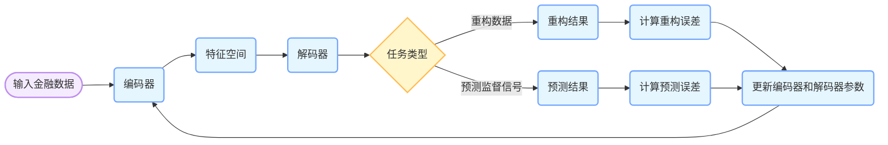

# 金融领域自监督学习在市场异常模式早期识别中的应用

> 关键词：金融领域、自监督学习、市场异常模式、早期识别、机器学习

> 摘要：本文聚焦于金融领域中自监督学习在市场异常模式早期识别的应用。首先介绍自监督学习的基本概念和原理，探讨其在金融市场复杂环境下的适应性和优势。接着深入分析市场异常模式的定义、特征以及早期识别的重要性。通过详细的算法原理阐述、数学模型推导、实际代码案例展示，说明自监督学习如何在金融市场数据中挖掘异常模式。同时，列举实际应用场景，推荐相关的学习资源、开发工具和论文著作。最后对自监督学习在金融领域的未来发展趋势与挑战进行总结，并给出常见问题解答和扩展阅读参考资料，旨在为金融从业者和研究者提供全面且深入的技术视角和实践指导。

## 1. 背景介绍 
### 1.1 目的和范围
在金融市场中，市场异常模式的出现往往伴随着巨大的风险和机遇。及时准确地识别这些异常模式，对于投资者做出合理决策、金融机构进行风险管理以及监管部门维护市场稳定都具有至关重要的意义。传统的异常检测方法在面对金融市场海量、高维、复杂且动态变化的数据时，往往显得力不从心。自监督学习作为一种新兴的机器学习范式，无需大量标注数据，能够自动从数据中学习到有价值的特征和模式，为金融市场异常模式的早期识别提供了新的思路和方法。

本文的范围涵盖自监督学习的基本原理、在金融市场异常模式早期识别中的应用算法、相关数学模型、实际代码案例以及实际应用场景等方面，旨在全面介绍自监督学习在金融领域这一特定应用中的理论和实践知识。

### 1.2 预期读者
本文预期读者包括金融领域的从业者，如投资者、金融分析师、风险管理专家等，他们可以从中了解自监督学习在市场异常模式识别中的应用，为实际工作提供决策依据；也包括计算机科学和机器学习领域的研究者和开发者，他们可以通过本文深入了解自监督学习在金融领域的具体应用场景和技术实现细节；此外，对金融科技感兴趣的学生和爱好者也可以从本文中获取相关知识和启发。

### 1.3 文档结构概述
本文首先介绍自监督学习和金融市场异常模式的核心概念与联系，帮助读者建立基本的理论框架。接着详细阐述自监督学习用于市场异常模式早期识别的核心算法原理和具体操作步骤，并给出相应的 Python 源代码。然后介绍相关的数学模型和公式，并通过举例进行详细讲解。通过实际的项目实战，展示代码的具体实现和详细解读。之后列举自监督学习在金融领域的实际应用场景。再推荐相关的学习资源、开发工具和论文著作。最后对自监督学习在金融领域的未来发展趋势与挑战进行总结，给出常见问题解答和扩展阅读参考资料。

### 1.4 术语表
#### 1.4.1 核心术语定义
- **自监督学习（Self - Supervised Learning）**：一种机器学习范式，通过从数据本身生成监督信号来学习数据的表示，无需人工标注大量数据。
- **市场异常模式（Market Anomaly Pattern）**：在金融市场中，偏离正常市场行为和统计规律的价格波动、交易量变化等模式，可能预示着重大的市场事件或风险。
- **早期识别（Early Recognition）**：在市场异常模式刚刚出现或还未完全形成时，就能够准确地检测和识别出来。

#### 1.4.2 相关概念解释
- **无监督学习（Unsupervised Learning）**：从无标签的数据中学习数据的结构和模式，自监督学习是无监督学习的一种特殊形式，它利用数据自身的某些特性生成监督信号。
- **异常检测（Anomaly Detection）**：识别数据中与正常模式明显不同的样本或模式的过程，在金融领域用于发现市场中的异常事件。

#### 1.4.3 缩略词列表
- **ML（Machine Learning）**：机器学习
- **AI（Artificial Intelligence）**：人工智能
- **RNN（Recurrent Neural Network）**：循环神经网络
- **LSTM（Long Short - Term Memory）**：长短期记忆网络

## 2. 核心概念与联系 

### 2.1 自监督学习原理
自监督学习的核心思想是利用数据自身的某些特性来生成监督信号，从而学习到数据的有用表示。例如，在图像领域，可以通过预测图像的旋转角度、对图像进行切块并预测其相对位置等方式来生成监督信号。在金融领域，可以利用金融时间序列数据的前后相关性、不同金融指标之间的关系等生成监督信号。

自监督学习的一般架构包括编码器（Encoder）和解码器（Decoder）。编码器将输入数据映射到一个低维的特征空间，解码器则尝试从这个特征空间中重构出原始数据或预测相关的监督信号。通过最小化重构误差或预测误差，编码器可以学习到数据的有效特征表示。

下面是自监督学习架构的文本示意图：

```plaintext
输入数据（金融时间序列、金融指标等） -> 编码器（提取特征） -> 特征空间 -> 解码器（重构数据或预测监督信号） -> 输出（重构数据、预测结果）
```

### 2.2 Mermaid 流程图


### 2.3 市场异常模式与自监督学习的联系
金融市场异常模式通常表现为数据的分布、趋势、相关性等方面的异常变化。自监督学习通过学习数据的正常模式和内在结构，能够捕捉到数据中的微小变化。当出现异常模式时，重构误差或预测误差会显著增大，从而可以通过设置合适的阈值来识别异常模式。自监督学习的优势在于它可以自动从大量的金融数据中学习到复杂的模式和关系，无需人工手动定义特征，能够适应金融市场的动态变化。

## 3. 核心算法原理 & 具体操作步骤 

### 3.1 自监督学习算法原理
这里以自编码器（Autoencoder）为例介绍自监督学习的算法原理。自编码器是一种简单而有效的自监督学习模型，由编码器和解码器组成。

编码器将输入数据 $x$ 映射到低维的特征空间 $z$，可以表示为：

$z = f_{enc}(x; \theta_{enc})$

其中 $f_{enc}$ 是编码器的映射函数，$\theta_{enc}$ 是编码器的参数。

解码器将特征空间中的向量 $z$ 重构为输出数据 $\hat{x}$，可以表示为：

$\hat{x} = f_{dec}(z; \theta_{dec})$

其中 $f_{dec}$ 是解码器的映射函数，$\theta_{dec}$ 是解码器的参数。

训练自编码器的目标是最小化重构误差，通常使用均方误差（MSE）作为损失函数：

$L(\theta_{enc}, \theta_{dec}) = \frac{1}{N} \sum_{i = 1}^{N} ||x_i - \hat{x}_i||^2$

其中 $N$ 是样本数量，$x_i$ 是第 $i$ 个输入样本，$\hat{x}_i$ 是第 $i$ 个重构样本。

### 3.2 具体操作步骤
1. **数据预处理**：收集金融市场数据，如股票价格、交易量等，对数据进行清洗、归一化等处理，以提高模型的训练效果。
2. **模型构建**：构建自编码器模型，包括编码器和解码器的网络结构，选择合适的激活函数和优化器。
3. **模型训练**：将预处理后的数据输入到自编码器中进行训练，通过最小化重构误差来更新模型的参数。
4. **异常检测**：在训练好的模型上，将新的数据输入，计算重构误差。如果重构误差超过预设的阈值，则认为该数据对应的市场模式为异常模式。

### 3.3 Python 源代码实现
```python
import numpy as np
import tensorflow as tf
from tensorflow.keras.layers import Input, Dense
from tensorflow.keras.models import Model
from sklearn.preprocessing import MinMaxScaler

# 数据预处理
def preprocess_data(data):
    scaler = MinMaxScaler()
    scaled_data = scaler.fit_transform(data)
    return scaled_data, scaler

# 构建自编码器模型
def build_autoencoder(input_dim, encoding_dim):
    # 编码器
    input_layer = Input(shape=(input_dim,))
    encoded = Dense(encoding_dim, activation='relu')(input_layer)
    # 解码器
    decoded = Dense(input_dim, activation='sigmoid')(encoded)
    # 自编码器模型
    autoencoder = Model(input_layer, decoded)
    # 编码器模型
    encoder = Model(input_layer, encoded)
    # 解码器模型
    encoded_input = Input(shape=(encoding_dim,))
    decoder_layer = autoencoder.layers[-1]
    decoder = Model(encoded_input, decoder_layer(encoded_input))

    autoencoder.compile(optimizer='adam', loss='mse')
    return autoencoder, encoder, decoder

# 异常检测
def detect_anomalies(autoencoder, data, threshold):
    reconstructions = autoencoder.predict(data)
    mse = np.mean(np.power(data - reconstructions, 2), axis=1)
    anomalies = mse > threshold
    return anomalies, mse

# 示例数据
data = np.random.rand(100, 10)  # 100 个样本，每个样本 10 个特征
scaled_data, scaler = preprocess_data(data)

# 构建自编码器模型
input_dim = scaled_data.shape[1]
encoding_dim = 3
autoencoder, encoder, decoder = build_autoencoder(input_dim, encoding_dim)

# 模型训练
autoencoder.fit(scaled_data, scaled_data, epochs=50, batch_size=32, shuffle=True)

# 异常检测
threshold = 0.01
anomalies, mse = detect_anomalies(autoencoder, scaled_data, threshold)
print("异常样本索引：", np.where(anomalies)[0])
```

## 4. 数学模型和公式 & 详细讲解 & 举例说明 

### 4.1 自编码器的数学模型
自编码器的数学模型可以用以下公式表示：

编码器：$z = f_{enc}(x; \theta_{enc}) = W_{enc}x + b_{enc}$

其中 $W_{enc}$ 是编码器的权重矩阵，$b_{enc}$ 是编码器的偏置向量。

解码器：$\hat{x} = f_{dec}(z; \theta_{dec}) = W_{dec}z + b_{dec}$

其中 $W_{dec}$ 是解码器的权重矩阵，$b_{dec}$ 是解码器的偏置向量。

损失函数：$L(\theta_{enc}, \theta_{dec}) = \frac{1}{N} \sum_{i = 1}^{N} ||x_i - \hat{x}_i||^2 = \frac{1}{N} \sum_{i = 1}^{N} ||x_i - (W_{dec}(W_{enc}x_i + b_{enc}) + b_{dec})||^2$

### 4.2 详细讲解
- **编码器**：编码器的作用是将高维的输入数据映射到低维的特征空间。通过线性变换 $W_{enc}x + b_{enc}$ 和非线性激活函数（如 ReLU），可以提取输入数据的重要特征。
- **解码器**：解码器的作用是将低维的特征向量重构为高维的输出数据。同样通过线性变换 $W_{dec}z + b_{dec}$ 和非线性激活函数（如 Sigmoid），尝试恢复原始输入数据。
- **损失函数**：损失函数衡量了重构数据与原始数据之间的差异。通过最小化损失函数，编码器和解码器可以学习到数据的有效表示和重构方法。

### 4.3 举例说明
假设我们有一个简单的二维输入数据 $x = [x_1, x_2]$，编码器的权重矩阵 $W_{enc} = \begin{bmatrix} 0.5 & 0.3 \\ 0.2 & 0.4 \end{bmatrix}$，偏置向量 $b_{enc} = [0.1, 0.2]$。则编码器的输出 $z$ 为：

$z = W_{enc}x + b_{enc} = \begin{bmatrix} 0.5 & 0.3 \\ 0.2 & 0.4 \end{bmatrix} \begin{bmatrix} x_1 \\ x_2 \end{bmatrix} + \begin{bmatrix} 0.1 \\ 0.2 \end{bmatrix} = \begin{bmatrix} 0.5x_1 + 0.3x_2 + 0.1 \\ 0.2x_1 + 0.4x_2 + 0.2 \end{bmatrix}$

假设解码器的权重矩阵 $W_{dec} = \begin{bmatrix} 0.6 & 0.7 \\ 0.8 & 0.9 \end{bmatrix}$，偏置向量 $b_{dec} = [0.3, 0.4]$。则解码器的输出 $\hat{x}$ 为：

$\hat{x} = W_{dec}z + b_{dec} = \begin{bmatrix} 0.6 & 0.7 \\ 0.8 & 0.9 \end{bmatrix} \begin{bmatrix} 0.5x_1 + 0.3x_2 + 0.1 \\ 0.2x_1 + 0.4x_2 + 0.2 \end{bmatrix} + \begin{bmatrix} 0.3 \\ 0.4 \end{bmatrix}$

假设 $x = [1, 2]$，则：

$z = \begin{bmatrix} 0.5\times1 + 0.3\times2 + 0.1 \\ 0.2\times1 + 0.4\times2 + 0.2 \end{bmatrix} = \begin{bmatrix} 1.2 \\ 1.2 \end{bmatrix}$

$\hat{x} = \begin{bmatrix} 0.6\times1.2 + 0.7\times1.2 + 0.3 \\ 0.8\times1.2 + 0.9\times1.2 + 0.4 \end{bmatrix} = \begin{bmatrix} 2.04 \\ 2.68 \end{bmatrix}$

重构误差为：

$||x - \hat{x}||^2 = (1 - 2.04)^2 + (2 - 2.68)^2 = 1.04^2 + 0.68^2 = 1.0816 + 0.4624 = 1.544$

## 5. 项目实战：代码实际案例和详细解释说明 

### 5.1  开发环境搭建
- **Python 环境**：建议使用 Python 3.7 及以上版本。可以从 Python 官方网站（https://www.python.org/downloads/） 下载安装。
- **深度学习框架**：使用 TensorFlow 或 PyTorch 等深度学习框架。可以通过以下命令安装 TensorFlow：

```bash
pip install tensorflow
```

- **数据处理库**：安装 NumPy、Pandas 等数据处理库，用于数据的读取、清洗和预处理。

```bash
pip install numpy pandas
```

### 5.2  源代码详细实现和代码解读
以下是一个使用自编码器进行金融市场异常模式早期识别的完整代码示例：

```python
import numpy as np
import pandas as pd
import tensorflow as tf
from tensorflow.keras.layers import Input, Dense
from tensorflow.keras.models import Model
from sklearn.preprocessing import MinMaxScaler
import matplotlib.pyplot as plt

# 数据加载和预处理
def load_and_preprocess_data(file_path):
    data = pd.read_csv(file_path)
    # 提取需要的特征列
    features = data[['open', 'high', 'low', 'close', 'volume']].values
    scaler = MinMaxScaler()
    scaled_features = scaler.fit_transform(features)
    return scaled_features, scaler

# 构建自编码器模型
def build_autoencoder(input_dim, encoding_dim):
    input_layer = Input(shape=(input_dim,))
    encoded = Dense(encoding_dim, activation='relu')(input_layer)
    decoded = Dense(input_dim, activation='sigmoid')(encoded)
    autoencoder = Model(input_layer, decoded)
    encoder = Model(input_layer, encoded)
    encoded_input = Input(shape=(encoding_dim,))
    decoder_layer = autoencoder.layers[-1]
    decoder = Model(encoded_input, decoder_layer(encoded_input))
    autoencoder.compile(optimizer='adam', loss='mse')
    return autoencoder, encoder, decoder

# 异常检测
def detect_anomalies(autoencoder, data, threshold):
    reconstructions = autoencoder.predict(data)
    mse = np.mean(np.power(data - reconstructions, 2), axis=1)
    anomalies = mse > threshold
    return anomalies, mse

# 主函数
def main():
