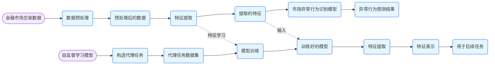

# 金融领域自监督学习在市场异常行为识别中的应用

> 关键词：金融领域、自监督学习、市场异常行为识别、深度学习、特征表示

> 摘要：本文聚焦于金融领域中自监督学习在市场异常行为识别方面的应用。首先介绍了相关背景知识，包括研究目的、预期读者、文档结构等内容。接着详细阐述了自监督学习和市场异常行为识别的核心概念及它们之间的联系，并给出了相应的原理和架构示意图与流程图。通过Python代码讲解了核心算法原理及具体操作步骤，同时给出了相关数学模型和公式，并举例说明。然后通过项目实战展示了代码的实际案例及详细解释。还探讨了自监督学习在市场异常行为识别中的实际应用场景，推荐了相关的学习资源、开发工具框架以及论文著作。最后总结了未来发展趋势与挑战，提供了常见问题解答和扩展阅读参考资料，旨在为金融领域利用自监督学习进行市场异常行为识别提供全面而深入的指导。

## 1. 背景介绍 
### 1.1 目的和范围
在金融市场中，异常行为的识别至关重要。市场异常行为可能包括操纵股价、内幕交易、欺诈性交易等，这些行为不仅会损害投资者的利益，还会破坏市场的公平性和稳定性。传统的异常行为识别方法往往依赖于人工定义的规则和特征，这些方法在面对复杂多变的金融市场时，存在着局限性，如难以捕捉到新出现的异常模式。

自监督学习作为一种无监督学习的变体，它可以在没有人工标注数据的情况下，从大规模的金融数据中自动学习到有价值的特征表示。本研究的目的就是探索自监督学习在金融市场异常行为识别中的应用，评估其有效性和可行性，为金融监管机构和投资者提供更准确、高效的异常行为识别工具。

本研究的范围主要涵盖了股票市场、期货市场等金融市场中的交易数据，包括价格数据、成交量数据、交易时间等。同时，研究将聚焦于常见的自监督学习方法，如对比学习、掩码自编码器等在市场异常行为识别中的应用。

### 1.2 预期读者
本文的预期读者主要包括以下几类人群：
1. **金融从业者**：如金融分析师、交易员、风险管理人员等，他们可以通过本文了解自监督学习在市场异常行为识别中的应用，从而更好地监控市场风险，做出更明智的投资决策。
2. **计算机科学家和研究人员**：对自监督学习和金融领域交叉研究感兴趣的学者和科研人员，本文可以为他们提供相关的理论和实践参考，启发新的研究思路。
3. **金融监管机构工作人员**：有助于他们利用先进的技术手段加强对金融市场的监管，提高监管效率和准确性，维护市场的正常秩序。
4. **学生和爱好者**：对金融和人工智能领域感兴趣的学生和爱好者可以通过本文初步了解自监督学习在金融领域的应用，拓宽知识面和视野。

### 1.3 文档结构概述
本文将按照以下结构进行组织：
1. **背景介绍**：阐述研究的目的、范围、预期读者和文档结构，同时对相关术语进行定义和解释。
2. **核心概念与联系**：介绍自监督学习和市场异常行为识别的核心概念，分析它们之间的联系，并给出相应的原理和架构示意图与流程图。
3. **核心算法原理 & 具体操作步骤**：通过Python代码详细讲解自监督学习的核心算法原理和具体操作步骤。
4. **数学模型和公式 & 详细讲解 & 举例说明**：给出自监督学习在市场异常行为识别中的数学模型和公式，并进行详细讲解和举例说明。
5. **项目实战：代码实际案例和详细解释说明**：通过实际的项目案例，展示如何使用自监督学习进行市场异常行为识别，包括开发环境搭建、源代码实现和代码解读。
6. **实际应用场景**：探讨自监督学习在金融市场异常行为识别中的实际应用场景。
7. **工具和资源推荐**：推荐相关的学习资源、开发工具框架和论文著作。
8. **总结：未来发展趋势与挑战**：总结自监督学习在市场异常行为识别中的应用现状，分析未来发展趋势和面临的挑战。
9. **附录：常见问题与解答**：解答读者在阅读过程中可能遇到的常见问题。
10. **扩展阅读 & 参考资料**：提供相关的扩展阅读材料和参考资料，方便读者进一步深入学习。

### 1.4 术语表
#### 1.4.1 核心术语定义
1. **自监督学习（Self-Supervised Learning）**：是一种无监督学习方法，它通过构造代理任务，让模型从数据自身中学习到有用的特征表示，而无需人工标注的标签。
2. **市场异常行为识别（Market Anomaly Behavior Recognition）**：指的是从金融市场的交易数据中，识别出偏离正常市场行为模式的异常交易行为，如价格操纵、内幕交易等。
3. **对比学习（Contrastive Learning）**：自监督学习的一种方法，通过对比正样本和负样本，让模型学习到数据之间的相似性和差异性，从而得到更好的特征表示。
4. **掩码自编码器（Masked Autoencoder）**：也是一种自监督学习方法，通过对输入数据进行掩码处理，让模型学习到如何从部分数据中恢复出完整的数据，从而学习到数据的潜在特征。
5. **特征表示（Feature Representation）**：指的是将原始数据转换为一种更具代表性和可区分性的向量表示，以便于模型进行学习和分析。

#### 1.4.2 相关概念解释
1. **金融市场数据**：包括股票价格、成交量、交易时间、交易方向等与金融市场交易相关的数据。这些数据反映了市场参与者的行为和市场的运行状态。
2. **异常行为模式**：是指在金融市场中出现的不符合正常市场规律的交易行为模式，如短期内价格的大幅波动、异常的成交量变化等。
3. **代理任务（Proxy Task）**：在自监督学习中，为了让模型学习到有用的特征表示，构造的一种辅助任务。例如，在对比学习中，判断两个样本是否相似就是一个代理任务。

#### 1.4.3 缩略词列表
1. **MLP**：多层感知机（Multi-Layer Perceptron）
2. **CNN**：卷积神经网络（Convolutional Neural Network）
3. **RNN**：循环神经网络（Recurrent Neural Network）
4. **LSTM**：长短期记忆网络（Long Short-Term Memory Network）
5. **GRU**：门控循环单元（Gated Recurrent Unit）

## 2. 核心概念与联系 

### 自监督学习原理
自监督学习的核心思想是利用数据自身的结构和信息来构造监督信号，从而让模型学习到数据的有用特征表示。其基本原理可以概括为以下几个步骤：
1. **构造代理任务**：根据数据的特点和任务需求，设计合适的代理任务。例如，在图像领域，可以将图像的一部分进行旋转，让模型预测旋转的角度；在金融领域，可以将一段时间的交易数据进行掩码处理，让模型预测被掩码部分的数据。
2. **模型训练**：使用构造好的代理任务对模型进行训练。模型通过不断地学习代理任务，逐渐学习到数据的潜在特征。
3. **特征提取**：训练好的模型可以用于提取数据的特征表示。这些特征表示可以用于后续的任务，如分类、聚类、异常检测等。

### 市场异常行为识别原理
市场异常行为识别的目标是从金融市场的交易数据中，找出那些偏离正常市场行为模式的异常交易行为。其基本原理可以分为以下几个步骤：
1. **数据收集与预处理**：收集金融市场的交易数据，包括价格、成交量、交易时间等信息，并对数据进行清洗、归一化等预处理操作。
2. **特征工程**：从预处理后的数据中提取有用的特征，如价格波动幅度、成交量变化率等。这些特征可以反映市场的运行状态和交易行为的特征。
3. **模型训练与预测**：使用提取的特征训练异常行为识别模型，如支持向量机、深度学习模型等。训练好的模型可以对新的交易数据进行预测，判断是否存在异常行为。

### 自监督学习与市场异常行为识别的联系
自监督学习在市场异常行为识别中具有重要的应用价值，它们之间的联系主要体现在以下几个方面：
1. **数据利用**：金融市场数据通常是大规模且未标注的，自监督学习可以在没有人工标注的情况下，从这些数据中自动学习到有用的特征表示，从而充分利用数据的信息。
2. **特征学习**：自监督学习可以学习到数据的深层特征，这些特征可以更好地反映市场的运行状态和交易行为的模式。通过使用自监督学习提取的特征，市场异常行为识别模型可以更准确地识别异常行为。
3. **泛化能力**：自监督学习训练的模型具有较好的泛化能力，可以适应不同的市场环境和数据分布。这对于市场异常行为识别来说非常重要，因为市场环境是不断变化的，模型需要能够在新的环境中准确地识别异常行为。

### 核心概念原理和架构的文本示意图
```plaintext
+-------------------+          +-------------------+
| 金融市场交易数据  |          | 自监督学习模型    |
+-------------------+          +-------------------+
           |                            |
           | 数据预处理                 | 构造代理任务
           v                            v
+-------------------+          +-------------------+
| 预处理后的数据    |          | 代理任务数据集    |
+-------------------+          +-------------------+
           |                            |
           | 特征提取                 | 模型训练
           v                            v
+-------------------+          +-------------------+
| 提取的特征        |          | 训练好的模型      |
+-------------------+          +-------------------+
           |                            |
           | 输入                       | 特征提取
           v                            v
+-------------------+          +-------------------+
| 市场异常行为识别模型 |          | 特征表示        |
+-------------------+          +-------------------+
           |                            |
           | 模型训练与预测             | 用于后续任务
           v                            v
+-------------------+          +-------------------+
| 异常行为预测结果  |          | 分类、聚类等      |
+-------------------+          +-------------------+
```

### Mermaid 流程图


## 3. 核心算法原理 & 具体操作步骤 

### 对比学习算法原理
对比学习是一种常用的自监督学习方法，其核心思想是通过对比正样本和负样本，让模型学习到数据之间的相似性和差异性。下面我们通过Python代码详细讲解对比学习的算法原理和具体操作步骤。

```python
import torch
import torch.nn as nn
import torch.optim as optim
from torch.utils.data import Dataset, DataLoader

# 定义一个简单的数据集
class FinancialDataset(Dataset):
    def __init__(self, data):
        self.data = data
    
    def __len__(self):
        return len(self.data)
    
    def __getitem__(self, idx):
        return self.data[idx]

# 定义一个简单的编码器网络
class Encoder(nn.Module):
    def __init__(self, input_dim, hidden_dim, output_dim):
        super(Encoder, self).__init__()
        self.fc1 = nn.Linear(input_dim, hidden_dim)
        self.relu = nn.ReLU()
        self.fc2 = nn.Linear(hidden_dim, output_dim)
    
    def forward(self, x):
        x = self.fc1(x)
        x = self.relu(x)
        x = self.fc2(x)
        return x

# 定义对比学习模型
class ContrastiveLearningModel(nn.Module):
    def __init__(self, encoder):
        super(ContrastiveLearningModel, self).__init__()
        self.encoder = encoder
    
    def forward(self, x1, x2):
        z1 = self.encoder(x1)
        z2 = self.encoder(x2)
        return z1, z2

# 定义对比损失函数
class ContrastiveLoss(nn.Module):
    def __init__(self, temperature=0.1):
        super(ContrastiveLoss, self).__init__()
        self.temperature = temperature
    
    def forward(self, z1, z2):
        batch_size = z1.size(0)
        z = torch.cat([z1, z2], dim=0)
        similarity_matrix = torch.matmul(z, z.T) / self.temperature
        labels = torch.arange(batch_size, device=z.device)
        labels = torch.cat([labels + batch_size, labels], dim=0)
        loss = nn.CrossEntropyLoss()(similarity_matrix, labels)
        return loss

# 训练对比学习模型
def train_contrastive_model(model, dataloader, criterion, optimizer, epochs):
    model.train()
    for epoch in range(epochs):
        running_loss = 0.0
        for data in dataloader:
            x1 = data[0]
            x2 = data[1]
            optimizer.zero_grad()
            z1, z2 = model(x1, x2)
            loss = criterion(z1, z2)
            loss.backward()
            optimizer.step()
            running_loss += loss.item()
        print(f'Epoch {epoch+1}, Loss: {running_loss / len(dataloader)}')

# 示例数据
data = torch.randn(100, 10)
dataset = FinancialDataset([(data[i], data[i+1]) for i in range(len(data)-1)])
dataloader = DataLoader(dataset, batch_size=10, shuffle=True)

# 初始化模型、损失函数和优化器
encoder = Encoder(input_dim=10, hidden_dim=20, output_dim=10)
model = ContrastiveLearningModel(encoder)
criterion = ContrastiveLoss()
optimizer = optim.Adam(model.parameters(), lr=0.001)

# 训练模型
train_contrastive_model(model, dataloader, criterion, optimizer, epochs=10)
```

### 代码解释
1. **数据集定义**：`FinancialDataset` 类用于封装金融数据，将数据转换为适合模型训练的格式。
2. **编码器网络**：`Encoder` 类是一个简单的多层感知机，用于将输入数据编码为特征向量。
3. **对比学习模型**：`ContrastiveLearningModel` 类将编码器应用于两个输入样本，得到它们的特征表示。
4. **对比损失函数**：`ContrastiveLoss` 类定义了对比学习的损失函数，通过计算样本之间的相似度矩阵和交叉熵损失来优化模型。
5. **训练函数**：`train_contrastive_model` 函数用于训练对比学习模型，在每个 epoch 中计算损失并更新模型参数。

### 具体操作步骤
1. **数据准备**：收集金融市场的交易数据，并将其转换为适合模型输入的格式。
2. **模型初始化**：初始化编码器网络、对比学习模型、损失函数和优化器。
3. **模型训练**：使用准备好的数据和定义好的损失函数对模型进行训练，不断更新模型参数。
4. **特征提取**：训练好的模型可以用于提取金融数据的特征表示，这些特征可以用于后续的市场异常行为识别任务。

## 4. 数学模型和公式 & 详细讲解 & 举例说明 

### 对比学习的数学模型和公式
在对比学习中，假设有两个输入样本 $x_1$ 和 $x_2$，通过编码器网络 $f$ 得到它们的特征表示 $z_1 = f(x_1)$ 和 $z_2 = f(x_2)$。对比学习的目标是最大化正样本对之间的相似度，最小化负样本对之间的相似度。

#### 相似度计算
通常使用余弦相似度来计算两个特征向量之间的相似度，公式如下：
$$
\mathrm{sim}(z_i, z_j) = \frac{z_i^T z_j}{\|z_i\| \|z_j\|}
$$
其中，$z_i$ 和 $z_j$ 是两个特征向量，$\|z_i\|$ 和 $\|z_j\|$ 分别是它们的 $L_2$ 范数。

#### 对比损失函数
对比损失函数通常使用 InfoNCE（Info Noise Contrastive Estimation）损失，公式如下：
$$
\mathcal{L}_{contrastive} = -\log \frac{\exp(\mathrm{sim}(z_i, z_j) / \tau)}{\sum_{k=1}^{N} \exp(\mathrm{sim}(z_i, z_k) / \tau)}
$$
其中，$z_i$ 和 $z_j$ 是正样本对的特征向量，$z_k$ 是负样本对的特征向量，$\tau$ 是温度参数，用于控制相似度的缩放。

### 详细讲解
对比学习的核心思想是通过对比正样本和负样本，让模型学习到数据之间的相似性和差异性。在训练过程中，模型通过最小化对比损失函数来优化编码器网络的参数，使得正样本对的特征表示更加相似，负样本对的特征表示更加不同。

温度参数 $\tau$ 控制了相似度的缩放程度。当 $\tau$ 较小时，相似度的差异会被放大，模型会更加关注正样本对和负样本对之间的差异；当 $\tau$ 较大时，相似度的差异会被缩小，模型会更加关注整体的相似度分布。

### 举例说明
假设我们有一个包含 4 个样本的数据集 $\{x_1, x_2, x_3, x_4\}$，其中 $(x_1, x_2)$ 是正样本对，$(x_1, x_3)$ 和 $(x_1, x_4)$ 是负样本对。经过编码器网络得到它们的特征表示 $z_1, z_2, z_3, z_4$。

首先，计算 $z_1$ 与其他样本的相似度：
$$
\mathrm{sim}(z_1, z_2) = \frac{z_1^T z_2}{\|z_1\| \|z_2\|}
$$
$$
\mathrm{sim}(z_1, z_3) = \frac{z_1^T z_3}{\|z_1\| \|z_3\|}
$$
$$
\mathrm{sim}(z_1, z_4) = \frac{z_1^T z_4}{\|z_1\| \|z_4\|}
$$

然后，计算对比损失：
$$
\mathcal{L}_{contrastive} = -\log \frac{\exp(\mathrm{sim}(z_1, z_2) / \tau)}{\exp(\mathrm{sim}(z_1, z_2) / \tau) + \exp(\mathrm{sim}(z_1, z_3) / \tau) + \exp(\mathrm{sim}(z_1, z_4) / \tau)}
$$

在训练过程中，模型会不断调整编码器网络的参数，使得 $\mathrm{sim}(z_1, z_2)$ 尽可能大，$\mathrm{sim}(z_1, z_3)$ 和 $\mathrm{sim}(z_1, z_4)$ 尽可能小，从而最小化对比损失。

## 5. 项目实战：代码实际案例和详细解释说明 

### 5.1  开发环境搭建
在进行项目实战之前，需要搭建好开发环境。以下是具体的步骤：

#### 安装Python
首先，确保你已经安装了Python 3.7或更高版本。你可以从Python官方网站（https://www.python.org/downloads/）下载并安装Python。

#### 创建虚拟环境
为了避免不同项目之间的依赖冲突，建议使用虚拟环境。可以使用 `venv` 或 `conda` 来创建虚拟环境。

使用 `venv` 创建虚拟环境的命令如下：
```sh
python -m venv financial_ssl_env
source financial_ssl_env/bin/activate  # 激活虚拟环境（Linux/Mac）
financial_ssl_env\Scripts\activate  # 激活虚拟环境（Windows）
```

#### 安装必要的库
在激活虚拟环境后，安装项目所需的库，包括 `torch`、`numpy`、`pandas` 等。可以使用 `pip` 来安装这些库：
```sh
pip install torch numpy pandas matplotlib
```

### 5.2  源代码详细实现和代码解读
以下是一个使用自监督学习进行市场异常行为识别的完整代码示例：

```python
import torch
import torch.nn as nn
import torch.optim as optim
import numpy as np
import pandas as pd
from sklearn.preprocessing import StandardScaler
from torch.utils.data import Dataset, DataLoader

# 定义金融数据集类
class FinancialDataset(Dataset):
    def __init__(self, data):
        self.data = data
    
    def __len__(self):
        return len(self.data)
    
    def __getitem__(self, idx):
        return torch.tensor(self.data[idx], dtype=torch.float32)

# 定义自编码器网络
class Autoencoder(nn.Module):
    def __init__(self, input_dim, hidden_dim):
        super(Autoencoder, self).__init__()
        self.encoder = nn.Sequential(
            nn.Linear(input_dim, hidden_dim),
            nn.ReLU()
        )
        self.decoder = nn.Sequential(
            nn.Linear(hidden_dim, input_dim),
            nn.Sigmoid()
        )
    
    def forward(self, x):
        z = self.encoder(x)
        x_reconstructed = self.decoder(z)
        return x_reconstructed

# 训练自编码器
def train_autoencoder(model, dataloader, criterion, optimizer, epochs):
    model.train()
    for epoch in range(epochs):
        running_loss = 0.0
        for data in dataloader:
            optimizer.zero_grad()
            x_reconstructed = model(data)
            loss = criterion(x_reconstructed, data)
            loss.backward()
            optimizer.step()
            running_loss += loss.item()
        print(f'Epoch {epoch+1}, Loss: {running_loss / len(dataloader)}')

# 异常检测函数
def detect_anomalies(model, dataloader, threshold):
    model.eval()
    anomalies = []
    with torch.no_grad():
        for data in dataloader:
            x_reconstructed = model(data)
            loss = torch.mean((x_reconstructed - data) ** 2, dim=1)
            anomalies.extend((loss > threshold).tolist())
    return anomalies

# 加载数据
data = pd.read_csv('financial_data.csv')
X = data.values

# 数据预处理
scaler = StandardScaler()
X_scaled = scaler.fit_transform(X)

# 创建数据集和数据加载器
dataset = FinancialDataset(X_scaled)
dataloader = DataLoader(dataset, batch_size=32, shuffle=True)

# 初始化自编码器模型、损失函数和优化器
input_dim = X_scaled.shape[1]
hidden_dim = 10
model = Autoencoder(input_dim, hidden_dim)
criterion = nn.MSELoss()
optimizer = optim.Adam(model.parameters(), lr=0.001)

# 训练自编码器
train_autoencoder(model, dataloader, criterion, optimizer, epochs=10)

# 异常检测
threshold = 0.1
anomalies = detect_anomalies(model, dataloader, threshold)
print(f'检测到的异常数量: {sum(anomalies)}')
```

### 代码解读
1. **数据集定义**：`FinancialDataset` 类用于封装金融数据，将数据转换为适合模型训练的格式。
2. **自编码器网络**：`Autoencoder` 类定义了一个简单的自编码器网络，包括编码器和解码器两部分。编码器将输入数据压缩为低维表示，解码器将低维表示重构为原始数据。
3. **训练函数**：`train_autoencoder` 函数用于训练自编码器模型，在每个 epoch 中计算重构损失并更新模型参数。
4. **异常检测函数**：`detect_anomalies` 函数用于检测异常行为。通过计算输入数据和重构数据之间的均方误差，如果误差超过阈值，则认为该数据是异常的。
5. **数据加载和预处理**：使用 `pandas` 加载金融数据，并使用 `StandardScaler` 对数据进行归一化处理。
6. **模型训练和异常检测**：初始化自编码器模型、损失函数和优化器，训练模型并进行异常检测。

### 5.3  代码解读与分析
#### 自编码器的工作原理
自编码器的目标是学习数据的压缩表示，即编码器将输入数据映射到低维空间，解码器将低维表示重构为原始数据。在训练过程中，模型通过最小化重构误差来学习数据的潜在特征。

#### 异常检测原理
自编码器可以用于异常检测的原理是，正常数据在经过自编码器重构后，重构误差通常较小；而异常数据由于其模式与正常数据不同，重构误差会较大。因此，可以通过设置一个阈值，当重构误差超过该阈值时，认为该数据是异常的。

#### 阈值的选择
阈值的选择是异常检测中的一个关键问题。如果阈值设置得太小，可能会误判正常数据为异常数据；如果阈值设置得太大，可能会漏判异常数据。在实际应用中，可以通过交叉验证等方法来选择合适的阈值。

## 6. 实际应用场景 
### 股票市场异常交易行为识别
在股票市场中，自监督学习可以用于识别异常交易行为，如价格操纵、内幕交易等。通过对股票的价格、成交量、交易时间等数据进行自监督学习，可以学习到正常交易行为的模式。当出现偏离这些模式的交易行为时，就可以将其识别为异常交易行为。

例如，某只股票在短时间内出现了异常的成交量和价格波动，自监督学习模型可以通过对比历史数据和当前数据的特征表示，判断该交易行为是否异常。如果异常，则可以及时通知监管机构进行调查。

### 期货市场异常波动监测
期货市场的价格波动受到多种因素的影响，如供求关系、宏观经济环境等。自监督学习可以用于监测期货市场的异常波动，提前发现潜在的风险。

通过对期货市场的价格、持仓量、交易量等数据进行自监督学习，可以学习到市场的正常波动模式。当市场出现异常波动时，模型可以及时发出预警，帮助投资者和监管机构采取相应的措施。

### 金融机构内部欺诈检测
金融机构内部可能存在欺诈行为，如员工的违规操作、虚假交易等。自监督学习可以用于检测这些欺诈行为，保护金融机构的利益。

通过对金融机构的交易数据、员工操作记录等数据进行自监督学习，可以学习到正常的业务操作模式。当出现不符合这些模式的操作时，就可以将其识别为潜在的欺诈行为，及时进行调查和处理。

### 信用风险评估中的异常行为识别
在信用风险评估中，自监督学习可以用于识别借款人的异常行为，如逾期还款、频繁借款等。通过对借款人的信用历史、还款记录、消费行为等数据进行自监督学习，可以学习到正常的信用行为模式。当借款人出现异常行为时，模型可以及时调整其信用评分，帮助金融机构更好地评估信用风险。

## 7. 工具和资源推荐
### 7.1 学习资源推荐
#### 7.1.1 书籍推荐
1. 《深度学习》（Deep Learning）：由Ian Goodfellow、Yoshua Bengio和Aaron Courville所著，是深度学习领域的经典教材，涵盖了自监督学习等多个方面的内容。
2. 《Python深度学习》（Deep Learning with Python）：由Francois Chollet所著，通过Python代码详细介绍了深度学习的各种应用，包括自监督学习。
3. 《金融机器学习》（Advances in Financial Machine Learning）：由Marcos Lopez de Prado所著，专注于金融领域的机器学习应用，对自监督学习在金融市场中的应用有深入的探讨。

#### 7.1.2 在线课程
1. Coursera上的“深度学习专项课程”（Deep Learning Specialization）：由Andrew Ng教授授课，系统地介绍了深度学习的各个方面，包括自监督学习。
2. edX上的“金融科技：机器学习与人工智能”（Fintech: Machine Learning and Artificial Intelligence）：该课程结合金融领域的实际应用，介绍了机器学习和人工智能的相关知识，包括自监督学习在金融市场中的应用。
3. Kaggle上的“机器学习微课程”（Machine Learning Micro-Courses）：提供了一系列关于机器学习的入门课程，包括自监督学习的基础知识和实践案例。

#### 7.1.3 技术博客和网站
1. Towards Data Science：一个专注于数据科学和机器学习的博客平台，上面有很多关于自监督学习和金融领域应用的文章。
2. ArXiv.org：一个开放的学术论文预印本平台，可以找到关于自监督学习和金融市场异常行为识别的最新研究成果。
3. Medium：一个综合性的博客平台，有很多技术专家分享关于自监督学习和金融科技的经验和见解。

### 7.2 开发工具框架推荐
#### 7.2.1 IDE和编辑器
1. PyCharm：一款专业的Python集成开发环境，提供了丰富的代码编辑、调试和项目管理功能，适合开发自监督学习项目。
2. Jupyter Notebook：一个交互式的开发环境，可以方便地进行代码编写、数据可视化和模型调试，非常适合进行实验和研究。
3. Visual Studio Code：一款轻量级的代码编辑器，支持多种编程语言和插件扩展，可用于开发自监督学习项目。

#### 7.2.2 调试和性能分析工具
1. TensorBoard：一个用于可视化深度学习模型训练过程和性能指标的工具，可以帮助开发者更好地理解模型的训练情况。
2. PyTorch Profiler：PyTorch提供的性能分析工具，可以帮助开发者找出代码中的性能瓶颈，优化模型训练和推理速度。
3. cProfile：Python标准库中的性能分析工具，可以分析Python代码的执行时间和函数调用情况，帮助开发者优化代码性能。

#### 7.2.3 相关框架和库
1. PyTorch：一个开源的深度学习框架，提供了丰富的神经网络层和优化算法，支持自监督学习的实现。
2. TensorFlow：另一个广泛使用的深度学习框架，具有强大的分布式训练和部署能力，也可以用于自监督学习的开发。
3. Scikit-learn：一个用于机器学习的Python库，提供了多种机器学习算法和工具，可用于数据预处理、模型评估等任务。

### 7.3 相关论文著作推荐
#### 7.3.1 经典论文
1. “A Simple Framework for Contrastive Learning of Visual Representations”：介绍了一种简单的对比学习框架，为自监督学习的发展奠定了基础。
2. “Masked Autoencoders Are Scalable Vision Learners”：提出了掩码自编码器的方法，在计算机视觉领域取得了很好的效果。
3. “Unsupervised Representation Learning with Deep Convolutional Generative Adversarial Networks”：介绍了深度卷积生成对抗网络（DCGAN），为无监督学习和自监督学习提供了新的思路。

#### 7.3.2 最新研究成果
1. 关注顶级学术会议如NeurIPS、ICML、CVPR等，这些会议上会有关于自监督学习和金融领域应用的最新研究成果。
2. 可以通过Google Scholar等学术搜索引擎，搜索关于“Self-Supervised Learning in Financial Markets”等关键词，获取最新的研究论文。

#### 7.3.3 应用案例分析
1. 一些金融科技公司的官方博客和研究报告中会分享自监督学习在金融市场异常行为识别中的应用案例，可以从中学习到实际应用中的经验和技巧。
2. Kaggle上也有很多关于金融数据挖掘和异常检测的竞赛和案例，通过参与这些竞赛和学习案例，可以提高自己的实践能力。

## 8. 总结：未来发展趋势与挑战
### 未来发展趋势
#### 多模态数据融合
未来，自监督学习在金融领域的应用将不仅仅局限于单一类型的数据，如价格数据、成交量数据等，而是会融合多种模态的数据，如文本数据（新闻报道、公告等）、图像数据（K线图等）。通过多模态数据融合，可以更全面地了解金融市场的运行状态，提高市场异常行为识别的准确性。

#### 与强化学习相结合
自监督学习可以学习到数据的特征表示，而强化学习可以用于制定决策和策略。将自监督学习与强化学习相结合，可以让模型在金融市场中自动学习到最优的交易策略，同时也可以更好地识别市场异常行为。

#### 可解释性自监督学习
随着金融监管的加强，模型的可解释性变得越来越重要。未来的自监督学习模型将更加注重可解释性，能够向监管机构和投资者解释模型的决策过程和依据，提高模型的可信度和可靠性。

### 挑战
#### 数据质量和隐私问题
金融数据通常包含敏感信息，如投资者的交易记录、个人身份信息等。在使用自监督学习进行市场异常行为识别时，需要确保数据的质量和隐私安全。同时，金融数据可能存在噪声、缺失值等问题，需要进行有效的数据预处理和清洗。

#### 模型的泛化能力
金融市场是复杂多变的，市场环境和交易行为会随着时间的推移而发生变化。自监督学习模型需要具备良好的泛化能力，能够在不同的市场环境和数据分布下准确地识别异常行为。

#### 计算资源需求
自监督学习通常需要大量的计算资源和时间来训练模型。在金融领域，实时性要求较高，需要在短时间内对市场异常行为进行识别和预警。因此，如何在有限的计算资源下提高模型的训练和推理效率是一个挑战。

## 9. 附录：常见问题与解答
### 自监督学习和无监督学习有什么区别？
自监督学习是无监督学习的一种变体。无监督学习的目标是发现数据中的潜在结构和模式，而自监督学习通过构造代理任务，让模型从数据自身中学习到有用的特征表示。自监督学习在某种程度上可以看作是一种更有监督的无监督学习方法。

### 如何选择合适的自监督学习方法？
选择合适的自监督学习方法需要考虑数据的特点、任务的需求和计算资源等因素。例如，如果数据具有丰富的结构信息，可以选择对比学习方法；如果数据存在缺失值或噪声，可以考虑掩码自编码器等方法。同时，还需要根据计算资源的情况选择合适的模型复杂度。

### 自监督学习在金融领域的应用有哪些局限性？
自监督学习在金融领域的应用存在一些局限性，如数据质量和隐私问题、模型的泛化能力和计算资源需求等。此外，自监督学习模型的可解释性相对较差，可能难以向监管机构和投资者解释模型的决策过程和依据。

### 如何评估自监督学习模型在市场异常行为识别中的性能？
可以使用多种指标来评估自监督学习模型在市场异常行为识别中的性能，如准确率、召回率、F1值等。同时，还可以进行交叉验证和模拟实验，评估模型在不同数据集和市场环境下的泛化能力。

## 10. 扩展阅读 & 参考资料
### 扩展阅读
1. 《人工智能：现代方法》（Artificial Intelligence: A Modern Approach）：全面介绍了人工智能的各个方面，包括机器学习、深度学习等内容，有助于深入理解自监督学习的理论基础。
2. 《金融市场技术分析》（Technical Analysis of the Financial Markets）：介绍了金融市场的技术分析方法，对于理解金融市场的运行规律和异常行为模式有很大的帮助。
3. 《Python数据科学手册》（Python Data Science Handbook）：详细介绍了Python在数据科学领域的应用，包括数据处理、可视化和机器学习等方面的内容，适合用于自监督学习项目的实践。

### 参考资料
1. Goodfellow, I., Bengio, Y., & Courville, A. (2016). Deep Learning. MIT Press.
2. Chollet, F. (2017). Deep Learning with Python. Manning Publications.
3. Lopez de Prado, M. (2018). Advances in Financial Machine Learning. Wiley.
4. Chen, T., Kornblith, S., Norouzi, M., & Hinton, G. (2020). A Simple Framework for Contrastive Learning of Visual Representations. arXiv preprint arXiv:2002.05709.
5. He, K., Chen, X., Xie, S., Li, Y., Dollár, P., & Girshick, R. (2021). Masked Autoencoders Are Scalable Vision Learners. arXiv preprint arXiv:2111.06377.

作者：AI天才研究院/AI Genius Institute & 禅与计算机程序设计艺术 /Zen And The Art of Computer Programming