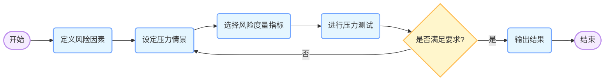

# 金融风险压力测试模型设计

> 关键词：金融风险、压力测试模型、风险度量、蒙特卡罗模拟、模型设计

> 摘要：本文围绕金融风险压力测试模型设计展开，详细介绍了相关背景知识，包括目的、预期读者等。深入阐述了核心概念及联系，通过文本示意图和Mermaid流程图清晰呈现。对核心算法原理进行讲解并给出Python源代码示例，同时分析了相关数学模型和公式。通过项目实战，展示了开发环境搭建、源代码实现与解读。探讨了实际应用场景，推荐了学习资源、开发工具框架和相关论文著作。最后总结了未来发展趋势与挑战，并提供常见问题解答和扩展阅读参考资料，旨在为金融领域从业者和研究者提供全面且深入的金融风险压力测试模型设计指导。

## 1. 背景介绍 
### 1.1 目的和范围
金融市场充满了不确定性和风险，金融机构需要一种有效的方法来评估其在极端情况下的风险承受能力。金融风险压力测试模型就是这样一种工具，它通过模拟各种极端但可能发生的情景，评估金融机构的资产组合、业务活动等在这些情景下的表现，以确定其潜在的损失和风险暴露程度。

本文的范围涵盖了金融风险压力测试模型的基本概念、核心算法、数学模型、实际应用以及相关工具和资源等方面。旨在为读者提供一个全面的金融风险压力测试模型设计的框架和方法，帮助读者理解和掌握如何设计和应用金融风险压力测试模型。

### 1.2 预期读者
本文预期读者包括金融机构的风险管理专家、分析师、金融科技开发者、学者以及对金融风险分析和建模感兴趣的人员。对于金融从业者，本文可以帮助他们更好地理解和应用金融风险压力测试模型，提高风险管理水平；对于开发者和学者，本文可以为他们的研究和开发工作提供理论和实践参考。

### 1.3 文档结构概述
本文将按照以下结构进行组织：
1. **背景介绍**：介绍金融风险压力测试模型设计的目的、预期读者和文档结构。
2. **核心概念与联系**：阐述金融风险压力测试模型的核心概念，如风险因素、压力情景、风险度量等，并通过文本示意图和Mermaid流程图展示它们之间的联系。
3. **核心算法原理 & 具体操作步骤**：详细讲解金融风险压力测试模型中常用的核心算法，如蒙特卡罗模拟、历史模拟法等，并给出Python源代码示例。
4. **数学模型和公式 & 详细讲解 & 举例说明**：介绍金融风险压力测试模型中涉及的数学模型和公式，如VaR（Value at Risk）、CVaR（Conditional Value at Risk）等，并通过具体例子进行说明。
5. **项目实战：代码实际案例和详细解释说明**：通过一个实际的项目案例，展示如何使用Python实现金融风险压力测试模型，包括开发环境搭建、源代码实现和代码解读。
6. **实际应用场景**：探讨金融风险压力测试模型在金融机构、监管机构等不同场景下的实际应用。
7. **工具和资源推荐**：推荐一些学习金融风险压力测试模型的资源，如书籍、在线课程、技术博客等，以及相关的开发工具和框架。
8. **总结：未来发展趋势与挑战**：总结金融风险压力测试模型的未来发展趋势和面临的挑战。
9. **附录：常见问题与解答**：解答读者在学习和应用金融风险压力测试模型过程中可能遇到的常见问题。
10. **扩展阅读 & 参考资料**：提供一些扩展阅读的资料和参考书目。

### 1.4 术语表
#### 1.4.1 核心术语定义
- **金融风险**：指金融机构在经营过程中，由于各种不确定因素的影响，导致其资产价值损失或收益波动的可能性。
- **压力测试**：一种风险管理技术，通过模拟极端但可能发生的情景，评估金融机构在这些情景下的风险承受能力。
- **风险因素**：影响金融资产价值或收益的各种变量，如利率、汇率、股票价格等。
- **压力情景**：人为设定的极端但可能发生的市场情景，用于评估金融机构在这些情景下的表现。
- **风险度量**：用于量化金融风险的指标，如VaR、CVaR等。

#### 1.4.2 相关概念解释
- **VaR（Value at Risk）**：在一定的置信水平和持有期内，某一金融资产或资产组合可能遭受的最大损失。
- **CVaR（Conditional Value at Risk）**：在一定的置信水平下，超过VaR的损失的期望值，也称为预期损失（ES，Expected Shortfall）。
- **蒙特卡罗模拟**：一种通过随机抽样来模拟随机变量的概率分布和统计特征的方法，常用于金融风险分析和定价。
- **历史模拟法**：一种基于历史数据的风险分析方法，通过回顾历史上的市场波动情况，来评估当前金融资产或资产组合的风险。

#### 1.4.3 缩略词列表
- **VaR**：Value at Risk
- **CVaR**：Conditional Value at Risk
- **ES**：Expected Shortfall
- **MC**：Monte Carlo

## 2. 核心概念与联系 
### 核心概念原理
金融风险压力测试模型的核心概念主要包括风险因素、压力情景和风险度量。

#### 风险因素
风险因素是影响金融资产价值或收益的各种变量。常见的风险因素包括市场风险因素（如利率、汇率、股票价格、商品价格等）、信用风险因素（如违约概率、违约损失率等）和操作风险因素（如系统故障、人为失误等）。风险因素的变化会导致金融资产价值的波动，从而产生金融风险。

#### 压力情景
压力情景是人为设定的极端但可能发生的市场情景。压力情景的设定通常基于历史事件、专家判断或统计分析。通过模拟压力情景，可以评估金融机构在极端情况下的风险承受能力。压力情景可以分为单一风险因素情景和多风险因素情景。单一风险因素情景只考虑一个风险因素的极端变化，而多风险因素情景则考虑多个风险因素的联合极端变化。

#### 风险度量
风险度量是用于量化金融风险的指标。常见的风险度量指标包括VaR、CVaR、标准差等。VaR是在一定的置信水平和持有期内，某一金融资产或资产组合可能遭受的最大损失。CVaR是在一定的置信水平下，超过VaR的损失的期望值。标准差是衡量金融资产收益波动程度的指标。

### 架构的文本示意图
```plaintext
金融风险压力测试模型
|-- 风险因素
|   |-- 市场风险因素
|   |   |-- 利率
|   |   |-- 汇率
|   |   |-- 股票价格
|   |   |-- 商品价格
|   |-- 信用风险因素
|   |   |-- 违约概率
|   |   |-- 违约损失率
|   |-- 操作风险因素
|       |-- 系统故障
|       |-- 人为失误
|-- 压力情景
|   |-- 单一风险因素情景
|   |-- 多风险因素情景
|-- 风险度量
|   |-- VaR
|   |-- CVaR
|   |-- 标准差
```

### Mermaid流程图


## 3. 核心算法原理 & 具体操作步骤 
### 蒙特卡罗模拟算法原理
蒙特卡罗模拟是一种通过随机抽样来模拟随机变量的概率分布和统计特征的方法。在金融风险压力测试中，蒙特卡罗模拟可以用于模拟风险因素的未来变化，从而评估金融资产或资产组合在不同情景下的价值和风险。

蒙特卡罗模拟的基本步骤如下：
1. **确定风险因素的概率分布**：根据历史数据或专家判断，确定风险因素的概率分布，如正态分布、对数正态分布等。
2. **生成随机样本**：根据风险因素的概率分布，使用随机数生成器生成大量的随机样本。
3. **计算资产价值**：对于每个随机样本，根据金融资产的定价模型，计算资产在该样本下的价值。
4. **统计分析**：对所有计算得到的资产价值进行统计分析，如计算均值、标准差、VaR、CVaR等。

### Python源代码示例
```python
import numpy as np
import matplotlib.pyplot as plt

# 定义参数
S0 = 100  # 初始股票价格
r = 0.05  # 无风险利率
sigma = 0.2  # 股票波动率
T = 1  # 时间期限（年）
N = 252  # 交易日数
M = 1000  # 模拟次数

# 生成随机样本
dt = T / N
t = np.linspace(0, T, N)
S = np.zeros((M, N))
S[:, 0] = S0

for i in range(M):
    for j in range(1, N):
        z = np.random.normal(0, 1)
        S[i, j] = S[i, j - 1] * np.exp((r - 0.5 * sigma**2) * dt + sigma * np.sqrt(dt) * z)

# 计算最终股票价格
ST = S[:, -1]

# 计算收益率
returns = (ST - S0) / S0

# 计算VaR和CVaR
confidence_level = 0.95
sorted_returns = np.sort(returns)
var_index = int((1 - confidence_level) * M)
VaR = -sorted_returns[var_index]
CVaR = -np.mean(sorted_returns[:var_index])

print(f"VaR at {confidence_level * 100}% confidence level: {VaR}")
print(f"CVaR at {confidence_level * 100}% confidence level: {CVaR}")

# 绘制股票价格路径
plt.figure(figsize=(10, 6))
for i in range(M):
    plt.plot(t, S[i, :], lw=0.5)
plt.title('Monte Carlo Simulation of Stock Prices')
plt.xlabel('Time (years)')
plt.ylabel('Stock Price')
plt.show()
```

### 具体操作步骤
1. **安装必要的库**：确保你已经安装了NumPy和Matplotlib库，可以使用以下命令进行安装：
```sh
pip install numpy matplotlib
```
2. **运行代码**：将上述代码保存为一个Python文件（如`monte_carlo_simulation.py`），然后在命令行中运行：
```sh
python monte_carlo_simulation.py
```
3. **分析结果**：代码将输出在指定置信水平下的VaR和CVaR值，并绘制股票价格的模拟路径图。

## 4. 数学模型和公式 & 详细讲解 & 举例说明 
### VaR（Value at Risk）
#### 数学公式
VaR是在一定的置信水平 $\alpha$ 和持有期 $T$ 内，某一金融资产或资产组合可能遭受的最大损失。数学上，VaR可以定义为：
$$
\text{VaR}_\alpha = -\inf\{l \in \mathbb{R}: P(L \leq l) \geq \alpha\}
$$
其中，$L$ 是金融资产或资产组合的损失随机变量，$P$ 是概率测度。

#### 详细讲解
VaR的含义是，在置信水平 $\alpha$ 下，金融资产或资产组合在持有期 $T$ 内的损失不会超过VaR值。例如，在95%的置信水平下，VaR值为100万元，表示在100次交易中，有95次的损失不会超过100万元。

#### 举例说明
假设某金融资产的损失服从正态分布 $N(\mu, \sigma^2)$，其中 $\mu = -0.05$，$\sigma = 0.1$。在95%的置信水平下，VaR值可以通过以下公式计算：
$$
\text{VaR}_{0.95} = -\mu - z_{0.95} \sigma
$$
其中，$z_{0.95}$ 是标准正态分布的95%分位数，约为1.645。代入数值计算可得：
$$
\text{VaR}_{0.95} = -(-0.05) - 1.645 \times 0.1 = 0.05 - 0.1645 = -0.1145
$$
即该金融资产在95%的置信水平下的VaR值为11.45%。

### CVaR（Conditional Value at Risk）
#### 数学公式
CVaR是在一定的置信水平 $\alpha$ 下，超过VaR的损失的期望值。数学上，CVaR可以定义为：
$$
\text{CVaR}_\alpha = E[L | L \geq \text{VaR}_\alpha]
$$
其中，$E$ 是期望算子。

#### 详细讲解
CVaR考虑了超过VaR的损失情况，因此比VaR更能反映金融资产或资产组合在极端情况下的风险。例如，在95%的置信水平下，CVaR值表示在5%的最坏情况下的平均损失。

#### 举例说明
继续以上述金融资产为例，在95%的置信水平下，CVaR值可以通过以下公式计算：
$$
\text{CVaR}_{0.95} = \mu + \frac{\phi(z_{0.95})}{1 - \alpha} \sigma
$$
其中，$\phi$ 是标准正态分布的概率密度函数。代入数值计算可得：
$$
\text{CVaR}_{0.95} = -0.05 + \frac{\phi(1.645)}{1 - 0.95} \times 0.1
$$
通过查标准正态分布表可知，$\phi(1.645) \approx 0.1031$，代入计算可得：
$$
\text{CVaR}_{0.95} = -0.05 + \frac{0.1031}{0.05} \times 0.1 = -0.05 + 0.2062 = 0.1562
$$
即该金融资产在95%的置信水平下的CVaR值为15.62%。

## 5. 项目实战：代码实际案例和详细解释说明 
### 5.1  开发环境搭建
#### 安装Python
首先，确保你已经安装了Python 3.x版本。可以从Python官方网站（https://www.python.org/downloads/）下载并安装适合你操作系统的Python版本。

#### 安装必要的库
在项目中，我们将使用NumPy、Pandas和Matplotlib库。可以使用以下命令进行安装：
```sh
pip install numpy pandas matplotlib
```

### 5.2  源代码详细实现和代码解读
```python
import numpy as np
import pandas as pd
import matplotlib.pyplot as plt

# 生成模拟数据
np.random.seed(0)
n_assets = 3
n_periods = 252
returns = pd.DataFrame(np.random.normal(0, 0.01, (n_periods, n_assets)),
                       columns=[f'Asset {i+1}' for i in range(n_assets)])

# 计算资产组合的权重
weights = np.array([0.3, 0.4, 0.3])

# 计算资产组合的收益率
portfolio_returns = returns.dot(weights)

# 计算VaR和CVaR
confidence_level = 0.95
sorted_returns = np.sort(portfolio_returns)
var_index = int((1 - confidence_level) * n_periods)
VaR = -sorted_returns[var_index]
CVaR = -np.mean(sorted_returns[:var_index])

print(f"VaR at {confidence_level * 100}% confidence level: {VaR}")
print(f"CVaR at {confidence_level * 100}% confidence level: {CVaR}")

# 绘制资产组合收益率的直方图
plt.figure(figsize=(10, 6))
plt.hist(portfolio_returns, bins=50, density=True, alpha=0.7)
plt.axvline(-VaR, color='r', linestyle='--', label=f'VaR at {confidence_level * 100}%')
plt.axvline(-CVaR, color='g', linestyle='--', label=f'CVaR at {confidence_level * 100}%')
plt.title('Portfolio Returns Distribution')
plt.xlabel('Returns')
plt.ylabel('Density')
plt.legend()
plt.show()
```

### 5.3  代码解读与分析
#### 数据生成
```python
np.random.seed(0)
n_assets = 3
n_periods = 252
returns = pd.DataFrame(np.random.normal(0, 0.01, (n_periods, n_assets)),
                       columns=[f'Asset {i+1}' for i in range(n_assets)])
```
这段代码使用NumPy生成了3个资产在252个交易日的模拟收益率数据，并将其存储在Pandas DataFrame中。

#### 计算资产组合的权重和收益率
```python
weights = np.array([0.3, 0.4, 0.3])
portfolio_returns = returns.dot(weights)
```
这段代码定义了资产组合的权重，并使用矩阵乘法计算了资产组合的收益率。

#### 计算VaR和CVaR
```python
confidence_level = 0.95
sorted_returns = np.sort(portfolio_returns)
var_index = int((1 - confidence_level) * n_periods)
VaR = -sorted_returns[var_index]
CVaR = -np.mean(sorted_returns[:var_index])
```
这段代码根据给定的置信水平计算了资产组合的VaR和CVaR值。

#### 绘制直方图
```python
plt.figure(figsize=(10, 6))
plt.hist(portfolio_returns, bins=50, density=True, alpha=0.7)
plt.axvline(-VaR, color='r', linestyle='--', label=f'VaR at {confidence_level * 100}%')
plt.axvline(-CVaR, color='g', linestyle='--', label=f'CVaR at {confidence_level * 100}%')
plt.title('Portfolio Returns Distribution')
plt.xlabel('Returns')
plt.ylabel('Density')
plt.legend()
plt.show()
```
这段代码使用Matplotlib绘制了资产组合收益率的直方图，并在图中标记了VaR和CVaR值。

## 6. 实际应用场景 
### 金融机构内部风险管理
金融机构可以使用金融风险压力测试模型来评估其资产组合、业务活动等在极端情况下的风险承受能力。通过压力测试，金融机构可以发现潜在的风险点，调整资产配置和风险管理策略，以降低风险暴露程度。例如，银行可以使用压力测试模型评估其贷款组合在经济衰退、利率大幅上升等极端情景下的违约风险和损失情况。

### 监管机构监督
监管机构可以要求金融机构进行压力测试，并根据测试结果评估金融机构的风险状况和资本充足率。监管机构可以使用压力测试模型来设定监管要求和资本缓冲，以确保金融机构在极端情况下能够保持稳健运营。例如，巴塞尔委员会要求全球系统重要性银行进行年度压力测试，以评估其在严重经济衰退和金融市场动荡情景下的风险承受能力。

### 投资决策
投资者可以使用金融风险压力测试模型来评估投资组合在不同市场情景下的风险和收益。通过压力测试，投资者可以了解投资组合的风险特征，选择合适的投资策略和资产配置。例如，投资者可以使用压力测试模型评估股票、债券、基金等不同资产在市场暴跌、利率波动等情景下的表现，以制定合理的投资计划。

### 新产品开发和定价
金融机构在开发新产品和制定价格时，可以使用金融风险压力测试模型来评估新产品的风险和收益特征。通过压力测试，金融机构可以确定新产品的合理价格和风险溢价，以确保产品的盈利能力和风险可控性。例如，保险公司在开发新的保险产品时，可以使用压力测试模型评估保险产品在不同风险情景下的赔付情况，以制定合理的保险费率。

## 7. 工具和资源推荐
### 7.1 学习资源推荐
#### 7.1.1 书籍推荐
- 《风险管理与金融机构》（John C. Hull著）：本书全面介绍了金融风险管理的基本概念、方法和技术，包括市场风险、信用风险、操作风险等方面的内容。
- 《金融时间序列分析》（Ruey S. Tsay著）：本书详细介绍了金融时间序列分析的理论和方法，包括线性时间序列模型、ARCH模型、GARCH模型等，以及这些模型在金融风险管理中的应用。
- 《金融计量经济学基础》（Chris Brooks著）：本书介绍了金融计量经济学的基本概念、方法和技术，包括回归分析、时间序列分析、面板数据模型等，以及这些方法在金融风险管理和投资决策中的应用。

#### 7.1.2 在线课程
- Coursera上的“Financial Risk Management Specialization”：该课程由纽约大学斯特恩商学院的教授授课，涵盖了金融风险管理的各个方面，包括市场风险、信用风险、操作风险等。
- edX上的“Introduction to Financial Risk Management”：该课程由麻省理工学院的教授授课，介绍了金融风险管理的基本概念、方法和技术，以及金融市场的基本原理。
- Udemy上的“Python for Finance: Investment Fundamentals & Data Analytics”：该课程介绍了如何使用Python进行金融数据分析和投资决策，包括数据获取、数据处理、风险度量、投资组合优化等方面的内容。

#### 7.1.3 技术博客和网站
- QuantNet（https://www.quantnet.com/）：一个专注于金融量化分析和风险管理的社区，提供了丰富的学习资源、论坛讨论和职业发展信息。
- Towards Data Science（https://towardsdatascience.com/）：一个数据科学和机器学习领域的博客平台，有很多关于金融数据分析和风险管理的文章。
- Risk.net（https://www.risk.net/）：一个专注于金融风险管理的新闻和资讯网站，提供了最新的行业动态、研究报告和专家观点。

### 7.2 开发工具框架推荐
#### 7.2.1 IDE和编辑器
- PyCharm：一款功能强大的Python集成开发环境，提供了代码编辑、调试、版本控制等功能，适合开发大型的Python项目。
- Jupyter Notebook：一个交互式的开发环境，支持Python、R等多种编程语言，适合进行数据分析和模型开发。
- Visual Studio Code：一款轻量级的代码编辑器，支持多种编程语言和插件，适合快速开发和调试代码。

#### 7.2.2 调试和性能分析工具
- PDB：Python自带的调试器，可以帮助开发者定位和解决代码中的问题。
- cProfile：Python的性能分析工具，可以帮助开发者找出代码中的性能瓶颈。
- Py-Spy：一个轻量级的Python性能分析工具，可以实时监控Python程序的性能。

#### 7.2.3 相关框架和库
- NumPy：一个用于科学计算的Python库，提供了高效的多维数组对象和数学函数。
- Pandas：一个用于数据处理和分析的Python库，提供了数据结构和数据操作工具。
- Matplotlib：一个用于数据可视化的Python库，提供了丰富的绘图函数和工具。
- Scikit-learn：一个用于机器学习的Python库，提供了各种机器学习算法和工具。

### 7.3 相关论文著作推荐
#### 7.3.1 经典论文
- Jorion, P. (1996). Value at Risk: The New Benchmark for Managing Financial Risk. McGraw-Hill. 这本书是VaR方法的经典著作，详细介绍了VaR的概念、计算方法和应用。
- Artzner, P., Delbaen, F., Eber, J. -M., & Heath, D. (1999). Coherent measures of risk. Mathematical Finance, 9(3), 203 - 228. 这篇论文提出了一致性风险度量的概念，为风险度量理论的发展奠定了基础。
- Engle, R. F. (1982). Autoregressive conditional heteroscedasticity with estimates of the variance of United Kingdom inflation. Econometrica, 50(4), 987 - 1007. 这篇论文提出了ARCH模型，开创了金融时间序列波动性建模的先河。

#### 7.3.2 最新研究成果
- Adrian, T., & Brunnermeier, M. K. (2016). CoVaR. American Economic Review, 106(7), 1705 - 1741. 这篇论文提出了CoVaR的概念，用于度量金融机构之间的系统性风险溢出效应。
- Giglio, S., Kelly, B. T., & Pruitt, S. (2021). Macroeconomic tail risks. Annual Review of Financial Economics, 13, 227 - 253. 这篇论文研究了宏观经济尾部风险的度量和影响。
- Barroso, P., & Santa-Clara, P. (2015). Momentum has its moments. Journal of Financial Economics, 116(1), 111 - 120. 这篇论文研究了动量策略的风险和收益特征。

#### 7.3.3 应用案例分析
- Basel Committee on Banking Supervision. (2018). Guidance on credit risk and accounting for expected credit losses. 这份报告介绍了巴塞尔委员会关于信用风险和预期信用损失会计处理的指导意见，以及压力测试在信用风险管理中的应用。
- European Central Bank. (2020). Financial stability review. 这份报告是欧洲央行发布的金融稳定报告，其中包含了欧洲金融体系的压力测试结果和风险评估。
- Federal Reserve. (2021). Dodd - Frank Act stress test 2021: Supervisory stress test methodology and results. 这份报告是美联储发布的多德 - 弗兰克法案压力测试报告，详细介绍了压力测试的方法和结果，以及对美国银行业的风险评估。

## 8. 总结：未来发展趋势与挑战
### 未来发展趋势
#### 多风险因素综合分析
未来的金融风险压力测试模型将更加注重多风险因素的综合分析。随着金融市场的日益复杂和全球化，金融风险之间的关联性越来越强，单一风险因素的压力测试已经不能满足风险管理的需求。因此，需要开发能够同时考虑市场风险、信用风险、操作风险等多种风险因素的综合压力测试模型。

#### 宏观经济情景分析
宏观经济因素对金融机构的风险状况有着重要的影响。未来的金融风险压力测试模型将更加注重宏观经济情景分析，通过模拟不同的宏观经济情景，评估金融机构在宏观经济波动下的风险承受能力。例如，可以结合宏观经济模型和金融风险模型，构建宏观审慎压力测试框架。

#### 人工智能和机器学习的应用
人工智能和机器学习技术在金融领域的应用越来越广泛。未来的金融风险压力测试模型将更多地应用人工智能和机器学习算法，如深度学习、强化学习等，以提高模型的准确性和预测能力。例如，可以使用深度学习算法对金融数据进行分析和建模，挖掘数据中的潜在模式和规律。

#### 实时监测和动态调整
随着金融市场的快速变化，金融机构需要实时监测其风险状况，并及时调整风险管理策略。未来的金融风险压力测试模型将具备实时监测和动态调整的功能，能够根据市场变化实时更新压力情景和风险度量指标，为金融机构提供及时有效的风险管理决策支持。

### 挑战
#### 数据质量和可用性
金融风险压力测试模型需要大量的高质量数据作为输入。然而，金融数据往往存在数据缺失、数据错误、数据不一致等问题，这会影响模型的准确性和可靠性。此外，一些新兴金融业务和风险因素的数据可能难以获取，这也给压力测试模型的构建带来了挑战。

#### 模型复杂度和可解释性
随着金融风险压力测试模型的不断发展，模型的复杂度也越来越高。复杂的模型虽然可以提高模型的准确性和预测能力，但也会增加模型的可解释性难度。金融机构和监管机构需要能够理解模型的运行机制和结果，以便做出合理的风险管理决策。因此，如何在提高模型复杂度的同时保持模型的可解释性是一个亟待解决的问题。

#### 情景设定的合理性
压力情景的设定是金融风险压力测试的关键环节。合理的压力情景应该能够反映极端但可能发生的市场情景，同时又不能过于极端而失去实际意义。然而，如何确定合理的压力情景是一个具有挑战性的问题，需要考虑历史数据、专家判断、宏观经济形势等多种因素。

#### 模型验证和校准
金融风险压力测试模型需要进行严格的验证和校准，以确保模型的准确性和可靠性。模型验证和校准需要使用大量的历史数据和实际案例，同时还需要考虑模型的假设条件和局限性。然而，由于金融市场的不确定性和复杂性，模型验证和校准是一个不断迭代和改进的过程，需要耗费大量的时间和精力。

## 9. 附录：常见问题与解答
### 问题1：金融风险压力测试模型和传统风险管理方法有什么区别？
答：传统风险管理方法主要基于历史数据和统计分析，通过计算风险指标（如标准差、VaR等）来评估金融风险。而金融风险压力测试模型则更加注重极端情景的模拟和分析，通过设定极端但可能发生的市场情景，评估金融机构在这些情景下的风险承受能力。压力测试模型可以发现传统风险管理方法可能忽略的潜在风险，为金融机构提供更全面的风险管理决策支持。

### 问题2：如何选择合适的风险度量指标？
答：选择合适的风险度量指标需要考虑多个因素，如风险类型、投资目标、风险偏好等。常见的风险度量指标包括VaR、CVaR、标准差等。VaR是一种常用的风险度量指标，它可以在一定的置信水平下衡量金融资产或资产组合的最大损失。CVaR则考虑了超过VaR的损失情况，更能反映金融资产或资产组合在极端情况下的风险。标准差是衡量金融资产收益波动程度的指标。在实际应用中，可以根据具体情况选择合适的风险度量指标，也可以同时使用多个指标进行综合评估。

### 问题3：压力情景的设定有哪些方法？
答：压力情景的设定方法主要有以下几种：
1. **历史情景法**：基于历史上的重大金融事件，如金融危机、股市崩盘等，设定相应的压力情景。这种方法的优点是具有实际参考价值，但缺点是历史事件可能不会完全重复，而且可能无法涵盖所有可能的极端情景。
2. **专家判断法**：由金融专家根据市场经验和专业知识，设定压力情景。这种方法的优点是可以考虑到一些难以用数据量化的因素，但缺点是主观性较强，不同专家的判断可能存在差异。
3. **统计分析法**：通过对历史数据进行统计分析，找出市场变量的极端值和相关性，从而设定压力情景。这种方法的优点是具有一定的客观性和科学性，但缺点是需要大量的历史数据，而且对数据的质量要求较高。
4. **情景生成法**：使用随机模拟或优化算法，生成一系列可能的压力情景。这种方法的优点是可以涵盖更广泛的情景空间，但缺点是计算复杂度较高，需要较强的计算能力和技术支持。

### 问题4：如何验证金融风险压力测试模型的准确性？
答：验证金融风险压力测试模型的准确性可以从以下几个方面入手：
1. **历史数据验证**：使用历史数据对模型进行回测，比较模型预测结果与实际情况的差异。如果模型预测结果与实际情况相符，则说明模型具有一定的准确性。
2. **敏感性分析**：对模型的输入参数进行敏感性分析，评估参数变化对模型输出结果的影响。如果模型对输入参数的变化不敏感，则说明模型具有较好的稳定性和可靠性。
3. **与其他模型比较**：将本模型的结果与其他同类模型的结果进行比较，如果结果相近，则说明模型具有一定的合理性。
4. **压力测试结果的合理性分析**：对压力测试结果进行合理性分析，检查结果是否符合经济逻辑和实际情况。例如，压力测试结果是否过于极端或不合理，如果是，则需要对模型进行调整和改进。

## 10. 扩展阅读 & 参考资料
### 扩展阅读
- 《金融风险管理师（FRM）考试教材》：全面介绍了金融风险管理的各个方面，包括市场风险、信用风险、操作风险等，是学习金融风险管理的重要参考资料。
- 《高级金融风险管理》（Peter Christoffersen著）：深入探讨了金融风险管理的高级理论和方法，适合有一定基础的读者进一步学习。
- 《金融市场与金融机构基础》（Frank J. Fabozzi等著）：介绍了金融市场和金融机构的基本原理和运作机制，有助于读者更好地理解金融风险的来源和影响。

### 参考资料
- Basel Committee on Banking Supervision. (2019). Principles for the sound management of operational risk.
- European Banking Authority. (2020). Guidelines on stress testing.
- International Organization of Securities Commissions. (2018). Principles for financial market infrastructures.

作者：AI天才研究院/AI Genius Institute & 禅与计算机程序设计艺术 /Zen And The Art of Computer Programming