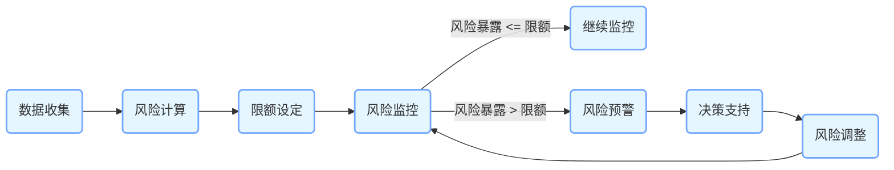

# 金融风险限额管理系统设计

> 关键词：金融风险、限额管理系统、系统设计、风险控制、金融科技

> 摘要：本文围绕金融风险限额管理系统设计展开，详细阐述了系统设计的背景、核心概念、算法原理、数学模型等内容。通过逐步分析推理，介绍了如何搭建开发环境、实现源代码并进行解读。同时，探讨了系统的实际应用场景，推荐了相关的学习资源、开发工具和论文著作。最后，对金融风险限额管理系统的未来发展趋势与挑战进行了总结，并给出常见问题的解答和扩展阅读参考资料，旨在为金融行业的风险限额管理提供全面且深入的技术指导。

## 1. 背景介绍 
### 1.1 目的和范围
金融行业面临着各种各样的风险，如信用风险、市场风险、流动性风险等。风险限额管理是金融机构控制风险、保障稳健运营的重要手段。本系统设计的目的是构建一个高效、准确、灵活的金融风险限额管理系统，帮助金融机构对各类风险进行量化评估和有效控制。

系统的范围涵盖了多种金融业务场景，包括但不限于银行信贷业务、证券投资业务、保险业务等。系统将实现风险限额的设定、监控、预警和调整等功能，确保金融机构在风险可控的前提下实现业务目标。

### 1.2 预期读者
本文的预期读者包括金融行业的从业者，如风险管理人员、金融分析师、IT 技术人员等；对金融科技和风险管理感兴趣的研究人员和学者；以及相关专业的学生。

### 1.3 文档结构概述
本文将按照以下结构进行阐述：首先介绍金融风险限额管理系统设计的背景信息，包括目的、范围、预期读者和文档结构概述；接着讲解核心概念与联系，通过文本示意图和 Mermaid 流程图展示系统的原理和架构；然后详细介绍核心算法原理和具体操作步骤，并使用 Python 源代码进行阐述；随后介绍数学模型和公式，并通过举例说明其应用；再通过项目实战展示代码的实际案例和详细解释；之后探讨系统的实际应用场景；推荐相关的工具和资源；最后总结系统的未来发展趋势与挑战，提供常见问题的解答和扩展阅读参考资料。

### 1.4 术语表
#### 1.4.1 核心术语定义
- **金融风险**：指金融机构在经营过程中，由于各种不确定因素的影响，导致其资产、收益或信誉遭受损失的可能性。常见的金融风险包括信用风险、市场风险、流动性风险等。
- **风险限额**：是金融机构为了控制风险，根据自身的风险承受能力和经营目标，对各类风险设定的最大可承受损失金额或比例。
- **风险限额管理**：是指金融机构通过设定、监控和调整风险限额，对各类风险进行有效控制和管理的过程。
- **风险度量指标**：用于量化金融风险的指标，如 Value at Risk (VaR)、Expected Shortfall (ES) 等。

#### 1.4.2 相关概念解释
- **信用风险**：指借款人或交易对手未能履行合同义务而导致金融机构遭受损失的风险。
- **市场风险**：指由于市场价格波动（如利率、汇率、股票价格等）而导致金融机构资产价值变动的风险。
- **流动性风险**：指金融机构无法及时以合理价格变现资产或获得足够资金，以满足其支付义务的风险。

#### 1.4.3 缩略词列表
- **VaR**：Value at Risk，在险价值
- **ES**：Expected Shortfall，预期损失
- **IT**：Information Technology，信息技术
- **API**：Application Programming Interface，应用程序编程接口

## 2. 核心概念与联系 

### 核心概念原理
金融风险限额管理系统的核心原理是通过对金融业务中的各类风险进行量化评估，设定相应的风险限额，并实时监控风险暴露情况。当风险暴露超过限额时，系统将发出预警信号，提醒风险管理人员采取相应的措施进行调整。

系统主要涉及以下几个核心概念：
- **风险识别**：识别金融业务中可能面临的各类风险，如信用风险、市场风险、流动性风险等。
- **风险度量**：使用合适的风险度量指标对风险进行量化评估，如 VaR、ES 等。
- **风险限额设定**：根据金融机构的风险承受能力和经营目标，为各类风险设定合理的限额。
- **风险监控**：实时监控金融业务的风险暴露情况，确保风险暴露在限额范围内。
- **风险预警**：当风险暴露超过限额时，系统发出预警信号，提醒风险管理人员采取措施。
- **风险调整**：根据预警信号，风险管理人员采取相应的措施对业务进行调整，以降低风险暴露。

### 架构的文本示意图
金融风险限额管理系统的架构可以分为以下几个层次：
- **数据层**：负责收集、存储和管理金融业务相关的数据，包括市场数据、客户数据、交易数据等。
- **风险计算层**：使用风险度量模型对收集到的数据进行分析和计算，得出各类风险的量化评估结果。
- **限额管理层**：根据金融机构的风险承受能力和经营目标，设定和管理各类风险限额。
- **监控预警层**：实时监控风险暴露情况，当风险暴露超过限额时，发出预警信号。
- **决策支持层**：为风险管理人员提供决策支持，帮助他们根据预警信号采取相应的措施。
- **用户界面层**：为用户提供友好的操作界面，方便用户进行系统配置、数据查询、报表生成等操作。

### Mermaid 流程图


## 3. 核心算法原理 & 具体操作步骤 

### 核心算法原理
在金融风险限额管理系统中，常用的风险度量指标是 Value at Risk (VaR) 和 Expected Shortfall (ES)。下面分别介绍这两个指标的原理和计算方法。

#### Value at Risk (VaR)
VaR 是指在一定的置信水平和持有期内，金融资产或投资组合可能遭受的最大损失。例如，在 95% 的置信水平下，一天的 VaR 为 100 万元，表示在未来一天内，该资产或投资组合有 95% 的可能性损失不超过 100 万元。

VaR 的计算方法有多种，常见的有历史模拟法、方差 - 协方差法和蒙特卡罗模拟法。下面以历史模拟法为例，介绍 VaR 的计算步骤：
1. 收集历史数据：收集金融资产或投资组合的历史收益率数据。
2. 排序：将历史收益率数据按照从小到大的顺序进行排序。
3. 确定分位数：根据置信水平确定对应的分位数。例如，在 95% 的置信水平下，分位数为 0.05。
4. 计算 VaR：根据分位数找到对应的历史收益率，将其乘以资产或投资组合的价值，得到 VaR。

#### Expected Shortfall (ES)
ES 是指在一定的置信水平下，当金融资产或投资组合的损失超过 VaR 时，平均损失的大小。ES 考虑了极端损失的情况，比 VaR 更能反映金融风险的真实情况。

ES 的计算方法是在计算 VaR 的基础上，对超过 VaR 的损失进行平均。具体步骤如下：
1. 计算 VaR：使用上述方法计算出在一定置信水平下的 VaR。
2. 筛选数据：筛选出历史收益率中小于 VaR 对应的收益率的数据。
3. 计算 ES：对筛选出的数据求平均值，将其乘以资产或投资组合的价值，得到 ES。

### 具体操作步骤及 Python 源代码
下面是使用 Python 实现历史模拟法计算 VaR 和 ES 的代码示例：

```python
import numpy as np

def historical_var(returns, confidence_level=0.95):
    """
    使用历史模拟法计算 VaR
    :param returns: 历史收益率数据
    :param confidence_level: 置信水平
    :return: VaR 值
    """
    sorted_returns = np.sort(returns)
    index = int((1 - confidence_level) * len(sorted_returns))
    var = -sorted_returns[index]
    return var

def historical_es(returns, confidence_level=0.95):
    """
    使用历史模拟法计算 ES
    :param returns: 历史收益率数据
    :param confidence_level: 置信水平
    :return: ES 值
    """
    var = historical_var(returns, confidence_level)
    tail_returns = returns[returns < -var]
    es = -np.mean(tail_returns)
    return es

# 示例数据
returns = np.random.normal(0, 0.01, 1000)  # 生成 1000 个随机收益率数据
confidence_level = 0.95

# 计算 VaR 和 ES
var = historical_var(returns, confidence_level)
es = historical_es(returns, confidence_level)

print(f"VaR ({confidence_level * 100}%): {var}")
print(f"ES ({confidence_level * 100}%): {es}")
```

### 代码解释
1. `historical_var` 函数：该函数接受历史收益率数据和置信水平作为输入，使用历史模拟法计算 VaR。首先对历史收益率数据进行排序，然后根据置信水平确定分位数对应的索引，最后返回对应的收益率的相反数作为 VaR。
2. `historical_es` 函数：该函数接受历史收益率数据和置信水平作为输入，使用历史模拟法计算 ES。首先调用 `historical_var` 函数计算 VaR，然后筛选出历史收益率中小于 -VaR 的数据，最后对筛选出的数据求平均值并取相反数作为 ES。
3. 示例数据：使用 `np.random.normal` 函数生成 1000 个随机收益率数据，置信水平设置为 0.95。
4. 计算 VaR 和 ES：调用 `historical_var` 和 `historical_es` 函数计算 VaR 和 ES，并打印结果。

## 4. 数学模型和公式 & 详细讲解 & 举例说明 

### Value at Risk (VaR)
#### 数学公式
在历史模拟法中，VaR 的计算公式为：
$$VaR_{\alpha} = -R_{(n(1 - \alpha))}$$
其中，$VaR_{\alpha}$ 表示在置信水平 $\alpha$ 下的 VaR，$R_{(i)}$ 表示排序后的第 $i$ 个历史收益率，$n$ 表示历史收益率数据的数量。

#### 详细讲解
该公式的含义是，在历史模拟法中，我们首先将历史收益率数据按照从小到大的顺序进行排序，然后根据置信水平 $\alpha$ 确定对应的分位数 $n(1 - \alpha)$，找到排序后对应位置的历史收益率 $R_{(n(1 - \alpha))}$，最后取其相反数作为 VaR。

#### 举例说明
假设我们有 100 个历史收益率数据，置信水平为 95%。则 $n = 100$，$\alpha = 0.95$，$n(1 - \alpha) = 100\times(1 - 0.95) = 5$。我们将历史收益率数据排序后，取第 5 个数据的相反数作为 VaR。

### Expected Shortfall (ES)
#### 数学公式
ES 的计算公式为：
$$ES_{\alpha} = -\frac{1}{n(1 - \alpha)}\sum_{i = 1}^{n(1 - \alpha)}R_{(i)}$$
其中，$ES_{\alpha}$ 表示在置信水平 $\alpha$ 下的 ES，$R_{(i)}$ 表示排序后的第 $i$ 个历史收益率，$n$ 表示历史收益率数据的数量。

#### 详细讲解
该公式的含义是，在计算 ES 时，我们首先计算出在置信水平 $\alpha$ 下的 VaR，然后筛选出历史收益率中小于 -VaR 的数据，对这些数据求平均值并取相反数作为 ES。

#### 举例说明
假设我们已经计算出在 95% 置信水平下的 VaR，筛选出历史收益率中小于 -VaR 的数据有 5 个，分别为 -0.02、-0.03、-0.04、-0.05、-0.06。则 ES 为：
$$ES_{0.95} = -\frac{(-0.02 - 0.03 - 0.04 - 0.05 - 0.06)}{5} = 0.04$$

## 5. 项目实战：代码实际案例和详细解释说明 

### 5.1  开发环境搭建
#### 操作系统
可以选择 Windows、Linux 或 macOS 操作系统。

#### Python 环境
建议使用 Python 3.7 及以上版本。可以从 Python 官方网站（https://www.python.org/downloads/）下载并安装 Python。

#### 第三方库
需要安装以下第三方库：
- `numpy`：用于数值计算。
- `pandas`：用于数据处理和分析。
- `matplotlib`：用于数据可视化。

可以使用以下命令安装这些库：
```sh
pip install numpy pandas matplotlib
```

### 5.2  源代码详细实现和代码解读
下面是一个完整的金融风险限额管理系统的代码示例，包括数据读取、风险计算、限额设定、监控预警等功能。

```python
import numpy as np
import pandas as pd
import matplotlib.pyplot as plt

# 读取历史数据
def read_data(file_path):
    data = pd.read_csv(file_path)
    returns = data['returns'].values
    return returns

# 历史模拟法计算 VaR
def historical_var(returns, confidence_level=0.95):
    sorted_returns = np.sort(returns)
    index = int((1 - confidence_level) * len(sorted_returns))
    var = -sorted_returns[index]
    return var

# 历史模拟法计算 ES
def historical_es(returns, confidence_level=0.95):
    var = historical_var(returns, confidence_level)
    tail_returns = returns[returns < -var]
    es = -np.mean(tail_returns)
    return es

# 设定风险限额
def set_limit(var, es, limit_factor=1.2):
    var_limit = var * limit_factor
    es_limit = es * limit_factor
    return var_limit, es_limit

# 监控风险暴露
def monitor_risk(returns, var_limit, es_limit, confidence_level=0.95):
    current_var = historical_var(returns, confidence_level)
    current_es = historical_es(returns, confidence_level)
    if current_var > var_limit or current_es > es_limit:
        print("风险暴露超过限额！")
    else:
        print("风险暴露在限额范围内。")
    return current_var, current_es

# 主函数
def main():
    file_path = 'historical_returns.csv'
    returns = read_data(file_path)
    confidence_level = 0.95

    # 计算 VaR 和 ES
    var = historical_var(returns, confidence_level)
    es = historical_es(returns, confidence_level)

    # 设定风险限额
    var_limit, es_limit = set_limit(var, es)

    # 监控风险暴露
    current_var, current_es = monitor_risk(returns, var_limit, es_limit, confidence_level)

    # 数据可视化
    plt.figure(figsize=(10, 6))
    plt.hist(returns, bins=50, alpha=0.7, label='Returns')
    plt.axvline(-var, color='r', linestyle='--', label=f'VaR ({confidence_level * 100}%)')
    plt.axvline(-es, color='g', linestyle='--', label=f'ES ({confidence_level * 100}%)')
    plt.xlabel('Returns')
    plt.ylabel('Frequency')
    plt.title('Historical Returns, VaR, and ES')
    plt.legend()
    plt.show()

if __name__ == "__main__":
    main()
```

### 代码解读与分析
1. `read_data` 函数：该函数接受一个 CSV 文件的路径作为输入，使用 `pandas` 库读取文件中的历史收益率数据，并返回一个 `numpy` 数组。
2. `historical_var` 和 `historical_es` 函数：这两个函数分别使用历史模拟法计算 VaR 和 ES，具体实现与前面介绍的代码示例相同。
3. `set_limit` 函数：该函数接受 VaR 和 ES 的值以及一个限额因子作为输入，根据限额因子计算 VaR 和 ES 的限额，并返回这两个限额值。
4. `monitor_risk` 函数：该函数接受历史收益率数据、VaR 限额和 ES 限额作为输入，计算当前的 VaR 和 ES，并与限额进行比较。如果当前的 VaR 或 ES 超过限额，则打印“风险暴露超过限额！”，否则打印“风险暴露在限额范围内。”。
5. `main` 函数：该函数是程序的入口点，调用上述函数完成数据读取、风险计算、限额设定、监控预警和数据可视化等操作。
6. 数据可视化：使用 `matplotlib` 库绘制历史收益率的直方图，并在图中标记出 VaR 和 ES 的位置，方便用户直观地观察风险情况。

## 6. 实际应用场景 
### 银行信贷业务
在银行信贷业务中，风险限额管理系统可以帮助银行对借款人的信用风险进行评估和控制。银行可以根据借款人的信用评级、财务状况等因素，为每个借款人设定信用风险限额。在贷款发放过程中，系统实时监控借款人的信用风险暴露情况，当风险暴露超过限额时，及时发出预警信号，银行可以采取相应的措施，如要求借款人提供额外的担保、提前收回贷款等，以降低信用风险。

### 证券投资业务
在证券投资业务中，风险限额管理系统可以帮助投资者对投资组合的市场风险进行管理。投资者可以根据自己的风险承受能力和投资目标，为投资组合设定市场风险限额，如 VaR 限额、ES 限额等。系统实时监控投资组合的市场风险暴露情况，当风险暴露超过限额时，发出预警信号，投资者可以根据预警信号调整投资组合的结构，如卖出部分高风险资产、买入低风险资产等，以降低市场风险。

### 保险业务
在保险业务中，风险限额管理系统可以帮助保险公司对保险业务的风险进行评估和控制。保险公司可以根据保险产品的类型、风险特征等因素，为每个保险业务设定风险限额。在保险业务开展过程中，系统实时监控保险业务的风险暴露情况，当风险暴露超过限额时，及时发出预警信号，保险公司可以采取相应的措施，如调整保险费率、限制保险业务规模等，以降低保险业务的风险。

## 7. 工具和资源推荐
### 7.1 学习资源推荐
#### 7.1.1 书籍推荐
- 《金融风险管理师（FRM）考试指定教材》：全面介绍了金融风险管理的理论和实践，是学习金融风险管理的经典教材。
- 《风险价值：金融风险管理新标准》：详细介绍了 VaR 的计算方法和应用，是学习 VaR 的重要参考书籍。
- 《金融计量学：从初级到高级建模技术》：介绍了金融计量学的基本理论和方法，包括风险度量、资产定价等内容。

#### 7.1.2 在线课程
- Coursera 上的“Financial Risk Management”课程：由知名教授授课，系统介绍了金融风险管理的知识和技能。
- edX 上的“Introduction to Financial Risk Management”课程：提供了金融风险管理的入门知识，适合初学者学习。

#### 7.1.3 技术博客和网站
- 量化投资与机器学习论坛（https://www.joinquant.com/）：提供了丰富的量化投资和金融风险管理的技术文章和案例。
- 金融界（https://www.jrj.com.cn/）：提供了金融市场的实时行情和相关资讯，有助于了解金融行业的动态。

### 7.2 开发工具框架推荐
#### 7.2.1 IDE和编辑器
- PyCharm：是一款专业的 Python 集成开发环境，提供了丰富的代码编辑、调试、分析等功能。
- Jupyter Notebook：是一个交互式的开发环境，适合进行数据探索和模型验证。

#### 7.2.2 调试和性能分析工具
- Py-Spy：是一个用于分析 Python 程序性能的工具，可以帮助开发者找出程序中的性能瓶颈。
- PDB：是 Python 自带的调试器，可以帮助开发者调试 Python 代码。

#### 7.2.3 相关框架和库
- NumPy：是 Python 中用于数值计算的基础库，提供了高效的数组操作和数学函数。
- Pandas：是 Python 中用于数据处理和分析的库，提供了丰富的数据结构和数据操作方法。
- Scikit-learn：是 Python 中用于机器学习的库，提供了各种机器学习算法和工具。

### 7.3 相关论文著作推荐
#### 7.3.1 经典论文
- Jorion, Philippe. "Value at Risk: The New Benchmark for Managing Financial Risk." Journal of Financial Services Research 19, no. 2-3 (2001): 137-156. 该论文详细介绍了 VaR 的概念、计算方法和应用，是 VaR 领域的经典论文。
- Artzner, Philippe, Freddy Delbaen, Jean-Marc Eber, and David Heath. "Coherent Measures of Risk." Mathematical Finance 9, no. 3 (1999): 203-228. 该论文提出了一致性风险度量的概念，为风险度量理论的发展奠定了基础。

#### 7.3.2 最新研究成果
- 可以关注《Journal of Financial Economics》、《Review of Financial Studies》等金融领域的顶级学术期刊，了解金融风险限额管理的最新研究成果。

#### 7.3.3 应用案例分析
- 可以参考各大金融机构的年度报告和风险报告，了解他们在金融风险限额管理方面的实践经验和应用案例。

## 8. 总结：未来发展趋势与挑战
### 未来发展趋势
- **智能化**：随着人工智能和机器学习技术的不断发展，金融风险限额管理系统将越来越智能化。系统可以通过机器学习算法自动识别风险模式，预测风险趋势，提高风险预警的准确性和及时性。
- **一体化**：金融机构将越来越注重风险管理的一体化，将信用风险、市场风险、流动性风险等各类风险进行统一管理。金融风险限额管理系统也将朝着一体化的方向发展，实现各类风险的综合评估和控制。
- **全球化**：随着金融市场的全球化，金融机构面临的风险也越来越复杂和多样化。金融风险限额管理系统需要具备全球化的视野，能够对全球范围内的金融风险进行有效的管理。

### 挑战
- **数据质量**：金融风险限额管理系统需要大量的高质量数据来支持风险计算和分析。然而，现实中金融数据往往存在缺失、错误、不一致等问题，如何提高数据质量是一个挑战。
- **模型复杂度**：随着金融市场的不断发展和创新，金融产品和业务越来越复杂，风险度量模型也越来越复杂。如何选择合适的模型，以及如何对模型进行有效的验证和校准，是一个挑战。
- **监管要求**：金融行业受到严格的监管，监管机构对金融风险限额管理提出了越来越高的要求。金融机构需要不断更新和完善风险限额管理系统，以满足监管要求。

## 9. 附录：常见问题与解答
### 问题 1：VaR 和 ES 有什么区别？
VaR 是指在一定的置信水平和持有期内，金融资产或投资组合可能遭受的最大损失。ES 是指在一定的置信水平下，当金融资产或投资组合的损失超过 VaR 时，平均损失的大小。ES 考虑了极端损失的情况，比 VaR 更能反映金融风险的真实情况。

### 问题 2：如何选择合适的风险度量指标？
选择合适的风险度量指标需要考虑多个因素，如风险类型、数据可用性、模型复杂度等。一般来说，VaR 是一种常用的风险度量指标，适用于大多数情况。但在某些情况下，如需要考虑极端损失的情况，ES 可能是一个更好的选择。

### 问题 3：如何设定合理的风险限额？
设定合理的风险限额需要考虑金融机构的风险承受能力、经营目标、市场环境等因素。一般来说，可以根据历史数据和经验，结合风险度量指标，设定一个初始的风险限额。然后，在实际运营过程中，根据风险暴露情况和市场变化，对风险限额进行动态调整。

### 问题 4：金融风险限额管理系统需要具备哪些功能？
金融风险限额管理系统需要具备风险识别、风险度量、风险限额设定、风险监控、风险预警、风险调整等功能。同时，系统还需要具备数据管理、报表生成、决策支持等功能，以满足金融机构的实际需求。

## 10. 扩展阅读 & 参考资料
### 扩展阅读
- 《金融科技前沿：技术驱动的金融创新》：介绍了金融科技的最新发展趋势和应用案例，有助于了解金融科技在金融风险限额管理中的应用。
- 《人工智能与金融风险管理》：探讨了人工智能技术在金融风险管理中的应用前景和挑战，为金融风险限额管理系统的智能化发展提供了思路。

### 参考资料
- Jorion, Philippe. "Value at Risk: The New Benchmark for Managing Financial Risk." McGraw-Hill, 2006.
- Artzner, Philippe, Freddy Delbaen, Jean-Marc Eber, and David Heath. "Coherent Measures of Risk." Mathematical Finance 9, no. 3 (1999): 203-228.
- 《金融风险管理师（FRM）考试指定教材》

作者：AI天才研究院/AI Genius Institute & 禅与计算机程序设计艺术 /Zen And The Art of Computer Programming