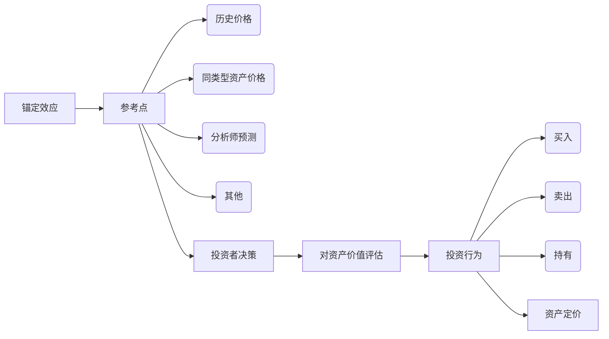

# 锚定效应：参考点如何影响资产定价

> 关键词：锚定效应、参考点、资产定价、行为金融学、市场心理

> 摘要：本文深入探讨了锚定效应这一重要的行为金融学概念，详细分析了参考点是如何影响资产定价的。通过介绍锚定效应的核心概念与联系、相关算法原理、数学模型，结合实际项目案例进行解读，阐述了其在不同资产定价场景中的应用。同时推荐了学习相关知识的工具和资源，最后对锚定效应在资产定价领域的未来发展趋势与挑战进行了总结，并提供了常见问题解答和扩展阅读资料，旨在为读者全面深入理解锚定效应及其对资产定价的影响提供清晰的思路和丰富的知识。

## 1. 背景介绍 
### 1.1 目的和范围
本研究的主要目的是深入剖析锚定效应中参考点对资产定价的具体影响机制。资产定价是金融市场的核心问题之一，传统的资产定价理论基于理性人假设，但大量的市场现象表明投资者并非完全理性，锚定效应的存在使得参考点会显著影响投资者的决策和资产的定价。本文的研究范围涵盖了股票、债券、房地产等多种常见资产类型，分析不同市场环境下锚定效应的表现形式以及对资产价格形成的作用。

### 1.2 预期读者
本文预期读者包括金融从业者，如投资银行家、基金经理、证券分析师等，他们可以通过了解锚定效应更好地把握市场动态和投资者行为，优化投资策略；金融领域的研究者和学者，有助于他们在行为金融学领域开展更深入的学术研究；以及对金融市场和投资感兴趣的普通投资者，帮助他们认识自身决策过程中的心理偏差，提高投资决策的合理性。

### 1.3 文档结构概述
本文首先介绍锚定效应和参考点的核心概念及其相互联系，包括原理阐述和可视化的流程图展示；接着讲解相关的核心算法原理，并给出具体的 Python 代码实现步骤；然后介绍锚定效应在资产定价中的数学模型和公式，并结合实例进行详细说明；之后通过一个实际的项目案例，从开发环境搭建到源代码实现和解读，全面展示锚定效应在实际中的应用；再探讨锚定效应在不同资产市场的实际应用场景；推荐学习相关知识的工具和资源，包括书籍、在线课程、开发工具等；最后对锚定效应在资产定价领域的未来发展趋势和挑战进行总结，并提供常见问题解答和扩展阅读资料。

### 1.4 术语表
#### 1.4.1 核心术语定义
- **锚定效应**：指人们在做决策时，会过度依赖最初获得的信息（即锚点），并以此为参考来调整自己的判断，即使后续有新的信息出现，调整的幅度也往往不足。
- **参考点**：在锚定效应中，作为初始信息的那个特定数值或状态，它为投资者的决策提供了一个基准。
- **资产定价**：确定资产在市场中的合理价值的过程，它受到多种因素的影响，包括基本面因素和投资者心理因素。

#### 1.4.2 相关概念解释
- **行为金融学**：是将心理学、社会学等学科的研究成果应用于金融市场的分析，研究投资者在决策过程中的心理偏差和行为模式，以及这些因素如何影响资产价格和市场效率。
- **市场心理**：投资者在金融市场中的心理状态和情绪反应，如贪婪、恐惧、乐观、悲观等，这些心理因素会影响他们的投资决策和市场行为。

#### 1.4.3 缩略词列表
- **EMH**：有效市场假说（Efficient Market Hypothesis），认为市场价格已经反映了所有可用的信息，投资者无法通过分析历史信息或其他公开信息获得超额收益。
- **CAPM**：资本资产定价模型（Capital Asset Pricing Model），用于描述资产的预期收益率与系统性风险之间的关系。

## 2. 核心概念与联系 
### 核心概念原理
锚定效应的原理源于人类认知的局限性和简化决策的需求。在面对复杂的决策问题时，人们往往会寻找一个容易获取的参考点作为起始点，然后基于这个参考点进行调整来形成最终的判断。在资产定价中，参考点可以是多种形式，如资产的历史价格、同类型资产的价格、分析师的预测等。投资者会不自觉地将这些参考点作为锚，在评估资产价值时难以摆脱其影响。

例如，当一只股票的历史最高价为 100 元，当前价格为 80 元时，投资者可能会以 100 元作为参考点，认为该股票目前被低估，从而更倾向于买入。即使有新的信息表明该股票的基本面已经发生了变化，其合理价值可能低于 80 元，但投资者由于锚定了 100 元的历史最高价，调整自己判断的幅度可能较小。

### 架构的文本示意图
```plaintext
锚定效应
|
|--参考点（历史价格、同类型资产价格、分析师预测等）
|
|--投资者决策
|   |
|   |--对资产价值的评估
|   |
|   |--投资行为（买入、卖出、持有）
|
|--资产定价
```

### Mermaid 流程图


## 3. 核心算法原理 & 具体操作步骤 
### 算法原理
我们可以通过一个简单的算法来模拟锚定效应在资产定价中的影响。假设投资者对资产的初始评估价值受到参考点的影响，并且在新信息出现时，会根据一定的调整系数对初始评估价值进行调整。

具体来说，设参考点为 $R$，新信息对资产价值的影响为 $\Delta V$，调整系数为 $\alpha$（$0 \leq \alpha \leq 1$），则投资者对资产的最终评估价值 $V$ 可以表示为：

$V = R + \alpha \Delta V$

调整系数 $\alpha$ 反映了投资者摆脱锚定效应的能力，$\alpha$ 越小，说明投资者越难以摆脱参考点的影响，调整幅度越小；$\alpha$ 越大，说明投资者越能根据新信息灵活调整对资产价值的评估。

### Python 代码实现步骤
```python
# 定义参考点
reference_point = 100

# 定义新信息对资产价值的影响
new_info_impact = -20

# 定义调整系数
adjustment_coefficient = 0.2

# 计算投资者对资产的最终评估价值
final_value = reference_point + adjustment_coefficient * new_info_impact

print(f"投资者对资产的最终评估价值为: {final_value}")
```
### 代码解释
1. 首先，我们定义了参考点 `reference_point` 为 100，这可以看作是资产的历史价格或其他作为锚的数值。
2. 然后，定义了新信息对资产价值的影响 `new_info_impact` 为 -20，表示新信息显示资产价值下降了 20。
3. 接着，定义了调整系数 `adjustment_coefficient` 为 0.2，说明投资者只根据新信息调整了 20% 的幅度。
4. 最后，根据公式 $V = R + \alpha \Delta V$ 计算投资者对资产的最终评估价值，并将结果打印输出。

## 4. 数学模型和公式 & 详细讲解 & 举例说明 
### 数学模型和公式
在更复杂的情况下，我们可以考虑多个参考点和多期的新信息影响。设 $R_1, R_2, \cdots, R_n$ 为 $n$ 个参考点，$w_1, w_2, \cdots, w_n$ 为对应的权重，且 $\sum_{i=1}^{n} w_i = 1$，$\Delta V_1, \Delta V_2, \cdots, \Delta V_m$ 为 $m$ 期的新信息对资产价值的影响，$\alpha_1, \alpha_2, \cdots, \alpha_m$ 为对应的调整系数，则投资者对资产的最终评估价值 $V$ 可以表示为：

$$V = \sum_{i=1}^{n} w_i R_i + \sum_{j=1}^{m} \alpha_j \Delta V_j$$

### 详细讲解
公式的第一部分 $\sum_{i=1}^{n} w_i R_i$ 表示多个参考点的加权平均值，反映了不同参考点在投资者决策中的相对重要性。权重 $w_i$ 可以根据参考点的可靠性、近期性等因素来确定。

公式的第二部分 $\sum_{j=1}^{m} \alpha_j \Delta V_j$ 表示多期新信息对资产价值的累积调整。每个调整系数 $\alpha_j$ 反映了投资者在第 $j$ 期根据新信息调整评估价值的程度。

### 举例说明
假设投资者在评估一只股票时，考虑两个参考点：该股票的历史最高价 $R_1 = 120$ 元，权重 $w_1 = 0.6$；同行业类似股票的平均价格 $R_2 = 100$ 元，权重 $w_2 = 0.4$。在接下来的两个时期，新信息对股票价值的影响分别为 $\Delta V_1 = -10$ 元和 $\Delta V_2 = 5$ 元，调整系数分别为 $\alpha_1 = 0.3$ 和 $\alpha_2 = 0.4$。

首先，计算参考点的加权平均值：

$\sum_{i=1}^{2} w_i R_i = 0.6 \times 120 + 0.4 \times 100 = 72 + 40 = 112$

然后，计算新信息的累积调整值：

$\sum_{j=1}^{2} \alpha_j \Delta V_j = 0.3 \times (-10) + 0.4 \times 5 = -3 + 2 = -1$

最后，计算投资者对股票的最终评估价值：

$V = 112 + (-1) = 111$ 元

## 5. 项目实战：代码实际案例和详细解释说明 
### 5.1  开发环境搭建
- **操作系统**：可以选择 Windows、Linux 或 macOS。
- **Python 版本**：建议使用 Python 3.7 及以上版本。
- **开发工具**：推荐使用 PyCharm 或 Jupyter Notebook。
- **所需库**：需要安装 `pandas`、`numpy` 等库，用于数据处理和数值计算。可以使用以下命令进行安装：
```sh
pip install pandas numpy
```

### 5.2  源代码详细实现和代码解读
```python
import pandas as pd
import numpy as np

# 模拟参考点数据
reference_points = {
    "历史最高价": 150,
    "同行业平均价": 120
}

# 模拟新信息数据
new_info = pd.DataFrame({
    "时期": [1, 2, 3],
    "价值影响": [-20, 10, -5]
})

# 定义参考点权重
weights = {
    "历史最高价": 0.7,
    "同行业平均价": 0.3
}

# 定义调整系数
adjustment_coefficients = [0.2, 0.3, 0.4]

# 计算参考点的加权平均值
weighted_reference = np.sum([weights[key] * value for key, value in reference_points.items()])

# 计算新信息的累积调整值
cumulative_adjustment = 0
for i in range(len(new_info)):
    cumulative_adjustment += adjustment_coefficients[i] * new_info.loc[i, "价值影响"]

# 计算最终评估价值
final_value = weighted_reference + cumulative_adjustment

print(f"参考点的加权平均值为: {weighted_reference}")
print(f"新信息的累积调整值为: {cumulative_adjustment}")
print(f"投资者对资产的最终评估价值为: {final_value}")
```
### 代码解读与分析
1. **数据模拟**：首先，我们使用字典 `reference_points` 模拟了两个参考点，分别是历史最高价和同行业平均价。使用 `pandas` 的 `DataFrame` 模拟了多期的新信息数据，包括时期和价值影响。
2. **权重和调整系数定义**：定义了参考点的权重 `weights` 和每期新信息的调整系数 `adjustment_coefficients`。
3. **计算参考点加权平均值**：使用列表推导式和 `numpy` 的 `sum` 函数计算参考点的加权平均值。
4. **计算新信息累积调整值**：通过循环遍历新信息数据，根据调整系数计算每期新信息的调整值，并累加到 `cumulative_adjustment` 中。
5. **计算最终评估价值**：将参考点的加权平均值和新信息的累积调整值相加，得到投资者对资产的最终评估价值。
6. **结果输出**：打印出参考点的加权平均值、新信息的累积调整值和最终评估价值，方便观察和分析。

## 6. 实际应用场景 
### 股票市场
在股票市场中，锚定效应无处不在。投资者常常会将股票的历史最高价或买入价作为参考点。当股票价格下跌时，投资者可能会因为锚定买入价而不愿意卖出，期望股价能够回升到买入价以上，从而导致亏损进一步扩大。例如，某投资者以 50 元的价格买入一只股票，当股价下跌到 40 元时，他可能会认为只要股价能回到 50 元就卖出，但由于锚定效应的影响，他可能会忽视股票基本面的变化，错过及时止损的时机。

同时，分析师的评级和目标价也会成为投资者的参考点。如果分析师给出较高的目标价，投资者可能会锚定这个价格，认为该股票有很大的上涨空间，从而增加买入的可能性。

### 债券市场
在债券市场中，债券的票面利率和发行价格可能会成为投资者的参考点。投资者在评估债券的价值时，会不自觉地将当前债券的收益率与票面利率进行比较。如果当前收益率低于票面利率，投资者可能会认为该债券被高估；反之，如果当前收益率高于票面利率，投资者可能会认为该债券具有投资价值。

此外，债券的历史交易价格也会影响投资者的决策。当债券价格上涨时，投资者可能会锚定历史低价，认为现在买入不划算，从而错过投资机会；当债券价格下跌时，投资者可能会锚定历史高价，不愿意卖出，导致持有风险增加。

### 房地产市场
在房地产市场中，房产的历史成交价格、周边类似房产的价格以及开发商的报价都会成为购房者的参考点。购房者在评估一套房产的价值时，会参考周边类似房产的成交价格，如果该房产的报价低于周边类似房产的价格，购房者可能会认为该房产具有性价比，从而更倾向于购买。

同时，房产的历史最高价也会影响购房者的心理。如果某小区的房产历史最高价为 2 万元/平方米，当前价格为 1.8 万元/平方米，购房者可能会认为现在的价格相对较低，从而更容易做出购买决策，即使该小区的实际价值可能并没有那么高。

## 7. 工具和资源推荐
### 7.1 学习资源推荐
#### 7.1.1 书籍推荐
- 《思考，快与慢》（*Thinking, Fast and Slow*）：作者丹尼尔·卡尼曼（Daniel Kahneman）是行为经济学领域的先驱，本书详细介绍了人类思维的两种模式以及各种认知偏差，包括锚定效应，对理解投资者的心理和行为具有重要的指导意义。
- 《行为金融学》（*Behavioral Finance*）：全面介绍了行为金融学的理论和实践，包括锚定效应在金融市场中的应用，适合金融专业的学生和研究者深入学习。
- 《非理性繁荣》（*Irrational Exuberance*）：作者罗伯特·席勒（Robert Shiller）探讨了金融市场中的泡沫现象和投资者的非理性行为，其中涉及到锚定效应等多种心理因素对资产价格的影响。

#### 7.1.2 在线课程
- Coursera 上的“行为金融学”课程：由知名大学的教授授课，系统地讲解了行为金融学的基本理论和应用，包括锚定效应、羊群效应等内容。
- edX 上的“金融市场心理学”课程：从心理学的角度分析金融市场中的投资者行为，帮助学习者理解锚定效应等心理偏差如何影响资产定价。

#### 7.1.3 技术博客和网站
- 雪球网：是一个投资者交流和分享的平台，上面有很多关于投资心理和市场分析的文章，其中不乏对锚定效应等行为金融学概念的讨论。
- 金融界网站：提供丰富的金融资讯和市场分析，包括对资产定价和投资者行为的研究，有助于了解锚定效应在实际市场中的表现。

### 7.2 开发工具框架推荐
#### 7.2.1 IDE和编辑器
- PyCharm：是一款专业的 Python 集成开发环境，具有代码自动补全、调试、版本控制等功能，适合开发和调试与锚定效应相关的 Python 代码。
- Jupyter Notebook：是一个交互式的开发环境，支持代码、文本、图表等多种形式的展示，方便进行数据分析和模型验证，非常适合研究锚定效应在资产定价中的应用。

#### 7.2.2 调试和性能分析工具
- `pdb`：是 Python 自带的调试工具，可以帮助开发者逐行调试代码，找出代码中的错误和问题，确保锚定效应相关算法的正确性。
- `cProfile`：用于分析 Python 代码的性能，找出代码中的瓶颈部分，优化算法的执行效率，提高资产定价模型的计算速度。

#### 7.2.3 相关框架和库
- `pandas`：是一个强大的数据处理和分析库，提供了丰富的数据结构和函数，方便处理和分析参考点数据、新信息数据等，在锚定效应的模拟和分析中非常有用。
- `numpy`：是 Python 中用于科学计算的基础库，提供了高效的数组操作和数学函数，可用于实现锚定效应的数学模型和算法。

### 7.3 相关论文著作推荐
#### 7.3.1 经典论文
- Kahneman, D., & Tversky, A. (1974). Judgment under uncertainty: Heuristics and biases. *Science*, 185(4157), 1124-1131. 这篇经典论文首次提出了锚定效应等启发式和偏差的概念，为行为金融学的发展奠定了基础。
- Shiller, R. J. (2000). Irrational exuberance. *Princeton University Press*. 该著作深入探讨了金融市场中的非理性繁荣现象，分析了锚定效应等心理因素在资产泡沫形成中的作用。

#### 7.3.2 最新研究成果
- Barberis, N., & Thaler, R. H. (2003). A survey of behavioral finance. *Handbook of the Economics of Finance*, 1, 1053-1128. 这篇综述文章总结了行为金融学领域的最新研究成果，包括锚定效应在资产定价、投资决策等方面的应用。
- Baker, M., & Wurgler, J. (2007). Investor sentiment in the stock market. *Journal of Economic Perspectives*, 21(2), 129-152. 研究了投资者情绪对股票市场的影响，其中涉及到锚定效应等心理因素如何影响投资者的情绪和资产定价。

#### 7.3.3 应用案例分析
- 一些金融研究机构会发布关于锚定效应在实际资产定价中的应用案例分析报告，如麦肯锡、波士顿咨询集团等。这些报告通过实际案例展示了锚定效应如何影响投资者的决策和资产价格的形成，对金融从业者和投资者具有重要的参考价值。

## 8. 总结：未来发展趋势与挑战
### 未来发展趋势
- **跨学科研究的深入**：锚定效应的研究将不仅仅局限于行为金融学领域，还会与心理学、神经科学、社会学等学科进行更深入的交叉融合。通过跨学科的研究，可以更全面地了解投资者的心理和行为机制，为资产定价提供更准确的理论支持。
- **大数据和人工智能的应用**：随着大数据技术的发展，我们可以获取更多关于投资者行为和市场数据的信息。利用人工智能算法，可以对这些数据进行深入分析，挖掘锚定效应在不同市场环境下的表现规律，提高资产定价模型的准确性和预测能力。
- **投资者教育的加强**：越来越多的投资者开始认识到锚定效应等心理偏差对投资决策的影响，未来金融机构和监管部门将加强投资者教育，帮助投资者了解这些心理偏差，提高投资决策的合理性，减少因锚定效应导致的投资失误。

### 挑战
- **模型的复杂性和准确性**：虽然我们可以建立一些数学模型来描述锚定效应在资产定价中的影响，但实际市场情况非常复杂，参考点的选择和调整系数的确定都具有很大的不确定性。如何建立更准确、更实用的资产定价模型，仍然是一个挑战。
- **市场环境的变化**：金融市场是不断变化的，新的金融产品和交易方式不断涌现，市场参与者的行为模式也在不断变化。锚定效应在不同的市场环境下可能会有不同的表现形式，如何及时捕捉这些变化并调整研究方法和模型，是需要解决的问题。
- **投资者心理的多样性**：不同的投资者具有不同的心理特征和行为模式，对锚定效应的敏感度也不同。如何考虑投资者心理的多样性，制定个性化的投资策略和风险管理方案，是未来研究和实践中的一个挑战。

## 9. 附录：常见问题与解答
### 问题 1：锚定效应一定会导致资产定价偏差吗？
答：锚定效应并不一定会导致资产定价偏差，但它增加了定价偏差的可能性。在某些情况下，投资者可能能够意识到锚定效应的存在，并通过理性分析和判断摆脱其影响，从而使资产价格接近其合理价值。然而，在大多数情况下，投资者往往难以完全摆脱参考点的影响，导致对资产价值的评估出现偏差，进而影响资产定价。

### 问题 2：如何减少锚定效应在投资决策中的影响？
答：可以从以下几个方面减少锚定效应的影响：
- 多元化信息来源：避免过度依赖单一的参考点，广泛收集各种信息，包括基本面数据、行业动态、宏观经济信息等，以更全面地评估资产价值。
- 理性分析和判断：在决策过程中，要保持理性，避免情绪化的决策。对参考点进行批判性思考，分析其合理性和可靠性。
- 定期复盘和反思：定期回顾自己的投资决策，分析是否受到了锚定效应的影响，总结经验教训，不断提高自己的投资决策能力。

### 问题 3：锚定效应在不同市场环境下的表现有何不同？
答：在牛市中，投资者可能更容易受到乐观情绪的影响，锚定较高的参考点，如股票的历史最高价，从而高估资产价值，推动市场进一步上涨。在熊市中，投资者可能会锚定较低的参考点，如股票的历史最低价，从而低估资产价值，加剧市场下跌。在新兴市场中，由于市场信息不够透明，投资者的认知偏差可能更严重，锚定效应的影响可能更大。

## 10. 扩展阅读 & 参考资料
- Thaler, R. H. (2015). *Misbehaving: The making of behavioral economics*. W. W. Norton & Company.
- Statman, M. (2014). *What investors really want: Discover what drives investor behavior and make smarter financial decisions*. McGraw-Hill Education.
- 中国证券监督管理委员会官方网站：提供了大量的金融市场监管政策和信息，有助于了解市场环境和投资者行为。
- 国际货币基金组织（IMF）和世界银行的研究报告：包含了全球金融市场的分析和研究成果，对研究锚定效应在国际金融市场中的应用具有参考价值。

作者：AI天才研究院/AI Genius Institute & 禅与计算机程序设计艺术 /Zen And The Art of Computer Programming