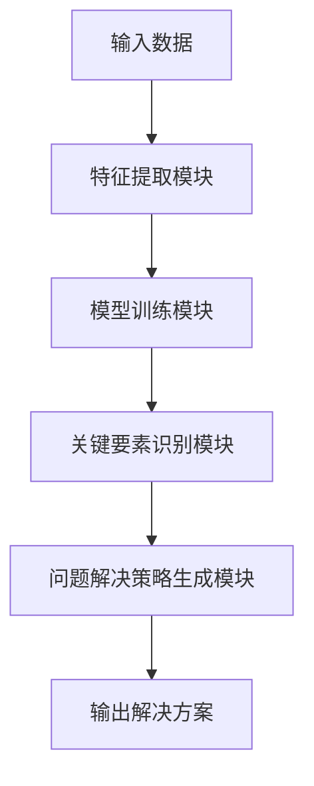

# 问题解决的关键要素:AI如何识别与利用

> 关键词：问题解决、关键要素、AI识别、AI利用、特征提取、机器学习、深度学习

> 摘要：本文聚焦于问题解决过程中的关键要素，深入探讨AI如何对这些要素进行识别与利用。首先介绍了问题解决及相关概念的背景知识，接着阐述了核心概念与联系，包括AI识别和利用关键要素的原理与架构。详细讲解了核心算法原理，通过Python代码示例进行说明，同时给出了相关数学模型和公式。在项目实战部分，通过具体代码案例展示了AI识别与利用关键要素的实现过程。分析了实际应用场景，推荐了学习和开发相关的工具与资源，最后总结了未来发展趋势与挑战，并对常见问题进行了解答。旨在为读者全面呈现AI在问题解决中识别与利用关键要素的全貌，助力读者深入理解和应用相关技术。

## 1. 背景介绍 
### 1.1 目的和范围
在当今数字化时代，问题的复杂性和多样性不断增加，高效解决问题成为各个领域追求的目标。AI技术的发展为问题解决提供了强大的工具和方法。本文章的目的在于深入探讨AI如何识别和利用问题解决中的关键要素，帮助读者理解AI在问题解决过程中的工作原理和应用方式。范围涵盖了从基本概念到算法原理，再到实际应用案例的多个层面，旨在全面呈现AI识别与利用关键要素的技术体系。

### 1.2 预期读者
本文预期读者包括对AI技术感兴趣的技术爱好者、从事AI相关研究和开发的专业人员、希望利用AI解决实际问题的业务人员等。无论您是初学者希望了解AI在问题解决中的基础知识，还是专业人士希望深入研究相关算法和应用，都能从本文中获得有价值的信息。

### 1.3 文档结构概述
本文首先介绍问题解决及相关概念的背景知识，包括术语定义和相关概念解释。接着阐述AI识别和利用关键要素的核心概念与联系，通过文本示意图和Mermaid流程图进行直观展示。然后详细讲解核心算法原理，并使用Python源代码进行说明。给出相关数学模型和公式，并举例说明。在项目实战部分，通过具体代码案例展示AI识别与利用关键要素的实现过程，包括开发环境搭建、源代码详细实现和代码解读。分析实际应用场景，推荐学习和开发相关的工具与资源。最后总结未来发展趋势与挑战，解答常见问题，并提供扩展阅读和参考资料。

### 1.4 术语表
#### 1.4.1 核心术语定义
- **问题解决**：指在给定的情境中，通过一系列的认知和行为操作，找到满足特定目标的解决方案的过程。
- **关键要素**：在问题解决过程中，对问题的理解、分析和解决起到决定性作用的因素或信息。
- **AI识别**：指AI系统通过对输入数据的处理和分析，提取关键信息，确定问题及其关键要素的过程。
- **AI利用**：指AI系统基于识别出的关键要素，采取相应的策略和方法，解决问题或实现特定目标的过程。
- **特征提取**：从原始数据中提取出能够有效描述数据特征和信息的过程，是AI识别关键要素的重要步骤。

#### 1.4.2 相关概念解释
- **机器学习**：是一门多领域交叉学科，涉及概率论、统计学、逼近论、凸分析、算法复杂度理论等多门学科。它专门研究计算机怎样模拟或实现人类的学习行为，以获取新的知识或技能，重新组织已有的知识结构使之不断改善自身的性能。
- **深度学习**：是机器学习的一个分支领域，它是一种基于对数据进行表征学习的方法。深度学习通过构建具有很多层的神经网络模型，自动从大量数据中学习到复杂的模式和特征，从而实现对数据的分类、预测等任务。
- **数据标注**：指对原始数据进行标记和注释，以便机器学习模型能够理解和处理数据的过程。数据标注是监督学习中不可或缺的环节，标注的质量直接影响模型的性能。

#### 1.4.3 缩略词列表
- **AI**：Artificial Intelligence，人工智能
- **ML**：Machine Learning，机器学习
- **DL**：Deep Learning，深度学习
- **CNN**：Convolutional Neural Network，卷积神经网络
- **RNN**：Recurrent Neural Network，循环神经网络

## 2. 核心概念与联系 
### 核心概念原理
AI识别与利用问题解决的关键要素主要基于机器学习和深度学习的原理。首先，AI系统需要对输入的数据进行特征提取，将原始数据转换为能够被模型理解和处理的特征向量。特征提取的方法有很多种，例如在图像识别中可以使用卷积神经网络（CNN）提取图像的特征，在自然语言处理中可以使用词嵌入技术将文本转换为向量表示。

接着，AI系统使用训练好的模型对提取的特征进行分类、预测等操作，以识别问题及其关键要素。模型的训练过程通常是基于大量的标注数据，通过优化算法不断调整模型的参数，使得模型能够准确地对数据进行分类和预测。

一旦识别出关键要素，AI系统就可以利用这些要素来解决问题。例如，在智能客服系统中，AI通过识别用户问题的关键要素，如问题类型、问题描述等，从知识库中检索相关的解决方案，并将其返回给用户。

### 架构的文本示意图
```plaintext
输入数据（图像、文本、语音等）
    |
    v
特征提取模块（CNN、词嵌入等）
    |
    v
模型训练模块（机器学习、深度学习算法）
    |
    v
关键要素识别模块（分类、预测）
    |
    v
问题解决策略生成模块（基于规则、知识库等）
    |
    v
输出解决方案
```

### Mermaid流程图


## 3. 核心算法原理 & 具体操作步骤 
### 特征提取算法 - 以词嵌入为例
词嵌入是自然语言处理中常用的特征提取方法，它将文本中的每个词映射到一个低维的向量空间中，使得语义相近的词在向量空间中距离较近。下面是使用Python的`torchtext`库实现词嵌入的示例代码：
```python
import torch
import torchtext
from torchtext.data.utils import get_tokenizer
from torchtext.vocab import build_vocab_from_iterator

# 定义分词器
tokenizer = get_tokenizer('basic_english')

# 示例文本数据
texts = [
    "This is a sample sentence.",
    "Another sample sentence for demonstration."
]

# 生成词表
def yield_tokens(data_iter):
    for text in data_iter:
        yield tokenizer(text)

vocab = build_vocab_from_iterator(yield_tokens(texts), specials=["<unk>"])
vocab.set_default_index(vocab["<unk>"])

# 定义词嵌入层
embedding_dim = 100
embedding = torch.nn.Embedding(len(vocab), embedding_dim)

# 对文本进行分词和词嵌入
for text in texts:
    tokens = tokenizer(text)
    indices = torch.tensor([vocab[token] for token in tokens])
    embedded = embedding(indices)
    print(f"Text: {text}")
    print(f"Embedded shape: {embedded.shape}")
```
### 关键要素识别算法 - 以逻辑回归为例
逻辑回归是一种常用的分类算法，可用于识别问题的关键要素。下面是使用Python的`scikit-learn`库实现逻辑回归的示例代码：
```python
from sklearn.datasets import make_classification
from sklearn.model_selection import train_test_split
from sklearn.linear_model import LogisticRegression
from sklearn.metrics import accuracy_score

# 生成示例数据集
X, y = make_classification(n_samples=1000, n_features=10, n_informative=5, n_redundant=0, random_state=42)

# 划分训练集和测试集
X_train, X_test, y_train, y_test = train_test_split(X, y, test_size=0.2, random_state=42)

# 定义逻辑回归模型
model = LogisticRegression()

# 训练模型
model.fit(X_train, y_train)

# 预测
y_pred = model.predict(X_test)

# 计算准确率
accuracy = accuracy_score(y_test, y_pred)
print(f"Accuracy: {accuracy}")
```
### 具体操作步骤
1. **数据准备**：收集和整理与问题相关的数据，并进行必要的预处理，如清洗、标注等。
2. **特征提取**：根据数据的类型和特点，选择合适的特征提取方法，将原始数据转换为特征向量。
3. **模型选择与训练**：根据问题的类型和需求，选择合适的机器学习或深度学习模型，并使用训练数据对模型进行训练。
4. **关键要素识别**：使用训练好的模型对新的数据进行预测，识别问题的关键要素。
5. **问题解决策略生成**：根据识别出的关键要素，从知识库或规则库中检索相关的解决方案，或使用其他方法生成问题解决策略。
6. **评估与优化**：对问题解决的结果进行评估，根据评估结果对模型和策略进行优化。

## 4. 数学模型和公式 & 详细讲解 & 举例说明 
### 逻辑回归数学模型
逻辑回归是一种广义线性模型，用于解决二分类问题。其数学模型可以表示为：
$$P(y = 1|x) = \frac{1}{1 + e^{-(w^T x + b)}}$$
其中，$x$ 是输入特征向量，$w$ 是权重向量，$b$ 是偏置项，$P(y = 1|x)$ 表示在输入特征 $x$ 的条件下，样本属于正类的概率。

### 详细讲解
逻辑回归的核心思想是通过一个线性组合 $w^T x + b$ 来计算样本属于正类的概率。为了将线性组合的输出映射到 $[0, 1]$ 区间，使用了逻辑函数（也称为Sigmoid函数）：
$$\sigma(z) = \frac{1}{1 + e^{-z}}$$
其中，$z = w^T x + b$。逻辑函数的图像是一个S形曲线，当 $z$ 趋近于正无穷时，$\sigma(z)$ 趋近于 1；当 $z$ 趋近于负无穷时，$\sigma(z)$ 趋近于 0。

### 举例说明
假设有一个二分类问题，输入特征向量 $x = [x_1, x_2]$，权重向量 $w = [w_1, w_2]$，偏置项 $b$。则线性组合为：
$$z = w_1 x_1 + w_2 x_2 + b$$
将 $z$ 代入逻辑函数中，得到样本属于正类的概率：
$$P(y = 1|x) = \frac{1}{1 + e^{-(w_1 x_1 + w_2 x_2 + b)}}$$
如果 $P(y = 1|x) > 0.5$，则预测样本属于正类；否则，预测样本属于负类。

### 损失函数 - 交叉熵损失
逻辑回归通常使用交叉熵损失函数来衡量模型的预测结果与真实标签之间的差异。交叉熵损失函数的公式为：
$$L(w, b) = -\frac{1}{N} \sum_{i=1}^{N} [y_i \log(P(y = 1|x_i)) + (1 - y_i) \log(1 - P(y = 1|x_i))]$$
其中，$N$ 是样本数量，$y_i$ 是第 $i$ 个样本的真实标签（0 或 1），$P(y = 1|x_i)$ 是模型对第 $i$ 个样本属于正类的预测概率。

### 优化算法 - 梯度下降
为了最小化损失函数 $L(w, b)$，通常使用梯度下降算法。梯度下降算法的更新公式为：
$$w_{t+1} = w_t - \alpha \frac{\partial L(w_t, b_t)}{\partial w_t}$$
$$b_{t+1} = b_t - \alpha \frac{\partial L(w_t, b_t)}{\partial b_t}$$
其中，$w_t$ 和 $b_t$ 是第 $t$ 次迭代时的权重和偏置项，$\alpha$ 是学习率，$\frac{\partial L(w_t, b_t)}{\partial w_t}$ 和 $\frac{\partial L(w_t, b_t)}{\partial b_t}$ 分别是损失函数对权重和偏置项的偏导数。

## 5. 项目实战：代码实际案例和详细解释说明 
### 5.1  开发环境搭建
本项目使用Python语言进行开发，需要安装以下库：
- `torch`：深度学习框架，用于实现词嵌入和神经网络模型。
- `torchtext`：自然语言处理工具库，用于文本处理和词表构建。
- `scikit-learn`：机器学习工具库，用于实现逻辑回归等机器学习算法。
- `numpy`：数值计算库，用于处理数组和矩阵运算。
- `pandas`：数据处理库，用于数据的读取和处理。

可以使用以下命令安装这些库：
```sh
pip install torch torchtext scikit-learn numpy pandas
```

### 5.2  源代码详细实现和代码解读
#### 数据准备
```python
import pandas as pd
from sklearn.model_selection import train_test_split

# 读取数据集
data = pd.read_csv('data.csv')

# 划分特征和标签
X = data.drop('label', axis=1)
y = data['label']

# 划分训练集和测试集
X_train, X_test, y_train, y_test = train_test_split(X, y, test_size=0.2, random_state=42)
```
**代码解读**：首先使用 `pandas` 库读取数据集，然后将数据集划分为特征和标签。最后使用 `train_test_split` 函数将数据集划分为训练集和测试集，测试集占总数据集的 20%。

#### 特征提取
```python
from sklearn.feature_extraction.text import TfidfVectorizer

# 定义TF-IDF向量化器
vectorizer = TfidfVectorizer()

# 对文本数据进行向量化
X_train_vectorized = vectorizer.fit_transform(X_train['text'])
X_test_vectorized = vectorizer.transform(X_test['text'])
```
**代码解读**：使用 `TfidfVectorizer` 类将文本数据转换为TF-IDF特征向量。`fit_transform` 方法用于在训练集上拟合向量化器并进行向量化，`transform` 方法用于在测试集上使用已拟合的向量化器进行向量化。

#### 模型训练与预测
```python
from sklearn.linear_model import LogisticRegression
from sklearn.metrics import accuracy_score

# 定义逻辑回归模型
model = LogisticRegression()

# 训练模型
model.fit(X_train_vectorized, y_train)

# 预测
y_pred = model.predict(X_test_vectorized)

# 计算准确率
accuracy = accuracy_score(y_test, y_pred)
print(f"Accuracy: {accuracy}")
```
**代码解读**：定义逻辑回归模型，并使用训练集的特征向量和标签进行训练。使用训练好的模型对测试集的特征向量进行预测，得到预测标签。最后使用 `accuracy_score` 函数计算预测标签与真实标签之间的准确率。

### 5.3  代码解读与分析
#### 数据处理
在数据准备阶段，使用 `pandas` 库读取数据集，并将其划分为特征和标签。划分训练集和测试集的目的是为了评估模型的性能，避免过拟合。

#### 特征提取
使用TF-IDF向量化器将文本数据转换为特征向量。TF-IDF（Term Frequency-Inverse Document Frequency）是一种常用的文本特征提取方法，它可以衡量一个词在文档中的重要性。通过将文本数据转换为特征向量，使得机器学习模型能够处理文本数据。

#### 模型训练与评估
使用逻辑回归模型对特征向量进行训练和预测。逻辑回归是一种简单而有效的分类算法，适用于二分类问题。通过计算预测标签与真实标签之间的准确率，可以评估模型的性能。

## 6. 实际应用场景 
### 智能客服
在智能客服系统中，AI可以通过识别用户问题的关键要素，如问题类型、问题描述等，从知识库中检索相关的解决方案，并将其返回给用户。例如，当用户咨询某个产品的使用方法时，AI可以识别出“产品名称”和“使用方法”等关键要素，然后从知识库中查找相关的使用说明并返回给用户。

### 医疗诊断
在医疗诊断中，AI可以通过分析患者的病历、检查报告等数据，识别出疾病的关键要素，如症状、体征、检查结果等，辅助医生进行诊断。例如，通过对患者的X光片进行分析，AI可以识别出肺部的病变特征，帮助医生判断是否患有肺炎等疾病。

### 金融风险评估
在金融领域，AI可以通过分析客户的信用记录、财务状况等数据，识别出金融风险的关键要素，如信用评分、负债情况等，评估客户的信用风险。例如，银行可以使用AI系统对贷款申请人的信用风险进行评估，决定是否批准贷款申请。

### 工业故障诊断
在工业生产中，AI可以通过监测设备的运行数据，识别出设备故障的关键要素，如温度、压力、振动等，及时发现设备故障并进行预警。例如，通过对发动机的运行数据进行分析，AI可以识别出发动机的故障特征，提前通知维修人员进行维修。

## 7. 工具