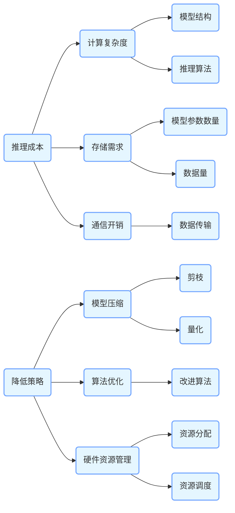

# 降低未来推理成本的策略探讨

> 关键词：推理成本、降低策略、人工智能、算法优化、资源管理

> 摘要：本文围绕降低未来推理成本这一核心主题展开深入探讨。首先介绍了研究的背景、目的、预期读者和文档结构等内容，明确了术语概念。接着阐述了与推理成本相关的核心概念及其联系，给出了原理和架构的文本示意图与Mermaid流程图。详细讲解了核心算法原理，用Python代码进行了说明，并分析了相关的数学模型和公式。通过项目实战展示了如何在实际中降低推理成本，包括开发环境搭建、源代码实现与解读。探讨了实际应用场景，推荐了学习资源、开发工具框架以及相关论文著作。最后总结了未来发展趋势与挑战，提供了常见问题解答和扩展阅读参考资料，旨在为相关领域的研究者和从业者提供全面的思路和方法来降低未来推理成本。

## 1. 背景介绍 
### 1.1 目的和范围
在当今数字化时代，人工智能和机器学习等领域的推理任务日益增多且复杂。推理成本包括计算资源消耗、时间成本、能源消耗等多个方面，过高的推理成本限制了技术的广泛应用和进一步发展。本研究的目的在于深入探讨降低未来推理成本的有效策略，范围涵盖算法优化、硬件资源管理、模型压缩等多个领域，旨在为相关从业者提供全面且可行的解决方案。

### 1.2 预期读者
本文预期读者包括人工智能和机器学习领域的研究人员、工程师、软件开发人员，以及对降低推理成本感兴趣的技术爱好者。对于正在从事相关项目开发的人员，可从中获取实用的技术和方法；对于研究人员，能为其学术研究提供新的思路和方向。

### 1.3 文档结构概述
本文首先介绍了研究的背景信息，包括目的、预期读者和文档结构等。接着阐述了与推理成本相关的核心概念及其联系，展示了原理和架构的示意图与流程图。然后详细讲解了核心算法原理，用Python代码进行了具体说明，并分析了相关的数学模型和公式。通过项目实战部分，展示了如何在实际中降低推理成本，包括开发环境搭建、源代码实现与解读。探讨了实际应用场景，推荐了学习资源、开发工具框架以及相关论文著作。最后总结了未来发展趋势与挑战，提供了常见问题解答和扩展阅读参考资料。

### 1.4 术语表
#### 1.4.1 核心术语定义
- **推理成本**：指在进行模型推理过程中所消耗的各种资源，包括计算资源（如CPU、GPU的使用）、时间成本（推理所需的时间）、能源消耗等。
- **模型压缩**：通过减少模型的参数数量、降低模型的复杂度等方式，在不显著损失模型性能的前提下，减小模型的规模，从而降低推理成本。
- **算法优化**：对推理算法进行改进，提高算法的效率，减少计算量和时间开销。
- **硬件资源管理**：合理分配和使用硬件资源，避免资源浪费，提高资源利用率，以降低推理成本。

#### 1.4.2 相关概念解释
- **剪枝**：模型压缩的一种方法，通过去除模型中对推理结果影响较小的参数或连接，减小模型规模。
- **量化**：将模型中的浮点数参数转换为低精度的整数表示，减少存储和计算需求。
- **并行计算**：利用多个计算单元同时进行计算，提高计算速度，降低时间成本。

#### 1.4.3 缩略词列表
- **CPU**：中央处理器（Central Processing Unit）
- **GPU**：图形处理器（Graphics Processing Unit）
- **ML**：机器学习（Machine Learning）
- **AI**：人工智能（Artificial Intelligence）

## 2. 核心概念与联系 
### 核心概念原理
推理成本主要由计算复杂度、存储需求和通信开销等因素决定。计算复杂度与模型的结构和算法有关，复杂的模型通常需要更多的计算资源和时间。存储需求则与模型的参数数量和数据量有关，大量的参数需要更多的存储空间。通信开销主要来自于数据在不同设备或节点之间的传输。

模型压缩通过减少模型的参数数量和复杂度，降低了存储需求和计算复杂度，从而直接降低推理成本。算法优化则是通过改进推理算法，减少不必要的计算步骤，提高计算效率，间接降低推理成本。硬件资源管理则是合理分配和使用硬件资源，避免资源闲置和浪费，提高资源利用率，进一步降低推理成本。

### 架构的文本示意图
```plaintext
推理成本
|-- 计算复杂度
|   |-- 模型结构
|   |-- 推理算法
|-- 存储需求
|   |-- 模型参数数量
|   |-- 数据量
|-- 通信开销
|   |-- 数据传输
|
|-- 降低策略
    |-- 模型压缩
    |   |-- 剪枝
    |   |-- 量化
    |-- 算法优化
    |   |-- 改进算法
    |-- 硬件资源管理
        |-- 资源分配
        |-- 资源调度
```

### Mermaid流程图


## 3. 核心算法原理 & 具体操作步骤 
### 模型剪枝算法原理
模型剪枝的基本思想是去除模型中对推理结果影响较小的参数或连接。常见的剪枝方法有基于幅度的剪枝和基于重要性的剪枝。

基于幅度的剪枝是根据参数的绝对值大小来判断其重要性，绝对值较小的参数被认为对推理结果影响较小，可以被剪枝。以下是一个简单的基于幅度的剪枝的Python代码示例：
```python
import torch
import torch.nn as nn

# 定义一个简单的神经网络模型
class SimpleNet(nn.Module):
    def __init__(self):
        super(SimpleNet, self).__init__()
        self.fc1 = nn.Linear(10, 20)
        self.fc2 = nn.Linear(20, 1)

    def forward(self, x):
        x = torch.relu(self.fc1(x))
        x = self.fc2(x)
        return x

# 初始化模型
model = SimpleNet()

# 定义剪枝阈值
threshold = 0.1

# 对模型的参数进行剪枝
for name, param in model.named_parameters():
    if 'weight' in name:
        mask = torch.abs(param.data) > threshold
        param.data *= mask.float()

# 打印剪枝后的模型参数
print(model.state_dict())
```
### 操作步骤
1. 定义模型：首先需要定义一个神经网络模型，如上述代码中的`SimpleNet`。
2. 设定剪枝阈值：根据实际情况选择合适的剪枝阈值，如`threshold = 0.1`。
3. 遍历模型参数：使用`named_parameters()`方法遍历模型的所有参数，找到需要剪枝的参数（通常是权重参数）。
4. 生成掩码：根据参数的绝对值和阈值生成掩码，掩码为`True`的位置表示保留该参数，为`False`的位置表示剪枝该参数。
5. 应用掩码：将掩码与参数数据相乘，将需要剪枝的参数置为0。

### 模型量化算法原理
模型量化是将模型中的浮点数参数转换为低精度的整数表示，减少存储和计算需求。常见的量化方法有8位量化和4位量化。

以下是一个简单的8位量化的Python代码示例：
```python
import torch
import torch.nn as nn

# 定义一个简单的神经网络模型
class SimpleNet(nn.Module):
    def __init__(self):
        super(SimpleNet, self).__init__()
        self.fc1 = nn.Linear(10, 20)
        self.fc2 = nn.Linear(20, 1)

    def forward(self, x):
        x = torch.relu(self.fc1(x))
        x = self.fc2(x)
        return x

# 初始化模型
model = SimpleNet()

# 量化模型参数
scale = 127 / torch.max(torch.abs(model.fc1.weight.data))
quantized_weight = torch.round(model.fc1.weight.data * scale).clamp(-128, 127).to(torch.int8)

# 打印量化后的模型参数
print(quantized_weight)
```
### 操作步骤
1. 定义模型：同样需要先定义一个神经网络模型。
2. 计算缩放因子：根据参数的最大值计算缩放因子，如`scale = 127 / torch.max(torch.abs(model.fc1.weight.data))`。
3. 量化参数：将参数乘以缩放因子并四舍五入，然后将结果限制在-128到127的范围内，并转换为8位整数类型。
4. 应用量化参数：将量化后的参数应用到模型中。

## 4. 数学模型和公式 & 详细讲解 & 举例说明 
### 模型剪枝的数学模型
设模型的参数矩阵为 $W \in \mathbb{R}^{m \times n}$，剪枝阈值为 $\tau$。基于幅度的剪枝可以表示为：
$$
\hat{W}_{ij} = 
\begin{cases}
W_{ij}, & \text{if } |W_{ij}| > \tau \\
0, & \text{otherwise}
\end{cases}
$$
其中，$\hat{W}$ 是剪枝后的参数矩阵。

举例说明：假设 $W = \begin{bmatrix} 0.1 & 0.2 \\ 0.05 & 0.3 \end{bmatrix}$，$\tau = 0.1$。则根据上述公式，剪枝后的矩阵为 $\hat{W} = \begin{bmatrix} 0.1 & 0.2 \\ 0 & 0.3 \end{bmatrix}$。

### 模型量化的数学模型
设原始参数为 $x$，缩放因子为 $s$，量化后的参数为 $\hat{x}$。8位量化可以表示为：
$$
\hat{x} = \text{round}(x \cdot s) \in [-128, 127]
$$
其中，$\text{round}$ 表示四舍五入操作。

举例说明：假设 $x = 0.5$，$s = 10$。则量化后的参数为 $\hat{x} = \text{round}(0.5 \cdot 10) = 5$。

### 推理成本的数学模型
推理成本 $C$ 可以表示为计算复杂度 $C_{comp}$、存储需求 $C_{mem}$ 和通信开销 $C_{comm}$ 的加权和：
$$
C = \alpha C_{comp} + \beta C_{mem} + \gamma C_{comm}
$$
其中，$\alpha$、$\beta$ 和 $\gamma$ 是权重系数，根据实际情况进行调整。

计算复杂度 $C_{comp}$ 通常与模型的计算量成正比，可以表示为：
$$
C_{comp} = \sum_{i=1}^{k} n_i \cdot o_i
$$
其中，$n_i$ 是第 $i$ 层的神经元数量，$o_i$ 是第 $i$ 层的每个神经元的计算量。

存储需求 $C_{mem}$ 与模型的参数数量和数据量有关，可以表示为：
$$
C_{mem} = \sum_{i=1}^{k} p_i \cdot b_i + d \cdot b_d
$$
其中，$p_i$ 是第 $i$ 层的参数数量，$b_i$ 是每个参数的存储位数，$d$ 是数据量，$b_d$ 是每个数据的存储位数。

通信开销 $C_{comm}$ 与数据传输量有关，可以表示为：
$$
C_{comm} = t \cdot r
$$
其中，$t$ 是数据传输时间，$r$ 是数据传输速率。

## 5. 项目实战：代码实际案例和详细解释说明 
### 5.1  开发环境搭建
本项目使用Python和PyTorch深度学习框架进行开发。以下是开发环境搭建的步骤：
1. 安装Python：建议使用Python 3.7及以上版本。可以从Python官方网站（https://www.python.org/downloads/）下载并安装。
2. 安装PyTorch：根据自己的操作系统和CUDA版本，选择合适的PyTorch版本进行安装。可以使用以下命令安装：
```sh
pip install torch torchvision
```
3. 安装其他依赖库：根据项目需求，安装其他必要的依赖库，如`numpy`、`matplotlib`等。
```sh
pip install numpy matplotlib
```

### 5.2  源代码详细实现和代码解读
以下是一个完整的项目实战代码示例，包括模型定义、训练、剪枝和量化：
```python
import torch
import torch.nn as nn
import torch.optim as optim
from torchvision import datasets, transforms

# 定义一个简单的卷积神经网络模型
class SimpleCNN(nn.Module):
    def __init__(self):
        super(SimpleCNN, self).__init__()
        self.conv1 = nn.Conv2d(1, 10, kernel_size=5)
        self.conv2 = nn.Conv2d(10, 20, kernel_size=5)
        self.fc1 = nn.Linear(320, 50)
        self.fc2 = nn.Linear(50, 10)

    def forward(self, x):
        x = torch.relu(torch.max_pool2d(self.conv1(x), 2))
        x = torch.relu(torch.max_pool2d(self.conv2(x), 2))
        x = x.view(-1, 320)
        x = torch.relu(self.fc1(x))
        x = self.fc2(x)
        return x

# 数据预处理
transform = transforms.Compose([
    transforms.ToTensor(),
    transforms.Normalize((0.1307,), (0.3081,))
])

# 加载训练集和测试集
train_dataset = datasets.MNIST('data', train=True, download=True, transform=transform)
test_dataset = datasets.MNIST('data', train=False, transform=transform)
train_loader = torch.utils.data.DataLoader(train_dataset, batch_size=64, shuffle=True)
test_loader = torch.utils.data.DataLoader(test_dataset, batch_size=1000, shuffle=False)

# 初始化模型、损失函数和优化器
model = SimpleCNN()
criterion = nn.CrossEntropyLoss()
optimizer = optim.SGD(model.parameters(), lr=0.01, momentum=0.5)

# 训练模型
def train(model, train_loader, optimizer, epoch):
    model.train()
    for batch_idx, (data, target) in enumerate(train_loader):
        optimizer.zero_grad()
        output = model(data)
        loss = criterion(output, target)
        loss.backward()
        optimizer.step()
        if batch_idx % 100 == 0:
            print('Train Epoch: {} [{}/{} ({:.0f}%)]\tLoss: {:.6f}'.format(
                epoch, batch_idx * len(data), len(train_loader.dataset),
                100. * batch_idx / len(train_loader), loss.item()))

# 测试模型
def test(model, test_loader):
    model.eval()
    test_loss = 0
    correct = 0
    with torch.no_grad():
        for data, target in test_loader:
            output = model(data)
            test_loss += criterion(output, target).item()
            pred = output.argmax(dim=1, keepdim=True)
            correct += pred.eq(target.view_as(pred)).sum().item()

    test_loss /= len(test_loader.dataset)
    print('\nTest set: Average loss: {:.4f}, Accuracy: {}/{} ({:.0f}%)\n'.format(
        test_loss, correct, len(test_loader.dataset),
        100. * correct / len(test_loader.dataset)))

# 训练模型
for epoch in range(1, 5):
    train(model, train_loader, optimizer, epoch)
    test(model, test_loader)

# 模型剪枝
threshold = 0.1
for name, param in model.named_parameters():
    if 'weight' in name:
        mask = torch.abs(param.data) > threshold
        param.data *= mask.float()

# 测试剪枝后的模型
test(model, test_loader)

# 模型量化
scale = 127 / torch.max(torch.abs(model.conv1.weight.data))
quantized_weight = torch.round(model.conv1.weight.data * scale).clamp(-128, 127).to(torch.int8)
model.conv1.weight.data = quantized_weight.float() / scale

# 测试量化后的模型
test(model, test_loader)
```
### 代码解读
1. **模型定义**：定义了一个简单的卷积神经网络模型`SimpleCNN`，包含两个卷积层和两个全连接层。
2. **数据预处理**：使用`transforms`对MNIST数据集进行预处理，包括转换为张量和归一化。
3. **数据加载**：使用`DataLoader`加载训练集和测试集。
4. **模型训练**：定义了`train`和`test`函数，使用交叉熵损失函数和随机梯度下降优化器对模型进行训练和测试。
5. **模型剪枝**：使用基于幅度的剪枝方法，对模型的权重参数进行剪枝。
6. **模型量化**：对模型的卷积层权重参数进行8位量化。
7. **测试模型**：分别测试原始模型、剪枝后的模型和量化后的模型的准确率。

### 5.3  代码解读与分析
通过上述代码，我们可以看到模型剪枝和量化可以在一定程度上降低模型的复杂度和存储需求，从而降低推理成本。在实际应用中，需要根据具体情况选择合适的剪枝阈值和量化方法，以在降低成本的同时保证模型的性能。

## 6. 实际应用场景 
### 边缘计算设备
在边缘计算设备中，如智能摄像头、智能手表等，由于设备的计算资源和存储容量有限，降低推理成本尤为重要。通过模型压缩和算法优化，可以在不影响设备性能的前提下，实现实时的推理任务。例如，在智能摄像头中，可以使用剪枝和量化后的模型进行目标检测和识别，减少计算资源的消耗，延长设备的续航时间。

### 云计算平台
在云计算平台中，大量的推理任务需要处理，降低推理成本可以提高平台的效率和竞争力。通过合理的硬件资源管理和算法优化，可以充分利用云计算平台的资源，减少能源消耗和计算成本。例如，在大规模图像分类任务中，可以使用并行计算和优化的推理算法，提高处理速度，降低成本。

### 自动驾驶领域
在自动驾驶领域，推理任务的实时性和准确性要求很高，同时也需要考虑计算成本和能源消耗。通过模型压缩和算法优化，可以在保证安全的前提下，降低自动驾驶系统的推理成本。例如，在自动驾驶汽车中，可以使用轻量化的模型进行环境感知和决策，减少计算资源的需求，提高系统的可靠性。

## 7. 工具和资源推荐
### 7.1 学习资源推荐
#### 7.1.1 书籍推荐
- 《深度学习》（Deep Learning）：由Ian Goodfellow、Yoshua Bengio和Aaron Courville所著，是深度学习领域的经典教材，涵盖了深度学习的基本概念、算法和应用。
- 《Python深度学习》（Deep Learning with Python）：由Francois Chollet所著，介绍了如何使用Python和Keras框架进行深度学习开发，适合初学者。
- 《动手学深度学习》（Dive into Deep Learning）：由 Aston Zhang、Zachary C. Lipton、Mu Li和Alexander J. Smola所著，提供了丰富的代码示例和实践项目，帮助读者快速掌握深度学习的实践技能。

#### 7.1.2 在线课程
- Coursera上的“深度学习专项课程”（Deep Learning Specialization）：由Andrew Ng教授授课，包括五门课程，全面介绍了深度学习的各个方面。
- edX上的“强化学习基础”（Fundamentals of Reinforcement Learning）：由David Silver教授授课，介绍了强化学习的基本概念和算法。
- 哔哩哔哩上的“李沐深度学习”系列视频：由李沐老师讲解，内容生动易懂，适合初学者。

#### 7.1.3 技术博客和网站
- Medium上的Towards Data Science：汇集了大量的数据科学和机器学习领域的优秀文章，涵盖了最新的技术和研究成果。
- arXiv.org：是一个预印本平台，提供了大量的学术论文，包括人工智能和机器学习领域的最新研究。
- Kaggle：是一个数据科学竞赛平台，提供了丰富的数据集和代码示例，适合实践和学习。

### 7.2 开发工具框架推荐
#### 7.2.1 IDE和编辑器
- PyCharm：是一款专业的Python集成开发环境，提供了丰富的代码编辑、调试和版本控制功能。
- Jupyter Notebook：是一个交互式的开发环境，适合进行数据分析和模型训练，支持Python、R等多种编程语言。
- Visual Studio Code：是一款轻量级的代码编辑器，支持多种编程语言和插件扩展，具有良好的开发体验。

#### 7.2.2 调试和性能分析工具
- TensorBoard：是TensorFlow的可视化工具，可用于查看模型的训练过程、损失函数曲线、模型结构等信息。
- PyTorch Profiler：是PyTorch的性能分析工具，可用于分析模型的计算性能、内存使用情况等。
- NVIDIA Nsight Systems：是NVIDIA提供的性能分析工具，可用于分析GPU的性能瓶颈和优化代码。

#### 7.2.3 相关框架和库
- PyTorch：是一个开源的深度学习框架，具有动态图机制，易于使用和调试，广泛应用于学术界和工业界。
- TensorFlow：是另一个流行的深度学习框架，具有强大的分布式训练和部署能力，适合大规模的工业应用。
- Scikit-learn：是一个开源的机器学习库，提供了丰富的机器学习算法和工具，适合初学者和快速开发。

### 7.3 相关论文著作推荐
#### 7.3.1 经典论文
- “ImageNet Classification with Deep Convolutional Neural Networks”：由Alex Krizhevsky、Ilya Sutskever和Geoffrey E. Hinton所著，介绍了AlexNet模型，开启了深度学习在计算机视觉领域的热潮。
- “Long Short-Term Memory”：由Sepp Hochreiter和Jürgen Schmidhuber所著，提出了长短期记忆网络（LSTM），解决了传统循环神经网络的梯度消失问题。
- “Attention Is All You Need”：由Ashish Vaswani等人所著，提出了Transformer模型，在自然语言处理领域取得了巨大成功。

#### 7.3.2 最新研究成果
- “EfficientNet: Rethinking Model Scaling for Convolutional Neural Networks”：提出了EfficientNet模型，通过自动搜索模型的宽度、深度和分辨率，实现了高效的模型缩放。
- “MobileNetV3: Searching for MobileNetV3”：提出了MobileNetV3模型，进一步优化了轻量级卷积神经网络的性能。
- “Swin Transformer: Hierarchical Vision Transformer using Shifted Windows”：提出了Swin Transformer模型，将Transformer结构应用于计算机视觉领域，取得了优异的性能。

#### 7.3.3 应用案例分析
- “Deep Learning for Autonomous Driving: A Survey”：对深度学习在自动驾驶领域的应用进行了全面的综述，介绍了各种模型和算法的应用场景和优缺点。
- “Medical Image Analysis with Deep Learning: A Review”：对深度学习在医学图像分析领域的应用进行了综述，包括疾病诊断、图像分割等方面。
- “Deep Learning in Recommender Systems: A Survey”：对深度学习在推荐系统领域的应用进行了综述，介绍了各种推荐算法和模型的原理和应用。

## 8. 总结：未来发展趋势与挑战
### 未来发展趋势
- **模型轻量化**：未来的模型将越来越轻量化，通过更高效的模型压缩和算法优化，降低推理成本，提高模型的部署效率。
- **硬件与算法协同优化**：硬件和算法将更加紧密地结合，通过定制化的硬件设计和优化的算法，实现更高的计算效率和更低的能耗。
- **自动化推理优化**：自动化的推理优化工具和平台将得到广泛应用，通过自动搜索和调整模型结构、算法参数等，实现最优的推理性能。

### 挑战
- **性能与精度的平衡**：在降低推理成本的同时，如何保证模型的性能和精度是一个挑战。需要不断探索新的模型压缩和算法优化方法，在两者之间找到最佳的平衡点。
- **硬件兼容性**：不同的硬件平台具有不同的特点和性能，如何实现模型在不同硬件平台上的高效部署是一个挑战。需要开发通用的硬件抽象层和优化工具，提高模型的硬件兼容性。
- **数据隐私和安全**：在推理过程中，数据的隐私和安全问题越来越受到关注。需要研究新的加密和隐私保护技术，确保数据在推理过程中的安全性。

## 9. 附录：常见问题与解答
### 模型剪枝会影响模型的性能吗？
模型剪枝在一定程度上会影响模型的性能，但通过合理选择剪枝阈值和方法，可以在降低模型复杂度的同时，保证模型的性能损失在可接受的范围内。在实际应用中，需要进行实验和调优，找到最佳的剪枝策略。

### 模型量化会导致精度损失吗？
模型量化会导致一定的精度损失，因为量化将浮点数参数转换为低精度的整数表示。但通过合适的量化方法和校准技术，可以减少精度损失。例如，使用自适应量化和量化感知训练等方法，可以在降低计算成本的同时，保持较高的模型精度。

### 如何选择合适的硬件资源管理策略？
选择合适的硬件资源管理策略需要考虑多个因素，如任务的特点、硬件平台的性能、资源的可用性等。对于计算密集型任务，可以选择使用GPU进行加速；对于内存密集型任务，需要合理分配内存资源。同时，可以使用资源调度算法，动态调整资源分配，提高资源利用率。

## 10. 扩展阅读 & 参考资料
- Goodfellow, I., Bengio, Y., & Courville, A. (2016). Deep Learning. MIT Press.
- Chollet, F. (2017). Deep Learning with Python. Manning Publications.
- Zhang, A., Lipton, Z. C., Li, M., & Smola, A. J. (2020). Dive into Deep Learning. https://d2l.ai/
- Krizhevsky, A., Sutskever, I., & Hinton, G. E. (2012). ImageNet Classification with Deep Convolutional Neural Networks. Advances in Neural Information Processing Systems.
- Hochreiter, S., & Schmidhuber, J. (1997). Long Short-Term Memory. Neural Computation.
- Vaswani, A., Shazeer, N., Parmar, N., Uszkoreit, J., Jones, L., Gomez, A. N.,... & Polosukhin, I. (2017). Attention Is All You Need. Advances in Neural Information Processing Systems.

作者：AI天才研究院/AI Genius Institute & 禅与计算机程序设计艺术 /Zen And The Art of Computer Programming