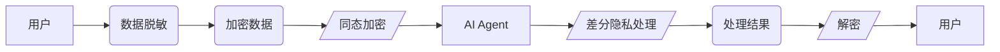

# 隐私保护型AI Agent：安全与功能的平衡

> 关键词：隐私保护、AI Agent、安全、功能平衡、数据安全、机器学习

> 摘要：本文聚焦于隐私保护型AI Agent，深入探讨如何在保障安全隐私的同时实现强大的功能。首先介绍了相关背景知识，包括目的范围、预期读者等。接着阐述了核心概念及联系，通过文本示意图和Mermaid流程图进行直观展示。详细讲解了核心算法原理及操作步骤，并结合Python代码示例。运用数学模型和公式进一步剖析原理，通过实例说明。在项目实战部分，提供了开发环境搭建、源代码实现与解读。探讨了实际应用场景，推荐了学习资源、开发工具框架和相关论文著作。最后总结了未来发展趋势与挑战，还给出了常见问题解答和扩展阅读参考资料，旨在为读者全面呈现隐私保护型AI Agent的相关知识和技术。

## 1. 背景介绍 
### 1.1 目的和范围
在当今数字化时代，人工智能技术迅速发展，AI Agent在各个领域得到了广泛应用。然而，随着数据泄露事件的频繁发生，用户对自身隐私保护的关注度日益提高。隐私保护型AI Agent旨在解决这一问题，即在保证AI Agent具备强大功能的同时，最大程度地保护用户的隐私数据。本文的范围涵盖了隐私保护型AI Agent的核心概念、算法原理、数学模型、项目实战、应用场景等方面，为读者提供全面深入的了解。

### 1.2 预期读者
本文预期读者包括人工智能领域的研究人员、开发者、数据科学家，以及对隐私保护和AI Agent感兴趣的技术爱好者。对于专业人士，本文可以提供新的思路和技术方法；对于初学者，能够帮助他们建立起对隐私保护型AI Agent的基本认识。

### 1.3 文档结构概述
本文将按照以下结构进行组织：首先介绍背景知识，包括目的范围、预期读者等；接着阐述核心概念及联系，通过文本示意图和Mermaid流程图进行直观展示；详细讲解核心算法原理及操作步骤，并结合Python代码示例；运用数学模型和公式进一步剖析原理，通过实例说明；在项目实战部分，提供开发环境搭建、源代码实现与解读；探讨实际应用场景；推荐学习资源、开发工具框架和相关论文著作；最后总结未来发展趋势与挑战，给出常见问题解答和扩展阅读参考资料。

### 1.4 术语表
#### 1.4.1 核心术语定义
- **隐私保护型AI Agent**：一种具备人工智能能力的代理程序，在处理用户数据时，采用各种隐私保护技术，确保用户数据的安全性和隐私性。
- **差分隐私**：一种数学框架，用于在发布数据统计信息时，通过添加噪声来保护个体数据的隐私。
- **同态加密**：一种加密技术，允许在加密数据上进行计算，而无需先解密数据，计算结果解密后与在明文数据上的计算结果相同。

#### 1.4.2 相关概念解释
- **数据脱敏**：对敏感数据进行处理，使其失去识别特定个体的能力，常见的方法有替换、掩码等。
- **零知识证明**：证明者能够在不向验证者提供任何有用信息的情况下，使验证者相信某个论断是正确的。

#### 1.4.3 缩略词列表
- **AI**：Artificial Intelligence，人工智能
- **DP**：Differential Privacy，差分隐私
- **HE**：Homomorphic Encryption，同态加密

## 2. 核心概念与联系 
### 核心概念原理
隐私保护型AI Agent的核心目标是在保证AI Agent功能正常发挥的前提下，保护用户的隐私数据。为了实现这一目标，主要采用了以下几种技术：

#### 差分隐私
差分隐私的核心思想是在数据发布时，通过添加噪声来掩盖个体数据的差异，从而保护个体隐私。例如，在统计一个城市的居民收入时，通过添加适当的噪声，使得即使攻击者获取了统计结果，也无法推断出某个具体居民的收入情况。

#### 同态加密
同态加密允许在加密数据上进行计算，而无需先解密数据。这样，AI Agent可以直接对加密后的用户数据进行处理，处理结果解密后与在明文数据上的计算结果相同。例如，在进行医疗数据的分析时，医院可以将患者的加密病历数据发送给AI Agent进行分析，而无需担心数据泄露的问题。

#### 数据脱敏
数据脱敏是对敏感数据进行处理，使其失去识别特定个体的能力。常见的数据脱敏方法包括替换、掩码等。例如，将用户的身份证号码中的部分数字用星号替换，从而保护用户的隐私。

### 架构的文本示意图
```plaintext
用户 -- 数据脱敏 --> 加密数据 -- 同态加密 --> AI Agent
                                            |
                                            v
                                     差分隐私处理
                                            |
                                            v
                                 处理结果 -- 解密 --> 用户
```

### Mermaid流程图


## 3. 核心算法原理 & 具体操作步骤 
### 差分隐私算法原理
差分隐私的核心是通过添加噪声来保护数据隐私。常见的差分隐私机制有拉普拉斯机制和高斯机制。

#### 拉普拉斯机制
拉普拉斯机制的基本思想是在查询结果上添加拉普拉斯分布的噪声。设 $f(x)$ 是一个查询函数，$x$ 是数据集，$\epsilon$ 是差分隐私预算，则拉普拉斯机制的输出为：

$$M(x) = f(x) + Lap(\frac{\Delta f}{\epsilon})$$

其中，$\Delta f$ 是查询函数 $f$ 的敏感度，$Lap(\frac{\Delta f}{\epsilon})$ 表示均值为 0，尺度参数为 $\frac{\Delta f}{\epsilon}$ 的拉普拉斯分布。

#### Python代码实现
```python
import numpy as np

def laplace_mechanism(query_result, sensitivity, epsilon):
    """
    拉普拉斯机制实现
    :param query_result: 查询结果
    :param sensitivity: 查询函数的敏感度
    :param epsilon: 差分隐私预算
    :return: 添加噪声后的查询结果
    """
    noise = np.random.laplace(0, sensitivity / epsilon)
    return query_result + noise

# 示例
query_result = 10
sensitivity = 1
epsilon = 0.1
noisy_result = laplace_mechanism(query_result, sensitivity, epsilon)
print(f"原始查询结果: {query_result}")
print(f"添加噪声后的查询结果: {noisy_result}")
```

### 同态加密算法原理
同态加密允许在加密数据上进行计算。以Paillier同态加密算法为例，该算法支持加法同态和数乘同态。

#### Paillier同态加密算法步骤
1. **密钥生成**：选择两个大素数 $p$ 和 $q$，计算 $n = pq$ 和 $\lambda = lcm(p - 1, q - 1)$。选择一个随机整数 $g$，使得 $gcd(L(g^{\lambda} \bmod n^2), n) = 1$，其中 $L(u) = \frac{u - 1}{n}$。公钥为 $(n, g)$，私钥为 $(\lambda)$。
2. **加密**：对于明文消息 $m$，选择一个随机整数 $r$，计算密文 $c = g^m r^n \bmod n^2$。
3. **解密**：对于密文 $c$，计算明文 $m = L(c^{\lambda} \bmod n^2) / L(g^{\lambda} \bmod n^2) \bmod n$。

#### Python代码实现
```python
from phe import paillier

# 生成公钥和私钥
public_key, private_key = paillier.generate_paillier_keypair()

# 明文消息
m1 = 10
m2 = 20

# 加密
c1 = public_key.encrypt(m1)
c2 = public_key.encrypt(m2)

# 同态加法
c_sum = c1 + c2

# 解密
decrypted_sum = private_key.decrypt(c_sum)

print(f"明文相加结果: {m1 + m2}")
print(f"同态加密相加解密结果: {decrypted_sum}")
```

## 4. 数学模型和公式 & 详细讲解 & 举例说明 
### 差分隐私数学模型
差分隐私的数学定义如下：

设 $\mathcal{X}$ 是数据集的集合，$\mathcal{Y}$ 是查询结果的集合，$M: \mathcal{X} \to \mathcal{Y}$ 是一个随机算法。如果对于任意相邻的数据集 $x, x' \in \mathcal{X}$（即 $x$ 和 $x'$ 仅在一个元素上不同）和任意的 $S \subseteq \mathcal{Y}$，都有：

$$Pr[M(x) \in S] \leq e^{\epsilon} Pr[M(x') \in S]$$

则称算法 $M$ 满足 $\epsilon$-差分隐私，其中 $\epsilon$ 是差分隐私预算，$\epsilon$ 越小，隐私保护程度越高。

#### 举例说明
假设我们要统计一个班级学生的考试成绩平均分。设班级有 $n$ 个学生，成绩分别为 $x_1, x_2, \cdots, x_n$。我们的查询函数 $f(x)$ 为计算平均分：

$$f(x) = \frac{1}{n} \sum_{i = 1}^{n} x_i$$

假设我们使用拉普拉斯机制添加噪声，敏感度 $\Delta f = \frac{1}{n}$（因为改变一个学生的成绩，平均分的最大变化为 $\frac{1}{n}$）。设 $\epsilon = 0.1$，则添加噪声后的平均分 $M(x)$ 为：

$$M(x) = f(x) + Lap(\frac{\Delta f}{\epsilon}) = f(x) + Lap(\frac{1}{n \epsilon})$$

### 同态加密数学模型
以Paillier同态加密算法为例，其同态性质可以用以下数学公式表示：

#### 加法同态
设 $c_1 = E(m_1)$ 和 $c_2 = E(m_2)$ 分别是明文 $m_1$ 和 $m_2$ 的密文，则：

$$E(m_1 + m_2) = c_1 \cdot c_2 \bmod n^2$$

#### 数乘同态
设 $c = E(m)$ 是明文 $m$ 的密文，$k$ 是一个整数，则：

$$E(k \cdot m) = c^k \bmod n^2$$

#### 举例说明
假设我们有两个明文消息 $m_1 = 5$ 和 $m_2 = 3$，公钥为 $(n, g)$。加密后得到密文 $c_1 = E(m_1)$ 和 $c_2 = E(m_2)$。根据加法同态性质，$E(m_1 + m_2) = c_1 \cdot c_2 \bmod n^2$。解密后可以得到 $m_1 + m_2$ 的结果。

## 5. 项目实战：代码实际案例和详细解释说明 
### 5.1  开发环境搭建
#### 安装Python
首先，确保你已经安装了Python 3.6或更高版本。可以从Python官方网站（https://www.python.org/downloads/）下载并安装。

#### 安装必要的库
使用以下命令安装必要的库：
```sh
pip install numpy phe
```

### 5.2  源代码详细实现和代码解读
#### 项目需求
我们要实现一个简单的隐私保护型AI Agent，用于统计一组数据的平均值，同时使用差分隐私和同态加密技术保护数据隐私。

#### 源代码实现
```python
import numpy as np
from phe import paillier

# 差分隐私拉普拉斯机制
def laplace_mechanism(query_result, sensitivity, epsilon):
    noise = np.random.laplace(0, sensitivity / epsilon)
    return query_result + noise

# 生成公钥和私钥
public_key, private_key = paillier.generate_paillier_keypair()

# 模拟用户数据
data = [10, 20, 30, 40, 50]

# 数据加密
encrypted_data = [public_key.encrypt(x) for x in data]

# 同态计算总和
encrypted_sum = sum(encrypted_data)

# 解密总和
decrypted_sum = private_key.decrypt(encrypted_sum)

# 计算平均值
average = decrypted_sum / len(data)

# 差分隐私处理
sensitivity = 1
epsilon = 0.1
noisy_average = laplace_mechanism(average, sensitivity, epsilon)

print(f"原始平均值: {average}")
print(f"添加噪声后的平均值: {noisy_average}")
```

#### 代码解读
1. **差分隐私拉普拉斯机制**：定义了 `laplace_mechanism` 函数，用于在查询结果上添加拉普拉斯分布的噪声。
2. **同态加密**：使用 `phe` 库生成公钥和私钥，对用户数据进行加密。
3. **同态计算**：对加密后的数据进行同态加法，计算总和。
4. **解密**：使用私钥对加密总和进行解密。
5. **计算平均值**：根据解密后的总和计算平均值。
6. **差分隐私处理**：对平均值添加噪声，保护隐私。

### 5.3  代码解读与分析
#### 隐私保护效果
通过同态加密，用户的数据在传输和计算过程中都是加密的，只有在最终解密时才会暴露明文数据。差分隐私机制在平均值计算结果上添加噪声，进一步保护了数据隐私。

#### 性能分析
同态加密的计算开销相对较大，尤其是在处理大量数据时。差分隐私机制添加噪声的过程计算量较小，但需要合理选择差分隐私预算 $\epsilon$，以平衡隐私保护和数据准确性。

## 6. 实际应用场景 
### 医疗领域
在医疗领域，患者的病历数据包含大量敏感信息，如个人病史、基因数据等。隐私保护型AI Agent可以用于医疗数据的分析和诊断，医院可以将患者的加密病历数据发送给AI Agent进行分析，AI Agent在加密数据上进行计算，使用差分隐私技术保护患者的隐私。例如，通过分析大量患者的病历数据，AI Agent可以帮助医生发现疾病的潜在规律和治疗方案。

### 金融领域
金融机构拥有大量客户的个人信息和交易数据，这些数据的安全性至关重要。隐私保护型AI Agent可以用于风险评估、欺诈检测等任务。例如，银行可以使用AI Agent对客户的加密交易数据进行分析，检测异常交易行为，同时保护客户的隐私。

### 教育领域
在教育领域，学生的成绩、学习记录等数据属于敏感信息。隐私保护型AI Agent可以用于学生学习情况的分析和评估，学校可以将学生的加密学习数据发送给AI Agent进行分析，AI Agent在加密数据上进行计算，使用差分隐私技术保护学生的隐私。例如，通过分析学生的学习记录，AI Agent可以为学生提供个性化的学习建议。

## 7. 工具和资源推荐
### 7.1 学习资源推荐
#### 7.1.1 书籍推荐
- 《差分隐私：算法与应用》：详细介绍了差分隐私的理论和算法，以及在各个领域的应用。
- 《同态加密：理论与实践》：深入讲解了同态加密的原理、算法和实现。

#### 7.2.2 在线课程
- Coursera上的“Differential Privacy”课程：由知名学者授课，系统介绍差分隐私的基本概念和算法。
- edX上的“Homomorphic Encryption”课程：讲解同态加密的原理和应用。

#### 7.2.3 技术博客和网站
- PrivacyTools.io：提供隐私保护技术的最新资讯和工具推荐。
- Towards Data Science：有很多关于隐私保护和AI的技术文章。

### 7.2 开发工具框架推荐
#### 7.2.1 IDE和编辑器
- PyCharm：功能强大的Python集成开发环境，适合开发Python项目。
- Visual Studio Code：轻量级的代码编辑器，支持多种编程语言，有丰富的插件。

#### 7.2.2 调试和性能分析工具
- PDB：Python自带的调试工具，用于调试Python代码。
- cProfile：Python的性能分析工具，用于分析代码的性能瓶颈。

#### 7.2.3 相关框架和库
- PyDP：Python实现的差分隐私库，提供了各种差分隐私算法的实现。
- TF Encrypted：基于TensorFlow的隐私保护深度学习框架，支持同态加密和差分隐私。

### 7.3 相关论文著作推荐
#### 7.3.1 经典论文
- “Differential Privacy” by Cynthia Dwork：差分隐私领域的经典论文，奠定了差分隐私的理论基础。
- “Fully Homomorphic Encryption Using Ideal Lattices” by Craig Gentry：提出了第一个全同态加密方案。

#### 7.3.2 最新研究成果
- 关注ACM SIGKDD、NeurIPS等顶级学术会议，获取隐私保护型AI Agent的最新研究成果。

#### 7.3.3 应用案例分析
- 查看IEEE Transactions on Information Forensics and Security等期刊上的文章，了解隐私保护型AI Agent在实际应用中的案例分析。

## 8. 总结：未来发展趋势与挑战
### 未来发展趋势
- **技术融合**：未来，隐私保护型AI Agent将融合更多的隐私保护技术，如零知识证明、多方安全计算等，提供更强大的隐私保护能力。
- **应用拓展**：隐私保护型AI Agent将在更多领域得到应用，如智能家居、物联网等，为用户提供更安全、更智能的服务。
- **标准化**：随着隐私保护型AI Agent的发展，相关的标准和规范将逐渐完善，促进技术的推广和应用。

### 挑战
- **性能瓶颈**：目前，同态加密等隐私保护技术的计算开销较大，限制了隐私保护型AI Agent的性能和应用范围。未来需要研究更高效的隐私保护算法。
- **隐私与功能的平衡**：在保证隐私的前提下，如何实现AI Agent的强大功能是一个挑战。需要研究新的算法和技术，以平衡隐私保护和功能需求。
- **法律法规**：隐私保护涉及到法律法规的问题，不同国家和地区的法律法规存在差异。需要建立统一的法律法规框架，保障用户的隐私权益。

## 9. 附录：常见问题与解答
### 问题1：差分隐私和同态加密有什么区别？
差分隐私是通过添加噪声来保护数据隐私，主要用于数据发布和统计分析。同态加密是一种加密技术，允许在加密数据上进行计算，主要用于数据处理和分析。

### 问题2：如何选择差分隐私预算 $\epsilon$？
差分隐私预算 $\epsilon$ 越小，隐私保护程度越高，但数据的准确性越低。需要根据具体的应用场景和需求，权衡隐私保护和数据准确性，选择合适的 $\epsilon$ 值。

### 问题3：同态加密的计算开销大吗？
同态加密的计算开销相对较大，尤其是在处理大量数据时。目前，研究人员正在努力开发更高效的同态加密算法，以降低计算开销。

## 10. 扩展阅读 & 参考资料
- 《人工智能安全》
- 《数据隐私保护技术》
- https://www.differentialprivacy.org/
- https://www.homomorphicencryption.org/

作者：AI天才研究院/AI Genius Institute & 禅与计算机程序设计艺术 /Zen And The Art of Computer Programming