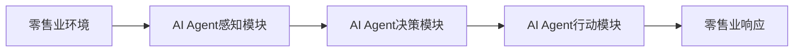

# 零售业AI Agent应用策略

> 关键词：零售业、AI Agent、应用策略、顾客体验、运营效率

> 摘要：本文围绕零售业AI Agent应用策略展开深入探讨。首先介绍了零售业引入AI Agent的背景，包括目的、预期读者等内容。接着阐述了AI Agent的核心概念、算法原理及相关数学模型。通过实际案例展示了在零售业中AI Agent的具体应用及代码实现。同时分析了AI Agent在零售业的实际应用场景，推荐了相关学习资源、开发工具和论文著作。最后总结了其未来发展趋势与挑战，并对常见问题进行解答，为零售业更好地应用AI Agent提供全面的指导和参考。

## 1. 背景介绍 
### 1.1 目的和范围
在当今数字化时代，零售业面临着日益激烈的竞争和消费者需求的快速变化。引入AI Agent旨在提升零售业的运营效率、改善顾客体验、增加销售额和利润。本文章的范围涵盖了AI Agent在零售业各个环节的应用，包括顾客服务、库存管理、营销推广等方面，并探讨了相应的应用策略。

### 1.2 预期读者
本文预期读者主要包括零售业从业者，如零售商、店长、运营管理人员等，他们希望了解如何利用AI Agent提升业务表现；同时也适合对人工智能在零售业应用感兴趣的技术人员、研究人员以及相关领域的学生，为他们提供理论和实践方面的参考。

### 1.3 文档结构概述
本文将首先介绍相关术语和核心概念，为后续内容打下基础。接着详细讲解AI Agent的核心算法原理和具体操作步骤，并通过数学模型进行进一步阐述。然后通过项目实战展示AI Agent在零售业的代码实现和详细解释。之后分析AI Agent在零售业的实际应用场景，推荐相关的学习资源、开发工具和论文著作。最后总结其未来发展趋势与挑战，解答常见问题，并提供扩展阅读和参考资料。

### 1.4 术语表
#### 1.4.1 核心术语定义
- **AI Agent（人工智能代理）**：是一种能够感知环境、自主决策并采取行动以实现特定目标的人工智能实体。在零售业中，AI Agent可以通过与顾客交互、分析数据等方式，为企业提供决策支持和服务。
- **零售业**：是指通过买卖形式将工农业生产者生产的产品直接售给居民作为生活消费用或售给社会集团供公共消费用的商品销售行业。
- **顾客体验**：是指顾客在与企业交互过程中所产生的感受和认知，包括购物过程的便捷性、服务质量、商品质量等方面。
- **运营效率**：是指企业在运营过程中投入与产出的比率，反映了企业利用资源的能力和效果。

#### 1.4.2 相关概念解释
- **机器学习**：是一门多领域交叉学科，涉及概率论、统计学、逼近论、凸分析、算法复杂度理论等多门学科。它专门研究计算机怎样模拟或实现人类的学习行为，以获取新的知识或技能，重新组织已有的知识结构使之不断改善自身的性能。在AI Agent中，机器学习常用于数据分析和预测。
- **自然语言处理**：是计算机科学领域与人工智能领域中的一个重要方向。它研究能实现人与计算机之间用自然语言进行有效通信的各种理论和方法。在零售业中，自然语言处理可用于实现智能客服与顾客的交流。

#### 1.4.3 缩略词列表
- **ML（Machine Learning）**：机器学习
- **NLP（Natural Language Processing）**：自然语言处理

## 2. 核心概念与联系 
### 核心概念原理
AI Agent在零售业中的核心原理是通过感知、决策和行动三个主要步骤来实现其功能。感知是指AI Agent通过各种传感器和数据源收集关于零售业环境的信息，如顾客行为、库存水平、市场趋势等。决策是指AI Agent根据感知到的信息，运用机器学习、规则引擎等技术进行分析和推理，制定出最优的行动方案。行动是指AI Agent根据决策结果采取相应的措施，如推荐商品、调整库存、发送营销信息等。

### 架构的文本示意图
```plaintext
+-----------------+
|   零售业环境    |
| (顾客、库存等)  |
+-----------------+
        |
        v
+-----------------+
|    AI Agent     |
|  (感知模块)     |
+-----------------+
        |
        v
+-----------------+
|    AI Agent     |
|  (决策模块)     |
+-----------------+
        |
        v
+-----------------+
|    AI Agent     |
|  (行动模块)     |
+-----------------+
        |
        v
+-----------------+
|  零售业响应     |
| (销售、库存调整) |
+-----------------+
```

### Mermaid流程图


## 3. 核心算法原理 & 具体操作步骤 
### 核心算法原理
在零售业AI Agent中，常用的核心算法包括机器学习算法和自然语言处理算法。以商品推荐为例，我们可以使用协同过滤算法。协同过滤算法基于用户的历史行为数据，找到与目标用户兴趣相似的其他用户，然后根据这些相似用户的购买行为为目标用户推荐商品。

### Python源代码详细阐述
```python
import numpy as np

# 示例用户-商品评分矩阵
user_item_matrix = np.array([
    [5, 3, 0, 1],
    [4, 0, 0, 1],
    [1, 1, 0, 5],
    [1, 0, 0, 4],
    [0, 1, 5, 4]
])

def cosine_similarity(vec1, vec2):
    """
    计算两个向量的余弦相似度
    """
    dot_product = np.dot(vec1, vec2)
    norm_vec1 = np.linalg.norm(vec1)
    norm_vec2 = np.linalg.norm(vec2)
    if norm_vec1 == 0 or norm_vec2 == 0:
        return 0
    return dot_product / (norm_vec1 * norm_vec2)

def find_similar_users(user_index, user_item_matrix, top_n=2):
    """
    找到与目标用户最相似的前n个用户
    """
    target_user = user_item_matrix[user_index]
    similarities = []
    for i in range(len(user_item_matrix)):
        if i!= user_index:
            similarity = cosine_similarity(target_user, user_item_matrix[i])
            similarities.append((i, similarity))
    similarities.sort(key=lambda x: x[1], reverse=True)
    return similarities[:top_n]

def recommend_items(user_index, user_item_matrix, top_n=2):
    """
    为目标用户推荐商品
    """
    similar_users = find_similar_users(user_index, user_item_matrix)
    item_scores = {}
    for similar_user_index, similarity in similar_users:
        similar_user = user_item_matrix[similar_user_index]
        for item_index, score in enumerate(similar_user):
            if score > 0 and user_item_matrix[user_index][item_index] == 0:
                if item_index not in item_scores:
                    item_scores[item_index] = 0
                item_scores[item_index] += similarity * score
    sorted_items = sorted(item_scores.items(), key=lambda x: x[1], reverse=True)
    return [item[0] for item in sorted_items[:top_n]]

# 为用户0推荐商品
user_index = 0
recommended_items = recommend_items(user_index, user_item_matrix)
print(f"为用户{user_index}推荐的商品索引为: {recommended_items}")
```
### 具体操作步骤
1. **数据收集**：收集用户的历史购买数据、评分数据等，构建用户-商品矩阵。
2. **相似度计算**：使用余弦相似度等方法计算目标用户与其他用户的相似度。
3. **相似用户筛选**：选择与目标用户最相似的前n个用户。
4. **商品推荐**：根据相似用户的购买行为，为目标用户推荐未购买过的商品。

## 4. 数学模型和公式 & 详细讲解 & 举例说明 
### 余弦相似度公式
余弦相似度用于衡量两个向量之间的相似程度，其公式为：
$$
\cos(\theta) = \frac{\vec{A} \cdot \vec{B}}{\|\vec{A}\| \|\vec{B}\|}
$$
其中，$\vec{A}$ 和 $\vec{B}$ 是两个向量，$\vec{A} \cdot \vec{B}$ 是它们的点积，$\|\vec{A}\|$ 和 $\|\vec{B}\|$ 分别是它们的模。

### 详细讲解
余弦相似度的取值范围在 -1 到 1 之间，值越接近 1 表示两个向量越相似，值越接近 -1 表示两个向量越不相似。在商品推荐中，我们可以将用户对商品的评分看作向量，通过计算用户之间的余弦相似度来找到兴趣相似的用户。

### 举例说明
假设有两个用户 A 和 B，他们对商品的评分向量分别为 $\vec{A} = [5, 3, 0, 1]$ 和 $\vec{B} = [4, 0, 0, 1]$。
首先计算点积：$\vec{A} \cdot \vec{B} = 5 \times 4 + 3 \times 0 + 0 \times 0 + 1 \times 1 = 21$
然后计算模：$\|\vec{A}\| = \sqrt{5^2 + 3^2 + 0^2 + 1^2} = \sqrt{35}$，$\|\vec{B}\| = \sqrt{4^2 + 0^2 + 0^2 + 1^2} = \sqrt{17}$
最后计算余弦相似度：$\cos(\theta) = \frac{21}{\sqrt{35} \times \sqrt{17}} \approx 0.85$
这表明用户 A 和用户 B 有较高的相似度，可以根据用户 B 的购买行为为用户 A 推荐商品。

## 5. 项目实战：代码实际案例和详细解释说明 
### 5.1  开发环境搭建
#### 安装Python
首先需要安装Python，建议使用Python 3.7及以上版本。可以从Python官方网站（https://www.python.org/downloads/）下载并安装。

#### 安装必要的库
使用以下命令安装项目所需的库：
```bash
pip install numpy
```

### 5.2  源代码详细实现和代码解读
```python
import numpy as np

# 示例用户-商品评分矩阵
user_item_matrix = np.array([
    [5, 3, 0, 1],
    [4, 0, 0, 1],
    [1, 1, 0, 5],
    [1, 0, 0, 4],
    [0, 1, 5, 4]
])

def cosine_similarity(vec1, vec2):
    """
    计算两个向量的余弦相似度
    """
    dot_product = np.dot(vec1, vec2)
    norm_vec1 = np.linalg.norm(vec1)
    norm_vec2 = np.linalg.norm(vec2)
    if norm_vec1 == 0 or norm_vec2 == 0:
        return 0
    return dot_product / (norm_vec1 * norm_vec2)

def find_similar_users(user_index, user_item_matrix, top_n=2):
    """
    找到与目标用户最相似的前n个用户
    """
    target_user = user_item_matrix[user_index]
    similarities = []
    for i in range(len(user_item_matrix)):
        if i!= user_index:
            similarity = cosine_similarity(target_user, user_item_matrix[i])
            similarities.append((i, similarity))
    similarities.sort(key=lambda x: x[1], reverse=True)
    return similarities[:top_n]

def recommend_items(user_index, user_item_matrix, top_n=2):
    """
    为目标用户推荐商品
    """
    similar_users = find_similar_users(user_index, user_item_matrix)
    item_scores = {}
    for similar_user_index, similarity in similar_users:
        similar_user = user_item_matrix[similar_user_index]
        for item_index, score in enumerate(similar_user):
            if score > 0 and user_item_matrix[user_index][item_index] == 0:
                if item_index not in item_scores:
                    item_scores[item_index] = 0
                item_scores[item_index] += similarity * score
    sorted_items = sorted(item_scores.items(), key=lambda x: x[1], reverse=True)
    return [item[0] for item in sorted_items[:top_n]]

# 为用户0推荐商品
user_index = 0
recommended_items = recommend_items(user_index, user_item_matrix)
print(f"为用户{user_index}推荐的商品索引为: {recommended_items}")
```
#### 代码解读
1. **导入必要的库**：导入 `numpy` 库用于处理数组和矩阵运算。
2. **定义用户-商品评分矩阵**：`user_item_matrix` 是一个二维数组，表示用户对商品的评分。
3. **定义余弦相似度函数**：`cosine_similarity` 函数用于计算两个向量的余弦相似度。
4. **定义查找相似用户函数**：`find_similar_users` 函数根据余弦相似度找到与目标用户最相似的前n个用户。
5. **定义商品推荐函数**：`recommend_items` 函数根据相似用户的购买行为为目标用户推荐商品。
6. **主程序**：选择用户0，调用 `recommend_items` 函数为其推荐商品，并打印推荐结果。

### 5.3  代码解读与分析
#### 复杂度分析
- **时间复杂度**：计算余弦相似度的时间复杂度为 $O(m)$，其中 $m$ 是向量的维度。查找相似用户的时间复杂度为 $O(nm)$，其中 $n$ 是用户的数量。商品推荐的时间复杂度为 $O(nm)$。因此，整个算法的时间复杂度为 $O(nm)$。
- **空间复杂度**：主要的空间开销是存储用户-商品矩阵和相似度列表，空间复杂度为 $O(nm)$。

#### 优缺点分析
- **优点**：协同过滤算法简单易懂，不需要对用户和商品进行复杂的建模，能够根据用户的历史行为进行个性化推荐。
- **缺点**：数据稀疏性问题可能导致相似度计算不准确，新用户和新商品的推荐效果较差。

## 6. 实际应用场景 
### 顾客服务
- **智能客服**：AI Agent可以通过自然语言处理技术实现智能客服，实时回答顾客的问题，解决顾客的疑问，提高顾客服务效率和质量。
- **个性化推荐**：根据顾客的历史购买行为、浏览记录等信息，为顾客提供个性化的商品推荐，增加顾客的购买欲望和忠诚度。

### 库存管理
- **需求预测**：AI Agent可以分析历史销售数据、市场趋势等信息，预测商品的需求，帮助企业合理安排库存，减少库存积压和缺货现象。
- **库存优化**：根据需求预测结果，AI Agent可以自动调整库存水平，优化库存结构，降低库存成本。

### 营销推广
- **精准营销**：AI Agent可以根据顾客的特征和行为，进行精准的营销推广，如发送个性化的营销邮件、短信等，提高营销效果。
- **促销活动策划**：AI Agent可以分析市场数据和顾客反馈，为企业策划合适的促销活动，如打折、满减等，提高销售额。

## 7. 工具和资源推荐
### 7.1 学习资源推荐
#### 7.1.1 书籍推荐
- 《Python机器学习》：本书详细介绍了Python在机器学习中的应用，包括各种机器学习算法的原理和实现。
- 《自然语言处理入门》：适合初学者了解自然语言处理的基本概念和方法。
- 《人工智能：现代方法》：经典的人工智能教材，涵盖了人工智能的各个领域。

#### 7.1.2 在线课程
- Coursera上的“机器学习”课程：由斯坦福大学教授Andrew Ng授课，是学习机器学习的经典课程。
- edX上的“自然语言处理”课程：提供了丰富的自然语言处理知识和实践项目。

#### 7.1.3 技术博客和网站
- Medium：有很多关于人工智能和零售业的技术文章和案例分享。
- 机器之心：专注于人工智能领域的资讯和技术解读。

### 7.2 开发工具框架推荐
#### 7.2.1 IDE和编辑器
- PyCharm：功能强大的Python集成开发环境，提供代码编辑、调试、版本控制等功能。
- Jupyter Notebook：交互式的开发环境，适合进行数据分析和模型实验。

#### 7.2.2 调试和性能分析工具
- pdb：Python自带的调试工具，用于调试Python代码。
- cProfile：Python的性能分析工具，用于分析代码的性能瓶颈。

#### 7.2.3 相关框架和库
- Scikit-learn：提供了丰富的机器学习算法和工具，方便进行数据处理和模型训练。
- NLTK：自然语言处理工具包，包含了各种自然语言处理的算法和数据集。

### 7.3 相关论文著作推荐
#### 7.3.1 经典论文
- “Item-based Collaborative Filtering Recommendation Algorithms”：介绍了基于物品的协同过滤算法，是协同过滤领域的经典论文。
- “Deep Learning in Natural Language Processing”：探讨了深度学习在自然语言处理中的应用。

#### 7.3.2 最新研究成果
- 关注顶级学术会议如NeurIPS、ACL等的最新论文，了解人工智能在零售业的最新研究动态。

#### 7.3.3 应用案例分析
- 分析一些知名零售企业如亚马逊、沃尔玛等在AI Agent应用方面的案例，学习他们的经验和做法。

## 8. 总结：未来发展趋势与挑战
### 未来发展趋势
- **更加智能化**：AI Agent将具备更强的学习和推理能力，能够更好地理解顾客的需求和行为，提供更加个性化的服务。
- **多模态融合**：结合图像、语音、文本等多种模态的信息，提高AI Agent的感知和交互能力。
- **与物联网结合**：通过与物联网设备的连接，实现对商品和顾客的实时监控和管理，提高运营效率。

### 挑战
- **数据隐私和安全**：AI Agent需要大量的用户数据来进行训练和决策，如何保护用户数据的隐私和安全是一个重要的挑战。
- **技术复杂度**：AI Agent涉及到多种技术领域，如机器学习、自然语言处理等，技术复杂度较高，需要专业的技术人员进行开发和维护。
- **伦理和法律问题**：AI Agent的决策和行为可能会对社会和人类产生影响，如何确保其符合伦理和法律要求是一个亟待解决的问题。

## 9. 附录：常见问题与解答
### 问题1：AI Agent在零售业的应用是否会导致员工失业？
解答：AI Agent的应用主要是为了提高运营效率和顾客体验，并不会完全取代员工。相反，员工可以与AI Agent协同工作，将更多的精力放在需要人类情感和创造力的工作上，如顾客关系维护、商品陈列设计等。

### 问题2：如何确保AI Agent推荐的商品符合顾客的需求？
解答：可以通过不断收集和分析顾客的反馈数据，优化AI Agent的推荐算法。同时，结合多维度的信息，如顾客的地理位置、购买时间等，提高推荐的准确性。

### 问题3：AI Agent的开发和部署成本高吗？
解答：AI Agent的开发和部署成本取决于具体的应用场景和技术实现。对于一些简单的应用，可以使用开源的框架和工具，成本相对较低。对于复杂的应用，可能需要投入较多的人力和物力，但从长期来看，其带来的效益可能会超过成本。

## 10. 扩展阅读 & 参考资料
### 扩展阅读
- 《零售的哲学》：介绍了零售行业的经营理念和策略。
- 《AI未来进行式》：探讨了人工智能对未来社会的影响。

### 参考资料
- 相关学术论文和研究报告
- 行业新闻和资讯网站
- 企业的官方文档和案例分析

作者：AI天才研究院/AI Genius Institute & 禅与计算机程序设计艺术 /Zen And The Art of Computer Programming