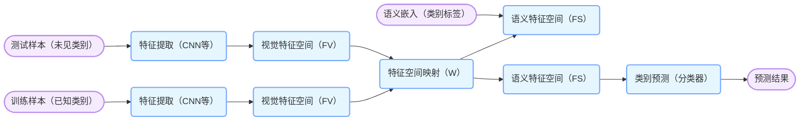

# 零样本学习:应对未见类别的识别挑战

> 关键词：零样本学习、未见类别识别、语义嵌入、特征空间映射、迁移学习

> 摘要：本文围绕零样本学习这一前沿技术展开，旨在深入探讨其如何应对未见类别的识别挑战。首先介绍了零样本学习的背景，包括目的、预期读者等内容。接着阐述了核心概念与联系，详细说明了其原理和架构，并通过Mermaid流程图直观展示。在核心算法原理部分，使用Python源代码进行了详细讲解。同时给出了相关的数学模型和公式，并举例说明。通过项目实战，展示了代码的实际应用和详细解释。分析了零样本学习的实际应用场景，推荐了学习资源、开发工具框架以及相关论文著作。最后总结了未来发展趋势与挑战，并提供了常见问题与解答以及扩展阅读和参考资料，帮助读者全面深入地了解零样本学习。

## 1. 背景介绍 
### 1.1 目的和范围
在传统的机器学习和模式识别任务中，模型的训练和测试通常是基于相同的类别集合。然而，在实际应用中，新的类别可能会不断涌现，让模型对训练阶段未曾见过的类别（未见类别）进行识别是一个极具挑战性的问题。零样本学习（Zero-Shot Learning，ZSL）正是为了解决这一问题而提出的技术。其目的是让模型在没有见过某些类别的样本的情况下，依然能够对这些未见类别进行准确的识别。

零样本学习的范围涵盖了计算机视觉、自然语言处理、语音识别等多个领域。在计算机视觉中，例如图像分类任务，可能会有新的物种图像出现；在自然语言处理中，可能会出现新的主题文本需要分类。零样本学习旨在为这些场景提供有效的解决方案。

### 1.2 预期读者
本文的预期读者包括计算机科学、人工智能、机器学习等相关专业的学生、研究人员，以及对零样本学习技术感兴趣的工程师和开发者。对于希望深入了解未见类别识别技术的初学者，本文可以作为入门学习的资料；对于有一定基础的专业人士，也可以从中获取最新的研究进展和应用案例。

### 1.3 文档结构概述
本文将按照以下结构进行阐述：首先介绍零样本学习的背景信息，包括目的、预期读者和文档结构等；接着讲解核心概念与联系，通过文本示意图和Mermaid流程图展示其原理和架构；然后详细阐述核心算法原理，使用Python代码进行具体说明，并给出相关的数学模型和公式；通过项目实战，展示代码的实际应用和详细解释；分析零样本学习的实际应用场景；推荐学习资源、开发工具框架以及相关论文著作；最后总结未来发展趋势与挑战，提供常见问题与解答以及扩展阅读和参考资料。

### 1.4 术语表
#### 1.4.1 核心术语定义
- **零样本学习（Zero-Shot Learning，ZSL）**：指模型在没有见过某些类别的训练样本的情况下，利用辅助信息（如语义信息）对这些未见类别进行识别的学习方法。
- **未见类别（Unseen Classes）**：在模型训练阶段未出现过的类别，需要模型在测试阶段进行识别。
- **语义嵌入（Semantic Embedding）**：将类别标签或文本信息映射到一个低维向量空间的过程，以便模型能够处理和利用这些语义信息。
- **特征空间映射（Feature Space Mapping）**：将样本的特征空间和语义空间进行映射，使得模型能够在不同空间之间进行信息传递和利用。
- **迁移学习（Transfer Learning）**：将从一个任务或领域学到的知识迁移到另一个任务或领域的学习方法，零样本学习可以看作是迁移学习的一种特殊形式。

#### 1.4.2 相关概念解释
- **视觉特征（Visual Features）**：在计算机视觉中，图像或视频的特征表示，如颜色、纹理、形状等。这些特征可以通过各种特征提取方法（如SIFT、HOG等）得到。
- **语义信息（Semantic Information）**：关于类别或对象的语义描述，如类别名称、属性描述等。语义信息可以帮助模型理解不同类别之间的关系。
- **跨模态信息（Cross-modal Information）**：涉及不同模态（如视觉、文本、语音等）的信息。零样本学习通常需要处理跨模态信息，将视觉特征和语义信息进行融合。

#### 1.4.3 缩略词列表
- **ZSL**：Zero-Shot Learning（零样本学习）
- **SVM**：Support Vector Machine（支持向量机）
- **CNN**：Convolutional Neural Network（卷积神经网络）
- **RNN**：Recurrent Neural Network（循环神经网络）
- **LSTM**：Long Short-Term Memory（长短期记忆网络）

## 2. 核心概念与联系 
零样本学习的核心思想是利用已知类别的信息和语义信息来推断未见类别的特征表示，从而实现对未见类别的识别。其基本原理可以通过以下步骤来理解：

### 核心概念原理
1. **语义嵌入**：将类别标签或文本描述转换为低维向量表示，这些向量包含了类别之间的语义关系。例如，“猫”和“狗”的语义向量可能在语义空间中距离较近，因为它们都属于动物类别。
2. **特征提取**：从训练样本中提取视觉特征，这些特征可以表示样本的外观信息。常用的特征提取方法包括卷积神经网络（CNN）等。
3. **特征空间映射**：将视觉特征空间和语义空间进行映射，使得模型能够在两个空间之间进行信息传递。通过这种映射，模型可以学习到视觉特征和语义信息之间的关联。
4. **未见类别识别**：在测试阶段，对于未见类别的样本，利用其视觉特征和语义信息，通过映射关系推断出其所属类别。

### 架构的文本示意图
```plaintext
|----------------------|
|  训练样本（已知类别） |
|----------------------|
          |
          v
|----------------------|
|    特征提取（CNN等）   |
|----------------------|
          |
          v
|----------------------|
|  视觉特征空间（FV）  |
|----------------------|
          |
          v
|----------------------|
|  特征空间映射（W）  |
|----------------------|
          |
          v
|----------------------|
|  语义特征空间（FS）  |
|----------------------|
          |
          v
|----------------------|
|  语义嵌入（类别标签） |
|----------------------|
          |
          v
|----------------------|
|  测试样本（未见类别） |
|----------------------|
          |
          v
|----------------------|
|    特征提取（CNN等）   |
|----------------------|
          |
          v
|----------------------|
|  视觉特征空间（FV）  |
|----------------------|
          |
          v
|----------------------|
|  特征空间映射（W）  |
|----------------------|
          |
          v
|----------------------|
|  语义特征空间（FS）  |
|----------------------|
          |
          v
|----------------------|
|    类别预测（分类器）   |
|----------------------|
```

### Mermaid流程图


## 3. 核心算法原理 & 具体操作步骤 
### 核心算法原理
零样本学习的核心算法通常涉及到特征空间映射和分类器的设计。下面以一个简单的线性映射为例，介绍其算法原理。

假设我们有训练样本的视觉特征矩阵 $X \in \mathbb{R}^{n \times d}$，其中 $n$ 是样本数量，$d$ 是特征维度；对应的语义标签矩阵 $S \in \mathbb{R}^{n \times k}$，其中 $k$ 是语义特征维度。我们的目标是学习一个映射矩阵 $W \in \mathbb{R}^{d \times k}$，使得视觉特征 $X$ 经过映射后尽可能接近语义标签 $S$。

可以通过最小化以下损失函数来学习映射矩阵 $W$：

$$
\min_{W} \| XW - S \|_F^2 + \lambda \| W \|_F^2
$$

其中 $\| \cdot \|_F$ 表示 Frobenius 范数，$\lambda$ 是正则化参数，用于防止过拟合。

### 具体操作步骤
1. **数据准备**：收集训练样本和对应的语义标签，将训练样本进行特征提取，得到视觉特征矩阵 $X$ 和语义标签矩阵 $S$。
2. **初始化映射矩阵 $W$**：可以随机初始化 $W$，或者使用其他方法进行初始化。
3. **优化损失函数**：使用梯度下降等优化算法来最小化损失函数，更新映射矩阵 $W$。
4. **测试阶段**：对于测试样本，提取其视觉特征 $x$，通过映射矩阵 $W$ 得到其在语义空间中的表示 $xW$，然后使用分类器（如最近邻分类器）进行类别预测。

### Python源代码实现
```python
import numpy as np
from sklearn.metrics.pairwise import cosine_similarity

# 生成示例数据
n = 100  # 样本数量
d = 50   # 视觉特征维度
k = 20   # 语义特征维度

# 生成训练样本的视觉特征矩阵
X = np.random.randn(n, d)

# 生成训练样本的语义标签矩阵
S = np.random.randn(n, k)

# 初始化映射矩阵 W
W = np.random.randn(d, k)

# 定义损失函数和正则化参数
lambda_ = 0.1

# 定义学习率和迭代次数
learning_rate = 0.01
num_iterations = 100

# 梯度下降优化
for i in range(num_iterations):
    # 计算误差
    error = np.dot(X, W) - S
    
    # 计算梯度
    grad_W = 2 * np.dot(X.T, error) + 2 * lambda_ * W
    
    # 更新映射矩阵 W
    W -= learning_rate * grad_W

# 生成测试样本
n_test = 20
X_test = np.random.randn(n_test, d)

# 对测试样本进行特征映射
S_test_pred = np.dot(X_test, W)

# 假设有一些未见类别的语义标签
S_unseen = np.random.randn(5, k)

# 使用最近邻分类器进行类别预测
predictions = []
for s_pred in S_test_pred:
    similarities = cosine_similarity([s_pred], S_unseen)
    predicted_class = np.argmax(similarities)
    predictions.append(predicted_class)

print("预测结果:", predictions)
```

## 4. 数学模型和公式 & 详细讲解 & 举例说明 
### 数学模型和公式
#### 损失函数
在零样本学习中，常用的损失函数是基于最小化视觉特征和语义特征之间的差异。如前面提到的线性映射损失函数：

$$
\min_{W} \| XW - S \|_F^2 + \lambda \| W \|_F^2
$$

其中，$\| XW - S \|_F^2$ 表示视觉特征经过映射后与语义标签之间的误差，$\lambda \| W \|_F^2$ 是正则化项，用于防止过拟合。

#### 梯度计算
为了更新映射矩阵 $W$，需要计算损失函数关于 $W$ 的梯度。根据矩阵求导法则，可得：

$$
\frac{\partial}{\partial W} \| XW - S \|_F^2 = 2X^T(XW - S)
$$

$$
\frac{\partial}{\partial W} \lambda \| W \|_F^2 = 2\lambda W
$$

因此，损失函数关于 $W$ 的梯度为：

$$
\nabla_W L(W) = 2X^T(XW - S) + 2\lambda W
$$

### 详细讲解
- **损失函数的意义**：损失函数的第一项 $\| XW - S \|_F^2$ 衡量了视觉特征经过映射后与语义标签之间的差异，我们希望这个差异尽可能小，这样映射后的视觉特征就能更好地表示语义信息。第二项 $\lambda \| W \|_F^2$ 是正则化项，它可以限制映射矩阵 $W$ 的大小，防止过拟合。当 $\lambda$ 较大时，$W$ 的元素会受到更大的约束，模型更加平滑；当 $\lambda$ 较小时，模型更加注重拟合训练数据。
- **梯度下降优化**：梯度下降是一种常用的优化算法，通过不断地沿着梯度的反方向更新参数，使得损失函数逐渐减小。在每次迭代中，根据计算得到的梯度 $\nabla_W L(W)$，更新映射矩阵 $W$：

$$
W \leftarrow W - \eta \nabla_W L(W)
$$

其中 $\eta$ 是学习率，控制每次更新的步长。

### 举例说明
假设我们有一个简单的视觉特征矩阵 $X$ 和语义标签矩阵 $S$：

$$
X = \begin{bmatrix}
1 & 2 \\
3 & 4 \\
5 & 6
\end{bmatrix}, \quad
S = \begin{bmatrix}
0.1 & 0.2 \\
0.3 & 0.4 \\
0.5 & 0.6
\end{bmatrix}
$$

我们希望学习一个映射矩阵 $W$，使得 $XW$ 尽可能接近 $S$。假设初始的映射矩阵 $W$ 为：

$$
W = \begin{bmatrix}
0.1 & 0.2 \\
0.3 & 0.4
\end{bmatrix}
$$

首先计算误差 $E = XW - S$：

$$
E = \begin{bmatrix}
1 & 2 \\
3 & 4 \\
5 & 6
\end{bmatrix}
\begin{bmatrix}
0.1 & 0.2 \\
0.3 & 0.4
\end{bmatrix} -
\begin{bmatrix}
0.1 & 0.2 \\
0.3 & 0.4 \\
0.5 & 0.6
\end{bmatrix}
$$

$$
= \begin{bmatrix}
0.7 & 1 \\
1.5 & 2.2 \\
2.3 & 3.4
\end{bmatrix} -
\begin{bmatrix}
0.1 & 0.2 \\
0.3 & 0.4 \\
0.5 & 0.6
\end{bmatrix}
= \begin{bmatrix}
0.6 & 0.8 \\
1.2 & 1.8 \\
1.8 & 2.8
\end{bmatrix}
$$

然后计算梯度 $\nabla_W L(W)$：

$$
\nabla_W L(W) = 2X^T E + 2\lambda W
$$

假设 $\lambda = 0.1$，则：

$$
2X^T E = 2\begin{bmatrix}
1 & 3 & 5 \\
2 & 4 & 6
\end{bmatrix}
\begin{bmatrix}
0.6 & 0.8 \\
1.2 & 1.8 \\
1.8 & 2.8
\end{bmatrix}
= 2\begin{bmatrix}
12 & 18 \\
16.8 & 25.6
\end{bmatrix}
= \begin{bmatrix}
24 & 36 \\
33.6 & 51.2
\end{bmatrix}
$$

$$
2\lambda W = 2\times 0.1\times
\begin{bmatrix}
0.1 & 0.2 \\
0.3 & 0.4
\end{bmatrix}
= \begin{bmatrix}
0.02 & 0.04 \\
0.06 & 0.08
\end{bmatrix}
$$

$$
\nabla_W L(W) = \begin{bmatrix}
24 & 36 \\
33.6 & 51.2
\end{bmatrix} +
\begin{bmatrix}
0.02 & 0.04 \\
0.06 & 0.08
\end{bmatrix}
= \begin{bmatrix}
24.02 & 36.04 \\
33.66 & 51.28
\end{bmatrix}
$$

最后，使用梯度下降更新 $W$：

假设学习率 $\eta = 0.01$，则：

$$
W \leftarrow W - \eta \nabla_W L(W)
= \begin{bmatrix}
0.1 & 0.2 \\
0.3 & 0.4
\end{bmatrix} - 0.01\times
\begin{bmatrix}
24.02 & 36.04 \\
33.66 & 51.28
\end{bmatrix}
= \begin{bmatrix}
-0.1402 & -0.1604 \\
-0.0366 & -0.1128
\end{bmatrix}
$$

通过多次迭代，不断更新 $W$，使得损失函数逐渐减小，最终得到一个较好的映射矩阵。

## 5. 项目实战：代码实际案例和详细解释说明 
### 5.1  开发环境搭建
为了实现零样本学习的项目实战，我们需要搭建相应的开发环境。以下是具体的步骤：

#### 安装Python
首先，确保你已经安装了Python 3.x版本。可以从Python官方网站（https://www.python.org/downloads/）下载并安装适合你操作系统的Python版本。

#### 安装必要的库
使用以下命令安装必要的Python库：

```bash
pip install numpy scikit-learn torch torchvision
```

- `numpy`：用于数值计算和数组操作。
- `scikit-learn`：提供了机器学习的工具和算法，如分类器、评估指标等。
- `torch` 和 `torchvision`：用于深度学习模型的构建和训练，在特征提取阶段可能会用到。

### 5.2  源代码详细实现和代码解读
以下是一个基于PyTorch实现的零样本学习项目实战代码：

```python
import torch
import torch.nn as nn
import torch.optim as optim
from torch.utils.data import DataLoader, Dataset
import numpy as np
from sklearn.metrics import accuracy_score

# 定义数据集类
class ZSLDataset(Dataset):
    def __init__(self, features, labels):
        self.features = torch.tensor(features, dtype=torch.float32)
        self.labels = torch.tensor(labels, dtype=torch.long)

    def __len__(self):
        return len(self.features)

    def __getitem__(self, idx):
        return self.features[idx], self.labels[idx]

# 定义映射网络
class MappingNetwork(nn.Module):
    def __init__(self, input_dim, output_dim):
        super(MappingNetwork, self).__init__()
        self.fc = nn.Linear(input_dim, output_dim)

    def forward(self, x):
        return self.fc(x)

# 生成示例数据
n_train = 1000
n_test = 200
d = 50
k = 20

# 生成训练样本的视觉特征和标签
X_train = np.random.randn(n_train, d)
y_train = np.random.randint(0, 10, n_train)

# 生成测试样本的视觉特征和标签
X_test = np.random.randn(n_test, d)
y_test = np.random.randint(0, 10, n_test)

# 生成语义标签矩阵
S = np.random.randn(10, k)

# 创建数据集和数据加载器
train_dataset = ZSLDataset(X_train, y_train)
train_loader = DataLoader(train_dataset, batch_size=32, shuffle=True)

# 初始化映射网络
mapping_network = MappingNetwork(d, k)

# 定义损失函数和优化器
criterion = nn.MSELoss()
optimizer = optim.Adam(mapping_network.parameters(), lr=0.001)

# 训练映射网络
num_epochs = 10
for epoch in range(num_epochs):
    running_loss = 0.0
    for features, labels in train_loader:
        optimizer.zero_grad()
        outputs = mapping_network(features)
        semantic_labels = torch.tensor(S[labels], dtype=torch.float32)
        loss = criterion(outputs, semantic_labels)
        loss.backward()
        optimizer.step()
        running_loss += loss.item()
    print(f'Epoch {epoch+1}/{num_epochs}, Loss: {running_loss/len(train_loader)}')

# 测试阶段
X_test_tensor = torch.tensor(X_test, dtype=torch.float32)
S_test_pred = mapping_network(X_test_tensor).detach().numpy()

# 使用最近邻分类器进行类别预测
predictions = []
for s_pred in S_test_pred:
    similarities = np.dot(S, s_pred) / (np.linalg.norm(S, axis=1) * np.linalg.norm(s_pred))
    predicted_class = np.argmax(similarities)
    predictions.append(predicted_class)

# 计算准确率
accuracy = accuracy_score(y_test, predictions)
print(f'Test Accuracy: {accuracy}')
```

### 5.3  代码解读与分析
#### 数据集类 `ZSLDataset`
这个类继承自 `torch.utils.data.Dataset`，用于封装数据集。`__init__` 方法接收视觉特征和标签作为输入，将其转换为 `torch.Tensor` 类型。`__len__` 方法返回数据集的长度，`__getitem__` 方法根据索引返回对应的特征和标签。

#### 映射网络 `MappingNetwork`
这个类继承自 `torch.nn.Module`，定义了一个简单的线性映射网络。`__init__` 方法初始化一个全连接层，`forward` 方法实现了前向传播过程。

#### 数据生成和处理
生成了训练样本和测试样本的视觉特征和标签，以及语义标签矩阵。使用 `ZSLDataset` 类封装训练数据集，并创建数据加载器。

#### 训练过程
使用均方误差损失函数 `nn.MSELoss()` 和Adam优化器 `optim.Adam()` 对映射网络进行训练。在每个epoch中，遍历训练数据加载器，计算损失并进行反向传播和参数更新。

#### 测试过程
将测试样本的视觉特征输入到映射网络中，得到其在语义空间中的表示。使用最近邻分类器，通过计算语义相似度来预测类别。最后计算测试准确率。

## 6. 实际应用场景 
零样本学习在多个领域都有广泛的应用，以下是一些具体的实际应用场景：

### 计算机视觉
- **图像分类**：在实际应用中，新的图像类别可能会不断出现，如新型的动植物、新的产品等。零样本学习可以让模型在没有见过这些新类别的图像的情况下，依然能够对其进行分类。例如，在一个自然图像分类系统中，可能会遇到新发现的物种图像，零样本学习可以帮助系统快速识别这些新物种。
- **目标检测**：在目标检测任务中，可能会出现一些罕见的目标类别。零样本学习可以利用语义信息来检测这些未见类别的目标。例如，在监控系统中，可能会出现一些特殊的物体，如新型的无人机，零样本学习可以帮助系统及时发现并识别这些物体。

### 自然语言处理
- **文本分类**：随着互联网的发展，新的文本主题不断涌现。零样本学习可以让文本分类模型在没有见过某些主题的文本的情况下，对其进行分类。例如，在新闻分类系统中，可能会出现一些新兴领域的新闻报道，零样本学习可以帮助系统对这些新闻进行准确分类。
- **情感分析**：不同的领域和场景可能会有不同的情感表达。零样本学习可以利用语义信息来分析未见领域的文本情感。例如，在对一些新兴的社交媒体平台上的文本进行情感分析时，零样本学习可以帮助模型更好地理解和判断文本的情感倾向。

### 语音识别
- **语音指令识别**：在智能家居、智能车载等系统中，用户可能会发出一些新的语音指令。零样本学习可以让语音识别系统在没有见过这些指令的情况下，对其进行识别。例如，用户可能会发出一些自定义的语音指令来控制智能家居设备，零样本学习可以帮助系统理解和执行这些指令。

### 生物医学
- **疾病诊断**：新的疾病类型可能会不断出现，零样本学习可以利用已知疾病的特征和语义信息来诊断未见疾病。例如，在疫情爆发初期，对于一些新型病毒引起的疾病，零样本学习可以帮助医生快速识别和诊断。
- **药物研发**：在药物研发过程中，可能会发现一些新的药物靶点和化合物。零样本学习可以利用已知药物和靶点的信息来预测新化合物的活性和作用机制。

## 7. 工具和资源推荐
### 7.1 学习资源推荐
#### 7.1.1 书籍推荐
- 《机器学习》（周志华）：这本书是机器学习领域的经典教材，全面介绍了机器学习的基本概念、算法和应用。其中包含了一些与零样本学习相关的基础知识，如特征提取、分类算法等。
- 《深度学习》（Ian Goodfellow、Yoshua Bengio、Aaron Courville）：深度学习是零样本学习的重要技术基础，这本书详细介绍了深度学习的原理、模型和应用。对于理解零样本学习中的神经网络模型和训练方法有很大帮助。
- 《计算机视觉：算法与应用》（Richard Szeliski）：在计算机视觉领域，零样本学习有广泛的应用。这本书涵盖了计算机视觉的各个方面，包括图像特征提取、目标检测、图像分类等，为零样本学习在计算机视觉中的应用提供了理论和实践基础。

#### 7.1.2 在线课程
- Coursera上的“机器学习”课程（Andrew Ng）：这是一门非常经典的机器学习在线课程，通过视频讲解、编程作业等方式，系统地介绍了机器学习的基本概念和算法。对于初学者来说，是一个很好的入门课程。
- edX上的“深度学习基础”课程（DeepLearning.AI）：由深度学习领域的知名学者开设，深入讲解了深度学习的原理和应用。课程中包含了大量的实际案例和编程练习，有助于提高学习者的实践能力。
- 中国大学MOOC上的“计算机视觉原理与应用”课程：该课程介绍了计算机视觉的基本原理和算法，包括图像特征提取、目标检测、图像分类等内容。对于零样本学习在计算机视觉中的应用有一定的指导作用。

#### 7.1.3 技术博客和网站
- Medium：这是一个技术博客平台，上面有很多关于零样本学习、机器学习和深度学习的文章。可以关注一些知名的博主和技术社区，获取最新的研究进展和实践经验。
- arXiv：这是一个预印本平台，提供了大量的学术论文。可以在上面搜索关于零样本学习的最新研究成果，了解该领域的前沿动态。
- GitHub：这是一个代码托管平台，上面有很多开源的零样本学习项目。可以通过学习这些项目的代码，深入理解零样本学习的实现方法和技术细节。

### 7.2 开发工具框架推荐
#### 7.2.1 IDE和编辑器
- PyCharm：这是一款专门为Python开发设计的集成开发环境（IDE），提供了丰富的功能，如代码编辑、调试、版本控制等。对于开发零样本学习项目非常方便。
- Jupyter Notebook：这是一个交互式的开发环境，支持Python代码的编写、运行和可视化。可以用于快速验证算法和进行实验，非常适合研究和学习。
- Visual Studio Code：这是一款轻量级的代码编辑器，支持多种编程语言和插件。可以通过安装相关的插件，实现Python代码的开发和调试。

#### 7.2.2 调试和性能分析工具
- PySnooper：这是一个简单易用的Python调试工具，可以自动记录函数的调用过程和变量的值，方便开发者快速定位问题。
- TensorBoard：这是TensorFlow提供的一个可视化工具，可以用于可视化模型的训练过程、损失函数的变化、模型的结构等。对于分析零样本学习模型的性能和调试模型非常有帮助。
- cProfile：这是Python标准库中的一个性能分析工具，可以用于分析代码的运行时间和函数调用次数，帮助开发者找出代码中的性能瓶颈。

#### 7.2.3 相关框架和库
- PyTorch：这是一个开源的深度学习框架，提供了丰富的神经网络模型和优化算法。在零样本学习中，可以使用PyTorch来构建和训练映射网络、分类器等模型。
- TensorFlow：这也是一个广泛使用的深度学习框架，具有强大的分布式训练和部署能力。可以使用TensorFlow来实现零样本学习的相关算法。
- scikit-learn：这是一个常用的机器学习库，提供了多种分类、回归、聚类等算法。在零样本学习中，可以使用scikit-learn中的分类器进行类别预测。

### 7.3 相关论文著作推荐
#### 7.3.1 经典论文
- "Learning to Detect Unseen Object Classes by Between-Class Attribute Transfer"（CVPR 2009）：这篇论文提出了基于属性转移的零样本学习方法，是零样本学习领域的经典之作。它通过将已知类别的属性信息转移到未见类别上，实现了对未见类别的识别。
- "DeViSE: A Deep Visual-Semantic Embedding Model"（NIPS 2013）：该论文提出了DeViSE模型，将视觉特征和语义信息进行嵌入，通过学习一个联合嵌入空间来实现零样本学习。这种方法在图像分类任务中取得了很好的效果。
- "Zero-Shot Learning - A Comprehensive Evaluation of the Good, the Bad and the Ugly"（CVPR 2018）：这篇论文对零样本学习的各种方法进行了全面的评估和分析，指出了不同方法的优缺点和适用场景，为后续的研究提供了重要的参考。

#### 7.3.2 最新研究成果
- 可以关注计算机视觉和机器学习领域的顶级会议，如CVPR、ICCV、NIPS、ICML等，这些会议上每年都会有很多关于零样本学习的最新研究成果发表。
- 也可以关注相关的学术期刊，如IEEE Transactions on Pattern Analysis and Machine Intelligence（PAMI）、Journal of Artificial Intelligence Research（JAIR）等，这些期刊会发表一些高质量的零样本学习研究论文。

#### 7.3.3 应用案例分析
- 在实际应用中，有很多关于零样本学习的案例分析。可以通过搜索相关的技术博客、会议论文和研究报告，了解零样本学习在计算机视觉、自然语言处理、语音识别等领域的具体应用和效果。例如，一些公司在图像搜索、智能客服等项目中应用了零样本学习技术，可以从中学习到实际的应用经验和技巧。

## 8. 总结：未来发展趋势与挑战
### 未来发展趋势
#### 多模态融合
未来的零样本学习将更加注重多模态信息的融合。除了视觉和语义信息外，还可以结合语音、触觉等多种模态的信息，提高模型对未见类别的识别能力。例如，在智能家居场景中，结合视觉、语音和触觉信息可以更准确地识别用户的意图和操作。

#### 强化学习与零样本学习的结合
强化学习可以让模型在动态环境中学习最优策略。将强化学习与零样本学习相结合，可以让模型在面对未见类别时，通过与环境的交互不断学习和调整策略，提高识别的准确性和适应性。例如，在机器人导航和目标识别任务中，结合强化学习和零样本学习可以让机器人更好地应对未知环境和目标。

#### 迁移学习的进一步发展
零样本学习本身就是迁移学习的一种特殊形式，未来迁移学习的技术将进一步发展，使得零样本学习能够更好地利用不同领域和任务之间的知识迁移。例如，将在一个领域学到的知识迁移到另一个相关领域，提高模型对未见类别的泛化能力。

#### 实际应用的拓展
随着技术的不断发展，零样本学习将在更多的实际应用场景中得到推广和应用。除了计算机视觉、自然语言处理和语音识别等领域外，还将在医疗、金融、交通等领域发挥重要作用。例如，在医疗诊断中，零样本学习可以帮助医生快速识别新的疾病类型；在金融风险评估中，零样本学习可以识别新的风险因素。

### 挑战
#### 语义信息的表示和利用
语义信息的准确表示和有效利用是零样本学习的关键问题。目前的语义表示方法还存在一些局限性，如语义信息的不完整性、语义歧义等。如何设计更加准确和有效的语义表示方法，以及如何更好地利用语义信息来提高模型的识别能力，是未来需要解决的挑战之一。

#### 模型的泛化能力
虽然零样本学习的目标是对未见类别进行识别，但模型在实际应用中可能会遇到各种复杂的情况，导致泛化能力不足。如何提高模型的泛化能力，使其在不同的数据集和场景下都能取得较好的识别效果，是一个重要的挑战。

#### 数据的稀缺性和不平衡性
在零样本学习中，未见类别的样本数据通常是稀缺的，而且不同类别的数据可能存在不平衡的情况。如何在数据稀缺和不平衡的情况下，训练出性能良好的模型，是需要解决的问题。可以采用数据增强、迁移学习等方法来缓解数据稀缺和不平衡的问题。

#### 计算资源和时间成本
一些零样本学习方法需要大量的计算资源和时间来训练模型。在实际应用中，如何在有限的计算资源和时间内，实现高效的模型训练和推理，是一个挑战。可以采用模型压缩、并行计算等技术来降低计算资源和时间成本。

## 9. 附录：常见问题与解答
### 什么是零样本学习？
零样本学习是指模型在没有见过某些类别的训练样本的情况下，利用辅助信息（如语义信息）对这些未见类别进行识别的学习方法。

### 零样本学习与传统机器学习有什么区别？
传统机器学习通常要求模型在训练和测试阶段使用相同的类别集合，而零样本学习可以让模型对训练阶段未曾见过的类别进行识别。

### 零样本学习有哪些应用场景？
零样本学习在计算机视觉（图像分类、目标检测等）、自然语言处理（文本分类、情感分析等）、语音识别（语音指令识别等）、生物医学（疾病诊断、药物研发等）等领域都有广泛的应用。

### 如何评估零样本学习模型的性能？
常见的评估指标包括准确率、召回率、F1值等。可以使用测试数据集来评估模型对未见类别的识别准确率，也可以通过比较不同模型在相同数据集上的性能来选择最优模型。

### 零样本学习面临哪些挑战？
零样本学习面临的挑战包括语义信息的表示和利用、模型的泛化能力、数据的稀缺性和不平衡性、计算资源和时间成本等问题。

## 10. 扩展阅读 & 参考资料
### 扩展阅读
- "Zero-Shot Learning: The Good, the Bad and the Ugly"（https://arxiv.org/abs/1707.00600）：这篇论文对零样本学习的各种方法进行了详细的分析和比较，指出了不同方法的优缺点和适用场景。
- "A Survey on Zero-Shot Learning: Settings, Methods, and Applications"（https://arxiv.org/abs/2003.04021）：这是一篇关于零样本学习的综述论文，全面介绍了零样本学习的研究现状、方法和应用，对进一步深入了解零样本学习有很大帮助。

### 参考资料
- 周志华. 机器学习[M]. 清华大学出版社, 2016.
- Ian Goodfellow, Yoshua Bengio, Aaron Courville. 深度学习[M]. 人民邮电出版社, 2017.
- Richard Szeliski. 计算机视觉：算法与应用[M]. 电子工业出版社, 2015.

作者：AI天才研究院/AI Genius Institute & 禅与计算机程序设计艺术 /Zen And The Art of Computer Programming