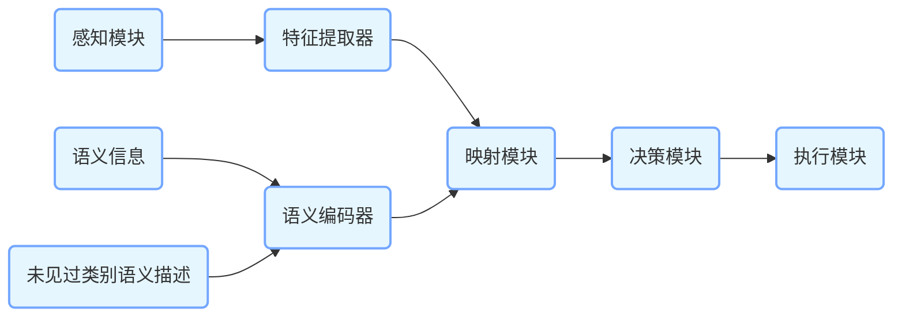

# 零样本学习在AI Agent中的应用

> 关键词：零样本学习、AI Agent、人工智能、机器学习、泛化能力、语义理解、知识迁移

> 摘要：本文深入探讨了零样本学习在AI Agent中的应用。首先介绍了相关背景，包括目的、预期读者等内容。接着阐述了零样本学习和AI Agent的核心概念及其联系，给出了相应的原理和架构示意图与流程图。详细讲解了零样本学习的核心算法原理，并通过Python代码进行说明。分析了其数学模型和公式，且举例解释。通过项目实战展示了代码实现和解读。探讨了零样本学习在AI Agent中的实际应用场景。推荐了相关的学习资源、开发工具框架以及论文著作。最后总结了未来发展趋势与挑战，还提供了常见问题解答和扩展阅读参考资料，旨在为读者全面呈现零样本学习在AI Agent领域的应用全貌。

## 1. 背景介绍 
### 1.1 目的和范围
在人工智能领域的不断发展中，AI Agent作为能够自主感知环境、做出决策并执行动作的智能体，其性能和应用范围受到广泛关注。传统的机器学习方法往往需要大量标注数据来训练模型，这在数据获取困难或标注成本高昂的场景下存在局限性。零样本学习（Zero-Shot Learning，ZSL）作为一种新兴的技术，旨在让模型在没有见过目标类别的样本情况下，依然能够对其进行分类或识别。本文章的目的在于深入探讨零样本学习在AI Agent中的应用，研究如何利用零样本学习提升AI Agent的泛化能力、语义理解能力以及知识迁移能力，拓展其在不同领域的应用范围。范围涵盖零样本学习和AI Agent的核心概念、算法原理、数学模型、项目实战、实际应用场景等多个方面。

### 1.2 预期读者
本文预期读者包括对人工智能、机器学习领域感兴趣的研究人员、工程师、学生等。对于希望深入了解零样本学习技术以及探索其在AI Agent中应用的专业人士，本文将提供全面而深入的技术讲解和实践指导。同时，对于初学者来说，也可以通过本文初步了解零样本学习和AI Agent的相关知识，为进一步学习和研究打下基础。

### 1.3 文档结构概述
本文按照以下结构进行组织：首先介绍背景信息，包括目的、预期读者和文档结构概述等。接着阐述零样本学习和AI Agent的核心概念及其联系，通过文本示意图和Mermaid流程图进行直观展示。详细讲解零样本学习的核心算法原理，并使用Python代码进行具体实现和说明。分析其数学模型和公式，通过举例加深理解。进行项目实战，包括开发环境搭建、源代码实现和代码解读。探讨零样本学习在AI Agent中的实际应用场景。推荐相关的学习资源、开发工具框架和论文著作。最后总结未来发展趋势与挑战，提供常见问题解答和扩展阅读参考资料。

### 1.4 术语表
#### 1.4.1 核心术语定义
- **零样本学习（Zero-Shot Learning，ZSL）**：是一种机器学习范式，模型在训练过程中不接触目标类别的样本，但能够利用辅助信息（如语义描述、属性信息等）对未见过的类别进行分类或识别。
- **AI Agent（人工智能智能体）**：是一种能够感知环境、根据内部状态和目标做出决策，并执行相应动作的智能实体。它可以在不同的环境中自主运行，完成各种任务。
- **泛化能力**：指模型在面对未见过的数据时，依然能够保持良好的性能和预测能力。
- **语义理解**：是指机器对自然语言或其他符号系统所表达的意义的理解和处理能力。
- **知识迁移**：将在一个任务或领域中学习到的知识和技能应用到另一个相关任务或领域中的过程。

#### 1.4.2 相关概念解释
- **有监督学习**：在有监督学习中，模型通过学习标注好的训练数据来进行预测或分类。训练数据包含输入特征和对应的标签，模型的目标是学习输入和输出之间的映射关系。
- **无监督学习**：无监督学习中，模型处理的是未标注的数据，其目标是发现数据中的结构、模式或规律，如聚类分析、降维等。
- **少样本学习（Few-Shot Learning）**：与零样本学习类似，少样本学习是指模型在仅有少量目标类别样本的情况下进行学习和分类的技术。

#### 1.4.3 缩略词列表
- **ZSL**：Zero-Shot Learning（零样本学习）
- **AI**：Artificial Intelligence（人工智能）

## 2. 核心概念与联系 

### 2.1 零样本学习的核心概念
零样本学习的核心思想是利用语义信息或其他辅助信息来弥补未见过类别样本的缺失。在传统的有监督学习中，模型需要大量的标注样本才能学习到不同类别的特征和模式。而在零样本学习中，模型通过学习已知类别的特征和对应的语义描述（如文本描述、属性向量等），建立起特征空间和语义空间之间的映射关系。当遇到未见过的类别时，模型可以根据该类别的语义描述，利用已学习的映射关系，将其映射到特征空间中，从而实现对未见过类别的分类或识别。

例如，在图像分类任务中，训练数据包含狗、猫等已知类别的图像及其对应的语义描述。当需要对“长颈鹿”这个未见过的类别进行分类时，模型可以根据“长颈鹿”的语义描述（如“长脖子、有斑点的大型动物”），结合已学习的映射关系，判断输入图像是否属于长颈鹿类别。

### 2.2 AI Agent的核心概念
AI Agent是一种具有自主性、反应性、主动性和社会性的智能实体。它能够感知周围环境的信息，根据内部的状态和目标，通过决策机制选择合适的动作，并执行这些动作来影响环境。AI Agent可以是软件程序、机器人或其他智能设备。

AI Agent通常由感知模块、决策模块和执行模块组成。感知模块负责收集环境信息，如通过摄像头、传感器等获取图像、声音、温度等数据。决策模块根据感知到的信息和内部状态，运用各种算法和策略进行决策，选择最优的动作。执行模块将决策模块的结果转化为实际的动作，如控制机器人的运动、发送消息等。

### 2.3 零样本学习与AI Agent的联系
零样本学习可以为AI Agent带来诸多优势。首先，在数据获取困难的场景下，AI Agent可以利用零样本学习技术对未见过的对象或任务进行处理，提高其泛化能力。例如，在一个智能家居环境中，AI Agent可能会遇到新的家电设备，通过零样本学习，它可以根据设备的描述信息识别设备类型，并进行相应的控制。

其次，零样本学习有助于提升AI Agent的语义理解能力。AI Agent可以通过学习语义信息，更好地理解用户的指令和环境中的信息，从而做出更准确的决策。例如，在智能客服场景中，AI Agent可以利用零样本学习理解用户的自然语言问题，即使遇到未训练过的问题类型，也能根据语义信息进行回答。

此外，零样本学习还可以促进AI Agent的知识迁移。AI Agent可以将在一个领域中学习到的知识和经验，通过零样本学习技术应用到其他相关领域，拓展其应用范围和能力。

### 2.4 核心概念原理和架构的文本示意图
零样本学习与AI Agent结合的原理和架构可以描述如下：

感知模块收集环境信息，将其输入到特征提取器中，提取出特征向量。同时，语义信息（如文本描述、属性向量等）也被输入到语义编码器中，编码为语义向量。特征向量和语义向量被输入到映射模块中，该模块学习特征空间和语义空间之间的映射关系。当AI Agent遇到未见过的类别时，根据该类别的语义描述，通过映射模块将其映射到特征空间中，然后决策模块根据映射后的特征向量进行决策，选择合适的动作，最后由执行模块执行动作。

### 2.5 Mermaid流程图


## 3. 核心算法原理 & 具体操作步骤 

### 3.1 零样本学习的核心算法原理
零样本学习的核心算法主要围绕如何建立特征空间和语义空间之间的映射关系。常见的方法有基于嵌入的方法和基于生成的方法。

#### 3.1.1 基于嵌入的方法
基于嵌入的方法的核心思想是将特征向量和语义向量嵌入到同一个低维空间中，使得在这个空间中，同类别的特征向量和语义向量距离较近，不同类别的距离较远。通过学习这样的嵌入映射，当遇到未见过的类别时，可以根据其语义向量在嵌入空间中找到对应的特征向量。

一种常见的基于嵌入的方法是线性映射。假设特征向量为 $\mathbf{x} \in \mathbb{R}^d$，语义向量为 $\mathbf{s} \in \mathbb{R}^k$，线性映射可以表示为 $\mathbf{x} = \mathbf{W}\mathbf{s}$，其中 $\mathbf{W} \in \mathbb{R}^{d \times k}$ 是映射矩阵。通过最小化目标函数来学习映射矩阵 $\mathbf{W}$，目标函数通常包括类内距离和类间距离的约束。

#### 3.1.2 基于生成的方法
基于生成的方法通过生成模型来生成未见过类别的样本。例如，使用生成对抗网络（GAN）或变分自编码器（VAE）来生成与未见过类别语义描述相符的样本。生成模型学习语义信息和样本特征之间的分布关系，当给定未见过类别的语义描述时，生成模型可以生成对应的样本，然后使用传统的分类器对生成的样本进行分类。

### 3.2 具体操作步骤
以下是基于线性映射的零样本学习的具体操作步骤：

1. **数据准备**：收集已知类别的样本及其对应的语义描述。将样本数据进行预处理，如归一化、特征提取等。将语义描述编码为向量表示。
2. **模型训练**：定义线性映射模型 $\mathbf{x} = \mathbf{W}\mathbf{s}$，并初始化映射矩阵 $\mathbf{W}$。选择合适的损失函数，如均方误差损失函数 $L = \sum_{i=1}^{n} \|\mathbf{x}_i - \mathbf{W}\mathbf{s}_i\|^2$，其中 $n$ 是样本数量。使用优化算法（如随机梯度下降）来最小化损失函数，更新映射矩阵 $\mathbf{W}$。
3. **模型预测**：当遇到未见过的类别时，获取其语义描述并编码为语义向量 $\mathbf{s}$。使用训练好的映射矩阵 $\mathbf{W}$ 计算对应的特征向量 $\mathbf{x} = \mathbf{W}\mathbf{s}$。使用传统的分类器（如支持向量机、逻辑回归等）对特征向量 $\mathbf{x}$ 进行分类，得到预测结果。

### 3.3 Python源代码详细阐述
以下是一个简单的基于线性映射的零样本学习的Python代码示例：

```python
import numpy as np
from sklearn.linear_model import LinearRegression
from sklearn.svm import SVC

# 数据准备
# 假设已知类别的特征向量
X_train = np.array([[1, 2, 3], [4, 5, 6], [7, 8, 9]])
# 对应的语义向量
S_train = np.array([[0.1, 0.2], [0.3, 0.4], [0.5, 0.6]])
# 类别标签
y_train = np.array([0, 1, 0])

# 未见过类别的语义向量
S_test = np.array([[0.7, 0.8]])

# 模型训练：线性映射
linear_model = LinearRegression()
linear_model.fit(S_train, X_train)

# 生成未见过类别的特征向量
X_test = linear_model.predict(S_test)

# 训练分类器
classifier = SVC()
classifier.fit(X_train, y_train)

# 预测未见过类别的标签
y_pred = classifier.predict(X_test)

print("预测结果:", y_pred)
```

在这个代码示例中，首先定义了已知类别的特征向量 `X_train`、语义向量 `S_train` 和类别标签 `y_train`。然后使用 `LinearRegression` 模型学习特征空间和语义空间之间的线性映射关系。接着，对于未见过类别的语义向量 `S_test`，使用训练好的线性映射模型生成对应的特征向量 `X_test`。最后，使用 `SVC` 分类器对生成的特征向量进行分类，得到预测结果。

## 4. 数学模型和公式 & 详细讲解 & 举例说明 

### 4.1 基于线性映射的数学模型和公式
在基于线性映射的零样本学习中，假设特征向量 $\mathbf{x} \in \mathbb{R}^d$，语义向量 $\mathbf{s} \in \mathbb{R}^k$，线性映射关系可以表示为：

$$\mathbf{x} = \mathbf{W}\mathbf{s} + \mathbf{b}$$

其中 $\mathbf{W} \in \mathbb{R}^{d \times k}$ 是映射矩阵，$\mathbf{b} \in \mathbb{R}^d$ 是偏置向量。为了学习映射矩阵 $\mathbf{W}$ 和偏置向量 $\mathbf{b}$，通常使用最小化损失函数的方法。常见的损失函数是均方误差损失函数：

$$L = \frac{1}{n} \sum_{i=1}^{n} \|\mathbf{x}_i - (\mathbf{W}\mathbf{s}_i + \mathbf{b})\|^2$$

其中 $n$ 是样本数量，$\mathbf{x}_i$ 是第 $i$ 个样本的特征向量，$\mathbf{s}_i$ 是第 $i$ 个样本的语义向量。

为了求解损失函数的最小值，可以使用梯度下降法。梯度下降法的更新公式为：

$$\mathbf{W} \leftarrow \mathbf{W} - \alpha \frac{\partial L}{\partial \mathbf{W}}$$

$$\mathbf{b} \leftarrow \mathbf{b} - \alpha \frac{\partial L}{\partial \mathbf{b}}$$

其中 $\alpha$ 是学习率，$\frac{\partial L}{\partial \mathbf{W}}$ 和 $\frac{\partial L}{\partial \mathbf{b}}$ 分别是损失函数 $L$ 对 $\mathbf{W}$ 和 $\mathbf{b}$ 的偏导数。

### 4.2 详细讲解
损失函数 $L$ 衡量了特征向量 $\mathbf{x}$ 和通过线性映射得到的 $\mathbf{W}\mathbf{s} + \mathbf{b}$ 之间的误差。通过最小化损失函数，我们希望找到最优的映射矩阵 $\mathbf{W}$ 和偏置向量 $\mathbf{b}$，使得特征向量和语义向量之间的映射关系更加准确。

梯度下降法是一种迭代优化算法，通过不断更新 $\mathbf{W}$ 和 $\mathbf{b}$ 的值，使得损失函数 $L$ 逐渐减小。学习率 $\alpha$ 控制了每次更新的步长，过大的学习率可能导致算法无法收敛，过小的学习率则会导致收敛速度过慢。

### 4.3 举例说明
假设我们有两个样本，特征向量分别为 $\mathbf{x}_1 = [1, 2]$ 和 $\mathbf{x}_2 = [3, 4]$，语义向量分别为 $\mathbf{s}_1 = [0.1, 0.2]$ 和 $\mathbf{s}_2 = [0.3, 0.4]$。我们的目标是学习线性映射 $\mathbf{x} = \mathbf{W}\mathbf{s} + \mathbf{b}$。

首先，初始化映射矩阵 $\mathbf{W} = \begin{bmatrix} 1 & 1 \\ 1 & 1 \end{bmatrix}$ 和偏置向量 $\mathbf{b} = [0, 0]$。

计算损失函数 $L$：

$$L = \frac{1}{2} \left( \| [1, 2] - (\begin{bmatrix} 1 & 1 \\ 1 & 1 \end{bmatrix} \begin{bmatrix} 0.1 \\ 0.2 \end{bmatrix} + [0, 0]) \|^2 + \| [3, 4] - (\begin{bmatrix} 1 & 1 \\ 1 & 1 \end{bmatrix} \begin{bmatrix} 0.3 \\ 0.4 \end{bmatrix} + [0, 0]) \|^2 \right)$$

然后，计算 $\frac{\partial L}{\partial \mathbf{W}}$ 和 $\frac{\partial L}{\partial \mathbf{b}}$，并使用梯度下降法更新 $\mathbf{W}$ 和 $\mathbf{b}$：

$$\mathbf{W} \leftarrow \mathbf{W} - \alpha \frac{\partial L}{\partial \mathbf{W}}$$

$$\mathbf{b} \leftarrow \mathbf{b} - \alpha \frac{\partial L}{\partial \mathbf{b}}$$

重复这个过程，直到损失函数 $L$ 收敛到一个较小的值。

## 5. 项目实战：代码实际案例和详细解释说明 

### 5.1 开发环境搭建
为了实现零样本学习在AI Agent中的应用，我们需要搭建相应的开发环境。以下是具体的步骤：

1. **安装Python**：确保你已经安装了Python 3.x版本。可以从Python官方网站（https://www.python.org/downloads/） 下载并安装。
2. **安装必要的库**：使用 `pip` 命令安装以下库：
    - `numpy`：用于数值计算。
    - `scikit-learn`：提供机器学习算法和工具。
    - `torch`：深度学习框架（如果使用基于深度学习的零样本学习方法）。

示例安装命令：
```sh
pip install numpy scikit-learn torch
```

3. **选择开发工具**：可以选择使用Jupyter Notebook、PyCharm等开发工具进行代码编写和调试。

### 5.2 源代码详细实现和代码解读
以下是一个基于深度学习的零样本学习在图像分类任务中的代码示例：

```python
import torch
import torch.nn as nn
import torch.optim as optim
from torchvision import datasets, transforms
from sklearn.preprocessing import LabelEncoder

# 数据预处理
transform = transforms.Compose([
    transforms.Resize((224, 224)),
    transforms.ToTensor(),
    transforms.Normalize(mean=[0.485, 0.456, 0.406], std=[0.229, 0.224, 0.225])
])

# 加载训练数据
train_dataset = datasets.CIFAR10(root='./data', train=True,
                                 download=True, transform=transform)
train_loader = torch.utils.data.DataLoader(train_dataset, batch_size=32, shuffle=True)

# 定义特征提取器
class FeatureExtractor(nn.Module):
    def __init__(self):
        super(FeatureExtractor, self).__init__()
        self.conv1 = nn.Conv2d(3, 64, kernel_size=3, padding=1)
        self.relu1 = nn.ReLU()
        self.pool1 = nn.MaxPool2d(2, 2)
        self.conv2 = nn.Conv2d(64, 128, kernel_size=3, padding=1)
        self.relu2 = nn.ReLU()
        self.pool2 = nn.MaxPool2d(2, 2)
        self.fc1 = nn.Linear(128 * 56 * 56, 512)
        self.relu3 = nn.ReLU()

    def forward(self, x):
        x = self.pool1(self.relu1(self.conv1(x)))
        x = self.pool2(self.relu2(self.conv2(x)))
        x = x.view(-1, 128 * 56 * 56)
        x = self.relu3(self.fc1(x))
        return x

# 定义语义编码器
class SemanticEncoder(nn.Module):
    def __init__(self, input_dim, output_dim):
        super(SemanticEncoder, self).__init__()
        self.fc1 = nn.Linear(input_dim, 256)
        self.relu1 = nn.ReLU()
        self.fc2 = nn.Linear(256, output_dim)

    def forward(self, x):
        x = self.relu1(self.fc1(x))
        x = self.fc2(x)
        return x

# 定义映射模块
class MappingModule(nn.Module):
    def __init__(self, feature_dim, semantic_dim):
        super(MappingModule, self).__init__()
        self.fc1 = nn.Linear(feature_dim, 256)
        self.relu1 = nn.ReLU()
        self.fc2 = nn.Linear(256, semantic_dim)

    def forward(self, x):
        x = self.relu1(self.fc1(x))
        x = self.fc2(x)
        return x

# 初始化模型
feature_extractor = FeatureExtractor()
semantic_encoder = SemanticEncoder(input_dim=10, output_dim=128)
mapping_module = MappingModule(feature_dim=512, semantic_dim=128)

# 定义损失函数和优化器
criterion = nn.MSELoss()
optimizer = optim.Adam(list(feature_extractor.parameters()) +
                       list(semantic_encoder.parameters()) +
                       list(mapping_module.parameters()), lr=0.001)

# 训练模型
num_epochs = 10
for epoch in range(num_epochs):
    running_loss = 0.0
    for i, (images, labels) in enumerate(train_loader):
        # 提取特征
        features = feature_extractor(images)

        # 编码语义信息
        label_encoder = LabelEncoder()
        encoded_labels = label_encoder.fit_transform(labels.numpy())
        semantic_labels = torch.zeros(len(encoded_labels), 10)
        semantic_labels[torch.arange(len(encoded_labels)), encoded_labels] = 1
        semantic_vectors = semantic_encoder(semantic_labels)

        # 映射特征到语义空间
        mapped_features = mapping_module(features)

        # 计算损失
        loss = criterion(mapped_features, semantic_vectors)

        # 反向传播和优化
        optimizer.zero_grad()
        loss.backward()
        optimizer.step()

        running_loss += loss.item()

    print(f'Epoch {epoch + 1}, Loss: {running_loss / len(train_loader)}')
```

### 5.3 代码解读与分析
1. **数据预处理**：使用 `transforms.Compose` 定义了一系列的数据预处理操作，包括图像缩放、转换为张量和归一化。
2. **特征提取器**：`FeatureExtractor` 类定义了一个简单的卷积神经网络，用于从图像中提取特征。
3. **语义编码器**：`SemanticEncoder` 类将类别标签编码为语义向量。
4. **映射模块**：`MappingModule` 类学习特征空间和语义空间之间的映射关系。
5. **损失函数和优化器**：使用均方误差损失函数 `nn.MSELoss()` 和Adam优化器进行模型训练。
6. **训练过程**：在每个训练周期中，首先提取图像特征，然后编码语义信息，接着将特征映射到语义空间，计算损失并进行反向传播和优化。

通过这个代码示例，我们可以看到如何使用深度学习方法实现零样本学习在图像分类任务中的应用。

## 6. 实际应用场景 
### 6.1 智能家居
在智能家居环境中，AI Agent需要能够识别和控制各种家电设备。随着智能家居设备的不断更新和多样化，新的设备类型可能会不断出现。零样本学习可以帮助AI Agent在没有见过新设备样本的情况下，根据设备的描述信息（如品牌、功能等）识别设备类型，并进行相应的控制。例如，当用户购买了一款新的智能灯具，AI Agent可以根据灯具的说明书或产品描述中的语义信息，识别出这是一款智能灯具，并学习如何控制它的开关、亮度等功能。

### 6.2 智能客服
智能客服系统需要处理用户的各种问题和需求。用户的问题类型可能非常多样化，而且新的问题类型可能会不断出现。零样本学习可以让智能客服系统在没有训练过的问题类型上也能进行回答。例如，当用户询问关于一款新推出的产品的问题时，智能客服系统可以根据产品的介绍和相关文档中的语义信息，理解用户的问题并提供相应的答案。

### 6.3 机器人导航
在机器人导航任务中，机器人需要识别环境中的各种物体和场景。环境中的物体和场景可能非常复杂，而且新的物体和场景可能会不断出现。零样本学习可以帮助机器人在没有见过新物体样本的情况下，根据物体的描述信息（如形状、颜色、用途等）识别物体类型，并做出相应的决策。例如，当机器人进入一个新的房间时，它可以根据房间中物体的描述信息，识别出桌子、椅子等物体，并规划出合适的导航路径。

### 6.4 医疗诊断
在医疗诊断领域，新的疾病类型和症状可能会不断出现。零样本学习可以帮助AI Agent在没有见过新疾病样本的情况下，根据疾病的描述信息（如症状、病因等）进行诊断和预测。例如，当出现一种新的传染病时，AI Agent可以根据疾病的症状描述和相关的医学文献中的语义信息，对患者进行初步的诊断和风险评估。

## 7. 工具和资源推荐
### 7.1 学习资源推荐
#### 7.1.1 书籍推荐
- 《深度学习》（Deep Learning）：由Ian Goodfellow、Yoshua Bengio和Aaron Courville所著，是深度学习领域的经典教材，涵盖了深度学习的基本概念、算法和应用。
- 《机器学习》（Machine Learning）：由Tom M. Mitchell所著，是机器学习领域的经典教材，介绍了机器学习的基本算法和理论。
- 《零样本学习：理论与实践》（Zero-Shot Learning: Theory and Practice）：专门介绍零样本学习的书籍，详细讲解了零样本学习的原理、算法和应用。

#### 7.1.2 在线课程
- Coursera上的“深度学习专项课程”（Deep Learning Specialization）：由Andrew Ng教授讲授，涵盖了深度学习的各个方面，包括神经网络、卷积神经网络、循环神经网络等。
- edX上的“机器学习导论”（Introduction to Machine Learning）：由MIT的教授讲授，介绍了机器学习的基本概念和算法。
- 哔哩哔哩上的一些关于零样本学习和AI Agent的视频教程，这些教程通常由国内的专家和学者录制，内容丰富且易于理解。

#### 7.1.3 技术博客和网站
- arXiv（https://arxiv.org/）：是一个预印本服务器，提供了大量的学术论文，包括零样本学习和AI Agent领域的最新研究成果。
- Medium（https://medium.com/）：是一个技术博客平台，有很多关于人工智能和机器学习的优质文章。
- 机器之心（https://www.alitaitech.com/）：专注于人工智能领域的资讯和技术分享，提供了很多关于零样本学习和AI Agent的最新动态和技术解读。

### 7.2 开发工具框架推荐
#### 7.2.1 IDE和编辑器
- PyCharm：是一款专门为Python开发设计的集成开发环境，提供了丰富的代码编辑、调试和项目管理功能。
- Jupyter Notebook：是一个交互式的开发环境，适合进行数据探索、模型训练和代码演示。
- Visual Studio Code：是一款轻量级的代码编辑器，支持多种编程语言，有丰富的插件可以扩展其功能。

#### 7.2.2 调试和性能分析工具
- TensorBoard：是TensorFlow提供的可视化工具，可以用于查看模型的训练过程、损失曲线、准确率等信息。
- PyTorch Profiler：是PyTorch提供的性能分析工具，可以帮助用户分析模型的性能瓶颈，优化代码。
- cProfile：是Python内置的性能分析工具，可以分析Python代码的运行时间和函数调用情况。

#### 7.2.3 相关框架和库
- PyTorch：是一个开源的深度学习框架，提供了丰富的深度学习模型和工具，支持GPU加速。
- TensorFlow：是另一个广泛使用的深度学习框架，提供了高级的API和分布式训练功能。
- scikit-learn：是一个简单易用的机器学习库，提供了各种机器学习算法和工具，适合初学者使用。

### 7.3 相关论文著作推荐
#### 7.3.1 经典论文
- “Zero-Shot Learning - A Comprehensive Evaluation of the Good, the Bad and the Ugly”：该论文对零样本学习的各种方法进行了全面的评估和分析，是零样本学习领域的经典论文。
- “Learning to Compare: Relation Network for Few-Shot Learning”：提出了一种基于关系网络的少样本学习方法，对零样本学习也有一定的参考价值。
- “Generative Adversarial Nets”：介绍了生成对抗网络（GAN）的基本原理和算法，GAN在零样本学习中也有广泛的应用。

#### 7.3.2 最新研究成果
- 可以关注每年的顶级学术会议，如NeurIPS（神经信息处理系统大会）、ICML（国际机器学习会议）、CVPR（计算机视觉与模式识别会议）等，这些会议上会发表很多关于零样本学习和AI Agent的最新研究成果。
- 也可以关注相关的学术期刊，如Journal of Artificial Intelligence Research（JAIR）、Artificial Intelligence等。

#### 7.3.3 应用案例分析
- 可以在ACM Digital Library、IEEE Xplore等数据库中查找关于零样本学习在不同领域应用的案例分析论文，了解零样本学习在实际应用中的效果和挑战。

## 8. 总结：未来发展趋势与挑战
### 8.1 未来发展趋势
- **多模态融合**：未来的零样本学习将更加注重多模态信息的融合，如将图像、文本、音频等多种模态的信息结合起来，提高模型的语义理解能力和泛化能力。例如，在智能客服系统中，不仅可以根据用户的文本问题进行回答，还可以结合用户的语音语调、表情等信息，提供更加个性化的服务。
- **强化学习与零样本学习的结合**：强化学习可以让AI Agent在与环境的交互中不断学习和优化策略。将强化学习与零样本学习相结合，可以让AI Agent在面对未见过的任务时，通过探索和试错，快速学习并完成任务。例如，在机器人导航任务中，机器人可以利用零样本学习识别环境中的物体和场景，然后使用强化学习算法规划最优的导航路径。
- **跨领域应用**：零样本学习将在更多的领域得到应用，如金融、教育、交通等。通过将在一个领域中学习到的知识和经验迁移到其他领域，实现跨领域的智能应用。例如，在金融领域，可以利用零样本学习对新的金融产品进行风险评估和预测。

### 8.2 挑战
- **语义信息的表示和理解**：语义信息的表示和理解是零样本学习的关键问题。如何准确地将语义信息编码为向量表示，以及如何让模型更好地理解语义信息，仍然是一个挑战。目前的方法大多基于手工特征或预训练模型，存在一定的局限性。
- **数据的稀缺性和噪声**：在零样本学习中，由于未见过类别的样本稀缺，模型容易受到数据噪声的影响。如何在数据稀缺和噪声的情况下，提高模型的性能和稳定性，是一个需要解决的问题。
- **计算资源的需求**：基于深度学习的零样本学习方法通常需要大量的计算资源，如GPU计算能力和内存。如何在有限的计算资源下，提高模型的训练和推理效率，是一个实际应用中需要考虑的问题。

## 9. 附录：常见问题与解答
### 9.1 零样本学习和少样本学习有什么区别？
零样本学习是指模型在没有见过目标类别的样本情况下进行学习和分类，主要依靠语义信息或其他辅助信息。而少样本学习是指模型在仅有少量目标类别样本的情况下进行学习和分类。零样本学习更强调在没有样本的情况下的泛化能力，少样本学习则是在少量样本的基础上进行学习。

### 9.2 零样本学习在实际应用中效果如何？
零样本学习在一些场景下取得了较好的效果，如智能家居、智能客服等。但在实际应用中，其效果还受到语义信息的质量、模型的性能等因素的影响。目前，零样本学习仍然面临一些挑战，需要进一步的研究和改进。

### 9.3 如何选择合适的零样本学习方法？
选择合适的零样本学习方法需要考虑多个因素，如数据的特点、任务的需求、计算资源等。基于嵌入的方法适用于数据维度较低、语义信息较简单的场景；基于生成的方法适用于需要生成样本的场景。在实际应用中，可以根据具体情况选择合适的方法，也可以将多种方法结合使用。

## 10. 扩展阅读 & 参考资料
- Goodfellow, I., Bengio, Y., & Courville, A. (2016). Deep Learning. MIT Press.
- Mitchell, T. M. (1997). Machine Learning. McGraw-Hill.
- “Zero-Shot Learning - A Comprehensive Evaluation of the Good, the Bad and the Ugly” by Xian, Y., Lampert, C. H., Schiele, B., & Akata, Z.
- “Learning to Compare: Relation Network for Few-Shot Learning” by Sung, F., Yang, Y., Zhang, L., Xiang, T., Torr, P. H. S., & Hospedales, T. M.
- “Generative Adversarial Nets” by Goodfellow, I. J., et al.

作者：AI天才研究院/AI Genius Institute & 禅与计算机程序设计艺术 /Zen And The Art of Computer Programming