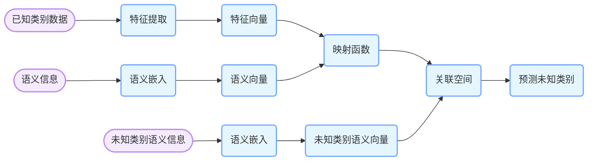

# 零样本学习在未知领域推理中的创新应用

> 关键词：零样本学习、未知领域推理、语义嵌入、知识迁移、创新应用

> 摘要：本文深入探讨了零样本学习在未知领域推理中的创新应用。首先介绍了零样本学习和未知领域推理的背景知识，包括其目的、预期读者和文档结构等。接着详细阐述了零样本学习的核心概念、算法原理，通过Python代码进行了原理的具体说明，并给出了相关的数学模型和公式。在项目实战部分，展示了开发环境搭建、源代码实现及解读。之后分析了零样本学习在多个实际应用场景中的表现，推荐了学习资源、开发工具框架和相关论文著作。最后总结了零样本学习在未知领域推理中的未来发展趋势与挑战，并对常见问题进行了解答，还提供了扩展阅读和参考资料。

## 1. 背景介绍 
### 1.1 目的和范围
零样本学习（Zero-Shot Learning，ZSL）是机器学习领域中的一个重要研究方向，其主要目的是让模型在没有见过某些类别的训练样本的情况下，依然能够对这些类别进行分类或推理。传统的机器学习方法通常依赖大量的标注数据进行训练，对于新出现的类别，需要重新收集和标注数据进行训练，这在实际应用中既耗时又费力。而零样本学习通过引入额外的语义信息，如类别属性、文本描述等，使得模型能够将已有的知识迁移到未知类别上，从而实现对未知类别的识别和推理。

本文的范围主要聚焦于零样本学习在未知领域推理中的创新应用。未知领域推理是指在模型没有接触过相关领域的数据和知识的情况下，对该领域的问题进行推理和决策。我们将探讨零样本学习如何在不同的未知领域中发挥作用，以及其在实际应用中面临的挑战和解决方案。

### 1.2 预期读者
本文的预期读者包括机器学习、人工智能领域的研究人员、工程师和学生。对于从事相关研究的人员，本文可以提供零样本学习在未知领域推理方面的最新研究进展和创新应用案例，为他们的研究提供参考和启发。对于工程师来说，本文可以帮助他们了解零样本学习的原理和实现方法，以便在实际项目中应用该技术。对于学生而言，本文可以作为学习零样本学习和未知领域推理的入门资料，帮助他们建立相关的知识体系。

### 1.3 文档结构概述
本文将按照以下结构进行组织：
- 核心概念与联系：介绍零样本学习和未知领域推理的核心概念，以及它们之间的联系，并通过文本示意图和Mermaid流程图进行直观展示。
- 核心算法原理 & 具体操作步骤：详细讲解零样本学习的核心算法原理，使用Python源代码进行具体说明，并给出具体的操作步骤。
- 数学模型和公式 & 详细讲解 & 举例说明：给出零样本学习的数学模型和公式，并进行详细讲解，通过具体的例子进行说明。
- 项目实战：代码实际案例和详细解释说明：通过一个具体的项目实战，展示零样本学习在未知领域推理中的应用，包括开发环境搭建、源代码实现和代码解读。
- 实际应用场景：分析零样本学习在不同实际应用场景中的表现和优势。
- 工具和资源推荐：推荐学习零样本学习和未知领域推理的相关资源，包括书籍、在线课程、技术博客和网站，以及开发工具框架和相关论文著作。
- 总结：未来发展趋势与挑战：总结零样本学习在未知领域推理中的未来发展趋势和面临的挑战。
- 附录：常见问题与解答：解答读者在学习和应用零样本学习过程中常见的问题。
- 扩展阅读 & 参考资料：提供扩展阅读的相关资料和参考书目。

### 1.4 术语表
#### 1.4.1 核心术语定义
- **零样本学习（Zero-Shot Learning，ZSL）**：一种机器学习方法，模型在没有见过某些类别的训练样本的情况下，通过引入额外的语义信息，实现对这些类别的分类或推理。
- **未知领域推理**：在模型没有接触过相关领域的数据和知识的情况下，对该领域的问题进行推理和决策。
- **语义嵌入（Semantic Embedding）**：将文本、图像等数据映射到低维向量空间的过程，使得具有相似语义的数据在向量空间中距离较近。
- **知识迁移（Knowledge Transfer）**：将在一个领域中学习到的知识应用到另一个领域的过程。

#### 1.4.2 相关概念解释
- **有监督学习（Supervised Learning）**：一种机器学习方法，模型通过学习标注好的训练数据来进行预测和分类。与零样本学习不同，有监督学习需要大量的标注数据进行训练。
- **少样本学习（Few-Shot Learning）**：模型在只有少量训练样本的情况下进行学习和分类的方法。与零样本学习相比，少样本学习至少有一些训练样本可供使用。
- **泛化能力（Generalization Ability）**：模型在未见过的数据上的表现能力。零样本学习的目标之一就是提高模型的泛化能力，使其能够在未知类别上进行准确的推理。

#### 1.4.3 缩略词列表
- **ZSL**：Zero-Shot Learning（零样本学习）
- **CNN**：Convolutional Neural Network（卷积神经网络）
- **RNN**：Recurrent Neural Network（循环神经网络）
- **SVM**：Support Vector Machine（支持向量机）

## 2. 核心概念与联系 
### 核心概念原理
零样本学习的核心思想是利用额外的语义信息来建立已知类别和未知类别之间的联系。在传统的有监督学习中，模型通过学习训练样本的特征来进行分类。而在零样本学习中，由于没有未知类别的训练样本，模型需要借助语义信息，如类别属性、文本描述等，来理解未知类别的语义特征，并将其与已知类别的特征进行关联。

例如，在图像分类任务中，已知类别有“猫”和“狗”，未知类别有“熊猫”。模型可以通过学习“猫”和“狗”的图像特征以及它们的语义描述，如“猫是小型哺乳动物，有柔软的毛发和锋利的爪子”，“狗是忠诚的动物，善于奔跑和守护”，然后根据“熊猫是一种大型哺乳动物，有黑白相间的毛发，喜欢吃竹子”这样的语义描述，将“熊猫”与已知类别进行比较和推理，从而实现对“熊猫”的分类。

### 架构的文本示意图
```plaintext
已知类别数据（图像、文本等） ---> 特征提取（CNN、RNN等） ---> 特征向量
语义信息（类别属性、文本描述等） ---> 语义嵌入（Word2Vec、GloVe等） ---> 语义向量
特征向量和语义向量 ---> 映射函数（线性映射、非线性映射等） ---> 关联空间
未知类别语义信息 ---> 语义嵌入 ---> 未知类别语义向量
未知类别语义向量 ---> 关联空间 ---> 预测未知类别
```

### Mermaid流程图


## 3. 核心算法原理 & 具体操作步骤 
### 核心算法原理
零样本学习的核心算法主要包括特征提取、语义嵌入和映射函数三个部分。

#### 特征提取
特征提取是从输入数据中提取有用信息的过程。在图像分类任务中，常用的特征提取方法是卷积神经网络（CNN），如AlexNet、VGG、ResNet等。这些网络可以自动学习图像的特征表示，将图像转换为特征向量。

#### 语义嵌入
语义嵌入是将文本信息转换为向量表示的过程。常用的语义嵌入方法有Word2Vec、GloVe等。这些方法可以将词语映射到低维向量空间，使得具有相似语义的词语在向量空间中距离较近。

#### 映射函数
映射函数的作用是将特征向量和语义向量映射到同一个关联空间中，使得它们之间可以进行比较和关联。常用的映射函数有线性映射和非线性映射，如线性回归、多层感知机（MLP）等。

### 具体操作步骤
以下是一个基于Python和PyTorch实现的零样本学习的具体操作步骤：

```python
import torch
import torch.nn as nn
import torch.optim as optim
from torch.utils.data import DataLoader, Dataset

# 定义特征提取器
class FeatureExtractor(nn.Module):
    def __init__(self):
        super(FeatureExtractor, self).__init__()
        self.conv1 = nn.Conv2d(3, 16, kernel_size=3, padding=1)
        self.relu = nn.ReLU()
        self.pool = nn.MaxPool2d(2, 2)
        self.fc = nn.Linear(16 * 16 * 16, 128)

    def forward(self, x):
        x = self.pool(self.relu(self.conv1(x)))
        x = x.view(-1, 16 * 16 * 16)
        x = self.fc(x)
        return x

# 定义语义嵌入器
class SemanticEmbedder(nn.Module):
    def __init__(self):
        super(SemanticEmbedder, self).__init__()
        self.fc = nn.Linear(100, 128)

    def forward(self, x):
        x = self.fc(x)
        return x

# 定义映射函数
class MappingFunction(nn.Module):
    def __init__(self):
        super(MappingFunction, self).__init__()
        self.fc = nn.Linear(128, 128)

    def forward(self, x):
        x = self.fc(x)
        return x

# 定义数据集
class ZeroShotDataset(Dataset):
    def __init__(self, images, semantics):
        self.images = images
        self.semantics = semantics

    def __len__(self):
        return len(self.images)

    def __getitem__(self, idx):
        image = self.images[idx]
        semantic = self.semantics[idx]
        return image, semantic

# 训练模型
def train_model(feature_extractor, semantic_embedder, mapping_function, train_loader, criterion, optimizer, num_epochs):
    for epoch in range(num_epochs):
        running_loss = 0.0
        for images, semantics in train_loader:
            optimizer.zero_grad()

            # 提取特征
            features = feature_extractor(images)

            # 语义嵌入
            semantic_vectors = semantic_embedder(semantics)

            # 映射到关联空间
            mapped_features = mapping_function(features)

            # 计算损失
            loss = criterion(mapped_features, semantic_vectors)

            # 反向传播和优化
            loss.backward()
            optimizer.step()

            running_loss += loss.item()

        print(f'Epoch {epoch + 1}, Loss: {running_loss / len(train_loader)}')

# 测试模型
def test_model(feature_extractor, semantic_embedder, mapping_function, test_images, test_semantics):
    with torch.no_grad():
        features = feature_extractor(test_images)
        semantic_vectors = semantic_embedder(test_semantics)
        mapped_features = mapping_function(features)

        # 计算相似度
        similarities = torch.cosine_similarity(mapped_features, semantic_vectors)

        # 预测类别
        predicted_classes = torch.argmax(similarities, dim=1)

    return predicted_classes

# 示例数据
train_images = torch.randn(100, 3, 32, 32)
train_semantics = torch.randn(100, 100)
test_images = torch.randn(10, 3, 32, 32)
test_semantics = torch.randn(10, 100)

# 创建数据集和数据加载器
train_dataset = ZeroShotDataset(train_images, train_semantics)
train_loader = DataLoader(train_dataset, batch_size=10, shuffle=True)

# 初始化模型
feature_extractor = FeatureExtractor()
semantic_embedder = SemanticEmbedder()
mapping_function = MappingFunction()

# 定义损失函数和优化器
criterion = nn.MSELoss()
optimizer = optim.Adam(list(feature_extractor.parameters()) + list(semantic_embedder.parameters()) + list(mapping_function.parameters()), lr=0.001)

# 训练模型
train_model(feature_extractor, semantic_embedder, mapping_function, train_loader, criterion, optimizer, num_epochs=10)

# 测试模型
predicted_classes = test_model(feature_extractor, semantic_embedder, mapping_function, test_images, test_semantics)
print('Predicted classes:', predicted_classes)
```

### 代码解释
1. **特征提取器（FeatureExtractor）**：使用一个简单的卷积神经网络来提取图像的特征。
2. **语义嵌入器（SemanticEmbedder）**：将语义信息映射到128维的向量空间。
3. **映射函数（MappingFunction）**：将特征向量和语义向量映射到同一个关联空间中。
4. **数据集（ZeroShotDataset）**：自定义数据集类，用于加载图像和语义信息。
5. **训练模型（train_model）**：通过迭代训练数据，计算损失并进行反向传播和优化。
6. **测试模型（test_model）**：在测试数据上进行预测，计算相似度并选择相似度最高的类别作为预测结果。

## 4. 数学模型和公式 & 详细讲解 & 举例说明 
### 数学模型
零样本学习的数学模型可以表示为以下几个步骤：

#### 特征提取
设输入的图像数据为 $X = \{x_1, x_2, \cdots, x_n\}$，其中 $x_i \in \mathbb{R}^{C \times H \times W}$ 表示第 $i$ 个图像，$C$ 表示通道数，$H$ 和 $W$ 分别表示图像的高度和宽度。特征提取器 $f$ 将图像 $x_i$ 转换为特征向量 $z_i = f(x_i) \in \mathbb{R}^d$，其中 $d$ 表示特征向量的维度。

#### 语义嵌入
设语义信息为 $S = \{s_1, s_2, \cdots, s_n\}$，其中 $s_i \in \mathbb{R}^m$ 表示第 $i$ 个语义向量，$m$ 表示语义向量的维度。语义嵌入器 $g$ 将语义信息 $s_i$ 转换为语义向量 $v_i = g(s_i) \in \mathbb{R}^d$。

#### 映射函数
映射函数 $h$ 将特征向量 $z_i$ 映射到关联空间中，得到映射后的特征向量 $\hat{z}_i = h(z_i) \in \mathbb{R}^d$。目标是使得映射后的特征向量 $\hat{z}_i$ 与语义向量 $v_i$ 尽可能接近。

#### 损失函数
常用的损失函数是均方误差损失（Mean Squared Error，MSE），定义为：
$$
L = \frac{1}{n} \sum_{i=1}^{n} \|\hat{z}_i - v_i\|_2^2
$$

### 详细讲解
- **特征提取**：特征提取器 $f$ 通常是一个深度神经网络，如卷积神经网络（CNN）。通过学习图像的特征表示，将图像转换为低维的特征向量，以便后续的处理。
- **语义嵌入**：语义嵌入器 $g$ 将语义信息转换为向量表示，使得具有相似语义的信息在向量空间中距离较近。常用的语义嵌入方法有Word2Vec、GloVe等。
- **映射函数**：映射函数 $h$ 的作用是将特征向量和语义向量映射到同一个关联空间中，使得它们之间可以进行比较和关联。映射函数可以是线性的，也可以是非线性的。
- **损失函数**：均方误差损失 $L$ 衡量了映射后的特征向量 $\hat{z}_i$ 与语义向量 $v_i$ 之间的差异。通过最小化损失函数，可以使得映射后的特征向量尽可能接近语义向量。

### 举例说明
假设我们有一个图像分类任务，已知类别有“猫”和“狗”，未知类别有“熊猫”。我们可以收集一些“猫”和“狗”的图像数据 $X$，以及它们的语义描述 $S$。

- **特征提取**：使用一个卷积神经网络作为特征提取器 $f$，将图像数据 $X$ 转换为特征向量 $Z = \{z_1, z_2, \cdots, z_n\}$。
- **语义嵌入**：使用Word2Vec作为语义嵌入器 $g$，将语义描述 $S$ 转换为语义向量 $V = \{v_1, v_2, \cdots, v_n\}$。
- **映射函数**：使用一个线性映射函数 $h$，将特征向量 $Z$ 映射到关联空间中，得到映射后的特征向量 $\hat{Z} = \{ \hat{z}_1, \hat{z}_2, \cdots, \hat{z}_n\}$。
- **损失函数**：计算映射后的特征向量 $\hat{Z}$ 与语义向量 $V$ 之间的均方误差损失 $L$，并通过优化算法（如随机梯度下降）最小化损失函数。

当有一个未知类别的图像（如“熊猫”的图像）输入时，我们可以通过特征提取器 $f$ 得到其特征向量 $z_{unknown}$，然后通过映射函数 $h$ 得到映射后的特征向量 $\hat{z}_{unknown}$。最后，计算 $\hat{z}_{unknown}$ 与所有已知类别语义向量的相似度，选择相似度最高的类别作为预测结果。

## 5. 项目实战：代码实际案例和详细解释说明 
### 5.1  开发环境搭建
#### 安装Python和PyTorch
首先，确保你已经安装了Python 3.x。可以从Python官方网站（https://www.python.org/downloads/）下载并安装Python。

然后，安装PyTorch。根据你的操作系统和CUDA版本，选择合适的安装命令。例如，如果你使用的是CPU版本的PyTorch，可以使用以下命令安装：
```bash
pip install torch torchvision
```

#### 安装其他依赖库
除了PyTorch，还需要安装一些其他的依赖库，如NumPy、Matplotlib等。可以使用以下命令安装：
```bash
pip install numpy matplotlib
```

### 5.2  源代码详细实现和代码解读
以下是一个完整的零样本学习项目实战代码，包括数据加载、模型定义、训练和测试：

```python
import torch
import torch.nn as nn
import torch.optim as optim
from torch.utils.data import DataLoader, Dataset
import numpy as np
import matplotlib.pyplot as plt

# 定义特征提取器
class FeatureExtractor(nn.Module):
    def __init__(self):
        super(FeatureExtractor, self).__init__()
        self.conv1 = nn.Conv2d(3, 16, kernel_size=3, padding=1)
        self.relu = nn.ReLU()
        self.pool = nn.MaxPool2d(2, 2)
        self.fc = nn.Linear(16 * 16 * 16, 128)

    def forward(self, x):
        x = self.pool(self.relu(self.conv1(x)))
        x = x.view(-1, 16 * 16 * 16)
        x = self.fc(x)
        return x

# 定义语义嵌入器
class SemanticEmbedder(nn.Module):
    def __init__(self):
        super(SemanticEmbedder, self).__init__()
        self.fc = nn.Linear(100, 128)

    def forward(self, x):
        x = self.fc(x)
        return x

# 定义映射函数
class MappingFunction(nn.Module):
    def __init__(self):
        super(MappingFunction, self).__init__()
        self.fc = nn.Linear(128, 128)

    def forward(self, x):
        x = self.fc(x)
        return x

# 定义数据集
class ZeroShotDataset(Dataset):
    def __init__(self, images, semantics):
        self.images = images
        self.semantics = semantics

    def __len__(self):
        return len(self.images)

    def __getitem__(self, idx):
        image = self.images[idx]
        semantic = self.semantics[idx]
        return image, semantic

# 训练模型
def train_model(feature_extractor, semantic_embedder, mapping_function, train_loader, criterion, optimizer, num_epochs):
    losses = []
    for epoch in range(num_epochs):
        running_loss = 0.0
        for images, semantics in train_loader:
            optimizer.zero_grad()

            # 提取特征
            features = feature_extractor(images)

            # 语义嵌入
            semantic_vectors = semantic_embedder(semantics)

            # 映射到关联空间
            mapped_features = mapping_function(features)

            # 计算损失
            loss = criterion(mapped_features, semantic_vectors)

            # 反向传播和优化
            loss.backward()
            optimizer.step()

            running_loss += loss.item()

        epoch_loss = running_loss / len(train_loader)
        losses.append(epoch_loss)
        print(f'Epoch {epoch + 1}, Loss: {epoch_loss}')

    # 绘制损失曲线
    plt.plot(losses)
    plt.xlabel('Epoch')
    plt.ylabel('Loss')
    plt.title('Training Loss')
    plt.show()

# 测试模型
def test_model(feature_extractor, semantic_embedder, mapping_function, test_images, test_semantics):
    with torch.no_grad():
        features = feature_extractor(test_images)
        semantic_vectors = semantic_embedder(test_semantics)
        mapped_features = mapping_function(features)

        # 计算相似度
        similarities = torch.cosine_similarity(mapped_features, semantic_vectors)

        # 预测类别
        predicted_classes = torch.argmax(similarities, dim=1)

    return predicted_classes

# 示例数据
train_images = torch.randn(100, 3, 32, 32)
train_semantics = torch.randn(100, 100)
test_images = torch.randn(10, 3, 32, 32)
test_semantics = torch.randn(10, 100)

# 创建数据集和数据加载器
train_dataset = ZeroShotDataset(train_images, train_semantics)
train_loader = DataLoader(train_dataset, batch_size=10, shuffle=True)

# 初始化模型
feature_extractor = FeatureExtractor()
semantic_embedder = SemanticEmbedder()
mapping_function = MappingFunction()

# 定义损失函数和优化器
criterion = nn.MSELoss()
optimizer = optim.Adam(list(feature_extractor.parameters()) + list(semantic_embedder.parameters()) + list(mapping_function.parameters()), lr=0.001)

# 训练模型
train_model(feature_extractor, semantic_embedder, mapping_function, train_loader, criterion, optimizer, num_epochs=10)

# 测试模型
predicted_classes = test_model(feature_extractor, semantic_embedder, mapping_function, test_images, test_semantics)
print('Predicted classes:', predicted_classes)
```

### 代码解读与分析
#### 模型定义
- **特征提取器（FeatureExtractor）**：使用一个简单的卷积神经网络来提取图像的特征。包含一个卷积层、一个ReLU激活函数、一个最大池化层和一个全连接层。
- **语义嵌入器（SemanticEmbedder）**：将语义信息映射到128维的向量空间。使用一个全连接层实现。
- **映射函数（MappingFunction）**：将特征向量和语义向量映射到同一个关联空间中。使用一个全连接层实现。

#### 数据集和数据加载器
- **ZeroShotDataset**：自定义数据集类，用于加载图像和语义信息。
- **DataLoader**：用于批量加载数据，提高训练效率。

#### 训练过程
- **train_model**：通过迭代训练数据，计算损失并进行反向传播和优化。同时，记录每个epoch的损失，并绘制损失曲线。

#### 测试过程
- **test_model**：在测试数据上进行预测，计算相似度并选择相似度最高的类别作为预测结果。

## 6. 实际应用场景 
### 图像分类
在图像分类任务中，零样本学习可以帮助模型识别未见过的图像类别。例如，在一个动物图像分类系统中，模型可能只训练过“猫”、“狗”、“鸟”等常见动物的图像，但当遇到“熊猫”、“考拉”等未见过的动物图像时，通过引入这些动物的语义描述，如“熊猫是一种大型哺乳动物，有黑白相间的毛发，喜欢吃竹子”，模型可以利用零样本学习的方法对这些图像进行分类。

### 自然语言处理
在自然语言处理领域，零样本学习可以用于文本分类、情感分析等任务。例如，在一个新闻分类系统中，模型可能只训练过政治、经济、体育等常见新闻类别的文本，但当遇到一些新的新闻类别，如科技、环保等，通过引入这些类别的语义描述，模型可以对这些新闻文本进行分类。

### 医疗诊断
在医疗诊断领域，零样本学习可以帮助医生识别一些罕见疾病。由于罕见疾病的病例数量较少，传统的机器学习方法可能无法有效地学习这些疾病的特征。而零样本学习可以通过引入疾病的语义信息，如症状描述、病理特征等，帮助模型对罕见疾病进行诊断。

### 机器人导航
在机器人导航任务中，零样本学习可以帮助机器人在未知环境中进行导航。例如，机器人可能只在室内环境中进行过训练，但当它进入一个室外环境时，通过引入室外环境的语义信息，如地形、地标等，机器人可以利用零样本学习的方法在室外环境中进行导航。

## 7. 工具和资源推荐
### 7.1 学习资源推荐
#### 7.1.1 书籍推荐
- 《深度学习》（Deep Learning）：由Ian Goodfellow、Yoshua Bengio和Aaron Courville所著，是深度学习领域的经典教材，涵盖了深度学习的基本概念、算法和应用。
- 《机器学习》（Machine Learning）：由Tom M. Mitchell所著，是机器学习领域的经典教材，介绍了机器学习的基本概念、算法和应用。
- 《人工智能：一种现代的方法》（Artificial Intelligence: A Modern Approach）：由Stuart Russell和Peter Norvig所著，是人工智能领域的经典教材，涵盖了人工智能的各个方面，包括机器学习、自然语言处理、计算机视觉等。

#### 7.1.2 在线课程
- Coursera上的“深度学习专项课程”（Deep Learning Specialization）：由Andrew Ng教授讲授，包括五门课程，涵盖了深度学习的基础知识、卷积神经网络、循环神经网络等内容。
- edX上的“人工智能导论”（Introduction to Artificial Intelligence）：由MIT教授讲授，介绍了人工智能的基本概念、算法和应用。
- Udemy上的“零样本学习实战”（Zero-Shot Learning in Practice）：专门介绍零样本学习的原理和应用，通过实际案例进行讲解。

#### 7.1.3 技术博客和网站
- Medium：是一个技术博客平台，上面有很多关于机器学习、深度学习和零样本学习的文章。
- arXiv：是一个预印本平台，上面有很多最新的机器学习和人工智能研究论文。
- Kaggle：是一个数据科学竞赛平台，上面有很多关于机器学习和人工智能的数据集和代码示例。

### 7.2 开发工具框架推荐
#### 7.2.1 IDE和编辑器
- PyCharm：是一个专门为Python开发设计的集成开发环境（IDE），具有代码编辑、调试、版本控制等功能。
- Jupyter Notebook：是一个交互式的开发环境，适合进行数据分析和模型开发。可以在浏览器中编写和运行代码，并将代码、文本和可视化结果整合在一起。
- Visual Studio Code：是一个轻量级的代码编辑器，支持多种编程语言，具有丰富的插件和扩展功能。

#### 7.2.2 调试和性能分析工具
- PyTorch Profiler：是PyTorch自带的性能分析工具，可以帮助开发者分析模型的性能瓶颈，如计算时间、内存使用等。
- TensorBoard：是TensorFlow自带的可视化工具，也可以与PyTorch结合使用。可以用于可视化模型的训练过程、损失曲线、准确率等。
- cProfile：是Python标准库中的性能分析工具，可以帮助开发者分析Python代码的性能瓶颈。

#### 7.2.3 相关框架和库
- PyTorch：是一个开源的深度学习框架，具有动态图、易于使用等优点，广泛应用于机器学习和深度学习领域。
- TensorFlow：是另一个开源的深度学习框架，具有强大的分布式训练和部署能力，广泛应用于工业界。
- scikit-learn：是一个开源的机器学习库，提供了丰富的机器学习算法和工具，如分类、回归、聚类等。

### 7.3 相关论文著作推荐
#### 7.3.1 经典论文
- “Zero-Shot Learning through Cross-Modal Transfer”：介绍了零样本学习的基本概念和方法，通过跨模态转移实现对未知类别的分类。
- “DeViSE: A Deep Visual-Semantic Embedding Model”：提出了一种基于深度视觉语义嵌入的零样本学习方法，将图像特征和语义信息映射到同一个关联空间中。
- “Transductive Zero-Shot Learning with Self-Ensembling”：提出了一种基于自集成的转导式零样本学习方法，提高了零样本学习的性能。

#### 7.3.2 最新研究成果
- 可以通过arXiv、ACM Digital Library、IEEE Xplore等学术数据库搜索最新的零样本学习研究论文，了解该领域的最新研究进展。

#### 7.3.3 应用案例分析
- 可以通过阅读相关的学术论文和技术博客，了解零样本学习在不同领域的应用案例，如医疗诊断、图像分类、自然语言处理等。

## 8. 总结：未来发展趋势与挑战
### 未来发展趋势
- **多模态融合**：未来的零样本学习将更加注重多模态信息的融合，如图像、文本、音频等。通过融合多种模态的信息，可以提高模型对未知类别的理解和推理能力。
- **强化学习与零样本学习的结合**：强化学习可以通过与环境的交互来学习最优策略，将强化学习与零样本学习相结合，可以使模型在未知环境中更加灵活地进行推理和决策。
- **应用领域的拓展**：零样本学习将在更多的领域得到应用，如自动驾驶、智能家居、金融风险预测等。随着技术的不断发展，零样本学习将为这些领域带来新的解决方案和创新应用。

### 挑战
- **语义信息的表示和理解**：语义信息的表示和理解是零样本学习的关键问题之一。如何准确地将语义信息转换为向量表示，以及如何理解语义信息之间的关系，仍然是一个具有挑战性的问题。
- **模型的泛化能力**：虽然零样本学习的目标是提高模型的泛化能力，但在实际应用中，模型的泛化能力仍然存在一定的局限性。如何进一步提高模型在未知类别上的泛化能力，是未来需要解决的问题之一。
- **数据的质量和多样性**：零样本学习需要大量的语义信息和已知类别数据进行训练。数据的质量和多样性对模型的性能有很大的影响。如何获取高质量、多样化的数据，是零样本学习面临的另一个挑战。

## 9. 附录：常见问题与解答
### 问题1：零样本学习和少样本学习有什么区别？
零样本学习是指模型在没有见过某些类别的训练样本的情况下，通过引入额外的语义信息，实现对这些类别的分类或推理。而少样本学习是指模型在只有少量训练样本的情况下进行学习和分类的方法。与零样本学习相比，少样本学习至少有一些训练样本可供使用。

### 问题2：零样本学习的应用场景有哪些？
零样本学习的应用场景非常广泛，包括图像分类、自然语言处理、医疗诊断、机器人导航等。在这些场景中，零样本学习可以帮助模型识别未见过的类别或在未知环境中进行推理和决策。

### 问题3：如何选择合适的语义嵌入方法？
选择合适的语义嵌入方法需要考虑多个因素，如数据的类型、语义信息的复杂度、模型的性能要求等。常用的语义嵌入方法有Word2Vec、GloVe、BERT等。对于简单的文本数据，可以选择Word2Vec或GloVe；对于复杂的文本数据，可以选择BERT等预训练模型。

### 问题4：零样本学习的性能受哪些因素影响？
零样本学习的性能受多个因素影响，包括语义信息的质量、特征提取器的性能、映射函数的设计、数据集的大小和多样性等。提高这些因素的质量和性能，可以提高零样本学习的性能。

## 10. 扩展阅读 & 参考资料
### 扩展阅读
- 《深度学习进阶：自然语言处理》：深入介绍了自然语言处理领域的深度学习方法，包括语义嵌入、循环神经网络、Transformer等。
- 《计算机视觉：算法与应用》：介绍了计算机视觉领域的基本算法和应用，包括图像分类、目标检测、语义分割等。
- 《强化学习：原理与Python实现》：详细介绍了强化学习的基本原理和算法，并通过Python代码进行实现。

### 参考资料
- Goodfellow, I., Bengio, Y., & Courville, A. (2016). Deep Learning. MIT Press.
- Mitchell, T. M. (1997). Machine Learning. McGraw-Hill.
- Russell, S. J., & Norvig, P. (2020). Artificial Intelligence: A Modern Approach. Pearson.

作者：AI天才研究院/AI Genius Institute & 禅与计算机程序设计艺术 /Zen And The Art of Computer Programming