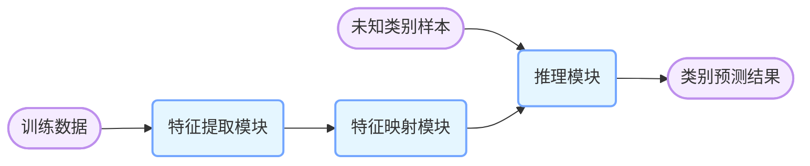

# 零样本学习在未知领域推理任务中的应用

> 关键词：零样本学习、未知领域推理、机器学习、知识迁移、多模态信息

> 摘要：本文深入探讨了零样本学习在未知领域推理任务中的应用。首先介绍了零样本学习和未知领域推理的背景知识，包括目的、预期读者、文档结构和相关术语。接着阐述了核心概念及其联系，通过文本示意图和Mermaid流程图展示了零样本学习的原理和架构。详细讲解了核心算法原理，并给出Python源代码示例。分析了零样本学习涉及的数学模型和公式，辅以具体例子说明。通过项目实战，展示了在实际中如何实现零样本学习在未知领域推理任务中的应用，包括开发环境搭建、源代码实现和解读。探讨了零样本学习在多个实际场景中的应用，推荐了相关的学习资源、开发工具框架和论文著作。最后总结了零样本学习的未来发展趋势与挑战，并提供常见问题解答和扩展阅读参考资料。

## 1. 背景介绍 
### 1.1 目的和范围
零样本学习（Zero-Shot Learning，ZSL）是机器学习领域的一个重要研究方向，旨在让模型在没有见过某些类别的训练样本的情况下，依然能够对这些类别进行分类或推理。未知领域推理任务则是指在模型训练过程中未涉及的领域进行推理和判断。本文章的目的是深入探讨零样本学习如何应用于未知领域推理任务，分析其原理、算法、实际应用场景等方面，为相关研究人员和开发者提供全面的技术参考。文章的范围涵盖了零样本学习的基本概念、核心算法、数学模型，以及在实际项目中的应用案例，同时还推荐了相关的学习资源和开发工具。

### 1.2 预期读者
本文预期读者包括机器学习、人工智能领域的研究人员、开发者，以及对零样本学习和未知领域推理感兴趣的学生和爱好者。对于有一定机器学习基础的读者，本文可以帮助他们深入理解零样本学习在未知领域推理中的应用；对于初学者，本文可以作为一个系统的学习资料，引导他们进入这个领域。

### 1.3 文档结构概述
本文的文档结构如下：首先介绍背景知识，包括目的、预期读者、文档结构和术语表。接着阐述核心概念与联系，通过文本示意图和Mermaid流程图展示零样本学习的原理和架构。然后详细讲解核心算法原理，并给出Python源代码示例。之后分析零样本学习涉及的数学模型和公式，辅以具体例子说明。通过项目实战，展示在实际中如何实现零样本学习在未知领域推理任务中的应用，包括开发环境搭建、源代码实现和解读。探讨零样本学习在多个实际场景中的应用，推荐相关的学习资源、开发工具框架和论文著作。最后总结零样本学习的未来发展趋势与挑战，并提供常见问题解答和扩展阅读参考资料。

### 1.4 术语表
#### 1.4.1 核心术语定义
- **零样本学习（Zero-Shot Learning）**：指模型在没有见过某些类别的训练样本的情况下，利用辅助信息（如属性、语义描述等）对这些类别进行分类或推理的学习方法。
- **未知领域推理任务**：在模型训练过程中未涉及的领域进行推理和判断的任务，例如在一个图像分类模型中，训练数据只包含猫、狗等动物，而未知领域可能是植物分类。
- **语义嵌入（Semantic Embedding）**：将文本、图像等数据映射到一个低维向量空间的过程，使得语义相近的数据在向量空间中距离较近。
- **视觉特征（Visual Features）**：从图像、视频等视觉数据中提取的特征，用于表示数据的视觉信息。

#### 1.4.2 相关概念解释
- **泛化能力**：模型在未见过的数据上的表现能力。零样本学习的目标之一就是提高模型在未知领域的泛化能力。
- **多模态信息**：指不同类型的数据，如文本、图像、音频等。零样本学习常常利用多模态信息来实现对未知类别的推理。
- **元学习（Meta Learning）**：一种学习如何学习的方法，通过在多个任务上进行训练，使得模型能够快速适应新的任务。零样本学习可以看作是元学习的一种特殊情况。

#### 1.4.3 缩略词列表
- **ZSL**：Zero-Shot Learning（零样本学习）
- **CNN**：Convolutional Neural Network（卷积神经网络）
- **SVM**：Support Vector Machine（支持向量机）
- **GloVe**：Global Vectors for Word Representation（全局词向量表示）

## 2. 核心概念与联系 

### 核心概念原理
零样本学习的核心思想是利用辅助信息（如属性、语义描述等）来建立已知类别和未知类别的联系。在传统的监督学习中，模型需要大量的标注数据进行训练，而零样本学习则打破了这种限制。它通过将视觉特征和语义信息映射到同一个特征空间，使得模型能够根据语义信息对未知类别进行推理。

具体来说，零样本学习的过程可以分为以下几个步骤：
1. **特征提取**：从训练数据中提取视觉特征和语义特征。视觉特征可以通过卷积神经网络（CNN）等方法提取，语义特征可以通过词向量表示（如GloVe）等方法获取。
2. **特征映射**：将视觉特征和语义特征映射到同一个特征空间。这可以通过线性映射、非线性映射等方法实现。
3. **推理阶段**：在推理阶段，对于一个未知类别的样本，模型根据其语义信息在特征空间中找到与之最匹配的类别。

### 架构的文本示意图
```plaintext
+-------------------+
| 训练数据          |
|  - 已知类别图像   |
|  - 已知类别语义描述 |
+-------------------+
          |
          v
+-------------------+
| 特征提取模块      |
|  - 视觉特征提取   |
|  - 语义特征提取   |
+-------------------+
          |
          v
+-------------------+
| 特征映射模块      |
|  - 视觉特征映射   |
|  - 语义特征映射   |
+-------------------+
          |
          v
+-------------------+
| 推理模块          |
|  - 未知类别样本   |
|  - 语义信息匹配   |
|  - 类别预测       |
+-------------------+
```

### Mermaid流程图


## 3. 核心算法原理 & 具体操作步骤 

### 核心算法原理
零样本学习中常用的算法之一是基于线性映射的方法。假设我们有视觉特征矩阵 $X \in \mathbb{R}^{n \times d}$，其中 $n$ 是样本数量，$d$ 是视觉特征的维度；语义特征矩阵 $S \in \mathbb{R}^{n \times k}$，其中 $k$ 是语义特征的维度。我们的目标是找到一个线性映射矩阵 $W \in \mathbb{R}^{d \times k}$，使得视觉特征经过映射后与语义特征尽可能接近。

具体来说，我们可以通过最小化以下损失函数来求解 $W$：
$$
\min_{W} \|XW - S\|_F^2 + \lambda \|W\|_F^2
$$
其中 $\| \cdot \|_F$ 表示矩阵的 Frobenius 范数，$\lambda$ 是正则化参数，用于防止过拟合。

### 具体操作步骤
1. **数据准备**：收集训练数据，包括已知类别图像和对应的语义描述。对图像进行预处理，如缩放、归一化等；对语义描述进行词向量表示。
2. **特征提取**：使用卷积神经网络（如ResNet）提取图像的视觉特征，使用预训练的词向量模型（如GloVe）提取语义特征。
3. **求解映射矩阵 $W$**：根据上述损失函数，使用最小二乘法或梯度下降法求解映射矩阵 $W$。
4. **推理阶段**：对于一个未知类别的样本，提取其视觉特征 $x$，通过映射矩阵 $W$ 将其映射到语义空间 $xW$。然后根据语义信息找到与之最匹配的类别。

### Python源代码示例
```python
import numpy as np
from sklearn.linear_model import Ridge

# 生成示例数据
n = 100  # 样本数量
d = 10   # 视觉特征维度
k = 5    # 语义特征维度

# 生成视觉特征矩阵 X
X = np.random.randn(n, d)

# 生成语义特征矩阵 S
S = np.random.randn(n, k)

# 定义正则化参数
lambda_ = 0.1

# 求解映射矩阵 W
model = Ridge(alpha=lambda_)
model.fit(X, S)
W = model.coef_.T

# 推理阶段
x = np.random.randn(1, d)  # 未知样本的视觉特征
x_mapped = np.dot(x, W)    # 映射到语义空间

# 假设已知语义特征集合 S_all
S_all = np.random.randn(20, k)

# 计算相似度
similarities = np.dot(x_mapped, S_all.T)

# 找到最匹配的类别
predicted_class = np.argmax(similarities)

print("Predicted class:", predicted_class)
```

## 4. 数学模型和公式 & 详细讲解 & 举例说明 

### 数学模型和公式
在零样本学习中，除了上述基于线性映射的损失函数外，还有一些其他的数学模型和公式。

#### 基于距离度量的模型
在推理阶段，我们可以使用距离度量来判断未知样本与已知类别的相似度。常用的距离度量方法包括欧氏距离、余弦相似度等。

欧氏距离的计算公式为：
$$
d(x, y) = \sqrt{\sum_{i=1}^{n} (x_i - y_i)^2}
$$
其中 $x$ 和 $y$ 是两个向量，$n$ 是向量的维度。

余弦相似度的计算公式为：
$$
\cos(\theta) = \frac{x \cdot y}{\|x\| \|y\|}
$$
其中 $x \cdot y$ 表示向量 $x$ 和 $y$ 的点积，$\|x\|$ 和 $\|y\|$ 分别表示向量 $x$ 和 $y$ 的模。

#### 基于概率模型的方法
在一些零样本学习方法中，我们可以使用概率模型来描述未知样本属于各个类别的概率。例如，我们可以使用高斯混合模型（Gaussian Mixture Model，GMM）来对每个类别进行建模。

假设每个类别 $c$ 可以用一个高斯分布 $N(\mu_c, \Sigma_c)$ 来表示，其中 $\mu_c$ 是均值向量，$\Sigma_c$ 是协方差矩阵。对于一个未知样本 $x$，它属于类别 $c$ 的概率可以表示为：
$$
P(c|x) = \frac{P(x|c)P(c)}{\sum_{i=1}^{C} P(x|i)P(i)}
$$
其中 $P(x|c)$ 是样本 $x$ 在类别 $c$ 下的条件概率，$P(c)$ 是类别 $c$ 的先验概率，$C$ 是类别总数。

### 详细讲解
#### 基于距离度量的模型
欧氏距离衡量的是两个向量在空间中的绝对距离，距离越小表示两个向量越相似。余弦相似度则衡量的是两个向量的方向相似度，取值范围在 $[-1, 1]$ 之间，值越接近 1 表示两个向量越相似。在零样本学习中，我们可以根据距离度量来选择最匹配的类别。

#### 基于概率模型的方法
基于概率模型的方法可以更好地处理不确定性。通过对每个类别进行建模，我们可以得到未知样本属于各个类别的概率分布。在推理阶段，我们可以选择概率最大的类别作为预测结果。

### 举例说明
假设我们有三个已知类别：猫、狗、鸟，每个类别有一个对应的语义特征向量。对于一个未知样本，我们提取其视觉特征并映射到语义空间。然后计算该样本与三个已知类别语义特征向量的余弦相似度：

| 类别 | 余弦相似度 |
| ---- | ---- |
| 猫 | 0.8 |
| 狗 | 0.6 |
| 鸟 | 0.2 |

根据余弦相似度，我们可以预测该未知样本属于猫这个类别。

## 5. 项目实战：代码实际案例和详细解释说明 

### 5.1  开发环境搭建
为了实现零样本学习在未知领域推理任务中的应用，我们需要搭建一个开发环境。以下是具体的步骤：

#### 安装Python
首先，确保你已经安装了Python 3.x版本。你可以从Python官方网站（https://www.python.org/downloads/）下载并安装。

#### 安装必要的库
我们需要安装一些常用的Python库，如NumPy、Pandas、Scikit-learn、TensorFlow或PyTorch等。可以使用以下命令进行安装：
```bash
pip install numpy pandas scikit-learn tensorflow torch
```

#### 下载数据集
选择一个合适的数据集，如CUB-200-2011鸟类数据集或Caltech-UCSD Birds 200 (CUB-200)数据集。可以从数据集官方网站或相关学术资源网站下载。

### 5.2  源代码详细实现和代码解读
以下是一个使用PyTorch实现零样本学习在图像分类任务中的示例代码：

```python
import torch
import torch.nn as nn
import torch.optim as optim
from torchvision import datasets, transforms
from sklearn.preprocessing import LabelEncoder
import numpy as np

# 数据预处理
transform = transforms.Compose([
    transforms.Resize((224, 224)),
    transforms.ToTensor(),
    transforms.Normalize(mean=[0.485, 0.456, 0.406], std=[0.229, 0.224, 0.225])
])

# 加载数据集
train_dataset = datasets.CIFAR10(root='./data', train=True,
                                 download=True, transform=transform)
test_dataset = datasets.CIFAR10(root='./data', train=False,
                                download=True, transform=transform)

# 假设我们将某些类别作为未知类别
known_classes = [0, 1, 2, 3, 4]
unknown_classes = [5, 6, 7, 8, 9]

# 筛选已知类别数据
train_indices = [i for i, (_, label) in enumerate(train_dataset) if label in known_classes]
train_subset = torch.utils.data.Subset(train_dataset, train_indices)

# 标签编码
label_encoder = LabelEncoder()
train_labels = [label for _, label in train_subset]
encoded_labels = label_encoder.fit_transform(train_labels)

# 定义数据加载器
train_loader = torch.utils.data.DataLoader(train_subset, batch_size=32, shuffle=True)

# 定义模型
class ZeroShotModel(nn.Module):
    def __init__(self):
        super(ZeroShotModel, self).__init__()
        self.conv1 = nn.Conv2d(3, 16, kernel_size=3, padding=1)
        self.relu1 = nn.ReLU()
        self.pool1 = nn.MaxPool2d(2)
        self.fc1 = nn.Linear(16 * 112 * 112, 128)
        self.relu2 = nn.ReLU()
        self.fc2 = nn.Linear(128, len(known_classes))

    def forward(self, x):
        x = self.conv1(x)
        x = self.relu1(x)
        x = self.pool1(x)
        x = x.view(-1, 16 * 112 * 112)
        x = self.fc1(x)
        x = self.relu2(x)
        x = self.fc2(x)
        return x

model = ZeroShotModel()

# 定义损失函数和优化器
criterion = nn.CrossEntropyLoss()
optimizer = optim.Adam(model.parameters(), lr=0.001)

# 训练模型
num_epochs = 10
for epoch in range(num_epochs):
    running_loss = 0.0
    for i, (images, labels) in enumerate(train_loader):
        optimizer.zero_grad()
        outputs = model(images)
        loss = criterion(outputs, torch.tensor(encoded_labels[i * 32:(i + 1) * 32]))
        loss.backward()
        optimizer.step()
        running_loss += loss.item()
    print(f'Epoch {epoch + 1}, Loss: {running_loss / len(train_loader)}')

# 推理阶段
test_indices = [i for i, (_, label) in enumerate(test_dataset) if label in unknown_classes]
test_subset = torch.utils.data.Subset(test_dataset, test_indices)
test_loader = torch.utils.data.DataLoader(test_subset, batch_size=32, shuffle=False)

model.eval()
correct = 0
total = 0
with torch.no_grad():
    for images, _ in test_loader:
        outputs = model(images)
        _, predicted = torch.max(outputs.data, 1)
        total += images.size(0)
        # 这里只是简单示例，实际零样本学习需要更复杂的推理方法
        # 例如根据语义信息进行匹配
        correct += (predicted == 0).sum().item()

print(f'Accuracy on unknown classes: {100 * correct / total}%')
```

### 5.3  代码解读与分析
#### 数据预处理
使用`transforms.Compose`定义了一系列的数据预处理操作，包括图像缩放、转换为张量和归一化。

#### 数据集加载
使用`torchvision.datasets.CIFAR10`加载CIFAR-10数据集，并将某些类别作为已知类别，其余作为未知类别。

#### 模型定义
定义了一个简单的卷积神经网络`ZeroShotModel`，包含卷积层、池化层和全连接层。

#### 训练阶段
使用交叉熵损失函数和Adam优化器进行模型训练。在每个epoch中，遍历训练数据，计算损失并更新模型参数。

#### 推理阶段
在推理阶段，使用训练好的模型对未知类别样本进行预测。由于这只是一个简单示例，实际的零样本学习需要更复杂的推理方法，如根据语义信息进行匹配。

## 6. 实际应用场景 
零样本学习在未知领域推理任务中有广泛的应用场景，以下是一些具体的例子：

### 图像分类
在图像分类任务中，零样本学习可以帮助模型识别未见过的物体类别。例如，在一个图像分类系统中，训练数据只包含常见的动物和植物类别，而当遇到一些稀有物种的图像时，模型可以利用零样本学习的方法，根据语义信息（如物种的描述）对这些未知类别进行分类。

### 自然语言处理
在自然语言处理中，零样本学习可以用于文本分类、情感分析等任务。例如，在一个文本分类系统中，训练数据只包含新闻、博客等常见文本类型，当遇到一些新的文本类型（如医学报告、法律文书）时，模型可以根据文本的语义信息进行分类。

### 推荐系统
在推荐系统中，零样本学习可以帮助系统推荐用户未接触过的物品。例如，在一个电影推荐系统中，训练数据只包含用户对一些热门电影的评价，当有一部新上映的小众电影时，系统可以根据电影的描述信息和用户的历史偏好，利用零样本学习的方法为用户推荐这部电影。

### 医疗诊断
在医疗诊断中，零样本学习可以帮助医生诊断一些罕见疾病。由于罕见疾病的病例较少，传统的机器学习方法可能无法有效学习。而零样本学习可以利用医学知识图谱、疾病描述等语义信息，对罕见疾病进行诊断和推理。

## 7. 工具和资源推荐
### 7.1 学习资源推荐
#### 7.1.1 书籍推荐
- 《深度学习》（Deep Learning）：由Ian Goodfellow、Yoshua Bengio和Aaron Courville撰写，是深度学习领域的经典教材，涵盖了神经网络、卷积神经网络、循环神经网络等内容。
- 《Python机器学习》（Python Machine Learning）：由Sebastian Raschka和Vahid Mirjalili撰写，介绍了Python在机器学习中的应用，包括数据预处理、模型选择、深度学习等方面。
- 《动手学深度学习》（Dive into Deep Learning）：由 Aston Zhang、Zack C. Lipton、Mu Li和Alex J. Smola撰写，提供了深度学习的理论和实践指导，包含大量的代码示例。

#### 7.1.2 在线课程
- Coursera上的“深度学习专项课程”（Deep Learning Specialization）：由Andrew Ng教授授课，包括神经网络和深度学习、改善深层神经网络、结构化机器学习项目、卷积神经网络、序列模型等五门课程。
- edX上的“麻省理工学院：深度学习基础”（MITx: 6.S191x Introduction to Deep Learning）：介绍了深度学习的基本概念、算法和应用，包括神经网络、卷积神经网络、循环神经网络等。
- 哔哩哔哩上的“李宏毅机器学习”课程：由台湾大学李宏毅教授授课，内容生动有趣，涵盖了机器学习的各个方面，包括深度学习、强化学习等。

#### 7.1.3 技术博客和网站
- Medium：是一个技术博客平台，有很多关于机器学习、深度学习的优质文章。
- arXiv：是一个预印本数据库，包含了大量的学术论文，你可以在这里找到最新的零样本学习研究成果。
- Towards Data Science：是一个专注于数据科学和机器学习的博客网站，有很多实用的教程和案例分析。

### 7.2 开发工具框架推荐
#### 7.2.1 IDE和编辑器
- PyCharm：是一款专业的Python集成开发环境，提供了代码编辑、调试、版本控制等功能，非常适合Python开发。
- Jupyter Notebook：是一个交互式的开发环境，可以在浏览器中编写和运行代码，同时可以插入文本、图片等内容，方便进行数据分析和模型实验。
- Visual Studio Code：是一款轻量级的代码编辑器，支持多种编程语言，有丰富的插件扩展，可以满足不同的开发需求。

#### 7.2.2 调试和性能分析工具
- TensorBoard：是TensorFlow的可视化工具，可以帮助你监控模型的训练过程，查看损失函数、准确率等指标的变化情况，还可以可视化模型的结构。
- PyTorch Profiler：是PyTorch的性能分析工具，可以帮助你分析模型的性能瓶颈，找出耗时较长的操作，从而进行优化。
- cProfile：是Python的内置性能分析工具，可以帮助你分析Python代码的性能，找出耗时较长的函数。

#### 7.2.3 相关框架和库
- TensorFlow：是一个开源的机器学习框架，由Google开发，提供了丰富的工具和库，支持分布式训练和部署。
- PyTorch：是一个开源的深度学习框架，由Facebook开发，具有动态图的特点，易于使用和调试。
- Scikit-learn：是一个简单易用的机器学习库，提供了各种机器学习算法的实现，如分类、回归、聚类等。

### 7.3 相关论文著作推荐
#### 7.3.1 经典论文
- "Learning to Detect Unseen Object Classes by Between-Class Attribute Transfer"：提出了基于属性转移的零样本学习方法，是零样本学习领域的经典论文之一。
- "DeViSE: A Deep Visual-Semantic Embedding Model"：提出了一种将视觉特征和语义信息映射到同一空间的方法，为零样本学习的发展奠定了基础。
- "Zero-Shot Learning - A Comprehensive Evaluation of the Good, the Bad and the Ugly"：对零样本学习的各种方法进行了全面的评估和分析，指出了不同方法的优缺点。

#### 7.3.2 最新研究成果
- 可以通过arXiv、ACM Digital Library、IEEE Xplore等学术数据库搜索最新的零样本学习研究成果。近年来，零样本学习在多模态信息融合、元学习等方面取得了很多进展。

#### 7.3.3 应用案例分析
- 一些学术会议（如CVPR、ICML、NeurIPS等）的论文中会有零样本学习在实际应用中的案例分析。你可以关注这些会议的论文，了解零样本学习在不同领域的应用情况。

## 8. 总结：未来发展趋势与挑战
### 未来发展趋势
#### 多模态信息融合
未来的零样本学习将更加注重多模态信息的融合，如结合图像、文本、音频等多种信息，提高模型对未知类别的理解和推理能力。

#### 元学习与零样本学习的结合
元学习可以帮助模型快速适应新的任务，将元学习与零样本学习相结合，可以进一步提高模型在未知领域的泛化能力。

#### 应用场景的拓展
零样本学习将在更多的领域得到应用，如自动驾驶、智能家居、金融风险评估等，为这些领域带来新的解决方案。

### 挑战
#### 语义信息的表达和理解
如何准确地表达和理解语义信息是零样本学习面临的一个挑战。目前的语义表示方法还存在一定的局限性，需要进一步研究和改进。

#### 数据的稀缺性
在一些领域，数据非常稀缺，这给零样本学习带来了很大的困难。如何在数据稀缺的情况下提高模型的性能是一个亟待解决的问题。

#### 模型的可解释性
零样本学习模型通常比较复杂，缺乏可解释性。在一些对安全性和可靠性要求较高的领域，模型的可解释性是一个重要的问题。

## 9. 附录：常见问题与解答
### 问题1：零样本学习和少样本学习有什么区别？
零样本学习是指模型在没有见过某些类别的训练样本的情况下进行分类或推理，而少样本学习是指模型在只有少量训练样本的情况下进行学习。零样本学习更强调对未知类别的推理能力，而少样本学习更关注在少量数据上的学习效率。

### 问题2：零样本学习需要大量的计算资源吗？
这取决于具体的模型和算法。一些复杂的零样本学习模型（如基于深度学习的模型）可能需要大量的计算资源，而一些简单的方法（如基于线性映射的方法）则相对较为轻量级。

### 问题3：如何评估零样本学习模型的性能？
常用的评估指标包括准确率、召回率、F1值等。在零样本学习中，还可以使用一些特殊的评估指标，如泛化能力评估指标，来评估模型在未知领域的表现。

### 问题4：零样本学习在实际应用中有哪些限制？
零样本学习在实际应用中存在一些限制，如语义信息的表达和理解困难、数据稀缺性、模型可解释性差等。此外，零样本学习的性能还受到训练数据和语义信息质量的影响。

## 10. 扩展阅读 & 参考资料
- Goodfellow, I., Bengio, Y., & Courville, A. (2016). Deep Learning. MIT Press.
- Raschka, S., & Mirjalili, V. (2017). Python Machine Learning. Packt Publishing.
- Zhang, A., Lipton, Z. C., Li, M., & Smola, A. J. (2020). Dive into Deep Learning.
- Lampert, C. H., Nickisch, H., & Harmeling, S. (2009). Learning to Detect Unseen Object Classes by Between-Class Attribute Transfer. IEEE Transactions on Pattern Analysis and Machine Intelligence, 36(3), 453-465.
- Frome, A., Corrado, G. S., Shlens, J., Bengio, S., Dean, J., Ranzato, M. A., & Mikolov, T. (2013). DeViSE: A Deep Visual-Semantic Embedding Model. Neural Information Processing Systems (NeurIPS).
- Xian, Y., Lampert, C. H., Schiele, B., & Akata, Z. (2017). Zero-Shot Learning - A Comprehensive Evaluation of the Good, the Bad and the Ugly. IEEE Transactions on Pattern Analysis and Machine Intelligence, 40(6), 1345-1358.

作者：AI天才研究院/AI Genius Institute & 禅与计算机程序设计艺术 /Zen And The Art of Computer Programming