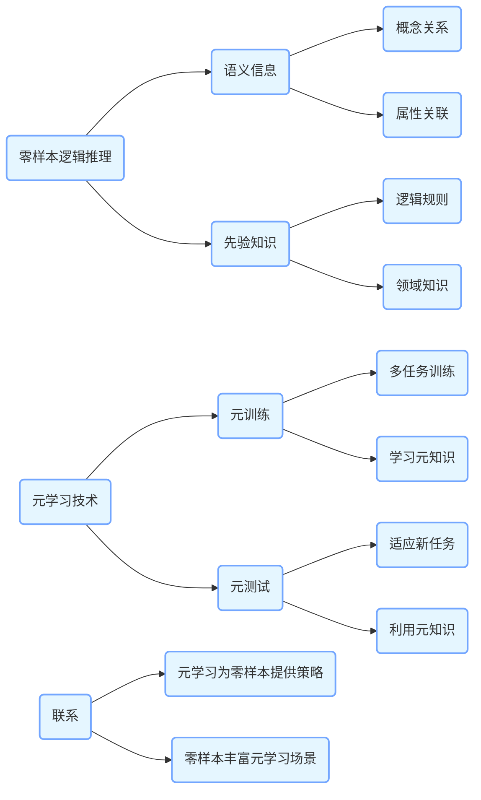

# 零样本逻辑推理中元学习技术的创新应用

> 关键词：零样本逻辑推理、元学习技术、创新应用、机器学习、知识迁移

> 摘要：本文深入探讨了零样本逻辑推理中元学习技术的创新应用。首先介绍了研究的背景、目的、预期读者和文档结构等内容。接着详细阐述了零样本逻辑推理和元学习技术的核心概念及其联系，并给出了相应的文本示意图和 Mermaid 流程图。在核心算法原理部分，使用 Python 代码进行了详细讲解。同时，对涉及的数学模型和公式进行了详细推导和举例说明。通过项目实战，展示了代码的实际案例并进行深入解读。还分析了该技术的实际应用场景，推荐了相关的学习资源、开发工具框架以及论文著作。最后总结了未来发展趋势与挑战，解答了常见问题并提供了扩展阅读和参考资料。

## 1. 背景介绍 
### 1.1 目的和范围
在当今人工智能领域，传统的机器学习模型通常需要大量标注数据进行训练，这在实际应用中面临数据获取成本高、标注困难等问题。零样本逻辑推理旨在让模型在没有见过特定任务样本的情况下，依然能够进行有效的逻辑推理。元学习技术则是一种能够快速学习新知识、适应新任务的方法。本研究的目的在于探索元学习技术在零样本逻辑推理中的创新应用，提高模型的泛化能力和推理效率，扩大其应用范围。研究范围涵盖了从理论原理的分析到实际项目的应用，涉及到相关算法、数学模型以及具体的开发实践。

### 1.2 预期读者
本文预期读者包括人工智能领域的研究人员、机器学习工程师、软件开发者以及对零样本学习和元学习技术感兴趣的技术爱好者。对于希望深入了解该领域技术原理和应用实践的读者，本文将提供有价值的参考。

### 1.3 文档结构概述
本文将按照以下结构进行阐述：首先介绍零样本逻辑推理和元学习技术的核心概念与联系；接着详细讲解核心算法原理和具体操作步骤，并用 Python 代码进行说明；然后分析涉及的数学模型和公式，并举例说明；通过项目实战展示代码的实际应用和详细解读；探讨该技术的实际应用场景；推荐相关的学习资源、开发工具框架和论文著作；最后总结未来发展趋势与挑战，解答常见问题并提供扩展阅读和参考资料。

### 1.4 术语表
#### 1.4.1 核心术语定义
- **零样本逻辑推理**：指模型在没有接触过特定任务的训练样本时，基于已有的知识和逻辑规则，对该任务进行推理的能力。
- **元学习技术**：也称为“学习如何学习”，是一种让模型能够快速学习新知识、适应新任务的方法，通过在多个任务上进行训练，学习到通用的学习策略。
- **知识迁移**：将在一个任务或领域中学习到的知识和技能应用到另一个任务或领域中的过程。

#### 1.4.2 相关概念解释
- **样本空间**：所有可能的样本组成的集合。
- **特征空间**：样本在特征提取后所构成的空间。
- **任务分布**：多个任务所构成的分布，反映了任务之间的关系和特点。

#### 1.4.3 缩略词列表
- **ML**：Machine Learning，机器学习
- **NLP**：Natural Language Processing，自然语言处理
- **CV**：Computer Vision，计算机视觉

## 2. 核心概念与联系 

### 零样本逻辑推理原理
零样本逻辑推理的核心思想是利用语义信息和先验知识，在没有具体任务样本的情况下进行推理。例如，在图像分类任务中，如果模型已经学习到了“猫”和“哺乳动物”的语义关系，当遇到一个新的任务是判断某种动物是否为哺乳动物时，即使没有见过该动物的样本，也可以根据已有的知识进行推理。

### 元学习技术原理
元学习技术通过在多个任务上进行训练，学习到通用的学习策略和模型初始化参数。在面对新任务时，模型可以利用这些元知识快速适应并学习。例如，在元学习中，常用的方法是将训练过程分为元训练和元测试阶段，在元训练阶段，模型在多个任务上进行训练，学习到元知识；在元测试阶段，模型利用元知识快速适应新任务。

### 零样本逻辑推理与元学习技术的联系
元学习技术可以为零样本逻辑推理提供有效的方法和策略。通过元学习，模型可以学习到通用的特征表示和推理规则，从而在零样本情况下更好地进行逻辑推理。同时，零样本逻辑推理的任务也可以作为元学习的一个特殊任务，进一步丰富元学习的应用场景。

### 文本示意图
```plaintext
零样本逻辑推理
|-- 语义信息
|   |-- 概念关系
|   |-- 属性关联
|-- 先验知识
|   |-- 逻辑规则
|   |-- 领域知识

元学习技术
|-- 元训练
|   |-- 多任务训练
|   |-- 学习元知识
|-- 元测试
|   |-- 适应新任务
|   |-- 利用元知识

联系：元学习为零样本逻辑推理提供策略，零样本逻辑推理丰富元学习场景
```

### Mermaid 流程图


## 3. 核心算法原理 & 具体操作步骤 

### 元学习算法原理
这里以 MAML（Model-Agnostic Meta-Learning）算法为例，介绍元学习在零样本逻辑推理中的应用。MAML 算法的目标是找到一个通用的模型初始化参数，使得模型在经过少量的梯度更新后，能够在新任务上取得较好的性能。

### 算法步骤
1. **初始化模型参数**：随机初始化模型的参数 $\theta$。
2. **元训练阶段**：
    - 从任务分布 $p(\mathcal{T})$ 中采样一个任务 $\mathcal{T}_i$。
    - 在任务 $\mathcal{T}_i$ 上进行训练，得到临时参数 $\theta'_i$：
        - 计算损失函数 $L(\theta, \mathcal{D}_{tr}^i)$，其中 $\mathcal{D}_{tr}^i$ 是任务 $\mathcal{T}_i$ 的训练数据集。
        - 使用梯度下降法更新参数：$\theta'_i = \theta - \alpha \nabla_{\theta} L(\theta, \mathcal{D}_{tr}^i)$，其中 $\alpha$ 是学习率。
    - 计算在临时参数 $\theta'_i$ 下的元损失 $L(\theta'_i, \mathcal{D}_{val}^i)$，其中 $\mathcal{D}_{val}^i$ 是任务 $\mathcal{T}_i$ 的验证数据集。
    - 对元损失进行求和并更新模型参数 $\theta$：$\theta = \theta - \beta \nabla_{\theta} \sum_{i=1}^{n} L(\theta'_i, \mathcal{D}_{val}^i)$，其中 $\beta$ 是元学习率。
3. **元测试阶段**：
    - 当遇到新任务 $\mathcal{T}_{new}$ 时，使用元训练得到的参数 $\theta$ 作为初始参数。
    - 在新任务的少量训练数据上进行少量的梯度更新，得到适应新任务的参数 $\theta_{new}$。
    - 使用 $\theta_{new}$ 进行零样本逻辑推理。

### Python 代码实现
```python
import torch
import torch.nn as nn
import torch.optim as optim

# 定义一个简单的神经网络模型
class SimpleModel(nn.Module):
    def __init__(self, input_size, hidden_size, output_size):
        super(SimpleModel, self).__init__()
        self.fc1 = nn.Linear(input_size, hidden_size)
        self.relu = nn.ReLU()
        self.fc2 = nn.Linear(hidden_size, output_size)

    def forward(self, x):
        out = self.fc1(x)
        out = self.relu(out)
        out = self.fc2(out)
        return out

# 初始化模型参数
input_size = 10
hidden_size = 20
output_size = 2
model = SimpleModel(input_size, hidden_size, output_size)
theta = list(model.parameters())

# 定义超参数
alpha = 0.01  # 学习率
beta = 0.001  # 元学习率
num_tasks = 10  # 任务数量
num_epochs = 100  # 训练轮数

# 模拟任务分布
task_distribution = []
for _ in range(num_tasks):
    # 随机生成训练和验证数据
    train_data = torch.randn(100, input_size)
    train_labels = torch.randint(0, output_size, (100,))
    val_data = torch.randn(20, input_size)
    val_labels = torch.randint(0, output_size, (20,))
    task_distribution.append((train_data, train_labels, val_data, val_labels))

# 元训练阶段
criterion = nn.CrossEntropyLoss()
meta_optimizer = optim.Adam(theta, lr=beta)

for epoch in range(num_epochs):
    meta_loss = 0
    for train_data, train_labels, val_data, val_labels in task_distribution:
        # 复制模型参数
        theta_prime = [param.clone() for param in theta]

        # 在任务上进行训练
        optimizer = optim.SGD(theta_prime, lr=alpha)
        for _ in range(5):  # 进行 5 次梯度更新
            outputs = model(train_data)
            loss = criterion(outputs, train_labels)
            optimizer.zero_grad()
            loss.backward()
            optimizer.step()

        # 计算元损失
        outputs_val = model(val_data)
        meta_loss += criterion(outputs_val, val_labels)

    # 更新模型参数
    meta_optimizer.zero_grad()
    meta_loss.backward()
    meta_optimizer.step()

    if (epoch + 1) % 10 == 0:
        print(f'Epoch {epoch + 1}/{num_epochs}, Meta Loss: {meta_loss.item()}')

# 元测试阶段
# 模拟新任务
new_train_data = torch.randn(10, input_size)
new_train_labels = torch.randint(0, output_size, (10,))
new_val_data = torch.randn(5, input_size)
new_val_labels = torch.randint(0, output_size, (5,))

# 使用元训练得到的参数作为初始参数
theta_new = [param.clone() for param in theta]
optimizer_new = optim.SGD(theta_new, lr=alpha)
for _ in range(3):  # 进行 3 次梯度更新
    outputs_new = model(new_train_data)
    loss_new = criterion(outputs_new, new_train_labels)
    optimizer_new.zero_grad()
    loss_new.backward()
    optimizer_new.step()

# 进行零样本逻辑推理
outputs_test = model(new_val_data)
_, predicted = torch.max(outputs_test.data, 1)
print('Predicted labels:', predicted)
```

## 4. 数学模型和公式 & 详细讲解 & 举例说明 

### 损失函数
在元学习中，常用的损失函数是交叉熵损失函数。对于一个分类任务，设输入样本为 $x$，真实标签为 $y$，模型的输出为 $\hat{y}$，则交叉熵损失函数定义为：
$$
L(y, \hat{y}) = - \sum_{i=1}^{C} y_i \log(\hat{y}_i)
$$
其中 $C$ 是类别数量，$y_i$ 是真实标签的第 $i$ 个分量，$\hat{y}_i$ 是模型输出的第 $i$ 个分量。

### 梯度更新公式
在 MAML 算法中，梯度更新分为两个阶段：
- **任务内梯度更新**：在任务 $\mathcal{T}_i$ 上，使用梯度下降法更新参数：
$$
\theta'_i = \theta - \alpha \nabla_{\theta} L(\theta, \mathcal{D}_{tr}^i)
$$
其中 $\theta$ 是模型的初始参数，$\alpha$ 是学习率，$\nabla_{\theta} L(\theta, \mathcal{D}_{tr}^i)$ 是损失函数关于参数 $\theta$ 的梯度。
- **元梯度更新**：对所有任务的元损失进行求和并更新模型参数：
$$
\theta = \theta - \beta \nabla_{\theta} \sum_{i=1}^{n} L(\theta'_i, \mathcal{D}_{val}^i)
$$
其中 $\beta$ 是元学习率，$n$ 是任务数量。

### 举例说明
假设我们有一个二分类任务，输入样本 $x = [1, 2, 3]$，真实标签 $y = [0, 1]$，模型的输出 $\hat{y} = [0.2, 0.8]$。则交叉熵损失为：
$$
L(y, \hat{y}) = - (0 \times \log(0.2) + 1 \times \log(0.8)) \approx 0.223
$$

假设模型的参数 $\theta = [0.1, 0.2]$，损失函数关于参数的梯度 $\nabla_{\theta} L(\theta, \mathcal{D}_{tr}^i) = [0.01, 0.02]$，学习率 $\alpha = 0.01$，则任务内梯度更新后的参数为：
$$
\theta' = [0.1 - 0.01 \times 0.01, 0.2 - 0.01 \times 0.02] = [0.0999, 0.1998]
$$

## 5. 项目实战：代码实际案例和详细解释说明 

### 5.1  开发环境搭建
- **操作系统**：推荐使用 Linux 或 macOS 系统，本项目在 Ubuntu 20.04 上进行开发和测试。
- **Python 版本**：使用 Python 3.8 及以上版本。
- **深度学习框架**：使用 PyTorch 1.9 及以上版本，可以通过以下命令安装：
```bash
pip install torch torchvision
```
- **其他依赖库**：安装 NumPy、Matplotlib 等常用库：
```bash
pip install numpy matplotlib
```

### 5.2  源代码详细实现和代码解读
```python
import torch
import torch.nn as nn
import torch.optim as optim
import numpy as np
import matplotlib.pyplot as plt

# 定义一个更复杂的神经网络模型
class ComplexModel(nn.Module):
    def __init__(self, input_size, hidden_size1, hidden_size2, output_size):
        super(ComplexModel, self).__init__()
        self.fc1 = nn.Linear(input_size, hidden_size1)
        self.relu1 = nn.ReLU()
        self.fc2 = nn.Linear(hidden_size1, hidden_size2)
        self.relu2 = nn.ReLU()
        self.fc3 = nn.Linear(hidden_size2, output_size)

    def forward(self, x):
        out = self.fc1(x)
        out = self.relu1(out)
        out = self.fc2(out)
        out = self.relu2(out)
        out = self.fc3(out)
        return out

# 初始化模型参数
input_size = 20
hidden_size1 = 50
hidden_size2 = 30
output_size = 5
model = ComplexModel(input_size, hidden_size1, hidden_size2, output_size)
theta = list(model.parameters())

# 定义超参数
alpha = 0.005  # 学习率
beta = 0.0001  # 元学习率
num_tasks = 20  # 任务数量
num_epochs = 200  # 训练轮数
num_inner_steps = 10  # 任务内梯度更新步数

# 模拟任务分布
task_distribution = []
for _ in range(num_tasks):
    # 随机生成训练和验证数据
    train_data = torch.randn(200, input_size)
    train_labels = torch.randint(0, output_size, (200,))
    val_data = torch.randn(50, input_size)
    val_labels = torch.randint(0, output_size, (50,))
    task_distribution.append((train_data, train_labels, val_data, val_labels))

# 元训练阶段
criterion = nn.CrossEntropyLoss()
meta_optimizer = optim.Adam(theta, lr=beta)

meta_losses = []
for epoch in range(num_epochs):
    meta_loss = 0
    for train_data, train_labels, val_data, val_labels in task_distribution:
        # 复制模型参数
        theta_prime = [param.clone() for param in theta]

        # 在任务上进行训练
        optimizer = optim.SGD(theta_prime, lr=alpha)
        for _ in range(num_inner_steps):  # 进行多次梯度更新
            outputs = model(train_data)
            loss = criterion(outputs, train_labels)
            optimizer.zero_grad()
            loss.backward()
            optimizer.step()

        # 计算元损失
        outputs_val = model(val_data)
        meta_loss += criterion(outputs_val, val_labels)

    # 更新模型参数
    meta_optimizer.zero_grad()
    meta_loss.backward()
    meta_optimizer.step()

    meta_losses.append(meta_loss.item())
    if (epoch + 1) % 10 == 0:
        print(f'Epoch {epoch + 1}/{num_epochs}, Meta Loss: {meta_loss.item()}')

# 绘制元损失曲线
plt.plot(range(num_epochs), meta_losses)
plt.xlabel('Epoch')
plt.ylabel('Meta Loss')
plt.title('Meta Learning Loss Curve')
plt.show()

# 元测试阶段
# 模拟新任务
new_train_data = torch.randn(30, input_size)
new_train_labels = torch.randint(0, output_size, (30,))
new_val_data = torch.randn(10, input_size)
new_val_labels = torch.randint(0, output_size, (10,))

# 使用元训练得到的参数作为初始参数
theta_new = [param.clone() for param in theta]
optimizer_new = optim.SGD(theta_new, lr=alpha)
for _ in range(5):  # 进行 5 次梯度更新
    outputs_new = model(new_train_data)
    loss_new = criterion(outputs_new, new_train_labels)
    optimizer_new.zero_grad()
    loss_new.backward()
    optimizer_new.step()

# 进行零样本逻辑推理
outputs_test = model(new_val_data)
_, predicted = torch.max(outputs_test.data, 1)
print('Predicted labels:', predicted)
```

### 代码解读与分析
- **模型定义**：定义了一个包含三个全连接层的神经网络模型 `ComplexModel`，用于处理分类任务。
- **超参数设置**：设置了学习率 `alpha`、元学习率 `beta`、任务数量 `num_tasks`、训练轮数 `num_epochs` 等超参数。
- **任务分布模拟**：随机生成了多个任务的训练和验证数据，模拟任务分布。
- **元训练阶段**：在每个训练轮次中，对每个任务进行任务内梯度更新，计算元损失并更新模型参数。同时记录元损失，用于绘制损失曲线。
- **元测试阶段**：模拟新任务，使用元训练得到的参数作为初始参数，在新任务的少量训练数据上进行梯度更新，然后进行零样本逻辑推理。
- **损失曲线绘制**：使用 Matplotlib 库绘制元损失曲线，直观地展示元学习的训练过程。

## 6. 实际应用场景 
### 自然语言处理
- **文本分类**：在没有特定主题的文本样本时，模型可以利用元学习学到的知识进行零样本分类。例如，对于一些新兴领域的文本，如量子计算、区块链等，模型可以根据已有的语义信息和逻辑规则进行分类。
- **情感分析**：在不同的语言或领域中，模型可以通过元学习快速适应新的情感分析任务。例如，在分析电影评论、产品评价等不同类型的文本时，即使没有见过特定类型的样本，也能进行有效的情感判断。

### 计算机视觉
- **图像分类**：在零样本情况下，模型可以根据图像的语义信息和已有的知识进行分类。例如，对于一些罕见物种的图像分类，模型可以利用元学习学到的特征表示和分类规则进行推理。
- **目标检测**：在新的场景或目标类型下，模型可以通过元学习快速适应并进行目标检测。例如，在工业检测中，对于新的缺陷类型，模型可以在没有大量标注样本的情况下进行检测。

### 医疗领域
- **疾病诊断**：在面对新的疾病类型或罕见病例时，模型可以利用元学习学到的医学知识和逻辑推理能力进行诊断。例如，对于一些新出现的传染病，模型可以根据症状、病史等信息进行初步诊断。
- **药物研发**：在筛选新的药物靶点和化合物时，模型可以通过元学习快速学习相关的生物学知识和化学结构信息，进行零样本推理和预测。

## 7. 工具和资源推荐
### 7.1 学习资源推荐
#### 7.1.1 书籍推荐
- 《机器学习》（周志华）：全面介绍了机器学习的基本概念、算法和应用，是机器学习领域的经典教材。
- 《深度学习》（Ian Goodfellow、Yoshua Bengio 和 Aaron Courville）：深入探讨了深度学习的原理和技术，是深度学习领域的权威著作。
- 《元学习：原理与应用》：专门介绍元学习的理论和方法，对于深入理解元学习技术有很大帮助。

#### 7.1.2 在线课程
- Coursera 上的“机器学习”课程（Andrew Ng 教授）：是机器学习领域的经典课程，讲解深入浅出，适合初学者。
- edX 上的“深度学习微硕士”课程：涵盖了深度学习的多个方面，包括卷积神经网络、循环神经网络等，内容丰富。
- 哔哩哔哩上的一些人工智能相关课程：有很多优秀的 UP 主分享了关于零样本学习、元学习等方面的课程，适合不同水平的学习者。

#### 7.1.3 技术博客和网站
- arXiv：是一个预印本平台，上面有很多关于人工智能、机器学习等领域的最新研究成果。
- Medium：有很多技术博主分享关于零样本学习、元学习的实践经验和研究进展。
- 机器之心、新智元等：国内的人工智能媒体网站，会及时报道相关领域的最新动态和技术文章。

### 7.2 开发工具框架推荐
#### 7.2.1 IDE和编辑器
- PyCharm：是一款专业的 Python 集成开发环境，具有代码自动补全、调试等功能，适合开发深度学习项目。
- Jupyter Notebook：可以方便地进行代码编写、实验和结果展示，常用于数据分析和机器学习实验。
- Visual Studio Code：轻量级的代码编辑器，支持多种编程语言和插件，可用于开发和调试深度学习代码。

#### 7.2.2 调试和性能分析工具
- TensorBoard：是 TensorFlow 提供的可视化工具，可以用于可视化模型的训练过程、损失曲线等。
- PyTorch Profiler：PyTorch 提供的性能分析工具，可以帮助开发者分析模型的性能瓶颈。
- cProfile：Python 内置的性能分析工具，可以分析代码的运行时间和函数调用情况。

#### 7.2.3 相关框架和库
- PyTorch：是一个开源的深度学习框架，具有动态图和静态图两种模式，易于使用和调试。
- TensorFlow：是另一个广泛使用的深度学习框架，提供了丰富的工具和库，适合大规模的深度学习项目。
- Scikit-learn：是一个用于机器学习的 Python 库，提供了多种机器学习算法和工具，可用于数据预处理、模型选择等。

### 7.3 相关论文著作推荐
#### 7.3.1 经典论文
- “Model-Agnostic Meta-Learning for Fast Adaptation of Deep Networks”（MAML 算法论文）：介绍了 MAML 算法的原理和实现，是元学习领域的经典论文。
- “Zero-Shot Learning - A Comprehensive Evaluation of the Good, the Bad and the Ugly”：对零样本学习进行了全面的评估和分析，是零样本学习领域的重要论文。
- “Learning to Learn by Gradient Descent by Gradient Descent”：提出了一种基于梯度下降的元学习方法，具有重要的理论意义。

#### 7.3.2 最新研究成果
- 在 arXiv 上搜索“Zero-shot learning”和“Meta-learning”，可以找到很多关于零样本逻辑推理中元学习技术的最新研究成果。
- 参加国际人工智能会议，如 NeurIPS、ICML、CVPR 等，这些会议上会有很多关于该领域的最新研究报告。

#### 7.3.3 应用案例分析
- 一些工业界的技术博客和报告中会分享零样本逻辑推理中元学习技术的应用案例，例如 Google、Facebook 等公司的技术博客。
- 相关的学术论文中也会有一些实际应用的案例分析，可以深入了解该技术在不同领域的应用效果。

## 8. 总结：未来发展趋势与挑战
### 未来发展趋势
- **多模态融合**：将零样本逻辑推理和元学习技术应用于多模态数据，如文本、图像、音频等的融合，提高模型的综合推理能力。
- **强化学习结合**：将元学习与强化学习相结合，使模型在动态环境中能够更快地学习和适应新任务，实现更高效的决策。
- **跨领域应用拓展**：进一步拓展该技术在医疗、金融、交通等更多领域的应用，解决实际问题，创造更大的社会价值。

### 挑战
- **数据质量和多样性**：零样本逻辑推理和元学习需要大量高质量、多样化的数据进行训练，但实际应用中数据的获取和标注存在困难，数据质量和多样性难以保证。
- **模型复杂度和计算资源**：随着模型的复杂度增加，训练和推理所需的计算资源也会大幅增加，如何在有限的计算资源下实现高效的模型训练和推理是一个挑战。
- **可解释性和可靠性**：深度学习模型的可解释性和可靠性一直是一个难题，在零样本逻辑推理和元学习中，如何让模型的推理过程和结果具有可解释性和可靠性是未来需要解决的问题。

## 9. 附录：常见问题与解答
### 问题 1：零样本逻辑推理和少样本学习有什么区别？
解答：零样本逻辑推理是指模型在没有见过特定任务的任何样本时进行推理，而少样本学习是指模型在只有少量样本的情况下进行学习和推理。零样本逻辑推理更强调利用语义信息和先验知识，而少样本学习则更侧重于如何在少量样本的情况下快速学习和适应。

### 问题 2：元学习技术可以应用于所有的机器学习任务吗？
解答：虽然元学习技术具有很强的通用性，但并不是所有的机器学习任务都适合应用元学习。元学习更适合于那些需要快速适应新任务、具有一定的任务分布的场景。对于一些简单的、固定任务的场景，传统的机器学习方法可能更加有效。

### 问题 3：如何选择合适的超参数？
解答：选择合适的超参数通常需要进行实验和调优。可以使用网格搜索、随机搜索等方法在一定的参数空间中进行搜索，找到最优的超参数组合。同时，也可以参考相关的论文和经验，选择一些常用的超参数范围进行实验。

## 10. 扩展阅读 & 参考资料
### 扩展阅读
- 《人工智能：现代方法》：全面介绍了人工智能的各个方面，包括机器学习、知识表示、推理等，对于深入理解人工智能的理论和应用有很大帮助。
- 《动手学深度学习》：通过实际代码示例，详细介绍了深度学习的各个方面，适合初学者进行实践和学习。

### 参考资料
- 周志华. 机器学习. 清华大学出版社, 2016.
- Ian Goodfellow, Yoshua Bengio, Aaron Courville. 深度学习. 人民邮电出版社, 2017.
- Finn, Chelsea, Pieter Abbeel, and Sergey Levine. "Model-agnostic meta-learning for fast adaptation of deep networks." Proceedings of the 34th International Conference on Machine Learning-Volume 70. JMLR. org, 2017.

作者：AI天才研究院/AI Genius Institute & 禅与计算机程序设计艺术 /Zen And The Art of Computer Programming