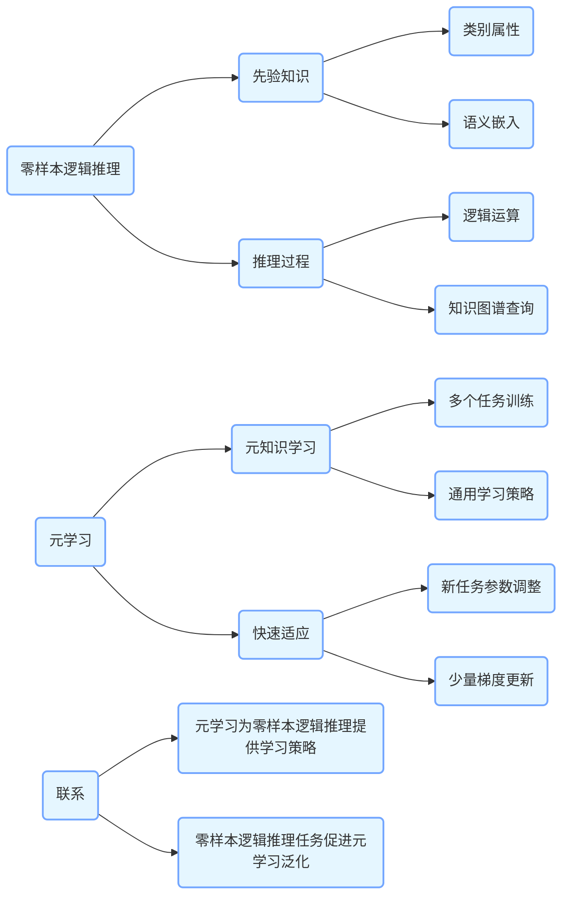

# 零样本逻辑推理中元学习技术的性能评估

> 关键词：零样本逻辑推理、元学习技术、性能评估、机器学习、模型泛化

> 摘要：本文聚焦于零样本逻辑推理中元学习技术的性能评估。零样本逻辑推理旨在让模型在未见过特定任务数据的情况下进行逻辑推理，元学习技术则为解决此类问题提供了有效途径。文章首先介绍了相关背景，包括目的、预期读者、文档结构和术语表。接着阐述了核心概念与联系，分析了核心算法原理并给出Python代码示例，讲解了数学模型和公式。通过项目实战展示了代码实现及解读，探讨了实际应用场景。还推荐了相关工具和资源，最后总结了未来发展趋势与挑战，并给出常见问题解答和参考资料，旨在为研究者和开发者深入了解和评估元学习技术在零样本逻辑推理中的性能提供全面的指导。

## 1. 背景介绍 
### 1.1 目的和范围
零样本学习在近年来成为机器学习领域的研究热点，其核心目标是使模型具备在未观察到特定类别样本的情况下对这些类别进行分类或推理的能力。而逻辑推理则是智能系统的重要组成部分，能够处理复杂的语义信息和逻辑关系。元学习作为一种快速学习和适应新任务的方法，在零样本逻辑推理中展现出了巨大的潜力。

本文的目的在于对零样本逻辑推理中元学习技术的性能进行全面评估。具体范围涵盖了元学习技术在不同零样本逻辑推理任务中的表现，包括但不限于语义理解、知识图谱推理、自然语言推理等。通过对多种性能指标的分析，为研究者和开发者提供有关元学习技术在零样本逻辑推理中有效性和局限性的深入见解。

### 1.2 预期读者
本文预期读者主要包括机器学习、人工智能领域的研究者、开发者以及对零样本学习和元学习技术感兴趣的专业人士。对于正在从事相关研究项目的科研人员，本文可以提供理论支持和实验参考；对于开发者，有助于他们在实际应用中选择合适的元学习技术来解决零样本逻辑推理问题；对于初学者，能够帮助他们建立对该领域的基本认识和理解。

### 1.3 文档结构概述
本文将按照以下结构进行组织：
- 核心概念与联系：介绍零样本逻辑推理和元学习技术的基本概念，以及它们之间的内在联系，并通过示意图和流程图进行直观展示。
- 核心算法原理 & 具体操作步骤：详细讲解元学习技术在零样本逻辑推理中的核心算法原理，并给出Python代码示例，说明具体的操作步骤。
- 数学模型和公式 & 详细讲解 & 举例说明：推导和解释相关的数学模型和公式，通过具体例子加深读者的理解。
- 项目实战：代码实际案例和详细解释说明：通过一个具体的项目实战，展示如何使用元学习技术进行零样本逻辑推理，包括开发环境搭建、源代码实现和代码解读。
- 实际应用场景：探讨元学习技术在零样本逻辑推理中的实际应用场景，分析其优势和挑战。
- 工具和资源推荐：推荐相关的学习资源、开发工具框架和论文著作，为读者提供进一步学习和研究的参考。
- 总结：未来发展趋势与挑战：总结元学习技术在零样本逻辑推理中的发展趋势，分析面临的挑战和机遇。
- 附录：常见问题与解答：解答读者在阅读过程中可能遇到的常见问题。
- 扩展阅读 & 参考资料：提供相关的扩展阅读材料和参考资料，方便读者深入研究。

### 1.4 术语表
#### 1.4.1 核心术语定义
- **零样本学习（Zero-Shot Learning）**：一种机器学习方法，允许模型在没有见过特定类别的训练样本的情况下对这些类别进行分类或推理。
- **逻辑推理（Logical Reasoning）**：基于已知事实和规则，通过逻辑运算得出新结论的过程。
- **元学习（Meta-Learning）**：也称为“学习如何学习”，旨在让模型从多个任务中学习通用的学习策略，以便能够快速适应新的任务。
- **元知识（Meta-Knowledge）**：在元学习中，从多个任务中学习到的通用知识和策略。
- **零样本逻辑推理（Zero-Shot Logical Reasoning）**：结合零样本学习和逻辑推理的技术，使模型在未见过特定任务数据的情况下进行逻辑推理。

#### 1.4.2 相关概念解释
- **少样本学习（Few-Shot Learning）**：与零样本学习类似，但模型可以使用少量的训练样本进行学习。
- **迁移学习（Transfer Learning）**：将在一个任务上学习到的知识迁移到另一个相关任务上的学习方法。
- **模型泛化（Model Generalization）**：模型在未见过的数据上表现良好的能力。

#### 1.4.3 缩略词列表
- **ZSL**：Zero-Shot Learning（零样本学习）
- **MAML**：Model-Agnostic Meta-Learning（模型无关元学习）
- **NLP**：Natural Language Processing（自然语言处理）

## 2. 核心概念与联系 

### 零样本逻辑推理的基本原理
零样本逻辑推理的核心思想是利用先验知识和语义信息，让模型在未见过特定任务数据的情况下进行逻辑推理。在传统的机器学习中，模型需要大量的标注数据进行训练，才能对新的数据进行分类或预测。而零样本学习则通过引入辅助信息，如类别属性、语义嵌入等，来弥补训练数据的不足。

例如，在图像分类任务中，模型可以学习到不同类别的语义特征，如“动物”、“植物”、“交通工具”等。当遇到一个未见过的类别，如“独角兽”时，模型可以根据已有的语义知识推断出“独角兽”属于“动物”类别。

### 元学习的基本原理
元学习的目标是让模型学会如何快速学习新的任务。它通过在多个任务上进行训练，学习到通用的学习策略和元知识。在面对新的任务时，模型可以利用这些元知识快速调整自己的参数，以适应新的任务。

常见的元学习方法包括模型无关元学习（MAML）、度量学习（Metric Learning）等。MAML通过在多个任务上进行梯度更新，学习到一个初始化参数，使得模型在新任务上只需要进行少量的梯度更新就能达到较好的性能。

### 零样本逻辑推理与元学习的联系
零样本逻辑推理和元学习有着密切的联系。元学习可以为零样本逻辑推理提供有效的学习策略和元知识，帮助模型在未见过的任务上进行快速推理。同时，零样本逻辑推理的任务多样性也为元学习提供了丰富的训练数据，促进元学习模型的泛化能力。

例如，在零样本自然语言推理任务中，元学习可以学习到不同推理规则和语义表示的通用模式，使得模型在未见过的推理任务中能够利用这些模式进行逻辑推理。

### 文本示意图
```plaintext
零样本逻辑推理
├── 先验知识
│   ├── 类别属性
│   ├── 语义嵌入
├── 推理过程
│   ├── 逻辑运算
│   ├── 知识图谱查询

元学习
├── 元知识学习
│   ├── 多个任务训练
│   ├── 通用学习策略
├── 快速适应
│   ├── 新任务参数调整
│   ├── 少量梯度更新

联系
├── 元学习为零样本逻辑推理提供学习策略
├── 零样本逻辑推理任务促进元学习泛化
```

### Mermaid流程图


## 3. 核心算法原理 & 具体操作步骤 

### 模型无关元学习（MAML）原理
模型无关元学习（MAML）是一种经典的元学习方法，其核心思想是学习一个初始化参数，使得模型在新任务上只需要进行少量的梯度更新就能达到较好的性能。

具体来说，MAML的训练过程包括两个阶段：内循环和外循环。在内循环中，模型在每个任务上进行少量的梯度更新，得到任务特定的参数；在外循环中，模型根据任务特定的参数更新初始化参数。

### Python代码示例
```python
import torch
import torch.nn as nn
import torch.optim as optim

# 定义一个简单的神经网络模型
class SimpleModel(nn.Module):
    def __init__(self, input_size, output_size):
        super(SimpleModel, self).__init__()
        self.fc = nn.Linear(input_size, output_size)

    def forward(self, x):
        return self.fc(x)

# 定义元学习的参数
num_tasks = 10
num_inner_steps = 5
inner_lr = 0.01
outer_lr = 0.001

# 初始化模型和优化器
model = SimpleModel(input_size=10, output_size=2)
meta_optimizer = optim.Adam(model.parameters(), lr=outer_lr)

# 模拟多个任务
for epoch in range(100):
    meta_loss = 0
    for task in range(num_tasks):
        # 复制模型参数
        fast_weights = list(model.parameters())

        # 内循环：在当前任务上进行少量的梯度更新
        for inner_step in range(num_inner_steps):
            # 生成随机数据
            inputs = torch.randn(32, 10)
            targets = torch.randint(0, 2, (32,))

            # 前向传播
            outputs = model(inputs)
            loss = nn.CrossEntropyLoss()(outputs, targets)

            # 计算梯度
            grads = torch.autograd.grad(loss, fast_weights)

            # 更新参数
            fast_weights = [w - inner_lr * g for w, g in zip(fast_weights, grads)]

        # 外循环：计算元损失
        inputs = torch.randn(32, 10)
        targets = torch.randint(0, 2, (32,))

        # 使用更新后的参数进行前向传播
        outputs = SimpleModel(input_size=10, output_size=2)
        for i, param in enumerate(outputs.parameters()):
            param.data = fast_weights[i].data
        outputs = outputs(inputs)
        meta_loss += nn.CrossEntropyLoss()(outputs, targets)

    # 更新元参数
    meta_optimizer.zero_grad()
    meta_loss.backward()
    meta_optimizer.step()

    print(f'Epoch {epoch+1}, Meta Loss: {meta_loss.item()}')
```

### 具体操作步骤
1. **定义模型**：定义一个神经网络模型，用于处理零样本逻辑推理任务。
2. **初始化参数**：初始化元学习的参数，包括任务数量、内循环步数、内循环学习率和外循环学习率等。
3. **模拟多个任务**：在每个训练周期中，模拟多个不同的任务。
4. **内循环**：在每个任务上进行少量的梯度更新，得到任务特定的参数。
5. **外循环**：根据任务特定的参数计算元损失，并更新初始化参数。
6. **重复训练**：重复步骤3-5，直到模型收敛。

## 4. 数学模型和公式 & 详细讲解 & 举例说明 

### MAML的数学模型
MAML的目标是学习一个初始化参数 $\theta$，使得模型在新任务上只需要进行少量的梯度更新就能达到较好的性能。具体来说，MAML的训练过程可以表示为以下优化问题：

$$
\min_{\theta} \sum_{T \in \mathcal{T}} \mathcal{L}_{T}(\theta'_{T})
$$

其中，$\mathcal{T}$ 是任务集合，$\theta'_{T}$ 是在任务 $T$ 上进行少量梯度更新后得到的参数，$\mathcal{L}_{T}$ 是任务 $T$ 上的损失函数。

### 内循环参数更新公式
在内循环中，模型在任务 $T$ 上进行 $K$ 步梯度更新，得到任务特定的参数 $\theta'_{T}$。具体更新公式如下：

$$
\theta_{T}^{1} = \theta - \alpha \nabla_{\theta} \mathcal{L}_{T}(\theta)
$$

$$
\theta_{T}^{k+1} = \theta_{T}^{k} - \alpha \nabla_{\theta_{T}^{k}} \mathcal{L}_{T}(\theta_{T}^{k}) \quad (k = 1, \cdots, K-1)
$$

其中，$\alpha$ 是内循环学习率。

### 外循环元损失计算
在外循环中，模型根据任务特定的参数 $\theta'_{T}$ 计算元损失。元损失的计算公式如下：

$$
\mathcal{L}_{meta}(\theta) = \sum_{T \in \mathcal{T}} \mathcal{L}_{T}(\theta'_{T})
$$

### 举例说明
假设我们有一个简单的分类任务，输入是一个10维的向量，输出是一个2维的向量，表示两个类别的概率。我们使用MAML进行元学习，内循环步数 $K = 5$，内循环学习率 $\alpha = 0.01$，外循环学习率 $\beta = 0.001$。

在每个训练周期中，我们模拟10个不同的任务。对于每个任务，我们首先随机初始化一个数据集，然后在内循环中进行5步梯度更新，得到任务特定的参数 $\theta'_{T}$。最后，在外循环中根据 $\theta'_{T}$ 计算元损失，并更新初始化参数 $\theta$。

通过多次训练，模型可以学习到一个通用的初始化参数 $\theta$，使得在新任务上只需要进行少量的梯度更新就能达到较好的性能。

## 5. 项目实战：代码实际案例和详细解释说明 

### 5.1  开发环境搭建
为了实现零样本逻辑推理中的元学习技术，我们需要搭建一个合适的开发环境。以下是具体的步骤：

#### 安装Python
首先，确保你已经安装了Python 3.6或更高版本。你可以从Python官方网站（https://www.python.org/downloads/）下载并安装Python。

#### 安装深度学习框架
我们使用PyTorch作为深度学习框架，因为它提供了丰富的工具和库，方便我们进行模型开发和训练。可以使用以下命令安装PyTorch：
```bash
pip install torch torchvision
```

#### 安装其他依赖库
还需要安装一些其他的依赖库，如NumPy、Matplotlib等。可以使用以下命令安装：
```bash
pip install numpy matplotlib
```

### 5.2  源代码详细实现和代码解读
以下是一个完整的代码示例，展示了如何使用MAML进行零样本逻辑推理：

```python
import torch
import torch.nn as nn
import torch.optim as optim
import numpy as np
import matplotlib.pyplot as plt

# 定义一个简单的神经网络模型
class SimpleModel(nn.Module):
    def __init__(self, input_size, output_size):
        super(SimpleModel, self).__init__()
        self.fc = nn.Linear(input_size, output_size)

    def forward(self, x):
        return self.fc(x)

# 定义元学习的参数
num_tasks = 10
num_inner_steps = 5
inner_lr = 0.01
outer_lr = 0.001
num_epochs = 100

# 初始化模型和优化器
model = SimpleModel(input_size=10, output_size=2)
meta_optimizer = optim.Adam(model.parameters(), lr=outer_lr)

# 存储每个epoch的元损失
meta_losses = []

# 模拟多个任务
for epoch in range(num_epochs):
    meta_loss = 0
    for task in range(num_tasks):
        # 复制模型参数
        fast_weights = list(model.parameters())

        # 内循环：在当前任务上进行少量的梯度更新
        for inner_step in range(num_inner_steps):
            # 生成随机数据
            inputs = torch.randn(32, 10)
            targets = torch.randint(0, 2, (32,))

            # 前向传播
            outputs = model(inputs)
            loss = nn.CrossEntropyLoss()(outputs, targets)

            # 计算梯度
            grads = torch.autograd.grad(loss, fast_weights)

            # 更新参数
            fast_weights = [w - inner_lr * g for w, g in zip(fast_weights, grads)]

        # 外循环：计算元损失
        inputs = torch.randn(32, 10)
        targets = torch.randint(0, 2, (32,))

        # 使用更新后的参数进行前向传播
        outputs = SimpleModel(input_size=10, output_size=2)
        for i, param in enumerate(outputs.parameters()):
            param.data = fast_weights[i].data
        outputs = outputs(inputs)
        meta_loss += nn.CrossEntropyLoss()(outputs, targets)

    # 更新元参数
    meta_optimizer.zero_grad()
    meta_loss.backward()
    meta_optimizer.step()

    # 记录元损失
    meta_losses.append(meta_loss.item())

    print(f'Epoch {epoch+1}, Meta Loss: {meta_loss.item()}')

# 绘制元损失曲线
plt.plot(range(1, num_epochs + 1), meta_losses)
plt.xlabel('Epoch')
plt.ylabel('Meta Loss')
plt.title('Meta Learning Loss Curve')
plt.show()
```

### 代码解读与分析
1. **模型定义**：定义了一个简单的全连接神经网络模型 `SimpleModel`，用于处理分类任务。
2. **元学习参数设置**：设置了任务数量 `num_tasks`、内循环步数 `num_inner_steps`、内循环学习率 `inner_lr`、外循环学习率 `outer_lr` 和训练周期数 `num_epochs`。
3. **模型和优化器初始化**：初始化模型 `model` 和元优化器 `meta_optimizer`。
4. **内循环**：在每个任务上进行少量的梯度更新，得到任务特定的参数 `fast_weights`。
5. **外循环**：根据任务特定的参数计算元损失 `meta_loss`，并更新初始化参数。
6. **记录和可视化**：记录每个epoch的元损失，并使用Matplotlib绘制元损失曲线。

通过观察元损失曲线，我们可以判断模型的训练效果。如果元损失逐渐下降，说明模型在不断学习和优化；如果元损失波动较大或没有明显下降趋势，可能需要调整参数或改进模型。

## 6. 实际应用场景 
### 自然语言处理
在自然语言处理中，零样本逻辑推理和元学习技术可以应用于多个方面：
- **文本分类**：在新闻分类、情感分析等任务中，可能会遇到一些未见过的类别。元学习技术可以帮助模型快速适应这些新类别，进行零样本分类。
- **自然语言推理**：在问答系统、知识图谱推理等任务中，模型需要根据给定的前提和假设进行逻辑推理。零样本逻辑推理可以让模型在未见过的推理任务中进行推理，提高系统的泛化能力。

### 计算机视觉
在计算机视觉领域，零样本逻辑推理和元学习技术也有广泛的应用：
- **图像分类**：在图像分类任务中，可能会遇到一些新的类别，如稀有动物、特殊物品等。元学习技术可以帮助模型利用先验知识和语义信息进行零样本分类。
- **目标检测**：在目标检测任务中，模型需要识别图像中的不同目标。零样本逻辑推理可以让模型在未见过的目标上进行检测，提高检测的准确性和泛化能力。

### 智能医疗
在智能医疗领域，零样本逻辑推理和元学习技术可以用于疾病诊断、医学影像分析等方面：
- **疾病诊断**：在临床诊断中，医生可能会遇到一些罕见疾病或新的病症。元学习技术可以帮助模型学习到通用的诊断规则和知识，进行零样本诊断。
- **医学影像分析**：在医学影像分析中，如X光、CT等，模型需要识别图像中的病变和异常。零样本逻辑推理可以让模型在未见过的病变类型上进行分析，提高诊断的准确性。

### 金融领域
在金融领域，零样本逻辑推理和元学习技术可以应用于风险评估、投资决策等方面：
- **风险评估**：在金融风险评估中，可能会遇到一些新的风险因素或市场情况。元学习技术可以帮助模型快速适应这些新情况，进行零样本风险评估。
- **投资决策**：在投资决策中，模型需要根据市场数据和经济指标进行分析和预测。零样本逻辑推理可以让模型在未见过的市场情况下进行决策，提高投资的收益和风险控制能力。

## 7. 工具和资源推荐
### 7.1 学习资源推荐
#### 7.1.1 书籍推荐
- 《深度学习》（Deep Learning）：由Ian Goodfellow、Yoshua Bengio和Aaron Courville合著，是深度学习领域的经典教材，涵盖了深度学习的基本原理、算法和应用。
- 《机器学习》（Machine Learning）：由Tom M. Mitchell编写，是机器学习领域的入门教材，介绍了机器学习的基本概念、算法和模型。
- 《元学习：理论与实践》（Meta-Learning: Theory and Practice）：由Antreas Antoniou和Amos Storkey编写，详细介绍了元学习的理论和方法，以及在不同领域的应用。

#### 7.1.2 在线课程
- Coursera上的“深度学习专项课程”（Deep Learning Specialization）：由Andrew Ng教授授课，包括深度学习的基础、卷积神经网络、循环神经网络等内容。
- edX上的“强化学习”（Reinforcement Learning）：由David Silver教授授课，介绍了强化学习的基本原理、算法和应用。
- 中国大学MOOC上的“机器学习”（Machine Learning）：由周志华教授授课，是国内机器学习领域的经典课程，涵盖了机器学习的基本概念、算法和模型。

#### 7.1.3 技术博客和网站
- Medium：是一个技术博客平台，上面有很多关于机器学习、人工智能的文章和教程。
- arXiv：是一个预印本平台，上面有很多最新的学术论文和研究成果。
- GitHub：是一个代码托管平台，上面有很多开源的机器学习项目和代码库。

### 7.2 开发工具框架推荐
#### 7.2.1 IDE和编辑器
- PyCharm：是一款专门为Python开发设计的集成开发环境，提供了丰富的功能和工具，如代码编辑、调试、版本控制等。
- Jupyter Notebook：是一个交互式的开发环境，适合进行数据分析、模型训练和实验。
- Visual Studio Code：是一款轻量级的代码编辑器，支持多种编程语言和插件，如Python、TensorFlow等。

#### 7.2.2 调试和性能分析工具
- TensorBoard：是TensorFlow提供的一个可视化工具，用于监控模型的训练过程和性能指标。
- PyTorch Profiler：是PyTorch提供的一个性能分析工具，用于分析模型的运行时间和内存使用情况。
- cProfile：是Python标准库中的一个性能分析工具，用于分析Python代码的运行时间和函数调用情况。

#### 7.2.3 相关框架和库
- PyTorch：是一个开源的深度学习框架，提供了丰富的工具和库，如自动求导、神经网络模块、数据加载器等。
- TensorFlow：是一个开源的深度学习框架，由Google开发，提供了分布式训练、模型部署等功能。
- Scikit-learn：是一个开源的机器学习库，提供了多种机器学习算法和工具，如分类、回归、聚类等。

### 7.3 相关论文著作推荐
#### 7.3.1 经典论文
- “Model-Agnostic Meta-Learning for Fast Adaptation of Deep Networks”：介绍了模型无关元学习（MAML）的方法，是元学习领域的经典论文。
- “Zero-Shot Learning: A Comprehensive Evaluation of the Good, the Bad and the Ugly”：对零样本学习进行了全面的评估和分析，提出了一些新的评价指标和方法。
- “Prototypical Networks for Few-Shot Learning”：介绍了原型网络（Prototypical Networks）的方法，用于少样本学习任务。

#### 7.3.2 最新研究成果
- 关注顶级学术会议，如NeurIPS、ICML、CVPR等，上面有很多关于零样本逻辑推理和元学习的最新研究成果。
- 关注知名学术期刊，如Journal of Artificial Intelligence Research（JAIR）、Artificial Intelligence等，上面有很多高质量的学术论文。

#### 7.3.3 应用案例分析
- 可以在相关的学术论文、技术博客和开源项目中找到一些零样本逻辑推理和元学习的应用案例，通过分析这些案例可以更好地理解和应用这些技术。

## 8. 总结：未来发展趋势与挑战
### 未来发展趋势
- **融合多种技术**：未来，零样本逻辑推理和元学习技术可能会与其他技术，如强化学习、知识图谱、迁移学习等进行融合，以提高模型的性能和泛化能力。
- **应用领域拓展**：随着技术的不断发展，零样本逻辑推理和元学习技术将在更多的领域得到应用，如智能家居、智能交通、工业自动化等。
- **模型可解释性**：提高模型的可解释性是未来研究的一个重要方向。通过解释模型的决策过程和推理逻辑，可以增强用户对模型的信任和理解。

### 挑战
- **数据稀缺性**：零样本学习的核心是在未见过的数据上进行推理，因此数据稀缺性是一个主要的挑战。如何利用有限的数据进行有效的学习和推理，是需要解决的问题。
- **语义理解**：零样本逻辑推理需要对语义信息进行深入理解和处理。如何提高模型的语义理解能力，是一个具有挑战性的问题。
- **计算资源需求**：元学习通常需要在多个任务上进行训练，计算资源需求较大。如何优化算法和模型结构，减少计算资源的消耗，是未来需要解决的问题。

## 9. 附录：常见问题与解答
### 什么是零样本学习？
零样本学习是一种机器学习方法，允许模型在没有见过特定类别的训练样本的情况下对这些类别进行分类或推理。它通过引入辅助信息，如类别属性、语义嵌入等，来弥补训练数据的不足。

### 什么是元学习？
元学习也称为“学习如何学习”，旨在让模型从多个任务中学习通用的学习策略，以便能够快速适应新的任务。常见的元学习方法包括模型无关元学习（MAML）、度量学习（Metric Learning）等。

### 零样本逻辑推理和元学习有什么关系？
元学习可以为零样本逻辑推理提供有效的学习策略和元知识，帮助模型在未见过的任务上进行快速推理。同时，零样本逻辑推理的任务多样性也为元学习提供了丰富的训练数据，促进元学习模型的泛化能力。

### 如何评估零样本逻辑推理中元学习技术的性能？
可以使用多种性能指标来评估零样本逻辑推理中元学习技术的性能，如准确率、召回率、F1值等。此外，还可以通过可视化和案例分析等方法来直观地评估模型的性能。

### 元学习技术在实际应用中有哪些挑战？
元学习技术在实际应用中面临一些挑战，如数据稀缺性、语义理解、计算资源需求等。需要通过优化算法和模型结构，利用辅助信息等方法来解决这些问题。

## 10. 扩展阅读 & 参考资料
### 扩展阅读
- “Meta-Learning with Memory-Augmented Neural Networks”：介绍了基于记忆增强神经网络的元学习方法。
- “Zero-Shot Knowledge Graph Completion via Knowledge Embeddings”：介绍了零样本知识图谱补全的方法。
- “Few-Shot Learning with Graph Neural Networks”：介绍了基于图神经网络的少样本学习方法。

### 参考资料
- Goodfellow, I., Bengio, Y., & Courville, A. (2016). Deep Learning. MIT Press.
- Mitchell, T. M. (1997). Machine Learning. McGraw-Hill.
- Finn, C., Abbeel, P., & Levine, S. (2017). Model-Agnostic Meta-Learning for Fast Adaptation of Deep Networks. Proceedings of the 34th International Conference on Machine Learning-Volume 70.

作者：AI天才研究院/AI Genius Institute & 禅与计算机程序设计艺术 /Zen And The Art of Computer Programming