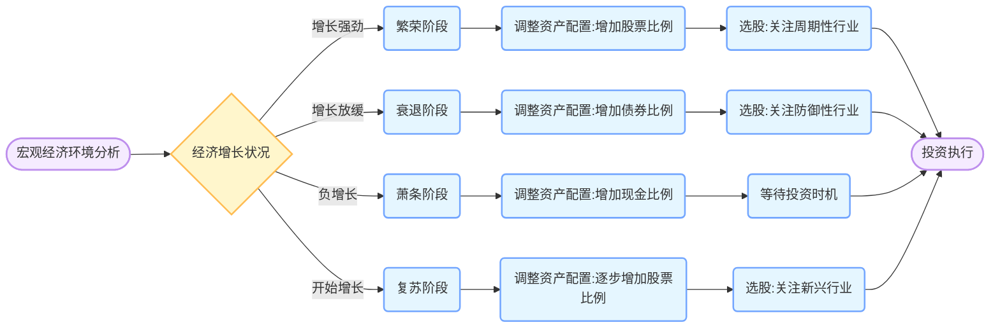

# 雷·达里奥的宏观经济周期投资策略

> 关键词：雷·达里奥、宏观经济周期、投资策略、经济模型、市场分析

> 摘要：本文深入探讨了雷·达里奥的宏观经济周期投资策略。首先介绍了该策略产生的背景，包括目的、预期读者、文档结构和相关术语。接着阐述了核心概念，如经济周期的不同阶段及其联系，并以文本示意图和 Mermaid 流程图呈现。详细讲解了核心算法原理，用 Python 代码展示具体操作步骤。分析了相关的数学模型和公式，并举例说明。通过项目实战给出代码实际案例及详细解释。探讨了该策略在实际中的应用场景，推荐了学习该策略的工具和资源，包括书籍、在线课程、开发工具等。最后总结了未来发展趋势与挑战，解答常见问题并提供扩展阅读和参考资料，旨在帮助读者全面理解和运用雷·达里奥的宏观经济周期投资策略。

## 1. 背景介绍 
### 1.1 目的和范围
雷·达里奥是全球知名的投资家、对冲基金经理，他所创立的桥水基金是世界上最大的对冲基金之一。其宏观经济周期投资策略旨在通过对宏观经济形势的分析和把握，预测经济周期的不同阶段，从而制定相应的投资决策，以实现资产的保值增值。本文的目的是深入剖析这一投资策略，包括其核心概念、算法原理、数学模型等方面，并通过实际案例展示其在投资中的应用。范围涵盖了该策略的理论基础、实际操作以及在不同市场环境下的应用。

### 1.2 预期读者
本文预期读者主要包括金融投资领域的专业人士，如基金经理、投资分析师等，他们希望深入了解雷·达里奥的投资理念和策略，以优化自己的投资组合。同时，也适合对宏观经济和投资感兴趣的普通投资者，帮助他们提升对市场的理解和投资能力。此外，金融专业的学生和研究人员也可以从本文中获取有价值的信息，用于学术研究和学习。

### 1.3 文档结构概述
本文将按照以下结构进行阐述：首先介绍相关背景知识，包括目的、读者和文档结构等。接着详细讲解核心概念，包括宏观经济周期的各个阶段以及它们之间的联系，并通过示意图和流程图进行直观展示。然后分析核心算法原理，用 Python 代码实现具体操作步骤。之后探讨数学模型和公式，并举例说明其应用。通过项目实战给出代码实际案例和详细解释。介绍该策略在实际中的应用场景。推荐学习该策略的工具和资源，包括书籍、在线课程、开发工具等。最后总结未来发展趋势与挑战，解答常见问题并提供扩展阅读和参考资料。

### 1.4 术语表
#### 1.4.1 核心术语定义
- **宏观经济周期**：指国民经济活动的总体水平有规律地扩张和收缩的过程，通常包括繁荣、衰退、萧条和复苏四个阶段。
- **投资策略**：投资者为了实现投资目标而采取的一系列投资方法和决策，包括资产配置、选股、择时等。
- **经济增长**：指一个国家或地区在一定时期内生产的商品和服务总量的增加，通常用国内生产总值（GDP）的增长率来衡量。
- **通货膨胀**：指物价总水平在一定时期内持续、普遍地上涨，通常用消费者物价指数（CPI）来衡量。

#### 1.4.2 相关概念解释
- **经济衰退**：经济活动显著下降的时期，通常伴随着 GDP 负增长、失业率上升、企业盈利下降等现象。
- **经济复苏**：经济从衰退中逐渐恢复的阶段，表现为 GDP 开始增长、就业市场改善、企业盈利回升等。
- **资产配置**：投资者将资金分配到不同类型的资产上，如股票、债券、现金等，以降低风险并实现预期收益。

#### 1.4.3 缩略词列表
- **GDP**：国内生产总值（Gross Domestic Product）
- **CPI**：消费者物价指数（Consumer Price Index）
- **FED**：美国联邦储备系统（Federal Reserve System）

## 2. 核心概念与联系 
### 核心概念原理
雷·达里奥的宏观经济周期投资策略基于对宏观经济周期的深入理解。他认为经济周期是由信贷和债务的扩张与收缩驱动的。在经济繁荣阶段，信贷扩张，企业和个人借贷增加，投资和消费活跃，推动经济增长和资产价格上涨。随着债务的积累，经济逐渐过热，通货膨胀压力增大。此时，央行可能会采取紧缩的货币政策，提高利率，减少信贷供应，导致经济进入衰退阶段。在衰退阶段，企业和个人的债务负担加重，投资和消费减少，经济增长放缓，资产价格下跌。当经济衰退到一定程度时，央行可能会采取宽松的货币政策，降低利率，增加信贷供应，刺激经济复苏。

### 架构的文本示意图
宏观经济周期投资策略的架构可以用以下文本示意图表示：

```plaintext
宏观经济环境分析
|--经济增长指标（GDP、工业产出等）
|--通货膨胀指标（CPI、PPI等）
|--货币政策（利率、货币供应量等）
|--财政政策（政府支出、税收等）

经济周期阶段判断
|--繁荣阶段
|   |--经济增长强劲
|   |--通货膨胀上升
|   |--货币政策收紧
|--衰退阶段
|   |--经济增长放缓
|   |--通货膨胀下降
|   |--货币政策宽松
|--萧条阶段
|   |--经济负增长
|   |--通货紧缩
|   |--货币政策极度宽松
|--复苏阶段
|   |--经济开始增长
|   |--通货膨胀稳定
|   |--货币政策适度宽松

投资决策制定
|--资产配置调整
|   |--股票、债券、现金等资产比例调整
|--选股策略
|   |--根据行业前景和企业基本面选股
|--择时策略
|   |--根据经济周期阶段选择投资时机
```

### Mermaid 流程图


这个流程图展示了从宏观经济环境分析到投资决策制定和执行的整个过程。首先对宏观经济环境进行分析，判断经济增长状况，确定经济周期的阶段。然后根据不同的经济周期阶段调整资产配置和选股策略，最后执行投资决策。

## 3. 核心算法原理 & 具体操作步骤 
### 核心算法原理
雷·达里奥的宏观经济周期投资策略的核心算法原理是通过对一系列宏观经济指标的分析和量化，判断经济周期的阶段，并根据不同阶段制定相应的投资策略。具体来说，该算法可以分为以下几个步骤：

1. **数据收集**：收集与宏观经济相关的数据，如 GDP、CPI、利率、货币供应量等。
2. **指标计算**：根据收集到的数据计算一些关键指标，如经济增长率、通货膨胀率、利率变化率等。
3. **阶段判断**：根据计算得到的指标，使用预设的规则或模型判断当前经济处于哪个周期阶段。
4. **策略制定**：根据判断出的经济周期阶段，制定相应的投资策略，包括资产配置、选股和择时等。

### 具体操作步骤及 Python 代码实现
以下是一个简化的 Python 代码示例，用于实现上述核心算法的基本步骤：

```python
import pandas as pd

# 1. 数据收集（假设已经有一个包含宏观经济数据的 CSV 文件）
data = pd.read_csv('macro_economic_data.csv')

# 2. 指标计算
# 计算经济增长率
data['GDP_growth_rate'] = data['GDP'].pct_change()

# 计算通货膨胀率
data['CPI_inflation_rate'] = data['CPI'].pct_change()

# 计算利率变化率
data['Interest_rate_change'] = data['Interest_rate'].diff()

# 3. 阶段判断
def determine_economic_stage(row):
    if row['GDP_growth_rate'] > 0.03 and row['CPI_inflation_rate'] > 0.02:
        return '繁荣阶段'
    elif row['GDP_growth_rate'] < 0 and row['CPI_inflation_rate'] < 0:
        return '萧条阶段'
    elif row['GDP_growth_rate'] < 0.01 and row['CPI_inflation_rate'] < 0.01:
        return '衰退阶段'
    else:
        return '复苏阶段'

data['Economic_stage'] = data.apply(determine_economic_stage, axis=1)

# 4. 策略制定
def investment_strategy(stage):
    if stage == '繁荣阶段':
        return '增加股票投资比例，关注周期性行业'
    elif stage == '衰退阶段':
        return '增加债券投资比例，关注防御性行业'
    elif stage == '萧条阶段':
        return '增加现金持有比例，等待投资时机'
    else:
        return '逐步增加股票投资比例，关注新兴行业'

data['Investment_strategy'] = data['Economic_stage'].apply(investment_strategy)

# 输出结果
print(data[['Date', 'GDP_growth_rate', 'CPI_inflation_rate', 'Economic_stage', 'Investment_strategy']])
```

### 代码解释
1. **数据收集**：使用 `pandas` 库读取包含宏观经济数据的 CSV 文件。
2. **指标计算**：使用 `pct_change()` 方法计算经济增长率和通货膨胀率，使用 `diff()` 方法计算利率变化率。
3. **阶段判断**：定义一个函数 `determine_economic_stage()`，根据经济增长率和通货膨胀率的阈值判断当前经济处于哪个周期阶段。
4. **策略制定**：定义一个函数 `investment_strategy()`，根据判断出的经济周期阶段制定相应的投资策略。
5. **输出结果**：打印出包含日期、经济增长率、通货膨胀率、经济周期阶段和投资策略的数据。

## 4. 数学模型和公式 & 详细讲解 & 举例说明 
### 数学模型和公式
在雷·达里奥的宏观经济周期投资策略中，涉及到一些重要的数学模型和公式，主要用于量化经济指标和判断经济周期阶段。以下是一些常见的数学模型和公式：

#### 1. 经济增长率
经济增长率是衡量一个国家或地区经济增长速度的重要指标，通常用国内生产总值（GDP）的增长率来表示。计算公式如下：

$$GDP_{growth\ rate} = \frac{GDP_{t} - GDP_{t-1}}{GDP_{t-1}}$$

其中，$GDP_{t}$ 表示第 $t$ 期的 GDP，$GDP_{t-1}$ 表示第 $t-1$ 期的 GDP。

#### 2. 通货膨胀率
通货膨胀率是衡量物价总水平上涨速度的指标，通常用消费者物价指数（CPI）的增长率来表示。计算公式如下：

$$CPI_{inflation\ rate} = \frac{CPI_{t} - CPI_{t-1}}{CPI_{t-1}}$$

其中，$CPI_{t}$ 表示第 $t$ 期的 CPI，$CPI_{t-1}$ 表示第 $t-1$ 期的 CPI。

#### 3. 利率变化率
利率变化率是衡量利率波动情况的指标，计算公式如下：

$$Interest\ rate\ change = Interest\ rate_{t} - Interest\ rate_{t-1}$$

其中，$Interest\ rate_{t}$ 表示第 $t$ 期的利率，$Interest\ rate_{t-1}$ 表示第 $t-1$ 期的利率。

### 详细讲解
- **经济增长率**：经济增长率反映了一个国家或地区经济活动的扩张或收缩程度。较高的经济增长率通常意味着经济繁荣，企业盈利增加，股票市场表现较好；较低的经济增长率则可能意味着经济衰退，企业盈利下降，股票市场表现不佳。
- **通货膨胀率**：通货膨胀率影响着货币的购买力和资产的实际价值。适度的通货膨胀可以刺激经济增长，但过高的通货膨胀会导致物价飞涨，企业成本上升，消费者购买力下降，对经济和投资产生负面影响。
- **利率变化率**：利率是货币政策的重要工具之一，利率的变化会影响企业和个人的借贷成本和投资决策。当利率上升时，借贷成本增加，企业和个人的投资和消费意愿下降，经济增长可能放缓；当利率下降时，借贷成本降低，企业和个人的投资和消费意愿增强，经济增长可能加速。

### 举例说明
假设某国家在第 1 期的 GDP 为 100 亿美元，第 2 期的 GDP 为 105 亿美元，则该国家在第 2 期的经济增长率为：

$$GDP_{growth\ rate} = \frac{105 - 100}{100} = 0.05 = 5\%$$

假设该国家在第 1 期的 CPI 为 100，第 2 期的 CPI 为 102，则该国家在第 2 期的通货膨胀率为：

$$CPI_{inflation\ rate} = \frac{102 - 100}{100} = 0.02 = 2\%$$

假设该国家在第 1 期的利率为 3%，第 2 期的利率为 3.5%，则该国家在第 2 期的利率变化率为：

$$Interest\ rate\ change = 3.5\% - 3\% = 0.5\%$$

根据这些指标，可以判断该国家的经济处于繁荣阶段，因为经济增长率较高（5%），通货膨胀率适中（2%）。根据雷·达里奥的投资策略，在繁荣阶段可以增加股票投资比例，关注周期性行业。

## 5. 项目实战：代码实际案例和详细解释说明 
### 5.1  开发环境搭建
为了实现雷·达里奥的宏观经济周期投资策略，我们可以使用 Python 编程语言和一些常用的数据分析库。以下是开发环境搭建的步骤：

1. **安装 Python**：从 Python 官方网站（https://www.python.org/downloads/）下载并安装 Python 3.x 版本。
2. **安装数据分析库**：使用 `pip` 命令安装所需的数据分析库，包括 `pandas`、`numpy` 等。

```bash
pip install pandas numpy
```

3. **准备数据**：收集宏观经济数据，如 GDP、CPI、利率等，并将其保存为 CSV 文件。

### 5.2  源代码详细实现和代码解读
以下是一个完整的 Python 代码示例，用于实现雷·达里奥的宏观经济周期投资策略：

```python
import pandas as pd
import numpy as np

# 1. 数据收集
data = pd.read_csv('macro_economic_data.csv')

# 2. 数据预处理
# 处理缺失值
data = data.dropna()

# 3. 指标计算
# 计算经济增长率
data['GDP_growth_rate'] = data['GDP'].pct_change()

# 计算通货膨胀率
data['CPI_inflation_rate'] = data['CPI'].pct_change()

# 计算利率变化率
data['Interest_rate_change'] = data['Interest_rate'].diff()

# 4. 阶段判断
def determine_economic_stage(row):
    if row['GDP_growth_rate'] > 0.03 and row['CPI_inflation_rate'] > 0.02:
        return '繁荣阶段'
    elif row['GDP_growth_rate'] < 0 and row['CPI_inflation_rate'] < 0:
        return '萧条阶段'
    elif row['GDP_growth_rate'] < 0.01 and row['CPI_inflation_rate'] < 0.01:
        return '衰退阶段'
    else:
        return '复苏阶段'

data['Economic_stage'] = data.apply(determine_economic_stage, axis=1)

# 5. 策略制定
def investment_strategy(stage):
    if stage == '繁荣阶段':
        return '增加股票投资比例，关注周期性行业'
    elif stage == '衰退阶段':
        return '增加债券投资比例，关注防御性行业'
    elif stage == '萧条阶段':
        return '增加现金持有比例，等待投资时机'
    else:
        return '逐步增加股票投资比例，关注新兴行业'

data['Investment_strategy'] = data['Economic_stage'].apply(investment_strategy)

# 6. 结果输出
print(data[['Date', 'GDP_growth_rate', 'CPI_inflation_rate', 'Economic_stage', 'Investment_strategy']])
```

### 代码解读
1. **数据收集**：使用 `pandas` 库的 `read_csv()` 函数读取包含宏观经济数据的 CSV 文件。
2. **数据预处理**：使用 `dropna()` 函数处理数据中的缺失值，确保数据的完整性。
3. **指标计算**：计算经济增长率、通货膨胀率和利率变化率，这些指标是判断经济周期阶段的重要依据。
4. **阶段判断**：定义一个函数 `determine_economic_stage()`，根据经济增长率和通货膨胀率的阈值判断当前经济处于哪个周期阶段。
5. **策略制定**：定义一个函数 `investment_strategy()`，根据判断出的经济周期阶段制定相应的投资策略。
6. **结果输出**：打印出包含日期、经济增长率、通货膨胀率、经济周期阶段和投资策略的数据。

### 5.3  代码解读与分析
通过上述代码，我们可以根据宏观经济数据判断经济周期的阶段，并制定相应的投资策略。代码的核心在于对经济指标的计算和经济周期阶段的判断，以及根据不同阶段制定投资策略。

在实际应用中，我们可以根据具体情况调整经济增长率和通货膨胀率的阈值，以适应不同的市场环境。同时，我们还可以结合其他因素，如货币政策、财政政策等，进一步优化投资策略。

## 6. 实际应用场景 
### 个人投资
对于个人投资者来说，雷·达里奥的宏观经济周期投资策略可以帮助他们更好地把握市场趋势，合理配置资产。例如，在经济繁荣阶段，个人投资者可以增加股票投资比例，关注周期性行业，如钢铁、汽车、房地产等，以获取较高的收益。在经济衰退阶段，个人投资者可以增加债券投资比例，关注防御性行业，如食品、医药、公用事业等，以降低风险。

### 机构投资
对于机构投资者，如基金公司、保险公司等，该策略可以作为资产配置和投资决策的重要参考。机构投资者可以根据宏观经济周期的变化，调整投资组合中不同资产的比例，以实现资产的保值增值。例如，在经济复苏阶段，机构投资者可以逐步增加股票投资比例，关注新兴行业，如科技、新能源等，以获取超额收益。

### 风险管理
宏观经济周期投资策略还可以用于风险管理。投资者可以通过对经济周期的分析，提前预测市场风险，并采取相应的措施进行风险控制。例如，在经济衰退阶段，投资者可以减少股票投资比例，增加现金持有比例，以降低市场下跌带来的损失。

### 政策制定
政府和监管机构可以借鉴雷·达里奥的宏观经济周期投资策略，制定宏观经济政策。例如，在经济衰退阶段，政府可以采取宽松的货币政策和财政政策，刺激经济增长；在经济繁荣阶段，政府可以采取紧缩的货币政策和财政政策，防止经济过热和通货膨胀。

## 7. 工具和资源推荐
### 7.1 学习资源推荐
#### 7.1.1 书籍推荐
- 《原则》（Ray Dalio）：雷·达里奥的自传，书中详细介绍了他的投资理念、生活原则和工作方法。
- 《债务危机》（Ray Dalio）：深入分析了历史上的债务危机，包括大萧条、2008 年金融危机等，并提出了应对债务危机的方法和策略。
- 《宏观经济学》（N. Gregory Mankiw）：经典的宏观经济学教材，系统介绍了宏观经济理论和政策。

#### 7.1.2 在线课程
- Coursera 上的“宏观经济学原理”课程：由知名教授授课，系统讲解宏观经济学的基本原理和应用。
- edX 上的“投资学”课程：介绍投资的基本概念、理论和方法，包括资产配置、风险管理等内容。

#### 7.1.3 技术博客和网站
- 桥水基金官方网站：可以获取桥水基金的研究报告和投资观点。
- 彭博社、路透社等财经媒体网站：提供实时的宏观经济数据和市场分析。

### 7.2 开发工具框架推荐
#### 7.2.1 IDE和编辑器
- PyCharm：功能强大的 Python 集成开发环境，提供代码编辑、调试、版本控制等功能。
- Jupyter Notebook：交互式的开发环境，适合进行数据分析和可视化。

#### 7.2.2 调试和性能分析工具
- pdb：Python 自带的调试工具，可以帮助开发者定位和解决代码中的问题。
- cProfile：Python 标准库中的性能分析工具，可以分析代码的运行时间和内存使用情况。

#### 7.2.3 相关框架和库
- pandas：用于数据处理和分析的 Python 库，提供了丰富的数据结构和函数。
- numpy：用于科学计算的 Python 库，提供了高效的数组操作和数学函数。
- matplotlib：用于数据可视化的 Python 库，可以绘制各种类型的图表。

### 7.3 相关论文著作推荐
#### 7.3.1 经典论文
- "A Monetary History of the United States, 1867-1960"（Milton Friedman and Anna Jacobson Schwartz）：经典的货币史研究，分析了美国货币供应量和经济活动之间的关系。
- "The General Theory of Employment, Interest and Money"（John Maynard Keynes）：凯恩斯主义经济学的代表作，提出了有效需求理论和宏观经济政策的重要性。

#### 7.3.2 最新研究成果
- 桥水基金的研究报告：桥水基金定期发布关于宏观经济和投资策略的研究报告，反映了最新的研究成果和市场观点。
- 学术期刊上的相关论文：如《Journal of Financial Economics》、《American Economic Review》等，发表了许多关于宏观经济和投资的前沿研究。

#### 7.3.3 应用案例分析
- 关于桥水基金投资策略的案例分析：可以了解桥水基金在不同市场环境下的投资决策和实践经验。
- 其他成功投资者的投资案例分析：如巴菲特、索罗斯等，学习他们的投资理念和策略。

## 8. 总结：未来发展趋势与挑战
### 未来发展趋势
- **数据驱动的投资决策**：随着大数据和人工智能技术的发展，未来的宏观经济周期投资策略将更加依赖于数据的分析和挖掘。投资者可以利用更多的宏观经济数据、市场数据和企业数据，构建更加精准的经济模型和投资策略。
- **全球一体化的投资视野**：随着全球经济一体化的加深，各国经济之间的联系日益紧密。未来的投资者需要具备全球一体化的投资视野，关注全球宏观经济形势的变化，把握不同国家和地区的投资机会。
- **可持续投资的兴起**：随着社会对环境保护和社会责任的关注度不断提高，可持续投资将成为未来投资的重要趋势。投资者将更加关注企业的环境、社会和治理（ESG）表现，将可持续发展因素纳入投资决策中。

### 挑战
- **经济不确定性增加**：全球经济面临着诸多不确定性因素，如贸易摩擦、地缘政治冲突、气候变化等。这些不确定性因素增加了宏观经济周期的预测难度，给投资决策带来了更大的挑战。
- **技术变革的影响**：科技的快速发展和创新不断改变着经济结构和商业模式。投资者需要不断学习和适应新的技术变革，及时调整投资策略，以跟上市场的变化。
- **监管政策的变化**：各国政府和监管机构的政策调整对金融市场和投资活动产生着重要影响。投资者需要密切关注监管政策的变化，遵守相关法律法规，避免政策风险。

## 9. 附录：常见问题与解答
### 问题 1：如何获取准确的宏观经济数据？
解答：可以通过以下途径获取准确的宏观经济数据：
- 政府官方网站：如国家统计局、央行等，这些网站提供了权威的宏观经济数据。
- 国际组织网站：如世界银行、国际货币基金组织等，提供了全球范围内的宏观经济数据。
- 财经媒体网站：如彭博社、路透社等，提供实时的宏观经济数据和市场分析。

### 问题 2：经济周期阶段的判断标准是否固定不变？
解答：经济周期阶段的判断标准不是固定不变的，会受到多种因素的影响，如不同国家和地区的经济结构、发展阶段、政策环境等。投资者需要根据具体情况，结合多种指标和因素进行综合判断，并根据市场变化及时调整判断标准。

### 问题 3：该投资策略是否适用于所有市场？
解答：该投资策略具有一定的普遍性，但并不适用于所有市场。不同市场的经济结构、政策环境、投资者行为等存在差异，会影响该策略的有效性。投资者在应用该策略时，需要结合具体市场情况进行适当调整和优化。

## 10. 扩展阅读 & 参考资料
### 扩展阅读
- 《金融炼金术》（George Soros）：乔治·索罗斯的投资经典著作，介绍了他的反身性理论和投资实践。
- 《聪明的投资者》（Benjamin Graham）：本杰明·格雷厄姆的投资圣经，阐述了价值投资的理念和方法。

### 参考资料
- Ray Dalio's official website: https://www.bridgewater.com/
- Federal Reserve Economic Data (FRED): https://fred.stlouisfed.org/
- World Bank Open Data: https://data.worldbank.org/

作者：AI天才研究院/AI Genius Institute & 禅与计算机程序设计艺术 /Zen And The Art of Computer Programming