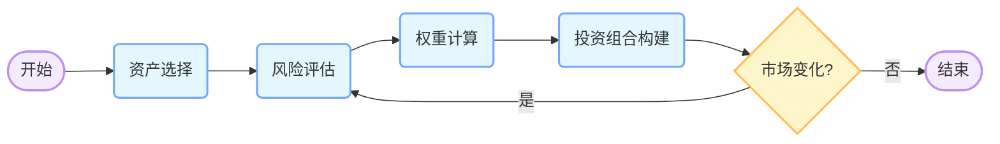

# 雷·达里奥的风险平价投资策略

> 关键词：雷·达里奥、风险平价投资策略、资产配置、风险均衡、投资组合、波动率、分散化投资

> 摘要：本文围绕雷·达里奥的风险平价投资策略展开深入探讨。首先介绍该策略产生的背景、目的和适用范围，明确预期读者群体，并对文档结构进行概述，同时解释相关术语。接着阐述风险平价投资策略的核心概念，包括原理和架构，以文本示意图和 Mermaid 流程图呈现其逻辑关系。详细讲解核心算法原理，结合 Python 源代码展示具体操作步骤。引入数学模型和公式，辅以举例说明，帮助读者理解策略的内在逻辑。通过项目实战，展示代码实际案例并进行详细解释。探讨该策略在不同场景下的实际应用，推荐相关的学习资源、开发工具框架以及论文著作。最后总结该策略的未来发展趋势与挑战，解答常见问题，提供扩展阅读和参考资料，旨在为读者全面解读风险平价投资策略，助力其在投资领域做出更明智的决策。

## 1. 背景介绍 
### 1.1 目的和范围
风险平价投资策略由桥水基金创始人雷·达里奥提出，其目的在于构建一个更加稳健、风险均衡的投资组合，降低投资组合对单一资产或市场因素的过度依赖，从而在不同的市场环境下都能实现较为稳定的收益。该策略的范围涵盖了多种资产类别，如股票、债券、商品等，通过对不同资产的风险进行评估和调整，实现投资组合的风险平衡。

### 1.2 预期读者
本文的预期读者包括对投资领域感兴趣的个人投资者、金融从业者、研究人员以及希望深入了解资产配置策略的人群。无论是初涉投资领域的新手，还是经验丰富的专业人士，都能从本文中获取有价值的信息和知识。

### 1.3 文档结构概述
本文将按照以下结构展开：首先介绍风险平价投资策略的背景信息，包括目的、预期读者和文档结构概述，以及相关术语的解释。接着阐述核心概念，包括原理和架构，并通过 Mermaid 流程图进行直观展示。然后详细讲解核心算法原理，结合 Python 源代码说明具体操作步骤。引入数学模型和公式，进行详细讲解并举例说明。通过项目实战，展示代码实际案例并进行深入解读。探讨该策略在不同场景下的实际应用。推荐相关的学习资源、开发工具框架以及论文著作。最后总结未来发展趋势与挑战，解答常见问题，提供扩展阅读和参考资料。

### 1.4 术语表
#### 1.4.1 核心术语定义
- **风险平价投资策略**：一种资产配置策略，旨在通过调整不同资产的权重，使各资产对投资组合的风险贡献相等，从而实现投资组合的风险均衡。
- **资产配置**：指投资者将资金分配到不同资产类别（如股票、债券、现金等）的过程，以实现投资目标和风险控制。
- **风险贡献**：指某一资产对投资组合整体风险的贡献程度，通常用该资产的波动率和与其他资产的相关性来衡量。
- **波动率**：衡量资产价格波动程度的指标，通常用标准差来表示。
- **分散化投资**：通过投资于多种不同的资产或资产类别，降低投资组合的整体风险。

#### 1.4.2 相关概念解释
- **风险均衡**：风险平价投资策略的核心目标，即通过调整资产权重，使各资产的风险贡献相等，从而实现投资组合的风险平衡。
- **投资组合**：由多种资产组成的集合，投资者通过对不同资产的选择和配置，构建出符合自己风险偏好和投资目标的投资组合。
- **相关性**：衡量两个或多个资产价格变动之间的关联程度，通常用相关系数来表示。正相关表示资产价格变动方向相同，负相关表示资产价格变动方向相反。

#### 1.4.3 缩略词列表
- **ETF**：交易型开放式指数基金（Exchange Traded Fund）
- **VAR**：风险价值（Value at Risk）

## 2. 核心概念与联系 

### 核心概念原理
风险平价投资策略的核心原理是基于现代投资组合理论，通过调整不同资产的权重，使各资产对投资组合的风险贡献相等，从而实现投资组合的风险均衡。传统的资产配置策略通常基于资产的预期收益率来确定资产权重，而风险平价投资策略则更关注资产的风险特征。

在一个投资组合中，不同资产的波动率和相关性各不相同。波动率较高的资产对投资组合的风险贡献较大，而波动率较低的资产对投资组合的风险贡献较小。通过调整资产权重，增加波动率较低资产的权重，降低波动率较高资产的权重，可以使各资产的风险贡献趋于相等，从而降低投资组合的整体风险。

### 架构的文本示意图
风险平价投资策略的架构主要包括以下几个步骤：
1. **资产选择**：选择不同类型的资产，如股票、债券、商品等，构建投资组合的基础。
2. **风险评估**：对各资产的风险特征进行评估，包括波动率、相关性等。
3. **权重计算**：根据风险评估结果，计算各资产的权重，使各资产的风险贡献相等。
4. **投资组合构建**：按照计算得到的权重，将资金分配到不同资产上，构建投资组合。
5. **动态调整**：根据市场情况和资产风险特征的变化，动态调整资产权重，保持投资组合的风险均衡。

### Mermaid 流程图


## 3. 核心算法原理 & 具体操作步骤 

### 核心算法原理
风险平价投资策略的核心算法是通过求解一个优化问题，使得各资产的风险贡献相等。假设投资组合中有 $n$ 种资产，第 $i$ 种资产的权重为 $w_i$，波动率为 $\sigma_i$，资产之间的协方差矩阵为 $\Sigma$，则投资组合的波动率 $\sigma_p$ 可以表示为：

$$\sigma_p = \sqrt{w^T \Sigma w}$$

其中，$w = [w_1, w_2, \cdots, w_n]^T$ 是资产权重向量。

第 $i$ 种资产对投资组合的风险贡献 $RC_i$ 可以表示为：

$$RC_i = w_i \frac{\partial \sigma_p}{\partial w_i}$$

风险平价投资策略的目标是使各资产的风险贡献相等，即：

$$RC_1 = RC_2 = \cdots = RC_n$$

可以通过求解以下优化问题来实现：

$$\min_{w} \sum_{i=1}^{n} \sum_{j=1}^{n} (RC_i - RC_j)^2$$

约束条件为：

$$\sum_{i=1}^{n} w_i = 1$$

$$w_i \geq 0, \quad i = 1, 2, \cdots, n$$

### 具体操作步骤及 Python 源代码
以下是使用 Python 实现风险平价投资策略的具体步骤和代码示例：

```python
import numpy as np
from scipy.optimize import minimize

# 定义风险贡献函数
def risk_contribution(w, cov_matrix):
    sigma_p = np.sqrt(w.T @ cov_matrix @ w)
    marginal_risk = cov_matrix @ w
    rc = w * marginal_risk / sigma_p
    return rc

# 定义目标函数
def objective(w, cov_matrix):
    rc = risk_contribution(w, cov_matrix)
    n = len(rc)
    return np.sum([(rc[i] - rc[j])**2 for i in range(n) for j in range(n)])

# 定义约束条件
def constraint(w):
    return np.sum(w) - 1

# 初始化权重
def initialize_weights(n):
    return np.ones(n) / n

# 风险平价优化
def risk_parity_optimization(cov_matrix):
    n = cov_matrix.shape[0]
    w0 = initialize_weights(n)
    bounds = [(0, 1) for _ in range(n)]
    cons = {'type': 'eq', 'fun': constraint}
    result = minimize(objective, w0, args=(cov_matrix,), bounds=bounds, constraints=cons)
    return result.x

# 示例数据
returns = np.array([[0.01, 0.02, 0.03], [0.02, 0.03, 0.04], [0.03, 0.04, 0.05]])
cov_matrix = np.cov(returns.T)

# 计算风险平价权重
weights = risk_parity_optimization(cov_matrix)
print("风险平价权重:", weights)
```

### 代码解释
1. **风险贡献函数 `risk_contribution`**：计算每种资产对投资组合的风险贡献。
2. **目标函数 `objective`**：计算各资产风险贡献之间的差异平方和，作为优化的目标。
3. **约束条件 `constraint`**：确保资产权重之和为 1。
4. **初始化权重函数 `initialize_weights`**：将初始权重设置为等权重。
5. **风险平价优化函数 `risk_parity_optimization`**：使用 `scipy.optimize.minimize` 函数求解优化问题，得到风险平价权重。

## 4. 数学模型和公式 & 详细讲解 & 举例说明 

### 数学模型和公式
在前面的核心算法原理部分，我们已经介绍了风险平价投资策略的数学模型和公式。这里再次总结一下：

- 投资组合的波动率：

$$\sigma_p = \sqrt{w^T \Sigma w}$$

- 第 $i$ 种资产对投资组合的风险贡献：

$$RC_i = w_i \frac{\partial \sigma_p}{\partial w_i}$$

- 风险平价投资策略的目标函数：

$$\min_{w} \sum_{i=1}^{n} \sum_{j=1}^{n} (RC_i - RC_j)^2$$

- 约束条件：

$$\sum_{i=1}^{n} w_i = 1$$

$$w_i \geq 0, \quad i = 1, 2, \cdots, n$$

### 详细讲解
- **投资组合的波动率**：投资组合的波动率是衡量投资组合风险的重要指标，它反映了投资组合价值的波动程度。通过计算投资组合的波动率，可以评估投资组合的风险水平。
- **风险贡献**：风险贡献是指某一资产对投资组合整体风险的贡献程度。通过计算每种资产的风险贡献，可以了解不同资产对投资组合风险的影响。
- **目标函数**：风险平价投资策略的目标是使各资产的风险贡献相等，因此目标函数是各资产风险贡献之间的差异平方和。通过最小化目标函数，可以找到使各资产风险贡献相等的资产权重。
- **约束条件**：约束条件确保资产权重之和为 1，并且每个资产的权重非负。这是合理的投资组合构建要求，确保资金全部投入到资产中，并且不允许卖空。

### 举例说明
假设投资组合中有两种资产：股票和债券。股票的波动率为 0.2，债券的波动率为 0.1，股票和债券的相关性为 0.3。

1. 计算协方差矩阵：

$$\Sigma = \begin{bmatrix}
\sigma_1^2 & \rho_{12} \sigma_1 \sigma_2 \\
\rho_{12} \sigma_1 \sigma_2 & \sigma_2^2
\end{bmatrix} = \begin{bmatrix}
0.2^2 & 0.3 \times 0.2 \times 0.1 \\
0.3 \times 0.2 \times 0.1 & 0.1^2
\end{bmatrix} = \begin{bmatrix}
0.04 & 0.006 \\
0.006 & 0.01
\end{bmatrix}$$

2. 使用前面的 Python 代码计算风险平价权重：

```python
import numpy as np
from scipy.optimize import minimize

# 协方差矩阵
cov_matrix = np.array([[0.04, 0.006], [0.006, 0.01]])

# 定义风险贡献函数
def risk_contribution(w, cov_matrix):
    sigma_p = np.sqrt(w.T @ cov_matrix @ w)
    marginal_risk = cov_matrix @ w
    rc = w * marginal_risk / sigma_p
    return rc

# 定义目标函数
def objective(w, cov_matrix):
    rc = risk_contribution(w, cov_matrix)
    n = len(rc)
    return np.sum([(rc[i] - rc[j])**2 for i in range(n) for j in range(n)])

# 定义约束条件
def constraint(w):
    return np.sum(w) - 1

# 初始化权重
def initialize_weights(n):
    return np.ones(n) / n

# 风险平价优化
def risk_parity_optimization(cov_matrix):
    n = cov_matrix.shape[0]
    w0 = initialize_weights(n)
    bounds = [(0, 1) for _ in range(n)]
    cons = {'type': 'eq', 'fun': constraint}
    result = minimize(objective, w0, args=(cov_matrix,), bounds=bounds, constraints=cons)
    return result.x

# 计算风险平价权重
weights = risk_parity_optimization(cov_matrix)
print("风险平价权重:", weights)
```

运行上述代码，得到风险平价权重。可以看到，由于债券的波动率较低，其在投资组合中的权重会相对较高，以实现风险均衡。

## 5. 项目实战：代码实际案例和详细解释说明 

### 5.1  开发环境搭建
在进行风险平价投资策略的项目实战之前，需要搭建相应的开发环境。以下是具体步骤：

1. **安装 Python**：可以从 Python 官方网站（https://www.python.org/downloads/） 下载并安装最新版本的 Python。
2. **安装必要的库**：使用 `pip` 命令安装所需的库，包括 `numpy`、`scipy` 等。

```sh
pip install numpy scipy
```

### 5.2  源代码详细实现和代码解读
以下是一个完整的风险平价投资策略项目实战代码示例：

```python
import numpy as np
from scipy.optimize import minimize
import pandas as pd
import yfinance as yf

# 定义风险贡献函数
def risk_contribution(w, cov_matrix):
    sigma_p = np.sqrt(w.T @ cov_matrix @ w)
    marginal_risk = cov_matrix @ w
    rc = w * marginal_risk / sigma_p
    return rc

# 定义目标函数
def objective(w, cov_matrix):
    rc = risk_contribution(w, cov_matrix)
    n = len(rc)
    return np.sum([(rc[i] - rc[j])**2 for i in range(n) for j in range(n)])

# 定义约束条件
def constraint(w):
    return np.sum(w) - 1

# 初始化权重
def initialize_weights(n):
    return np.ones(n) / n

# 风险平价优化
def risk_parity_optimization(cov_matrix):
    n = cov_matrix.shape[0]
    w0 = initialize_weights(n)
    bounds = [(0, 1) for _ in range(n)]
    cons = {'type': 'eq', 'fun': constraint}
    result = minimize(objective, w0, args=(cov_matrix,), bounds=bounds, constraints=cons)
    return result.x

# 下载数据
def download_data(tickers, start_date, end_date):
    data = yf.download(tickers, start=start_date, end=end_date)['AdjClose']
    returns = data.pct_change().dropna()
    return returns

# 主函数
def main():
    # 股票代码
    tickers = ['AAPL', 'MSFT', 'JPM', 'V', 'PG']
    start_date = '2020-01-01'
    end_date = '2023-01-01'

    # 下载数据
    returns = download_data(tickers, start_date, end_date)

    # 计算协方差矩阵
    cov_matrix = returns.cov().values

    # 计算风险平价权重
    weights = risk_parity_optimization(cov_matrix)

    # 输出结果
    print("资产列表:", tickers)
    print("风险平价权重:", weights)

if __name__ == "__main__":
    main()
```

### 5.3  代码解读与分析
1. **风险贡献函数 `risk_contribution`**：该函数用于计算每种资产对投资组合的风险贡献，通过计算投资组合的波动率和边际风险，得到每种资产的风险贡献。
2. **目标函数 `objective`**：目标函数是各资产风险贡献之间的差异平方和，通过最小化该目标函数，可以使各资产的风险贡献相等。
3. **约束条件 `constraint`**：约束条件确保资产权重之和为 1，保证投资组合的合理性。
4. **初始化权重函数 `initialize_weights`**：将初始