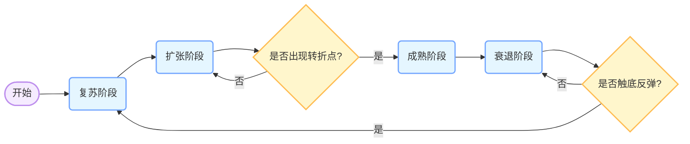

# 霍华德·马克斯的信贷周期分析方法

> 关键词：霍华德·马克斯、信贷周期、分析方法、金融市场、投资决策

> 摘要：本文深入探讨了霍华德·马克斯的信贷周期分析方法。首先介绍了该分析方法的背景，包括目的、预期读者、文档结构和相关术语。接着阐述了信贷周期的核心概念与联系，给出了原理和架构的文本示意图及 Mermaid 流程图。详细讲解了核心算法原理和具体操作步骤，并通过 Python 代码进行阐述。同时介绍了相关的数学模型和公式，并举例说明。在项目实战部分，提供了开发环境搭建、源代码实现和代码解读。还分析了该分析方法的实际应用场景，推荐了学习、开发相关的工具和资源，包括书籍、在线课程、技术博客、IDE 等，以及相关论文著作。最后总结了未来发展趋势与挑战，提供了常见问题解答和扩展阅读参考资料，旨在帮助读者全面理解和运用霍华德·马克斯的信贷周期分析方法。

## 1. 背景介绍 
### 1.1 目的和范围
霍华德·马克斯作为投资领域的传奇人物，其信贷周期分析方法为投资者理解金融市场的信贷变化规律提供了有力工具。本文的目的在于深入剖析这一分析方法，详细阐述其原理、操作步骤和实际应用。范围涵盖了信贷周期的各个阶段，从信贷宽松到紧缩，以及如何根据信贷周期的变化进行投资决策。通过本文的学习，读者将能够掌握霍华德·马克斯信贷周期分析方法的核心要点，并将其应用于实际的投资和金融分析中。

### 1.2 预期读者
本文的预期读者主要包括金融投资领域的从业者，如基金经理、投资顾问、分析师等，他们可以通过学习该方法来优化投资策略，提高投资收益。同时，对于对金融市场感兴趣的学者和研究人员，本文也提供了深入研究信贷周期的理论和实践基础。此外，有一定金融知识基础的个人投资者也可以通过本文了解信贷周期对市场的影响，从而更好地管理自己的投资组合。

### 1.3 文档结构概述
本文将按照以下结构进行阐述：首先介绍核心概念与联系，让读者对信贷周期有一个清晰的认识；接着讲解核心算法原理和具体操作步骤，并结合 Python 代码进行说明；然后介绍相关的数学模型和公式，并举例说明其应用；在项目实战部分，将详细介绍开发环境搭建、源代码实现和代码解读；之后分析该方法的实际应用场景；再推荐学习和开发相关的工具和资源；最后总结未来发展趋势与挑战，提供常见问题解答和扩展阅读参考资料。

### 1.4 术语表
#### 1.4.1 核心术语定义
- **信贷周期**：指信贷市场从宽松到紧缩，再从紧缩到宽松的周期性变化过程。在信贷宽松阶段，市场上资金充裕，借款容易，利率较低；而在信贷紧缩阶段，资金紧张，借款难度增加，利率上升。
- **风险偏好**：投资者对投资风险的承受意愿和能力。在信贷宽松阶段，投资者的风险偏好通常较高，更愿意投资高风险资产；而在信贷紧缩阶段，风险偏好降低，更倾向于投资低风险资产。
- **违约率**：借款人未能按时偿还债务的比例。违约率是衡量信贷市场风险的重要指标，在信贷紧缩阶段，违约率通常会上升。

#### 1.4.2 相关概念解释
- **信贷扩张**：指信贷市场上贷款规模不断增加的过程。信贷扩张通常伴随着经济的增长和繁荣，因为企业和个人更容易获得资金进行投资和消费。
- **信贷收缩**：与信贷扩张相反，指信贷市场上贷款规模逐渐减少的过程。信贷收缩可能是由于经济衰退、金融监管加强等原因导致的。
- **信用利差**：指不同信用等级债券之间的收益率差异。信用利差反映了市场对不同信用风险的定价，在信贷紧缩阶段，信用利差通常会扩大。

#### 1.4.3 缩略词列表
- **GDP**：国内生产总值，是衡量一个国家或地区经济活动总量的指标。
- **CPI**：消费者物价指数，反映了一定时期内居民消费价格的变动情况。
- **LIBOR**：伦敦同业拆借利率，是国际金融市场上银行之间相互拆借资金的利率。

## 2. 核心概念与联系 
### 核心概念原理
霍华德·马克斯的信贷周期分析方法基于对信贷市场的观察和研究。信贷市场的运行受到多种因素的影响，包括宏观经济环境、货币政策、投资者情绪等。信贷周期通常可以分为四个阶段：复苏阶段、扩张阶段、成熟阶段和衰退阶段。

在复苏阶段，经济开始从衰退中复苏，货币政策通常较为宽松，信贷市场逐渐回暖。银行开始增加贷款发放，企业和个人的借款需求也逐渐增加。此时，风险偏好开始上升，投资者开始关注高收益资产。

扩张阶段是信贷市场最为繁荣的时期。经济增长强劲，企业盈利增加，信贷需求旺盛。银行积极放贷，信贷规模迅速扩大。资产价格上涨，投资者的风险偏好进一步提高，市场上充满了乐观情绪。

成熟阶段是信贷周期的转折点。经济增长开始放缓，通货膨胀压力逐渐增大。货币政策可能会逐渐收紧，银行开始谨慎放贷。企业的债务负担加重，违约风险开始上升。投资者的风险偏好开始下降，市场情绪逐渐转向谨慎。

衰退阶段是信贷市场最为困难的时期。经济陷入衰退，企业盈利下降，违约率大幅上升。银行收紧信贷政策，信贷规模急剧收缩。资产价格下跌，投资者的风险偏好降至最低，市场上充满了恐慌情绪。

### 架构的文本示意图
```plaintext
信贷周期
|-- 复苏阶段
|   |-- 经济复苏
|   |-- 货币政策宽松
|   |-- 信贷市场回暖
|   |-- 风险偏好上升
|-- 扩张阶段
|   |-- 经济增长强劲
|   |-- 信贷需求旺盛
|   |-- 银行积极放贷
|   |-- 资产价格上涨
|   |-- 风险偏好进一步提高
|-- 成熟阶段
|   |-- 经济增长放缓
|   |-- 通货膨胀压力增大
|   |-- 货币政策收紧
|   |-- 银行谨慎放贷
|   |-- 违约风险上升
|   |-- 风险偏好下降
|-- 衰退阶段
|   |-- 经济衰退
|   |-- 违约率大幅上升
|   |-- 银行收紧信贷
|   |-- 资产价格下跌
|   |-- 风险偏好降至最低
```

### Mermaid 流程图


## 3. 核心算法原理 & 具体操作步骤 
### 核心算法原理
霍华德·马克斯的信贷周期分析方法并没有一个严格意义上的固定算法，但可以通过一些指标和逻辑来判断信贷周期的阶段。主要的指标包括信贷规模、利率水平、违约率、风险偏好等。

具体来说，可以通过以下逻辑来判断信贷周期的阶段：
- 当信贷规模持续增长、利率较低、违约率下降、风险偏好上升时，可能处于复苏阶段或扩张阶段。
- 当信贷规模增长放缓、利率开始上升、违约率开始上升、风险偏好开始下降时，可能进入成熟阶段。
- 当信贷规模急剧收缩、利率大幅上升、违约率大幅上升、风险偏好降至最低时，可能处于衰退阶段。

### 具体操作步骤
1. **数据收集**：收集相关的经济数据和金融数据，包括信贷规模、利率、违约率、资产价格等。这些数据可以从政府部门、金融机构、数据提供商等渠道获取。
2. **指标计算**：根据收集到的数据，计算相关的指标，如信贷增长率、利率变化率、违约率变化率等。
3. **阶段判断**：根据计算得到的指标和上述的逻辑判断信贷周期的阶段。可以将指标与历史数据进行对比，以更准确地判断当前所处的阶段。
4. **投资决策**：根据信贷周期的阶段，制定相应的投资策略。在复苏阶段和扩张阶段，可以适当增加对高风险资产的投资；在成熟阶段和衰退阶段，应降低风险暴露，增加对低风险资产的投资。

### Python 代码实现
```python
import pandas as pd

# 模拟数据收集
data = {
    '信贷规模': [100, 110, 120, 125, 122, 115, 105],
    '利率': [2.0, 1.8, 1.6, 1.7, 1.9, 2.1, 2.3],
    '违约率': [0.02, 0.015, 0.01, 0.012, 0.015, 0.02, 0.03],
    '风险偏好': [0.6, 0.7, 0.8, 0.75, 0.7, 0.6, 0.5]
}
df = pd.DataFrame(data)

# 指标计算
df['信贷增长率'] = df['信贷规模'].pct_change()
df['利率变化率'] = df['利率'].pct_change()
df['违约率变化率'] = df['违约率'].pct_change()

# 阶段判断
def judge_cycle(row):
    if row['信贷增长率'] > 0 and row['利率变化率'] < 0 and row['违约率变化率'] < 0 and row['风险偏好'] > 0.7:
        return '扩张阶段'
    elif row['信贷增长率'] < 0.05 and row['利率变化率'] > 0 and row['违约率变化率'] > 0 and row['风险偏好'] < 0.7:
        return '成熟阶段'
    elif row['信贷增长率'] < 0 and row['利率变化率'] > 0 and row['违约率变化率'] > 0 and row['风险偏好'] < 0.6:
        return '衰退阶段'
    else:
        return '复苏阶段'

df['信贷周期阶段'] = df.apply(judge_cycle, axis=1)

print(df)
```

在上述代码中，首先模拟了数据收集的过程，创建了一个包含信贷规模、利率、违约率和风险偏好的数据框。然后计算了信贷增长率、利率变化率和违约率变化率等指标。最后根据指标和逻辑判断信贷周期的阶段，并将结果添加到数据框中。

## 4. 数学模型和公式 & 详细讲解 & 举例说明 
### 数学模型和公式
在霍华德·马克斯的信贷周期分析方法中，虽然没有一个统一的、复杂的数学模型，但可以用一些简单的数学公式来描述相关的指标。

#### 信贷增长率
信贷增长率是衡量信贷规模变化的重要指标，计算公式为：
$$信贷增长率 = \frac{当前信贷规模 - 上一期信贷规模}{上一期信贷规模} \times 100\%$$

#### 利率变化率
利率变化率反映了利率的变动情况，计算公式为：
$$利率变化率 = \frac{当前利率 - 上一期利率}{上一期利率} \times 100\%$$

#### 违约率变化率
违约率变化率用于衡量违约率的变化程度，计算公式为：
$$违约率变化率 = \frac{当前违约率 - 上一期违约率}{上一期违约率} \times 100\%$$

### 详细讲解
- **信贷增长率**：该指标反映了信贷市场的扩张或收缩程度。当信贷增长率为正且较大时，说明信贷市场处于扩张阶段；当信贷增长率为负时，说明信贷市场处于收缩阶段。
- **利率变化率**：利率是信贷市场的重要调节工具。当利率变化率为负时，说明货币政策可能较为宽松，有利于信贷市场的扩张；当利率变化率为正时，说明货币政策可能收紧，信贷市场可能面临压力。
- **违约率变化率**：违约率是衡量信贷市场风险的重要指标。当违约率变化率为正且较大时，说明信贷市场的风险在增加，可能处于成熟阶段或衰退阶段；当违约率变化率为负时，说明信贷市场的风险在降低，可能处于复苏阶段或扩张阶段。

### 举例说明
假设某地区的信贷规模在第 1 期为 100 亿元，第 2 期为 110 亿元；利率在第 1 期为 2%，第 2 期为 1.8%；违约率在第 1 期为 0.02，第 2 期为 0.015。

#### 信贷增长率
$$信贷增长率 = \frac{110 - 100}{100} \times 100\% = 10\%$$

#### 利率变化率
$$利率变化率 = \frac{1.8 - 2}{2} \times 100\% = -10\%$$

#### 违约率变化率
$$违约率变化率 = \frac{0.015 - 0.02}{0.02} \times 100\% = -25\%$$

从计算结果可以看出，信贷增长率为正，利率变化率为负，违约率变化率为负，说明该地区的信贷市场可能处于复苏阶段或扩张阶段。

## 5. 项目实战：代码实际案例和详细解释说明 
### 5.1  开发环境搭建
#### 安装 Python
首先需要安装 Python 环境，建议使用 Python 3.7 及以上版本。可以从 Python 官方网站（https://www.python.org/downloads/）下载安装包，按照安装向导进行安装。

#### 安装必要的库
在本项目中，需要使用 Pandas 库进行数据处理。可以使用以下命令安装 Pandas：
```sh
pip install pandas
```

### 5.2  源代码详细实现和代码解读
```python
import pandas as pd

# 模拟数据收集
data = {
    '信贷规模': [100, 110, 120, 125, 122, 115, 105],
    '利率': [2.0, 1.8, 1.6, 1.7, 1.9, 2.1, 2.3],
    '违约率': [0.02, 0.015, 0.01, 0.012, 0.015, 0.02, 0.03],
    '风险偏好': [0.6, 0.7, 0.8, 0.75, 0.7, 0.6, 0.5]
}
df = pd.DataFrame(data)

# 指标计算
df['信贷增长率'] = df['信贷规模'].pct_change()
df['利率变化率'] = df['利率'].pct_change()
df['违约率变化率'] = df['违约率'].pct_change()

# 阶段判断
def judge_cycle(row):
    if row['信贷增长率'] > 0 and row['利率变化率'] < 0 and row['违约率变化率'] < 0 and row['风险偏好'] > 0.7:
        return '扩张阶段'
    elif row['信贷增长率'] < 0.05 and row['利率变化率'] > 0 and row['违约率变化率'] > 0 and row['风险偏好'] < 0.7:
        return '成熟阶段'
    elif row['信贷增长率'] < 0 and row['利率变化率'] > 0 and row['违约率变化率'] > 0 and row['风险偏好'] < 0.6:
        return '衰退阶段'
    else:
        return '复苏阶段'

df['信贷周期阶段'] = df.apply(judge_cycle, axis=1)

print(df)
```

### 代码解读与分析
1. **数据收集**：使用字典模拟了数据收集的过程，创建了一个包含信贷规模、利率、违约率和风险偏好的数据框。
2. **指标计算**：使用 Pandas 的 `pct_change()` 方法计算了信贷增长率、利率变化率和违约率变化率。
3. **阶段判断**：定义了一个 `judge_cycle()` 函数，根据指标和逻辑判断信贷周期的阶段。使用 Pandas 的 `apply()` 方法将该函数应用到数据框的每一行，得到每个时期的信贷周期阶段。
4. **结果输出**：最后打印出包含信贷周期阶段的数据框。

通过这个项目实战，我们可以看到如何使用 Python 实现霍华德·马克斯的信贷周期分析方法，并且根据分析结果判断信贷周期的阶段。

## 6. 实际应用场景 
### 投资决策
霍华德·马克斯的信贷周期分析方法可以帮助投资者制定更合理的投资策略。在信贷周期的不同阶段，不同类型的资产表现可能会有所不同。

- 在复苏阶段和扩张阶段，经济增长强劲，信贷市场宽松，风险偏好上升。此时，投资者可以适当增加对股票、高收益债券等风险资产的投资，以获取更高的收益。
- 在成熟阶段，经济增长开始放缓，信贷市场逐渐收紧，风险偏好下降。投资者应逐渐降低风险暴露，增加对债券、现金等低风险资产的投资。
- 在衰退阶段，经济陷入衰退，信贷市场紧缩，违约率大幅上升。投资者应保持谨慎，以现金或短期债券等流动性资产为主，避免投资高风险资产。

### 风险管理
金融机构可以利用信贷周期分析方法进行风险管理。在信贷扩张阶段，金融机构应加强对借款人的信用评估，控制贷款规模和风险。在信贷紧缩阶段，金融机构应及时调整信贷政策，加强对不良贷款的管理，降低违约风险。

### 宏观经济分析
政府和监管机构可以使用信贷周期分析方法来监测宏观经济的运行情况。通过分析信贷规模、利率、违约率等指标的变化，可以及时发现经济中的潜在风险，制定相应的宏观经济政策，以保持经济的稳定增长。

## 7. 工具和资源推荐
### 7.1 学习资源推荐
#### 7.1.1 书籍推荐
- 《投资最重要的事》（The Most Important Thing Illuminated）：霍华德·马克斯的经典著作，书中详细阐述了他的投资理念和方法，包括信贷周期分析等内容。
- 《金融市场与金融机构》（Financial Markets and Institutions）：这本书系统介绍了金融市场和金融机构的运作，对于理解信贷市场的基本原理和机制非常有帮助。
- 《货币金融学》（Money, Banking, and Financial Markets）：全面讲解了货币、银行和金融市场的相关知识，为信贷周期分析提供了坚实的理论基础。

#### 7.1.2 在线课程
- Coursera 上的“金融市场”（Financial Markets）课程：由耶鲁大学教授罗伯特·席勒（Robert Shiller）授课，课程涵盖了金融市场的各个方面，包括信贷市场和投资决策。
- edX 上的“投资学原理”（Principles of Investing）课程：介绍了投资的基本原理和方法，对于学习信贷周期分析在投资中的应用有很大帮助。

#### 7.1.3 技术博客和网站
- 霍华德·马克斯的官方网站：可以获取他的最新文章和观点，深入了解他的投资思想和信贷周期分析方法。
- 华尔街见闻（https://wallstreetcn.com/）：提供了丰富的金融市场资讯和分析，对于关注信贷市场动态和学习信贷周期分析方法有很大帮助。

### 7.2 开发工具框架推荐
#### 7.2.1 IDE和编辑器
- PyCharm：一款功能强大的 Python 集成开发环境，提供了代码编辑、调试、版本控制等功能，适合开发 Python 程序。
- Jupyter Notebook：一个交互式的开发环境，非常适合进行数据探索和分析。可以方便地编写和运行 Python 代码，并展示分析结果。

#### 7.2.2 调试和性能分析工具
- Py-Spy：一个轻量级的 Python 性能分析工具，可以实时监测 Python 程序的运行情况，找出性能瓶颈。
- PDB：Python 自带的调试工具，可以帮助开发者在代码中设置断点，逐步调试程序，查找问题。

#### 7.2.3 相关框架和库
- Pandas：一个强大的数据处理和分析库，提供了丰富的数据结构和函数，适合处理和分析金融数据。
- NumPy：一个用于科学计算的 Python 库，提供了高效的数组操作和数学函数，对于计算金融指标非常有用。

### 7.3 相关论文著作推荐
#### 7.3.1 经典论文
- “Credit Cycles”（信贷周期）：该论文深入研究了信贷周期的形成机制和影响因素，是信贷周期研究领域的经典之作。
- “Financial Intermediation and Credit Creation in the Macroeconomy”（金融中介与宏观经济中的信贷创造）：探讨了金融中介在信贷创造和经济增长中的作用，对于理解信贷市场的宏观经济影响有重要意义。

#### 7.3.2 最新研究成果
- 可以关注《Journal of Financial Economics》（金融经济学杂志）、《Review of Financial Studies》（金融研究评论）等国际顶级金融学术期刊，获取关于信贷周期的最新研究成果。

#### 7.3.3 应用案例分析
- 一些金融机构和研究机构会发布关于信贷周期分析在实际投资和风险管理中的应用案例。可以通过搜索相关报告和案例，学习如何将信贷周期分析方法应用到实际工作中。

## 8. 总结：未来发展趋势与挑战
### 未来发展趋势
- **数据驱动的分析**：随着金融科技的发展，越来越多的数据可以用于信贷周期分析。未来，信贷周期分析将更加依赖于大数据和人工智能技术，通过挖掘海量数据中的信息，提高分析的准确性和及时性。
- **跨市场和跨行业分析**：信贷市场与其他金融市场和实体经济密切相关。未来的信贷周期分析将不仅仅局限于信贷市场本身，还将考虑跨市场和跨行业的因素，进行更全面的分析。
- **风险管理的精细化**：金融机构将更加重视信贷周期分析在风险管理中的应用，通过精细化的风险管理策略，降低信贷风险，提高资产质量。

### 挑战
- **数据质量和可用性**：虽然数据量不断增加，但数据质量和可用性仍然是一个挑战。不准确或不完整的数据可能会导致分析结果的偏差，影响投资决策和风险管理。
- **模型的复杂性和不确定性**：信贷市场受到多种因素的影响，建立准确的信贷周期分析模型非常困难。模型的复杂性和不确定性可能会导致分析结果的不准确，需要不断进行模型优化和验证。
- **市场环境的变化**：金融市场和宏观经济环境不断变化，信贷周期的特征和规律也可能会发生改变。分析师需要及时调整分析方法和模型，以适应市场环境的变化。

## 9. 附录：常见问题与解答
### 问题 1：信贷周期分析方法是否适用于所有金融市场？
解答：信贷周期分析方法的基本原理适用于大多数金融市场，但不同市场的具体情况可能会有所不同。在应用该方法时，需要结合当地的金融市场特点、宏观经济环境和政策法规等因素进行调整和优化。

### 问题 2：如何获取准确的信贷市场数据？
解答：可以从政府部门（如央行、统计局）、金融机构（如银行、证券公司）、数据提供商（如 Wind、Bloomberg）等渠道获取信贷市场数据。在获取数据时，需要注意数据的准确性、完整性和时效性。

### 问题 3：信贷周期分析方法能否准确预测市场走势？
解答：信贷周期分析方法可以帮助我们理解信贷市场的运行规律和趋势，但不能保证准确预测市场走势。金融市场受到多种因素的影响，包括宏观经济、政策法规、投资者情绪等，这些因素具有不确定性，因此市场走势难以完全准确预测。信贷周期分析方法可以为投资决策提供参考，但不能替代投资者的判断和决策。

## 10. 扩展阅读 & 参考资料
### 扩展阅读
- 《周期》（Mastering the Market Cycle）：霍华德·马克斯的另一本著作，深入探讨了投资中的各种周期，包括信贷周期，对于理解市场的周期性变化有很大帮助。
- 《金融炼金术》（The Alchemy of Finance）：乔治·索罗斯（George Soros）的经典著作，提出了反身性理论，对于理解金融市场的复杂性和不确定性有重要启示。

### 参考资料
- 霍华德·马克斯的官方文章和演讲。
- 相关的金融学术期刊和研究报告。
- 金融市场的数据和统计资料。

作者：AI天才研究院/AI Genius Institute & 禅与计算机程序设计艺术 /Zen And The Art of Computer Programming