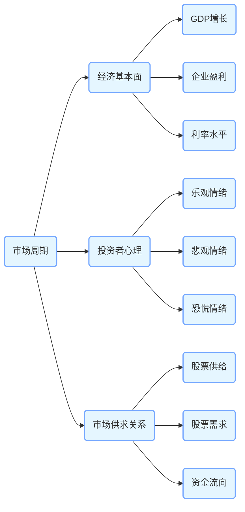

# 霍华德·马克斯的市场周期理论

> 关键词：霍华德·马克斯、市场周期理论、投资策略、周期分析、金融市场

> 摘要：本文深入探讨了霍华德·马克斯的市场周期理论。首先介绍该理论提出的背景、适用范围、预期读者以及文档的整体结构，同时对相关术语进行详细解释。接着阐述市场周期理论的核心概念、相互联系，并以文本示意图和Mermaid流程图呈现。通过Python代码详细说明核心算法原理和具体操作步骤，引入数学模型和公式进行深入讲解并举例说明。结合项目实战，给出代码实际案例并详细解读。分析该理论在实际金融市场中的应用场景，推荐学习该理论的工具和资源，包括书籍、在线课程、技术博客、开发工具、相关框架和库以及经典论文等。最后总结市场周期理论的未来发展趋势与挑战，解答常见问题，并提供扩展阅读和参考资料，帮助读者全面理解和应用霍华德·马克斯的市场周期理论。

## 1. 背景介绍 
### 1.1 目的和范围
霍华德·马克斯的市场周期理论旨在帮助投资者更好地理解金融市场的运行规律，把握市场周期的变化，从而制定更为合理的投资策略。该理论的范围涵盖了各种金融市场，如股票市场、债券市场、房地产市场等。通过对市场周期的分析，投资者可以更准确地判断市场所处的阶段，避免在市场过热时过度买入，在市场过冷时过度卖出，从而提高投资的成功率和收益率。

### 1.2 预期读者
本文的预期读者主要包括金融投资者、投资分析师、金融研究人员以及对金融市场周期感兴趣的人士。无论是专业的投资人士，还是普通的投资者，都可以从霍华德·马克斯的市场周期理论中获得有益的启示，提升自己的投资水平和决策能力。

### 1.3 文档结构概述
本文将按照以下结构进行阐述：首先介绍市场周期理论的背景知识，包括目的、范围、预期读者和文档结构概述等；接着详细讲解市场周期理论的核心概念和相互联系，通过文本示意图和Mermaid流程图进行直观展示；然后深入分析核心算法原理和具体操作步骤，使用Python代码进行详细说明；引入数学模型和公式，结合实际例子进行讲解；通过项目实战，给出代码实际案例并进行详细解读；分析市场周期理论在实际金融市场中的应用场景；推荐学习该理论的工具和资源，包括书籍、在线课程、技术博客、开发工具、相关框架和库以及经典论文等；最后总结市场周期理论的未来发展趋势与挑战，解答常见问题，并提供扩展阅读和参考资料。

### 1.4 术语表
#### 1.4.1 核心术语定义
- **市场周期**：指金融市场价格和经济活动围绕长期趋势的周期性波动。市场周期包括上涨阶段（牛市）和下跌阶段（熊市），以及两者之间的过渡阶段。
- **周期位置**：表示市场在当前周期中所处的阶段，如早期、中期、晚期等。准确判断周期位置对于投资者制定投资策略至关重要。
- **风险偏好**：投资者对风险的承受能力和意愿。在市场周期的不同阶段，投资者的风险偏好会发生变化，进而影响市场的供求关系和价格走势。
- **市场情绪**：投资者对市场的整体看法和心理状态，包括乐观、悲观、恐慌等情绪。市场情绪往往会放大市场的波动，加剧市场周期的变化。

#### 1.4.2 相关概念解释
- **均值回归**：市场价格在长期内会趋向于其内在价值。当市场价格偏离内在价值过大时，会出现向内在价值回归的趋势。这是市场周期理论的一个重要基础。
- **顺周期和逆周期**：顺周期投资策略是指在市场上涨阶段增加投资，在市场下跌阶段减少投资；逆周期投资策略则相反，在市场下跌阶段增加投资，在市场上涨阶段减少投资。
- **经济周期**：指国民经济活动的扩张和收缩交替出现的过程，包括繁荣、衰退、萧条和复苏四个阶段。经济周期与市场周期密切相关，但并不完全同步。

#### 1.4.3 缩略词列表
- **GDP**：国内生产总值，是衡量一个国家或地区经济活动总量的重要指标。
- **PE**：市盈率，是股票价格与每股盈利的比率，用于衡量股票的估值水平。
- **PB**：市净率，是股票价格与每股净资产的比率，也是衡量股票估值的重要指标。

## 2. 核心概念与联系 

### 核心概念原理
霍华德·马克斯认为，市场周期是由多种因素共同作用的结果，主要包括经济基本面、投资者心理和市场供求关系等。经济基本面是市场周期的基础，如GDP增长、企业盈利等因素会影响市场的长期趋势。投资者心理则是市场周期波动的重要驱动力，投资者的乐观和悲观情绪会导致市场价格的过度上涨和下跌。市场供求关系的变化也会影响市场周期，当供大于求时，市场价格往往会下跌；当供小于求时，市场价格则会上涨。

市场周期具有一定的规律性，但并不是完全可预测的。周期的长度和幅度会受到多种因素的影响，如宏观经济政策、突发事件等。投资者可以通过对市场周期的分析，把握市场的大致趋势，但不能准确预测市场的转折点。

### 文本示意图
```plaintext
市场周期
|-- 经济基本面
|   |-- GDP增长
|   |-- 企业盈利
|   |-- 利率水平
|-- 投资者心理
|   |-- 乐观情绪
|   |-- 悲观情绪
|   |-- 恐慌情绪
|-- 市场供求关系
|   |-- 股票供给
|   |-- 股票需求
|   |-- 资金流向
```

### Mermaid流程图


## 3. 核心算法原理 & 具体操作步骤 

### 核心算法原理
为了分析市场周期，我们可以使用一些量化指标来衡量市场的状态。其中，一个常用的指标是市场的估值水平，如市盈率（PE）和市净率（PB）。通过计算市场的平均PE和PB，并与历史数据进行比较，可以判断市场的估值是否过高或过低。

另一个重要的指标是投资者的情绪指标，如投资者信心指数、换手率等。投资者信心指数可以反映投资者对市场的乐观或悲观程度，换手率则可以反映市场的活跃程度。

以下是一个简单的Python代码示例，用于计算市场的PE和PB：

```python
import pandas as pd

# 假设我们有一个包含股票数据的DataFrame，包含列 'price', 'earnings', 'book_value'
data = {
    'price': [100, 120, 150, 80],
    'earnings': [10, 12, 15, 8],
    'book_value': [50, 60, 75, 40]
}
df = pd.DataFrame(data)

# 计算PE和PB
df['PE'] = df['price'] / df['earnings']
df['PB'] = df['price'] / df['book_value']

# 计算市场平均PE和PB
average_pe = df['PE'].mean()
average_pb = df['PB'].mean()

print(f"市场平均PE: {average_pe}")
print(f"市场平均PB: {average_pb}")
```

### 具体操作步骤
1. **数据收集**：收集市场上股票的价格、盈利和净资产等数据，可以从金融数据提供商（如Wind、Bloomberg等）获取。
2. **数据处理**：将收集到的数据进行清洗和整理，去除缺失值和异常值。
3. **指标计算**：根据收集到的数据计算市场的PE、PB等估值指标，以及投资者情绪指标。
4. **数据分析**：将计算得到的指标与历史数据进行比较，判断市场的估值水平和投资者情绪状态。
5. **投资决策**：根据市场的估值水平和投资者情绪状态，制定相应的投资策略。例如，当市场估值过高且投资者情绪过于乐观时，可以适当减少投资；当市场估值过低且投资者情绪过于悲观时，可以适当增加投资。

## 4. 数学模型和公式 & 详细讲解 & 举例说明 

### 数学模型和公式
- **市盈率（PE）**：$PE = \frac{P}{E}$，其中 $P$ 表示股票价格，$E$ 表示每股盈利。
- **市净率（PB）**：$PB = \frac{P}{B}$，其中 $P$ 表示股票价格，$B$ 表示每股净资产。

### 详细讲解
市盈率反映了投资者为获取每股盈利所愿意支付的价格倍数，是衡量股票估值的重要指标。一般来说，市盈率越高，说明股票的估值越高；市盈率越低，说明股票的估值越低。

市净率反映了股票价格与每股净资产的关系，市净率越低，说明股票的价格相对净资产更便宜，具有更高的投资价值。

### 举例说明
假设某只股票的价格为100元，每股盈利为10元，每股净资产为50元。则该股票的市盈率为：$PE = \frac{100}{10} = 10$，市净率为：$PB = \frac{100}{50} = 2$。

如果市场上该股票的平均市盈率为15，平均市净率为2.5，那么该股票的估值相对较低，可能具有一定的投资价值。

## 5. 项目实战：代码实际案例和详细解释说明 

### 5.1  开发环境搭建
- **安装Python**：从Python官方网站（https://www.python.org/downloads/）下载并安装Python 3.x版本。
- **安装必要的库**：使用pip安装以下必要的库：
```sh
pip install pandas numpy matplotlib
```

### 5.2  源代码详细实现和代码解读
以下是一个完整的Python代码示例，用于分析市场周期：

```python
import pandas as pd
import numpy as np
import matplotlib.pyplot as plt

# 模拟市场数据
np.random.seed(0)
n = 100
prices = np.random.randn(n).cumsum() + 100
earnings = np.random.randn(n).cumsum() + 10
book_values = np.random.randn(n).cumsum() + 50

data = {
    'price': prices,
    'earnings': earnings,
    'book_value': book_values
}
df = pd.DataFrame(data)

# 计算PE和PB
df['PE'] = df['price'] / df['earnings']
df['PB'] = df['price'] / df['book_value']

# 计算PE和PB的历史均值和标准差
pe_mean = df['PE'].mean()
pe_std = df['PE'].std()
pb_mean = df['PB'].mean()
pb_std = df['PB'].std()

# 绘制PE和PB的时间序列图
plt.figure(figsize=(12, 6))

plt.subplot(2, 1, 1)
plt.plot(df['PE'])
plt.axhline(y=pe_mean, color='r', linestyle='--', label='Mean PE')
plt.axhline(y=pe_mean + pe_std, color='g', linestyle='--', label='Mean + 1 STD PE')
plt.axhline(y=pe_mean - pe_std, color='g', linestyle='--', label='Mean - 1 STD PE')
plt.title('Price-to-Earnings Ratio (PE)')
plt.xlabel('Time')
plt.ylabel('PE')
plt.legend()

plt.subplot(2, 1, 2)
plt.plot(df['PB'])
plt.axhline(y=pb_mean, color='r', linestyle='--', label='Mean PB')
plt.axhline(y=pb_mean + pb_std, color='g', linestyle='--', label='Mean + 1 STD PB')
plt.axhline(y=pb_mean - pb_std, color='g', linestyle='--', label='Mean - 1 STD PB')
plt.title('Price-to-Book Ratio (PB)')
plt.xlabel('Time')
plt.ylabel('PB')
plt.legend()

plt.tight_layout()
plt.show()
```

### 代码解读与分析
1. **数据模拟**：使用`numpy`库生成随机数据模拟市场的价格、盈利和净资产数据。
2. **指标计算**：计算市场的PE和PB指标，并存储在DataFrame中。
3. **统计分析**：计算PE和PB的历史均值和标准差，用于判断市场的估值水平。
4. **可视化**：使用`matplotlib`库绘制PE和PB的时间序列图，并标注出均值和均值加减一个标准差的位置。通过观察图形，可以直观地判断市场的估值是否过高或过低。

## 6. 实际应用场景 
### 股票投资
在股票投资中，霍华德·马克斯的市场周期理论可以帮助投资者判断市场的估值水平和投资者情绪，从而制定合理的投资策略。当市场处于周期的底部，估值较低且投资者情绪悲观时，投资者可以适当增加股票投资；当市场处于周期的顶部，估值较高且投资者情绪乐观时，投资者可以适当减少股票投资。

### 债券投资
市场周期理论也适用于债券投资。在经济衰退阶段，利率通常会下降，债券价格会上涨；在经济繁荣阶段，利率通常会上升，债券价格会下跌。投资者可以根据市场周期的变化，调整债券投资的组合和久期。

### 房地产投资
房地产市场也存在周期波动。在市场周期的上升阶段，房地产价格会上涨，租金收益率会下降；在市场周期的下降阶段，房地产价格会下跌，租金收益率会上升。投资者可以根据市场周期的变化，选择合适的时机进行房地产投资。

## 7. 工具和资源推荐
### 7.1 学习资源推荐
#### 7.1.1 书籍推荐
- 《周期》：霍华德·马克斯的代表作，深入阐述了市场周期的原理和应用。
- 《聪明的投资者》：本杰明·格雷厄姆的经典著作，介绍了价值投资的理念和方法，与市场周期理论密切相关。
- 《金融炼金术》：乔治·索罗斯的著作，探讨了市场的反身性原理，对理解市场周期有重要启示。

#### 7.1.2 在线课程
- Coursera上的“投资学原理”课程，系统介绍了投资学的基本理论和方法，包括市场周期分析。
- edX上的“金融市场”课程，由耶鲁大学教授罗伯特·席勒主讲，深入讲解了金融市场的运行规律和周期波动。

#### 7.1.3 技术博客和网站
- 雪球网：国内知名的投资社区，提供丰富的市场分析和投资策略分享。
- Seeking Alpha：国外知名的金融投资网站，有大量的市场研究报告和专家观点。

### 7.2 开发工具框架推荐
#### 7.2.1 IDE和编辑器
- PyCharm：功能强大的Python集成开发环境，适合进行数据分析和算法开发。
- Jupyter Notebook：交互式的开发环境，方便进行数据探索和可视化。

#### 7.2.2 调试和性能分析工具
- pdb：Python自带的调试工具，用于调试Python代码。
- cProfile：Python的性能分析工具，用于分析代码的运行时间和性能瓶颈。

#### 7.2.3 相关框架和库
- pandas：用于数据处理和分析的Python库，提供了强大的数据结构和数据操作功能。
- numpy：用于科学计算的Python库，提供了高效的数组操作和数学函数。
- matplotlib：用于数据可视化的Python库，提供了丰富的绘图功能。

### 7.3 相关论文著作推荐
#### 7.3.1 经典论文
- “The Efficient Market Hypothesis and Its Critics”：探讨了有效市场假说及其局限性，对理解市场周期有重要意义。
- “Behavioral Finance: A Review of the Literature”：介绍了行为金融学的理论和研究成果，解释了投资者心理对市场周期的影响。

#### 7.3.2 最新研究成果
- 关注顶级金融学术期刊，如《Journal of Finance》、《Review of Financial Studies》等，获取市场周期研究的最新进展。

#### 7.3.3 应用案例分析
- 一些金融机构和研究机构会发布市场周期分析的应用案例报告，可以通过他们的官方网站获取相关资料。

## 8. 总结：未来发展趋势与挑战
### 未来发展趋势
- **量化分析的应用**：随着大数据和人工智能技术的发展，量化分析在市场周期研究中的应用将越来越广泛。通过对大量市场数据的分析，可以更准确地识别市场周期的特征和转折点。
- **跨市场周期研究**：未来的研究将更加注重不同金融市场之间的周期联动性，如股票市场、债券市场和外汇市场等。通过跨市场周期研究，可以更好地把握全球金融市场的整体走势。
- **投资者教育的加强**：随着投资者对市场周期理论的认识不断提高，投资者教育将变得更加重要。金融机构和监管部门将加强对投资者的教育，帮助投资者更好地理解市场周期，制定合理的投资策略。

### 挑战
- **市场的不确定性**：市场周期受到多种因素的影响，包括宏观经济政策、突发事件等，这些因素具有很大的不确定性，增加了市场周期预测的难度。
- **投资者情绪的复杂性**：投资者情绪是市场周期波动的重要驱动力，但投资者情绪具有复杂性和难以预测性。如何准确地衡量和预测投资者情绪是市场周期研究面临的一个挑战。
- **数据质量和可用性**：量化分析需要大量高质量的数据支持，但数据的质量和可用性往往受到限制。如何获取准确、完整和及时的数据是市场周期研究需要解决的问题之一。

## 9. 附录：常见问题与解答
### 问题1：市场周期是否完全可预测？
解答：市场周期具有一定的规律性，但并不是完全可预测的。周期的长度和幅度会受到多种因素的影响，如宏观经济政策、突发事件等。投资者可以通过对市场周期的分析，把握市场的大致趋势，但不能准确预测市场的转折点。

### 问题2：如何判断市场处于周期的哪个阶段？
解答：可以通过分析市场的估值水平（如PE、PB等）、投资者情绪指标（如投资者信心指数、换手率等）以及经济基本面数据（如GDP增长、企业盈利等）来判断市场处于周期的哪个阶段。同时，还需要结合历史数据和市场经验进行综合判断。

### 问题3：市场周期理论适用于所有金融市场吗？
解答：市场周期理论适用于大多数金融市场，如股票市场、债券市场、房地产市场等。但不同金融市场的周期特征可能会有所不同，需要根据具体市场的特点进行分析和应用。

## 10. 扩展阅读 & 参考资料
- 霍华德·马克斯的其他著作，如《投资最重要的事》等。
- 金融行业的研究报告和分析文章，关注市场周期的最新动态和研究成果。
- 相关的学术论文和专著，深入研究市场周期的理论和应用。

作者：AI天才研究院/AI Genius Institute & 禅与计算机程序设计艺术 /Zen And The Art of Computer Programming