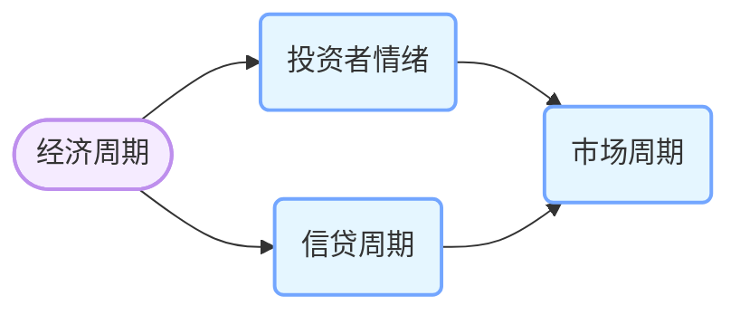

# 霍华德马克斯的市场周期判断

> 关键词：霍华德马克斯、市场周期判断、投资策略、金融市场、经济周期、风险评估、市场趋势

> 摘要：本文深入探讨了霍华德马克斯的市场周期判断理论。从背景介绍入手，明确了研究目的、预期读者等信息。详细阐述了市场周期判断的核心概念、联系以及相关算法原理，并通过数学模型和公式进行了深入分析。结合实际案例，展示了如何在项目实战中运用这些理论进行市场判断。同时，介绍了该理论在不同实际场景中的应用，推荐了相关的学习资源、开发工具框架和论文著作。最后总结了未来市场周期判断的发展趋势与挑战，并提供了常见问题解答和扩展阅读参考资料，旨在帮助读者全面理解和应用霍华德马克斯的市场周期判断理论进行投资决策。

## 1. 背景介绍 
### 1.1 目的和范围
本文旨在全面剖析霍华德马克斯的市场周期判断理论，详细介绍其核心概念、算法原理、数学模型以及实际应用。通过深入研究，帮助投资者更好地理解市场周期的规律，掌握有效的市场周期判断方法，从而制定更为合理的投资策略，降低投资风险，提高投资收益。研究范围涵盖金融市场的各个领域，包括股票市场、债券市场、房地产市场等，同时涉及宏观经济因素对市场周期的影响。

### 1.2 预期读者
本文预期读者主要包括金融投资者、投资顾问、金融分析师、经济研究人员以及对金融市场周期理论感兴趣的人士。无论是专业的金融从业者，还是希望通过学习市场周期理论提升投资能力的普通投资者，都能从本文中获取有价值的信息和知识。

### 1.3 文档结构概述
本文共分为十个部分。首先是背景介绍，阐述研究目的、预期读者和文档结构概述，并给出相关术语的定义和解释。接着介绍核心概念与联系，通过文本示意图和 Mermaid 流程图展示市场周期判断的核心原理和架构。然后详细讲解核心算法原理和具体操作步骤，使用 Python 源代码进行阐述。随后介绍数学模型和公式，并通过举例说明其应用。在项目实战部分，展示代码实际案例并进行详细解释。之后介绍该理论在实际应用场景中的应用。接着推荐相关的工具和资源，包括学习资源、开发工具框架和论文著作。最后进行总结，探讨未来发展趋势与挑战，提供常见问题解答和扩展阅读参考资料。

### 1.4 术语表
#### 1.4.1 核心术语定义
- **市场周期**：指金融市场价格和经济活动围绕长期趋势线上下波动的周期性变化过程，包括扩张期、高峰期、收缩期和低谷期四个阶段。
- **风险溢价**：投资者因承担额外风险而要求获得的超过无风险收益的额外回报。
- **投资者情绪**：投资者对市场的乐观或悲观态度，会影响市场的买卖行为和价格走势。
- **信贷周期**：指信贷市场中信贷供给和需求的周期性变化，与经济周期和市场周期密切相关。

#### 1.4.2 相关概念解释
- **经济周期**：是国民经济运行过程中出现的周期性波动，通常由宏观经济指标如 GDP、通货膨胀率、失业率等的变化来衡量。市场周期与经济周期密切相关，但并不完全同步。
- **均值回归**：指市场价格或经济指标在长期内会趋向于其历史平均值的现象。当市场价格偏离均值过大时，往往会出现向均值回归的趋势。

#### 1.4.3 缩略词列表
- **GDP**：国内生产总值（Gross Domestic Product），是衡量一个国家或地区经济活动总量的重要指标。
- **CPI**：消费者物价指数（Consumer Price Index），用于衡量居民购买的一篮子商品和服务的价格变化情况，反映通货膨胀水平。

## 2. 核心概念与联系 

### 核心概念原理
霍华德马克斯认为，市场周期主要受到经济周期、投资者情绪和信贷周期三个核心因素的影响。经济周期是市场周期的基础，宏观经济的扩张和收缩会直接影响企业的盈利水平和市场的整体估值。投资者情绪则是市场周期波动的重要放大器，当投资者普遍乐观时，会推动市场价格上涨，形成牛市；而当投资者普遍悲观时，会导致市场价格下跌，形成熊市。信贷周期则通过影响市场的资金供给和企业的融资成本，对市场周期产生重要影响。在信贷宽松时期，企业更容易获得资金，投资和消费增加，推动市场繁荣；而在信贷紧缩时期，企业融资困难，投资和消费减少，市场往往陷入衰退。

### 架构的文本示意图
```plaintext
               +----------------+
               |  经济周期      |
               +----------------+
                        |
                        v
+----------------+    +----------------+    +----------------+
|  投资者情绪    |    |  信贷周期      |    |  市场周期      |
+----------------+    +----------------+    +----------------+
```

### Mermaid 流程图


## 3. 核心算法原理 & 具体操作步骤 

### 核心算法原理
霍华德马克斯的市场周期判断并没有严格意义上的固定算法，但可以通过一些指标和方法来综合判断市场所处的周期阶段。以下是一种基于 Python 的简化示例，通过分析股票市场的市盈率（PE）和市净率（PB）来判断市场的估值水平，进而推断市场周期。

### 具体操作步骤
1. **数据获取**：从金融数据提供商获取股票市场的历史市盈率和市净率数据。
2. **数据处理**：对获取的数据进行清洗和整理，去除缺失值和异常值。
3. **计算均值和标准差**：计算历史市盈率和市净率的均值和标准差。
4. **判断市场估值水平**：根据当前的市盈率和市净率与历史均值和标准差的比较，判断市场的估值水平是高估、低估还是合理。
5. **推断市场周期阶段**：结合市场估值水平和其他因素，推断市场所处的周期阶段。

### Python 源代码
```python
import pandas as pd
import numpy as np

# 模拟获取股票市场的历史市盈率和市净率数据
data = {
    'PE': [15, 16, 17, 18, 19, 20, 21, 22, 23, 24],
    'PB': [2, 2.1, 2.2, 2.3, 2.4, 2.5, 2.6, 2.7, 2.8, 2.9]
}
df = pd.DataFrame(data)

# 计算均值和标准差
pe_mean = df['PE'].mean()
pe_std = df['PE'].std()
pb_mean = df['PB'].mean()
pb_std = df['PB'].std()

# 假设当前市盈率和市净率
current_pe = 25
current_pb = 3

# 判断市场估值水平
if current_pe > pe_mean + 1.5 * pe_std and current_pb > pb_mean + 1.5 * pb_std:
    print("市场估值高估，可能处于牛市后期")
elif current_pe < pe_mean - 1.5 * pe_std and current_pb < pb_mean - 1.5 * pb_std:
    print("市场估值低估，可能处于熊市后期")
else:
    print("市场估值合理，可能处于市场周期的中间阶段")
```

## 4. 数学模型和公式 & 详细讲解 & 举例说明 

### 数学模型和公式
#### 均值和标准差计算
均值（$\mu$）的计算公式为：
$$\mu = \frac{1}{n} \sum_{i=1}^{n} x_i$$
其中，$n$ 是数据的数量，$x_i$ 是第 $i$ 个数据点。

标准差（$\sigma$）的计算公式为：
$$\sigma = \sqrt{\frac{1}{n} \sum_{i=1}^{n} (x_i - \mu)^2}$$

#### 异常值判断
通过计算均值和标准差，可以判断数据点是否为异常值。一般来说，如果数据点 $x$ 满足 $|x - \mu| > k\sigma$（$k$ 通常取 1.5 或 2），则认为该数据点是异常值。

### 详细讲解
在市场周期判断中，均值和标准差可以用来衡量市场估值指标（如市盈率、市净率）的历史波动情况。通过计算历史数据的均值和标准差，可以确定一个正常的估值范围。当当前的估值指标超出这个范围时，就可以认为市场处于高估或低估状态。

### 举例说明
假设我们有股票市场过去 10 年的市盈率数据，计算得到均值为 18，标准差为 2。如果当前的市盈率为 22，那么 $|22 - 18| = 4$，$4 > 1.5 \times 2$，说明当前市盈率超出了正常范围，市场可能处于高估状态。

## 5. 项目实战：代码实际案例和详细解释说明 

### 5.1  开发环境搭建
- **Python 安装**：从 Python 官方网站（https://www.python.org/downloads/）下载并安装 Python 3.x 版本。
- **第三方库安装**：使用 pip 命令安装所需的第三方库，如 pandas、numpy 等。
```bash
pip install pandas numpy
```

### 5.2  源代码详细实现和代码解读
```python
import pandas as pd
import numpy as np

# 读取股票市场的历史市盈率和市净率数据
data = pd.read_csv('market_data.csv')

# 数据清洗，去除缺失值
data = data.dropna()

# 计算均值和标准差
pe_mean = data['PE'].mean()
pe_std = data['PE'].std()
pb_mean = data['PB'].mean()
pb_std = data['PB'].std()

# 获取当前市盈率和市净率
current_pe = 26
current_pb = 3.1

# 判断市场估值水平
if current_pe > pe_mean + 1.5 * pe_std and current_pb > pb_mean + 1.5 * pb_std:
    market_status = "市场估值高估，可能处于牛市后期"
elif current_pe < pe_mean - 1.5 * pe_std and current_pb < pb_mean - 1.5 * pb_std:
    market_status = "市场估值低估，可能处于熊市后期"
else:
    market_status = "市场估值合理，可能处于市场周期的中间阶段"

print(market_status)
```

### 代码解读与分析
1. **数据读取**：使用 `pandas` 库的 `read_csv` 函数读取存储在 `market_data.csv` 文件中的股票市场历史市盈率和市净率数据。
2. **数据清洗**：使用 `dropna` 方法去除数据中的缺失值，确保数据的完整性。
3. **计算均值和标准差**：使用 `mean` 和 `std` 方法分别计算市盈率和市净率的均值和标准差。
4. **获取当前估值指标**：假设当前市盈率为 26，市净率为 3.1。
5. **判断市场估值水平**：根据当前的市盈率和市净率与历史均值和标准差的比较，判断市场的估值水平，并输出相应的结论。

## 6. 实际应用场景 
### 股票投资
投资者可以根据市场周期判断来调整股票投资组合。在市场处于低估阶段时，增加股票投资比例，以获取更高的潜在收益；在市场处于高估阶段时，减少股票投资比例，降低投资风险。

### 债券投资
市场周期对债券市场也有影响。在经济衰退期，市场利率通常会下降，债券价格上涨，投资者可以适当增加债券投资；在经济扩张期，市场利率可能上升，债券价格下跌，投资者可以减少债券投资。

### 房地产投资
房地产市场也存在周期波动。在市场周期的低谷期，房地产价格相对较低，投资者可以考虑购买房产；在市场周期的高峰期，房地产价格可能过高，投资者可以选择出售房产或持币观望。

### 资产配置
通过对市场周期的判断，投资者可以合理调整不同资产的配置比例，实现资产的多元化和风险的分散。例如，在市场周期的不同阶段，合理分配股票、债券、现金等资产的比例。

## 7. 工具和资源推荐
### 7.1 学习资源推荐
#### 7.1.1 书籍推荐
- 《周期》（霍华德·马克斯著）：本书是霍华德马克斯关于市场周期理论的经典著作，深入阐述了市场周期的本质、影响因素和判断方法。
- 《聪明的投资者》（本杰明·格雷厄姆著）：价值投资领域的经典之作，介绍了投资的基本原则和方法，对市场周期判断也有一定的启示。
- 《金融炼金术》（乔治·索罗斯著）：作者通过自己的投资实践，阐述了市场的反身性原理和市场周期的波动规律。

#### 7.1.2 在线课程
- Coursera 上的“Financial Markets”课程：由耶鲁大学教授罗伯特·席勒讲授，介绍了金融市场的基本原理和市场周期的相关知识。
- edX 上的“Investment Management”课程：提供了投资管理的全面知识，包括市场周期分析和投资策略制定。

#### 7.1.3 技术博客和网站
- 雪球网（https://xueqiu.com/）：国内知名的财经社区，提供了丰富的市场分析和投资策略分享。
- Seeking Alpha（https://seekingalpha.com/）：美国的财经网站，提供全球金融市场的分析和评论。

### 7.2 开发工具框架推荐
#### 7.2.1 IDE和编辑器
- PyCharm：一款专业的 Python 集成开发环境，提供了丰富的代码编辑、调试和项目管理功能。
- Jupyter Notebook：交互式的编程环境，适合进行数据分析和代码演示。

#### 7.2.2 调试和性能分析工具
- pdb：Python 内置的调试器，可以帮助开发者定位代码中的问题。
- cProfile：Python 的性能分析工具，可以分析代码的运行时间和函数调用情况。

#### 7.2.3 相关框架和库
- pandas：强大的数据处理和分析库，提供了丰富的数据结构和数据操作方法。
- numpy：用于科学计算的基础库，提供了高效的数组操作和数学函数。

### 7.3 相关论文著作推荐
#### 7.3.1 经典论文
- Eugene F. Fama 的“Efficient Capital Markets: A Review of Theory and Empirical Work”：提出了有效市场假说，对市场周期和投资理论产生了深远影响。
- Robert J. Shiller 的“Stock Prices, Earnings, and Expected Dividends”：研究了股票价格与盈利和股息的关系，为市场周期分析提供了重要的理论基础。

#### 7.3.2 最新研究成果
- 通过学术数据库（如知网、Web of Science 等）搜索关于市场周期判断和投资策略的最新研究论文，了解该领域的前沿动态。

#### 7.3.3 应用案例分析
- 一些金融研究机构和咨询公司会发布市场周期分析和投资策略的应用案例报告，可以通过相关网站或报告平台获取。

## 8. 总结：未来发展趋势与挑战
### 未来发展趋势
- **数据驱动的分析方法**：随着金融数据的不断丰富和大数据技术的发展，未来市场周期判断将更加依赖于数据驱动的分析方法。通过挖掘海量的金融数据，可以发现更多的市场规律和趋势。
- **人工智能和机器学习的应用**：人工智能和机器学习技术将在市场周期判断中发挥越来越重要的作用。例如，使用深度学习算法对市场数据进行建模和预测，提高市场周期判断的准确性和效率。
- **跨市场和跨领域的综合分析**：市场之间的关联性越来越强，未来的市场周期判断将不仅仅局限于单一市场，而是需要进行跨市场和跨领域的综合分析。例如，考虑股票市场、债券市场、商品市场和宏观经济因素之间的相互影响。

### 挑战
- **市场不确定性增加**：全球政治、经济环境的不确定性增加，如贸易摩擦、地缘政治冲突等，给市场周期判断带来了更大的挑战。市场的波动可能更加剧烈和难以预测。
- **数据质量和隐私问题**：数据驱动的分析方法依赖于高质量的数据，但数据质量和隐私问题可能会影响分析结果的准确性和可靠性。如何获取准确、完整、及时的数据，并保护数据隐私是一个重要的挑战。
- **模型的局限性**：现有的市场周期判断模型和方法都存在一定的局限性，无法完全准确地预测市场的未来走势。如何不断改进和完善模型，提高模型的适应性和预测能力是一个长期的挑战。

## 9. 附录：常见问题与解答
### 问题 1：市场周期判断的准确性有多高？
市场周期判断是一个复杂的过程，受到多种因素的影响，因此无法保证判断的绝对准确性。但通过综合运用多种指标和方法，结合对市场的深入分析和经验积累，可以提高判断的准确性。

### 问题 2：如何获取准确的市场数据？
可以通过金融数据提供商（如 Wind、Bloomberg 等）、证券交易所网站、政府部门发布的统计数据等渠道获取市场数据。同时，要注意数据的来源和质量，对数据进行清洗和验证。

### 问题 3：市场周期判断只适用于股票市场吗？
不是的，市场周期判断理论适用于各种金融市场，包括股票市场、债券市场、房地产市场、商品市场等。不同市场的周期波动可能存在差异，但基本原理是相似的。

### 问题 4：如何结合市场周期判断制定投资策略？
在市场处于低估阶段时，可以采取积极的投资策略，增加股票、房地产等资产的投资比例；在市场处于高估阶段时，可以采取保守的投资策略，减少高风险资产的投资比例，增加现金、债券等资产的配置。同时，要根据自己的风险承受能力和投资目标进行合理的资产配置。

## 10. 扩展阅读 & 参考资料
- 《投资最重要的事》（霍华德·马克斯著）
- 《漫步华尔街》（伯顿·马尔基尔著）
- 财经杂志（如《财新》《财经》等）
- 金融学术期刊（如《金融研究》《经济学季刊》等）

作者：AI天才研究院/AI Genius Institute & 禅与计算机程序设计艺术 /Zen And The Art of Computer Programming