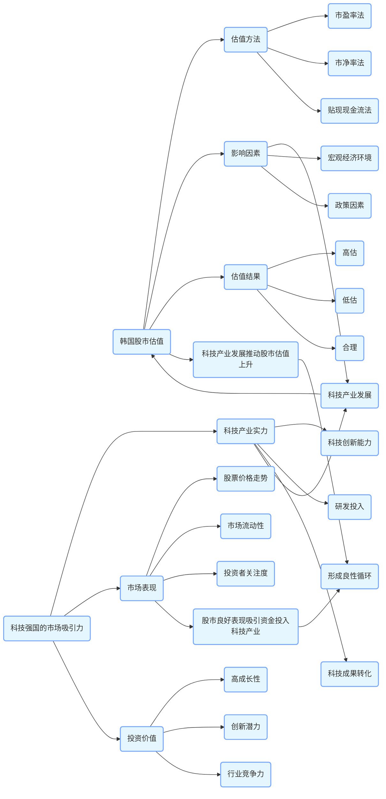

# 韩国股市估值:科技强国的市场吸引力

> 关键词：韩国股市估值、科技强国、市场吸引力、科技股、金融分析

> 摘要：本文聚焦于韩国股市估值，深入探讨作为科技强国的韩国其股市所具备的市场吸引力。首先介绍相关背景知识，包括目的、预期读者、文档结构和术语表。接着阐述核心概念及联系，分析核心算法原理与操作步骤，结合数学模型和公式进行讲解并举例。通过项目实战给出代码案例及详细解释，探讨实际应用场景。推荐相关工具和资源，最后总结韩国股市估值的未来发展趋势与挑战，提供常见问题解答和扩展阅读参考资料，全面剖析韩国股市在科技实力支撑下的估值情况及投资价值。

## 1. 背景介绍 
### 1.1 目的和范围
本文旨在全面分析韩国股市的估值情况，探究其作为科技强国背景下股市所展现出的市场吸引力。研究范围涵盖韩国股市的整体估值指标、科技板块在其中的作用、影响估值的因素以及与其他国家股市的对比等方面。通过对这些内容的研究，为投资者、金融从业者以及对韩国经济和股市感兴趣的人士提供深入的分析和参考，帮助他们更好地了解韩国股市的投资价值和潜在风险。

### 1.2 预期读者
本文的预期读者主要包括以下几类人群：
- **投资者**：无论是个人投资者还是机构投资者，都可以从本文中获取关于韩国股市估值的信息，辅助他们做出投资决策，判断韩国股市是否具有投资吸引力。
- **金融从业者**：如证券分析师、基金经理等，他们可以通过本文深入了解韩国股市的特点和估值逻辑，为其研究和工作提供参考。
- **经济研究人员**：对韩国经济和金融市场感兴趣的研究人员，可以从本文中获取相关数据和分析，进一步开展学术研究。
- **企业管理者**：特别是科技企业的管理者，了解韩国股市的估值情况有助于他们了解行业竞争态势和市场环境，为企业的战略决策提供参考。

### 1.3 文档结构概述
本文将按照以下结构展开：
- 核心概念与联系：介绍与韩国股市估值和市场吸引力相关的核心概念，并通过文本示意图和 Mermaid 流程图展示它们之间的联系。
- 核心算法原理 & 具体操作步骤：讲解用于评估韩国股市估值的核心算法原理，并给出具体的操作步骤，同时使用 Python 源代码进行详细阐述。
- 数学模型和公式 & 详细讲解 & 举例说明：介绍相关的数学模型和公式，对其进行详细讲解，并通过具体例子说明如何应用这些模型和公式进行估值分析。
- 项目实战：代码实际案例和详细解释说明：通过实际的代码案例，展示如何在项目中应用前面介绍的算法和模型进行韩国股市估值分析，并对代码进行详细解读。
- 实际应用场景：探讨韩国股市估值在不同场景下的实际应用，如投资决策、风险评估等。
- 工具和资源推荐：推荐一些学习和研究韩国股市估值的工具和资源，包括书籍、在线课程、技术博客和网站等。
- 总结：未来发展趋势与挑战：总结韩国股市估值的未来发展趋势，并分析可能面临的挑战。
- 附录：常见问题与解答：解答一些关于韩国股市估值的常见问题。
- 扩展阅读 & 参考资料：提供一些扩展阅读的建议和相关的参考资料。

### 1.4 术语表
#### 1.4.1 核心术语定义
- **股市估值**：指对股票市场整体或个别股票的价值进行评估的过程和结果。常用的估值指标包括市盈率（P/E）、市净率（P/B）、股息率等。
- **科技强国**：指在科技领域具有强大实力和竞争力的国家，通常表现为在科技创新、研发投入、科技成果转化等方面处于领先地位。
- **市场吸引力**：指市场对投资者、企业等参与者的吸引程度，通常与市场的估值水平、发展潜力、稳定性等因素有关。
- **市盈率（P/E）**：指股票价格与每股收益的比率，反映了投资者为获取每一元收益所愿意支付的价格。
- **市净率（P/B）**：指股票价格与每股净资产的比率，反映了投资者为获取每一元净资产所愿意支付的价格。

#### 1.4.2 相关概念解释
- **科技股**：指与科技行业相关的股票，包括信息技术、生物技术、新能源等领域的企业股票。科技股通常具有较高的成长性和创新性，但也伴随着较高的风险。
- **估值溢价**：指股票或市场的估值水平高于其历史平均水平或同行业其他股票的估值水平。估值溢价可能反映了市场对该股票或市场的乐观预期。
- **估值折价**：指股票或市场的估值水平低于其历史平均水平或同行业其他股票的估值水平。估值折价可能反映了市场对该股票或市场的悲观预期。

#### 1.4.3 缩略词列表
- **P/E**：市盈率（Price-to-Earnings Ratio）
- **P/B**：市净率（Price-to-Book Ratio）
- **ROE**：净资产收益率（Return on Equity）
- **GDP**：国内生产总值（Gross Domestic Product）

## 2. 核心概念与联系 

### 核心概念原理
#### 韩国股市估值
韩国股市估值是对韩国股票市场整体或个别股票的价值进行评估的过程。估值的核心在于确定股票的内在价值，并将其与当前市场价格进行比较，以判断股票是否被高估或低估。常用的估值方法包括基于盈利的估值方法（如市盈率法）、基于资产的估值方法（如市净率法）和基于现金流的估值方法（如贴现现金流法）等。

#### 科技强国的市场吸引力
韩国作为科技强国，其在科技领域的强大实力为股市带来了独特的市场吸引力。科技产业的创新能力和高成长性使得韩国股市中的科技股具有较高的投资价值。此外，科技强国的地位还吸引了全球投资者的关注，增加了市场的流动性和活跃度。

#### 两者的联系
韩国作为科技强国，其科技产业的发展状况直接影响着股市的估值。科技企业的高盈利增长预期往往会导致其股票获得较高的估值溢价，从而推动整个股市估值水平的上升。同时，股市的良好表现也会吸引更多的资金投入科技产业，促进科技产业的进一步发展，形成良性循环。

### 架构的文本示意图
```plaintext
韩国股市估值
├── 估值方法
│   ├── 市盈率法
│   ├── 市净率法
│   └── 贴现现金流法
├── 影响因素
│   ├── 科技产业发展
│   ├── 宏观经济环境
│   └── 政策因素
└── 估值结果
    ├── 高估
    ├── 低估
    └── 合理

科技强国的市场吸引力
├── 科技产业实力
│   ├── 科技创新能力
│   ├── 研发投入
│   └── 科技成果转化
├── 市场表现
│   ├── 股票价格走势
│   ├── 市场流动性
│   └── 投资者关注度
└── 投资价值
    ├── 高成长性
    ├── 创新潜力
    └── 行业竞争力

两者联系
├── 科技产业发展推动股市估值上升
├── 股市良好表现吸引资金投入科技产业
└── 形成良性循环
```

### Mermaid 流程图


## 3. 核心算法原理 & 具体操作步骤 

### 市盈率法
#### 算法原理
市盈率法是一种基于盈利的估值方法，其基本原理是通过将股票价格除以每股收益（EPS）来计算市盈率（P/E），并将该市盈率与同行业其他股票或市场平均市盈率进行比较，以判断股票是否被高估或低估。计算公式为：
$$P/E = \frac{股价}{每股收益}$$

#### 具体操作步骤
1. 获取股票的当前价格和每股收益数据。
2. 计算该股票的市盈率。
3. 收集同行业其他股票或市场平均市盈率数据。
4. 将该股票的市盈率与同行业其他股票或市场平均市盈率进行比较。
5. 如果该股票的市盈率高于同行业其他股票或市场平均市盈率，则认为该股票被高估；反之，则认为该股票被低估。

#### Python 源代码实现
```python
# 定义股票价格和每股收益
stock_price = 100
eps = 5

# 计算市盈率
pe_ratio = stock_price / eps

# 假设同行业平均市盈率为 20
industry_avg_pe = 20

# 判断股票是否被高估或低估
if pe_ratio > industry_avg_pe:
    print("该股票被高估")
elif pe_ratio < industry_avg_pe:
    print("该股票被低估")
else:
    print("该股票估值合理")
```

### 市净率法
#### 算法原理
市净率法是一种基于资产的估值方法，其基本原理是通过将股票价格除以每股净资产（BVPS）来计算市净率（P/B），并将该市净率与同行业其他股票或市场平均市净率进行比较，以判断股票是否被高估或低估。计算公式为：
$$P/B = \frac{股价}{每股净资产}$$

#### 具体操作步骤
1. 获取股票的当前价格和每股净资产数据。
2. 计算该股票的市净率。
3. 收集同行业其他股票或市场平均市净率数据。
4. 将该股票的市净率与同行业其他股票或市场平均市净率进行比较。
5. 如果该股票的市净率高于同行业其他股票或市场平均市净率，则认为该股票被高估；反之，则认为该股票被低估。

#### Python 源代码实现
```python
# 定义股票价格和每股净资产
stock_price = 100
bvps = 20

# 计算市净率
pb_ratio = stock_price / bvps

# 假设同行业平均市净率为 3
industry_avg_pb = 3

# 判断股票是否被高估或低估
if pb_ratio > industry_avg_pb:
    print("该股票被高估")
elif pb_ratio < industry_avg_pb:
    print("该股票被低估")
else:
    print("该股票估值合理")
```

### 贴现现金流法
#### 算法原理
贴现现金流法是一种基于现金流的估值方法，其基本原理是将未来各期的现金流按照一定的贴现率折现到当前时点，得到股票的内在价值，并将该内在价值与当前市场价格进行比较，以判断股票是否被高估或低估。计算公式为：
$$V = \sum_{t=1}^{n} \frac{CF_t}{(1 + r)^t}$$
其中，$V$ 为股票的内在价值，$CF_t$ 为第 $t$ 期的现金流，$r$ 为贴现率，$n$ 为现金流的期数。

#### 具体操作步骤
1. 预测未来各期的现金流。
2. 确定贴现率。
3. 将未来各期的现金流按照贴现率折现到当前时点，计算股票的内在价值。
4. 将股票的内在价值与当前市场价格进行比较。
5. 如果股票的内在价值高于当前市场价格，则认为该股票被低估；反之，则认为该股票被高估。

#### Python 源代码实现
```python
import numpy as np

# 预测未来 5 年的现金流
cash_flows = [10, 12, 15, 18, 20]

# 确定贴现率
discount_rate = 0.1

# 计算股票的内在价值
present_values = []
for i, cf in enumerate(cash_flows):
    pv = cf / (1 + discount_rate) ** (i + 1)
    present_values.append(pv)

intrinsic_value = np.sum(present_values)

# 假设当前市场价格为 50
market_price = 50

# 判断股票是否被高估或低估
if intrinsic_value > market_price:
    print("该股票被低估")
elif intrinsic_value < market_price:
    print("该股票被高估")
else:
    print("该股票估值合理")
```

## 4. 数学模型和公式 & 详细讲解 & 举例说明 

### 市盈率模型
#### 公式
$$P/E = \frac{股价}{每股收益}$$

#### 详细讲解
市盈率模型是一种简单直观的估值方法，它反映了投资者为获取每一元收益所愿意支付的价格。一般来说，市盈率越高，说明投资者对该股票的未来盈利增长预期越高，但同时也意味着股票的风险相对较大；市盈率越低，说明投资者对该股票的未来盈利增长预期越低，但同时也意味着股票的风险相对较小。

#### 举例说明
假设某股票的当前价格为 100 元，每股收益为 5 元，则该股票的市盈率为：
$$P/E = \frac{100}{5} = 20$$
如果同行业其他股票的平均市盈率为 15，则说明该股票的估值相对较高，可能存在一定的高估风险。

### 市净率模型
#### 公式
$$P/B = \frac{股价}{每股净资产}$$

#### 详细讲解
市净率模型是一种基于资产的估值方法，它反映了投资者为获取每一元净资产所愿意支付的价格。一般来说，市净率越高，说明投资者对该股票的未来盈利能力和资产质量预期越高，但同时也意味着股票的风险相对较大；市净率越低，说明投资者对该股票的未来盈利能力和资产质量预期越低，但同时也意味着股票的风险相对较小。

#### 举例说明
假设某股票的当前价格为 100 元，每股净资产为 20 元，则该股票的市净率为：
$$P/B = \frac{100}{20} = 5$$
如果同行业其他股票的平均市净率为 3，则说明该股票的估值相对较高，可能存在一定的高估风险。

### 贴现现金流模型
#### 公式
$$V = \sum_{t=1}^{n} \frac{CF_t}{(1 + r)^t}$$

#### 详细讲解
贴现现金流模型是一种基于现金流的估值方法，它考虑了资金的时间价值，通过将未来各期的现金流按照一定的贴现率折现到当前时点，得到股票的内在价值。贴现率的选择是该模型的关键，它反映了投资者对资金的时间价值和风险的预期。一般来说，贴现率越高，说明投资者对资金的时间价值和风险的预期越高，股票的内在价值越低；贴现率越低，说明投资者对资金的时间价值和风险的预期越低，股票的内在价值越高。

#### 举例说明
假设某股票未来 5 年的现金流分别为 10 元、12 元、15 元、18 元和 20 元，贴现率为 10%，则该股票的内在价值为：
$$V = \frac{10}{(1 + 0.1)^1} + \frac{12}{(1 + 0.1)^2} + \frac{15}{(1 + 0.1)^3} + \frac{18}{(1 + 0.1)^4} + \frac{20}{(1 + 0.1)^5} \approx 52.38$$
如果该股票的当前市场价格为 50 元，则说明该股票的估值相对较低，可能存在一定的投资价值。

## 5. 项目实战：代码实际案例和详细解释说明 

### 5.1  开发环境搭建
#### 安装 Python
首先，需要安装 Python 环境。可以从 Python 官方网站（https://www.python.org/downloads/）下载适合自己操作系统的 Python 安装包，并按照安装向导进行安装。

#### 安装必要的库
在进行韩国股市估值分析时，需要使用一些 Python 库，如 Pandas、Numpy、Matplotlib 等。可以使用以下命令进行安装：
```sh
pip install pandas numpy matplotlib
```

### 5.2  源代码详细实现和代码解读
以下是一个使用市盈率法对韩国某科技股进行估值分析的代码示例：
```python
import pandas as pd
import matplotlib.pyplot as plt

# 模拟获取韩国某科技股的历史股价和每股收益数据
data = {
    'date': ['2020-01-01', '2020-02-01', '2020-03-01', '2020-04-01', '2020-05-01'],
    'stock_price': [100, 110, 120, 130, 140],
    'eps': [5, 5.5, 6, 6.5, 7]
}
df = pd.DataFrame(data)

# 计算市盈率
df['pe_ratio'] = df['stock_price'] / df['eps']

# 假设同行业平均市盈率为 20
industry_avg_pe = 20

# 判断股票是否被高估或低估
df['valuation'] = ['高估' if pe > industry_avg_pe else '低估' if pe < industry_avg_pe else '合理' for pe in df['pe_ratio']]

# 绘制市盈率走势图
plt.figure(figsize=(10, 6))
plt.plot(df['date'], df['pe_ratio'], label='PE Ratio')
plt.axhline(y=industry_avg_pe, color='r', linestyle='--', label='Industry Average PE')
plt.xlabel('Date')
plt.ylabel('PE Ratio')
plt.title('PE Ratio Trend of Korean Tech Stock')
plt.legend()
plt.xticks(rotation=45)
plt.show()

# 输出估值结果
print(df[['date', 'stock_price', 'eps', 'pe_ratio', 'valuation']])
```

### 5.3  代码解读与分析
#### 数据获取
通过模拟数据的方式获取韩国某科技股的历史股价和每股收益数据，并将其存储在 Pandas DataFrame 中。

#### 市盈率计算
使用 DataFrame 的列操作计算每股股票的市盈率，并将结果存储在新的列 `pe_ratio` 中。

#### 估值判断
根据计算得到的市盈率与同行业平均市盈率进行比较，判断股票是否被高估、低估或合理，并将结果存储在新的列 `valuation` 中。

#### 可视化分析
使用 Matplotlib 库绘制市盈率走势图，直观展示股票市盈率的变化趋势，并与同行业平均市盈率进行对比。

#### 结果输出
输出包含日期、股价、每股收益、市盈率和估值结果的 DataFrame，方便查看和分析。

## 6. 实际应用场景 
### 投资决策
投资者可以通过分析韩国股市的估值情况，选择具有投资价值的股票。如果某只股票的估值被低估，投资者可以考虑买入；如果某只股票的估值被高估，投资者可以考虑卖出或避免买入。

### 风险评估
估值分析可以帮助投资者评估股票的风险水平。如果某只股票的估值过高，可能存在较大的下跌风险；如果某只股票的估值过低，可能存在被市场忽视的风险。

### 行业比较
通过比较不同行业的估值水平，投资者可以了解各个行业的发展前景和市场预期。估值较高的行业可能具有较高的成长性和创新性，但也伴随着较高的风险；估值较低的行业可能具有较低的成长性和创新性，但也可能存在被低估的投资机会。

### 宏观经济分析
韩国股市的估值情况可以反映宏观经济的发展状况。如果股市估值整体较高，可能意味着市场对宏观经济的预期较为乐观；如果股市估值整体较低，可能意味着市场对宏观经济的预期较为悲观。

## 7. 工具和资源推荐
### 7.1 学习资源推荐
#### 7.1.1 书籍推荐
- 《证券分析》（Security Analysis）：由本杰明·格雷厄姆（Benjamin Graham）和戴维·多德（David Dodd）所著，是价值投资领域的经典著作，介绍了股票估值的基本方法和理论。
- 《聪明的投资者》（The Intelligent Investor）：同样由本杰明·格雷厄姆所著，是一本面向普通投资者的投资指南，强调了价值投资的重要性和方法。
- 《估值：难点、解决方案及相关案例》（Valuation: Measuring and Managing the Value of Companies）：由蒂姆·科勒（Tim Koller）、马克·戈德哈特（Marc Goedhart）和戴维·韦塞尔（David Wessels）所著，详细介绍了企业估值的各种方法和技巧。

#### 7.1.2 在线课程
- Coursera 上的“投资学原理”（Principles of Investing）课程：由宾夕法尼亚大学沃顿商学院的教授授课，介绍了投资的基本原理和方法，包括股票估值、资产配置等内容。
- edX 上的“金融市场”（Financial Markets）课程：由耶鲁大学的教授授课，深入探讨了金融市场的运作机制和投资策略，对股票估值有详细的讲解。

#### 7.1.3 技术博客和网站
- Seeking Alpha：是一个提供股票分析和投资建议的网站，有很多专业的分析师和投资者分享对韩国股市和其他市场的分析和观点。
- Bloomberg：是全球知名的金融信息提供商，提供实时的股票行情、财经新闻和分析报告，对韩国股市的报道较为全面。

### 7.2 开发工具框架推荐
#### 7.2.1 IDE和编辑器
- PyCharm：是一款专业的 Python 集成开发环境，具有代码编辑、调试、版本控制等功能，适合进行数据分析和机器学习项目的开发。
- Jupyter Notebook：是一个交互式的开发环境，支持 Python、R 等多种编程语言，方便进行数据探索和可视化分析。

#### 7.2.2 调试和性能分析工具
- PDB：是 Python 自带的调试工具，可以帮助开发者在代码中设置断点、单步执行代码，方便查找和解决问题。
- cProfile：是 Python 自带的性能分析工具，可以分析代码的执行时间和函数调用情况，帮助开发者优化代码性能。

#### 7.2.3 相关框架和库
- Pandas：是一个强大的数据处理和分析库，提供了 DataFrame 和 Series 等数据结构，方便进行数据清洗、转换和分析。
- Numpy：是一个用于科学计算的库，提供了多维数组和矩阵运算等功能，是很多数据分析和机器学习库的基础。
- Matplotlib：是一个用于数据可视化的库，提供了多种绘图功能，如折线图、柱状图、散点图等，方便展示数据和分析结果。

### 7.3 相关论文著作推荐
#### 7.3.1 经典论文
- “The Capital Asset Pricing Model: Theory and Evidence”：由 Eugene F. Fama 和 Kenneth R. French 所著，是资本资产定价模型领域的经典论文，对股票估值和投资组合理论有重要的影响。
- “Market Efficiency, Long-Term Returns, and Behavioral Finance”：由 Eugene F. Fama 所著，探讨了市场效率和行为金融学的相关问题，对股票估值和投资决策有一定的启示。

#### 7.3.2 最新研究成果
- 可以关注《Journal of Finance》、《Review of Financial Studies》等金融领域的顶级学术期刊，获取关于韩国股市估值和相关领域的最新研究成果。

#### 7.3.3 应用案例分析
- 可以参考一些金融机构和研究机构发布的关于韩国股市的研究报告和分析案例，了解实际应用中如何进行韩国股市估值和投资决策。

## 8. 总结：未来发展趋势与挑战
### 未来发展趋势
#### 科技产业持续推动
韩国作为科技强国，其科技产业将继续保持快速发展的态势。随着 5G、人工智能、半导体等领域的不断创新和突破，韩国股市中的科技股有望继续获得较高的估值溢价，推动整个股市估值水平的上升。

#### 国际化程度提高
韩国股市的国际化程度将不断提高，吸引更多的全球投资者参与。随着韩国金融市场的开放和改革，外资流入韩国股市的规模有望进一步扩大，增加市场的流动性和活跃度，提升韩国股市的国际影响力。

#### 绿色金融兴起
随着全球对环境保护和可持续发展的关注度不断提高，绿色金融将成为韩国股市的一个重要发展方向。韩国政府和企业将加大对清洁能源、环保技术等领域的投资和支持，相关企业的股票有望获得市场的青睐，推动韩国股市的绿色转型。

### 挑战
#### 全球经济不确定性
全球经济的不确定性是韩国股市面临的主要挑战之一。贸易摩擦、地缘政治风险、疫情等因素可能导致全球经济增长放缓，影响韩国的出口和经济发展，进而对韩国股市的估值产生负面影响。

#### 科技竞争加剧
随着全球科技竞争的加剧，韩国科技产业面临着来自其他国家和地区的激烈竞争。如果韩国科技企业不能保持创新能力和竞争力，可能会导致其市场份额下降，盈利增长放缓，从而影响其股票的估值。

#### 金融市场波动
金融市场的波动也是韩国股市面临的挑战之一。利率变动、汇率波动、货币政策调整等因素可能导致金融市场的不稳定，增加投资者的风险偏好和市场的不确定性，对韩国股市的估值产生不利影响。

## 9. 附录：常见问题与解答
### 问题 1：韩国股市估值与其他国家股市估值有何不同？
解答：韩国股市估值与其他国家股市估值的不同主要体现在以下几个方面：
- 产业结构：韩国的科技产业较为发达，科技股在股市中所占的比重较大，因此韩国股市的估值可能受到科技产业发展的影响较大。
- 宏观经济环境：韩国的经济增长模式和宏观经济政策与其他国家可能存在差异，这也会影响韩国股市的估值水平。
- 投资者结构：韩国股市的投资者结构可能与其他国家不同，外资在韩国股市中的占比相对较高，这也会对韩国股市的估值产生一定的影响。

### 问题 2：如何判断韩国股市的估值是否合理？
解答：判断韩国股市的估值是否合理可以从以下几个方面入手：
- 与历史估值比较：可以将当前的韩国股市估值与历史估值进行比较，了解其估值水平的变化趋势。
- 与同行业比较：可以将韩国股市中各行业的估值与全球同行业的估值进行比较，了解其在全球市场中的相对估值水平。
- 考虑宏观经济因素：需要考虑韩国的宏观经济状况、利率水平、通货膨胀率等因素对股市估值的影响。

### 问题 3：韩国股市中的科技股估值是否过高？
解答：韩国股市中的科技股估值是否过高需要综合考虑多个因素。一方面，韩国的科技产业具有较高的创新性和成长性，科技股的高估值可能反映了市场对其未来盈利增长的预期。另一方面，如果科技股的估值过高，可能存在一定的泡沫风险，需要投资者谨慎判断。可以通过比较科技股的市盈率、市净率等估值指标与同行业其他股票或市场平均水平，以及分析科技企业的基本面和发展前景等方式来评估科技股的估值是否合理。

## 10. 扩展阅读 & 参考资料
### 扩展阅读
- 《韩国经济的崛起与挑战》：深入了解韩国经济的发展历程和面临的挑战，有助于更好地理解韩国股市的估值情况。
- 《科技产业与金融市场》：探讨科技产业与金融市场之间的相互关系，对分析韩国股市中科技股的估值有一定的帮助。

### 参考资料
- 韩国证券交易所官方网站：提供韩国股市的实时行情、上市公司信息等数据。
- 韩国央行官方网站：提供韩国的宏观经济数据和货币政策信息。
- 国际货币基金组织（IMF）和世界银行的相关报告：提供全球和韩国的经济数据和分析报告。

作者：AI天才研究院/AI Genius Institute & 禅与计算机程序设计艺术 /Zen And The Art of Computer Programming