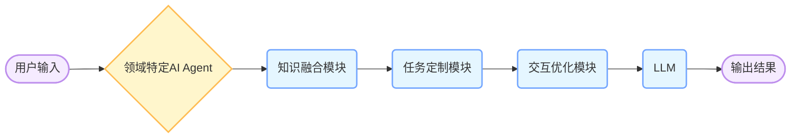

# 领域特定AI Agent：LLM在垂直行业的深度应用

> 关键词：领域特定AI Agent、大语言模型（LLM）、垂直行业、深度应用、人工智能

> 摘要：本文聚焦于领域特定AI Agent在垂直行业的深度应用，深入探讨了其核心概念、算法原理、数学模型等方面。通过详细的代码案例和分析，展示了如何将大语言模型（LLM）应用于具体的垂直行业场景。同时，介绍了实际应用场景、相关工具和资源，并对未来发展趋势与挑战进行了总结。旨在为相关领域的研究人员和开发者提供全面且深入的技术参考，推动领域特定AI Agent在垂直行业的广泛应用和发展。

## 1. 背景介绍 
### 1.1 目的和范围
随着人工智能技术的飞速发展，大语言模型（LLM）如GPT系列、文心一言等展现出了强大的语言理解和生成能力。然而，通用的大语言模型在处理特定垂直行业的复杂任务时，往往无法满足精准、高效的需求。领域特定AI Agent的出现，为解决这一问题提供了新的思路。本文章的目的在于深入剖析领域特定AI Agent如何将LLM应用于垂直行业，详细探讨其技术原理、实现方法以及实际应用效果。范围涵盖了多个垂直行业，如医疗、金融、教育等，旨在为不同行业的从业者和技术爱好者提供有价值的参考。

### 1.2 预期读者
本文预期读者包括人工智能领域的研究人员、软件开发者、垂直行业的从业者以及对领域特定AI Agent和LLM应用感兴趣的技术爱好者。无论是希望深入了解相关技术原理的专业人士，还是想要探索如何将AI技术应用于自身行业的从业者，都能从本文中获得有价值的信息。

### 1.3 文档结构概述
本文将按照以下结构展开：首先介绍核心概念与联系，包括领域特定AI Agent和LLM的基本原理和架构；接着详细阐述核心算法原理和具体操作步骤，并结合Python源代码进行说明；然后介绍数学模型和公式，通过具体例子进行详细讲解；之后通过项目实战展示代码实际案例并进行详细解释；再探讨实际应用场景；随后推荐相关的工具和资源；最后总结未来发展趋势与挑战，并提供常见问题与解答以及扩展阅读和参考资料。

### 1.4 术语表
#### 1.4.1 核心术语定义
- **领域特定AI Agent**：是一种专门为特定垂直行业设计的人工智能代理，它结合了大语言模型（LLM）的能力，能够理解和处理该行业的特定任务和知识。
- **大语言模型（LLM）**：是一种基于深度学习的语言模型，通过在大规模文本数据上进行训练，能够生成自然语言文本、理解语义等。
- **垂直行业**：指的是特定的行业领域，如医疗、金融、教育等，每个行业都有其独特的业务流程、知识体系和需求。

#### 1.4.2 相关概念解释
- **知识图谱**：是一种语义网络，用于表示实体之间的关系和知识，在领域特定AI Agent中可以用于存储和管理行业知识。
- **强化学习**：是一种机器学习方法，通过智能体与环境进行交互，根据环境反馈的奖励信号来学习最优策略，可用于优化领域特定AI Agent的决策过程。

#### 1.4.3 缩略词列表
- **LLM**：Large Language Model（大语言模型）
- **AI**：Artificial Intelligence（人工智能）

## 2. 核心概念与联系 
### 2.1 领域特定AI Agent的原理
领域特定AI Agent的核心目标是将大语言模型（LLM）的通用能力与特定垂直行业的知识和需求相结合。其原理主要包括以下几个方面：
- **知识融合**：将垂直行业的专业知识，如行业术语、业务规则、案例数据等，融入到LLM中，使模型能够更好地理解和处理行业相关的任务。
- **任务定制**：根据垂直行业的具体任务，对LLM进行定制化训练，使其能够生成符合行业要求的输出。例如，在医疗行业中，生成准确的诊断建议；在金融行业中，进行风险评估和投资建议。
- **交互优化**：通过优化与用户的交互方式，提高领域特定AI Agent的可用性和用户体验。例如，采用自然语言对话的方式，让用户能够更方便地与Agent进行沟通。

### 2.2 领域特定AI Agent与LLM的架构关系
领域特定AI Agent通常基于LLM构建，其架构关系可以用以下示意图表示：



从图中可以看出，用户输入首先进入领域特定AI Agent，经过知识融合模块将行业知识融入到输入中，然后通过任务定制模块对任务进行定制化处理，再经过交互优化模块优化交互方式，最后将处理后的输入传递给LLM进行处理，得到输出结果。

### 2.3 核心概念的联系
领域特定AI Agent、LLM和垂直行业之间存在着紧密的联系。LLM为领域特定AI Agent提供了强大的语言处理能力，而领域特定AI Agent则通过知识融合和任务定制，将LLM的能力应用到具体的垂直行业中。垂直行业的需求和知识又为领域特定AI Agent的训练和优化提供了方向和数据支持。这种相互联系和协作，使得领域特定AI Agent能够在垂直行业中发挥出更大的作用。

## 3. 核心算法原理 & 具体操作步骤 
### 3.1 核心算法原理
领域特定AI Agent的核心算法主要包括知识融合算法、任务定制算法和交互优化算法。下面分别进行详细介绍。

#### 3.1.1 知识融合算法
知识融合算法的目标是将垂直行业的专业知识融入到LLM中。一种常用的方法是基于知识图谱的融合。具体步骤如下：
1. **构建知识图谱**：收集垂直行业的专业知识，包括实体、关系和属性等信息，构建知识图谱。
2. **实体链接**：将用户输入中的实体与知识图谱中的实体进行链接，获取相关的知识信息。
3. **知识注入**：将获取的知识信息注入到LLM的输入中，使模型能够更好地理解和处理行业相关的任务。

以下是一个简单的Python代码示例，演示了如何进行实体链接和知识注入：

```python
import spacy
from py2neo import Graph

# 加载知识图谱
graph = Graph("bolt://localhost:7687", auth=("neo4j", "password"))

# 加载自然语言处理模型
nlp = spacy.load("en_core_web_sm")

def entity_link_and_inject(text):
    doc = nlp(text)
    entities = []
    for ent in doc.ents:
        # 在知识图谱中查找实体
        query = f"MATCH (n:Entity {{name: '{ent.text}'}}) RETURN n"
        result = graph.run(query).data()
        if result:
            entities.append(ent.text)
            # 获取实体的相关知识
            knowledge = result[0]['n']['knowledge']
            text += f" {knowledge}"
    return text

# 示例输入
input_text = "患者出现咳嗽症状"
output_text = entity_link_and_inject(input_text)
print(output_text)
```

#### 3.1.2 任务定制算法
任务定制算法的目标是根据垂直行业的具体任务，对LLM进行定制化训练。一种常用的方法是基于微调（Fine-tuning）的训练。具体步骤如下：
1. **数据收集**：收集垂直行业的特定任务数据，包括输入和对应的输出。
2. **模型选择**：选择合适的LLM作为基础模型。
3. **微调训练**：使用收集到的任务数据对基础模型进行微调训练，使模型能够更好地处理特定任务。

以下是一个简单的Python代码示例，演示了如何进行微调训练：

```python
from transformers import AutoTokenizer, AutoModelForSequenceClassification, TrainingArguments, Trainer

# 选择基础模型
model_name = "bert-base-uncased"
tokenizer = AutoTokenizer.from_pretrained(model_name)
model = AutoModelForSequenceClassification.from_pretrained(model_name)

# 收集任务数据
train_texts = ["症状1", "症状2", "症状3"]
train_labels = [0, 1, 0]

# 对数据进行编码
train_encodings = tokenizer(train_texts, truncation=True, padding=True)

# 定义数据集类
import torch

class TaskDataset(torch.utils.data.Dataset):
    def __init__(self, encodings, labels):
        self.encodings = encodings
        self.labels = labels

    def __getitem__(self, idx):
        item = {key: torch.tensor(val[idx]) for key, val in self.encodings.items()}
        item['labels'] = torch.tensor(self.labels[idx])
        return item

    def __len__(self):
        return len(self.labels)

train_dataset = TaskDataset(train_encodings, train_labels)

# 定义训练参数
training_args = TrainingArguments(
    output_dir='./results',          # output directory
    num_train_epochs=3,              # total number of training epochs
    per_device_train_batch_size=16,  # batch size per device during training
    warmup_steps=500,                # number of warmup steps for learning rate scheduler
    weight_decay=0.01,               # strength of weight decay
    logging_dir='./logs',            # directory for storing logs
    logging_steps=10,
)

# 定义训练器
trainer = Trainer(
    model=model,                         # the instantiated 🤗 Transformers model to be trained
    args=training_args,                  # training arguments, defined above
    train_dataset=train_dataset,         # training dataset
)

# 进行微调训练
trainer.train()
```

#### 3.1.3 交互优化算法
交互优化算法的目标是提高领域特定AI Agent与用户的交互体验。一种常用的方法是基于强化学习的交互优化。具体步骤如下：
1. **定义状态空间**：将用户输入和系统输出作为状态。
2. **定义动作空间**：定义系统可以采取的动作，如回复消息、询问信息等。
3. **定义奖励函数**：根据用户的反馈和任务的完成情况，定义奖励函数。
4. **训练强化学习模型**：使用强化学习算法，如Q-learning或深度Q网络（DQN），训练模型以获得最优的交互策略。

以下是一个简单的Python代码示例，演示了如何使用Q-learning进行交互优化：

```python
import numpy as np

# 定义状态空间和动作空间
state_space = ["状态1", "状态2", "状态3"]
action_space = ["动作1", "动作2", "动作3"]

# 初始化Q表
Q = np.zeros((len(state_space), len(action_space)))

# 定义参数
alpha = 0.1  # 学习率
gamma = 0.9  # 折扣因子
epsilon = 0.1  # 探索率

# 定义奖励函数
def get_reward(state, action):
    # 这里简单示例，实际应用中需要根据具体情况定义
    if state == "状态1" and action == "动作1":
        return 1
    else:
        return -1

# 进行Q-learning训练
for episode in range(100):
    state = np.random.choice(state_space)
    state_index = state_space.index(state)
    done = False
    while not done:
        if np.random.uniform(0, 1) < epsilon:
            action = np.random.choice(action_space)
        else:
            action_index = np.argmax(Q[state_index])
            action = action_space[action_index]
        reward = get_reward(state, action)
        next_state = np.random.choice(state_space)
        next_state_index = state_space.index(next_state)
        Q[state_index][action_index] = Q[state_index][action_index] + alpha * (reward + gamma * np.max(Q[next_state_index]) - Q[state_index][action_index])
        state = next_state
        state_index = next_state_index
        if reward == 1:
            done = True

print(Q)
```

### 3.2 具体操作步骤
基于上述核心算法，领域特定AI Agent的具体操作步骤如下：
1. **需求分析**：明确垂直行业的具体需求和任务，确定领域特定AI Agent的功能和目标。
2. **知识收集与处理**：收集垂直行业的专业知识，构建知识图谱，并进行实体链接和知识注入。
3. **数据准备**：收集垂直行业的特定任务数据，进行数据清洗和预处理。
4. **模型选择与微调**：选择合适的LLM作为基础模型，使用收集到的任务数据进行微调训练。
5. **交互优化**：使用强化学习等方法，优化领域特定AI Agent与用户的交互体验。
6. **测试与评估**：对领域特定AI Agent进行测试和评估，根据评估结果进行优化和改进。
7. **部署与应用**：将优化后的领域特定AI Agent部署到实际应用环境中，为垂直行业提供服务。

## 4. 数学模型和公式 & 详细讲解 & 举例说明 
### 4.1 知识融合的数学模型
在知识融合中，基于知识图谱的实体链接和知识注入可以用以下数学模型表示。

设用户输入的文本为 $T = \{w_1, w_2, \cdots, w_n\}$，其中 $w_i$ 表示文本中的第 $i$ 个单词。知识图谱中的实体集合为 $E = \{e_1, e_2, \cdots, e_m\}$，实体 $e_j$ 的相关知识为 $K_j$。

实体链接的目标是找到文本 $T$ 中每个实体与知识图谱中实体的映射关系。设映射函数为 $f: T \to E$，则对于文本中的每个实体 $w_i$，如果 $f(w_i) = e_j$，则将实体 $e_j$ 的相关知识 $K_j$ 注入到文本中。

注入知识后的文本 $T'$ 可以表示为：

$$T' = T \cup \bigcup_{i=1}^{n} K_{f(w_i)}$$

例如，假设用户输入的文本为 $T = \{"患者", "咳嗽"\}$，知识图谱中的实体集合为 $E = \{"患者", "咳嗽", "感冒"\}$，实体 "咳嗽" 的相关知识为 $K_{咳嗽} = \{"可能是感冒引起的"\}$。经过实体链接，发现文本中的 "咳嗽" 与知识图谱中的 "咳嗽" 对应，即 $f("咳嗽") = "咳嗽"$，则注入知识后的文本为：

$$T' = \{"患者", "咳嗽", "可能是感冒引起的"\}$$

### 4.2 任务定制的数学模型
在任务定制中，基于微调的训练可以用以下数学模型表示。

设基础模型的参数为 $\theta$，输入数据为 $X = \{x_1, x_2, \cdots, x_N\}$，对应的标签为 $Y = \{y_1, y_2, \cdots, y_N\}$。微调训练的目标是最小化损失函数 $L(\theta; X, Y)$。

常用的损失函数包括交叉熵损失函数：

$$L(\theta; X, Y) = -\frac{1}{N} \sum_{i=1}^{N} \sum_{k=1}^{C} y_{ik} \log(p_{ik}(\theta))$$

其中，$C$ 表示类别数，$y_{ik}$ 表示第 $i$ 个样本的第 $k$ 个类别的真实标签，$p_{ik}(\theta)$ 表示模型在参数 $\theta$ 下对第 $i$ 个样本的第 $k$ 个类别的预测概率。

在微调训练过程中，使用梯度下降法更新模型参数：

$$\theta_{t+1} = \theta_t - \alpha \nabla L(\theta_t; X, Y)$$

其中，$\alpha$ 表示学习率，$\nabla L(\theta_t; X, Y)$ 表示损失函数 $L(\theta; X, Y)$ 关于参数 $\theta$ 在 $\theta_t$ 处的梯度。

例如，假设我们有一个二分类任务，输入数据为 $X = \{"症状1", "症状2"\}$，对应的标签为 $Y = \{0, 1\}$。使用BERT模型进行微调训练，通过最小化交叉熵损失函数，不断更新模型参数，使模型能够更好地对症状进行分类。

### 4.3 交互优化的数学模型
在交互优化中，基于强化学习的Q-learning可以用以下数学模型表示。

设状态空间为 $S$，动作空间为 $A$，状态转移概率为 $P(s'|s, a)$，奖励函数为 $R(s, a)$，折扣因子为 $\gamma$。Q函数 $Q(s, a)$ 表示在状态 $s$ 下采取动作 $a$ 并遵循最优策略后的累积折扣奖励。

Q-learning的更新公式为：

$$Q(s_t, a_t) \leftarrow Q(s_t, a_t) + \alpha [R(s_t, a_t) + \gamma \max_{a} Q(s_{t+1}, a) - Q(s_t, a_t)]$$

其中，$s_t$ 表示第 $t$ 时刻的状态，$a_t$ 表示第 $t$ 时刻采取的动作，$\alpha$ 表示学习率。

例如，假设状态空间 $S = \{"状态1", "状态2"\}$，动作空间 $A = \{"动作1", "动作2"\}$，奖励函数 $R(s, a)$ 定义如下：

| 状态 | 动作 | 奖励 |
| ---- | ---- | ---- |
| 状态1 | 动作1 | 1 |
| 状态1 | 动作2 | -1 |
| 状态2 | 动作1 | -1 |
| 状态2 | 动作2 | 1 |

初始时，$Q$ 表的值都为0。在训练过程中，根据Q-learning的更新公式不断更新 $Q$ 表的值，最终得到最优的交互策略。

## 5. 项目实战：代码实际案例和详细解释说明 
### 5.1  开发环境搭建
为了实现领域特定AI Agent在垂直行业的应用，我们需要搭建相应的开发环境。以下是具体的搭建步骤：

#### 5.1.1 安装Python
首先，确保你已经安装了Python 3.7或更高版本。你可以从Python官方网站（https://www.python.org/downloads/）下载并安装Python。

#### 5.1.2 创建虚拟环境
为了避免不同项目之间的依赖冲突，建议使用虚拟环境。可以使用 `venv` 模块创建虚拟环境：

```bash
python -m venv myenv
```

激活虚拟环境：

- 在Windows上：
```bash
myenv\Scripts\activate
```

- 在Linux或Mac上：
```bash
source myenv/bin/activate
```

#### 5.1.3 安装依赖库
安装项目所需的依赖库，包括 `transformers`、`spacy`、`py2neo` 等：

```bash
pip install transformers spacy py2neo torch numpy
```

下载 `spacy` 的英文模型：

```bash
python -m spacy download en_core_web_sm
```

#### 5.1.4 安装知识图谱数据库
如果需要使用知识图谱进行知识融合，建议安装Neo4j数据库。可以从Neo4j官方网站（https://neo4j.com/download/）下载并安装Neo4j社区版。安装完成后，启动Neo4j服务，并创建一个新的数据库。

### 5.2  源代码详细实现和代码解读
以下是一个完整的领域特定AI Agent的代码示例，以医疗行业为例，实现症状诊断的功能：

```python
import spacy
from py2neo import Graph
from transformers import AutoTokenizer, AutoModelForSequenceClassification, TrainingArguments, Trainer
import torch

# 加载知识图谱
graph = Graph("bolt://localhost:7687", auth=("neo4j", "password"))

# 加载自然语言处理模型
nlp = spacy.load("en_core_web_sm")

# 知识融合模块
def entity_link_and_inject(text):
    doc = nlp(text)
    entities = []
    for ent in doc.ents:
        # 在知识图谱中查找实体
        query = f"MATCH (n:Entity {{name: '{ent.text}'}}) RETURN n"
        result = graph.run(query).data()
        if result:
            entities.append(ent.text)
            # 获取实体的相关知识
            knowledge = result[0]['n']['knowledge']
            text += f" {knowledge}"
    return text

# 任务定制模块
# 选择基础模型
model_name = "bert-base-uncased"
tokenizer = AutoTokenizer.from_pretrained(model_name)
model = AutoModelForSequenceClassification.from_pretrained(model_name)

# 收集任务数据
train_texts = ["患者咳嗽", "患者发烧", "患者头痛"]
train_labels = [0, 1, 2]

# 对数据进行编码
train_encodings = tokenizer(train_texts, truncation=True, padding=True)

# 定义数据集类
class TaskDataset(torch.utils.data.Dataset):
    def __init__(self, encodings, labels):
        self.encodings = encodings
        self.labels = labels

    def __getitem__(self, idx):
        item = {key: torch.tensor(val[idx]) for key, val in self.encodings.items()}
        item['labels'] = torch.tensor(self.labels[idx])
        return item

    def __len__(self):
        return len(self.labels)

train_dataset = TaskDataset(train_encodings, train_labels)

# 定义训练参数
training_args = TrainingArguments(
    output_dir='./results',          # output directory
    num_train_epochs=3,              # total number of training epochs
    per_device_train_batch_size=16,  # batch size per device during training
    warmup_steps=500,                # number of warmup steps for learning rate scheduler
    weight_decay=0.01,               # strength of weight decay
    logging_dir='./logs',            # directory for storing logs
    logging_steps=10,
)

# 定义训练器
trainer = Trainer(
    model=model,                         # the instantiated 🤗 Transformers model to be trained
    args=training_args,                  # training arguments, defined above
    train_dataset=train_dataset,         # training dataset
)

# 进行微调训练
trainer.train()

# 交互模块
def diagnose(text):
    # 知识融合
    text = entity_link_and_inject(text)
    # 对输入进行编码
    input_encoding = tokenizer(text, truncation=True, padding=True, return_tensors="pt")
    # 进行预测
    output = model(**input_encoding)
    logits = output.logits
    predicted_class = torch.argmax(logits, dim=1).item()
    # 这里简单示例，实际应用中需要根据具体情况定义疾病类别
    diseases = ["感冒", "流感", "偏头痛"]
    return diseases[predicted_class]

# 示例输入
input_text = "患者咳嗽"
result = diagnose(input_text)
print(f"诊断结果: {result}")
```

### 5.3  代码解读与分析
#### 5.3.1 知识融合模块
`entity_link_and_inject` 函数实现了知识融合的功能。它首先使用 `spacy` 对输入文本进行实体识别，然后在知识图谱中查找每个实体的相关知识，并将其注入到输入文本中。

#### 5.3.2 任务定制模块
任务定制模块包括模型选择、数据准备、训练参数定义和训练器定义等步骤。使用 `transformers` 库选择BERT模型作为基础模型，并使用收集到的医疗症状数据进行微调训练。

#### 5.3.3 交互模块
`diagnose` 函数实现了症状诊断的交互功能。它首先调用 `entity_link_and_inject` 函数进行知识融合，然后对输入文本进行编码，使用微调后的模型进行预测，最后返回诊断结果。

通过以上代码示例，我们展示了如何实现一个简单的领域特定AI Agent，将LLM应用于医疗行业的症状诊断任务。

## 6. 实际应用场景 
领域特定AI Agent在多个垂直行业都有广泛的应用场景，以下是一些具体的例子：

### 6.1 医疗行业
- **辅助诊断**：领域特定AI Agent可以根据患者的症状、病史等信息，结合医学知识图谱和微调后的LLM，提供初步的诊断建议，帮助医生更快速准确地做出诊断。
- **智能问诊**：通过自然语言对话的方式，与患者进行交互，收集患者的症状信息，为患者提供健康咨询和建议。
- **医疗文献检索**：帮助医生快速检索和理解医学文献，提供相关的研究成果和临床指南。

### 6.2 金融行业
- **风险评估**：根据客户的财务状况、信用记录等信息，结合金融知识图谱和LLM，对客户的风险进行评估，为金融机构提供决策支持。
- **投资建议**：分析市场行情、行业趋势等信息，为投资者提供个性化的投资建议。
- **客户服务**：通过自然语言对话的方式，回答客户的咨询，处理客户的投诉和问题，提高客户服务效率和质量。

### 6.3 教育行业
- **智能辅导**：根据学生的学习情况和问题，提供个性化的学习建议和辅导，帮助学生提高学习成绩。
- **课程推荐**：分析学生的兴趣和学习目标，为学生推荐适合的课程和学习资源。
- **考试评估**：对学生的考试答案进行自动评估和分析，提供详细的反馈和建议。

### 6.4 法律行业
- **法律咨询**：根据用户的法律问题，结合法律知识图谱和LLM，提供相关的法律条文和案例，为用户提供法律建议。
- **合同审查**：自动审查合同条款，识别潜在的法律风险，为律师和企业提供帮助。
- **法律文书生成**：根据用户的需求，生成各种法律文书，如合同、起诉状等。

## 7. 工具和资源推荐
### 7.1 学习资源推荐
#### 7.1.1 书籍推荐
- 《人工智能：一种现代的方法》：全面介绍了人工智能的基本概念、算法和应用，是人工智能领域的经典教材。
- 《深度学习》：详细介绍了深度学习的原理、算法和应用，是深度学习领域的权威著作。
- 《自然语言处理入门》：适合初学者入门自然语言处理领域，介绍了自然语言处理的基本技术和方法。

#### 7.1.2 在线课程
- Coursera上的“深度学习专项课程”：由深度学习领域的知名学者Andrew Ng教授授课，系统介绍了深度学习的理论和实践。
- edX上的“自然语言处理基础”：介绍了自然语言处理的基本概念、算法和应用，适合初学者学习。
- 阿里云天池平台上的“人工智能实战营”：提供了丰富的人工智能实战项目和案例，帮助学习者提高实践能力。

#### 7.1.3 技术博客和网站
- Medium：是一个技术博客平台，有很多人工智能领域的专家和爱好者分享自己的研究成果和经验。
- arXiv：是一个预印本平台，提供了大量的人工智能领域的最新研究论文。
- 机器之心：是一个专注于人工智能领域的科技媒体，提供了最新的行业动态、技术文章和研究报告。

### 7.2 开发工具框架推荐
#### 7.2.1 IDE和编辑器
- PyCharm：是一款专业的Python集成开发环境，提供了丰富的代码编辑、调试和项目管理功能。
- Visual Studio Code：是一款轻量级的代码编辑器，支持多种编程语言，具有丰富的插件生态系统。
- Jupyter Notebook：是一个交互式的编程环境，适合进行数据探索、模型训练和结果展示。

#### 7.2.2 调试和性能分析工具
- TensorBoard：是TensorFlow提供的一个可视化工具，可以用于监控模型训练过程、可视化模型结构和分析性能指标。
- Py-Spy：是一个Python性能分析工具，可以用于分析Python程序的CPU使用情况和内存占用情况。
- cProfile：是Python标准库中的一个性能分析模块，可以用于分析Python程序的函数调用时间和次数。

#### 7.2.3 相关框架和库
- Transformers：是Hugging Face开发的一个开源库，提供了各种预训练的大语言模型和相关工具，方便进行自然语言处理任务。
- SpaCy：是一个快速、高效的自然语言处理库，提供了丰富的语言处理功能，如实体识别、词性标注等。
- PyTorch：是一个开源的深度学习框架，具有简洁易用的API和强大的计算能力，广泛应用于人工智能领域。

### 7.3 相关论文著作推荐
#### 7.3.1 经典论文
- “Attention Is All You Need”：提出了Transformer模型，是大语言模型的基础。
- “BERT: Pre-training of Deep Bidirectional Transformers for Language Understanding”：介绍了BERT模型，开启了预训练语言模型的新时代。
- “Generative Adversarial Nets”：提出了生成对抗网络（GAN），是一种强大的生成模型。

#### 7.3.2 最新研究成果
- 关注arXiv等预印本平台上的最新研究论文，了解领域特定AI Agent和LLM在垂直行业应用的最新进展。
- 参加人工智能领域的顶级学术会议，如NeurIPS、ICML、ACL等，获取最新的研究成果和趋势。

#### 7.3.3 应用案例分析
- 阅读相关的行业报告和案例分析，了解领域特定AI Agent在实际应用中的效果和经验教训。
- 关注科技媒体和行业论坛，了解其他企业和机构在领域特定AI Agent应用方面的实践和探索。

## 8. 总结：未来发展趋势与挑战
### 8.1 未来发展趋势
- **多模态融合**：未来的领域特定AI Agent将不仅仅局限于处理文本信息，还将融合图像、语音、视频等多模态信息，提供更加全面和丰富的服务。
- **自主学习与进化**：领域特定AI Agent将具备更强的自主学习能力，能够自动从新的数据和反馈中学习和进化，不断提高自身的性能和服务质量。
- **跨行业应用**：随着技术的不断发展，领域特定AI Agent将逐渐实现跨行业应用，打破行业壁垒，为不同行业之间的协作和创新提供支持。
- **与物联网的结合**：领域特定AI Agent将与物联网技术相结合，实现对物理世界的实时感知和智能控制，为智能家居、智能交通、工业互联网等领域带来新的发展机遇。

### 8.2 挑战
- **数据隐私与安全**：领域特定AI Agent在处理垂直行业的数据时，涉及到大量的敏感信息，如医疗数据、金融数据等。如何保障数据的隐私和安全是一个亟待解决的问题。
- **知识更新与维护**：垂直行业的知识和规则不断变化，领域特定AI Agent需要及时更新和维护知识图谱和模型参数，以保证其准确性和有效性。
- **可解释性与可信度**：大语言模型通常是黑盒模型，其决策过程和结果难以解释。在一些关键领域，如医疗、金融等，需要提高领域特定AI Agent的可解释性和可信度，以获得用户的信任。
- **技术门槛与成本**：开发和部署领域特定AI Agent需要具备较高的技术门槛和大量的计算资源，这对于一些中小企业和初创企业来说是一个挑战。

## 9. 附录：常见问题与解答
### 9.1 如何选择合适的LLM作为基础模型？
选择合适的LLM作为基础模型需要考虑以下几个因素：
- **模型性能**：不同的LLM在语言理解和生成能力上存在差异，可以通过比较模型在公开数据集上的评估指标来选择性能较好的模型。
- **模型规模**：模型规模越大，通常性能越好，但也需要更多的计算资源和时间进行训练和推理。需要根据实际需求和资源情况选择合适的模型规模。
- **领域适应性**：有些LLM在特定领域的表现可能更好，可以选择在目标垂直行业有相关研究或应用的模型。

### 9.2 如何收集和处理垂直行业的专业知识？
收集和处理垂直行业的专业知识可以采用以下方法：
- **文献调研**：查阅相关的行业文献、报告和标准，收集行业的专业知识和术语。
- **专家访谈**：与行业专家进行访谈，获取他们的经验和见解。
- **知识图谱构建**：将收集到的专业知识整理成知识图谱的形式，方便管理和使用。
- **数据标注**：对行业数据进行标注，用于训练领域特定AI Agent。

### 9.3 如何评估领域特定AI Agent的性能？
评估领域特定AI Agent的性能可以从以下几个方面进行：
- **功能准确性**：评估Agent在完成特定任务时的准确性，如诊断准确率、风险评估准确率等。
- **用户满意度**：通过用户调查和反馈，了解用户对Agent的满意度和使用体验。
- **效率指标**：评估Agent的响应时间、处理速度等效率指标。
- **可解释性**：评估Agent的决策过程和结果是否可解释，是否能够让用户理解。

## 10. 扩展阅读 & 参考资料
### 10.1 扩展阅读
- 《人工智能与未来社会》：探讨了人工智能对社会、经济和文化的影响，以及未来社会的发展趋势。
- 《智能时代》：介绍了人工智能在各个领域的应用和发展，以及如何应对智能时代的挑战。
- 《人类简史：从动物到上帝》：从人类历史的角度探讨了人工智能的发展和影响，提供了一种宏观的视角。

### 10.2 参考资料
- Hugging Face官方文档：https://huggingface.co/docs
- SpaCy官方文档：https://spacy.io/usage
- PyTorch官方文档：https://pytorch.org/docs/stable/index.html
- Neo4j官方文档：https://neo4j.com/docs/

作者：AI天才研究院/AI Genius Institute & 禅与计算机程序设计艺术 /Zen And The Art of Computer Programming