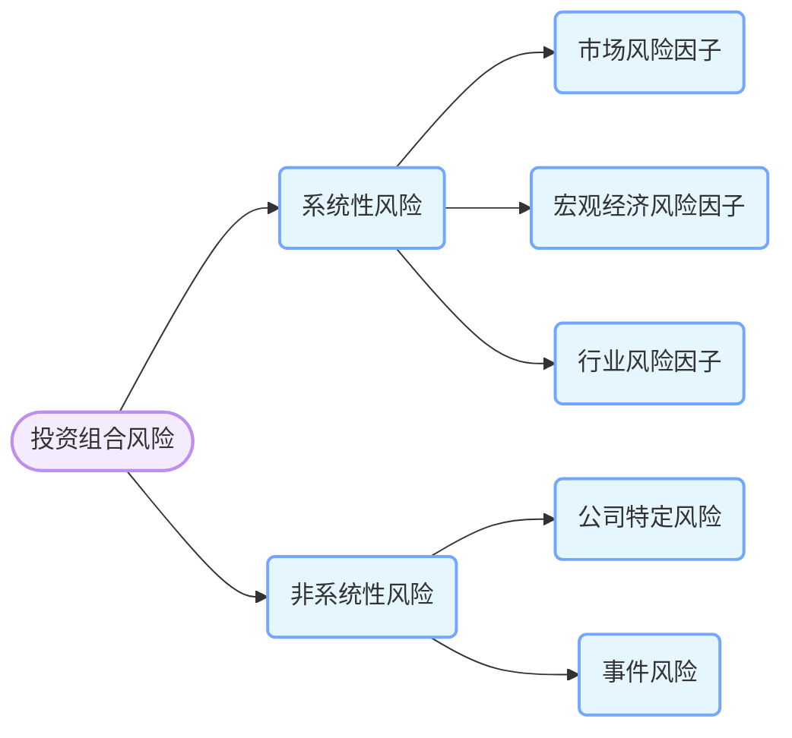

# 风险因子分解：深入理解投资组合风险来源

> 关键词：风险因子分解、投资组合、风险来源、因子模型、量化投资

> 摘要：本文旨在深入探讨风险因子分解这一重要概念，帮助投资者全面理解投资组合的风险来源。通过介绍核心概念、算法原理、数学模型，结合实际案例进行详细分析，阐述了风险因子分解在量化投资领域的应用。同时，提供了相关的工具和资源推荐，最后对未来发展趋势与挑战进行了总结。投资者可以借助风险因子分解，更精准地管理投资组合风险，优化投资决策。

## 1. 背景介绍 
### 1.1 目的和范围
在投资领域，准确识别和评估投资组合的风险来源至关重要。风险因子分解作为一种重要的量化分析方法，能够将投资组合的风险分解为多个因子的贡献，帮助投资者深入理解风险的构成，从而更好地进行风险管理和资产配置。本文将详细介绍风险因子分解的原理、方法和应用，涵盖从理论模型到实际案例的多个方面，旨在为投资者和相关从业者提供全面的指导。

### 1.2 预期读者
本文的预期读者包括专业投资者、金融分析师、量化投资从业者以及对投资组合风险管理感兴趣的学者和学生。无论是希望深入了解风险因子分解技术的专业人士，还是初学者想要建立相关知识体系，都能从本文中获得有价值的信息。

### 1.3 文档结构概述
本文将按照以下结构进行组织：首先介绍核心概念与联系，包括风险因子、因子模型等；接着阐述核心算法原理和具体操作步骤，并使用Python代码进行详细说明；然后讲解数学模型和公式，并举例说明；通过项目实战展示代码实际案例和详细解释；探讨实际应用场景；推荐相关的工具和资源；最后总结未来发展趋势与挑战，并提供常见问题解答和扩展阅读参考资料。

### 1.4 术语表
#### 1.4.1 核心术语定义
- **风险因子**：影响资产价格波动的各种因素，如市场风险因子（如大盘指数变动）、行业风险因子（如特定行业的政策变化）、宏观经济风险因子（如利率、通货膨胀率等）。
- **因子模型**：描述资产收益率与风险因子之间关系的数学模型，常见的有单因子模型（如资本资产定价模型 CAPM）和多因子模型（如 Fama - French 三因子模型）。
- **投资组合**：由多种资产组成的集合，投资者通过合理配置资产来实现特定的投资目标。
- **风险贡献**：每个风险因子对投资组合总风险的贡献程度，通常用方差或标准差来衡量。

#### 1.4.2 相关概念解释
- **系统性风险**：由整体市场因素引起的风险，无法通过分散投资完全消除，如宏观经济波动、政治事件等。
- **非系统性风险**：与特定资产或公司相关的风险，可以通过分散投资降低，如公司的经营风险、财务风险等。
- **因子暴露**：资产或投资组合对某个风险因子的敏感程度，反映了风险因子变动时资产收益率的变化情况。

#### 1.4.3 缩略词列表
- **CAPM**：Capital Asset Pricing Model，资本资产定价模型
- **F - F**：Fama - French，法玛 - 弗伦奇
- **IC**：Information Coefficient，信息系数
- **IR**：Information Ratio，信息比率

## 2. 核心概念与联系 
### 核心概念原理
风险因子分解的核心思想是将投资组合的风险表示为多个风险因子的线性组合。通过建立因子模型，我们可以分析每个风险因子对投资组合收益率和风险的影响。

以单因子模型为例，资本资产定价模型（CAPM）认为资产的预期收益率与市场组合的收益率之间存在线性关系：

$$R_i = R_f+\beta_i(R_m - R_f)+\epsilon_i$$

其中，$R_i$ 是资产 $i$ 的收益率，$R_f$ 是无风险收益率，$R_m$ 是市场组合的收益率，$\beta_i$ 是资产 $i$ 对市场风险因子的暴露，$\epsilon_i$ 是残差项，表示非系统性风险。

多因子模型则进一步扩展了单因子模型，考虑了多个风险因子的影响。例如，Fama - French 三因子模型考虑了市场风险因子、市值因子和账面市值比因子：

$$R_i = R_f+\beta_{i,MKT}(R_m - R_f)+\beta_{i,SMB}SMB+\beta_{i,HML}HML+\epsilon_i$$

其中，$SMB$ 是小市值股票组合收益率与大市值股票组合收益率之差，$HML$ 是高账面市值比股票组合收益率与低账面市值比股票组合收益率之差。

### 架构的文本示意图
```plaintext
投资组合风险
|
|--系统性风险
|   |--市场风险因子
|   |--宏观经济风险因子
|   |--行业风险因子
|
|--非系统性风险
|   |--公司特定风险
|   |--事件风险
```

### Mermaid 流程图


## 3. 核心算法原理 & 具体操作步骤 
### 算法原理
风险因子分解的核心算法是通过线性回归来估计资产或投资组合对各个风险因子的暴露。假设我们有 $n$ 个资产和 $k$ 个风险因子，资产 $i$ 的收益率 $R_i$ 可以表示为：

$$R_i = \alpha_i+\sum_{j = 1}^{k}\beta_{i,j}F_j+\epsilon_i$$

其中，$\alpha_i$ 是资产 $i$ 的截距项，$\beta_{i,j}$ 是资产 $i$ 对风险因子 $j$ 的暴露，$F_j$ 是风险因子 $j$ 的收益率，$\epsilon_i$ 是残差项。

我们可以使用最小二乘法来估计 $\alpha_i$ 和 $\beta_{i,j}$。最小二乘法的目标是最小化残差平方和：

$$\min_{\alpha_i,\beta_{i,j}}\sum_{t = 1}^{T}(R_{i,t}-\alpha_i-\sum_{j = 1}^{k}\beta_{i,j}F_{j,t})^2$$

其中，$T$ 是样本数量，$R_{i,t}$ 是资产 $i$ 在时间 $t$ 的收益率，$F_{j,t}$ 是风险因子 $j$ 在时间 $t$ 的收益率。

### 具体操作步骤
1. **数据收集**：收集资产收益率数据和风险因子收益率数据。
2. **数据预处理**：对数据进行清洗、缺失值处理和标准化等操作。
3. **线性回归**：使用最小二乘法进行线性回归，估计资产对各个风险因子的暴露。
4. **风险分解**：根据估计的暴露和风险因子的协方差矩阵，计算每个风险因子对投资组合风险的贡献。

### Python 代码实现
```python
import numpy as np
import pandas as pd
from sklearn.linear_model import LinearRegression

# 模拟数据
np.random.seed(0)
n_assets = 5
n_periods = 100
n_factors = 3

# 生成资产收益率数据
asset_returns = pd.DataFrame(np.random.randn(n_periods, n_assets), columns=[f'Asset_{i}' for i in range(n_assets)])

# 生成风险因子收益率数据
factor_returns = pd.DataFrame(np.random.randn(n_periods, n_factors), columns=[f'Factor_{i}' for i in range(n_factors)])

# 线性回归估计因子暴露
factor_exposures = {}
for asset in asset_returns.columns:
    model = LinearRegression()
    model.fit(factor_returns, asset_returns[asset])
    factor_exposures[asset] = model.coef_

# 输出因子暴露结果
factor_exposures_df = pd.DataFrame(factor_exposures).T
factor_exposures_df.columns = factor_returns.columns
print("Factor Exposures:")
print(factor_exposures_df)
```

### 代码解释
1. **数据生成**：使用 `numpy` 生成模拟的资产收益率数据和风险因子收益率数据。
2. **线性回归**：使用 `sklearn` 中的 `LinearRegression` 模型进行线性回归，估计每个资产对各个风险因子的暴露。
3. **结果输出**：将估计的因子暴露结果存储在 `pandas` 数据框中并输出。

## 4. 数学模型和公式 & 详细讲解 & 举例说明 
### 数学模型和公式
#### 因子模型
如前文所述，多因子模型可以表示为：

$$R_i = \alpha_i+\sum_{j = 1}^{k}\beta_{i,j}F_j+\epsilon_i$$

其中，$R_i$ 是资产 $i$ 的收益率，$\alpha_i$ 是截距项，$\beta_{i,j}$ 是资产 $i$ 对风险因子 $j$ 的暴露，$F_j$ 是风险因子 $j$ 的收益率，$\epsilon_i$ 是残差项。

#### 投资组合收益率
假设投资组合中资产 $i$ 的权重为 $w_i$，则投资组合的收益率 $R_p$ 可以表示为：

$$R_p=\sum_{i = 1}^{n}w_iR_i=\sum_{i = 1}^{n}w_i(\alpha_i+\sum_{j = 1}^{k}\beta_{i,j}F_j+\epsilon_i)=\alpha_p+\sum_{j = 1}^{k}\beta_{p,j}F_j+\epsilon_p$$

其中，$\alpha_p=\sum_{i = 1}^{n}w_i\alpha_i$，$\beta_{p,j}=\sum_{i = 1}^{n}w_i\beta_{i,j}$，$\epsilon_p=\sum_{i = 1}^{n}w_i\epsilon_i$。

#### 投资组合风险
投资组合的方差 $\sigma_p^2$ 可以分解为系统性风险和非系统性风险：

$$\sigma_p^2=\sum_{j = 1}^{k}\sum_{l = 1}^{k}\beta_{p,j}\beta_{p,l}\text{Cov}(F_j,F_l)+\text{Var}(\epsilon_p)$$

其中，$\text{Cov}(F_j,F_l)$ 是风险因子 $j$ 和 $l$ 的协方差，$\text{Var}(\epsilon_p)$ 是非系统性风险的方差。

### 详细讲解
- **因子暴露**：$\beta_{i,j}$ 表示资产 $i$ 对风险因子 $j$ 的敏感程度。如果 $\beta_{i,j}$ 为正，则资产 $i$ 的收益率与风险因子 $j$ 的收益率正相关；如果 $\beta_{i,j}$ 为负，则资产 $i$ 的收益率与风险因子 $j$ 的收益率负相关。
- **系统性风险**：由风险因子的协方差矩阵和投资组合对风险因子的暴露决定，反映了市场整体因素对投资组合的影响。
- **非系统性风险**：由残差项的方差决定，反映了与特定资产相关的风险，可以通过分散投资降低。

### 举例说明
假设我们有一个由两只股票组成的投资组合，权重分别为 $w_1 = 0.6$ 和 $w_2 = 0.4$。市场上有两个风险因子 $F_1$ 和 $F_2$。

股票 1 的因子暴露为 $\beta_{1,1}=1.2$，$\beta_{1,2}=0.8$；股票 2 的因子暴露为 $\beta_{2,1}=0.9$，$\beta_{2,2}=1.1$。

风险因子的协方差矩阵为：

$$\text{Cov}(F)=\begin{bmatrix}0.04 & 0.02\\0.02 & 0.03\end{bmatrix}$$

首先，计算投资组合对风险因子的暴露：

$$\beta_{p,1}=w_1\beta_{1,1}+w_2\beta_{2,1}=0.6\times1.2 + 0.4\times0.9 = 1.08$$

$$\beta_{p,2}=w_1\beta_{1,2}+w_2\beta_{2,2}=0.6\times0.8 + 0.4\times1.1 = 0.92$$

然后，计算投资组合的系统性风险：

$$\sigma_{systematic}^2=\beta_{p,1}^2\text{Var}(F_1)+2\beta_{p,1}\beta_{p,2}\text{Cov}(F_1,F_2)+\beta_{p,2}^2\text{Var}(F_2)$$

$$=1.08^2\times0.04 + 2\times1.08\times0.92\times0.02+0.92^2\times0.03\approx0.047$$

假设非系统性风险的方差 $\text{Var}(\epsilon_p)=0.01$，则投资组合的总风险为：

$$\sigma_p^2=\sigma_{systematic}^2+\text{Var}(\epsilon_p)=0.047 + 0.01 = 0.057$$

## 5. 项目实战：代码实际案例和详细解释说明 
### 5.1  开发环境搭建
- **Python 安装**：建议使用 Python 3.7 及以上版本，可以从 [Python 官方网站](https://www.python.org/downloads/) 下载安装。
- **依赖库安装**：使用 `pip` 安装所需的依赖库，包括 `numpy`、`pandas`、`scikit - learn` 等。

```bash
pip install numpy pandas scikit-learn
```

### 5.2  源代码详细实现和代码解读
```python
import numpy as np
import pandas as pd
from sklearn.linear_model import LinearRegression

# 读取数据
asset_returns = pd.read_csv('asset_returns.csv')
factor_returns = pd.read_csv('factor_returns.csv')

# 数据预处理
asset_returns = asset_returns.dropna()
factor_returns = factor_returns.dropna()

# 确保数据长度一致
min_length = min(len(asset_returns), len(factor_returns))
asset_returns = asset_returns[:min_length]
factor_returns = factor_returns[:min_length]

# 线性回归估计因子暴露
factor_exposures = {}
for asset in asset_returns.columns:
    model = LinearRegression()
    model.fit(factor_returns, asset_returns[asset])
    factor_exposures[asset] = model.coef_

# 计算投资组合权重
portfolio_weights = np.array([0.2, 0.3, 0.2, 0.1, 0.2])

# 计算投资组合的因子暴露
portfolio_factor_exposures = np.dot(portfolio_weights, pd.DataFrame(factor_exposures).T)

# 计算风险因子的协方差矩阵
factor_covariance = factor_returns.cov()

# 计算投资组合的系统性风险
systematic_risk = np.dot(np.dot(portfolio_factor_exposures, factor_covariance), portfolio_factor_exposures)

# 输出结果
print("Factor Exposures:")
print(pd.DataFrame(factor_exposures).T)
print("Portfolio Factor Exposures:")
print(portfolio_factor_exposures)
print("Systematic Risk:")
print(systematic_risk)
```

### 代码解读与分析
1. **数据读取**：使用 `pandas` 的 `read_csv` 函数读取资产收益率数据和风险因子收益率数据。
2. **数据预处理**：使用 `dropna` 函数去除缺失值，并确保数据长度一致。
3. **线性回归**：使用 `sklearn` 中的 `LinearRegression` 模型估计每个资产对各个风险因子的暴露。
4. **投资组合因子暴露计算**：根据投资组合权重和资产的因子暴露，计算投资组合的因子暴露。
5. **风险因子协方差矩阵计算**：使用 `pandas` 的 `cov` 函数计算风险因子的协方差矩阵。
6. **系统性风险计算**：根据投资组合的因子暴露和风险因子的协方差矩阵，计算投资组合的系统性风险。

## 6. 实际应用场景 
### 风险管理
风险因子分解可以帮助投资者识别投资组合中的主要风险来源，从而采取相应的风险管理措施。例如，如果发现投资组合对某个行业风险因子的暴露过高，可以通过调整资产配置来降低该行业的风险敞口。

### 资产配置
通过分析不同资产对各个风险因子的暴露，投资者可以更好地进行资产配置。例如，在市场风险较高时，可以增加对防御性资产（如债券）的配置，降低对风险资产（如股票）的配置。

### 绩效评估
风险因子分解可以用于评估投资组合的绩效。通过比较投资组合的实际收益率和基于风险因子模型预测的收益率，可以判断投资组合的超额收益是来自于因子暴露还是基金经理的选股能力。

### 量化投资策略开发
在量化投资策略开发中，风险因子分解可以作为一个重要的环节。例如，可以根据风险因子的变化构建交易信号，进行择时交易或选股。

## 7. 工具和资源推荐
### 7.1 学习资源推荐
#### 7.1.1 书籍推荐
- 《投资学》（原书第 10 版），滋维·博迪、亚历克斯·凯恩、艾伦·J·马库斯著，本书系统介绍了投资学的基本概念、理论和方法，包括风险因子分解等内容。
- 《量化投资：策略与技术》，丁鹏著，详细介绍了量化投资的各种策略和技术，对风险因子分解在量化投资中的应用有深入探讨。
- 《金融数量分析：基于 Excel 和 VBA》，保罗·威尔莫特著，通过实际案例介绍了金融数量分析的方法，包括风险因子分解的实现。

#### 7.1.2 在线课程
- Coursera 上的“Financial Markets”课程，由耶鲁大学教授罗伯特·席勒讲授，涵盖了金融市场的基本理论和风险管理等内容。
- edX 上的“Introduction to Portfolio Construction and Analysis with Python”课程，介绍了如何使用 Python 进行投资组合构建和分析，包括风险因子分解。

#### 7.1.3 技术博客和网站
- 优矿（uqer.io）：提供了丰富的金融数据和量化投资工具，有很多关于风险因子分解的案例和文章。
- 聚宽（joinquant.com）：专注于量化投资领域，提供了大量的量化策略和技术文章，对风险因子分解有详细的介绍。

### 7.2 开发工具框架推荐
#### 7.2.1 IDE和编辑器
- PyCharm：功能强大的 Python 集成开发环境，支持代码调试、版本控制等功能。
- Jupyter Notebook：交互式的开发环境，适合进行数据探索和模型开发，方便展示代码和结果。

#### 7.2.2 调试和性能分析工具
- `pdb`：Python 内置的调试工具，可以帮助开发者定位代码中的问题。
- `cProfile`：Python 标准库中的性能分析工具，可以分析代码的运行时间和函数调用情况。

#### 7.2.3 相关框架和库
- `numpy`：用于科学计算的基础库，提供了高效的数组操作和数学函数。
- `pandas`：用于数据处理和分析的库，提供了数据结构和数据操作方法，方便处理金融数据。
- `scikit - learn`：机器学习库，提供了线性回归等机器学习算法，可用于风险因子分解的实现。

### 7.3 相关论文著作推荐
#### 7.3.1 经典论文
- “The Capital Asset Pricing Model: Theory and Evidence”，由 Eugene F. Fama 和 Kenneth R. French 发表，对资本资产定价模型进行了深入的理论和实证研究。
- “Common Risk Factors in the Returns on Stocks and Bonds”，Fama 和 French 提出了著名的三因子模型，对投资组合风险分析产生了深远影响。

#### 7.3.2 最新研究成果
- 关注顶级金融学术期刊，如《Journal of Finance》、《Journal of Financial Economics》等，这些期刊会发表关于风险因子分解的最新研究成果。
- 参加金融学术会议，如 American Finance Association（AFA）年会等，了解最新的研究动态。

#### 7.3.3 应用案例分析
- 一些金融机构的研究报告中会有风险因子分解的应用案例，如高盛、摩根大通等的研究报告，可以从中学习实际应用中的方法和技巧。

## 8. 总结：未来发展趋势与挑战
### 未来发展趋势
- **多因子模型的不断完善**：随着金融市场的不断发展和变化，传统的多因子模型可能无法完全解释资产的收益率和风险。未来，研究人员可能会引入更多的风险因子，如行为金融因子、大数据因子等，以提高模型的解释能力。
- **人工智能和机器学习的应用**：人工智能和机器学习技术在风险因子分解中的应用将越来越广泛。例如，使用深度学习模型可以自动发现隐藏的风险因子，提高风险预测的准确性。
- **与其他领域的融合**：风险因子分解将与其他领域，如宏观经济分析、行业研究等进行更深入的融合。通过综合考虑多个领域的信息，可以更全面地理解投资组合的风险来源。

### 挑战
- **数据质量和可得性**：风险因子分解需要大量的高质量数据，包括资产收益率数据、风险因子数据等。然而，数据的质量和可得性可能会受到限制，例如某些数据可能存在缺失值、误差等问题。
- **模型的复杂性和解释性**：随着多因子模型的不断完善和人工智能技术的应用，模型的复杂性可能会不断增加。这可能会导致模型的解释性变差，投资者难以理解模型的结果和决策依据。
- **市场的不确定性**：金融市场具有高度的不确定性，风险因子的表现可能会随着市场环境的变化而发生改变。因此，如何在不确定的市场环境中准确地识别和评估风险因子是一个挑战。

## 9. 附录：常见问题与解答
### 1. 风险因子分解和风险管理有什么关系？
风险因子分解是风险管理的重要工具之一。通过风险因子分解，投资者可以识别投资组合中的主要风险来源，从而采取相应的风险管理措施，如调整资产配置、对冲风险等。

### 2. 如何选择合适的风险因子？
选择合适的风险因子需要考虑多个因素，包括因子的经济意义、解释能力、数据可得性等。一般来说，可以参考经典的多因子模型，如 Fama - French 三因子模型，同时结合市场情况和投资目标选择合适的因子。

### 3. 风险因子分解的结果受哪些因素影响？
风险因子分解的结果受多种因素影响，包括数据质量、样本期间、模型选择等。不同的数据质量和样本期间可能会导致不同的因子暴露估计结果，而不同的模型选择也会影响风险分解的准确性。

### 4. 风险因子分解在量化投资中的应用有哪些限制？
风险因子分解在量化投资中的应用存在一些限制，例如模型的假设可能与实际市场情况不符，风险因子的表现可能会发生变化，数据的质量和可得性可能会受到限制等。因此，在应用风险因子分解时，需要结合实际情况进行综合考虑。

## 10. 扩展阅读 & 参考资料
### 扩展阅读
- 《行为金融学》，理查德·泰勒著，介绍了行为金融理论，有助于理解投资者的行为对风险因子的影响。
- 《金融计量学：从初级到高级建模技术》，克里斯托弗·布鲁克斯著，详细介绍了金融计量学的方法和技术，对风险因子分解的建模有深入讲解。

### 参考资料
- 博迪，凯恩，马库斯. 投资学（原书第 10 版）[M]. 机械工业出版社，2017.
- 丁鹏. 量化投资：策略与技术[M]. 电子工业出版社，2012.
- Fama, Eugene F., and Kenneth R. French. "The Capital Asset Pricing Model: Theory and Evidence." Journal of Economic Perspectives 18.3 (2004): 25-46.
- Fama, Eugene F., and Kenneth R. French. "Common Risk Factors in the Returns on Stocks and Bonds." Journal of Financial Economics 33.1 (1993): 3-56.

作者：AI天才研究院/AI Genius Institute & 禅与计算机程序设计艺术 /Zen And The Art of Computer Programming