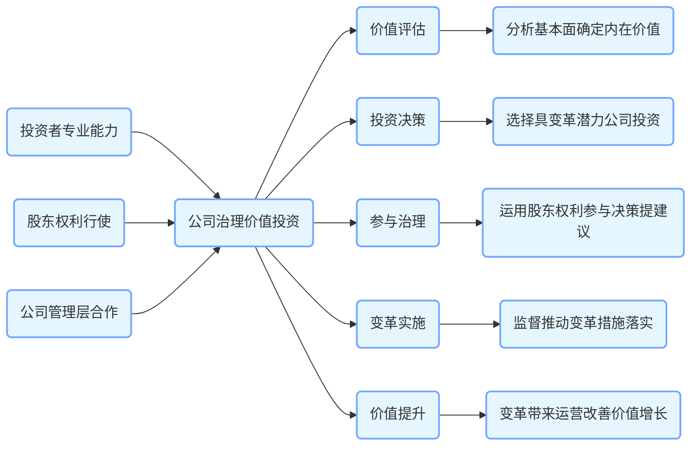

# 马丁·惠特曼的公司治理价值投资：推动变革创造价值

> 关键词：马丁·惠特曼、公司治理、价值投资、推动变革、创造价值

> 摘要：本文围绕马丁·惠特曼的公司治理价值投资理念展开，深入剖析其核心概念、算法原理、数学模型等内容。通过详细的项目实战案例展示该投资理念在实际中的应用，探讨其在不同场景下的价值。同时，推荐了相关的学习资源、开发工具框架以及论文著作，最后总结了其未来发展趋势与挑战，并解答常见问题。旨在帮助读者全面理解和运用马丁·惠特曼的公司治理价值投资理念来推动变革和创造价值。

## 1. 背景介绍 
### 1.1 目的和范围
本文章的目的在于全面且深入地介绍马丁·惠特曼的公司治理价值投资理念。通过阐述该理念的核心概念、算法原理、数学模型等理论知识，结合实际的项目实战案例，让读者清晰地了解如何运用这一投资理念推动企业变革并创造价值。文章的范围涵盖了该投资理念的各个方面，包括其理论基础、实际应用场景、相关工具资源以及未来发展趋势等。

### 1.2 预期读者
预期读者主要包括金融投资领域的专业人士，如投资经理、分析师等，他们可以从文章中深入学习和借鉴马丁·惠特曼的投资理念，优化自己的投资策略。同时，对价值投资感兴趣的业余投资者也能通过本文了解这一独特的投资方法，提升自己的投资素养。此外，企业管理者也可以从中获得关于公司治理和价值创造的启示，以改善企业的经营管理。

### 1.3 文档结构概述
本文将按照以下结构进行阐述：首先介绍马丁·惠特曼公司治理价值投资理念的背景信息，包括目的、预期读者和文档结构等。接着详细讲解核心概念与联系，通过文本示意图和 Mermaid 流程图直观展示其原理和架构。然后深入分析核心算法原理和具体操作步骤，并结合 Python 源代码进行详细说明。随后介绍相关的数学模型和公式，并举例说明其应用。再通过项目实战案例，从开发环境搭建到源代码实现和解读，全面展示该投资理念的实际应用。之后探讨实际应用场景，为读者提供更多的实践思路。接着推荐相关的工具和资源，包括学习资源、开发工具框架和论文著作等。最后总结未来发展趋势与挑战，解答常见问题，并提供扩展阅读和参考资料。

### 1.4 术语表
#### 1.4.1 核心术语定义
- **公司治理价值投资**：马丁·惠特曼所倡导的一种投资理念，强调通过参与公司治理，推动公司进行变革，从而提升公司的内在价值，为投资者创造回报。
- **内在价值**：指公司基于其资产、盈利能力、现金流等基本面因素所具有的真实价值，而非市场价格所反映的价值。
- **推动变革**：投资者通过积极参与公司决策、提出改进建议等方式，促使公司在战略、运营、管理等方面进行调整和优化。

#### 1.4.2 相关概念解释
- **价值投资**：一种投资策略，关注公司的内在价值，寻找被市场低估的股票进行投资，期望在公司价值回归时获得收益。马丁·惠特曼的公司治理价值投资是价值投资的一种深化和拓展。
- **公司治理**：协调公司各利益相关者之间的关系，包括股东、管理层、员工等，以实现公司的长期稳定发展和价值最大化的一系列制度和机制。

#### 1.4.3 缩略词列表
本文在阐述过程中暂未使用缩略词。

## 2. 核心概念与联系 
### 核心概念原理
马丁·惠特曼的公司治理价值投资理念的核心在于认识到公司的价值不仅仅取决于其现有的财务状况和市场表现，还与公司的治理结构和管理效率密切相关。传统的价值投资往往侧重于寻找被低估的股票，但可能忽视了公司内部治理对价值提升的潜力。而惠特曼的理念强调投资者应积极参与公司治理，通过推动公司在战略、运营、财务等方面的变革，来挖掘和提升公司的内在价值。

例如，一家公司可能由于管理不善、战略失误等原因，导致其市场价值低于内在价值。投资者通过深入研究和分析，发现该公司的潜在价值，并通过持有一定比例的股份，参与公司的决策过程，提出改进建议，如优化业务流程、调整管理层、加强内部控制等。这些变革措施有望提高公司的运营效率、增强盈利能力，从而推动公司的内在价值上升，最终实现投资者的回报。

### 架构的文本示意图
```plaintext
公司治理价值投资
|
|-- 核心目标：推动公司变革，提升内在价值
|
|-- 主要步骤
|   |
|   |-- 价值评估：分析公司基本面，确定内在价值
|   |
|   |-- 投资决策：选择具有变革潜力的公司进行投资
|   |
|   |-- 参与治理：通过股东权利参与公司决策，提出变革建议
|   |
|   |-- 变革实施：监督和推动公司落实变革措施
|   |
|   |-- 价值提升：变革带来公司运营改善和价值增长
|
|-- 关键因素
|   |
|   |-- 投资者专业能力：具备财务分析、公司治理等知识
|   |
|   |-- 股东权利行使：有效运用股东投票权等权利
|   |
|   |-- 公司管理层合作：与管理层建立良好沟通与合作关系
```

### Mermaid 流程图


## 3. 核心算法原理 & 具体操作步骤 
### 核心算法原理
在马丁·惠特曼的公司治理价值投资中，核心算法原理主要围绕对公司内在价值的评估和对变革潜力的判断。以下是一个简化的 Python 示例，用于计算公司的简单内在价值评估：

```python
def calculate_intrinsic_value(earnings_per_share, growth_rate, discount_rate):
    """
    计算公司的内在价值
    :param earnings_per_share: 每股收益
    :param growth_rate: 预期增长率
    :param discount_rate: 折现率
    :return: 内在价值
    """
    # 假设使用戈登增长模型来计算内在价值
    intrinsic_value = earnings_per_share * (1 + growth_rate) / (discount_rate - growth_rate)
    return intrinsic_value

# 示例数据
earnings_per_share = 2.0
growth_rate = 0.05
discount_rate = 0.1

# 计算内在价值
intrinsic_value = calculate_intrinsic_value(earnings_per_share, growth_rate, discount_rate)
print(f"公司的内在价值为: {intrinsic_value}")
```

### 具体操作步骤
1. **价值评估**
    - **财务分析**：收集公司的财务报表，包括资产负债表、利润表和现金流量表。分析公司的盈利能力、偿债能力、运营能力等指标，如毛利率、净利率、资产负债率、存货周转率等。
    - **行业分析**：研究公司所处的行业环境，包括行业增长趋势、竞争格局、政策法规等。评估公司在行业中的地位和竞争力。
    - **管理评估**：考察公司管理层的能力、经验和诚信度。分析管理层的战略规划和决策能力。
2. **投资决策**
    - **筛选标准**：根据价值评估的结果，设定筛选标准，选择内在价值被低估且具有变革潜力的公司。
    - **风险评估**：评估投资的风险，包括市场风险、行业风险、公司特定风险等。确定投资的风险承受能力。
3. **参与治理**
    - **持有股份**：购买公司的股份，达到一定比例以获得股东权利。
    - **股东沟通**：与其他股东、管理层进行沟通，表达自己的观点和建议。
    - **行使投票权**：在股东大会上行使投票权，参与公司的重大决策。
4. **变革实施**
    - **制定变革方案**：根据公司的实际情况，制定具体的变革方案，包括战略调整、运营优化、管理改进等。
    - **监督执行**：监督公司管理层落实变革方案，及时解决实施过程中出现的问题。
5. **价值提升**
    - **跟踪评估**：定期跟踪公司的经营业绩和财务状况，评估变革措施的效果。
    - **持续改进**：根据评估结果，对变革方案进行调整和完善，持续推动公司价值提升。

## 4. 数学模型和公式 & 详细讲解 & 举例说明 
### 戈登增长模型
戈登增长模型（Gordon Growth Model）是用于计算股票内在价值的常用模型，公式如下：
$$V = \frac{D_1}{r - g}$$
其中：
- $V$ 表示股票的内在价值；
- $D_1$ 表示下一期预计的股息；
- $r$ 表示投资者要求的必要回报率（折现率）；
- $g$ 表示股息的固定增长率。

### 详细讲解
该模型基于以下假设：公司的股息以固定的增长率 $g$ 持续增长，并且投资者要求的必要回报率 $r$ 保持不变。模型的核心思想是将未来的股息流折现到当前时刻，以计算股票的内在价值。

### 举例说明
假设某公司当前的股息为 $D_0 = 1$ 元，预计股息的固定增长率为 $g = 0.05$，投资者要求的必要回报率为 $r = 0.1$。首先计算下一期预计的股息 $D_1 = D_0(1 + g) = 1\times(1 + 0.05) = 1.05$ 元。

然后，根据戈登增长模型计算股票的内在价值：
$$V = \frac{D_1}{r - g} = \frac{1.05}{0.1 - 0.05} = \frac{1.05}{0.05} = 21$$（元）

这意味着在上述假设条件下，该股票的内在价值为 21 元。如果当前股票的市场价格低于 21 元，从理论上来说，该股票被低估，具有投资价值。

### 其他相关公式
#### 市盈率（P/E）估值法
市盈率是指股票价格与每股收益的比率，公式为：
$$P/E = \frac{P}{EPS}$$
其中：
- $P$ 表示股票价格；
- $EPS$ 表示每股收益。

通过与同行业其他公司的市盈率进行比较，可以评估该股票的相对估值水平。例如，某公司的每股收益为 $EPS = 2$ 元，当前股票价格为 $P = 20$ 元，则该公司的市盈率为 $P/E = \frac{20}{2} = 10$ 倍。如果同行业平均市盈率为 15 倍，则该公司的股票可能被低估。

#### 市净率（P/B）估值法
市净率是指股票价格与每股净资产的比率，公式为：
$$P/B = \frac{P}{BVPS}$$
其中：
- $P$ 表示股票价格；
- $BVPS$ 表示每股净资产。

市净率可以反映公司的净资产价值与市场价格之间的关系。一般来说，市净率较低的股票可能具有一定的投资价值。例如，某公司的每股净资产为 $BVPS = 5$ 元，当前股票价格为 $P = 10$ 元，则该公司的市净率为 $P/B = \frac{10}{5} = 2$ 倍。

## 5. 项目实战：代码实际案例和详细解释说明 
### 5.1  开发环境搭建
在进行公司治理价值投资的项目实战时，我们可以使用 Python 进行数据处理和分析。以下是开发环境搭建的步骤：
1. **安装 Python**：从 Python 官方网站（https://www.python.org/downloads/）下载并安装适合你操作系统的 Python 版本。建议安装 Python 3.7 及以上版本。
2. **安装必要的库**：使用 pip 命令安装以下常用的库：
    - `pandas`：用于数据处理和分析。
    - `numpy`：用于数值计算。
    - `matplotlib`：用于数据可视化。
    - `yfinance`：用于获取股票市场数据。

```bash
pip install pandas numpy matplotlib yfinance
```

### 5.2  源代码详细实现和代码解读
以下是一个完整的 Python 代码示例，用于获取某公司的财务数据，计算其内在价值，并进行简单的投资分析：

```python
import yfinance as yf
import pandas as pd

# 定义函数计算内在价值（使用戈登增长模型）
def calculate_intrinsic_value(earnings_per_share, growth_rate, discount_rate):
    intrinsic_value = earnings_per_share * (1 + growth_rate) / (discount_rate - growth_rate)
    return intrinsic_value

# 定义函数获取公司财务数据
def get_financial_data(ticker):
    stock = yf.Ticker(ticker)
    # 获取每股收益
    earnings_per_share = stock.info.get('trailingEps', None)
    # 这里简单假设增长率和折现率，实际应用中需要更精确的估计
    growth_rate = 0.05
    discount_rate = 0.1
    return earnings_per_share, growth_rate, discount_rate

# 主函数
def main():
    # 输入股票代码
    ticker = 'AAPL'  # 以苹果公司为例
    # 获取财务数据
    earnings_per_share, growth_rate, discount_rate = get_financial_data(ticker)
    if earnings_per_share is not None:
        # 计算内在价值
        intrinsic_value = calculate_intrinsic_value(earnings_per_share, growth_rate, discount_rate)
        # 获取当前股票价格
        stock = yf.Ticker(ticker)
        current_price = stock.info.get('regularMarketPrice', None)
        if current_price is not None:
            print(f"公司 {ticker} 的每股收益为: {earnings_per_share}")
            print(f"计算得到的内在价值为: {intrinsic_value}")
            print(f"当前股票价格为: {current_price}")
            if intrinsic_value > current_price:
                print("该股票可能被低估，具有投资价值。")
            else:
                print("该股票可能被高估，需谨慎投资。")
        else:
            print("无法获取当前股票价格。")
    else:
        print("无法获取每股收益数据。")

if __name__ == "__main__":
    main()
```

### 5.3  代码解读与分析
1. **`calculate_intrinsic_value` 函数**：该函数实现了戈登增长模型，用于计算公司的内在价值。输入参数包括每股收益、增长率和折现率，返回计算得到的内在价值。
2. **`get_financial_data` 函数**：使用 `yfinance` 库获取指定股票代码的公司的财务数据，包括每股收益。同时，简单假设了增长率和折现率，实际应用中需要更精确的估计。
3. **`main` 函数**：首先输入股票代码，调用 `get_financial_data` 函数获取财务数据。如果成功获取到每股收益，则调用 `calculate_intrinsic_value` 函数计算内在价值。然后获取当前股票价格，将内在价值与当前价格进行比较，给出投资建议。

需要注意的是，这个示例只是一个简单的演示，实际的公司治理价值投资需要更深入的分析和更精确的模型。例如，增长率和折现率的估计需要考虑更多的因素，如宏观经济环境、行业发展趋势、公司的竞争优势等。

## 6. 实际应用场景 
### 困境企业投资
在市场中，存在一些由于经营不善、战略失误或行业竞争加剧等原因而陷入困境的企业。这些企业的市场价值往往被严重低估，但它们可能拥有一些有价值的资产、技术或品牌。马丁·惠特曼的公司治理价值投资理念可以应用于这类企业。投资者通过深入研究和分析，发现企业的潜在价值，并通过参与公司治理，推动企业进行变革。例如，帮助企业调整战略方向、优化业务流程、更换管理层等。如果变革成功，企业的经营状况将得到改善，内在价值将大幅提升，投资者也将获得丰厚的回报。

### 行业整合投资
在一些行业中，存在着分散、低效的竞争格局。投资者可以利用公司治理价值投资理念，寻找那些具有整合潜力的企业。通过持有这些企业的股份，参与公司决策，推动企业进行行业整合。例如，通过并购、重组等方式，实现资源的优化配置，提高企业的市场竞争力和规模效益。这种投资方式不仅可以为投资者带来价值增长，还可以促进行业的健康发展。

### 新兴企业成长投资
对于一些新兴行业的企业，虽然它们目前可能尚未实现盈利，但具有巨大的发展潜力。投资者可以关注这些企业的公司治理结构和管理团队。如果企业的治理良好，管理团队具有创新能力和执行力，投资者可以通过投资并参与公司治理，帮助企业制定合理的发展战略，推动企业快速成长。例如，在科技行业，许多初创企业在早期需要大量的资金和战略指导，投资者可以通过公司治理价值投资的方式，为企业提供支持，实现企业和投资者的双赢。

## 7. 工具和资源推荐
### 7.1 学习资源推荐
#### 7.1.1 书籍推荐
- 《马丁·惠特曼的价值投资方法》：这本书详细介绍了马丁·惠特曼的投资理念、方法和实践经验，是学习其公司治理价值投资的权威著作。
- 《聪明的投资者》：本杰明·格雷厄姆的经典著作，阐述了价值投资的基本原理和方法，对理解马丁·惠特曼的投资理念有很大的帮助。
- 《公司治理》：这本书系统地介绍了公司治理的理论和实践，有助于深入理解公司治理在价值投资中的重要性。

#### 7.1.2 在线课程
- Coursera 上的“价值投资原理与实践”课程：由知名教授授课，讲解价值投资的核心概念和方法，包括公司分析、估值模型等内容。
- edX 上的“公司治理与领导力”课程：介绍公司治理的相关理论和实践，以及如何通过有效的治理提升公司价值。

#### 7.1.3 技术博客和网站
- Seeking Alpha：一个知名的金融投资博客平台，有许多专业投资者和分析师分享他们的投资观点和研究报告，其中不乏关于公司治理价值投资的内容。
- ValueWalk：专注于价值投资领域，提供最新的价值投资资讯、研究成果和案例分析。

### 7.2 开发工具框架推荐
#### 7.2.1 IDE和编辑器
- PyCharm：一款专业的 Python 集成开发环境，具有强大的代码编辑、调试和项目管理功能，适合进行公司治理价值投资相关的数据分析和编程工作。
- Jupyter Notebook：一种交互式的开发环境，支持 Python 等多种编程语言。可以方便地进行数据可视化和代码演示，适合进行投资分析和模型验证。

#### 7.2.2 调试和性能分析工具
- pdb：Python 自带的调试工具，可以帮助开发者定位和解决代码中的问题。
- cProfile：Python 的性能分析工具，可以分析代码的运行时间和资源消耗情况，帮助优化代码性能。

#### 7.2.3 相关框架和库
- Pandas：用于数据处理和分析的 Python 库，提供了高效的数据结构和数据操作方法，适合处理公司财务数据和市场数据。
- NumPy：用于数值计算的 Python 库，提供了大量的数学函数和数组操作功能，在投资分析和模型计算中经常使用。
- Matplotlib：用于数据可视化的 Python 库，可以绘制各种图表和图形，帮助直观地展示投资分析结果。

### 7.3 相关论文著作推荐
#### 7.3.1 经典论文
- Jensen, M. C., & Meckling, W. H. (1976). Theory of the firm: Managerial behavior, agency costs and ownership structure. Journal of Financial Economics, 3(4), 305-360. 这篇论文提出了代理理论，阐述了公司治理中管理层与股东之间的利益冲突问题，对理解公司治理的重要性有深远的影响。
- Fama, E. F., & French, K. R. (1992). The cross-section of expected stock returns. Journal of Finance, 47(2), 427-465. 该论文提出了 Fama-French 三因子模型，用于解释股票收益率的差异，为投资分析提供了重要的理论基础。

#### 7.3.2 最新研究成果
- 在学术数据库如 SSRN、EconLit 上可以搜索到关于公司治理价值投资的最新研究论文。这些论文通常关注行业动态、新兴技术对投资的影响等前沿问题。

#### 7.3.3 应用案例分析
- Harvard Business Review 上有许多关于企业治理和价值创造的案例分析文章。通过阅读这些案例，可以学习到实际应用中的经验和教训，提升自己的投资分析能力。

## 8. 总结：未来发展趋势与挑战
### 未来发展趋势
- **数字化转型**：随着科技的不断发展，公司治理和价值投资也将迎来数字化转型。投资者可以利用大数据、人工智能等技术，更准确地评估公司的内在价值和变革潜力。例如，通过分析海量的财务数据、市场数据和社交媒体数据，挖掘潜在的投资机会。
- **社会责任投资**：越来越多的投资者开始关注企业的社会责任表现，如环境保护、社会公平、公司治理等方面。未来，将社会责任纳入公司治理价值投资的考量范围将成为一种趋势。投资者不仅追求财务回报，还希望通过投资推动企业实现可持续发展。
- **全球投资**：随着经济全球化的深入，投资者将有更多的机会参与全球市场的投资。马丁·惠特曼的公司治理价值投资理念可以应用于不同国家和地区的企业，通过跨文化的公司治理实践，挖掘全球范围内的投资价值。

### 挑战
- **信息不对称**：在投资过程中，投资者往往面临信息不对称的问题。公司管理层可能掌握更多的内部信息，而投资者难以获取全面、准确的信息。这可能导致投资者对公司的内在价值和变革潜力判断失误，增加投资风险。
- **变革阻力**：推动公司进行变革往往面临来自管理层、员工等方面的阻力。管理层可能不愿意改变现有的经营模式和决策方式，员工可能对变革产生抵触情绪。投资者需要具备良好的沟通能力和协调能力，以克服这些阻力，确保变革的顺利实施。
- **市场不确定性**：市场环境充满不确定性，宏观经济形势、政策法规变化、行业竞争等因素都可能影响公司的经营业绩和价值。投资者需要及时调整投资策略，应对市场变化带来的挑战。

## 9. 附录：常见问题与解答
### 问题 1：公司治理价值投资与传统价值投资有什么区别？
解答：传统价值投资主要关注公司的财务报表和市场价格，寻找被低估的股票。而公司治理价值投资不仅关注公司的基本面，还强调投资者应积极参与公司治理，通过推动公司变革来提升其内在价值。传统价值投资更侧重于被动投资，而公司治理价值投资是一种主动投资策略。

### 问题 2：如何判断公司是否具有变革潜力？
解答：可以从以下几个方面判断公司的变革潜力：一是公司的管理层是否具有开放的思维和变革的意愿；二是公司的业务是否具有调整和优化的空间，如是否存在冗余业务、低效流程等；三是公司所处的行业环境是否有利于变革，如行业是否处于转型期、是否存在政策支持等。

### 问题 3：参与公司治理需要具备哪些能力？
解答：参与公司治理需要具备财务分析能力，以便准确评估公司的价值和财务状况；需要具备沟通协调能力，与管理层、其他股东等进行有效的沟通和合作；还需要具备战略眼光和决策能力，能够提出合理的变革建议和决策方案。

### 问题 4：公司治理价值投资的风险如何控制？
解答：可以通过以下方式控制风险：一是进行充分的尽职调查，全面了解公司的情况，避免投资于存在重大风险的公司；二是分散投资，将资金分散到不同的公司和行业，降低单一投资的风险；三是建立合理的止损机制，当投资出现不利情况时，及时止损，避免损失扩大。

## 10. 扩展阅读 & 参考资料
### 扩展阅读
- 《投资最重要的事》：霍华德·马克斯的著作，分享了他在投资领域的经验和智慧，对理解投资的本质和风险控制有很大的帮助。
- 《穷查理宝典》：收录了查理·芒格的演讲和文章，阐述了他的多元思维模型和投资哲学，对提升投资分析能力有重要的启示。

### 参考资料
- 相关公司的年报和财务报告。
- 金融媒体和研究机构发布的研究报告和分析文章。
- 学术期刊上关于公司治理、价值投资的研究论文。

作者：AI天才研究院/AI Genius Institute & 禅与计算机程序设计艺术 /Zen And The Art of Computer Programming