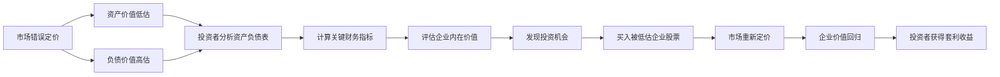

# 马丁·惠特曼的资产负债表套利方法

> 关键词：马丁·惠特曼、资产负债表套利、价值投资、财务分析、投资策略

> 摘要：本文深入探讨了马丁·惠特曼的资产负债表套利方法。首先介绍了该方法产生的背景、适用范围以及预期读者等内容。接着详细阐述了核心概念、算法原理、数学模型等理论知识，通过Python代码进行算法实现和解释。然后结合项目实战，展示代码案例并进行解读。之后分析了该方法在实际中的应用场景，推荐了相关的学习工具、资源和论文著作。最后总结了其未来发展趋势与挑战，并对常见问题进行解答，为投资者和相关研究人员提供了全面且深入的参考。

## 1. 背景介绍 
### 1.1 目的和范围
马丁·惠特曼是价值投资领域的杰出代表人物，他所提出的资产负债表套利方法旨在通过深入分析企业的资产负债表，发现被市场低估的企业价值，从而获取投资收益。本文的目的在于全面剖析这一方法，从理论原理到实际应用进行系统阐述，让读者深入理解该方法的核心要点和操作技巧。范围涵盖了该方法的基本概念、算法原理、数学模型、实际案例以及相关的学习资源和未来发展趋势等方面。

### 1.2 预期读者
本文预期读者包括对价值投资感兴趣的投资者、金融领域的研究人员、财务分析人员以及相关专业的学生等。无论是想要学习一种新的投资策略，还是希望深入了解企业财务分析方法的人群，都能从本文中获得有价值的信息。

### 1.3 文档结构概述
本文首先介绍了马丁·惠特曼资产负债表套利方法的背景知识，包括目的、读者群体和文档结构等。接着阐述了核心概念以及它们之间的联系，通过文本示意图和Mermaid流程图进行直观展示。然后详细讲解了核心算法原理，并使用Python代码进行实现和解释。之后介绍了相关的数学模型和公式，并举例说明。通过项目实战部分，展示了代码实际案例并进行详细解读。分析了该方法在实际中的应用场景，推荐了学习工具、资源和论文著作。最后总结了未来发展趋势与挑战，解答常见问题，并提供扩展阅读和参考资料。

### 1.4 术语表
#### 1.4.1 核心术语定义
- **资产负债表套利**：通过对企业资产负债表的详细分析，寻找资产价值被低估或负债价值被高估的情况，从而进行投资以获取套利收益的方法。
- **净流动资产价值**：企业流动资产减去流动负债后的价值，反映了企业在短期内可变现的资产净值。
- **账面价值**：根据企业财务报表计算得出的资产或权益的价值，通常是历史成本减去折旧等调整后的金额。

#### 1.4.2 相关概念解释
- **价值投资**：一种投资理念，强调通过分析企业的内在价值，寻找被市场低估的股票进行投资，以获得长期的投资回报。资产负债表套利方法是价值投资的一种具体应用。
- **财务分析**：对企业财务报表进行分析，以评估企业的财务状况、经营成果和现金流量等情况。在资产负债表套利方法中，财务分析是核心环节，用于发现潜在的投资机会。

#### 1.4.3 缩略词列表
- **NAV**：Net Asset Value，净资产价值
- **NCAV**：Net Current Asset Value，净流动资产价值

## 2. 核心概念与联系 

### 核心概念原理
马丁·惠特曼的资产负债表套利方法基于价值投资的基本理念，核心在于通过对企业资产负债表的深入研究，挖掘企业的真实价值。其原理是市场有时会对企业的资产和负债进行错误定价，导致企业的市场价值与其内在价值出现偏差。投资者可以通过分析资产负债表，发现那些资产价值被低估、负债价值被高估的企业，从而进行投资，等待市场对企业价值进行重新评估，实现套利收益。

例如，一家企业可能拥有大量的优质资产，如土地、房产、知识产权等，但由于市场对其行业前景的悲观预期，其股票价格被严重低估。通过对资产负债表的分析，投资者可以发现这些被低估的资产，判断企业的内在价值高于其市场价值，从而进行投资。

### 架构的文本示意图
```plaintext
市场错误定价
|
|-- 资产价值低估
|   |-- 土地、房产等实物资产
|   |-- 知识产权、品牌等无形资产
|
|-- 负债价值高估
|   |-- 长期债务被过度担忧
|   |-- 或有负债被高估
|
|-- 投资者分析资产负债表
|   |-- 计算关键财务指标
|   |   |-- 净流动资产价值（NCAV）
|   |   |-- 净资产价值（NAV）
|   |-- 评估企业内在价值
|
|-- 发现投资机会
|   |-- 买入被低估企业股票
|
|-- 市场重新定价
|   |-- 企业价值回归
|   |-- 投资者获得套利收益
```

### Mermaid 流程图


## 3. 核心算法原理 & 具体操作步骤 

### 核心算法原理
资产负债表套利方法的核心算法主要围绕计算关键财务指标来评估企业的内在价值。其中，净流动资产价值（NCAV）和净资产价值（NAV）是两个重要的指标。

净流动资产价值（NCAV）的计算公式为：
$NCAV = 流动资产 - 流动负债$

净资产价值（NAV）的计算公式为：
$NAV = 总资产 - 总负债$

投资者通过比较企业的市场价值与NCAV、NAV等指标，判断企业是否被低估。如果企业的市场价值低于NCAV或NAV，且企业具有一定的盈利能力和发展潜力，则可能存在投资机会。

### 具体操作步骤
1. **收集企业财务报表**：获取企业的资产负债表、利润表和现金流量表等财务报表，这些报表可以从企业的官方网站、证券交易所网站或金融数据提供商处获得。
2. **计算关键财务指标**：根据财务报表数据，计算净流动资产价值（NCAV）、净资产价值（NAV）等指标。
3. **评估企业盈利能力和发展潜力**：除了财务指标，还需要分析企业的盈利能力、行业前景、竞争优势等因素，以判断企业的长期发展潜力。
4. **比较市场价值与内在价值**：将企业的市场价值与计算得出的NCAV、NAV等内在价值指标进行比较，如果市场价值明显低于内在价值，则可能存在投资机会。
5. **做出投资决策**：综合考虑各种因素后，决定是否投资该企业。

### Python源代码实现
```python
import pandas as pd

def calculate_ncav(balance_sheet):
    """
    计算净流动资产价值（NCAV）
    :param balance_sheet: 资产负债表数据，DataFrame格式
    :return: NCAV值
    """
    current_assets = balance_sheet['流动资产'].values[0]
    current_liabilities = balance_sheet['流动负债'].values[0]
    ncav = current_assets - current_liabilities
    return ncav

def calculate_nav(balance_sheet):
    """
    计算净资产价值（NAV）
    :param balance_sheet: 资产负债表数据，DataFrame格式
    :return: NAV值
    """
    total_assets = balance_sheet['总资产'].values[0]
    total_liabilities = balance_sheet['总负债'].values[0]
    nav = total_assets - total_liabilities
    return nav

# 示例数据
data = {
    '流动资产': [1000],
    '流动负债': [500],
    '总资产': [2000],
    '总负债': [1200]
}
balance_sheet = pd.DataFrame(data)

# 计算NCAV和NAV
ncav = calculate_ncav(balance_sheet)
nav = calculate_nav(balance_sheet)

print(f"净流动资产价值（NCAV）: {ncav}")
print(f"净资产价值（NAV）: {nav}")
```

### 代码解释
上述代码实现了净流动资产价值（NCAV）和净资产价值（NAV）的计算。首先定义了两个函数`calculate_ncav`和`calculate_nav`，分别用于计算NCAV和NAV。然后创建了一个示例的资产负债表数据，调用这两个函数进行计算，并打印出计算结果。

## 4. 数学模型和公式 & 详细讲解 & 举例说明 

### 数学模型和公式
- **净流动资产价值（NCAV）**：
$NCAV = 流动资产 - 流动负债$
NCAV反映了企业在短期内可变现的资产净值。如果企业的市场价值低于NCAV，说明市场可能低估了企业的短期资产价值，存在一定的投资机会。

- **净资产价值（NAV）**：
$NAV = 总资产 - 总负债$
NAV表示企业的所有者权益，即企业的净资产价值。如果企业的市场价值低于NAV，说明市场可能低估了企业的整体价值。

### 详细讲解
- **净流动资产价值（NCAV）**：流动资产包括现金、应收账款、存货等，流动负债包括短期借款、应付账款等。NCAV的计算不考虑企业的固定资产和长期负债，主要关注企业的短期流动性资产。通过计算NCAV，投资者可以评估企业在短期内的偿债能力和资产变现能力。
- **净资产价值（NAV）**：总资产包括流动资产和固定资产，总负债包括流动负债和长期负债。NAV反映了企业的整体财务状况，是企业所有者权益的体现。投资者可以通过比较企业的市场价值和NAV，判断企业是否被低估。

### 举例说明
假设一家企业的资产负债表数据如下：
| 项目 | 金额（万元） |
| ---- | ---- |
| 流动资产 | 2000 |
| 流动负债 | 1000 |
| 总资产 | 5000 |
| 总负债 | 3000 |

则该企业的净流动资产价值（NCAV）为：
$NCAV = 2000 - 1000 = 1000$（万元）

净资产价值（NAV）为：
$NAV = 5000 - 3000 = 2000$（万元）

如果该企业的市场价值为800万元，明显低于NCAV和NAV，说明市场可能低估了该企业的价值，存在投资机会。

## 5. 项目实战：代码实际案例和详细解释说明 

### 5.1  开发环境搭建
- **Python环境**：建议使用Python 3.7及以上版本，可以从Python官方网站（https://www.python.org/downloads/）下载并安装。
- **开发工具**：可以使用Jupyter Notebook、PyCharm等开发工具。Jupyter Notebook适合进行交互式编程和数据分析，PyCharm是一款功能强大的Python集成开发环境。
- **所需库**：需要安装`pandas`、`numpy`等库，用于数据处理和分析。可以使用以下命令进行安装：
```sh
pip install pandas numpy
```

### 5.2  源代码详细实现和代码解读
```python
import pandas as pd
import numpy as np

# 读取资产负债表数据
def read_balance_sheet(file_path):
    """
    读取资产负债表数据
    :param file_path: 资产负债表文件路径
    :return: 资产负债表数据，DataFrame格式
    """
    balance_sheet = pd.read_excel(file_path)
    return balance_sheet

# 计算关键财务指标
def calculate_financial_metrics(balance_sheet):
    """
    计算关键财务指标
    :param balance_sheet: 资产负债表数据，DataFrame格式
    :return: 包含NCAV和NAV的字典
    """
    current_assets = balance_sheet['流动资产'].values[0]
    current_liabilities = balance_sheet['流动负债'].values[0]
    total_assets = balance_sheet['总资产'].values[0]
    total_liabilities = balance_sheet['总负债'].values[0]
    
    ncav = current_assets - current_liabilities
    nav = total_assets - total_liabilities
    
    return {'NCAV': ncav, 'NAV': nav}

# 判断是否存在投资机会
def is_investment_opportunity(market_value, metrics):
    """
    判断是否存在投资机会
    :param market_value: 企业市场价值
    :param metrics: 包含NCAV和NAV的字典
    :return: 是否存在投资机会，布尔值
    """
    ncav = metrics['NCAV']
    nav = metrics['NAV']
    
    if market_value < ncav or market_value < nav:
        return True
    else:
        return False

# 主函数
def main():
    file_path = 'balance_sheet.xlsx'  # 资产负债表文件路径
    market_value = 800  # 企业市场价值
    
    # 读取资产负债表数据
    balance_sheet = read_balance_sheet(file_path)
    
    # 计算关键财务指标
    metrics = calculate_financial_metrics(balance_sheet)
    
    # 判断是否存在投资机会
    opportunity = is_investment_opportunity(market_value, metrics)
    
    if opportunity:
        print("存在投资机会！")
    else:
        print("不存在投资机会。")

if __name__ == "__main__":
    main()
```

### 代码解读与分析
- **`read_balance_sheet`函数**：该函数用于读取资产负债表数据，将Excel文件中的数据读取为`pandas`的`DataFrame`格式。
- **`calculate_financial_metrics`函数**：该函数根据资产负债表数据计算净流动资产价值（NCAV）和净资产价值（NAV），并将结果存储在一个字典中返回。
- **`is_investment_opportunity`函数**：该函数根据企业的市场价值和计算得出的NCAV、NAV指标，判断是否存在投资机会。如果市场价值低于NCAV或NAV，则认为存在投资机会。
- **`main`函数**：主函数，调用上述函数完成整个投资机会判断的流程。首先读取资产负债表数据，然后计算关键财务指标，最后判断是否存在投资机会并输出结果。

## 6. 实际应用场景 
### 股票投资
在股票市场中，投资者可以使用马丁·惠特曼的资产负债表套利方法筛选被低估的股票。通过分析企业的资产负债表，计算NCAV、NAV等指标，找出市场价值低于内在价值的股票进行投资。例如，在经济不景气时期，一些企业的股票价格可能会被过度打压，但其实企业的资产质量仍然较好，通过资产负债表分析可以发现这些潜在的投资机会。

### 并购重组
在企业并购重组过程中，收购方可以运用该方法评估目标企业的价值。通过深入分析目标企业的资产负债表，了解其资产和负债状况，判断目标企业是否被低估。如果目标企业的市场价值低于其内在价值，收购方可以以较低的成本进行收购，实现资产的优化配置和价值提升。

### 不良资产处置
金融机构在处置不良资产时，也可以使用资产负债表套利方法。通过对不良资产所属企业的资产负债表进行分析，评估企业的真实价值，寻找潜在的投资价值。例如，一些企业虽然出现了债务违约，但仍然拥有优质的资产，通过合理的处置和运营，可以实现资产的增值。

## 7. 工具和资源推荐
### 7.1 学习资源推荐
#### 7.1.1 书籍推荐
- 《安全边际》（Margin of Safety）：作者是塞思·卡拉曼（Seth Klarman），这本书深入阐述了价值投资的理念和方法，对马丁·惠特曼的资产负债表套利方法也有一定的涉及，是价值投资者的必读之书。
- 《聪明的投资者》（The Intelligent Investor）：作者是本杰明·格雷厄姆（Benjamin Graham），被誉为价值投资的圣经。书中介绍了许多价值投资的基本概念和方法，为资产负债表套利方法提供了理论基础。

#### 7.1.2 在线课程
- Coursera上的“价值投资基础”（Foundations of Value Investing）课程：该课程由知名教授授课，系统地介绍了价值投资的理论和实践，包括资产负债表分析等内容。
- edX上的“财务报表分析”（Financial Statement Analysis）课程：主要讲解财务报表的分析方法和技巧，对理解资产负债表套利方法有很大帮助。

#### 7.1.3 技术博客和网站
- 雪球网（https://xueqiu.com/）：一个专注于投资交流的社区，有许多投资者分享自己的投资经验和研究成果，包括对资产负债表分析的相关内容。
- 价值投资网（https://www.value-investing.net/）：提供价值投资的理论知识、案例分析和研究报告，是价值投资者的重要学习资源。

### 7.2 开发工具框架推荐
#### 7.2.1 IDE和编辑器
- PyCharm：一款功能强大的Python集成开发环境，提供代码编辑、调试、版本控制等功能，适合专业的Python开发者使用。
- Jupyter Notebook：一种交互式编程环境，支持Python等多种编程语言，方便进行数据分析和可视化展示，适合初学者和数据分析师使用。

#### 7.2.2 调试和性能分析工具
- PDB：Python自带的调试工具，可以帮助开发者定位代码中的问题和错误。
- cProfile：Python的性能分析工具，可以分析代码的运行时间和性能瓶颈，帮助开发者优化代码。

#### 7.2.3 相关框架和库
- Pandas：一个强大的数据处理和分析库，提供了丰富的数据结构和函数，方便进行财务数据的处理和分析。
- Numpy：一个用于科学计算的Python库，提供了高效的数组操作和数学函数，在财务数据分析中经常使用。

### 7.3 相关论文著作推荐
#### 7.3.1 经典论文
- “The Interpretation of Financial Statements” by Benjamin Graham and Spencer B. Meredith：这篇经典论文介绍了财务报表的解读方法和技巧，对资产负债表分析具有重要的指导意义。
- “Security Analysis” by Benjamin Graham and David L. Dodd：被誉为价值投资的奠基之作，书中详细阐述了价值投资的理论和方法，包括资产负债表分析的内容。

#### 7.3.2 最新研究成果
- 可以关注《Journal of Financial Economics》、《The Review of Financial Studies》等金融领域的顶级学术期刊，这些期刊经常发表关于价值投资和财务分析的最新研究成果。

#### 7.3.3 应用案例分析
- 一些专业的金融研究机构和咨询公司会发布关于资产负债表套利方法的应用案例分析报告，可以通过这些报告了解该方法在实际中的应用情况和效果。

## 8. 总结：未来发展趋势与挑战
### 未来发展趋势
- **数据驱动的精细化分析**：随着信息技术的不断发展，金融数据的获取和处理变得更加便捷和高效。未来，资产负债表套利方法将更加注重数据驱动的精细化分析，利用大数据、人工智能等技术挖掘更多的投资机会。
- **跨市场和跨境投资**：经济全球化的趋势使得投资市场变得更加多元化。资产负债表套利方法将不再局限于单一市场，而是会拓展到跨市场和跨境投资领域，寻找全球范围内的被低估资产。
- **与其他投资策略的融合**：为了提高投资收益和降低风险，资产负债表套利方法可能会与其他投资策略进行融合，如成长投资、动量投资等，形成更加综合和多元化的投资策略。

### 挑战
- **数据质量和可靠性**：资产负债表套利方法依赖于准确的财务数据，但财务报表可能存在造假、粉饰等问题，影响数据的质量和可靠性。投资者需要具备较强的财务分析能力和风险识别能力，以确保数据的真实性和有效性。
- **市场有效性的挑战**：随着市场的发展和投资者的成熟，市场的有效性不断提高，被低估的资产可能会越来越难以发现。投资者需要不断创新和优化分析方法，以适应市场的变化。
- **宏观经济环境的不确定性**：宏观经济环境的变化会对企业的财务状况和市场价值产生重大影响。如经济衰退、利率波动、政策调整等因素都可能导致企业的资产价值和负债状况发生变化，增加了投资的不确定性和风险。

## 9. 附录：常见问题与解答
### 问题1：资产负债表套利方法适用于所有行业吗？
答：资产负债表套利方法并不是适用于所有行业。一些轻资产行业，如互联网、科技等行业，其资产主要以无形资产和人力资源为主，资产负债表可能无法准确反映企业的真实价值。而对于一些重资产行业，如制造业、房地产等行业，资产负债表套利方法可能更为适用。

### 问题2：如何判断企业的财务报表是否真实可靠？
答：可以通过以下方法判断企业财务报表的真实性和可靠性：
- **审计意见**：关注会计师事务所对企业财务报表出具的审计意见，如果是无保留意见，说明财务报表在重大方面是真实可靠的；如果是保留意见、否定意见或无法表示意见，则需要谨慎对待。
- **财务指标分析**：分析企业的各项财务指标，如毛利率、净利率、资产负债率等，并与同行业进行比较。如果指标异常，可能存在财务造假的嫌疑。
- **实地调研**：对企业进行实地调研，了解企业的生产经营情况、市场竞争力等，验证财务报表数据的真实性。

### 问题3：资产负债表套利方法的投资周期一般是多长？
答：资产负债表套利方法的投资周期没有固定的标准，取决于市场对企业价值的重新评估时间。一般来说，这种投资方法更注重企业的长期价值，投资周期可能较长，可能需要数年时间才能实现企业价值的回归和投资收益的获取。但在某些情况下，如果市场很快发现了企业的价值，投资周期也可能较短。

## 10. 扩展阅读 & 参考资料
### 扩展阅读
- 《金融炼金术》（The Alchemy of Finance）：作者是乔治·索罗斯（George Soros），这本书介绍了索罗斯的投资哲学和方法，对投资者的思维方式有很大的启发。
- 《投资最重要的事》（The Most Important Thing Illuminated）：作者是霍华德·马克斯（Howard Marks），书中分享了马克斯的投资经验和智慧，包括对市场周期、风险控制等方面的见解。

### 参考资料
- 企业财务报表：可以从企业的官方网站、证券交易所网站或金融数据提供商处获取企业的财务报表，作为分析的基础数据。
- 金融学术期刊：如《Journal of Financial Economics》、《The Review of Financial Studies》等，这些期刊发表了许多关于价值投资和财务分析的研究论文，为本文的撰写提供了理论支持。

作者：AI天才研究院/AI Genius Institute & 禅与计算机程序设计艺术 /Zen And The Art of Computer Programming