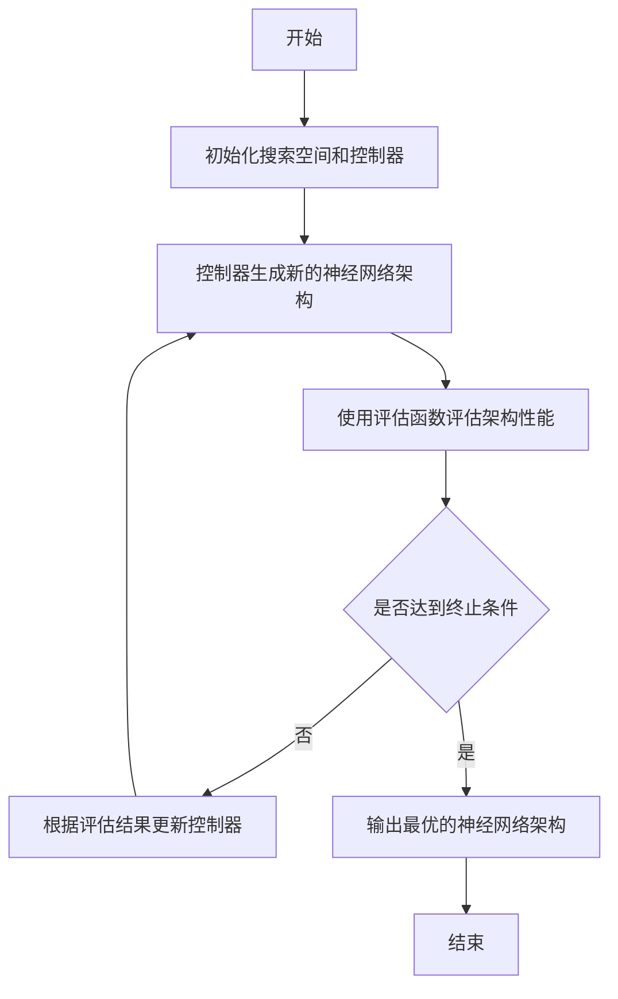

# 高效可扩展的神经架构搜索:自动化AI设计

> 关键词：神经架构搜索、高效可扩展、自动化AI设计、深度学习、搜索算法、模型优化

> 摘要：本文围绕高效可扩展的神经架构搜索（NAS）这一核心主题，深入探讨其在自动化AI设计中的应用。详细介绍了NAS的背景知识，包括目的、预期读者和相关术语。阐述了核心概念与联系，通过文本示意图和Mermaid流程图清晰展示其架构原理。对核心算法原理进行了深入分析，并给出Python源代码示例。讲解了相关的数学模型和公式，结合具体例子帮助理解。通过项目实战，展示了开发环境搭建、源代码实现与解读。探讨了实际应用场景，推荐了学习资源、开发工具框架以及相关论文著作。最后总结了未来发展趋势与挑战，解答了常见问题，并提供了扩展阅读和参考资料，旨在为读者全面呈现高效可扩展的神经架构搜索在自动化AI设计中的重要性和实现方法。

## 1. 背景介绍 
### 1.1 目的和范围
在深度学习领域，神经网络架构的设计一直是一项具有挑战性且耗时的任务，需要专家凭借丰富的经验和大量的实验来确定合适的网络结构。神经架构搜索（Neural Architecture Search，NAS）的出现为解决这一问题提供了新的思路。本文章的目的在于深入探讨高效可扩展的神经架构搜索技术，详细阐述其原理、算法、实现步骤以及在自动化AI设计中的应用。范围涵盖了从基础概念到实际项目应用的各个方面，旨在为读者提供全面且深入的了解。

### 1.2 预期读者
本文预期读者包括对深度学习和人工智能领域有一定了解的研究人员、工程师、学生以及对自动化AI设计感兴趣的技术爱好者。无论是希望深入研究神经架构搜索技术的专业人士，还是想要了解该领域最新进展的初学者，都能从本文中获得有价值的信息。

### 1.3 文档结构概述
本文首先介绍神经架构搜索的背景知识，包括目的、预期读者和相关术语。接着阐述核心概念与联系，通过文本示意图和Mermaid流程图展示其架构原理。然后详细讲解核心算法原理，并给出Python源代码示例。之后介绍相关的数学模型和公式，结合具体例子进行说明。通过项目实战，展示开发环境搭建、源代码实现与解读。探讨实际应用场景，推荐学习资源、开发工具框架以及相关论文著作。最后总结未来发展趋势与挑战，解答常见问题，并提供扩展阅读和参考资料。

### 1.4 术语表
#### 1.4.1 核心术语定义
- **神经架构搜索（Neural Architecture Search，NAS）**：一种自动化的方法，用于在给定的搜索空间中寻找最优的神经网络架构，以提高模型的性能。
- **搜索空间（Search Space）**：包含所有可能的神经网络架构的集合，NAS算法在这个空间中进行搜索。
- **评估函数（Evaluation Function）**：用于衡量一个神经网络架构性能的函数，通常使用准确率、损失值等指标。
- **控制器（Controller）**：在NAS中，控制器负责生成新的神经网络架构。
- **超参数（Hyperparameters）**：在训练神经网络之前需要设置的参数，如学习率、批量大小等。

#### 1.4.2 相关概念解释
- **自动化AI设计**：利用计算机算法自动完成AI系统的设计过程，包括神经网络架构的设计、超参数的调整等，减少人工干预，提高设计效率。
- **深度学习**：一种基于人工神经网络的机器学习方法，通过多层神经元的组合来学习数据的特征和模式。
- **模型优化**：通过调整模型的参数和架构，提高模型的性能，如准确率、召回率等。

#### 1.4.3 缩略词列表
- **NAS**：Neural Architecture Search（神经架构搜索）
- **CNN**：Convolutional Neural Network（卷积神经网络）
- **RNN**：Recurrent Neural Network（循环神经网络）
- **LSTM**：Long Short-Term Memory（长短期记忆网络）

## 2. 核心概念与联系 
神经架构搜索的核心目标是在给定的搜索空间中自动寻找最优的神经网络架构。其基本原理是通过一个控制器生成不同的神经网络架构，然后使用评估函数对这些架构进行评估，根据评估结果更新控制器，不断迭代，直到找到最优的架构。

### 文本示意图
神经架构搜索系统主要由搜索空间、控制器、评估函数和训练模块组成。搜索空间定义了所有可能的神经网络架构，控制器负责生成新的架构，评估函数对生成的架构进行性能评估，训练模块用于对架构进行训练。整个过程是一个迭代的过程，通过不断调整控制器，逐步找到最优的架构。

### Mermaid流程图


## 3. 核心算法原理 & 具体操作步骤 
### 核心算法原理
神经架构搜索的核心算法有很多种，这里以基于强化学习的NAS算法为例进行讲解。基于强化学习的NAS算法将神经架构搜索问题看作一个序列决策问题，控制器作为智能体，在搜索空间中进行探索和决策。智能体的目标是最大化评估函数的值，即找到性能最优的神经网络架构。

### 具体操作步骤
1. **初始化搜索空间和控制器**：定义搜索空间，包括所有可能的神经网络层类型、连接方式等。初始化控制器的参数。
2. **控制器生成新的神经网络架构**：控制器根据当前的状态生成一个新的神经网络架构。
3. **使用评估函数评估架构性能**：对生成的架构进行训练，并使用评估函数（如准确率）评估其性能。
4. **根据评估结果更新控制器**：根据评估结果，使用强化学习算法（如策略梯度算法）更新控制器的参数，使得控制器能够生成更优的架构。
5. **重复步骤2-4**：不断迭代，直到达到终止条件（如达到最大迭代次数或性能不再提升）。

### Python源代码示例
```python
import tensorflow as tf
import numpy as np

# 定义搜索空间
search_space = {
    'layer_types': ['conv2d', 'dense', 'max_pooling2d'],
    'num_filters': [16, 32, 64],
    'kernel_sizes': [(3, 3), (5, 5)],
    'units': [64, 128, 256]
}

# 定义控制器
class Controller(tf.keras.Model):
    def __init__(self, search_space):
        super(Controller, self).__init__()
        self.search_space = search_space
        self.fc1 = tf.keras.layers.Dense(64, activation='relu')
        self.fc2 = tf.keras.layers.Dense(len(search_space['layer_types']), activation='softmax')

    def call(self, x):
        x = self.fc1(x)
        x = self.fc2(x)
        return x

# 初始化控制器
controller = Controller(search_space)

# 定义评估函数
def evaluate_architecture(architecture):
    # 这里简单返回一个随机的准确率作为示例
    return np.random.uniform(0, 1)

# 定义训练循环
num_iterations = 100
optimizer = tf.keras.optimizers.Adam(learning_rate=0.001)

for iteration in range(num_iterations):
    # 控制器生成新的神经网络架构
    state = tf.random.normal([1, 10])
    probs = controller(state)
    action = np.random.choice(len(search_space['layer_types']), p=probs.numpy()[0])
    architecture = search_space['layer_types'][action]

    # 使用评估函数评估架构性能
    reward = evaluate_architecture(architecture)

    # 根据评估结果更新控制器
    with tf.GradientTape() as tape:
        probs = controller(state)
        log_prob = tf.math.log(probs[0, action])
        loss = -log_prob * reward

    gradients = tape.gradient(loss, controller.trainable_variables)
    optimizer.apply_gradients(zip(gradients, controller.trainable_variables))

    print(f'Iteration {iteration}: Architecture = {architecture}, Reward = {reward}')
```

## 4. 数学模型和公式 & 详细讲解 & 举例说明 
### 数学模型
基于强化学习的NAS算法可以用马尔可夫决策过程（Markov Decision Process，MDP）来建模。MDP由一个四元组 $(S, A, P, R)$ 组成，其中：
- $S$ 是状态空间，表示控制器的所有可能状态。
- $A$ 是动作空间，表示控制器可以采取的所有动作，即生成的所有可能的神经网络架构。
- $P$ 是状态转移概率，表示在当前状态下采取某个动作后转移到下一个状态的概率。
- $R$ 是奖励函数，表示在某个状态下采取某个动作后获得的奖励，即评估函数的值。

### 公式
在基于策略梯度的强化学习算法中，目标是最大化累积奖励的期望，即：
$$J(\theta) = \mathbb{E}_{\pi_{\theta}}[\sum_{t=0}^{T} r_t]$$
其中，$\theta$ 是控制器的参数，$\pi_{\theta}$ 是基于参数 $\theta$ 的策略，$r_t$ 是在时间步 $t$ 获得的奖励。

为了更新控制器的参数，使用策略梯度定理：
$$\nabla_{\theta} J(\theta) = \mathbb{E}_{\pi_{\theta}}[\nabla_{\theta} \log \pi_{\theta}(a_t | s_t) r_t]$$
其中，$\pi_{\theta}(a_t | s_t)$ 是在状态 $s_t$ 下采取动作 $a_t$ 的概率。

### 详细讲解
在NAS中，状态 $s_t$ 可以表示为当前已经生成的部分神经网络架构，动作 $a_t$ 表示要添加的下一层的类型和参数。奖励 $r_t$ 是生成的完整神经网络架构的评估结果，如准确率。通过不断更新控制器的参数 $\theta$，使得策略 $\pi_{\theta}$ 能够生成性能更优的神经网络架构。

### 举例说明
假设搜索空间中有三种层类型：卷积层、全连接层和池化层。状态 $s_t$ 表示已经生成的部分架构，如已经有一个卷积层。动作 $a_t$ 可以是添加一个全连接层。奖励 $r_t$ 是包含这个卷积层和全连接层的神经网络在测试数据集上的准确率。通过策略梯度算法更新控制器的参数，使得控制器更倾向于生成准确率更高的架构。

## 5. 项目实战：代码实际案例和详细解释说明 
### 5.1  开发环境搭建
1. **安装Python**：推荐使用Python 3.7及以上版本。
2. **安装深度学习框架**：可以选择TensorFlow或PyTorch，这里以TensorFlow为例。使用以下命令安装TensorFlow：
```sh
pip install tensorflow
```
3. **安装其他依赖库**：如NumPy、Matplotlib等，用于数据处理和可视化。
```sh
pip install numpy matplotlib
```

### 5.2  源代码详细实现和代码解读
```python
import tensorflow as tf
import numpy as np
import matplotlib.pyplot as plt

# 定义搜索空间
search_space = {
    'layer_types': ['conv2d', 'dense', 'max_pooling2d'],
    'num_filters': [16, 32, 64],
    'kernel_sizes': [(3, 3), (5, 5)],
    'units': [64, 128, 256]
}

# 定义控制器
class Controller(tf.keras.Model):
    def __init__(self, search_space):
        super(Controller, self).__init__()
        self.search_space = search_space
        self.fc1 = tf.keras.layers.Dense(64, activation='relu')
        self.fc2 = tf.keras.layers.Dense(len(search_space['layer_types']), activation='softmax')

    def call(self, x):
        x = self.fc1(x)
        x = self.fc2(x)
        return x

# 定义评估函数
def evaluate_architecture(architecture):
    # 这里简单构建一个基于架构的神经网络并训练和评估
    model = tf.keras.Sequential()
    if architecture == 'conv2d':
        model.add(tf.keras.layers.Conv2D(32, (3, 3), activation='relu', input_shape=(28, 28, 1)))
        model.add(tf.keras.layers.Flatten())
    elif architecture == 'dense':
        model.add(tf.keras.layers.Flatten(input_shape=(28, 28, 1)))
        model.add(tf.keras.layers.Dense(128, activation='relu'))
    elif architecture == 'max_pooling2d':
        model.add(tf.keras.layers.Conv2D(32, (3, 3), activation='relu', input_shape=(28, 28, 1)))
        model.add(tf.keras.layers.MaxPooling2D((2, 2)))
        model.add(tf.keras.layers.Flatten())

    model.add(tf.keras.layers.Dense(10, activation='softmax'))

    model.compile(optimizer='adam',
                  loss='sparse_categorical_crossentropy',
                  metrics=['accuracy'])

    (x_train, y_train), (x_test, y_test) = tf.keras.datasets.mnist.load_data()
    x_train = x_train.reshape(-1, 28, 28, 1).astype('float32') / 255.0
    x_test = x_test.reshape(-1, 28, 28, 1).astype('float32') / 255.0

    model.fit(x_train, y_train, epochs=1, batch_size=32, verbose=0)
    _, accuracy = model.evaluate(x_test, y_test, verbose=0)
    return accuracy

# 初始化控制器
controller = Controller(search_space)

# 定义训练循环
num_iterations = 10
optimizer = tf.keras.optimizers.Adam(learning_rate=0.001)
rewards = []

for iteration in range(num_iterations):
    # 控制器生成新的神经网络架构
    state = tf.random.normal([1, 10])
    probs = controller(state)
    action = np.random.choice(len(search_space['layer_types']), p=probs.numpy()[0])
    architecture = search_space['layer_types'][action]

    # 使用评估函数评估架构性能
    reward = evaluate_architecture(architecture)
    rewards.append(reward)

    # 根据评估结果更新控制器
    with tf.GradientTape() as tape:
        probs = controller(state)
        log_prob = tf.math.log(probs[0, action])
        loss = -log_prob * reward

    gradients = tape.gradient(loss, controller.trainable_variables)
    optimizer.apply_gradients(zip(gradients, controller.trainable_variables))

    print(f'Iteration {iteration}: Architecture = {architecture}, Reward = {reward}')

# 绘制奖励曲线
plt.plot(rewards)
plt.xlabel('Iteration')
plt.ylabel('Reward')
plt.title('Reward over Iterations')
plt.show()
```

### 5.3  代码解读与分析
1. **搜索空间定义**：`search_space` 字典定义了所有可能的神经网络层类型和参数。
2. **控制器定义**：`Controller` 类是一个简单的神经网络，用于生成新的神经网络架构。
3. **评估函数**：`evaluate_architecture` 函数根据生成的架构构建一个神经网络，使用MNIST数据集进行训练和评估，返回准确率作为奖励。
4. **训练循环**：在每个迭代中，控制器生成一个新的架构，评估其性能，根据奖励更新控制器的参数。
5. **奖励曲线绘制**：使用Matplotlib绘制奖励随迭代次数的变化曲线，直观展示训练过程中性能的提升。

## 6. 实际应用场景 
### 图像分类
在图像分类任务中，高效可扩展的神经架构搜索可以自动寻找最优的卷积神经网络架构，提高图像分类的准确率。例如，在ImageNet图像分类竞赛中，使用NAS技术的模型取得了很好的成绩。

### 目标检测
在目标检测任务中，NAS可以帮助设计更高效的目标检测网络架构，提高检测的速度和精度。例如，YOLO系列目标检测算法可以通过NAS进行优化。

### 自然语言处理
在自然语言处理任务中，如文本分类、机器翻译等，NAS可以自动搜索最优的循环神经网络或Transformer架构，提升模型的性能。

### 医疗影像分析
在医疗影像分析中，NAS可以用于设计适合医学图像特点的神经网络架构，辅助医生进行疾病诊断。

## 7. 工具和资源推荐
### 7.1 学习资源推荐
#### 7.1.1 书籍推荐
- 《深度学习》（Deep Learning）：由Ian Goodfellow、Yoshua Bengio和Aaron Courville撰写，是深度学习领域的经典教材。
- 《动手学深度学习》（Dive into Deep Learning）：开源的深度学习教材，提供了丰富的代码示例和详细的讲解。

#### 7.1.2 在线课程
- Coursera上的“深度学习专项课程”（Deep Learning Specialization）：由Andrew Ng教授授课，系统地介绍了深度学习的各个方面。
- edX上的“使用Python进行深度学习”（Deep Learning with Python）：提供了实践项目和案例分析。

#### 7.1.3 技术