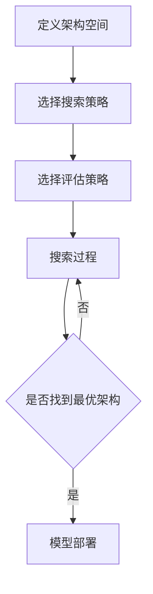

# 高效可扩展的神经架构搜索在边缘AI中的实现

> 关键词：神经架构搜索、边缘AI、高效可扩展、模型优化、自动化设计

> 摘要：本文聚焦于高效可扩展的神经架构搜索在边缘AI中的实现。首先介绍了相关背景，包括目的范围、预期读者等。接着阐述了神经架构搜索和边缘AI的核心概念及联系，给出了原理和架构的文本示意图与Mermaid流程图。详细讲解了核心算法原理并给出Python代码示例，介绍了相关数学模型和公式。通过项目实战，展示了代码实际案例及详细解释。分析了实际应用场景，推荐了学习资源、开发工具框架和相关论文著作。最后总结了未来发展趋势与挑战，并给出常见问题解答和扩展阅读参考资料，旨在为开发者和研究者提供全面的技术指导，推动神经架构搜索在边缘AI领域的应用和发展。

## 1. 背景介绍 
### 1.1 目的和范围
随着人工智能技术的飞速发展，边缘AI逐渐成为研究和应用的热点。边缘AI旨在将人工智能计算能力推向网络边缘设备，如智能手机、智能摄像头、物联网传感器等，以实现实时、高效的数据处理和决策。然而，边缘设备通常具有有限的计算资源、存储容量和能源供应，这对深度学习模型的设计和部署提出了巨大挑战。

神经架构搜索（Neural Architecture Search, NAS）作为一种自动化的深度学习模型设计方法，能够在大规模的架构空间中搜索最优的神经网络架构，从而提高模型的性能和效率。本文章的目的是探讨如何在边缘AI环境中实现高效可扩展的神经架构搜索，以设计出适合边缘设备的轻量级、高性能深度学习模型。

本文的范围涵盖了神经架构搜索的基本概念、核心算法原理、数学模型、实际应用场景，以及在边缘AI中实现高效可扩展搜索的具体方法和技术。同时，通过项目实战案例展示了如何将这些理论和方法应用到实际开发中。

### 1.2 预期读者
本文的预期读者包括人工智能领域的研究者、深度学习工程师、边缘计算开发者以及对神经架构搜索和边缘AI感兴趣的技术爱好者。对于有一定深度学习基础的读者，本文将提供深入的技术分析和实践指导；对于初学者，本文将从基本概念入手，逐步引导读者理解神经架构搜索在边缘AI中的应用原理和方法。

### 1.3 文档结构概述
本文的文档结构如下：
- 核心概念与联系：介绍神经架构搜索和边缘AI的核心概念，以及它们之间的联系，并给出原理和架构的文本示意图与Mermaid流程图。
- 核心算法原理 & 具体操作步骤：详细讲解神经架构搜索的核心算法原理，并使用Python源代码进行阐述。
- 数学模型和公式 & 详细讲解 & 举例说明：介绍神经架构搜索中的数学模型和公式，并通过具体例子进行详细讲解。
- 项目实战：代码实际案例和详细解释说明：通过一个实际项目案例，展示如何在边缘AI中实现高效可扩展的神经架构搜索，并对代码进行详细解读。
- 实际应用场景：分析神经架构搜索在边缘AI中的实际应用场景。
- 工具和资源推荐：推荐学习资源、开发工具框架和相关论文著作。
- 总结：未来发展趋势与挑战：总结神经架构搜索在边缘AI中的发展趋势和面临的挑战。
- 附录：常见问题与解答：解答读者在学习和实践过程中可能遇到的常见问题。
- 扩展阅读 & 参考资料：提供相关的扩展阅读材料和参考资料。

### 1.4 术语表
#### 1.4.1 核心术语定义
- **神经架构搜索（Neural Architecture Search, NAS）**：一种自动化的深度学习模型设计方法，通过在大规模的架构空间中搜索最优的神经网络架构，以提高模型的性能和效率。
- **边缘AI（Edge AI）**：将人工智能计算能力推向网络边缘设备，实现实时、高效的数据处理和决策的技术。
- **架构空间（Architecture Space）**：所有可能的神经网络架构的集合。
- **搜索策略（Search Strategy）**：在架构空间中搜索最优架构的方法，如随机搜索、遗传算法、强化学习等。
- **评估策略（Evaluation Strategy）**：评估每个候选架构性能的方法，如使用验证集进行交叉验证。
- **轻量级模型（Lightweight Model）**：具有较少参数和计算量的深度学习模型，适合在边缘设备上部署。

#### 1.4.2 相关概念解释
- **深度学习（Deep Learning）**：一种基于人工神经网络的机器学习方法，通过构建多层神经网络来学习数据的特征和模式。
- **卷积神经网络（Convolutional Neural Network, CNN）**：一种专门用于处理具有网格结构数据（如图像、音频）的深度学习模型。
- **循环神经网络（Recurrent Neural Network, RNN）**：一种用于处理序列数据的深度学习模型，具有记忆功能。
- **强化学习（Reinforcement Learning）**：一种通过智能体与环境进行交互，根据环境反馈的奖励信号来学习最优策略的机器学习方法。

#### 1.4.3 缩略词列表
- **NAS**：Neural Architecture Search
- **AI**：Artificial Intelligence
- **CNN**：Convolutional Neural Network
- **RNN**：Recurrent Neural Network
- **RL**：Reinforcement Learning

## 2. 核心概念与联系 
### 2.1 神经架构搜索的核心概念
神经架构搜索的目标是在给定的架构空间中找到最优的神经网络架构，以最大化模型在特定任务上的性能。架构空间通常由一系列的操作（如卷积、池化、全连接等）和它们的连接方式组成。搜索策略用于在架构空间中探索不同的架构，而评估策略则用于评估每个候选架构的性能。

### 2.2 边缘AI的核心概念
边缘AI旨在将人工智能计算能力推向网络边缘设备，以减少数据传输延迟、提高数据隐私性和降低云端计算压力。边缘设备通常具有有限的计算资源、存储容量和能源供应，因此需要设计轻量级、高性能的深度学习模型。

### 2.3 神经架构搜索与边缘AI的联系
神经架构搜索为边缘AI提供了一种自动化的模型设计方法，能够在大规模的架构空间中搜索适合边缘设备的轻量级、高性能深度学习模型。通过神经架构搜索，可以优化模型的结构和参数，减少模型的计算量和存储需求，从而提高模型在边缘设备上的运行效率和性能。

### 2.4 核心概念原理和架构的文本示意图
神经架构搜索在边缘AI中的实现原理可以概括为以下几个步骤：
1. **定义架构空间**：确定所有可能的神经网络架构的集合。
2. **选择搜索策略**：在架构空间中搜索最优架构的方法。
3. **选择评估策略**：评估每个候选架构性能的方法。
4. **搜索过程**：使用搜索策略在架构空间中探索不同的架构，并使用评估策略评估每个候选架构的性能。
5. **模型部署**：将搜索到的最优架构部署到边缘设备上。

### 2.5 Mermaid流程图


## 3. 核心算法原理 & 具体操作步骤 
### 3.1 随机搜索算法原理
随机搜索是一种简单而有效的神经架构搜索算法，其原理是在架构空间中随机采样候选架构，并评估每个候选架构的性能。具体步骤如下：
1. 初始化架构空间。
2. 随机采样一个候选架构。
3. 评估候选架构的性能。
4. 重复步骤2和3，直到达到最大搜索次数或找到满意的架构。

### 3.2 Python代码实现
```python
import random

# 定义架构空间
architecture_space = [
    [3, 3, 64],  # [卷积核大小, 卷积核大小, 通道数]
    [5, 5, 128],
    [1, 1, 32]
]

# 定义评估函数
def evaluate_architecture(architecture):
    # 这里简单模拟评估过程，实际应用中需要使用验证集进行评估
    return random.random()

# 随机搜索算法
def random_search(max_search_times):
    best_architecture = None
    best_score = -float('inf')
    for _ in range(max_search_times):
        # 随机采样一个候选架构
        architecture = random.choice(architecture_space)
        # 评估候选架构的性能
        score = evaluate_architecture(architecture)
        if score > best_score:
            best_score = score
            best_architecture = architecture
    return best_architecture

# 执行随机搜索
max_search_times = 10
best_architecture = random_search(max_search_times)
print("Best architecture:", best_architecture)
```

### 3.3 代码解释
- `architecture_space`：定义了架构空间，包含了所有可能的神经网络架构。
- `evaluate_architecture`：评估函数，用于评估每个候选架构的性能。
- `random_search`：随机搜索算法的实现，通过随机采样候选架构并评估其性能，找到最优架构。
- `max_search_times`：最大搜索次数，控制搜索的终止条件。

## 4. 数学模型和公式 & 详细讲解 & 举例说明 
### 4.1 搜索目标函数
神经架构搜索的目标是在架构空间 $\mathcal{A}$ 中找到最优的架构 $a^*$，使得模型在特定任务上的性能指标 $J(a)$ 最大化，即：
$$a^* = \arg\max_{a \in \mathcal{A}} J(a)$$
其中，$J(a)$ 可以是分类准确率、均方误差等性能指标。

### 4.2 搜索过程的数学描述
随机搜索算法可以用以下数学公式描述：
1. 初始化搜索次数 $t = 0$。
2. 重复以下步骤直到 $t = T$（最大搜索次数）：
   - 随机采样一个候选架构 $a_t \sim P(\mathcal{A})$，其中 $P(\mathcal{A})$ 是架构空间 $\mathcal{A}$ 上的概率分布。
   - 评估候选架构的性能 $J(a_t)$。
   - 如果 $J(a_t) > J(a_{best})$，则更新最优架构 $a_{best} = a_t$。
   - $t = t + 1$。

### 4.3 举例说明
假设架构空间 $\mathcal{A} = \{a_1, a_2, a_3\}$，性能指标 $J(a)$ 分别为 $J(a_1) = 0.8$，$J(a_2) = 0.9$，$J(a_3) = 0.7$。随机搜索算法的搜索过程如下：
1. 初始化 $t = 0$，$a_{best} = None$，$J(a_{best}) = -\infty$。
2. 第一次搜索：随机采样 $a_1$，评估 $J(a_1) = 0.8$，由于 $0.8 > -\infty$，更新 $a_{best} = a_1$，$J(a_{best}) = 0.8$，$t = 1$。
3. 第二次搜索：随机采样 $a_2$，评估 $J(a_2) = 0.9$，由于 $0.9 > 0.8$，更新 $a_{best} = a_2$，$J(a_{best}) = 0.9$，$t = 2$。
4. 第三次搜索：随机采样 $a_3$，评估 $J(a_3) = 0.7$，由于 $0.7 < 0.9$，不更新 $a_{best}$，$t = 3$。
5. 搜索结束，最优架构为 $a_{best} = a_2$。

## 5. 项目实战：代码实际案例和详细解释说明 
### 5.1 开发环境搭建
在本项目中，我们使用Python和PyTorch深度学习框架进行开发。以下是开发环境的搭建步骤：
1. 安装Python 3.7或以上版本。
2. 安装PyTorch和torchvision：
```bash
pip install torch torchvision
```
3. 安装其他必要的库，如numpy、matplotlib等：
```bash
pip install numpy matplotlib
```

### 5.2 源代码详细实现和代码解读
#### 5.2.1 定义架构空间
```python
import torch
import torch.nn as nn

# 定义架构空间
architecture_space = [
    [nn.Conv2d(3, 64, kernel_size=3, padding=1), nn.ReLU()],
    [nn.Conv2d(3, 128, kernel_size=5, padding=2), nn.ReLU()],
    [nn.Conv2d(3, 32, kernel_size=1), nn.ReLU()]
]
```
这段代码定义了一个简单的架构空间，包含了三种不同的卷积层和激活函数的组合。

#### 5.2.2 定义评估函数
```python
import torch.optim as optim
from torchvision import datasets, transforms

# 定义评估函数
def evaluate_architecture(architecture):
    # 定义模型
    model = nn.Sequential(*architecture)
    # 定义损失函数和优化器
    criterion = nn.CrossEntropyLoss()
    optimizer = optim.SGD(model.parameters(), lr=0.001, momentum=0.9)
    # 加载数据集
    transform = transforms.Compose([
        transforms.ToTensor(),
        transforms.Normalize((0.5, 0.5, 0.5), (0.5, 0.5, 0.5))
    ])
    trainset = datasets.CIFAR10(root='./data', train=True,
                                download=True, transform=transform)
    trainloader = torch.utils.data.DataLoader(trainset, batch_size=4,
                                              shuffle=True, num_workers=2)
    # 训练模型
    for epoch in range(2):  # 训练2个epoch
        running_loss = 0.0
        for i, data in enumerate(trainloader, 0):
            inputs, labels = data
            optimizer.zero_grad()
            outputs = model(inputs)
            loss = criterion(outputs, labels)
            loss.backward()
            optimizer.step()
            running_loss += loss.item()
    # 评估模型
    testset = datasets.CIFAR10(root='./data', train=False,
                               download=True, transform=transform)
    testloader = torch.utils.data.DataLoader(testset, batch_size=4,
                                             shuffle=False, num_workers=2)
    correct = 0
    total = 0
    with torch.no_grad():
        for data in testloader:
            images, labels = data
            outputs = model(images)
            _, predicted = torch.max(outputs.data, 1)
            total += labels.size(0)
            correct += (predicted == labels).sum().item()
    accuracy = 100 * correct / total
    return accuracy
```
这段代码定义了一个评估函数，用于评估每个候选架构的性能。具体步骤包括定义模型、损失函数和优化器，加载数据集，训练模型和评估模型的准确率。

#### 5.2.3 随机搜索算法
```python
# 随机搜索算法
def random_search(max_search_times):
    best_architecture = None
    best_accuracy = -float('inf')
    for _ in range(max_search_times):
        # 随机采样一个候选架构
        architecture = random.choice(architecture_space)
        # 评估候选架构的性能
        accuracy = evaluate_architecture(architecture)
        if accuracy > best_accuracy:
            best_accuracy = accuracy
            best_architecture = architecture
    return best_architecture, best_accuracy

# 执行随机搜索
max_search_times = 3
best_architecture, best_accuracy = random_search(max_search_times)
print("Best architecture:", best_architecture)
print("Best accuracy:", best_accuracy)
```
这段代码实现了随机搜索算法，通过随机采样候选架构并评估其性能，找到最优架构和对应的准确率。

### 5.3 代码解读与分析
- **架构空间定义**：通过定义不同的卷积层和激活函数的组合，形成了一个简单的架构空间。
- **评估函数**：使用CIFAR-10数据集进行模型的训练和评估，通过计算准确率来评估每个候选架构的性能。
- **随机搜索算法**：在架构空间中随机采样候选架构，并使用评估函数评估其性能，找到最优架构。

需要注意的是，本项目只是一个简单的示例，实际应用中需要根据具体需求和场景进行调整和优化。

## 6. 实际应用场景 
### 6.1 智能摄像头
在智能摄像头中，边缘AI可以实现实时的目标检测、人脸识别等功能。通过神经架构搜索，可以设计出适合智能摄像头的轻量级、高性能深度学习模型，减少数据传输延迟，提高处理效率。

### 6.2 智能手机
在智能手机中，边缘AI可以实现语音识别、图像美化等功能。神经架构搜索可以帮助设计出适合智能手机的模型，降低功耗，提高用户体验。

### 6.3 物联网传感器
在物联网传感器中，边缘AI可以实现数据的实时处理和分析。通过神经架构搜索，可以设计出适合物联网传感器的轻量级模型，减少通信成本，提高系统的可靠性。

## 7. 工具和资源推荐
### 7.1 学习资源推荐
#### 7.1.1 书籍推荐
- 《深度学习》（Deep Learning）：由Ian Goodfellow、Yoshua Bengio和Aaron Courville所著，是深度学习领域的经典教材。
- 《动手学深度学习》（Dive into Deep Learning）：由李沐等人所著，提供了丰富的代码示例和实践指导。

#### 7.1.2 在线课程
- Coursera上的“深度学习专项课程”（Deep Learning Specialization）：由Andrew Ng教授授课，涵盖了深度学习的各个方面。
- edX上的“强化学习基础”（Foundations of Reinforcement Learning）：介绍了强化学习的基本概念和算法。

#### 7.1.3 技术博客和网站
- Medium上的Towards Data Science：提供了大量关于数据科学和人工智能的文章和教程。
- arXiv.org：预印本论文平台，可获取最新的研究成果。

### 7.2 开发工具框架推荐
#### 7.2.1 IDE和编辑器
- PyCharm：功能强大的Python集成开发环境，提供了丰富的代码编辑、调试和分析工具。
- Jupyter Notebook：交互式笔记本，适合进行数据探索和模型开发。

#### 7.2.2 调试和性能分析工具
- TensorBoard：TensorFlow的可视化工具，可用于查看模型的训练过程和性能指标。
- PyTorch Profiler：PyTorch的性能分析工具，可用于分析模型的运行时间和内存使用情况。

#### 7.2.3 相关框架和库
- PyTorch：开源的深度学习框架，提供了丰富的神经网络层和优化算法。
- NASLib：用于神经架构搜索的开源库，提供了多种搜索策略和评估方法。

### 7.3 相关论文著作推荐
#### 7.3.1 经典论文
- 《Neural Architecture Search with Reinforcement Learning》：提出了使用强化学习进行神经架构搜索的方法。
- 《Efficient Neural Architecture Search via Parameter Sharing》：提出了基于参数共享的高效神经架构搜索方法。

#### 7.3.2 最新研究成果
- 《Once for All: Train One Network and Specialize it for Efficient Deployment》：提出了一次性训练多个架构的方法，提高了搜索效率。
- 《AutoML-Zero: Evolving Machine Learning Algorithms From Scratch》：探索了从无到有自动进化机器学习算法的方法。

#### 7.3.3 应用案例分析
- 《Edge AI: Opportunities and Challenges》：分析了边缘AI的应用场景和面临的挑战。
- 《Neural Architecture Search for Edge Devices: A Survey》：对边缘设备上的神经架构搜索进行了综述。

## 8. 总结：未来发展趋势与挑战
### 8.1 未来发展趋势
- **高效搜索算法**：未来的研究将致力于开发更高效的神经架构搜索算法，减少搜索时间和计算资源的消耗。
- **多目标优化**：除了模型性能，还将考虑模型的计算复杂度、内存占用等多个目标进行优化，以设计出更适合边缘设备的模型。
- **自动化设计流程**：将神经架构搜索与其他自动化机器学习技术相结合，实现从数据预处理到模型部署的全自动化设计流程。

### 8.2 挑战
- **搜索空间的爆炸性增长**：随着神经网络架构的不断复杂，搜索空间也会爆炸性增长，如何有效地探索大规模搜索空间是一个挑战。
- **评估成本**：评估每个候选架构的性能需要大量的计算资源和时间，如何降低评估成本是一个关键问题。
- **模型可解释性**：神经架构搜索设计出的模型通常比较复杂，如何提高模型的可解释性是一个需要解决的问题。

## 9. 附录：常见问题与解答
### 9.1 什么是神经架构搜索？
神经架构搜索是一种自动化的深度学习模型设计方法，通过在大规模的架构空间中搜索最优的神经网络架构，以提高模型的性能和效率。

### 9.2 为什么需要在边缘AI中使用神经架构搜索？
边缘设备通常具有有限的计算资源、存储容量和能源供应，神经架构搜索可以帮助设计出适合边缘设备的轻量级、高性能深度学习模型，减少模型的计算量和存储需求，提高模型在边缘设备上的运行效率和性能。

### 9.3 神经架构搜索有哪些常见的搜索策略？
常见的搜索策略包括随机搜索、遗传算法、强化学习等。

### 9.4 如何评估神经架构搜索得到的模型性能？
通常使用验证集进行交叉验证，计算模型在验证集上的性能指标，如分类准确率、均方误差等。

### 9.5 神经架构搜索在实际应用中有哪些挑战？
主要挑战包括搜索空间的爆炸性增长、评估成本高、模型可解释性差等。

## 10. 扩展阅读 & 参考资料
### 10.1 扩展阅读
- 《AutoML: A Survey of the State-of-the-Art》：对自动化机器学习进行了全面的综述。
- 《Edge Computing: Vision and Challenges》：深入探讨了边缘计算的愿景和面临的挑战。

### 10.2 参考资料
- 《Neural Architecture Search: A Survey》：神经架构搜索领域的经典综述论文。
- 《Edge AI: Enabling Intelligent Applications at the Network Edge》：介绍了边缘AI的技术和应用。

作者：AI天才研究院/AI Genius Institute & 禅与计算机程序设计艺术 /Zen And The Art of Computer Programming