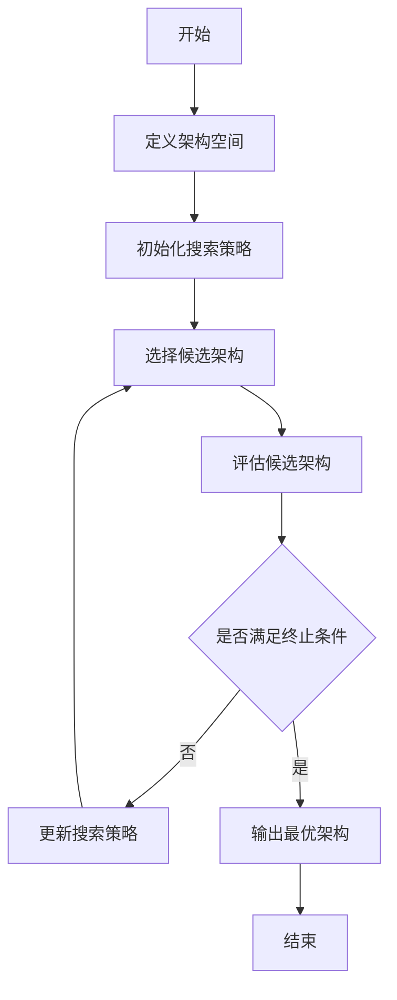

# 高效神经架构搜索算法研究

> 关键词：神经架构搜索、高效算法、自动化机器学习、深度学习、模型优化、搜索策略、计算资源

> 摘要：本文聚焦于高效神经架构搜索（NAS）算法的研究。随着深度学习的发展，手动设计神经网络架构变得愈发困难且效率低下，NAS 应运而生，旨在自动化地搜索出最优的神经网络架构。文章首先介绍了 NAS 的背景，包括其目的、预期读者、文档结构和相关术语。接着阐述了 NAS 的核心概念与联系，给出原理和架构的文本示意图及 Mermaid 流程图。详细讲解了核心算法原理，并使用 Python 源代码进行说明。同时介绍了相关的数学模型和公式，且举例说明。通过项目实战，展示了代码的实际案例并进行详细解释。分析了 NAS 的实际应用场景，推荐了学习、开发相关的工具和资源，包括书籍、在线课程、技术博客、IDE 等。最后总结了 NAS 的未来发展趋势与挑战，解答常见问题，并提供扩展阅读和参考资料，为研究和应用 NAS 算法的人员提供全面且深入的技术指导。

## 1. 背景介绍 
### 1.1 目的和范围
在深度学习领域，神经网络架构的设计对模型的性能起着关键作用。传统上，神经网络架构的设计依赖于领域专家的经验和试错，这不仅耗时费力，而且往往难以找到最优的架构。神经架构搜索（NAS）的出现旨在自动化这一过程，通过搜索算法在架构空间中寻找性能最优的神经网络架构。本文的目的在于深入研究高效的 NAS 算法，探讨其核心原理、算法实现、实际应用等方面，范围涵盖 NAS 算法的理论基础、算法细节、实战案例以及未来发展趋势等内容。

### 1.2 预期读者
本文预期读者包括对深度学习和自动化机器学习感兴趣的研究人员、工程师、学生等。对于想要了解如何自动化设计神经网络架构的初学者，本文可以作为入门指南，帮助他们理解 NAS 的基本概念和方法；对于有一定经验的研究人员和工程师，本文深入的算法分析和实战案例可以为他们的研究和开发工作提供参考和启发。

### 1.3 文档结构概述
本文共分为十个部分。第一部分是背景介绍，阐述研究目的、预期读者、文档结构和相关术语。第二部分介绍核心概念与联系，包括 NAS 的原理和架构，通过文本示意图和 Mermaid 流程图进行展示。第三部分详细讲解核心算法原理，并使用 Python 源代码进行说明。第四部分介绍相关的数学模型和公式，并举例说明。第五部分是项目实战，包括开发环境搭建、源代码实现和代码解读。第六部分分析 NAS 的实际应用场景。第七部分推荐学习、开发相关的工具和资源。第八部分总结 NAS 的未来发展趋势与挑战。第九部分是附录，解答常见问题。第十部分提供扩展阅读和参考资料。

### 1.4 术语表
#### 1.4.1 核心术语定义
- **神经架构搜索（Neural Architecture Search，NAS）**：一种自动化的方法，用于在给定的架构空间中搜索最优的神经网络架构，以提高模型在特定任务上的性能。
- **架构空间（Architecture Space）**：所有可能的神经网络架构的集合，NAS 算法在这个空间中进行搜索。
- **搜索策略（Search Strategy）**：用于在架构空间中探索不同架构的方法，如随机搜索、遗传算法、强化学习等。
- **评估策略（Evaluation Strategy）**：用于评估搜索到的架构性能的方法，如训练模型并在验证集上进行测试。
- **超网络（Supernet）**：一种包含多个子网络的大型网络，通过共享参数的方式可以快速评估不同子网络的性能。

#### 1.4.2 相关概念解释
- **自动化机器学习（AutoML）**：是一个广泛的领域，旨在自动化机器学习模型的设计、训练和调优过程。NAS 是 AutoML 的一个重要分支，专注于神经网络架构的自动化设计。
- **元学习（Meta - Learning）**：一种学习如何学习的方法，通过在多个任务上进行训练，使模型能够快速适应新的任务。在 NAS 中，元学习可以用于加速搜索过程。

#### 1.4.3 缩略词列表
- **NAS**：Neural Architecture Search（神经架构搜索）
- **CNN**：Convolutional Neural Network（卷积神经网络）
- **RNN**：Recurrent Neural Network（循环神经网络）
- **GPU**：Graphics Processing Unit（图形处理器）
- **TPU**：Tensor Processing Unit（张量处理器）

## 2. 核心概念与联系 
### 核心概念原理
神经架构搜索（NAS）的核心原理是在一个预定义的架构空间中，通过某种搜索策略探索不同的神经网络架构，并使用评估策略对这些架构的性能进行评估，最终找到性能最优的架构。

架构空间定义了所有可能的神经网络架构的集合，它可以由不同的层类型（如卷积层、全连接层、循环层等）、层的数量、层的参数（如卷积核大小、步长等）等因素来确定。搜索策略则是在这个架构空间中进行探索的方法，它决定了如何选择下一个要评估的架构。评估策略用于计算搜索到的架构在特定任务上的性能，通常是通过训练模型并在验证集上进行测试来实现的。

### 架构的文本示意图
NAS 系统主要由三个部分组成：架构空间、搜索策略和评估策略。其工作流程如下：
1. 搜索策略从架构空间中选择一个或多个候选架构。
2. 评估策略对这些候选架构进行性能评估，得到相应的性能指标（如准确率、损失值等）。
3. 搜索策略根据性能指标更新搜索方向，继续选择下一批候选架构。
4. 重复步骤 1 - 3，直到满足终止条件（如达到最大搜索次数、性能不再提升等）。

### Mermaid 流程图


## 3. 核心算法原理 & 具体操作步骤 
### 核心算法原理
常见的 NAS 搜索策略包括随机搜索、遗传算法、强化学习等。这里以强化学习为例，介绍其核心算法原理。

强化学习是一种通过智能体与环境进行交互来学习最优策略的方法。在 NAS 中，智能体可以看作是一个控制器，它的任务是生成神经网络架构。环境则是评估策略，它根据智能体生成的架构返回相应的奖励（如准确率）。智能体的目标是通过不断与环境交互，学习到一种能够生成高性能架构的策略。

具体来说，智能体使用一个循环神经网络（RNN）作为控制器，它的输入是之前生成的架构信息，输出是下一层的架构参数（如层类型、层的参数等）。智能体生成一个完整的架构后，将其传递给环境进行评估，环境返回一个奖励值。智能体根据奖励值更新自己的参数，以提高生成高性能架构的概率。

### 具体操作步骤
1. **定义架构空间**：确定所有可能的神经网络架构的集合，包括层类型、层的数量、层的参数等。
2. **初始化智能体**：使用一个 RNN 作为控制器，并随机初始化其参数。
3. **训练智能体**：
    - 智能体生成一个神经网络架构。
    - 评估策略对该架构进行性能评估，得到奖励值。
    - 智能体根据奖励值更新自己的参数，使用强化学习算法（如 REINFORCE 算法）。
4. **重复步骤 3**：直到满足终止条件（如达到最大训练步数、性能不再提升等）。
5. **输出最优架构**：从训练过程中生成的所有架构中，选择性能最优的架构作为最终结果。

### Python 源代码实现
```python
import torch
import torch.nn as nn
import torch.optim as optim
import numpy as np

# 定义架构空间
architecture_space = {
    'layer_types': ['conv', 'fc'],
    'conv_kernel_sizes': [3, 5],
    'fc_units': [64, 128]
}

# 定义智能体（控制器）
class Controller(nn.Module):
    def __init__(self):
        super(Controller, self).__init__()
        self.rnn = nn.RNN(input_size=10, hidden_size=20, num_layers=1)
        self.fc_layer_type = nn.Linear(20, len(architecture_space['layer_types']))
        self.fc_conv_kernel_size = nn.Linear(20, len(architecture_space['conv_kernel_sizes']))
        self.fc_fc_units = nn.Linear(20, len(architecture_space['fc_units']))

    def forward(self, x):
        output, _ = self.rnn(x)
        layer_type_logits = self.fc_layer_type(output[-1])
        conv_kernel_size_logits = self.fc_conv_kernel_size(output[-1])
        fc_units_logits = self.fc_fc_units(output[-1])
        return layer_type_logits, conv_kernel_size_logits, fc_units_logits

# 定义评估策略（简单示例）
def evaluate_architecture(architecture):
    # 这里简单返回一个随机奖励值，实际应用中需要训练模型并在验证集上测试
    return np.random.rand()

# 初始化智能体
controller = Controller()
optimizer = optim.Adam(controller.parameters(), lr=0.001)

# 训练智能体
num_steps = 100
for step in range(num_steps):
    # 生成架构
    input_x = torch.randn(1, 1, 10)
    layer_type_logits, conv_kernel_size_logits, fc_units_logits = controller(input_x)
    layer_type_probs = torch.softmax(layer_type_logits, dim=0)
    conv_kernel_size_probs = torch.softmax(conv_kernel_size_logits, dim=0)
    fc_units_probs = torch.softmax(fc_units_logits, dim=0)
    layer_type_index = torch.multinomial(layer_type_probs, 1).item()
    layer_type = architecture_space['layer_types'][layer_type_index]
    if layer_type == 'conv':
        conv_kernel_size_index = torch.multinomial(conv_kernel_size_probs, 1).item()
        conv_kernel_size = architecture_space['conv_kernel_sizes'][conv_kernel_size_index]
        architecture = (layer_type, conv_kernel_size)
    else:
        fc_units_index = torch.multinomial(fc_units_probs, 1).item()
        fc_units = architecture_space['fc_units'][fc_units_index]
        architecture = (layer_type, fc_units)

    # 评估架构
    reward = evaluate_architecture(architecture)

    # 计算损失并更新参数
    log_prob_layer_type = torch.log(layer_type_probs[layer_type_index])
    if layer_type == 'conv':
        log_prob_kernel_size = torch.log(conv_kernel_size_probs[conv_kernel_size_index])
        loss = -log_prob_layer_type * reward - log_prob_kernel_size * reward
    else:
        log_prob_fc_units = torch.log(fc_units_probs[fc_units_index])
        loss = -log_prob_layer_type * reward - log_prob_fc_units * reward
    optimizer.zero_grad()
    loss.backward()
    optimizer.step()

    print(f'Step {step}: Reward = {reward}')
```

## 4. 数学模型和公式 & 详细讲解 & 举例说明 
### 数学模型
在强化学习的 NAS 算法中，智能体的目标是最大化长期累积奖励。设智能体在时间步 $t$ 生成的架构为 $\pi_t$，环境返回的奖励为 $r_t$，则长期累积奖励 $R$ 可以表示为：

$$R = \sum_{t=0}^{T} \gamma^t r_t$$

其中，$\gamma \in [0, 1]$ 是折扣因子，用于平衡近期奖励和远期奖励的重要性，$T$ 是终止时间步。

智能体的策略 $\theta$ 定义了在给定状态下生成架构的概率分布 $p(\pi_t | s_t; \theta)$，其中 $s_t$ 是时间步 $t$ 的状态。智能体的目标是找到最优策略 $\theta^*$，使得长期累积奖励的期望最大，即：

$$\theta^* = \arg\max_{\theta} \mathbb{E}_{p(\pi_t | s_t; \theta)} [R]$$

### 详细讲解
为了求解最优策略 $\theta^*$，可以使用基于梯度的优化方法。具体来说，通过计算长期累积奖励的期望对策略参数 $\theta$ 的梯度 $\nabla_{\theta} \mathbb{E}_{p(\pi_t | s_t; \theta)} [R]$，并使用梯度上升算法更新策略参数。

根据 REINFORCE 算法，梯度可以表示为：

$$\nabla_{\theta} \mathbb{E}_{p(\pi_t | s_t; \theta)} [R] \approx \sum_{t=0}^{T} \nabla_{\theta} \log p(\pi_t | s_t; \theta) R$$

其中，$\log p(\pi_t | s_t; \theta)$ 是策略的对数概率。

### 举例说明
假设智能体在三个时间步内生成架构，折扣因子 $\gamma = 0.9$，每个时间步的奖励分别为 $r_0 = 0.5$，$r_1 = 0.6$，$r_2 = 0.7$。则长期累积奖励为：

$$R = r_0 + \gamma r_1 + \gamma^2 r_2 = 0.5 + 0.9 \times 0.6 + 0.9^2 \times 0.7 = 0.5 + 0.54 + 0.567 = 1.607$$

假设在某个时间步 $t$，智能体生成架构 $\pi_t$ 的概率为 $p(\pi_t | s_t; \theta) = 0.3$，则对数概率为 $\log p(\pi_t | s_t; \theta) = \log 0.3 \approx -1.204$。如果使用 REINFORCE 算法更新策略参数，梯度的一部分为 $\nabla_{\theta} \log p(\pi_t | s_t; \theta) R \approx -1.204 \times 1.607 \approx -1.935$。

## 5. 项目实战：代码实际案例和详细解释说明 
### 5.1  开发环境搭建
- **操作系统**：推荐使用 Linux 系统，如 Ubuntu 18.04 及以上版本。
- **编程语言**：Python 3.6 及以上版本。
- **深度学习框架**：PyTorch 1.7 及以上版本。可以使用以下命令安装：
```bash
pip install torch torchvision
```
- **其他依赖库**：NumPy、Matplotlib 等。可以使用以下命令安装：
```bash
pip install numpy matplotlib
```

### 5.2  源代码详细实现和代码解读
```python
import torch
import torch.nn as nn
import torch.optim as optim
import numpy as np
import matplotlib.pyplot as plt

# 定义架构空间
architecture_space = {
    'layer_types': ['conv', 'fc'],
    'conv_kernel_sizes': [3, 5],
    'fc_units': [64, 128]
}

# 定义智能体（控制器）
class Controller(nn.Module):
    def __init__(self):
        super(Controller, self).__init__()
        self.rnn = nn.RNN(input_size=10, hidden_size=20, num_layers=1)
        self.fc_layer_type = nn.Linear(20, len(architecture_space['layer_types']))
        self.fc_conv_kernel_size = nn.Linear(20, len(architecture_space['conv_kernel_sizes']))
        self.fc_fc_units = nn.Linear(20, len(architecture_space['fc_units']))

    def forward(self, x):
        output, _ = self.rnn(x)
        layer_type_logits = self.fc_layer_type(output[-1])
        conv_kernel_size_logits = self.fc_conv_kernel_size(output[-1])
        fc_units_logits = self.fc_fc_units(output[-1])
        return layer_type_logits, conv_kernel_size_logits, fc_units_logits

# 定义评估策略（简单示例）
def evaluate_architecture(architecture):
    # 这里简单返回一个随机奖励值，实际应用中需要训练模型并在验证集上测试
    return np.random.rand()

# 初始化智能体
controller = Controller()
optimizer = optim.Adam(controller.parameters(), lr=0.001)

# 训练智能体
num_steps = 100
rewards = []
for step in range(num_steps):
    # 生成架构
    input_x = torch.randn(1, 1, 10)
    layer_type_logits, conv_kernel_size_logits, fc_units_logits = controller(input_x)
    layer_type_probs = torch.softmax(layer_type_logits, dim=0)
    conv_kernel_size_probs = torch.softmax(conv_kernel_size_logits, dim=0)
    fc_units_probs = torch.softmax(fc_units_logits, dim=0)
    layer_type_index = torch.multinomial(layer_type_probs, 1).item()
    layer_type = architecture_space['layer_types'][layer_type_index]
    if layer_type == 'conv':
        conv