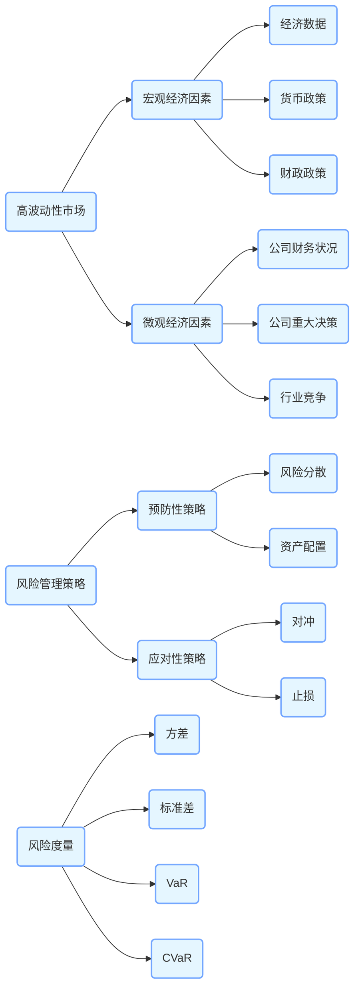

# 高波动性市场中的风险管理策略

> 关键词：高波动性市场、风险管理策略、金融市场、风险度量、投资组合

> 摘要：本文聚焦于高波动性市场中的风险管理策略。首先介绍了研究的背景、目的、预期读者、文档结构和相关术语。接着阐述了核心概念及其联系，包括市场波动性、风险等概念的原理和架构，并给出了相应的示意图和流程图。详细讲解了核心算法原理，如风险度量算法，并结合 Python 代码进行说明。还介绍了相关的数学模型和公式，通过具体例子进行深入解读。在项目实战部分，展示了代码实际案例，包括开发环境搭建、源代码实现与解读。分析了风险管理策略在不同场景下的实际应用，推荐了学习资源、开发工具框架和相关论文著作。最后总结了未来发展趋势与挑战，并提供了常见问题解答和扩展阅读参考资料，旨在为投资者和金融从业者在高波动性市场中有效管理风险提供全面的指导。

## 1. 背景介绍 
### 1.1 目的和范围
在当今金融市场中，高波动性已成为一种常见的现象。市场的高波动性可能由多种因素引起，如宏观经济数据的发布、地缘政治事件、公司重大决策等。高波动性既带来了潜在的高收益机会，但同时也伴随着巨大的风险。本文章的目的在于深入探讨在高波动性市场环境下，有效的风险管理策略。范围涵盖了金融市场的各个领域，包括股票市场、债券市场、期货市场、外汇市场等，旨在为投资者和金融从业者提供一套系统的风险管理方法，以降低风险并实现资产的稳健增长。

### 1.2 预期读者
本文的预期读者主要包括金融市场的投资者，如个人投资者、机构投资者（如基金公司、保险公司等）；金融从业者，如投资银行家、风险管理师、交易员等；以及对金融市场风险管理感兴趣的研究人员和学者。通过阅读本文，读者能够了解高波动性市场的特点和风险来源，掌握有效的风险管理策略和方法，并能够将这些知识应用到实际的投资和风险管理工作中。

### 1.3 文档结构概述
本文将按照以下结构进行组织：首先介绍核心概念与联系，明确高波动性市场和风险管理的相关概念及其内在联系；接着阐述核心算法原理和具体操作步骤，通过 Python 代码详细说明风险度量和管理的算法；然后介绍相关的数学模型和公式，并通过具体例子进行解释；在项目实战部分，将展示一个实际的风险管理项目，包括开发环境搭建、源代码实现和代码解读；之后分析风险管理策略在不同场景下的实际应用；推荐学习资源、开发工具框架和相关论文著作；最后总结未来发展趋势与挑战，提供常见问题解答和扩展阅读参考资料。

### 1.4 术语表
#### 1.4.1 核心术语定义
- **高波动性市场**：指市场价格在短期内出现大幅度波动的市场环境。市场价格的波动幅度通常用波动率来衡量，高波动性意味着波动率较高。
- **风险管理策略**：是指为了降低投资组合在高波动性市场中的风险而采取的一系列措施和方法。这些策略包括风险分散、对冲、止损等。
- **风险度量**：是指对投资组合面临的风险进行量化评估的过程。常用的风险度量指标包括方差、标准差、Value at Risk（VaR）、Conditional Value at Risk（CVaR）等。
- **投资组合**：是指投资者将资金分散投资于多种不同资产所形成的资产组合。通过合理配置资产，可以降低投资组合的整体风险。

#### 1.4.2 相关概念解释
- **波动率**：是衡量资产价格波动程度的指标。在金融市场中，通常使用历史波动率和隐含波动率来衡量资产价格的波动情况。历史波动率是根据资产过去的价格数据计算得出的波动率，而隐含波动率是通过期权定价模型反推得出的市场对未来波动率的预期。
- **风险分散**：是指将投资资金分散投资于不同的资产、行业、地区等，以降低投资组合的整体风险。通过风险分散，可以避免因单一资产或行业的波动而导致投资组合的大幅损失。
- **对冲**：是指通过同时进行相反方向的交易来降低投资组合的风险。例如，投资者可以通过买入股票的同时卖出股指期货来对冲股票市场的系统性风险。
- **止损**：是指在投资出现损失达到一定程度时，及时卖出资产以避免进一步损失的策略。止损可以帮助投资者控制风险，避免损失的无限扩大。

#### 1.4.3 缩略词列表
- **VaR**：Value at Risk，风险价值，是指在一定的置信水平和持有期内，投资组合可能遭受的最大损失。
- **CVaR**：Conditional Value at Risk，条件风险价值，是指在投资组合损失超过 VaR 的条件下，损失的期望值。
- **ETF**：Exchange Traded Fund，交易型开放式指数基金，是一种在证券交易所上市交易的开放式基金，通常跟踪特定的指数。
- **SPDR**：Standard & Poor's Depositary Receipts，标准普尔存托凭证，是一种跟踪标准普尔 500 指数的 ETF。

## 2. 核心概念与联系 

### 核心概念原理
#### 高波动性市场
高波动性市场的形成是多种因素共同作用的结果。从宏观经济层面来看，经济数据的不稳定、货币政策的变化、财政政策的调整等都可能导致市场的波动。例如，当央行宣布加息时，市场资金成本上升，股票市场和债券市场可能会出现下跌，从而导致市场波动性增加。从微观层面来看，公司的财务状况、重大决策、行业竞争等因素也会影响个股的价格波动，进而影响整个市场的波动性。

#### 风险管理策略
风险管理策略的核心是在风险和收益之间寻求平衡。投资者的目标是在承担一定风险的前提下，实现投资收益的最大化。风险管理策略可以分为预防性策略和应对性策略。预防性策略主要包括风险分散、资产配置等，旨在降低投资组合的整体风险；应对性策略主要包括对冲、止损等，旨在在市场出现不利变化时及时采取措施，减少损失。

#### 风险度量
风险度量是风险管理的基础。通过对投资组合的风险进行量化评估，投资者可以更好地了解投资组合面临的风险状况，从而制定合理的风险管理策略。常用的风险度量指标包括方差、标准差、VaR、CVaR 等。方差和标准差衡量的是投资组合收益率的波动程度，VaR 和 CVaR 则衡量的是投资组合在一定置信水平下可能遭受的最大损失。

### 架构的文本示意图
```plaintext
高波动性市场
|
|-- 宏观经济因素
|   |-- 经济数据
|   |-- 货币政策
|   |-- 财政政策
|
|-- 微观经济因素
|   |-- 公司财务状况
|   |-- 公司重大决策
|   |-- 行业竞争
|
风险管理策略
|
|-- 预防性策略
|   |-- 风险分散
|   |-- 资产配置
|
|-- 应对性策略
|   |-- 对冲
|   |-- 止损
|
风险度量
|
|-- 方差
|-- 标准差
|-- VaR
|-- CVaR
```

### Mermaid 流程图


## 3. 核心算法原理 & 具体操作步骤 

### 风险度量算法 - VaR 的原理
VaR 是一种常用的风险度量指标，它衡量的是在一定的置信水平和持有期内，投资组合可能遭受的最大损失。例如，在 95% 的置信水平下，一天的 VaR 为 100 万元，表示在 95% 的情况下，投资组合在一天内的损失不会超过 100 万元。

计算 VaR 的方法有多种，常见的有历史模拟法、方差 - 协方差法和蒙特卡罗模拟法。下面我们将详细介绍历史模拟法的原理和 Python 实现。

### 历史模拟法的具体操作步骤
1. **数据收集**：收集投资组合中各资产的历史价格数据。
2. **收益率计算**：根据历史价格数据计算各资产的收益率。
3. **投资组合收益率计算**：根据各资产的权重计算投资组合的收益率。
4. **排序**：将投资组合的收益率按照从小到大的顺序进行排序。
5. **确定 VaR**：根据置信水平确定对应的分位数，该分位数对应的收益率乘以投资组合的初始价值即为 VaR。

### Python 代码实现
```python
import numpy as np

def calculate_var(returns, confidence_level=0.95):
    """
    计算 VaR
    :param returns: 投资组合的收益率数组
    :param confidence_level: 置信水平，默认为 0.95
    :return: VaR
    """
    # 对收益率进行排序
    sorted_returns = np.sort(returns)
    
    # 计算分位数的索引
    index = int((1 - confidence_level) * len(sorted_returns))
    
    # 确定 VaR
    var = -sorted_returns[index]
    
    return var

# 示例数据
returns = np.array([0.01, -0.02, 0.03, -0.04, 0.05, -0.06, 0.07, -0.08, 0.09, -0.1])

# 计算 VaR
var = calculate_var(returns)
print(f"VaR at 95% confidence level: {var}")
```

### 代码解释
1. **导入库**：导入 `numpy` 库，用于数组操作和计算。
2. **定义函数**：定义 `calculate_var` 函数，接受收益率数组和置信水平作为参数。
3. **排序收益率**：使用 `np.sort` 函数对收益率数组进行排序。
4. **计算分位数索引**：根据置信水平计算分位数的索引。
5. **确定 VaR**：根据索引从排序后的收益率数组中取出对应的收益率，并取其相反数作为 VaR。
6. **示例数据和计算**：创建一个示例收益率数组，调用 `calculate_var` 函数计算 VaR，并打印结果。

## 4. 数学模型和公式 & 详细讲解 & 举例说明 

### 方差和标准差
方差是衡量随机变量离散程度的指标，在金融市场中，方差通常用于衡量投资组合收益率的波动程度。设 $R_1, R_2, \cdots, R_n$ 为投资组合在 $n$ 个时期的收益率，$\bar{R}$ 为平均收益率，则方差 $\sigma^2$ 的计算公式为：
$$
\sigma^2 = \frac{1}{n} \sum_{i=1}^{n} (R_i - \bar{R})^2
$$
标准差 $\sigma$ 是方差的平方根，即：
$$
\sigma = \sqrt{\sigma^2}
$$

### 举例说明
假设有一个投资组合，其在 5 个时期的收益率分别为 0.01, 0.02, -0.01, 0.03, -0.02。首先计算平均收益率：
$$
\bar{R} = \frac{0.01 + 0.02 - 0.01 + 0.03 - 0.02}{5} = 0.006
$$
然后计算方差：
$$
\begin{align*}
\sigma^2 &= \frac{(0.01 - 0.006)^2 + (0.02 - 0.006)^2 + (-0.01 - 0.006)^2 + (0.03 - 0.006)^2 + (-0.02 - 0.006)^2}{5}\\
&= \frac{0.000016 + 0.000196 + 0.000256 + 0.000576 + 0.000676}{5}\\
&= 0.000344
\end{align*}
$$
最后计算标准差：
$$
\sigma = \sqrt{0.000344} \approx 0.0185
$$

### VaR 的数学模型
在历史模拟法中，设 $R_1, R_2, \cdots, R_n$ 为投资组合在 $n$ 个时期的收益率，将这些收益率按照从小到大的顺序排序为 $R_{(1)}, R_{(2)}, \cdots, R_{(n)}$。对于置信水平 $c$，对应的分位数为 $(1 - c)n$，若 $(1 - c)n$ 为整数，则 VaR 为 $-R_{((1 - c)n)}$；若 $(1 - c)n$ 不是整数，设 $k$ 为 $(1 - c)n$ 的整数部分，$f$ 为 $(1 - c)n$ 的小数部分，则 VaR 为 $-[(1 - f)R_{(k)} + fR_{(k + 1)}]$。

### 举例说明
假设有一个投资组合，其在 10 个时期的收益率分别为 0.01, -0.02, 0.03, -0.04, 0.05, -0.06, 0.07, -0.08, 0.09, -0.1。在 95% 的置信水平下，$(1 - 0.95) \times 10 = 0.5$，$k = 0$，$f = 0.5$，排序后的收益率为 -0.1, -0.08, -0.06, -0.04, -0.02, 0.01, 0.03, 0.05, 0.07, 0.09，则 VaR 为：
$$
\begin{align*}
VaR &= -[(1 - 0.5) \times (-0.1) + 0.5 \times (-0.08)]\\
&= -(-0.05 - 0.04)\\
&= 0.09
\end{align*}
$$

## 5. 项目实战：代码实际案例和详细解释说明 

### 5.1  开发环境搭建
#### 安装 Python
首先需要安装 Python 环境，建议使用 Python 3.7 及以上版本。可以从 Python 官方网站（https://www.python.org/downloads/）下载并安装适合自己操作系统的 Python 版本。

#### 安装必要的库
在本项目中，需要使用 `numpy`、`pandas` 和 `matplotlib` 等库。可以使用以下命令进行安装：
```sh
pip install numpy pandas matplotlib
```

### 5.2  源代码详细实现和代码解读
```python
import numpy as np
import pandas as pd
import matplotlib.pyplot as plt

# 读取数据
data = pd.read_csv('stock_prices.csv')

# 计算收益率
returns = data['Close'].pct_change().dropna()

# 计算 VaR
confidence_level = 0.95
var = calculate_var(returns, confidence_level)

# 绘制收益率直方图
plt.hist(returns, bins=50, density=True, alpha=0.7)
plt.axvline(x=-var, color='r', linestyle='--', label=f'VaR at {confidence_level * 100}% confidence level')
plt.xlabel('Returns')
plt.ylabel('Density')
plt.title('Histogram of Returns')
plt.legend()
plt.show()

print(f"VaR at {confidence_level * 100}% confidence level: {var}")
```

### 代码解读
1. **导入库**：导入 `numpy`、`pandas` 和 `matplotlib.pyplot` 库，分别用于数组操作、数据处理和绘图。
2. **读取数据**：使用 `pandas` 的 `read_csv` 函数读取股票价格数据文件 `stock_prices.csv`。
3. **计算收益率**：使用 `pct_change` 函数计算股票收盘价的收益率，并使用 `dropna` 函数去除缺失值。
4. **计算 VaR**：调用之前定义的 `calculate_var` 函数计算在 95% 置信水平下的 VaR。
5. **绘制收益率直方图**：使用 `matplotlib` 的 `hist` 函数绘制收益率的直方图，并使用 `axvline` 函数绘制 VaR 线。
6. **显示图形和打印结果**：使用 `show` 函数显示图形，并打印计算得到的 VaR。

### 5.3  代码解读与分析
通过这个项目，我们可以看到如何使用 Python 进行风险度量和可视化。首先，我们读取了股票价格数据，并计算了收益率。然后，使用历史模拟法计算了 VaR。最后，通过绘制收益率直方图，我们可以直观地看到收益率的分布情况以及 VaR 的位置。这有助于我们更好地理解投资组合面临的风险状况。

## 6. 实际应用场景 
### 个人投资者
对于个人投资者来说，在高波动性市场中，风险管理策略尤为重要。个人投资者可以通过风险分散来降低投资组合的风险。例如，将资金分散投资于不同行业、不同类型的资产，如股票、债券、基金等。同时，可以根据自己的风险承受能力设置止损点，当投资损失达到止损点时，及时卖出资产，避免进一步损失。此外，个人投资者还可以使用 VaR 等风险度量指标来评估自己的投资组合风险，从而调整投资策略。

### 机构投资者
机构投资者，如基金公司、保险公司等，通常管理着大量的资金，对风险管理的要求更高。在高波动性市场中，机构投资者可以采用更复杂的风险管理策略，如对冲策略。例如，基金公司可以通过买入股票的同时卖出股指期货来对冲股票市场的系统性风险。此外，机构投资者还可以使用资产配置模型来优化投资组合，根据市场情况动态调整资产配置比例，以实现风险和收益的平衡。

### 金融机构
金融机构，如银行、证券公司等，在高波动性市场中面临着各种风险，如信用风险、市场风险等。为了管理这些风险，金融机构需要建立完善的风险管理体系。例如，银行可以通过评估借款人的信用状况来控制信用风险，证券公司可以通过风险度量和监控来管理市场风险。此外，金融机构还需要遵守相关的监管要求，确保风险管理措施的有效性。

## 7. 工具和资源推荐
### 7.1 学习资源推荐
#### 7.1.1 书籍推荐
- 《金融风险管理师（FRM）一级教材》：全面介绍了金融风险管理的基础知识和方法，是学习金融风险管理的经典教材。
- 《漫步华尔街》：这本书深入浅出地介绍了投资的基本原理和策略，对于理解市场波动性和风险管理有很大的帮助。
- 《聪明的投资者》：被誉为投资界的圣经，作者本杰明·格雷厄姆在书中阐述了价值投资的理念和方法，同时也强调了风险管理的重要性。

#### 7.1.2 在线课程
- Coursera 上的《金融风险管理》课程：由知名大学的教授授课，内容涵盖了金融风险管理的各个方面，包括风险度量、风险建模、风险管理策略等。
- edX 上的《投资学》课程：该课程系统地介绍了投资的基本理论和方法，包括资产定价、投资组合管理、风险管理等内容。

#### 7.1.3 技术博客和网站
- 金融界网站（https://www.jrj.com.cn/）：提供了丰富的金融市场信息和分析文章，对于了解市场动态和风险管理有很大的帮助。
- 雪球网（https://xueqiu.com/）：是一个投资者社区，用户可以在上面分享投资经验和观点，同时也可以获取到很多有价值的风险管理信息。

### 7.2 开发工具框架推荐
#### 7.2.1 IDE和编辑器
- PyCharm：是一款专门为 Python 开发设计的集成开发环境（IDE），具有强大的代码编辑、调试和分析功能，非常适合用于金融数据分析和风险管理项目的开发。
- Jupyter Notebook：是一个交互式的开发环境，支持多种编程语言，特别适合用于数据探索和可视化。在风险管理项目中，可以使用 Jupyter Notebook 进行数据处理、模型构建和结果展示。

#### 7.2.2 调试和性能分析工具
- Py-Spy：是一个用于 Python 程序性能分析的工具，可以帮助开发者找出程序中的性能瓶颈，提高程序的运行效率。
- pdb：是 Python 自带的调试工具，可以帮助开发者在程序运行过程中进行调试，找出程序中的错误。

#### 7.2.3 相关框架和库
- NumPy：是 Python 中用于科学计算的基础库，提供了高效的数组操作和数学函数，在风险管理项目中可以用于数据处理和模型计算。
- Pandas：是一个用于数据处理和分析的库，提供了丰富的数据结构和数据操作方法，非常适合用于金融数据的处理和分析。
- Matplotlib：是一个用于数据可视化的库，可以绘制各种类型的图表，如折线图、柱状图、直方图等，在风险管理项目中可以用于结果展示和可视化分析。

### 7.3 相关论文著作推荐
#### 7.3.1 经典论文
- “Value at Risk: The New Benchmark for Managing Financial Risk” by Philippe Jorion：这篇论文系统地介绍了 VaR 的概念、计算方法和应用，是 VaR 领域的经典之作。
- “Portfolio Selection” by Harry Markowitz：这篇论文提出了现代投资组合理论，奠定了投资组合管理的基础，对于理解风险分散和资产配置有重要的意义。

#### 7.3.2 最新研究成果
- 可以关注《Journal of Financial Economics》、《Review of Financial Studies》等金融领域的顶级学术期刊，这些期刊上发表了很多关于风险管理的最新研究成果。

#### 7.3.3 应用案例分析
- 《Risk Management in Banking》：这本书通过大量的实际案例分析，介绍了银行在风险管理方面的实践经验和方法，对于金融机构的风险管理具有很强的借鉴意义。

## 8. 总结：未来发展趋势与挑战
### 未来发展趋势
#### 智能化风险管理
随着人工智能和机器学习技术的不断发展，智能化风险管理将成为未来的发展趋势。通过使用大数据、人工智能和机器学习算法，可以更准确地预测市场波动性和风险，实现实时监控和自动决策。例如，使用深度学习模型对市场数据进行分析，预测股票价格的走势和风险；使用强化学习算法优化投资组合，实现风险和收益的最大化。

#### 跨市场风险管理
在全球化的背景下，金融市场之间的联系越来越紧密，跨市场风险也越来越受到关注。未来，风险管理将不仅仅局限于单一市场，而是需要考虑跨市场的风险传导和联动效应。例如，股票市场、债券市场、外汇市场等之间的相互影响，以及不同国家和地区市场之间的风险传递。因此，需要建立跨市场的风险管理体系，采用综合的风险管理策略。

#### 绿色金融风险管理
随着全球对环境保护和可持续发展的重视，绿色金融逐渐兴起。绿色金融涉及到与环境保护、气候变化等相关的金融活动，如绿色债券、绿色信贷等。在绿色金融领域，风险管理也面临着新的挑战和机遇。例如，需要评估绿色项目的环境风险和社会风险，以及气候变化对金融机构资产质量的影响。未来，绿色金融风险管理将成为风险管理领域的一个重要研究方向。

### 挑战
#### 数据质量和可用性
在智能化风险管理中，数据是关键。然而，金融市场的数据往往存在质量不高、缺失值较多等问题，这给风险管理模型的构建和应用带来了很大的挑战。此外，一些新兴市场的数据可用性较差，难以获取足够的历史数据进行分析和建模。

#### 模型复杂度和可解释性
随着风险管理模型的不断发展，模型的复杂度也越来越高。复杂的模型虽然可以提高预测的准确性，但也带来了可解释性的问题。在实际应用中，金融机构和投资者往往需要了解模型的决策过程和依据，以便做出合理的决策。因此，如何在提高模型准确性的同时，保证模型的可解释性是一个亟待解决的问题。

#### 监管要求和合规成本
金融市场的监管要求越来越严格，风险管理需要符合相关的监管标准和法规。这增加了金融机构的合规成本，同时也对风险管理的技术和方法提出了更高的要求。金融机构需要不断更新和完善风险管理体系，以满足监管要求。

## 9. 附录：常见问题与解答
### 问题 1：VaR 有哪些局限性？
VaR 虽然是一种常用的风险度量指标，但也存在一些局限性。首先，VaR 只能给出在一定置信水平下的最大损失，不能提供损失超过 VaR 时的具体情况。其次，VaR 的计算依赖于历史数据，假设市场未来的波动情况与过去相似，这在市场发生重大变化时可能会导致 VaR 的计算结果不准确。此外，VaR 没有考虑到投资组合的尾部风险，即极端事件发生的可能性。

### 问题 2：如何选择合适的风险管理策略？
选择合适的风险管理策略需要考虑多个因素，包括投资者的风险承受能力、投资目标、市场环境等。如果投资者的风险承受能力较低，可以选择风险分散、资产配置等预防性策略；如果投资者的风险承受能力较高，可以考虑对冲、止损等应对性策略。此外，还需要根据市场环境的变化及时调整风险管理策略。

### 问题 3：风险管理和投资收益之间有什么关系？
风险管理和投资收益之间是一种平衡关系。有效的风险管理可以降低投资组合的风险，但可能会牺牲一定的投资收益。相反，追求高投资收益往往需要承担更高的风险。因此，投资者需要在风险和收益之间找到一个平衡点，根据自己的风险承受能力和投资目标制定合理的风险管理策略。

## 10. 扩展阅读 & 参考资料
### 扩展阅读
- 《黑天鹅：如何应对不可预知的未来》：这本书探讨了极端事件对金融市场和风险管理的影响，对于理解市场的不确定性和风险管理的重要性有很大的启发。
- 《金融炼金术》：作者乔治·索罗斯在书中阐述了他的投资哲学和风险管理理念，通过实际案例分析了市场的波动和变化。

### 参考资料
- Jorion, P. (2007). Value at Risk: The New Benchmark for Managing Financial Risk. McGraw-Hill.
- Markowitz, H. M. (1952). Portfolio Selection. The Journal of Finance, 7(1), 77-91.
- Fabozzi, F. J., & Modigliani, F. (2003). Capital Markets: Institutions and Instruments. Prentice Hall.

作者：AI天才研究院/AI Genius Institute & 禅与计算机程序设计艺术 /Zen And The Art of Computer Programming