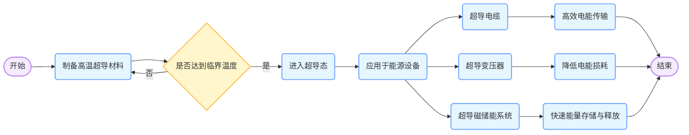

# 高温超导材料的突破与能源技术革新

> 关键词：高温超导材料、能源技术革新、超导原理、实际应用场景、未来挑战

> 摘要：本文聚焦于高温超导材料的突破及其对能源技术革新带来的影响。首先介绍了高温超导材料相关的背景知识，包括目的范围、预期读者等内容。接着深入剖析了高温超导材料的核心概念、原理和架构，通过Python代码阐述其核心算法原理及操作步骤，并用数学模型和公式进一步解释。在项目实战部分，详细介绍了开发环境搭建、源代码实现与解读。同时探讨了高温超导材料在实际中的应用场景，推荐了相关的学习资源、开发工具框架和论文著作。最后总结了高温超导材料未来的发展趋势与挑战，并对常见问题进行解答，提供扩展阅读和参考资料，旨在为读者全面呈现高温超导材料与能源技术革新的关联及发展前景。

## 1. 背景介绍 
### 1.1 目的和范围
本文章旨在深入探讨高温超导材料的突破对能源技术革新所产生的深远影响。详细分析高温超导材料的基本原理、核心算法、数学模型，通过实际项目案例展示其在能源领域的应用方式。同时，介绍相关的学习资源、开发工具以及前沿研究成果，为从事超导材料研究、能源技术开发等相关领域的专业人士和科研爱好者提供全面且深入的技术参考。范围涵盖了高温超导材料的基础理论、技术实现、实际应用以及未来发展趋势等多个方面。

### 1.2 预期读者
本文预期读者包括但不限于从事超导材料研究的科研人员、能源技术领域的工程师和开发者、对超导和能源技术感兴趣的高校师生以及关注科技前沿动态的行业从业者。对于想要了解高温超导材料如何推动能源技术革新的人群，本文将提供系统而详细的知识体系和技术解读。

### 1.3 文档结构概述
本文首先介绍高温超导材料相关的背景信息，包括目的范围、预期读者等。接着阐述核心概念与联系，通过文本示意图和Mermaid流程图展示其原理和架构。然后讲解核心算法原理和具体操作步骤，并用Python代码进行详细说明。随后介绍数学模型和公式，并举例说明。在项目实战部分，详细介绍开发环境搭建、源代码实现与解读。之后探讨实际应用场景，推荐相关的学习资源、开发工具框架和论文著作。最后总结未来发展趋势与挑战，解答常见问题，并提供扩展阅读和参考资料。

### 1.4 术语表
#### 1.4.1 核心术语定义
- **高温超导材料**：指在相对较高的温度（通常高于传统超导材料所需的极低温）下呈现超导特性的材料。超导特性表现为电阻为零和完全抗磁性。
- **超导态**：材料处于电阻为零、能够无损耗地传导电流的状态。
- **临界温度**：材料从正常态转变为超导态的温度，用 $T_c$ 表示。
- **临界磁场**：当外加磁场超过某一数值时，超导材料会从超导态转变为正常态，这个磁场值称为临界磁场，用 $H_c$ 表示。
- **临界电流密度**：超导材料能够承载的最大电流密度，超过该值超导态将被破坏，用 $J_c$ 表示。

#### 1.4.2 相关概念解释
- **迈斯纳效应**：当超导材料处于超导态时，会将内部的磁场完全排出，使其内部磁感应强度为零，这种现象称为迈斯纳效应，它是超导材料的一个重要特性，体现了超导材料的完全抗磁性。
- **BCS理论**：由巴丁（Bardeen）、库珀（Cooper）和施里弗（Schrieffer）提出的传统超导理论，该理论认为超导现象是由于电子之间通过声子相互作用形成库珀对而导致的。然而，高温超导材料的超导机制不能完全用BCS理论解释。

#### 1.4.3 缩略词列表
- **HTS**：High Temperature Superconductor，高温超导体
- **MRI**：Magnetic Resonance Imaging，磁共振成像
- **SMES**：Superconducting Magnetic Energy Storage，超导磁储能

## 2. 核心概念与联系 

### 高温超导材料的核心概念原理
高温超导材料的核心在于其在相对较高温度下能够实现超导态。传统超导材料需要在接近绝对零度（约 -273.15°C）的极低温环境下才能表现出超导特性，而高温超导材料的临界温度相对较高，例如一些铜氧化物高温超导材料的临界温度可以达到液氮温度（-196°C）以上。

从微观层面来看，超导现象的产生与电子的行为密切相关。在正常导体中，电子在晶格中运动时会与晶格原子发生碰撞，从而产生电阻。而在超导材料中，电子会形成一种特殊的配对状态，称为库珀对。库珀对可以在晶格中无阻碍地运动，从而实现零电阻传导。

对于高温超导材料，其超导机制目前尚未完全明确。虽然BCS理论成功解释了传统超导材料的超导现象，但对于高温超导材料，其电子配对机制可能更为复杂，涉及到电子之间的强关联相互作用、自旋涨落等多种因素。

### 架构的文本示意图
高温超导材料的架构可以从材料本身和应用系统两个层面来理解。

从材料层面来看，高温超导材料通常由特定的化学元素组成，例如铜氧化物高温超导材料包含铜、氧以及其他一些金属元素。这些元素按照一定的晶体结构排列，形成具有超导特性的晶格结构。

在应用系统层面，高温超导材料可以应用于各种能源技术设备中，如超导电缆、超导变压器、超导磁储能系统等。这些设备通常由高温超导材料、制冷系统、电气连接系统等部分组成。高温超导材料作为核心部件，负责实现高效的电能传输或能量存储；制冷系统则用于维持材料处于超导态所需的低温环境；电气连接系统用于将超导设备与外部电网或其他设备连接起来。

### Mermaid 流程图


该流程图展示了高温超导材料从制备到应用的整个过程。首先制备高温超导材料，然后判断是否达到临界温度，若达到则进入超导态，接着将其应用于不同的能源设备中，最终实现高效电能传输、降低电能损耗或快速能量存储与释放等功能。

## 3. 核心算法原理 & 具体操作步骤 

### 高温超导材料特性模拟算法原理
在研究高温超导材料时，常常需要对其特性进行模拟，例如计算临界温度、临界磁场等。这里我们以计算超导材料的临界温度为例，介绍一种基于统计物理的模拟算法。

假设我们考虑一个简单的二维晶格模型，每个晶格点上有一个电子。电子之间存在相互作用，这种相互作用可以用一个哈密顿量来描述。通过蒙特卡罗模拟方法，我们可以模拟电子在晶格中的运动和相互作用，从而计算出系统的热力学性质，包括临界温度。

### Python 代码实现
```python
import numpy as np
import matplotlib.pyplot as plt

# 定义晶格大小
L = 10
# 定义蒙特卡罗步数
num_steps = 10000
# 定义温度范围
temperatures = np.linspace(0.1, 5.0, 20)

# 初始化晶格
def initialize_lattice(L):
    return np.random.choice([-1, 1], size=(L, L))

# 计算能量
def calculate_energy(lattice):
    energy = 0
    for i in range(L):
        for j in range(L):
            spin = lattice[i, j]
            neighbors = lattice[(i+1)%L, j] + lattice[(i-1)%L, j] + lattice[i, (j+1)%L] + lattice[i, (j-1)%L]
            energy += -spin * neighbors
    return energy / 2

# 蒙特卡罗更新
def monte_carlo_step(lattice, temperature):
    for i in range(L):
        for j in range(L):
            # 随机选择一个晶格点
            x, y = np.random.randint(0, L), np.random.randint(0, L)
            spin = lattice[x, y]
            # 计算翻转自旋后的能量变化
            neighbors = lattice[(x+1)%L, y] + lattice[(x-1)%L, y] + lattice[x, (y+1)%L] + lattice[x, (y-1)%L]
            delta_energy = 2 * spin * neighbors
            # 判断是否接受翻转
            if delta_energy < 0 or np.random.rand() < np.exp(-delta_energy / temperature):
                lattice[x, y] = -spin
    return lattice

# 计算磁化强度
def calculate_magnetization(lattice):
    return np.sum(lattice)

# 主模拟函数
def simulate(temperatures):
    magnetizations = []
    for temperature in temperatures:
        lattice = initialize_lattice(L)
        mag_sum = 0
        for step in range(num_steps):
            lattice = monte_carlo_step(lattice, temperature)
            if step > num_steps // 2:
                mag_sum += calculate_magnetization(lattice)
        mag_avg = mag_sum / (num_steps // 2)
        magnetizations.append(mag_avg / (L * L))
    return magnetizations

# 运行模拟
magnetizations = simulate(temperatures)

# 绘制磁化强度随温度变化的曲线
plt.plot(temperatures, magnetizations)
plt.xlabel('Temperature')
plt.ylabel('Magnetization')
plt.title('Magnetization vs Temperature')
plt.show()
```

### 代码解释
1. **初始化晶格**：`initialize_lattice` 函数用于随机初始化一个二维晶格，每个晶格点上的电子自旋取值为 -1 或 1。
2. **计算能量**：`calculate_energy` 函数用于计算晶格的总能量，通过遍历每个晶格点及其相邻晶格点，计算电子之间的相互作用能。
3. **蒙特卡罗更新**：`monte_carlo_step` 函数实现了蒙特卡罗模拟的更新步骤。随机选择一个晶格点，计算翻转该点自旋后的能量变化，根据玻尔兹曼概率判断是否接受翻转。
4. **计算磁化强度**：`calculate_magnetization` 函数用于计算晶格的总磁化强度，即所有晶格点上电子自旋的总和。
5. **主模拟函数**：`simulate` 函数在不同温度下运行蒙特卡罗模拟，记录每个温度下的平均磁化强度。
6. **绘制曲线**：最后使用 `matplotlib` 库绘制磁化强度随温度变化的曲线。通过观察曲线的变化，可以大致确定材料的临界温度。

### 具体操作步骤
1. 安装所需的 Python 库，如 `numpy` 和 `matplotlib`。
2. 将上述代码保存为一个 Python 文件，例如 `superconductor_simulation.py`。
3. 运行该 Python 文件，即可得到磁化强度随温度变化的曲线。
4. 根据曲线的变化趋势，判断材料的临界温度。通常，当磁化强度突然下降时，对应的温度即为临界温度的近似值。

## 4. 数学模型和公式 & 详细讲解 & 举例说明 

### 超导材料的热力学模型
超导材料的热力学性质可以用吉布斯自由能来描述。在超导态和正常态下，吉布斯自由能分别表示为 $G_s$ 和 $G_n$。

#### 吉布斯自由能公式
$$G = U - TS + pV$$
其中，$U$ 是内能，$T$ 是温度，$S$ 是熵，$p$ 是压强，$V$ 是体积。

在超导态和正常态之间的转变过程中，存在一个临界磁场 $H_c$。当外加磁场 $H$ 小于 $H_c$ 时，材料处于超导态；当 $H$ 大于 $H_c$ 时，材料转变为正常态。

#### 临界磁场与吉布斯自由能的关系
在零磁场下，超导态的吉布斯自由能 $G_s(0)$ 低于正常态的吉布斯自由能 $G_n(0)$，即 $G_s(0) < G_n(0)$。当外加磁场 $H$ 逐渐增加时，超导态的吉布斯自由能会发生变化，其变化量为：
$$G_s(H) = G_s(0) + \frac{H^2}{8\pi}$$
而正常态的吉布斯自由能不受磁场影响，即 $G_n(H) = G_n(0)$。

当 $G_s(H_c) = G_n(H_c)$ 时，材料从超导态转变为正常态，由此可以得到临界磁场 $H_c$ 与温度 $T$ 的关系：
$$H_c(T) = H_c(0)\left(1 - \frac{T^2}{T_c^2}\right)$$
其中，$H_c(0)$ 是绝对零度下的临界磁场，$T_c$ 是临界温度。

### 详细讲解
上述数学模型描述了超导材料在磁场作用下的热力学行为。吉布斯自由能是一个重要的热力学函数，它综合考虑了内能、熵和体积等因素。在超导态和正常态之间的转变过程中，吉布斯自由能的变化决定了材料的状态。

临界磁场与温度的关系表明，随着温度的升高，材料能够承受的临界磁场会逐渐降低。当温度达到临界温度 $T_c$ 时，临界磁场 $H_c$ 变为零，材料从超导态转变为正常态。

### 举例说明
假设某超导材料的临界温度 $T_c = 100$ K，绝对零度下的临界磁场 $H_c(0) = 10$ T。我们可以根据上述公式计算不同温度下的临界磁场。

当 $T = 50$ K 时：
$$H_c(50) = 10\left(1 - \frac{50^2}{100^2}\right) = 10\left(1 - \frac{1}{4}\right) = 7.5 \text{ T}$$

这意味着在温度为 50 K 时，该超导材料能够承受的最大磁场为 7.5 T，超过这个磁场值，材料将从超导态转变为正常态。

## 5. 项目实战：代码实际案例和详细解释说明 

### 5.1  开发环境搭建
#### 硬件环境
- **计算机**：建议使用具有多核处理器和较大内存（至少 8 GB）的计算机，以确保能够高效运行模拟程序。
- **存储设备**：需要足够的存储空间来保存代码文件和模拟数据，建议至少有 500 GB 的可用硬盘空间。

#### 软件环境
- **操作系统**：可以选择 Windows、Linux 或 macOS 操作系统。
- **Python 环境**：安装 Python 3.7 及以上版本。可以从 Python 官方网站（https://www.python.org/downloads/）下载并安装。
- **Python 库**：安装所需的 Python 库，如 `numpy`、`matplotlib` 等。可以使用 `pip` 命令进行安装：
```sh
pip install numpy matplotlib
```

### 5.2  源代码详细实现和代码解读
以下是一个更完整的高温超导电缆电流分布模拟的 Python 代码示例：
```python
import numpy as np
import matplotlib.pyplot as plt

# 定义电缆参数
radius = 0.1  # 电缆半径（m）
length = 1.0  # 电缆长度（m）
num_points = 100  # 离散点数
points = np.linspace(0, radius, num_points)

# 定义超导材料参数
critical_current_density = 1e6  # 临界电流密度（A/m^2）

# 定义电流分布函数
def current_distribution(r):
    if r < radius:
        return critical_current_density * (1 - (r / radius)**2)
    else:
        return 0

# 计算每个点的电流密度
current_densities = np.array([current_distribution(r) for r in points])

# 计算每个点的电流
areas = np.pi * ((points[1:]**2 - points[:-1]**2) + (points[1] - points[0])**2 / 2)
currents = current_densities[:-1] * areas

# 计算总电流
total_current = np.sum(currents)

# 绘制电流密度分布曲线
plt.plot(points[:-1], current_densities[:-1])
plt.xlabel('Radius (m)')
plt.ylabel('Current Density (A/m^2)')
plt.title('Current Density Distribution in High-Temperature Superconducting Cable')
plt.show()

# 输出总电流
print(f'Total current in the cable: {total_current} A')
```

### 代码解读与分析
1. **参数定义**：
    - `radius`：定义了超导电缆的半径。
    - `length`：定义了电缆的长度。
    - `num_points`：用于离散化电缆的半径，将半径划分为多个点进行计算。
    - `critical_current_density`：定义了超导材料的临界电流密度。

2. **电流分布函数**：
    - `current_distribution` 函数根据半径计算电流密度。在电缆内部，电流密度随着半径的增加而减小；在电缆外部，电流密度为零。

3. **计算电流密度和电流**：
    - 使用 `np.array` 和列表推导式计算每个点的电流密度。
    - 计算每个点对应的环形区域的面积，并根据电流密度计算该区域的电流。

4. **计算总电流**：
    - 使用 `np.sum` 函数计算所有环形区域的电流之和，得到电缆中的总电流。

5. **绘制曲线和输出结果**：
    - 使用 `matplotlib` 库绘制电流密度分布曲线。
    - 打印电缆中的总电流。

通过这个代码示例，我们可以模拟高温超导电缆中的电流分布，并计算总电流。这对于设计和优化超导电缆具有重要的指导意义。

## 6. 实际应用场景 
### 电力传输领域
- **超导电缆**：高温超导电缆具有零电阻的特性，能够实现无损耗的电能传输。与传统电缆相比，超导电缆可以大大降低输电过程中的能量损耗，提高输电效率。例如，在城市电网中，使用超导电缆可以减少电缆的占地面积，提高电网的输电容量，解决城市用电负荷增长带来的输电难题。
- **超导变压器**：超导变压器利用高温超导材料的低损耗特性，能够显著降低变压器的能量损耗。同时，超导变压器具有体积小、重量轻等优点，可以减少变电站的占地面积和建设成本。在大型电力系统中，超导变压器的应用可以提高电网的运行效率和可靠性。

### 能源存储领域
- **超导磁储能系统（SMES）**：SMES 利用超导线圈储存能量，具有快速充放电、能量转换效率高、使用寿命长等优点。在电力系统中，SMES 可以用于调节电网的功率平衡，提高电网的稳定性和可靠性。例如，在风电、光伏等可再生能源发电系统中，SMES 可以储存多余的电能，在发电不足时释放能量，实现可再生能源的稳定输出。

### 交通运输领域
- **磁悬浮列车**：高温超导材料在磁悬浮列车中的应用可以提高列车的悬浮力和运行速度。超导磁体产生的强磁场可以使列车悬浮在轨道上，减少摩擦力，从而实现高速运行。磁悬浮列车具有运行速度快、噪音小、能耗低等优点，是未来交通运输的重要发展方向之一。

### 医疗领域
- **磁共振成像（MRI）设备**：MRI 设备利用强磁场和射频脉冲来生成人体内部的图像。高温超导材料可以用于制造 MRI 设备的超导磁体，提高磁场强度和均匀性，从而提高图像的分辨率和质量。同时，超导磁体的低损耗特性可以降低设备的运行成本。

## 7. 工具和资源推荐
### 7.1 学习资源推荐
#### 7.1.1 书籍推荐
- 《超导物理》：全面介绍了超导材料的基本原理、实验技术和应用领域，是超导领域的经典教材。
- 《高温超导材料与应用》：详细阐述了高温超导材料的制备方法、物理性质和应用前景，适合从事高温超导材料研究的专业人士阅读。
- 《能源技术概论》：涵盖了能源领域的各个方面，包括超导技术在能源领域的应用，对于了解能源技术的整体发展具有重要的参考价值。

#### 7.1.2 在线课程
- Coursera 上的“Superconductivity and Its Applications”：由知名高校的教授授课，系统介绍了超导材料的原理、特性和应用，提供了丰富的教学资源和案例分析。
- edX 上的“Advanced Energy Systems”：课程内容涉及超导技术在能源系统中的应用，以及能源技术的前沿发展趋势，适合有一定专业基础的学习者。

#### 7.1.3 技术博客和网站
- 超导技术协会官网（https://www.superconductors.org/）：提供了超导领域的最新研究成果、行业动态和技术资讯，是了解超导技术发展的重要渠道。
- 中国科学院物理研究所超导实验室网站（http://www.super.iphy.ac.cn/）：发布了该实验室在超导领域的研究进展和科研成果，具有较高的学术价值。

### 7.2 开发工具框架推荐
#### 7.2.1 IDE和编辑器
- PyCharm：是一款专业的 Python 集成开发环境，具有代码编辑、调试、版本控制等功能，适合开发超导材料模拟和能源技术相关的 Python 程序。
- Visual Studio Code：是一款轻量级的代码编辑器，支持多种编程语言，具有丰富的插件扩展功能，可以方便地进行代码开发和调试。

#### 7.2.2 调试和性能分析工具
- Py-Spy：是一个用于分析 Python 程序性能的工具，可以实时监测程序的 CPU 使用率、函数调用时间等信息，帮助开发者优化代码性能。
- GDB：是一个强大的调试工具，支持多种编程语言，可以用于调试 C、C++ 等语言编写的超导材料模拟程序。

#### 7.2.3 相关框架和库
- NumPy：是 Python 中用于科学计算的基础库，提供了高效的数组操作和数学函数，在超导材料模拟和数据分析中具有广泛的应用。
- SciPy：是一个基于 NumPy 的科学计算库，提供了优化、积分、插值等多种科学计算功能，可用于解决超导材料研究中的各种数学问题。
- Matplotlib：是 Python 中用于数据可视化的库，可以绘制各种类型的图表和图形，方便展示超导材料模拟的结果。

### 7.3 相关论文著作推荐
#### 7.3.1 经典论文
- “Theory of Superconductivity” by J. Bardeen, L. N. Cooper, and J. R. Schrieffer：提出了传统超导理论（BCS 理论），是超导领域的经典之作。
- “Superconductivity at 93 K in a New Mixed-Phase Y-Ba-Cu-O Compound System at Ambient Pressure” by M. K. Wu et al.：报道了钇钡铜氧高温超导材料的发现，开启了高温超导研究的新纪元。

#### 7.3.2 最新研究成果
- 在 Nature、Science、Physical Review Letters 等顶级学术期刊上搜索关于高温超导材料和能源技术的最新研究论文，可以了解该领域的前沿动态和研究热点。

#### 7.3.3 应用案例分析
- 相关的行业报告和研究机构发布的应用案例分析，如国际能源署（IEA）发布的关于超导技术在能源领域应用的报告，提供了实际项目的案例和经验总结，对于推动超导技术的应用具有重要的参考价值。

## 8. 总结：未来发展趋势与挑战
### 未来发展趋势
- **更高临界温度材料的探索**：继续寻找具有更高临界温度的超导材料，目标是实现室温超导。如果能够实现室温超导，将彻底改变能源、交通、电子等多个领域的技术格局。
- **大规模应用推广**：随着高温超导材料制备技术的不断提高和成本的降低，超导技术将在电力传输、能源存储、交通运输等领域得到更广泛的应用。例如，超导电缆和超导变压器将逐渐取代传统设备，提高能源利用效率。
- **与其他技术的融合发展**：高温超导技术将与人工智能、大数据、物联网等新兴技术相结合，实现能源系统的智能化管理和优化运行。例如，利用人工智能算法对超导磁储能系统进行实时控制，提高能源存储和释放的效率。

### 挑战
- **材料制备难题**：目前高温超导材料的制备工艺复杂，成本较高，且材料的性能稳定性有待提高。如何开发出高效、低成本的制备工艺，提高材料的质量和性能，是当前面临的主要挑战之一。
- **制冷技术瓶颈**：虽然高温超导材料的临界温度相对较高，但仍需要低温环境来维持超导态。现有的制冷技术存在能耗高、设备体积大等问题，限制了超导技术的大规模应用。因此，开发高效、紧凑的制冷技术是亟待解决的问题。
- **理论研究不足**：高温超导材料的超导机制尚未完全明确，现有的理论模型无法很好地解释所有的实验现象。深入研究高温超导的微观机制，建立更加完善的理论模型，对于指导材料的设计和开发具有重要意义。

## 9. 附录：常见问题与解答
### 问题 1：高温超导材料的“高温”是指多高的温度？
答：高温超导材料的“高温”是相对于传统超导材料而言的。传统超导材料需要在接近绝对零度（约 -273.15°C）的极低温环境下才能表现出超导特性，而高温超导材料的临界温度相对较高，一般可以达到液氮温度（-196°C）以上。目前，一些高温超导材料的临界温度已经超过了 100 K（-173°C）。

### 问题 2：高温超导材料在实际应用中面临哪些困难？
答：高温超导材料在实际应用中面临以下困难：
- **材料制备方面**：制备工艺复杂，成本较高，且材料的性能稳定性有待提高。
- **制冷技术方面**：需要低温环境来维持超导态，现有的制冷技术能耗高、设备体积大。
- **应用技术方面**：超导设备的设计、制造和运行管理需要解决一系列技术难题，如电气连接、电磁兼容性等。

### 问题 3：超导技术对能源领域的发展有什么重要意义？
答：超导技术对能源领域的发展具有重要意义：
- **提高能源传输效率**：超导电缆和超导变压器的零电阻特性可以大大降低输电过程中的能量损耗，提高能源传输效率。
- **增强能源存储能力**：超导磁储能系统具有快速充放电、能量转换效率高的优点，可以提高能源存储和调节能力，促进可再生能源的大规模应用。
- **推动能源系统升级**：超导技术的应用可以促进能源系统的智能化、高效化和可持续发展，推动能源领域的技术革新。

## 10. 扩展阅读 & 参考资料
### 扩展阅读
- 《超导技术的未来展望》：深入探讨了超导技术在未来各个领域的应用前景和发展趋势。
- 《能源革命与超导技术》：分析了超导技术在能源革命中的重要作用和面临的挑战。

### 参考资料
- 相关的学术论文和研究报告，如发表在超导领域专业期刊上的论文、国际能源署发布的能源技术报告等。
- 行业标准和规范，如超导电缆、超导变压器等设备的设计和制造标准。

作者：AI天才研究院/AI Genius Institute & 禅与计算机程序设计艺术 /Zen And The Art of Computer Programming