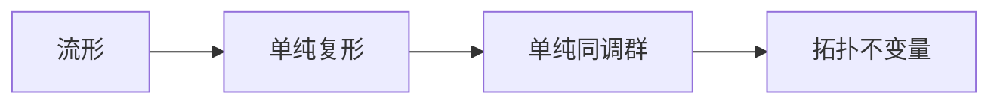

# 流形拓扑学理论与概念的实质：单纯同调群

## 1.背景介绍

拓扑学是研究空间几何性质的一门数学分支,其中流形拓扑学是拓扑学的重要组成部分。流形是一种在局部上类似于欧几里得空间,但在全局上可能有着不同拓扑结构的空间。流形拓扑学关注流形的基本性质和不变量,单纯同调群就是研究流形拓扑性质的重要工具之一。

单纯同调群源于19世纪对于曲线和曲面研究的需求,是同调论的基础概念。它为研究流形的洞穴结构和环面结构提供了有力的数学工具,在许多数学和科学领域都有着广泛的应用,如代数拓扑学、微分几何学、计算机图形学和数据分析等。

## 2.核心概念与联系

### 2.1 单纯复形

单纯复形是研究单纯同调群的基础概念。一个单纯复形由一些单纯体(点、线段、三角形等)组成,满足某些条件,例如两个单纯体的交集要么为空,要么就是它们的一个公共的面。

单纯复形可以视为对流形的一种离散化近似,因此研究单纯复形的拓扑性质就等价于研究相应流形的拓扑性质。



### 2.2 链、环和同伦

在单纯复形上,我们可以定义链、环和同伦等概念。链是单纯体的有限正式组合,环是边界为0的链。两条链之间可以通过一系列的合法操作(加、减)相互转化,如果最终可以转化为0链,则它们是同伦的。

同伦是一种等价关系,将链分为不同的等价类,每个等价类对应着一个单纯同调群中的元素。

### 2.3 单纯同调群

单纯同调群是一种代数不变量,它反映了流形的洞穴结构和环面结构。具体来说,第0同调群的阶数等于连通分量的个数,第1同调群的阶数等于环面的个数,第2同调群的阶数等于洞穴的个数,等等。

通过计算单纯同调群的阶数和性质,我们可以了解流形的拓扑结构,从而在许多应用中发挥重要作用。

## 3.核心算法原理具体操作步骤

计算单纯同调群的核心算法是基于构造边界同调复形的过程。具体步骤如下:

1. 构造单纯复形K,得到所有的单纯体集合。

2. 对每个维数n,构造由n维单纯体组成的链群C_n(K)。

3. 在C_n(K)中找出所有的n-1维边界链,生成边界子群B_n(K)。

4. 计算B_n(K)的商空间Z_n(K) = C_n(K)/B_n(K),得到n维循环子群。

5. 对Z_n(K)中的每个元素,找到其最小代表元(规范形式)。

6. H_n(K) = Z_n(K)/B_n+1(K)即为第n个单纯同调群。

```mermaid
graph TD
A[单纯复形K] --> B[链群C_n(K)]
B --> C[边界子群B_n(K)]
C --> D[循环子群Z_n(K)]
D --> E[同调群H_n(K)]
```

该算法的时间复杂度主要取决于求解链的规范形式的步骤,通常采用高斯消元法,时间复杂度为O(n^3),其中n为单纯体的个数。

## 4.数学模型和公式详细讲解举例说明

### 4.1 链群、边界算子、同伦

设K为一个单纯复形,C_n(K)表示由K中所有n维单纯体线性组合而成的链群,其元素称为n链。对任意n链c,我们可以定义边界算子$\partial_n: C_n(K) \rightarrow C_{n-1}(K)$将其映射为(n-1)链:

$$
\partial_n(\sigma) = \sum_{i=0}^n (-1)^i \dot{\sigma}_i
$$

其中$\dot{\sigma}_i$表示将$\sigma$的第i个顶点删去后所得到的(n-1)维单纯体。边界算子满足$\partial_{n-1} \circ \partial_n = 0$,因此Im$\partial_n \subset $Ker$\partial_{n-1}$。

定义n维循环群为Z_n(K) = Ker$\partial_n$,n维边界群为B_n(K) = Im$\partial_{n+1}$,则n维同调群为它们的商群:

$$
H_n(K) = Z_n(K) / B_n(K)
$$

两个链c和c'如果存在某个(n+1)链h使得$c - c' = \partial_{n+1}h$,则它们是同伦的,记为$c \sim c'$。同伦是一种等价关系,每个同伦类对应H_n(K)中的一个元素。

### 4.2 单纯同调群的计算

以下是一个计算单纯同调群的具体例子:


上图为一个由4个0单纯体、3个1单纯体和1个2单纯体组成的单纯复形K。我们有:

C_0(K) = Z_0(K) = <0,1,2,3>, 则H_0(K) = Z

C_1(K) = <(0,1), (1,2), (2,3), (3,0)>
B_1(K) = <(0,1)-(1,2)+(2,3)-(3,0)>
Z_1(K) = <(0,1)+(1,2)+(2,3)+(3,0)>
则H_1(K) = Z

C_2(K) = <(0,1,2)+(1,2,3)+(2,3,0)+(3,0,1)>  
B_2(K) = C_2(K)
Z_2(K) = 0
则H_2(K) = 0

因此,该单纯复形有1个连通分量、1个环面、0个洞穴。

## 5.项目实践:代码实例和详细解释说明

以下是一个使用Python计算单纯同调群的简单实现,基于SymPy库:

```python
from sympy import zeros, ones
from sympy.matrices import Matrix

class SimplicialComplex:
    def __init__(self, maxdim, facets):
        self.maxdim = maxdim
        self.facets = facets
        self.chains = []
        self.boundaries = []
        self.homologyGroups = []
        
        for dim in range(maxdim+1):
            self.chains.append(self.computeChains(dim))
            self.boundaries.append(self.computeBoundaries(dim))
        
        for dim in range(maxdim+1):
            Z = self.computeCycles(dim)
            B = self.boundaries[dim+1]
            H = Z.row_join(-B).row_reduce()
            self.homologyGroups.append(H)
            
    def computeChains(self, dim):
        chains = zeros(1)
        for facet in self.facets:
            if len(facet) == dim+1:
                chain = ones(1, len(self.facets))
                for i, face in enumerate(self.facets):
                    if set(face).issubset(set(facet)):
                        chain[i] = (-1)**(facet.index(face[0]))
                chains = chains.row_join(chain)
        return chains[1:,:]
        
    def computeBoundaries(self, dim):
        boundaries = zeros(1)
        for chain in self.chains[dim]:
            boundary = zeros(1, len(self.facets))
            for i, facet in enumerate(self.facets):
                if len(facet) == dim:
                    coeff = 0
                    for j, face in enumerate(self.facets):
                        if set(face) == set(facet):
                            coeff += chain[j]*(-1)**(facet.index(face[0]))
                    boundary[i] = coeff
            boundaries = boundaries.row_join(boundary)
        return boundaries[1:,:]
        
    def computeCycles(self, dim):
        return self.chains[dim].nullspace()
        
# 示例用法
facets = [(0,1,2), (1,2,3), (2,3,0), (3,0,1)]
K = SimplicialComplex(2, facets)

print("Chains:")
for i, chains in enumerate(K.chains):
    print(f"Dimension {i}:")
    print(chains)
    print()
    
print("Boundaries:")  
for i, boundaries in enumerate(K.boundaries):
    print(f"Dimension {i}:")
    print(boundaries)
    print()
    
print("Homology Groups:")
for i, H in enumerate(K.homologyGroups):
    print(f"Dimension {i}:")
    print(H)
    print()
```

上述代码定义了一个SimplicialComplex类,用于计算单纯复形的链群、边界算子和同调群。它的核心思想是:

1. 根据给定的单纯体facets,计算每个维数的链群chains。
2. 对每个维数,计算对应的边界算子boundaries。
3. 计算每个维数的循环子群cycles,作为同调群的生成元。
4. 利用cycles和boundaries计算同调群homologyGroups。

在示例中,我们构造了一个由4个0维单纯体、6个1维单纯体和4个2维单纯体组成的单纯复形,并输出了它的链群、边界算子和同调群。结果与前面的理论计算一致。

该实现的优点是简单直观,缺点是效率较低,无法处理大规模数据。在实际应用中,通常需要使用更高效的稀疏矩阵算法和规范形式计算方法。

## 6.实际应用场景

单纯同调群在许多领域都有重要应用,下面列举一些典型场景:

### 6.1 计算机图形学和网格处理

在三维建模和动画制作中,常需要对网格进行简化、细分、参数化等操作。单纯同调群可以用于检测网格的拓扑性质,确保这些操作不会改变网格的洞穴和环面结构。

### 6.2 数据分析和拓扑数据分析

单纯同调群是拓扑数据分析(TDA)的核心工具之一。通过构造数据的单纯复形,并计算其同调群,可以发现数据中的"簇"、"孔洞"和"环面"等重要拓扑特征,从而对高维数据进行可视化和分析。

### 6.3 传感器网络数据

在无线传感器网络中,单纯同调群可用于研究网络的覆盖范围、连通性和冗余度等问题。通过构造网络节点的单纯复形,并分析其同调群,可以优化网络的部署和路由。

### 6.4 机器人运动规划

在机器人运动规划中,需要确定机器人在环境中的可达区域。单纯同调群可以用于表示和分析可达区域的拓扑结构,从而设计出更加鲁棒的运动规划算法。

### 6.5 分子生物学

在分子生物学中,蛋白质的折叠结构和DNA的超螺旋结构都可以用流形来建模。单纯同调群为研究这些分子结构的拓扑性质提供了有力工具。

## 7.工具和资源推荐

### 7.1 计算工具

- Gudhi: C++开源库,提供了高效的单纯同调群计算算法。
- JavaPlex: Java开源库,支持并行计算同调群。
- Ripser: C++高性能库,专注于高维拓扑数据分析。

### 7.2 教程和文献

- Computational Topology: An Introduction by Herbert Edelsbrunner
- Elementary Applied Topology by Robert Ghrist
- A User's Guide to Computational Topology by Jeffrey Curry

### 7.3 在线课程

- 耶鲁大学的Computational Topology课程(Coursera)
- 斯坦福大学的Topological Data Analysis课程(Coursera)

## 8.总结:未来发展趋势与挑战

单纯同调群作为一种强大的数学工具,在未来必将得到更广泛的应用。一些值得关注的发展趋势包括:

1. 并行化和分布式计算,以支持处理大规模数据集。
2. 结合机器学习和人工智能,自动发现数据中的拓扑特征。
3. 应用于新兴领域,如量子计算、生物信息学和材料科学等。

同时,单纯同调群的计算也面临一些挑战:

1. 高维数据集的计算复杂度急剧增加。
2. 需要发展更高效和稳健的算法。
3. 如何将拓扑特征与其他数据特征相结合,以获得更深入的见解。

总之,单纯同调群将继续在数学、计算机科学和其他科学领域发挥重要作用