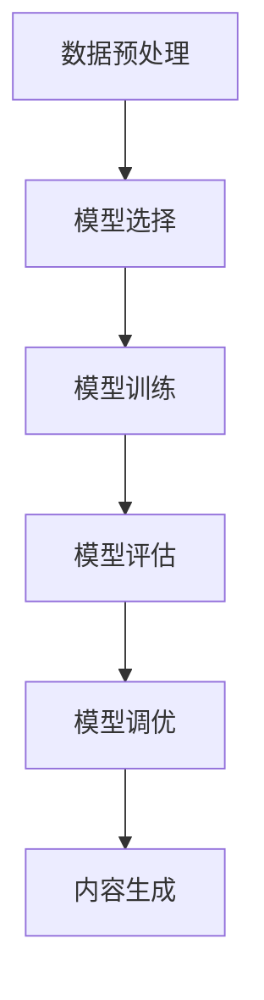

# AIGC原理与代码实例讲解

## 1.背景介绍

人工智能生成内容（AIGC，Artificial Intelligence Generated Content）是近年来迅速发展的技术领域。AIGC利用深度学习、自然语言处理和计算机视觉等技术，自动生成文本、图像、音频和视频等多种形式的内容。随着计算能力的提升和算法的进步，AIGC在内容创作、娱乐、教育、广告等领域展现出巨大的潜力。

AIGC的核心在于利用大规模数据训练模型，使其能够理解和生成符合人类审美和逻辑的内容。本文将深入探讨AIGC的核心概念、算法原理、数学模型，并通过代码实例展示其实际应用。

## 2.核心概念与联系

### 2.1 人工智能与深度学习

人工智能（AI）是计算机科学的一个分支，旨在开发能够执行通常需要人类智能的任务的系统。深度学习是AI的一个子领域，利用多层神经网络来学习和表示数据的复杂模式。

### 2.2 自然语言处理（NLP）

自然语言处理是AI的一个重要分支，涉及计算机与人类语言的交互。NLP技术包括文本生成、情感分析、机器翻译等，是AIGC生成文本内容的基础。

### 2.3 生成对抗网络（GAN）

生成对抗网络（GAN）由生成器和判别器组成，通过相互对抗的方式进行训练。生成器生成伪造数据，判别器则尝试区分真实数据和伪造数据。GAN在图像生成领域取得了显著成果。

### 2.4 变分自编码器（VAE）

变分自编码器（VAE）是一种生成模型，通过编码器将输入数据映射到潜在空间，再通过解码器从潜在空间生成数据。VAE在图像和文本生成中都有应用。

### 2.5 Transformer模型

Transformer模型是近年来NLP领域的突破性进展，基于自注意力机制，能够高效处理长序列数据。BERT、GPT等模型都是基于Transformer架构。

## 3.核心算法原理具体操作步骤

### 3.1 数据预处理

数据预处理是AIGC的第一步，包括数据清洗、归一化、分词等步骤。对于图像数据，可能需要进行图像增强和尺寸调整；对于文本数据，则需要进行分词和词向量化。

### 3.2 模型选择与训练

根据任务选择合适的模型，如GAN、VAE或Transformer。模型训练需要大量数据和计算资源，通过反向传播算法优化模型参数。

### 3.3 模型评估与调优

使用验证集评估模型性能，常用指标包括准确率、损失函数值等。根据评估结果调整模型参数和结构，进行超参数调优。

### 3.4 内容生成

训练好的模型可以用于生成内容。对于文本生成，可以输入一个起始词或句子，模型会生成后续内容；对于图像生成，可以输入一个随机向量，模型会生成对应的图像。

以下是AIGC的基本流程图：



## 4.数学模型和公式详细讲解举例说明

### 4.1 生成对抗网络（GAN）

GAN由生成器G和判别器D组成。生成器G的目标是生成逼真的数据，使判别器D无法区分真实数据和生成数据。判别器D的目标是尽可能准确地区分真实数据和生成数据。

GAN的损失函数定义为：

$$
\min_G \max_D V(D, G) = \mathbb{E}_{x \sim p_{data}(x)}[\log D(x)] + \mathbb{E}_{z \sim p_z(z)}[\log(1 - D(G(z)))]
$$

其中，$x$是真实数据，$z$是生成器的输入噪声，$p_{data}(x)$是真实数据的分布，$p_z(z)$是噪声的分布。

### 4.2 变分自编码器（VAE）

VAE通过最大化变分下界（ELBO）来训练模型。VAE的损失函数包括重构误差和KL散度：

$$
\mathcal{L} = \mathbb{E}_{q(z|x)}[\log p(x|z)] - D_{KL}(q(z|x) \| p(z))
$$

其中，$q(z|x)$是编码器输出的潜在分布，$p(x|z)$是解码器生成的重构数据分布，$p(z)$是先验分布。

### 4.3 Transformer模型

Transformer模型基于自注意力机制，计算输入序列中每个位置的注意力权重。自注意力机制的计算公式为：

$$
\text{Attention}(Q, K, V) = \text{softmax}\left(\frac{QK^T}{\sqrt{d_k}}\right)V
$$

其中，$Q$是查询矩阵，$K$是键矩阵，$V$是值矩阵，$d_k$是键向量的维度。

## 5.项目实践：代码实例和详细解释说明

### 5.1 文本生成示例

以下是使用GPT-3模型生成文本的示例代码：

```python
import openai

# 设置API密钥
openai.api_key = 'your-api-key'

# 输入提示
prompt = "在未来的世界里，人工智能将会"

# 调用GPT-3模型生成文本
response = openai.Completion.create(
    engine="davinci",
    prompt=prompt,
    max_tokens=100
)

# 输出生成的文本
print(response.choices[0].text.strip())
```

### 5.2 图像生成示例

以下是使用GAN生成图像的示例代码：

```python
import torch
import torch.nn as nn
import torch.optim as optim
from torchvision.utils import save_image

# 定义生成器
class Generator(nn.Module):
    def __init__(self):
        super(Generator, self).__init__()
        self.main = nn.Sequential(
            nn.ConvTranspose2d(100, 512, 4, 1, 0, bias=False),
            nn.BatchNorm2d(512),
            nn.ReLU(True),
            nn.ConvTranspose2d(512, 256, 4, 2, 1, bias=False),
            nn.BatchNorm2d(256),
            nn.ReLU(True),
            nn.ConvTranspose2d(256, 128, 4, 2, 1, bias=False),
            nn.BatchNorm2d(128),
            nn.ReLU(True),
            nn.ConvTranspose2d(128, 64, 4, 2, 1, bias=False),
            nn.BatchNorm2d(64),
            nn.ReLU(True),
            nn.ConvTranspose2d(64, 3, 4, 2, 1, bias=False),
            nn.Tanh()
        )

    def forward(self, input):
        return self.main(input)

# 初始化生成器
netG = Generator()

# 随机噪声输入
noise = torch.randn(64, 100, 1, 1)

# 生成图像
fake_images = netG(noise)

# 保存生成的图像
save_image(fake_images, 'generated_images.png', normalize=True)
```

## 6.实际应用场景

### 6.1 内容创作

AIGC可以用于自动生成新闻报道、小说、诗歌等文本内容，极大地提高了内容创作的效率。例如，OpenAI的GPT-3模型已经能够生成高质量的文章和对话。

### 6.2 图像生成

AIGC在图像生成领域有广泛应用，如生成艺术作品、设计图案、生成虚拟人物等。GANs在生成逼真图像方面表现出色，已经被应用于游戏开发、电影制作等领域。

### 6.3 音频和视频生成

AIGC还可以生成音频和视频内容，如自动生成音乐、配音、视频剪辑等。Deepfake技术利用GAN生成逼真的视频，虽然存在伦理问题，但也展示了AIGC的强大能力。

### 6.4 教育和培训

AIGC可以用于生成教育内容，如自动生成练习题、教学视频等，帮助教师提高教学效率，学生获得个性化的学习体验。

## 7.工具和资源推荐

### 7.1 开源框架

- TensorFlow：谷歌开发的深度学习框架，支持多种神经网络模型的构建和训练。
- PyTorch：Facebook开发的深度学习框架，具有灵活的动态计算图和强大的社区支持。
- Hugging Face Transformers：提供预训练的Transformer模型，支持多种NLP任务。

### 7.2 数据集

- ImageNet：大规模图像数据集，广泛用于图像分类和生成任务。
- COCO：图像数据集，包含丰富的图像和标注信息，适用于图像生成和目标检测任务。
- OpenAI GPT-3：预训练的语言模型，支持文本生成、翻译、问答等任务。

### 7.3 在线资源

- arXiv：提供最新的AI和深度学习研究论文，了解前沿技术和算法。
- GitHub：开源代码库，包含大量AIGC相关项目和代码示例。
- Coursera和edX：提供AI和深度学习的在线课程，适合初学者和进阶学习者。

## 8.总结：未来发展趋势与挑战

AIGC技术在不断发展，未来有望在更多领域展现其潜力。然而，AIGC也面临一些挑战，如生成内容的真实性和伦理问题、模型训练的高计算成本等。未来的研究方向包括提高生成内容的质量和多样性、降低模型训练成本、解决伦理和法律问题等。

### 8.1 发展趋势

- 多模态生成：结合文本、图像、音频等多种模态，生成更加丰富和逼真的内容。
- 个性化生成：根据用户的偏好和需求，生成个性化的内容，提高用户体验。
- 实时生成：提高生成速度，实现实时内容生成，应用于游戏、直播等场景。

### 8.2 挑战

- 真实性和伦理问题：生成内容的真实性和伦理问题需要引起重视，避免虚假信息和不良内容的传播。
- 计算成本：模型训练和推理的高计算成本是AIGC面临的主要挑战之一，需要优化算法和硬件。
- 法律和监管：AIGC技术的发展需要法律和监管的支持，确保技术的合理使用和发展。

## 9.附录：常见问题与解答

### 9.1 AIGC生成的内容是否具有版权？

AIGC生成的内容的版权问题目前尚无明确规定。一般来说，生成内容的版权归属于模型的开发者或使用者，但具体情况需要根据法律和实际情况判断。

### 9.2 如何提高AIGC生成内容的质量？

提高AIGC生成内容的质量可以从以下几个方面入手：
- 使用高质量和多样化的数据进行训练。
- 选择合适的模型和算法，并进行充分的调优。
- 结合多模态信息，提高生成内容的丰富性和逼真度。

### 9.3 AIGC技术是否会取代人类创作？

AIGC技术可以提高内容创作的效率，但难以完全取代人类创作。人类的创造力和情感表达是AIGC难以替代的，未来AIGC将更多地作为人类创作的辅助工具。

### 9.4 如何应对AIGC带来的伦理问题？

应对AIGC带来的伦理问题需要多方合作，包括技术开发者、法律监管机构和社会公众。技术开发者应注重技术的伦理设计，法律监管机构应制定相关法规，社会公众应提高对AIGC技术的认识和警惕。

### 9.5 AIGC技术的未来发展方向是什么？

AIGC技术的未来发展方向包括多模态生成、个性化生成和实时生成等。随着技术的不断进步，AIGC将在更多领域展现其潜力，带来更多创新和变革。

---

作者：禅与计算机程序设计艺术 / Zen and the Art of Computer Programming