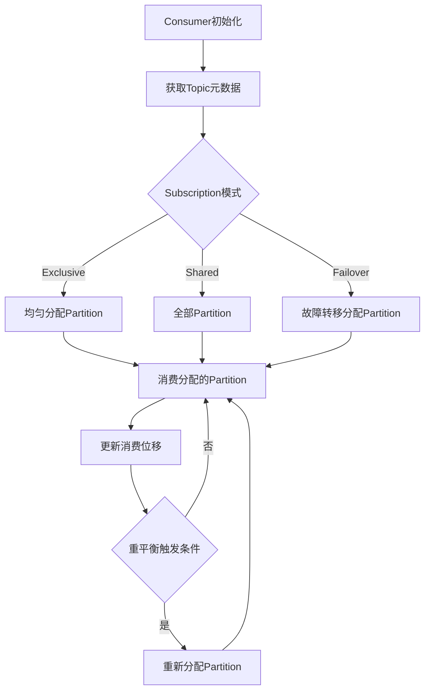

# Pulsar Consumer原理与代码实例讲解

## 1. 背景介绍

Apache Pulsar是一个云原生、分布式的消息流处理平台,旨在提供可扩展、高性能的发布/订阅消息队列服务。作为一种新兴的消息传递系统,Pulsar具有多租户、多集群、多事件流的特性,并支持多种消费模型,包括独占、共享和故障转移等。Pulsar Consumer是指订阅并消费消息的客户端,它扮演着关键的角色,直接影响消息的传递效率和可靠性。

## 2. 核心概念与联系

### 2.1 Topic

Topic是Pulsar中的逻辑消息通道,生产者向其中发送消息,消费者从中消费消息。一个Topic可以包含多个Partition,每个Partition在集群中有多个副本,以提供故障转移和负载均衡。

### 2.2 Subscription

Subscription表示消费者订阅Topic的方式。Pulsar支持三种订阅模式:

1. **Exclusive**: 消息在订阅者之间进行分区,每条消息只能被一个消费者处理。
2. **Shared**: 消息在所有消费者之间广播,每条消息会被所有消费者接收并处理。适用于扇出场景。
3. **Failover**: 消息在订阅者之间进行分区,与Exclusive类似,但支持故障转移,当一个消费者失效时,其分区会自动分配给其他消费者。

### 2.3 Consumer

Consumer是Pulsar客户端中用于消费消息的组件。每个Consumer都属于一个Subscription,并遵循相应的消费语义。Consumer通过调用`receive()`方法从Broker接收消息。

### 2.4 ConsumerGroup

ConsumerGroup是指订阅同一个Topic的所有Consumer的集合。在Exclusive和Failover模式下,Topic的每个Partition只能被ConsumerGroup中的一个Consumer消费。

## 3. 核心算法原理具体操作步骤

Pulsar Consumer的核心算法原理涉及以下几个关键步骤:

1. **Consumer初始化**

   Consumer在初始化时需要指定订阅的Topic以及Subscription模式。Pulsar Client会与Broker建立TCP连接,并获取Topic的元数据信息,包括Partition分布和当前消费位置等。

2. **Partition分配**

   根据Subscription模式的不同,Pulsar采用不同的Partition分配策略:

   - **Exclusive**: 将Topic的所有Partition均匀分配给ConsumerGroup中的Consumer。
   - **Shared**: 所有Consumer都会收到所有Partition的消息副本。
   - **Failover**: 类似Exclusive,但支持故障转移,当某个Consumer失效时,其Partition会重新分配给其他Consumer。

3. **消息消费**

   Consumer根据分配的Partition,向相应的Broker发送`receive()`请求,获取消息数据。对于Exclusive和Failover模式,Consumer只能消费分配给自己的Partition;对于Shared模式,Consumer会接收所有Partition的消息副本。

4. **消费位移跟踪**

   为了实现消费位移的持久化和故障恢复,Pulsar会为每个Consumer维护一个独立的消费位移,记录已消费的最后一条消息。Consumer重启后可以从上次的位移处继续消费。

5. **重平衡和故障转移**

   当ConsumerGroup中的Consumer实例数量发生变化时,或者某个Consumer失效,Pulsar会触发重平衡过程,重新分配Partition。这确保了消息不会丢失,也不会被重复消费。

下面是Pulsar Consumer的基本工作流程图:



## 4. 数学模型和公式详细讲解举例说明

在Pulsar中,消费者的分配和重平衡过程涉及一些数学模型和公式,以实现高效、均衡的分区分配。

### 4.1 Partition分配算法

Pulsar采用一种环形的哈希分区分配算法,将Topic的所有Partition均匀映射到一个环形的哈希空间。每个Consumer也会被映射到该哈希空间中。分配过程是将每个Partition分配给其在环上的顺时针最近的Consumer。

设Topic有$n$个Partition,ConsumerGroup有$m$个Consumer,则每个Consumer平均需要分配$\frac{n}{m}$个Partition。具体分配过程如下:

1. 计算每个Partition的哈希值:$hash(partition_i), i=0,1,...,n-1$
2. 计算每个Consumer的哈希值:$hash(consumer_j), j=0,1,...,m-1$
3. 对于每个Partition $partition_i$,找到在环上顺时针方向最近的Consumer $consumer_j$,将$partition_i$分配给$consumer_j$

这种算法可以保证Partition在Consumer之间的均匀分布,并且在Consumer实例数量发生变化时,只需重新计算少量Partition的分配,从而降低重平衡开销。

### 4.2 消费位移更新策略

Pulsar采用了一种基于时间批处理的消费位移更新策略,通过控制更新频率来权衡消费位移的持久化开销和消息重复消费的风险。

设定一个时间窗口$T$,在该窗口内,Consumer会缓存已消费的消息位移,但不会立即持久化。当时间窗口结束时,Consumer会将缓存的位移一次性持久化到Broker。这样可以减少与Broker的网络交互,提高吞吐量。

但是,如果Consumer在时间窗口内失效,则需要从上次持久化的位移处重新消费,可能会导致部分消息重复消费。为了降低这种风险,Pulsar引入了一个重复消费窗口$W$,它表示允许重复消费的最大消息时间范围。只要$W$小于应用可以容忍的重复范围,就不会影响业务逻辑。

因此,在设置$T$和$W$时,需要权衡消费位移持久化开销和重复消费风险。通常情况下,$T$设置为几秒到几分钟,$W$设置为几小时到几天,具体取决于应用场景和性能需求。

## 5. 项目实践:代码实例和详细解释说明

下面是一个使用Java客户端库消费Pulsar消息的示例代码,并对关键步骤进行解释说明。

```java
import org.apache.pulsar.client.api.Consumer;
import org.apache.pulsar.client.api.PulsarClient;
import org.apache.pulsar.client.api.PulsarClientException;
import org.apache.pulsar.client.api.SubscriptionType;

public class PulsarConsumerExample {
    public static void main(String[] args) throws PulsarClientException {
        // 1. 创建Pulsar客户端实例
        PulsarClient client = PulsarClient.builder()
                .serviceUrl("pulsar://localhost:6650")
                .build();

        // 2. 创建Consumer,指定Topic、Subscription和消费模式
        Consumer<byte[]> consumer = client.newConsumer()
                .topic("my-topic")
                .subscriptionName("my-subscription")
                .subscriptionType(SubscriptionType.Shared)
                .subscribe();

        // 3. 循环接收消息
        while (true) {
            // 调用receive()方法获取消息,超时时间设为1秒
            org.apache.pulsar.client.api.Message<byte[]> msg = consumer.receive(1, TimeUnit.SECONDS);
            if (msg != null) {
                // 处理接收到的消息
                byte[] data = msg.getData();
                System.out.println("Received message: " + new String(data));

                // 确认消息已被成功消费
                consumer.acknowledge(msg);
            } else {
                // 超时,无消息可消费
                System.out.println("No message received");
            }
        }

        // 4. 关闭Consumer和客户端
        // consumer.close();
        // client.close();
    }
}
```

代码解释:

1. 首先,创建Pulsar客户端实例,指定Broker的服务URL。
2. 使用`client.newConsumer()`方法创建一个Consumer实例,指定订阅的Topic名称、Subscription名称和消费模式(本例使用Shared模式)。
3. 进入循环,调用`consumer.receive()`方法从Broker接收消息。该方法是阻塞式的,可以设置超时时间。
4. 如果接收到消息,处理消息数据并调用`consumer.acknowledge()`确认消息已被成功消费。
5. 如果超时,输出"No message received"。
6. 最后,关闭Consumer和客户端实例(本例省略了这一步)。

需要注意的是,这只是一个最基本的示例,在实际应用中还需要考虑错误处理、重试策略、消费位移管理等问题,以确保消息的可靠传递。

## 6. 实际应用场景

Pulsar Consumer广泛应用于各种需要可靠、高效消息传递的场景,例如:

1. **数据管道和ETL**: 将数据从各种来源(如日志文件、数据库、传感器等)实时采集到Pulsar Topic,然后由Consumer从Topic消费数据,进行数据转换、清洗和加载到数据湖或数据仓库中。

2. **微服务和事件驱动架构**: 在微服务架构中,各个微服务通过发布/订阅消息进行解耦和通信。Consumer订阅相关Topic,接收并处理其他服务发布的事件或消息。

3. **物联网(IoT)和实时数据处理**: 在IoT场景中,大量的传感器和设备会持续产生海量数据流。Consumer可以高效地从Pulsar集群消费这些数据,进行实时处理、分析和响应。

4. **流媒体和在线服务**: 直播、在线视频等服务需要将媒体数据实时分发给大量观众。Consumer可以高效地从Pulsar集群拉取媒体数据流,并分发给各个客户端。

5. **金融风控和交易处理**: 在金融领域,实时风控和交易处理对消息传递的可靠性和低延迟有着极高的要求。Pulsar Consumer可以确保关键消息的准确传递和处理。

总的来说,Pulsar Consumer凭借其高效、可靠、可扩展的特性,非常适合于需要实时处理大量数据流的各种应用场景。

## 7. 工具和资源推荐

在使用和管理Pulsar Consumer时,有一些有用的工具和资源可以提高效率和可观测性:

1. **Pulsar管理工具**:
   - `pulsar-admin`: Pulsar自带的命令行管理工具,可用于创建Topic、Subscription,查看集群状态等。
   - `Pulsar Manager`: Pulsar的Web UI管理界面,提供了直观的监控和管理功能。

2. **监控和指标**:
   - **Prometheus**: 开源的监控系统,可以通过Pulsar的Prometheus远程写入器收集各种指标。
   - **Grafana**: 基于Prometheus数据源的可视化监控Dashboard。

3. **日志和跟踪**:
   - **Logstash**: 用于收集和处理Pulsar的日志数据。
   - **Elasticsearch**: 存储和搜索日志数据。
   - **Kibana**: 可视化查看和分析日志数据。
   - **Jaeger**: 开源的分布式跟踪系统,可用于跟踪Pulsar Consumer的执行过程。

4. **客户端库**:
   - **Java客户端**: Pulsar官方提供的Java客户端库,功能完备,文档详细。
   - **C++客户端**: 适用于对性能和资源占用有较高要求的场景。
   - **Python客户端**: 适合快速开发和原型设计。
   - **Go客户端**: 适用于构建云原生应用和微服务。

5. **示例和参考资料**:
   - **Pulsar官方文档**: https://pulsar.apache.org/docs/
   - **Pulsar客户端示例**: https://github.com/apache/pulsar/tree/master/pulsar-client-tools
   - **Pulsar Book**: https://pulsar.apache.org/docs/en/next/books/

通过合理利用这些工具和资源,可以更好地开发、部署、监控和维护Pulsar Consumer应用。

## 8. 总结:未来发展趋势与挑战

作为一种新兴的消息传递系统,Pulsar在未来的发展中仍面临一些趋势和挑战:

1. **云原生和Kubernetes集成**: 随着云原生技术的不断发展,Pulsar需要进一步加强与Kubernetes的集成,实现更好的自动化部署、扩缩容和运维管理。

2. **流处理和事件驱动架构**: 越来越多的应用采用事