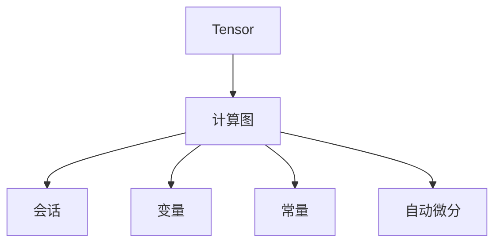
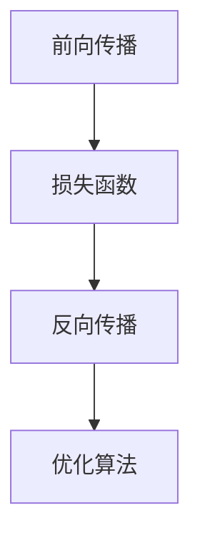

# TensorFlow 原理与代码实战案例讲解

## 1.背景介绍

TensorFlow 是由 Google Brain 团队开发的开源机器学习框架，自2015年发布以来，迅速成为深度学习领域的主流工具。其强大的计算能力和灵活的架构设计，使得研究人员和工程师能够高效地构建、训练和部署复杂的机器学习模型。本文将深入探讨 TensorFlow 的核心概念、算法原理、数学模型，并通过实际代码实例展示其应用。

## 2.核心概念与联系

### 2.1 Tensor
Tensor 是 TensorFlow 的基本数据结构，可以看作是多维数组。TensorFlow 中的张量有三种属性：名称、维度和数据类型。

### 2.2 计算图
计算图是 TensorFlow 的核心概念之一，它定义了计算操作的依赖关系。计算图由节点和边组成，节点表示操作，边表示数据流。

### 2.3 会话
会话（Session）是 TensorFlow 执行计算图的环境。通过会话，用户可以执行计算图中的操作，并获取结果。

### 2.4 变量与常量
变量和常量是 TensorFlow 中的两种重要数据类型。变量在训练过程中可以改变，而常量在计算图构建后不可变。

### 2.5 自动微分
自动微分是 TensorFlow 的一大特色，它能够自动计算梯度，从而简化了反向传播算法的实现。



## 3.核心算法原理具体操作步骤

### 3.1 前向传播
前向传播是指从输入层到输出层的计算过程。其目的是通过一系列的线性和非线性变换，得到模型的预测结果。

### 3.2 损失函数
损失函数用于衡量模型预测结果与真实值之间的差距。常见的损失函数包括均方误差（MSE）和交叉熵损失。

### 3.3 反向传播
反向传播是通过计算损失函数相对于模型参数的梯度，来更新模型参数的过程。TensorFlow 的自动微分功能极大地简化了这一过程。

### 3.4 优化算法
优化算法用于更新模型参数，以最小化损失函数。常见的优化算法包括梯度下降、Adam 和 RMSProp。



## 4.数学模型和公式详细讲解举例说明

### 4.1 线性回归
线性回归是最简单的机器学习模型之一，其目标是找到一条直线，使得数据点到直线的距离最小。其数学模型为：
$$
y = wx + b
$$
其中，$w$ 是权重，$b$ 是偏置，$x$ 是输入，$y$ 是输出。

### 4.2 损失函数
对于线性回归，常用的损失函数是均方误差（MSE）：
$$
L = \frac{1}{n} \sum_{i=1}^{n} (y_i - \hat{y}_i)^2
$$
其中，$n$ 是样本数量，$y_i$ 是真实值，$\hat{y}_i$ 是预测值。

### 4.3 梯度下降
梯度下降算法用于最小化损失函数，其更新公式为：
$$
w = w - \eta \frac{\partial L}{\partial w}
$$
$$
b = b - \eta \frac{\partial L}{\partial b}
$$
其中，$\eta$ 是学习率。

## 5.项目实践：代码实例和详细解释说明

### 5.1 环境配置
首先，确保已安装 TensorFlow。可以使用以下命令安装：
```bash
pip install tensorflow
```

### 5.2 数据准备
我们将使用一个简单的线性回归示例。首先，生成一些模拟数据：
```python
import numpy as np

# 生成数据
X = np.linspace(0, 10, 100)
y = 2 * X + 1 + np.random.randn(100) * 0.5
```

### 5.3 构建模型
使用 TensorFlow 构建线性回归模型：
```python
import tensorflow as tf

# 定义变量
W = tf.Variable(np.random.randn(), name="weight")
b = tf.Variable(np.random.randn(), name="bias")

# 构建模型
def linear_regression(X):
    return W * X + b

# 损失函数
def mean_square_error(y_true, y_pred):
    return tf.reduce_mean(tf.square(y_true - y_pred))

# 优化器
optimizer = tf.optimizers.SGD(learning_rate=0.01)
```

### 5.4 训练模型
定义训练步骤并进行训练：
```python
# 训练步骤
def train_step(X, y):
    with tf.GradientTape() as tape:
        y_pred = linear_regression(X)
        loss = mean_square_error(y, y_pred)
    gradients = tape.gradient(loss, [W, b])
    optimizer.apply_gradients(zip(gradients, [W, b]))
    return loss

# 训练模型
for epoch in range(1000):
    loss = train_step(X, y)
    if epoch % 100 == 0:
        print(f"Epoch {epoch}: Loss = {loss.numpy()}")
```

### 5.5 结果可视化
使用 Matplotlib 可视化结果：
```python
import matplotlib.pyplot as plt

# 预测结果
y_pred = linear_regression(X)

# 绘制结果
plt.scatter(X, y, label='Data')
plt.plot(X, y_pred, color='red', label='Fitted line')
plt.legend()
plt.show()
```

## 6.实际应用场景

### 6.1 图像分类
TensorFlow 广泛应用于图像分类任务，如手写数字识别、物体检测等。通过卷积神经网络（CNN），可以高效地提取图像特征，实现高精度的分类。

### 6.2 自然语言处理
在自然语言处理（NLP）领域，TensorFlow 被用于构建各种模型，如情感分析、机器翻译和文本生成。通过循环神经网络（RNN）和 Transformer 模型，可以处理序列数据，实现复杂的语言任务。

### 6.3 强化学习
TensorFlow 也被用于强化学习（RL）任务，如游戏 AI 和机器人控制。通过深度 Q 网络（DQN）和策略梯度方法，可以训练智能体在复杂环境中进行决策。

## 7.工具和资源推荐

### 7.1 TensorFlow 官方文档
TensorFlow 官方文档是学习和参考的最佳资源，提供了详细的 API 说明和示例代码。

### 7.2 TensorFlow Hub
TensorFlow Hub 是一个模型库，提供了预训练的模型和模块，方便用户快速构建和部署模型。

### 7.3 TensorBoard
TensorBoard 是 TensorFlow 的可视化工具，可以用于监控训练过程、查看模型结构和分析性能。

### 7.4 在线课程
Coursera 和 Udacity 提供了多门 TensorFlow 相关的在线课程，适合不同层次的学习者。

## 8.总结：未来发展趋势与挑战

TensorFlow 作为深度学习领域的主流框架，未来的发展趋势包括：

### 8.1 更高效的计算
随着硬件技术的发展，TensorFlow 将继续优化计算性能，支持更多的硬件加速器，如 TPU 和 GPU。

### 8.2 更友好的用户体验
TensorFlow 将不断改进用户体验，提供更简洁的 API 和更强大的工具，降低使用门槛。

### 8.3 跨平台部署
TensorFlow 将进一步增强跨平台部署能力，支持更多的移动设备和嵌入式系统，实现模型的广泛应用。

然而，TensorFlow 也面临一些挑战，如模型的可解释性和数据隐私问题。研究人员和工程师需要不断探索和创新，解决这些问题，推动深度学习技术的发展。

## 9.附录：常见问题与解答

### 9.1 如何解决内存不足问题？
可以通过减少批量大小、使用更小的模型或增加硬件资源来解决内存不足问题。

### 9.2 如何提高模型的训练速度？
可以使用硬件加速器（如 GPU 或 TPU）、优化数据输入管道和调整超参数来提高模型的训练速度。

### 9.3 如何处理过拟合问题？
可以通过增加正则化、使用数据增强和交叉验证等方法来处理过拟合问题。

### 9.4 如何选择合适的优化算法？
可以根据具体任务和数据特点选择合适的优化算法，如梯度下降、Adam 和 RMSProp 等。

### 9.5 如何调试 TensorFlow 代码？
可以使用 TensorBoard 进行可视化调试，或者使用 Python 的调试工具（如 pdb）进行逐步调试。

---

作者：禅与计算机程序设计艺术 / Zen and the Art of Computer Programming